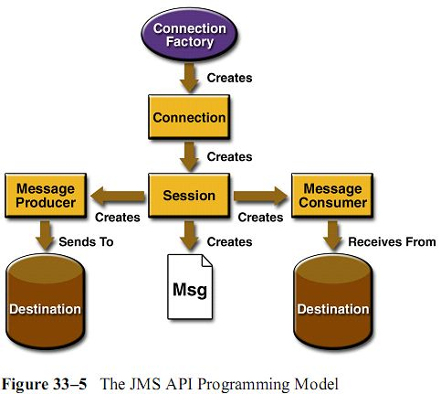

## ActiveMQ-JMS消息结构分析、理解JMS可靠性机制

1. ActiveMQ-JMS消息结构分析

    JMS中消息的基本结构：

    * 消息头
    * 消息属性
    * 消息体

    1. 消息头

        消息的Headers部分通常包含一些消息的描述信息，它们都是标准的描述信息。

        消息头包含标准的，必不可少的消息信息，比如每个消息的ID，优先级，时间戳，目标等。这些信息大部分都在消息发送到目的地之前自动设定。

        消息头的信息可以通过：
        ```java
        javax.jms
        public interface Message
        ```
        set / get 方法存取，如setJMSType，getJMSType等。

        下面是一些标准的消息头描述信息：

        * JMSDestination   —— 消息的目的地，TOPIC或是QUEUE
        * JMSDeliveryMode  —— 消息的发送模式：persistent或nonpersistent。前者表示消息在被消费之前，如果JMS提供者（如active mq）DOWN了，重新启动后消息仍然存在。后者在这种情况下表示消息会被丢失。

            可以通过下面的方式设置：

            Producer.setDeliveryMode(DeliveryMode.NON_PERSISTENT);
        * JMSTimestamp     —— 当调用send()方法的时候，JMSTimestamp会被自动设置为当前时间
        * JMSExpiration    —— 表示一个消息的有效期。只有在这个有效期内，消息消费者才可以消费这个消息。默认值为0，表示消息永不过期。

            可以通过下面的方式设置：

            producer.setTimeToLive(3600000); //有效期1小时 （1000毫秒 * 60 * 60分）
        * JMSPriority      —— 消息的优先级。0-4为正常的优先级，5-9为高优先级。

           可以通过下面方式设置：
           producer.setPriority(9)

        * JMSMessageID     —— 一个字符串用来唯一标示一个消息
        * JMSReplyTo       —— 有时消息生产者希望消费者回复一个消息，JMSReplyTo为一个Destination，表示需要回复的目的地。当然消费者可以不理会它
        * JMSCorrelationID —— 通常用来关联多个Message。例如需要回复一个消息，可以把JMSCorrelationID设置为所收到的消息的

    2. 消息属性

        除了Header，消息发送者可以添加一些属性(Properties)。这些属性可以是应用自定义的属性。

    3. 消息体
    
        消息体是实际的消息内容；JMS支持多种格式的消息体，如：

        * BytesMessage
        * MapMessage
        * ObjectMessage
        * StreamMessage
        * TestMessage

2. JMS可靠性机制
    1. 消息接收确认

        JMS消息只有在被确认之后，才认为已经被成功的消费了，消息的成功消费通常包含三个阶段：客户接收消息，客户处理消息和消息被确认

        在事务性会话中，当一个事务被提交的时候，确认自动发生。在非事务性会话中，消息何时被确认取决于创建会话时的应答模式。改参数有三个可选值

        * Session.AUTO_ACKNOWLEDGE：当客户成功的从receive方法返回的时候，或者从MessageListener.onMessage方法成功返回的时候，会话自动确认客户收到的消息。

        * Session.CLIENT_ACKNOWLEDGE:客户通过调用消息的acknowledge方法确认消息。需要注意的是，在这种模式中，确认是在会话层上进行，确认一个被消费的消息，将自动确认所有已被会话消费的消息。例如，如果一个消息消费者消费了10个消息，然后确认第5个消息，那么所有10个消息都被确认。

        * Session.DUPS_ACKNOWLEDGE:该选择只是会话迟钝的确认消息的提交。如果JMS Provider失败，那么可能会导致一些重复的消息。如果是重复的消息，那么JMS provider必须把消息头的JMSRedelivered字段设置为true

    2. 消息持久性
    
        JMS支持以下两种消息提交模式：
        * PERSISTENT：指示JMS provider持久保存消息，以保证消息不会因为JMS provider的失败而丢失

        * NON_PERSISTENT:不要求JMS provider持久保存消息

    3. 消息优先级

    4. 消息过期

        可以设置消息在一定时间后过期，默认是永不过期

    5. 消息的临时目的地

        可以通过会话上的session.createTemporaryQueue("queue")和createTemporaryTopic方法来创建临时目的地。

        它们的存在时间只限于创建它们的连接所保持的时间。只有创建该临时目的地的连接上的消息消费者才能够从临时目的地中提取消息

    6. 持久订阅

        首先消息生产者必须使用PERSISTENT提交消息。客户可以通过会话上的createDurableSubscriber方法来创建一个持久订阅，该方法的第一个参数必须是一个topic。第二个参数是订阅的名称。

        JMS provider 会存储发布到持久订阅对应的topic上的消息。如果最初创建的持久订阅的客户或者任何其他客户，使用相同的连接工厂和链接的客户ID，相同的主题和相同的订阅名，再次调用会话上的createDurableSubscriber方法，那么该持久订阅就会被激活。JMS provider会向客户发送客户出于非激活状态时所发布的消息。

        持久订阅在某个时刻只能有一个激活的订阅者。持久订阅在床加你之后会一直保留，知道应用程序挑用会话上的unsubscribe（取消订阅）方法。

    7. 本地事务

    8. 消息的持久订阅和非持久订阅

        非持久订阅只有当客户端出于激活状态，也就是和JMS Provider保持连接状态才能收到发送到某个主题的消息，而当客户端出于离线 状态，这个时间段发到主题的消息将会丢失，永远不会收到

        持久订阅，客户端向JMS注册一个识别自己身份的ID，当这个客户端出于离线状态时，JMS Provider会为这个ID保存所有发送到主题的消息，当客户再次连接到JMS Provider时，会根据自己的ID得到所有当自己出于离线时发送到主题的消息。

        如果用户在receive方法中设定了消息选择条件，那么不符合条件的消息不会被接收

        非持久订阅状态下，不能恢复和重新派送一个未签收的消息，只有持久订阅才能恢复或重新派送一个未签收的消息

        当所有消息必须被接收则用持久订阅，当丢失消息能够被容忍，则使用非持久订阅

    9. JMS API 结构图

        
参考：

https://blog.csdn.net/robinjwong/article/details/38822013