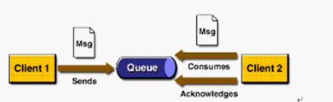
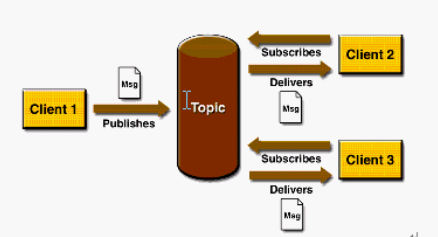
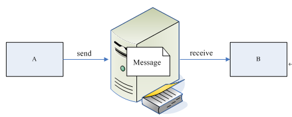

## ActiveMQ-JMS的基本概念、PTP、PubSub域分析

1. JMS的基本概念

    JMS是java的消息服务，JMS的客户端之间可以通过JMS服务进行异步的消息传输。

2. 消息模型
    * PTP：Point-to-Poin

        1. P2P模式图

            
        2. 涉及到的概念 
            1. 消息队列（Queue）
            2. 发送者(Sender)
            3. 接收者(Receiver)
            4. 每个消息都被发送到一个特定的队列，接收者从队列中获取消息。队列保留着消息，直到他们被消费或超时。

        3. P2P的特点
            1. 每个消息只有一个消费者（Consumer）(即一旦被消费，消息就不再在消息队列中)
            2. 发送者和接收者之间在时间上没有依赖性，也就是说当发送者发送了消息之后，不管接收者有没有正在运行，它不会影响到消息被发送到队列
            3. 接收者在成功接收消息之后需向队列应答成功

        如果你希望发送的每个消息都应该被成功处理的话，那么你需要P2P模式。

    * PubSub：Publish/Subscribe
        1. Pub/Sub模式图

            

        2. 涉及到的概念 
            1. 主题（Topic）
            2. 发布者（Publisher）
            3. 订阅者（Subscriber） 

            客户端将消息发送到主题。多个发布者将消息发送到Topic,系统将这些消息传递给多个订阅者。

        3. Pub/Sub的特点
            1. 每个消息可以有多个消费者
            2. 发布者和订阅者之间有时间上的依赖性。针对某个主题（Topic）的订阅者，它必须创建一个订阅者之后，才能消费发布者的消息，而且为了消费消息，订阅者必须保持运行的状态。
            3. 为了缓和这样严格的时间相关性，JMS允许订阅者创建一个可持久化的订阅。这样，即使订阅者没有被激活（运行），它也能接收到发布者的消息。

        如果你希望发送的消息可以不被做任何处理、或者被一个消息者处理、或者可以被多个消费者处理的话，那么可以采用Pub/Sub模型

3. 消息的消费

    在JMS中，消息的产生和消息是异步的。对于消费来说，JMS的消息者可以通过两种方式来消费消息。
    * 同步

        订阅者或接收者调用receive方法来接收消息，receive方法在能够接收到消息之前（或超时之前）将一直阻塞
    * 异步

        订阅者或接收者可以注册为一个消息监听器。当消息到达之后，系统自动调用监听器的onMessage方法。

4. JMS编程模型

    1. ConnectionFactory

        创建Connection对象的工厂，针对两种不同的jms消息模型，分别有QueueConnectionFactory和TopicConnectionFactory两种。可以通过JNDI来查找ConnectionFactory对象。

    2. Connection

        Connection表示在客户端和JMS系统之间建立的链接（对TCP/IP socket的包装）。Connection可以产生一个或多个Session。跟ConnectionFactory一样，Connection也有两种类型：QueueConnection和TopicConnection。

    3. Session

        Session是我们操作消息的接口。可以通过session创建生产者、消费者、消息等。Session提供了事务的功能。当我们需要使用session发送/接收多个消息时，可以将这些发送/接收动作放到一个事务中。同样，也分QueueSession和TopicSession。

    4. Destination

        Destination的意思是消息生产者的消息发送目标或者说消息消费者的消息来源。对于消息生产者来说，它的Destination是某个队列（Queue）或某个主题（Topic）;对于消息消费者来说，它的Destination也是某个队列或主题（即消息来源）。

        所以，Destination实际上就是两种类型的对象：Queue、Topic可以通过JNDI来查找Destination。

    5. 消息的生产者

        消息生产者由Session创建，并用于将消息发送到Destination。同样，消息生产者分两种类型：QueueSender和TopicPublisher。可以调用消息生产者的方法（send或publish方法）发送消息。

    6. 消息消费者

        消息消费者由Session创建，用于接收被发送到Destination的消息。两种类型：QueueReceiver和TopicSubscriber。可分别通过session的createReceiver(Queue)或createSubscriber(Topic)来创建。当然，也可以session的creatDurableSubscriber方法来创建持久化的订阅者。

    7. MessageListener

        消息监听器。如果注册了消息监听器，一旦消息到达，将自动调用监听器的onMessage方法。EJB中的MDB（Message-Driven Bean）就是一种MessageListener。

5. 企业消息系统的好处

    我们先来看看下图，应用程序A将Message发送到服务器上，然后应用程序B从服务器中接收A发来的消息，通过这个图我们一起来分析一下JMS的好处：

    
    
    * 提供消息灵活性
    * 松散耦合
    * 异步性

参考：
https://blog.csdn.net/qqyb2000/article/details/78221772