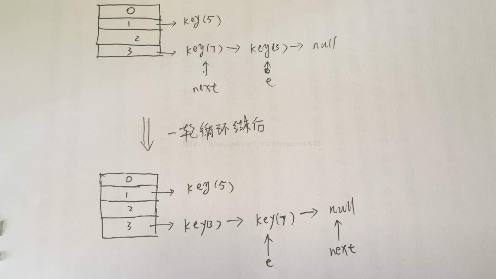
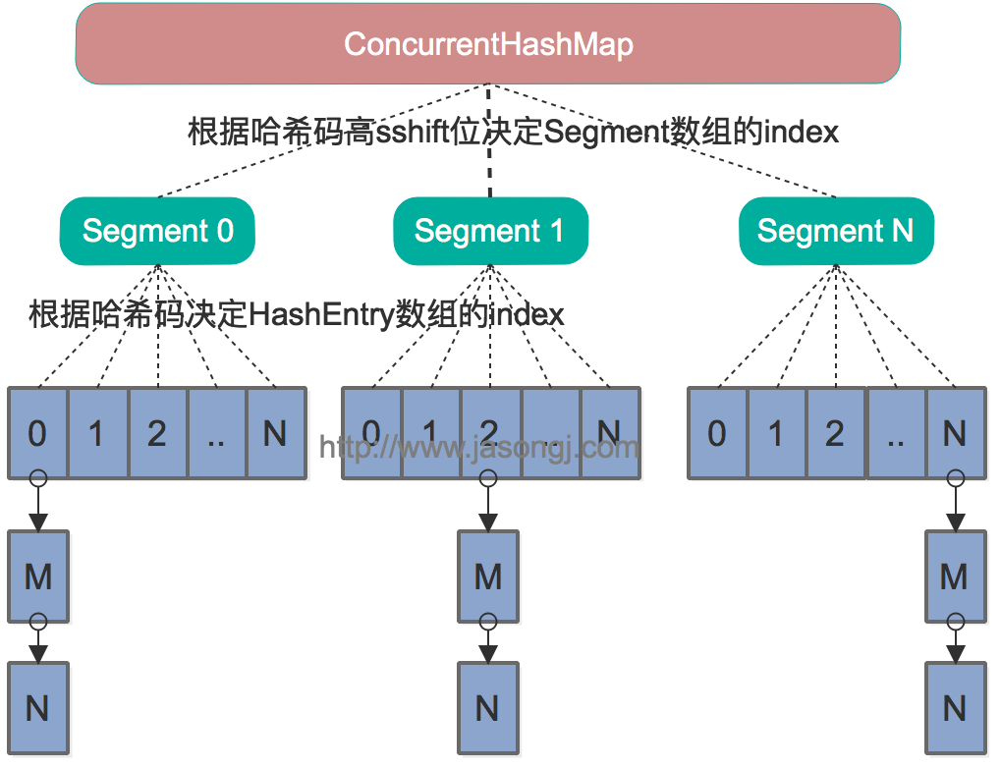
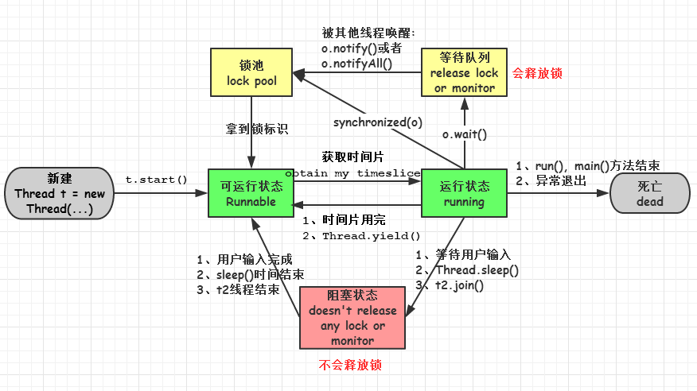
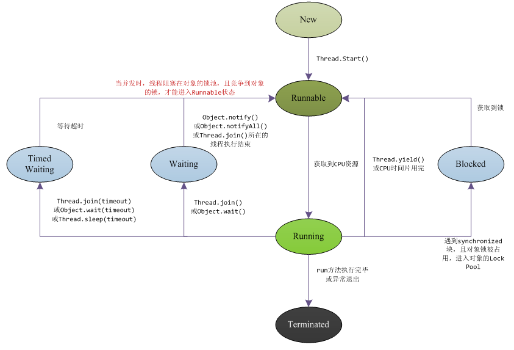
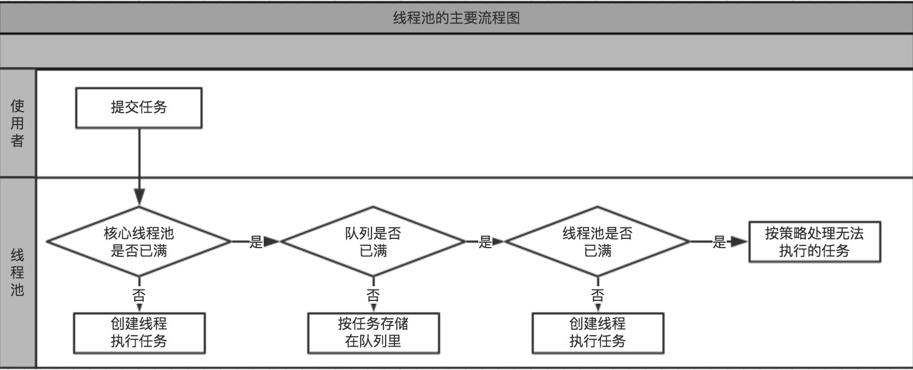
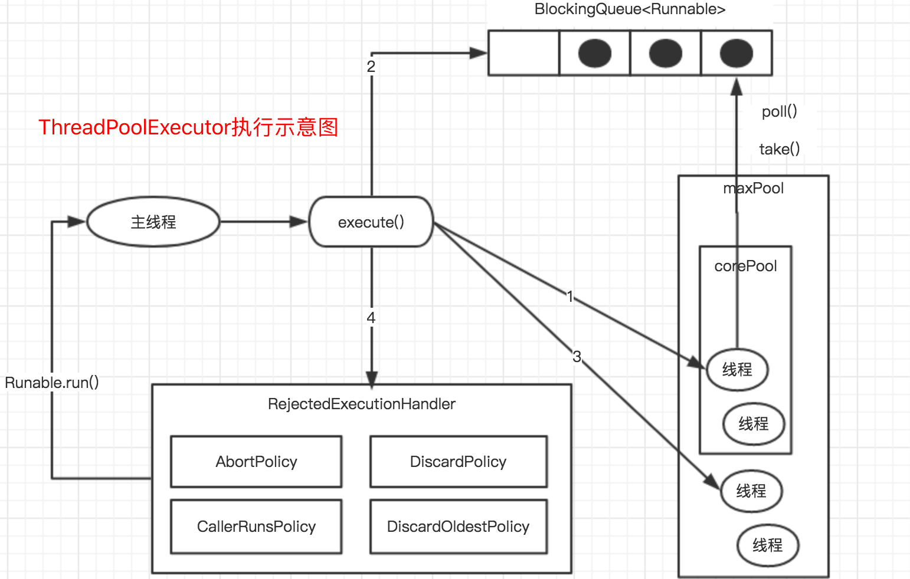

1. 如何创建线程？如何保证线程安全？

    创建线程有两种方式：
    1. 继承Thread类；
    2. 实现Runnable接口。

    一般说来，确保线程安全的方法有这几个：竞争与原子操作、同步与锁、可重入、过度优化。

    个人认为，保证线程安全，无外乎保持线程同步的方式，

    如：@synchronized、NSLock、dispatch_semaphore、NSCondition、pthread_mutex、OSSpinLock。

    然而：


    OSSpinLock和dispatch_semaphore的效率远远高于其他。

    @synchronized和NSConditionLock效率较差。

    鉴于OSSpinLock的不安全，所以我们在开发中如果考虑性能的话，建议使用dispatch_semaphore。

    如果不考虑性能，只是图个方便的话，那就使用@synchronized。

    原文：https://blog.csdn.net/ITzhangdaopin/article/details/78737892 

2. 如何实现一个线程安全的数据结构
    
    new 一个volatile 的Atomatic变量，或者使用concurrent类型的集合，ConcurrentHashMap之类的。

3. 如何避免死锁

    在有些情况下死锁是可以避免的。本文将展示三种用于避免死锁的技术：

    * 加锁顺序
    * 加锁时限
    * 死锁检测

    #### 加锁顺序

    当多个线程需要相同的一些锁，但是按照不同的顺序加锁，死锁就很容易发生。

    如果能确保所有的线程都是按照相同的顺序获得锁，那么死锁就不会发生。看下面这个例子：
    ```
    Thread 1:
    lock A 
    lock B

    Thread 2:
    wait for A
    lock C (when A locked)

    Thread 3:
    wait for A
    wait for B
    wait for C
    ```
    如果一个线程(比如线程3)需要一些锁，那么它必须按照确定的顺序获取锁。它只有获得了从顺序上排在前面的锁之后，才能获取后面的锁。

    例如，线程2和线程3只有在获取了锁A之后才能尝试获取锁C(译者注：获取锁A是获取锁C的必要条件)。因为线程1已经拥有了锁A，所以线程2和3需要一直等到锁A被释放。然后在它们尝试对B或C加锁之前，必须成功地对A加了锁。

    按照顺序加锁是一种有效的死锁预防机制。但是，这种方式需要你事先知道所有可能会用到的锁(译者注：并对这些锁做适当的排序)，但总有些时候是无法预知的。

    #### 加锁时限
    另外一个可以避免死锁的方法是在尝试获取锁的时候加一个超时时间，这也就意味着在尝试获取锁的过程中若超过了这个时限该线程则放弃对该锁请求。若一个线程没有在给定的时限内成功获得所有需要的锁，则会进行回退并释放所有已经获得的锁，然后等待一段随机的时间再重试。这段随机的等待时间让其它线程有机会尝试获取相同的这些锁，并且让该应用在没有获得锁的时候可以继续运行(译者注：加锁超时后可以先继续运行干点其它事情，再回头来重复之前加锁的逻辑)。

    以下是一个例子，展示了两个线程以不同的顺序尝试获取相同的两个锁，在发生超时后回退并重试的场景：
    ```
    Thread 1 locks A
    Thread 2 locks B

    Thread 1 attempts to lock B but is blocked
    Thread 2 attempts to lock A but is blocked

    Thread 1's lock attempt on B times out
    Thread 1 backs up and releases A as well
    Thread 1 waits randomly (e.g. 257 millis) before retrying.

    Thread 2's lock attempt on A times out
    Thread 2 backs up and releases B as well
    Thread 2 waits randomly (e.g. 43 millis) before retrying.
    ```
    在上面的例子中，线程2比线程1早200毫秒进行重试加锁，因此它可以先成功地获取到两个锁。这时，线程1尝试获取锁A并且处于等待状态。当线程2结束时，线程1也可以顺利的获得这两个锁(除非线程2或者其它线程在线程1成功获得两个锁之前又获得其中的一些锁)。

    需要注意的是，由于存在锁的超时，所以我们不能认为这种场景就一定是出现了死锁。也可能是因为获得了锁的线程(导致其它线程超时)需要很长的时间去完成它的任务。

    此外，如果有非常多的线程同一时间去竞争同一批资源，就算有超时和回退机制，还是可能会导致这些线程重复地尝试但却始终得不到锁。如果只有两个线程，并且重试的超时时间设定为0到500毫秒之间，这种现象可能不会发生，但是如果是10个或20个线程情况就不同了。因为这些线程等待相等的重试时间的概率就高的多(或者非常接近以至于会出现问题)。
    (译者注：超时和重试机制是为了避免在同一时间出现的竞争，但是当线程很多时，其中两个或多个线程的超时时间一样或者接近的可能性就会很大，因此就算出现竞争而导致超时后，由于超时时间一样，它们又会同时开始重试，导致新一轮的竞争，带来了新的问题。)

    这种机制存在一个问题，在Java中不能对synchronized同步块设置超时时间。你需要创建一个自定义锁，或使用Java5中java.util.concurrent包下的工具。写一个自定义锁类不复杂，但超出了本文的内容。后续的Java并发系列会涵盖自定义锁的内容。

    #### 死锁检测

    死锁检测是一个更好的死锁预防机制，它主要是针对那些不可能实现按序加锁并且锁超时也不可行的场景。

    每当一个线程获得了锁，会在线程和锁相关的数据结构中(map、graph等等)将其记下。除此之外，每当有线程请求锁，也需要记录在这个数据结构中。

    当一个线程请求锁失败时，这个线程可以遍历锁的关系图看看是否有死锁发生。例如，线程A请求锁7，但是锁7这个时候被线程B持有，这时线程A就可以检查一下线程B是否已经请求了线程A当前所持有的锁。如果线程B确实有这样的请求，那么就是发生了死锁(线程A拥有锁1，请求锁7；线程B拥有锁7，请求锁1)。

    当然，死锁一般要比两个线程互相持有对方的锁这种情况要复杂的多。线程A等待线程B，线程B等待线程C，线程C等待线程D，线程D又在等待线程A。线程A为了检测死锁，它需要递进地检测所有被B请求的锁。从线程B所请求的锁开始，线程A找到了线程C，然后又找到了线程D，发现线程D请求的锁被线程A自己持有着。这是它就知道发生了死锁。

    下面是一幅关于四个线程(A,B,C和D)之间锁占有和请求的关系图。像这样的数据结构就可以被用来检测死锁。

    

    那么当检测出死锁时，这些线程该做些什么呢？

    一个可行的做法是释放所有锁，回退，并且等待一段随机的时间后重试。这个和简单的加锁超时类似，不一样的是只有死锁已经发生了才回退，而不会是因为加锁的请求超时了。虽然有回退和等待，但是如果有大量的线程竞争同一批锁，它们还是会重复地死锁(编者注：原因同超时类似，不能从根本上减轻竞争)。

    一个更好的方案是给这些线程设置优先级，让一个(或几个)线程回退，剩下的线程就像没发生死锁一样继续保持着它们需要的锁。如果赋予这些线程的优先级是固定不变的，同一批线程总是会拥有更高的优先级。为避免这个问题，可以在死锁发生的时候设置随机的优先级。

    原文：http://ifeve.com/deadlock-prevention/

4. Volatile关键字的作用？

    #### volatile的可见性和非原子性
    volatile保证了可见性，但是并不保证原子性！

    1. volatile关键字的两层语义
        
        一旦一个共享变量(类的成员变量、类的静态成员变量)被volatile修饰之后，那么就具备了两层语义：

        1. 保证了不同线程对这个变量进行操作时的可见性，即一个线程修改了某个变量的值，这新值对其他线程来说是立即可见的。

        2. 禁止进行指令重排序。
        
        
        volatile的可见性，即任何时刻只要有任何线程修改了volatile变量的值，其他线程总能获取到该最新值。具体更多实现可以参阅缓存一致性协议。

    2. 那么volatile为什么又不能保证原子性呢？

        以volatile int i = 10；i++；为例分析：

        i++实际为load、Increment、store三个操作。

        某一时刻线程1将i的值load取出来，放置到cpu缓存中，然后再将此值放置到寄存器A中，然后A中的值自增1(寄存器A中保存的是中间值，没有直接修改i，因此其他线程并不会获取到这个自增1的值)。如果在此时线程2也执行同样的操作，获取值i==10,自增1变为11，然后马上刷入主内存。此时由于线程2修改了i的值，实时的线程1中的i==10的值缓存失效，重新从主内存中读取，变为11。接下来线程1恢复。将自增过后的A寄存器值11赋值给cpu缓存i。这样就出现了线程安全问题。

    3. synchronized相对于volatile又是如何保证原子性呢？

        volatile：从最终汇编语言从面来看，volatile使得每次将i进行了修改之后，增加了一个内存屏障lock addl $0x0,(%rsp)保证修改的值必须刷新到主内存才能进行内存屏障后续的指令操作。但是内存屏障之前的指令并不是原子的。

        synchronized：则是使用lock cmpxchg %rsi,(%rdi)的原子指令，使得修改是原子操作。如果修改失败，则继续尝试，知道成功。

    #### 内存可见性&寄存器可见性
    数据在哪里存在呢？只在内存吗？不是的。数据在内存中存在，但是当用的时候会加载到CPU的寄存器里面。内存和寄存器是两个地方，从而出现了新的名词：内存可见性和寄存器可见性。

    为什么叫内存可见性呢？感觉很奇怪的名字。其实，明白以下道理就不奇怪了：
    数据的流动过程是：内存->寄存器->计算器


    很多时候，数据从内存地址读取到寄存器里面，后面的计算过程中CPU就一直使用寄存器里面的值，即是内存地址上的值发生变化，CPU也不知道，CPU此时就是井底之蛙，而变量此时可以称为：寄存器可见性。

    但是当变量被volatile修饰之后，CPU就不再偷懒，只要用到数据，它都会越过寄存器，直接从内存中读取，然后再在计算器中计算，最后返回给内存，这个时候变量就不在寄存器里面停留，就当寄存器不存在一样，这就称为内存可见性。

    原文：https://my.oschina.net/tantexian/blog/808032
          http://swiftlet.net/archives/3024

5. HashMap在多线程环境下使用需要注意什么？为什么？

    这个问题曾经有一个面试官问过我，当时我天真的以为是读写操作并发时存在脏数据的问题，当时面试官不置可否。我后面回来查资料，发现没有那么简单。并发操作HashMap，是有可能带来死循环以及数据丢失的问题的。

    具体情况如下：(以下代码转自美团点评技术团队的文章Java8系列之重新认识HashMap)

    情景如下代码:
    ```java
    public class HashMapInfiniteLoop {    
    
        private static HashMap<Integer,String> map = new HashMap<Integer,String>(2,0.75f);    
        public static void main(String[] args) {    
            map.put(5， "C");    
    
            new Thread("Thread1") {    
                public void run() {    
                    map.put(7, "B");    
                    System.out.println(map);    
                };    
            }.start();    
            new Thread("Thread2") {    
                public void run() {    
                    map.put(3, "A);    
                    System.out.println(map);    
                };    
            }.start();          
        }    
    }  
    ```

    其中，map初始化为一个长度为2的数组，loadFactor=0.75，threshold=2*0.75=1，也就是说当put第二个key的时候，map就需要进行扩容。

    考虑这样一种情况:
    先放出transfer的部分代码：
    ```java
        do {  
            Entry<K,V> next = e.next; //假设线程一执行到这里就被调度挂起了  
            int i = indexFor(e.hash, newCapacity);  
            e.next = newTable[i];  
            newTable[i] = e;  
            e = next;  
        } while (e != null);  
    ```

    线程1、线程2都添加了数据之后，线程1执行到transfer()方法的第一行就被调度挂起了，这时线程2被调度来执行扩容操作。线程2的扩容操作结束之后，线程1被调度回来继续执行，此时由于线程2的执行，e已经指向了线程2修改之后的反转链表，但是线程1并不知道线程2已经在它之前做过这些操作了，于是它继续往下走，此时next=key(7),

    然后计算索引。索引计算完之后执行e.next=newTable[i],此时e.next=key(7)。继续往下走，newTable[i]=e,此时newTable[i]=key(3)，再往下，e=next,此时e指向了key(7),本次循环结束。从线程二重组链表结束，到线程1第一轮循环结束的变化图如下:

    


    一切看起来都还没有什么问题。然后新一轮循环开始

    这一轮循环我们不需要走完，就能发现问题。

    第一句，执行后为:next=null;

    第二句，计算索引，还是i

    第三句，在这里就出问题了，这句话执行的是e.next=newTable[i],我们看上图，newTable[i]指向的是key(3),因此出现链表末尾的元素的next指针指向了链表头，循环链表就出现了。(按道理，HashMap是不存在循环链表的。)

    第四句话，将链表头的元素换成key(7)，而循环链表依然存在。

    第五句，e=null，执行到这循环结束，因为e=null了。

    整个过程并不会发生明显的异常。看起来一切安好。顺利的完成了rehash，但是悲剧在后面：当我们调用get()这个链表中不存在的元素的时候，就会出现死循环。go die

    一句话总结就是，并发环境下的rehash过程可能会带来循环链表，导致死循环致使线程挂掉。

    重新描述下：一开始是e[1]->3->7->5，t1和t2竞争，结果t2先扩展了hashmap，即由原来的table[1]变为table[3]，变成了e[1]->5,e[3]->7->3；t1继续往下执行时，由于遵循了原来的3->7，导致e[3]->7->3->7形成环形。后面要get的时候，存现死循环。

    因此并发环境下，建议使用Java.util.concurrent包中的ConcurrentHashMap以保证线程安全。

    至于HashTable，它并未使用分段锁，而是锁住整个数组，高并发环境下效率非常的低，会导致大量线程等待。
    同样的，Synchronized关键字、Lock性能都不如分段锁实现的ConcurrentHashMap。

    原文：https://blog.csdn.net/shuaicenglou3032/article/details/77745999 
          http://www.07net01.com/2016/04/1440275.html

6. Java程序中启动一个线程是用run还是start？

    Java的线程是通过java.lang.Thread类来实现的。VM启动时会有一个由主方法所定义的线程。可以通过创建Thread的实例来创建新的线程。每个线程都是通过某个特定Thread对象所对应的方法run()来完成其操作的，方法run()称为线程体。通过调用Thread类的start()方法来启动一个线程。

    在Java当中，线程通常都有五种状态，创建、就绪、运行、阻塞和死亡：
    　　第一是创建状态。在生成线程对象，并没有调用该对象的start方法，这是线程处于创建状态。
    　　第二是就绪状态。当调用了线程对象的start方法之后，该线程就进入了就绪状态，但是此时线程调度程序还没有把该线程设置为当前线程，此时处于就绪状态。在线程运行之后，从等待或者睡眠中回来之后，也会处于就绪状态。
    　　第三是运行状态。线程调度程序将处于就绪状态的线程设置为当前线程，此时线程就进入了运行状态，开始运行run函数当中的代码。
    　　第四是阻塞状态。线程正在运行的时候，被暂停，通常是为了等待某个事件的发生(比如说某项资源就绪)之后再继续运行。sleep，suspend，wait等方法都可以导致线程阻塞。
    　　第五是死亡状态。如果一个线程的run方法执行结束或者调用stop方法后，该线程就会死亡。对于已经死亡的线程，无法再使用start方法令其进入就绪。

    实现并启动线程有两种方法：
    1. 写一个类继承自Thread类，重写run方法。用start方法启动线程
    2. 写一个类实现Runnable接口，实现run方法。用new Thread(Runnable target).start()方法来启动

    多线程原理：相当于玩游戏机，只有一个游戏机(cpu)，可是有很多人要玩，于是，start是排队！等CPU选中你就是轮到你，你就run()，当CPU的运行的时间片执行完，这个线程就继续排队，等待下一次的run()。

    调用start()后，线程会被放到等待队列，等待CPU调度，并不一定要马上开始执行，只是将这个线程置于可动行状态。然后通过JVM，线程Thread会调用run()方法，执行本线程的线程体。先调用start后调用run，这么麻烦，为了不直接调用run？就是为了实现多线程的优点，没这个start不行。

    1. start()方法来启动线程，真正实现了多线程运行。这时无需等待run方法体代码执行完毕，可以直接继续执行下面的代码；通过调用Thread类的start()方法来启动一个线程， 这时此线程是处于就绪状态， 并没有运行。 然后通过此Thread类调用方法run()来完成其运行操作的， 这里方法run()称为线程体，它包含了要执行的这个线程的内容， Run方法运行结束， 此线程终止。然后CPU再调度其它线程。
    2. run()方法当作普通方法的方式调用。程序还是要顺序执行，要等待run方法体执行完毕后，才可继续执行下面的代码； 程序中只有主线程——这一个线程， 其程序执行路径还是只有一条， 这样就没有达到写线程的目的。
    记住：多线程就是分时利用CPU，宏观上让所有线程一起执行 ，也叫并发

    原文：https://www.cnblogs.com/sunflower627/p/4816821.html

7. 什么是守护线程？有什么用？
    Java提供了两种线程：守护线程和用户线程。

    守护线程又被称为“服务进程”“精灵线程”“后台线程”，是指在程序运行是在后台提供一种通用的线程，这种线程并不属于程序不可或缺的部分。 通俗点讲，任何一个守护线程都是整个JVM中所有非守护线程的“保姆”。

    用户线程和守护线程几乎一样，唯一的不同之处就在于如果用户线程已经全部退出运行，只剩下守护线程存在了，JVM也就退出了。  因为当所有非守护线程结束时，没有了被守护者，守护线程也就没有工作可做了，也就没有继续运行程序的必要了，程序也就终止了，同时会“杀死”所有守护线程。 也就是说，只要有任何非守护线程还在运行，程序就不会终止。

    在Java语言中，守护线程一般具有较低的优先级，它并非只由JVM内部提供，用户在编写程序时也可以自己设置守护线程，例如将一个用户线程设置为守护线程的方法就是在调用start()方法启动线程之前调用对象的setDaemon(true)方法，若将以上括号里的参数设置为false，则表示的是用户进程模式。   

    需要注意的是，当在一个守护线程中产生了其它线程，那么这些新产生的线程默认还是守护线程，用户线程也是如此。

    垃圾回收器就是一个守护线程。

    原文：https://www.cnblogs.com/wangyichuan/p/5966790.html

8. 什么是死锁？如何避免

    所谓死锁：是指两个或两个以上的进程在执行过程中，因争夺资源而造成的一种互相等待的现象，若无外力作用，它们都将无法推进下去。此时称系统处于死锁状态或系统产生了死锁，这些永远在互相等待的进程称为死锁进程。由于资源占用是互斥的，当某个进程提出申请资源后，使得有关进程在无外力协助下，永远分配不到必需的资源而无法继续运行，这就产生了一种特殊现象死锁。

    虽然进程在运行过程中，可能发生死锁，但死锁的发生也必须具备一定的条件，死锁的发生必须具备以下四个必要条件。

    1. 互斥条件：指进程对所分配到的资源进行排它性使用，即在一段时间内某资源只由一个进程占用。如果此时还有其它进程请求资源，则请求者只能等待，直至占有资源的进程用毕释放。

    2. 请求和保持条件：指进程已经保持至少一个资源，但又提出了新的资源请求，而该资源已被其它进程占有，此时请求进程阻塞，但又对自己已获得的其它资源保持不放。

    3. 不剥夺条件：指进程已获得的资源，在未使用完之前，不能被剥夺，只能在使用完时由自己释放。

    4. 环路等待条件：指在发生死锁时，必然存在一个进程——资源的环形链，即进程集合{P0，P1，P2，···，Pn}中的P0正在等待一个P1占用的资源；P1正在等待P2占用的资源，……，Pn正在等待已被P0占用的资源。

    在系统中已经出现死锁后，应该及时检测到死锁的发生，并采取适当的措施来解除死锁。目前处理死锁的方法可归结为以下四种：

    1. 预防死锁。

    　　这是一种较简单和直观的事先预防的方法。方法是通过设置某些限制条件，去破坏产生死锁的四个必要条件中的一个或者几个，来预防发生死锁。预防死锁是一种较易实现的方法，已被广泛使用。但是由于所施加的限制条件往往太严格，可能会导致系统资源利用率和系统吞吐量降低。

    2. 避免死锁。

    　　该方法同样是属于事先预防的策略，但它并不须事先采取各种限制措施去破坏产生死锁的的四个必要条件，而是在资源的动态分配过程中，用某种方法去防止系统进入不安全状态，从而避免发生死锁。

    3. 检测死锁。

    　　这种方法并不须事先采取任何限制性措施，也不必检查系统是否已经进入不安全区，此方法允许系统在运行过程中发生死锁。但可通过系统所设置的检测机构，及时地检测出死锁的发生，并精确地确定与死锁有关的进程和资源，然后采取适当措施，从系统中将已发生的死锁清除掉。

    4. 解除死锁。

    　　这是与检测死锁相配套的一种措施。当检测到系统中已发生死锁时，须将进程从死锁状态中解脱出来。常用的实施方法是撤销或挂起一些进程，以便回收一些资源，再将这些资源分配给已处于阻塞状态的进程，使之转为就绪状态，以继续运行。死锁的检测和解除措施，有可能使系统获得较好的资源利用率和吞吐量，但在实现上难度也最大。

9. 线程和进程的差别是什么？

    根本区别：进程是操作系统资源分配的基本单位，而线程是任务调度和执行的基本单位

    在开销方面：每个进程都有独立的代码和数据空间（程序上下文），程序之间的切换会有较大的开销；线程可以看做轻量级的进程，同一类线程共享代码和数据空间，每个线程都有自己独立的运行栈和程序计数器（PC），线程之间切换的开销小。

    所处环境：在操作系统中能同时运行多个进程（程序）；而在同一个进程（程序）中有多个线程同时执行（通过CPU调度，在每个时间片中只有一个线程执行）

    内存分配方面：系统在运行的时候会为每个进程分配不同的内存空间；而对线程而言，除了CPU外，系统不会为线程分配内存（线程所使用的资源来自其所属进程的资源），线程组之间只能共享资源。

    包含关系：没有线程的进程可以看做是单线程的，如果一个进程内有多个线程，则执行过程不是一条线的，而是多条线（线程）共同完成的；线程是进程的一部分，所以线程也被称为轻权进程或者轻量级进程。

    原文：https://blog.csdn.net/kuangsonghan/article/details/80674777 

10. Java里面的Threadlocal是怎样实现的？

    首先，ThreadLocal 不是用来解决共享对象的多线程访问问题的，一般情况下，通过ThreadLocal.set() 到线程中的对象是该线程自己使用的对象，其他线程是不需要访问的，也访问不到的。各个线程中访问的是不同的对象。 

    另外，说ThreadLocal使得各线程能够保持各自独立的一个对象，并不是通过ThreadLocal.set()来实现的，而是通过每个线程中的new 对象 的操作来创建的对象，每个线程创建一个，不是什么对象的拷贝或副本。通过ThreadLocal.set()将这个新创建的对象的引用保存到各线程的自己的一个map中，每个线程都有这样一个map，执行ThreadLocal.get()时，各线程从自己的map中取出放进去的对象，因此取出来的是各自自己线程中的对象，ThreadLocal实例是作为map的key来使用的。 

    如果ThreadLocal.set()进去的东西本来就是多个线程共享的同一个对象，那么多个线程的ThreadLocal.get()取得的还是这个共享对象本身，还是有并发访问问题。 

    下面来看一个hibernate中典型的ThreadLocal的应用： 
    ```java
    private static final ThreadLocal threadSession = new ThreadLocal();  
    
    public static Session getSession() throws InfrastructureException {  
        Session s = (Session) threadSession.get();  
        try {  
            if (s == null) {  
                s = getSessionFactory().openSession();  
                threadSession.set(s);  
            }  
        } catch (HibernateException ex) {  
            throw new InfrastructureException(ex);  
        }  
        return s;  
    }  
    ```
    可以看到在getSession()方法中，首先判断当前线程中有没有放进去session，如果还没有，那么通过sessionFactory().openSession()来创建一个session，再将session set到线程中，实际是放到当前线程的ThreadLocalMap这个map中，这时，对于这个session的唯一引用就是当前线程中的那个ThreadLocalMap（下面会讲到），而threadSession作为这个值的key，要取得这个session可以通过threadSession.get()来得到，里面执行的操作实际是先取得当前线程中的ThreadLocalMap，然后将threadSession作为key将对应的值取出。这个session相当于线程的私有变量，而不是public的。 

    显然，其他线程中是取不到这个session的，他们也只能取到自己的ThreadLocalMap中的东西。要是session是多个线程共享使用的，那还不乱套了。 

    试想如果不用ThreadLocal怎么来实现呢？可能就要在action中创建session，然后把session一个个传到service和dao中，这可够麻烦的。或者可以自己定义一个静态的map，将当前thread作为key，创建的session作为值，put到map中，应该也行，这也是一般人的想法，但事实上，ThreadLocal的实现刚好相反，它是在每个线程中有一个map，而将ThreadLocal实例作为key，这样每个map中的项数很少，而且当线程销毁时相应的东西也一起销毁了，不知道除了这些还有什么其他的好处。 

    总之，ThreadLocal不是用来解决对象共享访问问题的，而主要是提供了保持对象的方法和避免参数传递的方便的对象访问方式。归纳了两点： 

    1. 每个线程中都有一个自己的ThreadLocalMap类对象，可以将线程自己的对象保持到其中，各管各的，线程可以正确的访问到自己的对象。 
    2. 将一个共用的ThreadLocal静态实例作为key，将不同对象的引用保存到不同线程的ThreadLocalMap中，然后在线程执行的各处通过这个静态ThreadLocal实例的get()方法取得自己线程保存的那个对象，避免了将这个对象作为参数传递的麻烦。 

    当然如果要把本来线程共享的对象通过ThreadLocal.set()放到线程中也可以，可以实现避免参数传递的访问方式，但是要注意get()到的是那同一个共享对象，并发访问问题要靠其他手段来解决。但一般来说线程共享的对象通过设置为某类的静态变量就可以实现方便的访问了，似乎没必要放到线程中。 

    ThreadLocal的应用场合，我觉得最适合的是按线程多实例（每个线程对应一个实例）的对象的访问，并且这个对象很多地方都要用到。 

    下面来看看ThreadLocal的实现原理（jdk1.5源码） 
    ```java
    public class ThreadLocal<T> {  
        /** 
        * ThreadLocals rely on per-thread hash maps attached to each thread 
        * (Thread.threadLocals and inheritableThreadLocals).  The ThreadLocal 
        * objects act as keys, searched via threadLocalHashCode.  This is a 
        * custom hash code (useful only within ThreadLocalMaps) that eliminates 
        * collisions in the common case where consecutively constructed 
        * ThreadLocals are used by the same threads, while remaining well-behaved 
        * in less common cases. 
        */  
        private final int threadLocalHashCode = nextHashCode();  
    
        /** 
        * The next hash code to be given out. Accessed only by like-named method. 
        */  
        private static int nextHashCode = 0;  
    
        /** 
        * The difference between successively generated hash codes - turns 
        * implicit sequential thread-local IDs into near-optimally spread 
        * multiplicative hash values for power-of-two-sized tables. 
        */  
        private static final int HASH_INCREMENT = 0x61c88647;  
    
        /** 
        * Compute the next hash code. The static synchronization used here 
        * should not be a performance bottleneck. When ThreadLocals are 
        * generated in different threads at a fast enough rate to regularly 
        * contend on this lock, memory contention is by far a more serious 
        * problem than lock contention. 
        */  
        private static synchronized int nextHashCode() {  
            int h = nextHashCode;  
            nextHashCode = h + HASH_INCREMENT;  
            return h;  
        }  
    
        /** 
        * Creates a thread local variable. 
        */  
        public ThreadLocal() {  
        }  
    
        /** 
        * Returns the value in the current thread's copy of this thread-local 
        * variable.  Creates and initializes the copy if this is the first time 
        * the thread has called this method. 
        * 
        * @return the current thread's value of this thread-local 
        */  
        public T get() {  
            Thread t = Thread.currentThread();  
            ThreadLocalMap map = getMap(t);  
            if (map != null)  
                return (T)map.get(this);  
    
            // Maps are constructed lazily.  if the map for this thread  
            // doesn't exist, create it, with this ThreadLocal and its  
            // initial value as its only entry.  
            T value = initialValue();  
            createMap(t, value);  
            return value;  
        }  
    
        /** 
        * Sets the current thread's copy of this thread-local variable 
        * to the specified value.  Many applications will have no need for 
        * this functionality, relying solely on the {@link #initialValue} 
        * method to set the values of thread-locals. 
        * 
        * @param value the value to be stored in the current threads' copy of 
        *        this thread-local. 
        */  
        public void set(T value) {  
            Thread t = Thread.currentThread();  
            ThreadLocalMap map = getMap(t);  
            if (map != null)  
                map.set(this, value);  
            else  
                createMap(t, value);  
        }  
    
        /** 
        * Get the map associated with a ThreadLocal. Overridden in 
        * InheritableThreadLocal. 
        * 
        * @param  t the current thread 
        * @return the map 
        */  
        ThreadLocalMap getMap(Thread t) {  
            return t.threadLocals;  
        }  
    
        /** 
        * Create the map associated with a ThreadLocal. Overridden in 
        * InheritableThreadLocal. 
        * 
        * @param t the current thread 
        * @param firstValue value for the initial entry of the map 
        * @param map the map to store. 
        */  
        void createMap(Thread t, T firstValue) {  
            t.threadLocals = new ThreadLocalMap(this, firstValue);  
        }  
    
        .......  
    
        /** 
        * ThreadLocalMap is a customized hash map suitable only for 
        * maintaining thread local values. No operations are exported 
        * outside of the ThreadLocal class. The class is package private to 
        * allow declaration of fields in class Thread.  To help deal with 
        * very large and long-lived usages, the hash table entries use 
        * WeakReferences for keys. However, since reference queues are not 
        * used, stale entries are guaranteed to be removed only when 
        * the table starts running out of space. 
        */  
        static class ThreadLocalMap {  
    
        ........  
    
        }  
    
    }  

    ```
    可以看到ThreadLocal类中的变量只有这3个int型： 
    ```java
    private final int threadLocalHashCode = nextHashCode();  
    private static int nextHashCode = 0;  
    private static final int HASH_INCREMENT = 0x61c88647;  
    ```
    而作为ThreadLocal实例的变量只有 threadLocalHashCode 这一个，nextHashCode 和HASH_INCREMENT 是ThreadLocal类的静态变量，实际上HASH_INCREMENT是一个常量，表示了连续分配的两个ThreadLocal实例的threadLocalHashCode值的增量，而nextHashCode 的表示了即将分配的下一个ThreadLocal实例的threadLocalHashCode 的值。 

    可以来看一下创建一个ThreadLocal实例即new ThreadLocal()时做了哪些操作，从上面看到构造函数ThreadLocal()里什么操作都没有，唯一的操作是这句： 
    ```java
    private final int threadLocalHashCode = nextHashCode();  
    ```
    那么nextHashCode()做了什么呢： 
    ```java
    private static synchronized int nextHashCode() {  
        int h = nextHashCode;  
        nextHashCode = h + HASH_INCREMENT;  
        return h;  
    }  
    ```
    就是将ThreadLocal类的下一个hashCode值即nextHashCode的值赋给实例的threadLocalHashCode，然后nextHashCode的值增加HASH_INCREMENT这个值。 

    因此ThreadLocal实例的变量只有这个threadLocalHashCode，而且是final的，用来区分不同的ThreadLocal实例，ThreadLocal类主要是作为工具类来使用，那么ThreadLocal.set()进去的对象是放在哪儿的呢？ 

    看一下上面的set()方法，两句合并一下成为 
    ```java
    ThreadLocalMap map = Thread.currentThread().threadLocals;  
    ```
    这个ThreadLocalMap 类是ThreadLocal中定义的内部类，但是它的实例却用在Thread类中： 
    ```java
    public class Thread implements Runnable {  
        ......  
    
        /* ThreadLocal values pertaining to this thread. This map is maintained 
        * by the ThreadLocal class. */  
        ThreadLocal.ThreadLocalMap threadLocals = null;    
        ......  
    }  
    ```

    再看这句： 
    ```java
    if (map != null)  
        map.set(this, value);  
    ```
    也就是将该ThreadLocal实例作为key，要保持的对象作为值，设置到当前线程的ThreadLocalMap 中，get()方法同样大家看了代码也就明白了，ThreadLocalMap 类的代码太多了，我就不帖了，自己去看源码吧。 

    写了这么多，也不知讲明白了没有，有什么不当的地方还请大家指出来。

    原文：https://www.iteye.com/topic/103804

11. ConcurrentHashMap的实现原理是？

    ### Java 7基于分段锁的ConcurrentHashMap
    注：本章的代码均基于JDK 1.7.0_67

    #### 数据结构
    Java 7中的ConcurrentHashMap的底层数据结构仍然是数组和链表。与HashMap不同的是，ConcurrentHashMap最外层不是一个大的数组，而是一个Segment的数组。每个Segment包含一个与HashMap数据结构差不多的链表数组。整体数据结构如下图所示。

    

    #### 寻址方式
    在读写某个Key时，先取该Key的哈希值。并将哈希值的高N位对Segment个数取模从而得到该Key应该属于哪个Segment，接着如同操作HashMap一样操作这个Segment。为了保证不同的值均匀分布到不同的Segment，需要通过如下方法计算哈希值。
    ```java
    private int hash(Object k) {
        int h = hashSeed;
        if ((0 != h) && (k instanceof String)) {
            return sun.misc.Hashing.stringHash32((String) k);
        }
        h ^= k.hashCode();
        h += (h <<  15) ^ 0xffffcd7d;
        h ^= (h >>> 10);
        h += (h <<   3);
        h ^= (h >>>  6);
        h += (h <<   2) + (h << 14);
        return h ^ (h >>> 16);
    }
    ```
    同样为了提高取模运算效率，通过如下计算，ssize即为大于concurrencyLevel的最小的2的N次方，同时segmentMask为2^N-1。这一点跟上文中计算数组长度的方法一致。对于某一个Key的哈希值，只需要向右移segmentShift位以取高sshift位，再与segmentMask取与操作即可得到它在Segment数组上的索引。
    ```java
    int sshift = 0;
    int ssize = 1;
    while (ssize < concurrencyLevel) {
    ++sshift;
    ssize <<= 1;
    }
    this.segmentShift = 32 - sshift;
    this.segmentMask = ssize - 1;
    Segment<K,V>[] ss = (Segment<K,V>[])new Segment[ssize];
    ```
    #### 同步方式
    Segment继承自ReentrantLock，所以我们可以很方便的对每一个Segment上锁。

    对于读操作，获取Key所在的Segment时，需要保证可见性(请参考如何保证多线程条件下的可见性)。具体实现上可以使用volatile关键字，也可使用锁。但使用锁开销太大，而使用volatile时每次写操作都会让所有CPU内缓存无效，也有一定开销。ConcurrentHashMap使用如下方法保证可见性，取得最新的Segment。

    ```java
    Segment<K,V> s = (Segment<K,V>)UNSAFE.getObjectVolatile(segments, u)
    ```

    获取Segment中的HashEntry时也使用了类似方法
    ```java
    HashEntry<K,V> e = (HashEntry<K,V>) UNSAFE.getObjectVolatile
    (tab, ((long)(((tab.length - 1) & h)) << TSHIFT) + TBASE)
    ```

    对于写操作，并不要求同时获取所有Segment的锁，因为那样相当于锁住了整个Map。它会先获取该Key-Value对所在的Segment的锁，获取成功后就可以像操作一个普通的HashMap一样操作该Segment，并保证该Segment的安全性。
    同时由于其它Segment的锁并未被获取，因此理论上可支持concurrencyLevel（等于Segment的个数）个线程安全的并发读写。

    获取锁时，并不直接使用lock来获取，因为该方法获取锁失败时会挂起（参考可重入锁）。事实上，它使用了自旋锁，如果tryLock获取锁失败，说明锁被其它线程占用，此时通过循环再次以tryLock的方式申请锁。如果在循环过程中该Key所对应的链表头被修改，则重置retry次数。如果retry次数超过一定值，则使用lock方法申请锁。

    这里使用自旋锁是因为自旋锁的效率比较高，但是它消耗CPU资源比较多，因此在自旋次数超过阈值时切换为互斥锁。

    #### size操作
    put、remove和get操作只需要关心一个Segment，而size操作需要遍历所有的Segment才能算出整个Map的大小。一个简单的方案是，先锁住所有Sgment，计算完后再解锁。但这样做，在做size操作时，不仅无法对Map进行写操作，同时也无法进行读操作，不利于对Map的并行操作。

    为更好支持并发操作，ConcurrentHashMap会在不上锁的前提逐个Segment计算3次size，如果某相邻两次计算获取的所有Segment的更新次数（每个Segment都与HashMap一样通过modCount跟踪自己的修改次数，Segment每修改一次其modCount加一）相等，说明这两次计算过程中无更新操作，则这两次计算出的总size相等，可直接作为最终结果返回。如果这三次计算过程中Map有更新，则对所有Segment加锁重新计算Size。该计算方法代码如下
    ```java
    public int size() {
        final Segment<K,V>[] segments = this.segments;
        int size;
        boolean overflow; // true if size overflows 32 bits
        long sum;         // sum of modCounts
        long last = 0L;   // previous sum
        int retries = -1; // first iteration isn't retry
        try {
            for (;;) {
            if (retries++ == RETRIES_BEFORE_LOCK) {
                for (int j = 0; j < segments.length; ++j)
                ensureSegment(j).lock(); // force creation
            }
            sum = 0L;
            size = 0;
            overflow = false;
            for (int j = 0; j < segments.length; ++j) {
                Segment<K,V> seg = segmentAt(segments, j);
                if (seg != null) {
                sum += seg.modCount;
                int c = seg.count;
                if (c < 0 || (size += c) < 0)
                    overflow = true;
                }
            }
            if (sum == last)
                break;
            last = sum;
            }
        } finally {
            if (retries > RETRIES_BEFORE_LOCK) {
            for (int j = 0; j < segments.length; ++j)
                segmentAt(segments, j).unlock();
            }
        }
        return overflow ? Integer.MAX_VALUE : size;
    }
    ```
    #### 不同之处

    ConcurrentHashMap与HashMap相比，有以下不同点

    * ConcurrentHashMap线程安全，而HashMap非线程安全
    * HashMap允许Key和Value为null，而ConcurrentHashMap不允许
    * HashMap不允许通过Iterator遍历的同时通过HashMap修改，而ConcurrentHashMap允许该行为，并且该更新对后续的遍历可见

    ### Java 8基于CAS的ConcurrentHashMap
    注：本章的代码均基于JDK 1.8.0_111

    #### 数据结构
    
    Java 7为实现并行访问，引入了Segment这一结构，实现了分段锁，理论上最大并发度与Segment个数相等。Java 8为进一步提高并发性，摒弃了分段锁的方案，而是直接使用一个大的数组。同时为了提高哈希碰撞下的寻址性能，Java 8在链表长度超过一定阈值（8）时将链表（寻址时间复杂度为O(N)）转换为红黑树（寻址时间复杂度为O(long(N))）。其数据结构如下图所示

    

    JAVA 8 ConcurrentHashMap
    #### 寻址方式
    Java 8的ConcurrentHashMap同样是通过Key的哈希值与数组长度取模确定该Key在数组中的索引。同样为了避免不太好的Key的hashCode设计，它通过如下方法计算得到Key的最终哈希值。不同的是，Java 8的ConcurrentHashMap作者认为引入红黑树后，即使哈希冲突比较严重，寻址效率也足够高，所以作者并未在哈希值的计算上做过多设计，只是将Key的hashCode值与其高16位作异或并保证最高位为0（从而保证最终结果为正整数）。
    ```java
    static final int spread(int h) {
        return (h ^ (h >>> 16)) & HASH_BITS;
    }
    ```
    #### 同步方式
    对于put操作，如果Key对应的数组元素为null，则通过CAS操作将其设置为当前值。如果Key对应的数组元素（也即链表表头或者树的根元素）不为null，则对该元素使用synchronized关键字申请锁，然后进行操作。如果该put操作使得当前链表长度超过一定阈值，则将该链表转换为树，从而提高寻址效率。

    对于读操作，由于数组被volatile关键字修饰，因此不用担心数组的可见性问题。同时每个元素是一个Node实例（Java 7中每个元素是一个HashEntry），它的Key值和hash值都由final修饰，不可变更，无须关心它们被修改后的可见性问题。而其Value及对下一个元素的引用由volatile修饰，可见性也有保障。
    ```java
    static class Node<K,V> implements Map.Entry<K,V> {
        final int hash;
        final K key;
        volatile V val;
        volatile Node<K,V> next;
    }
    ```
    对于Key对应的数组元素的可见性，由Unsafe的getObjectVolatile方法保证。
    ```java
    static final <K,V> Node<K,V> tabAt(Node<K,V>[] tab, int i) {
        return (Node<K,V>)U.getObjectVolatile(tab, ((long)i << ASHIFT) + ABASE);
    }
    ```
    #### size操作
    put方法和remove方法都会通过addCount方法维护Map的size。size方法通过sumCount获取由addCount方法维护的Map的size。

    原文：http://www.jasongj.com/java/concurrenthashmap/

12. sleep和wait区别

    1. 来自不同的类

        这两个方法来自不同的类分别是，sleep来自Thread类，和wait来自Object类。

        sleep是Thread的静态类方法，谁调用的谁去睡觉，即使在a线程里调用了b的sleep方法，实际上还是a去睡觉，要让b线程睡觉要在b的代码中调用sleep。

    2. 有没有释放锁(释放资源)

        最主要是sleep方法没有释放锁，而wait方法释放了锁，使得其他线程可以使用同步控制块或者方法。

        sleep不出让系统资源；wait是进入线程等待池等待，出让系统资源，其他线程可以占用CPU。一般wait不会加时间限制，因为如果wait线程的运行资源不够，再出来也没用，要等待其他线程调用notify/notifyAll唤醒等待池中的所有线程，才会进入就绪队列等待OS分配系统资源。sleep(milliseconds)可以用时间指定使它自动唤醒过来，如果时间不到只能调用interrupt()强行打断。

        Thread.Sleep(0)的作用是“触发操作系统立刻重新进行一次CPU竞争”。

        sleep是线程被调用时，占着cpu去睡觉，其他线程不能占用cpu，os认为该线程正在工作，不会让出系统资源，wait是进入等待池等待，让出系统资源，其他线程可以占用cpu，一般wait不会加时间限制，因为如果wait的线程运行资源不够，再出来也没用，要等待其他线程调用notifyall方法唤醒等待池中的所有线程，才会在进入就绪序列等待os分配系统资源，

        sleep是静态方法，是谁掉的谁去睡觉，就算是在main线程里调用了线程b的sleep方法，实际上还是main去睡觉，想让线程b去睡觉要在b的代码中掉sleep

        sleep(100L)是占用cpu，线程休眠100毫秒，其他进程不能再占用cpu资源，wait（100L）是进入等待池中等待，交出cpu等系统资源供其他进程使用，在这100毫秒中，该线程可以被其他线程notify，但不同的是其他在等待池中的线程不被notify不会出来，但这个线程在等待100毫秒后会自动进入就绪队列等待系统分配资源，换句话说，sleep（100）在100毫秒后肯定会运行，但wait在100毫秒后还有等待os调用分配资源，所以wait100的停止运行时间是不确定的，但至少是100毫秒。

        就是说sleep有时间限制的就像闹钟一样到时候就叫了，而wait是无限期的除非用户主动notify

    3. 使用范围不同

        wait，notify和notifyAll只能在同步控制方法或者同步控制块里面使用，而sleep可以在任何地方使用
        ```java
        synchronized(x){
            x.notify()
            //或者wait()
        }
        ```
    4. 是否需要捕获异常

        sleep必须捕获异常，而wait，notify和notifyAll不需要捕获异常。

    原文：http://www.sohu.com/a/257079740_630789

13. notify和notifyAll区别

    今天正好碰到这个问题，也疑惑了好久。看了一圈知乎上的答案，感觉没说到根上。所以自己又好好Google了一下，终于找到了让自己信服的解释。

    #### 先说两个概念：锁池和等待池

    * 锁池:假设线程A已经拥有了某个对象(注意:不是类)的锁，而其它的线程想要调用这个对象的某个synchronized方法(或者synchronized块)，由于这些线程在进入对象的synchronized方法之前必须先获得该对象的锁的拥有权，但是该对象的锁目前正被线程A拥有，所以这些线程就进入了该对象的锁池中。
    * 等待池:假设一个线程A调用了某个对象的wait()方法，线程A就会释放该对象的锁后，进入到了该对象的等待池中
    Reference：java中的锁池和等待池

    #### 然后再来说notify和notifyAll的区别

    如果线程调用了对象的 wait()方法，那么线程便会处于该对象的等待池中，等待池中的线程不会去竞争该对象的锁。
    当有线程调用了对象的 notifyAll()方法（唤醒所有 wait 线程）或 notify()方法（只随机唤醒一个 wait 线程），被唤醒的的线程便会进入该对象的锁池中，锁池中的线程会去竞争该对象锁。也就是说，调用了notify后只要一个线程会由等待池进入锁池，而notifyAll会将该对象等待池内的所有线程移动到锁池中，等待锁竞争
    优先级高的线程竞争到对象锁的概率大，假若某线程没有竞争到该对象锁，它还会留在锁池中，唯有线程再次调用 wait()方法，它才会重新回到等待池中。而竞争到对象锁的线程则继续往下执行，直到执行完了 synchronized 代码块，它会释放掉该对象锁，这时锁池中的线程会继续竞争该对象锁。
    Reference：线程间协作：wait、notify、notifyAll
    综上，所谓唤醒线程，另一种解释可以说是将线程由等待池移动到锁池，notifyAll调用后，会将全部线程由等待池移到锁池，然后参与锁的竞争，竞争成功则继续执行，如果不成功则留在锁池等待锁被释放后再次参与竞争。而notify只会唤醒一个线程。

    有了这些理论基础，后面的notify可能会导致死锁，而notifyAll则不会的例子也就好解释了

    例子：
    ```java

    public class WaitAndNotify {
        public static void main(String[] args) {
            Object co = new Object();
            System.out.println(co);

            for (int i = 0; i < 5; i++) {
                MyThread t = new MyThread("Thread" + i, co);
                t.start();
            }

            try {
                TimeUnit.SECONDS.sleep(2);
                System.out.println("-----Main Thread notify-----");
                synchronized (co) {
                    co.notify();
                }

                TimeUnit.SECONDS.sleep(2);
                System.out.println("Main Thread is end.");

            } catch (InterruptedException e) {
                e.printStackTrace();
            }
        }

        static class MyThread extends Thread {
            private String name;
            private Object co;

            public MyThread(String name, Object o) {
                this.name = name;
                this.co = o;
            }

            @Override
            public void run() {
                System.out.println(name + " is waiting.");
                try {
                    synchronized (co) {
                        co.wait();
                    }
                    System.out.println(name + " has been notified.");
                } catch (InterruptedException e) {
                    e.printStackTrace();
                }
            }
        }
    }
    ```
 
    运行结果：

    ```
    java.lang.Object@1540e19d
    Thread1 is waiting.
    Thread2 is waiting.
    Thread0 is waiting.
    Thread3 is waiting.
    Thread4 is waiting.
    -----Main Thread notify-----
    Thread1 has been notified.
    Main Thread is end.
    ```

    将其中的那个notify换成notifyAll，运行结果：
    ```
    Thread0 is waiting.
    Thread1 is waiting.
    Thread2 is waiting.
    Thread3 is waiting.
    Thread4 is waiting.
    -----Main Thread notifyAll-----
    Thread4 has been notified.
    Thread2 has been notified.
    Thread1 has been notified.
    Thread3 has been notified.
    Thread0 has been notified.
    Main Thread is end.
    ```
    运行环境jdk8，结论：
    notify唤醒一个等待的线程；notifyAll唤醒所有等待的线程。
    ```
    原文：https://blog.csdn.net/djzhao/article/details/79410229 

14. volatile关键字的作用

    volatile两大作用

    1. 保证内存可见性
    2. 防止指令重排

    此外需注意volatile并不保证操作的原子性。

    #### 内存可见性
    1. 概念

        JVM内存模型：主内存和线程独立的工作内存

        Java内存模型规定，对于多个线程共享的变量，存储在主内存当中，每个线程都有自己独立的工作内存（比如CPU的寄存器），线程只能访问自己的工作内存，不可以访问其它线程的工作内存。

        工作内存中保存了主内存共享变量的副本，线程要操作这些共享变量，只能通过操作工作内存中的副本来实现，操作完毕之后再同步回到主内存当中。

        如何保证多个线程操作主内存的数据完整性是一个难题，Java内存模型也规定了工作内存与主内存之间交互的协议，定义了8种原子操作：

        (1) lock:将主内存中的变量锁定，为一个线程所独占

        (2) unclock:将lock加的锁定解除，此时其它的线程可以有机会访问此变量

        (3) read:将主内存中的变量值读到工作内存当中

        (4) load:将read读取的值保存到工作内存中的变量副本中。

        (5) use:将值传递给线程的代码执行引擎

        (6) assign:将执行引擎处理返回的值重新赋值给变量副本

        (7) store:将变量副本的值存储到主内存中。

        (8) write:将store存储的值写入到主内存的共享变量当中。

        通过上面Java内存模型的概述，我们会注意到这么一个问题，每个线程在获取锁之后会在自己的工作内存来操作共享变量，操作完成之后将工作内存中的副本回写到主内存，并且在其它线程从主内存将变量同步回自己的工作内存之前，共享变量的改变对其是不可见的。即其他线程的本地内存中的变量已经是过时的，并不是更新后的值。


    2. 内存可见性带来的问题

        很多时候我们需要一个线程对共享变量的改动，其它线程也需要立即得知这个改动该怎么办呢？下面举两个例子说明内存可见性的重要性：

        例子1
        有一个全局的状态变量open:

        boolean open=true;

        这个变量用来描述对一个资源的打开关闭状态，true表示打开，false表示关闭，假设有一个线程A,在执行一些操作后将open修改为false:        

        //线程A
        ```java
        resource.close();
        open = false;     
        ```
        线程B随时关注open的状态，当open为true的时候通过访问资源来进行一些操作:

        //线程B
        ```java
        while(open) {
            doSomethingWithResource(resource);
        }
        ```
        当A把资源关闭的时候，open变量对线程B是不可见的，如果此时open变量的改动尚未同步到线程B的工作内存中,那么线程B就会用一个已经关闭了的资源去做一些操作，因此产生错误。

        例子2
        下面是一个通过布尔标志判断线程是否结束的例子：
        ```java
        public class CancelThreadTest {

            public static void main(String[] args) throws Exception {
                PrimeGenerator gen = new PrimeGenerator();
                new Thread(gen).start();
                try {
                    Thread.sleep(3000);
                } finally {
                    gen.cancel();
                }
            }
        }
        ```
        ```java
        class PrimeGenerator implements Runnable {
            private boolean cancelled;
            @Override
            public void run() {
                while (!cancelled)		{
                    System.out.println("Running...");
                    // doingsomething here...
                }
            }

            public void cancel() {
                cancelled = true;
            }
        }
        ```

        主线程中设置PrimeGenerator线程的是否取消标识，PrimeGenerator线程检测到这个标识后就会结束线程，由于主线程修改cancelled变量的内存可见性，主线程修改cancelled标识后并不马上同步回主内存，所以PrimeGenerator线程结束的时间难以把控（最终是一定会同步回主内存，让PrimeGenerator线程结束）。

        如果PrimeGenerator线程执行一些比较关键的操作，主线程希望能够及时终止它，这时将cenceled用volatile关键字修饰就是必要的。

        特别注意：上面演示这个并不是正确的取消线程的方法，因为一旦PrimeGenerator线程中包含BolckingQueue.put()等阻塞方法，那么将可能永远不会去检查cancelled标识，导致线程永远不会退出。正确的方法参见另外一篇关于如何正确终止线程的方法。


    3. 提供内存可见性
        volatile保证可见性的原理是在每次访问变量时都会进行一次刷新，因此每次访问都是主内存中最新的版本。所以volatile关键字的作用之一就是保证变量修改的实时可见性。
  
        针对上面的例子1：

        要求一个线程对open的改变，其他的线程能够立即可见，Java为此提供了volatile关键字，在声明open变量的时候加入volatile关键字就可以保证open的内存可见性，即open的改变对所有的线程都是立即可见的。        

        针对上面的例子2：

        将cancelled标志设置的volatile保证主线程针对cancelled标识的修改能够让PrimeGenerator线程立马看到。

         

        备注：也可以通过提供synchronized同步的open变量的Get/Set方法解决此内存可见性问题，因为要Get变量open，必须等Set方完全释放锁之后。后面将介绍到两者的区别。

     

    #### 指令重排
    1. 概念

        指令重排序是JVM为了优化指令，提高程序运行效率，在不影响单线程程序执行结果的前提下，尽可能地提高并行度。编译器、处理器也遵循这样一个目标。注意是单线程。多线程的情况下指令重排序就会给程序员带来问题。

        不同的指令间可能存在数据依赖。比如下面计算圆的面积的语句：
        ```JAVA
        double r = 2.3d;//(1)
        double pi =3.1415926; //(2)
        double area = pi* r * r; //(3)
        ```
        area的计算依赖于r与pi两个变量的赋值指令。而r与pi无依赖关系。

        as-if-serial语义是指：不管如何重排序（编译器与处理器为了提高并行度），（单线程）程序的结果不能被改变。这是编译器、Runtime、处理器必须遵守的语义。

        虽然，（1） - happensbefore -> （2）,（2） - happens before -> （3），但是计算顺序(1)(2)(3)与(2)(1)(3) 对于r、pi、area变量的结果并无区别。编译器、Runtime在优化时可以根据情况重排序（1）与（2），而丝毫不影响程序的结果。

        指令重排序包括编译器重排序和运行时重排序。

    2. 指令重排带来的问题

        如果一个操作不是原子的，就会给JVM留下重排的机会。下面看几个例子：

        例子1：A线程指令重排导致B线程出错
        对于在同一个线程内，这样的改变是不会对逻辑产生影响的，但是在多线程的情况下指令重排序会带来问题。看下面这个情景:

        在线程A中:
        ```java
        context = loadContext();
        inited = true;
        ```
        在线程B中:
        ```java
        while(!inited ){ //根据线程A中对inited变量的修改决定是否使用context变量
           sleep(100);
        }
        doSomethingwithconfig(context);
        ```
         
        假设线程A中发生了指令重排序:
        ```java
        inited = true;
        context = loadContext();
        ```
        那么B中很可能就会拿到一个尚未初始化或尚未初始化完成的context,从而引发程序错误。

        例子2：指令重排导致单例模式失效

        我们都知道一个经典的懒加载方式的双重判断单例模式：

        ```java
        public class Singleton {

            private static Singleton instance = null;

            private Singleton() {
            }

            public static Singleton getInstance() {
                if (instance == null) {
                    synchronized (instance) {
                        instance = new Singleton(); // 非原子操作
                    }
                }
                return instance;
            }
        }
        ```

        看似简单的一段赋值语句：instance= new Singleton()，但是很不幸它并不是一个原子操作，其实际上可以抽象为下面几条JVM指令：
        ```java
        memory = allocate();    //1：分配对象的内存空间 
        ctorInstance(memory);  //2：初始化对象 
        instance =memory;     //3：设置instance指向刚分配的内存地址 
        ```
         

        上面操作2依赖于操作1，但是操作3并不依赖于操作2，所以JVM是可以针对它们进行指令的优化重排序的，经过重排序后如下：
        ```java
        memory =allocate();    //1：分配对象的内存空间 
        instance =memory;     //3：instance指向刚分配的内存地址，此时对象还未初始化
        ctorInstance(memory);  //2：初始化对象
        ```
        可以看到指令重排之后，instance指向分配好的内存放在了前面，而这段内存的初始化被排在了后面。

        在线程A执行这段赋值语句，在初始化分配对象之前就已经将其赋值给instance引用，恰好另一个线程进入方法判断instance引用不为null，然后就将其返回使用，导致出错。


    3. 防止指令重排

        除了前面内存可见性中讲到的volatile关键字可以保证变量修改的可见性之外，还有另一个重要的作用：在JDK1.5之后，可以使用volatile变量禁止指令重排序。           

        解决方案：例子1中的inited和例子2中的instance以关键字volatile修饰之后，就会阻止JVM对其相关代码进行指令重排，这样就能够按照既定的顺序指执行。

        volatile关键字通过提供“内存屏障”的方式来防止指令被重排序，为了实现volatile的内存语义，编译器在生成字节码时，会在指令序列中插入内存屏障来禁止特定类型的处理器重排序。

        大多数的处理器都支持内存屏障的指令。

        对于编译器来说，发现一个最优布置来最小化插入屏障的总数几乎不可能，为此，Java内存模型采取保守策略。下面是基于保守策略的JMM内存屏障插入策略：

        在每个volatile写操作的前面插入一个StoreStore屏障。

        在每个volatile写操作的后面插入一个StoreLoad屏障。

        在每个volatile读操作的后面插入一个LoadLoad屏障。

        在每个volatile读操作的后面插入一个LoadStore屏障。


    #### 总结

    volatile是轻量级同步机制
    相对于synchronized块的代码锁，volatile应该是提供了一个轻量级的针对共享变量的锁，当我们在多个线程间使用共享变量进行通信的时候需要考虑将共享变量用volatile来修饰。

    volatile是一种稍弱的同步机制，在访问volatile变量时不会执行加锁操作，也就不会执行线程阻塞，因此volatilei变量是一种比synchronized关键字更轻量级的同步机制。

    volatile使用建议
    使用建议：在两个或者更多的线程需要访问的成员变量上使用volatile。当要访问的变量已在synchronized代码块中，或者为常量时，没必要使用volatile。

    由于使用volatile屏蔽掉了JVM中必要的代码优化，所以在效率上比较低，因此一定在必要时才使用此关键字。

    volatile和synchronized区别

    1. volatile不会进行加锁操作：

    volatile变量是一种稍弱的同步机制在访问volatile变量时不会执行加锁操作，因此也就不会使执行线程阻塞，因此volatile变量是一种比synchronized关键字更轻量级的同步机制。

    2. volatile变量作用类似于同步变量读写操作：

    从内存可见性的角度看，写入volatile变量相当于退出同步代码块，而读取volatile变量相当于进入同步代码块。

    3. volatile不如synchronized安全：

    在代码中如果过度依赖volatile变量来控制状态的可见性，通常会比使用锁的代码更脆弱，也更难以理解。仅当volatile变量能简化代码的实现以及对同步策略的验证时，才应该使用它。一般来说，用同步机制会更安全些。

    4. volatile无法同时保证内存可见性和原则性：

    加锁机制（即同步机制）既可以确保可见性又可以确保原子性，而volatile变量只能确保可见性，原因是声明为volatile的简单变量如果当前值与该变量以前的值相关，那么volatile关键字不起作用，也就是说如下的表达式都不是原子操作：“count++”、“count = count+1”。


    当且仅当满足以下所有条件时，才应该使用volatile变量：

    1. 对变量的写入操作不依赖变量的当前值，或者你能确保只有单个线程更新变量的值。

    2. 该变量没有包含在具有其他变量的不变式中。        

    总结：在需要同步的时候，第一选择应该是synchronized关键字，这是最安全的方式，尝试其他任何方式都是有风险的。尤其在、jdK1.5之后，对synchronized同步机制做了很多优化，如：自适应的自旋锁、锁粗化、锁消除、轻量级锁等，使得它的性能明显有了很大的提升。

    原文：https://blog.csdn.net/jiyiqinlovexx/article/details/50989328 

15. ThreadLocal的作用与实现

    Why ThreadLocal?

    无论如何，要编写一个多线程安全(Thread-safe)的程序是困难的，为了让线程共享资源，必须小心地对共享资源进行同步，同步带来一定的效能延迟，而另一方面，在处理同步的时候，又要注意对象的锁定与释放，避免产生死结，种种因素都使得编写多线程程序变得困难。

    尝试从另一个角度来思考多线程共享资源的问题，既然共享资源这么困难，那么就干脆不要共享，何不为每个线程创造一个资源的复本。将每一个线程存取数据的行为加以隔离，实现的方法就是给予每个线程一个特定空间来保管该线程所独享的资源

    什么是ThreadLocal？

    顾名思义它是local variable（线程局部变量）。它的功用非常简单，就是为每一个使用该变量的线程都提供一个变量值的副本，是每一个线程都可以独立地改变自己的副本，而不会和其它线程的副本冲突。从线程的角度看，就好像每一个线程都完全拥有该变量。

    使用场景
    ```
    To keep state with a thread (user-id, transaction-id, logging-id)
    To cache objects which you need frequently
    ```

    ThreadLocal类

    它主要由四个方法组成initialValue()，get()，set(T)，remove()，其中值得注意的是initialValue()，该方法是一个protected的方法，显然是为了子类重写而特意实现的。该方法返回当前线程在该线程局部变量的初始值，这个方法是一个延迟调用方法，在一个线程第1次调用get()或者set(Object)时才执行，并且仅执行1次。ThreadLocal中的确实实现直接返回一个null：


    ThreadLocal的原理

    ThreadLocal是如何做到为每一个线程维护变量的副本的呢？其实实现的思路很简单，在ThreadLocal类中有一个Map，用于存储每一个线程的变量的副本。比如下面的示例实现：

    ```java
    public class ThreadLocal {

        private Map values = Collections.synchronizedMap(new HashMap());

        public Object get() {
            Thread curThread = Thread.currentThread();
            Object o = values.get(curThread);
            if (o == null && !values.containsKey(curThread)) {
                o = initialValue();
                values.put(curThread, o);
            }
            return o;
        }

        public void set(Object newValue) {
            values.put(Thread.currentThread(), newValue);
        }

        public Object initialValue() {
            return null;
        }
    }
    ```

    ThreadLocal 的使用

    使用方法一：

    Hibernate的文档时看到了关于使ThreadLocal管理多线程访问的部分。具体代码如下
    ```java
    public static final ThreadLocal session = new ThreadLocal();

	public static Session currentSession() {
		Session s = (Session) session.get();
		// open a new session,if this session has none
		if (s == null) {
			s = sessionFactory.openSession();
			session.set(s);
		}
		return s;
	}
    ```

    我们逐行分析
    1. 初始化一个ThreadLocal对象，ThreadLocal有三个成员方法 get()、set()、initialvalue()。
        如果不初始化initialvalue，则initialvalue返回null。
    2. session的get根据当前线程返回其对应的线程内部变量，也就是我们需要
        net.sf.hibernate.Session（相当于对应每个数据库连接）.多线程情况下共享数据库链接是不安全的。ThreadLocal保证了每个线程都有自己的s（数据库连接）。
    3. 如果是该线程初次访问，自然，s（数据库连接）会是null，接着创建一个Session，具体就是行6。
    4. 创建一个数据库连接实例 s
    5. 保存该数据库连接s到ThreadLocal中。
    6. 如果当前线程已经访问过数据库了，则从session中get()就可以获取该线程上次获取过的连接实例。

    使用方法二

    当要给线程初始化一个特殊值时，需要自己实现ThreadLocal的子类并重写该方法，通常使用一个内部匿名类对ThreadLocal进行子类化，EasyDBO中创建jdbc连接上下文就是这样做的：
    ```java
    public class JDBCContext {
        private static Logger logger = Logger.getLogger(JDBCContext.class);
        private DataSource ds;
        protected Connection connection;
        private boolean isValid = true;
        private static ThreadLocal jdbcContext;

        private JDBCContext(DataSource ds) {
            this.ds = ds;
            createConnection();
        }

        public static JDBCContext getJdbcContext(javax.sql.DataSource ds) {
            if (jdbcContext == null)
                jdbcContext = new JDBCContextThreadLocal(ds);
            JDBCContext context = (JDBCContext) jdbcContext.get();
            if (context == null) {
                context = new JDBCContext(ds);
            }
            return context;
        }

        private static class JDBCContextThreadLocal extends ThreadLocal {
            public javax.sql.DataSource ds;

            public JDBCContextThreadLocal(javax.sql.DataSource ds) {
                this.ds = ds;
            }

            protected synchronized Object initialValue() {
                return new JDBCContext(ds);
            }
        }
    }
    ```

    使用单例模式，不同的线程调用getJdbcContext()获得自己的jdbcContext，都是通过JDBCContextThreadLocal 内置子类来获得JDBCContext对象的线程局部变量

    原文：https://blog.csdn.net/yuebinghaoyuan/article/details/7233687

16. 两个线程如何串行执行
    
    设置一个静态变量state，当state=1时，线程1执行否则等待，state=2时，线程2执行否则等待。

    java让2个线程交替执行，每个线程执行1秒：
    ```java
    /**
    * Created by Administrator on 2017/10/17.
    */
    public class Test2 {
        private static  int state = 1;
    
        public static void main(String[] args) {
            final Test2 t=new Test2();
            new Thread(new Runnable() {
                @Override
                public void run() {
                    while (true) {
                        synchronized (t) {
                            if (state != 1) {
                                try {
                                    t.wait();
                                } catch (InterruptedException e) {
                                    e.printStackTrace();
                                }
                            }
                            try {
                                System.out.println("轮到线程一开始执行");
                                Thread.sleep(1000);
                            } catch (InterruptedException e) {
                                e.printStackTrace();
                            }
                            //线程1执行一秒
                            state=2;
                            t.notifyAll();
                        }
                    }
                }
            }).start();
    
            new Thread(new Runnable() {
                @Override
                public void run() {
                    while (true) {
                        synchronized (t) {
                            if (state != 2) {
                                try {
                                    t.wait();
                                } catch (InterruptedException e) {
                                    e.printStackTrace();
                                }
                            }
                            try {
                                System.out.println("轮到线程二开始执行");
                                Thread.sleep(1000);
                            } catch (InterruptedException e) {
                                e.printStackTrace();
                            }
                            //线程1执行一秒
                            state=1;
                            t.notifyAll();
                        }
                    }
                }
            }).start();
        }
    }
    ```
    原文：https://blog.csdn.net/java1993666/article/details/78258255 

17. 上下文切换是什么含义

    支持多任务处理是CPU设计史上最大的跨越之一。在计算机中，多任务处理是指同时运行两个或多个程序。从使用者的角度来看，这看起来并不复杂或者难以实现，但是它确实是计算机设计史上一次大的飞跃。在多任务处理系统中，CPU需要处理所有程序的操作，当用户来回切换它们时，需要记录这些程序执行到哪里。上下文切换就是这样一个过程，他允许CPU记录并恢复各种正在运行程序的状态，使它能够完成切换操作。

    在上下文切换过程中，CPU会停止处理当前运行的程序，并保存当前程序运行的具体位置以便之后继续运行。从这个角度来看，上下文切换有点像我们同时阅读几本书，在来回切换书本的同时我们需要记住每本书当前读到的页码。在程序中，上下文切换过程中的“页码”信息是保存在进程控制块（PCB）中的。PCB还经常被称作“切换桢”（switchframe）。“页码”信息会一直保存到CPU的内存中，直到他们被再次使用。

    在三种情况下可能会发生上下文切换：中断处理，多任务处理，用户态切换。
    
    * 在中断处理中，其他程序”打断”了当前正在运行的程序。当CPU接收到中断请求时，会在正在运行的程序和发起中断请求的程序之间进行一次上下文切换。
    * 在多任务处理中，CPU会在不同程序之间来回切换，每个程序都有相应的处理时间片，CPU在两个时间片的间隔中进行上下文切换。
    * 对于一些操作系统，当进行用户态切换时也会进行一次上下文切换，虽然这不是必须的。

    操作系统或者计算机硬件都支持上下文切换。一些现代操作系统通过系统本身来控制上下文切换，整个切换过程中并不依赖于硬件的支持，这样做可以让操作系统保存更多的上下文切换信息(译者注：软件可以更有选择性的保存需要保存的部分)。

    原文：http://ifeve.com/what-is-context-switching/

18. 可以运行时kill掉一个线程吗？
    如何停止java的线程一直是一个开发多线程程序常遇到的一个问题。也有好多人问过我，所以今天在这里总结一下希望可以让更多的人知道在java中如何安全的结束一个正在运行的线程。

    在Java的多线程编程中，java.lang.Thread类型包含了一些列的方法start(), stop(), stop(Throwable) and suspend(), destroy() and resume()。通过这些方法，我们可以对线程进行方便的操作，但是这些方法中，只有start()方法得到了保留。

    在JDK帮助文档以及Sun公司的一篇文章《Why are Thread.stop, Thread.suspend and Thread.resume Deprecated? 》中都讲解了舍弃这些方法的原因。
    那么，我们究竟应该如何停止线程呢？这里我们介绍两种方法：

    #### 使用共享变量的方式
    在这种方式中，之所以引入共享变量，是因为该变量可以被多个执行相同任务的线程用来作为是否中断的信号，通知中断线程的执行。
    ```java
    public class ThreadFlag extends Thread 

    { 

        public volatile boolean exit = false; 

        public void run() 

        { 

            while (!exit); 

        } 

        public static void main(String[] args) throws Exception 

        { 

            ThreadFlag thread = new ThreadFlag(); 

            thread.start(); 

            sleep(3000); // 主线程延迟3秒 

            thread.exit = true;  // 终止线程thread 

            thread.join(); 

            System.out.println("线程退出!"); 

        } 

    } 
    ```
    在上面代码中定义了一个退出标志exit，当exit为true时，while循环退出，exit的默认值为false。在定义exit时，使用了一个Java关键字volatile，这个关键字的目的是使exit同步，也就是说在同一时刻只能由一个线程来修改exit的值。
    在《Why Are Thread.stop, Thread.suspend,Thread.resume and Runtime.runFinalizersOnExit Deprecated?》中，建议使用如下的方法来停止线程：
    ```java
        private volatile Thread blinker; 

        public void stop() { 

            blinker = null; 

        } 

        public void run() { 

            Thread thisThread = Thread.currentThread(); 

            while (blinker == thisThread) { 

                try { 

                    thisThread.sleep(interval); 

                } catch (InterruptedException e){ 

                } 

                repaint(); 

            } 

        }
    ```
    2.  使用interrupt方法终止线程

    如果一个线程由于等待某些事件的发生而被阻塞，又该怎样停止该线程呢？这种情况经常会发生，比如当一个线程由于需要等候键盘输入而被阻塞，或者调用Thread.join()方法，或者Thread.sleep()方法，在网络中调用ServerSocket.accept()方法，或者调用了DatagramSocket.receive()方法时，都有可能导致线程阻塞，使线程处于处于不可运行状态时，即使主程序中将该线程的共享变量设置为true，但该线程此时根本无法检查循环标志，当然也就无法立即中断。这里我们给出的建议是，不要使用stop()方法，而是使用Thread提供的interrupt()方法，因为该方法虽然不会中断一个正在运行的线程，但是它可以使一个被阻塞的线程抛出一个中断异常，从而使线程提前结束阻塞状态，退出堵塞代码。
    ```java
    class MyThread extends Thread {

        volatile boolean stop = false;

        public void run() {
            while (!stop) {
                System.out.println(getName() + " is running");
                try {
                    sleep(1000);
                } catch (InterruptedException e) {
                    System.out.println("week up from blcok...");
                    stop = true; // 在异常处理代码中修改共享变量的状态
                }
            }
            System.out.println(getName() + " is exiting...");
        }
    }
    ```
    ```java
    class InterruptThreadDemo3 {

        public static void main(String[] args) throws InterruptedException {

            MyThread m1 = new MyThread();

            System.out.println("Starting thread...");

            m1.start();

            Thread.sleep(3000);

            System.out.println("Interrupt thread...: " + m1.getName());

            m1.stop = true; // 设置共享变量为true

            m1.interrupt(); // 阻塞时退出阻塞状态

            Thread.sleep(3000); // 主线程休眠3秒以便观察线程m1的中断情况

            System.out.println("Stopping application...");

        }
    }
    ```

    注意：在Thread类中有两个方法可以判断线程是否通过interrupt方法被终止。一个是静态的方法interrupted（），一个是非静态的方法isInterrupted（），这两个方法的区别是interrupted用来判断当前线是否被中断，而isInterrupted可以用来判断其他线程是否被中断。

    原文：https://www.jianshu.com/p/fc3d9c3ced8f

19. 什么是条件锁、读写锁、自旋锁、可重入锁？
    这几个锁不是一个分类的，都是不同角度定义的。
    * 互斥锁就是不能同时获取的锁，同一时刻只能有一个线程得到互斥锁。
    * 自旋锁就是一种实现锁的方式，通过死循环不断检测是否达到释放锁的条件，如果达到就释放锁，否则就继续循环。
    * 条件锁就是需要一个条件才能唤醒线程，比如多个线程共用一个变量，一个线程在对变量修改时达到另一个已经挂起的线程的条件，当前线程就会把另一个线程唤醒。
    * 读写锁就是把读锁和写锁分离，多个线程可以同时获得读锁，但是读锁被获取时不能有线程获取到写锁。而有写锁被获取时，读锁和写锁都不能再被获取。目的是让多个线程可以同时读取某个共用数据，而当有线程写入共用数据时保证该线程是独占这块数据的。
    
    具体要深入还是去看书吧。

    原文：https://www.zhihu.com/question/66733477/answer/246661522

20. 线程池ThreadPoolExecutor的实现原理？

    #### 引言
    线程池：可以理解为缓冲区，由于频繁的创建销毁线程会带来一定的成本，可以预先创建但不立即销毁，以共享方式为别人提供服务，一来可以提供效率，再者可以控制线程无线扩张。合理利用线程池能够带来三个好处：

    * 降低资源消耗。通过重复利用已创建的线程降低线程创建和销毁造成的消耗。
    * 提高响应速度。当任务到达时，任务可以不需要等到线程创建就能立即执行。
    * 提高线程的可管理性。线程是稀缺资源，如果无限制的创建，不仅会消耗系统资源，还会降低系统的稳定性，使用线程池可以进行统一的分配，调优和监控。
    
    但是要做到合理的利用线程池，必须对其原理了如指掌。

    #### 线程的几种状态

    线程在一定条件下，状态会发生变化。根据线程的几种状态这篇文章，线程一共有以下几种状态：

    1. 新建状态(New)：新创建了一个线程对象。
    2. 就绪状态(Runnable)：线程对象创建后，其他线程调用了该对象的start()方法。该状态的线程位于“可运行线程池”中，变得可运行，只等待获取CPU的使用权，即在就绪状态的线程除CPU之外，其它的运行所需资源都已全部获得。
    3. 运行状态(Running)：就绪状态的线程获取了CPU，执行程序代码。
    4. 阻塞状态(Blocked)：阻塞状态是线程因为某种原因放弃CPU使用权，暂时停止运行。直到线程进入就绪状态，才有机会转到运行状态。阻塞的情况分三种：

        * 等待阻塞：运行的线程执行wait()方法，该线程会释放占用的所有资源，JVM会把该线程放入“等待池”中。进入这个状态后，是不能自动唤醒的必须依靠其他线程调用notify()或notifyAll()方法才能被唤醒。
        * 同步阻塞：运行的线程在获取对象的同步锁时，若该同步锁被别的线程占用，则JVM会把该线程放入“锁池”中。
        * 其他阻塞：运行的线程执行sleep()或join()方法，或者发出了I/O请求时，JVM会把该线程置为阻塞状态。当sleep()状态超时、join()等待线程终止或者超时，或者I/O处理完毕时，线程重新转入就绪状态。
    5. 死亡状态(Dead)：线程执行完了或者因异常退出了run()方法，该线程结束生命周期。

    线程变化的状态转换图如下：
    

    ```
    拿到对象的锁标记，即为获得了对该对象(临界区)的使用权限。即该线程获得了运行所需的资源，进入“就绪状态”，只需获得CPU，就可以运行。
    因为当调用wait()后，线程会释放掉它所占有的“锁标志”，所以线程只有在此获取资源才能进入就绪状态。
    ```

    下面作下解释：

    * 线程的实现有两种方式，一是继承Thread类，二是实现Runnable接口，但不管怎样， 当我们new了这个对象后，线程就进入了初始状态；
    * 当该对象调用了start()方法，就进入就绪状态；
    * 进入就绪后，当该对象被操作系统选中，获得CPU时间片就会进入运行状态；
    * 进入运行状态后情况就比较复杂；
        * run()方法或start()方法结束后，线程就进入终止状态；
        * 当线程调用了自身的sleep()方法或其他线程的join()方法，进程让出CPU，然后就会进入阻塞状态（该状态既停止当前线程，但并不释放所占有的资源，即调用sleep()函数后，线程不会释放它的“锁标志”。）。当sleep()结束或join()结束后，该线程进入可运行状态，继续等待OS分配CPU时间片；典型地，sleep()被用在等待某个资源就绪的情形；测试发现条件不满足后，让线程阻塞一段时间后重新测试，直到条件满足为止。
        * 线程调用了yield()方法，意思是放弃当前获得的CPU时间片，回到就绪状态，这时与其他进程处于同等竞争状态，OS有可能会接着又让这个进程进入运行状态；调用yield() 的效果等价于调度程序认为该线程已执行了足够的时间片从而需要转到另一个线程。yield()只是使当前线程重新回到可执行状态，所以执行yield()的线程有可能在进入到可执行状态后马上又被执行。
        * 当线程刚进入可运行状态（注意，还没运行），发现将要调用的资源被synchronized（同步），获取不到锁标记，将会立即进入锁池状态，等待获取锁标记（这时的锁池里也许已经有了其他线程在等待获取锁标记，这时它们处于队列状态，既先到先得），一旦线程获得锁标记后，就转入就绪状态，等待OS分配CPU时间片。
        * suspend()和 resume()方法：两个方法配套使用，suspend()使得线程进入阻塞状态，并且不会自动恢复，必须其对应的resume()被调用，才能使得线程重新进入可执行状态。典型地，suspend()和 resume()被用在等待另一个线程产生的结果的情形：测试发现结果还没有产生后，让线程阻塞，另一个线程产生了结果后，调用resume()使其恢复。
        * wait()和notify()方法：当线程调用wait()方法后会进入等待队列（进入这个状态会释放所占有的所有资源，与阻塞状态不同），进入这个状态后，是不能自动唤醒的，必须依靠其他线程调用notify()或notifyAll()方法才能被唤醒（由于notify()只是唤醒一个线程，但我们由不能确定具体唤醒的是哪一个线程，也许我们需要唤醒的线程不能够被唤醒， 因此在实际使用时，一般都用notifyAll()方法，唤醒有所线程），线程被唤醒后会进入锁池，等待获取锁标记。 wait() 使得线程进入阻塞状态，它有两种形式：一种允许指定以ms为单位的时间作为参数，另一种没有参数。前者当对应的notify()被调用或超出指定时间时线程重新进入可执行状态即就绪状态，后者则必须对应的notify()被调用。 当调用wait()后，线程会释放掉它所占有的“锁标志”，从而使线程所在对象中的其它synchronized数据可被别的线程使用。wait()和notify()因为会对对象的“锁标志”进行操作，所以它们必须在synchronized函数或synchronized block中进行调用。 如果在non-synchronized函数或non-synchronizedblock中进行调用，虽然能编译通过，但在运行时会发生IllegalMonitorStateException的异常。

    

    #### 线程池ThreadPoolExecutor实现原理

    我们先看下ThreadPoolExecutor的继承关系：
    ```java
    public class ThreadPoolExecutor extends AbstractExecutorService { ... }
    public abstract class AbstractExecutorService implements ExecutorService { ... }
    public interface ExecutorService extends Executor { ... }
    public interface Executor { ... }
    ```
    

    再看看ThreadPoolExecutor的构造方法了解一下这个类:
    ```java
    public ThreadPoolExecutor(int corePoolSize,
                            int maximumPoolSize,
                            long keepAliveTime,
                            TimeUnit unit,
                            BlockingQueue<Runnable> workQueue,
                            ThreadFactory threadFactory,
                            RejectedExecutionHandler handler) { 
        //...省略...
    }
    ```
    构造参数比较多，一个一个说下：

    * corePoolSize：线程池中的核心线程数；
    * maximumPoolSize：线程池最大线程数，它表示在线程池中最多能创建多少个线程；
    * keepAliveTime：线程池中非核心线程闲置超时时长（准确来说应该是没有任务执行时的回收时间，后面会分析）；
        * 一个非核心线程，如果不干活(闲置状态)的时长超过这个参数所设定的时长，就会被销毁掉
        * 如果设置allowCoreThreadTimeOut(boolean value)，则也会作用于核心线程
    * TimeUnit：时间单位。可选的单位有分钟（MINUTES），秒（SECONDS），毫秒(MILLISECONDS) 等；
    * workQueue：任务的阻塞队列，缓存将要执行的Runnable任务，由各线程轮询该任务队列获取任务执行。可以选择以下几个阻塞队列。
        * ArrayBlockingQueue：是一个基于数组结构的有界阻塞队列，此队列按 FIFO（先进先出）原则对元素进行排序。
        * LinkedBlockingQueue：一个基于链表结构的阻塞队列，此队列按FIFO （先进先出） 排序元素，吞吐量通常要高于ArrayBlockingQueue。静态工厂方法Executors.newFixedThreadPool()使用了这个队列。
        * SynchronousQueue：一个不存储元素的阻塞队列。每个插入操作必须等到另一个线程调用移除操作，否则插入操作一直处于阻塞状态，吞吐量通常要高于LinkedBlockingQueue，静态工厂方法Executors.newCachedThreadPool使用了这个队列。
        * PriorityBlockingQueue：一个具有优先级的无限阻塞队列。
    * ThreadFactory：线程创建的工厂。可以进行一些属性设置，比如线程名，优先级等等，有默认实现。
    * RejectedExecutionHandler：任务拒绝策略，当运行线程数已达到maximumPoolSize，队列也已经装满时会调用该参数拒绝任务，默认情况下是AbortPolicy，表示无法处理新任务时抛出异常。以下是JDK1.5提供的四种策略。
        * AbortPolicy：直接抛出异常。
        * CallerRunsPolicy：只用调用者所在线程来运行任务。
        * DiscardOldestPolicy：丢弃队列里最近的一个任务，并执行当前任务。
        * DiscardPolicy：不处理，丢弃掉。
        * 当然也可以根据应用场景需要来实现RejectedExecutionHandler接口自定义策略。如记录日志或持久化不能处理的任务。

    #### ThreadPoolExecutor的状态变量
    ```java
    private final AtomicInteger ctl = new AtomicInteger(ctlOf(RUNNING, 0));
    private static final int COUNT_BITS = Integer.SIZE - 3;
    private static final int CAPACITY   = (1 << COUNT_BITS) - 1;

    // runState is stored in the high-order bits
    private static final int RUNNING    = -1 << COUNT_BITS;
    private static final int SHUTDOWN   =  0 << COUNT_BITS;
    private static final int STOP       =  1 << COUNT_BITS;
    private static final int TIDYING    =  2 << COUNT_BITS;
    private static final int TERMINATED =  3 << COUNT_BITS;

    // Packing and unpacking ctl
    private static int runStateOf(int c)     { return c & ~CAPACITY; }
    private static int workerCountOf(int c)  { return c & CAPACITY; }
    private static int ctlOf(int rs, int wc) { return rs | wc; }
    ```
    其中ctl是ThreadPoolExecutor的同步状态变量。

    workerCountOf()方法取得当前线程池的线程数量，算法是将ctl的值取低29位。

    runStateOf()方法取得线程池的状态，算法是将ctl的值取高3位:

        * RUNNING 111 表示正在运行
        * SHUTDOWN 000 表示拒绝接收新的任务
        * STOP 001 表示拒绝接收新的任务并且不再处理任务队列中剩余的任务，并且中断正在执行的任务。
        * TIDYING 010 表示所有线程已停止，准备执行terminated()方法。
        * TERMINATED 011 表示已执行完terminated()方法。

    当我们向线程池提交任务时，通常使用execute()方法，接下来就先从该方法开始分析。

    #### execute()方法
    在分析execute代码之前，需要先说明下，我们都知道线程池是维护了一批线程来处理用户提交的任务，达到线程复用的目的，线程池维护的这批线程被封装成了Worker。
    ```java
    public void execute(Runnable command) {
        if (command == null)
            throw new NullPointerException();
        /*
        * Proceed in 3 steps:
        *
        * 1. If fewer than corePoolSize threads are running, try to
        * start a new thread with the given command as its first
        * task.  The call to addWorker atomically checks runState and
        * workerCount, and so prevents false alarms that would add
        * threads when it shouldn't, by returning false.
        *
        * 2. If a task can be successfully queued, then we still need
        * to double-check whether we should have added a thread
        * (because existing ones died since last checking) or that
        * the pool shut down since entry into this method. So we
        * recheck state and if necessary roll back the enqueuing if
        * stopped, or start a new thread if there are none.
        *
        * 3. If we cannot queue task, then we try to add a new
        * thread.  If it fails, we know we are shut down or saturated
        * and so reject the task.
        */
        int c = ctl.get();
        //情况1
        if (workerCountOf(c) < corePoolSize) {
            if (addWorker(command, true))
                return;
            c = ctl.get();
        }
        //情况2
        if (isRunning(c) && workQueue.offer(command)) {
            int recheck = ctl.get();
            if (! isRunning(recheck) && remove(command))
                reject(command);
            else if (workerCountOf(recheck) == 0)
                addWorker(null, false);
        }
        //情况3
        else if (!addWorker(command, false))
            reject(command);
    }
    ```
    以上代码对应了三种情况:

    1. 线程池的线程数量小于corePoolSize核心线程数量，开启核心线程执行任务。
    2. 线程池的线程数量不小于corePoolSize核心线程数量，或者开启核心线程失败，尝试将任务以非阻塞的方式添加到任务队列。
    3. 任务队列已满导致添加任务失败，开启新的非核心线程执行任务。

    

    回顾FixedThreadPool，因为它配置的corePoolSize与maximumPoolSize相等，所以不会执行到情况3，并且因为workQueue为默认的LinkedBlockingQueue，其长度为Integer.MAX_VALUE，几乎不可能出现任务无法被添加到workQueue的情况，所以FixedThreadPool的所有任务执行在核心线程中。

    而CachedThreadPool的corePoolSize为0，表示它不会执行到情况1，因为它的maximumPoolSize为Integer.MAX_VALUE，所以几乎没有线程数量上限，因为它的workQueue为SynchronousQueue，所以当线程池里没有闲置的线程SynchronousQueue就会添加任务失败，因此会执行到情况3添加新的线程执行任务。

    从上面execute()的源码可以看出addWorker()方法是重中之重，马上来看下它的实现。

    #### addWorker()方法
    ```java
    private boolean addWorker(Runnable firstTask, boolean core) {
        retry:
        //使用CAS机制轮询线程池的状态，如果线程池处于SHUTDOWN及大于它的状态则拒绝执行任务
        for (;;) {
            int c = ctl.get();
            int rs = runStateOf(c);

            // Check if queue empty only if necessary.
            if (rs >= SHUTDOWN &&
                ! (rs == SHUTDOWN &&
                firstTask == null &&
                ! workQueue.isEmpty()))
                return false;

            //使用CAS机制尝试将当前线程数+1
            //如果是核心线程当前线程数必须小于corePoolSize 
            //如果是非核心线程则当前线程数必须小于maximumPoolSize
            //如果当前线程数小于线程池支持的最大线程数CAPACITY 也会返回失败
            for (;;) {
                int wc = workerCountOf(c);
                if (wc >= CAPACITY ||
                    wc >= (core ? corePoolSize : maximumPoolSize))
                    return false;
                if (compareAndIncrementWorkerCount(c))
                    break retry;
                c = ctl.get();  // Re-read ctl
                if (runStateOf(c) != rs)
                    continue retry;
                // else CAS failed due to workerCount change; retry inner loop
            }
        }

        //这里已经成功执行了CAS操作将线程池数量+1，下面创建线程
        boolean workerStarted = false;
        boolean workerAdded = false;
        Worker w = null;
        try {
            w = new Worker(firstTask);
            //Worker内部有一个Thread，并且执行Worker的run方法，因为Worker实现了Runnable
            final Thread t = w.thread;
            if (t != null) {
                //这里必须同步在状态为运行的情况下将Worker添加到workers中
                final ReentrantLock mainLock = this.mainLock;
                mainLock.lock();
                try {
                    // Recheck while holding lock.
                    // Back out on ThreadFactory failure or if
                    // shut down before lock acquired.
                    int rs = runStateOf(ctl.get());

                    if (rs < SHUTDOWN ||
                        (rs == SHUTDOWN && firstTask == null)) {
                        if (t.isAlive()) // precheck that t is startable
                            throw new IllegalThreadStateException();
                        workers.add(w);  //把新建的woker线程放入集合保存，这里使用的是HashSet
                        int s = workers.size();
                        if (s > largestPoolSize)
                            largestPoolSize = s;
                        workerAdded = true;
                    }
                } finally {
                    mainLock.unlock();
                }
                //如果添加成功则运行线程
                if (workerAdded) {
                    t.start();
                    workerStarted = true;
                }
            }
        } finally {
            //如果woker启动失败，则进行一些善后工作，比如说修改当前woker数量等等
            if (! workerStarted)
                addWorkerFailed(w);
        }
        return workerStarted;
    }
    ```
    addWorker这个方法先尝试在线程池运行状态为RUNNING并且线程数量未达上限的情况下通过CAS操作将线程池数量+1，接着在ReentrantLock同步锁的同步保证下判断线程池为运行状态，然后把Worker添加到HashSet workers中。如果添加成功则执行Worker的内部线程。

    #### Worker是什么
    Worker是ThreadPoolExecutor的内部类，源码如下：
    ```java
    private final class Worker
            extends AbstractQueuedSynchronizer
            implements Runnable
        {
        /**
        * This class will never be serialized, but we provide a
        * serialVersionUID to suppress a javac warning.
        */
        private static final long serialVersionUID = 6138294804551838833L;

        /** Thread this worker is running in.  Null if factory fails. */
        final Thread thread;
        /** Initial task to run.  Possibly null. */
        Runnable firstTask;
        /** Per-thread task counter */
        volatile long completedTasks;

        /**
        * Creates with given first task and thread from ThreadFactory.
        * @param firstTask the first task (null if none)
        */
        Worker(Runnable firstTask) {
            setState(-1); // inhibit interrupts until runWorker
            this.firstTask = firstTask;
            this.thread = getThreadFactory().newThread(this);
        }

        /** Delegates main run loop to outer runWorker. */
        public void run() {
            runWorker(this);
        }

        // Lock methods
        //
        // The value 0 represents the unlocked state.
        // The value 1 represents the locked state.

        protected boolean isHeldExclusively() {
            return getState() != 0;
        }

        protected boolean tryAcquire(int unused) {
            if (compareAndSetState(0, 1)) {
                setExclusiveOwnerThread(Thread.currentThread());
                return true;
            }
            return false;
        }

        protected boolean tryRelease(int unused) {
            setExclusiveOwnerThread(null);
            setState(0);
            return true;
        }

        public void lock()        { acquire(1); }
        public boolean tryLock()  { return tryAcquire(1); }
        public void unlock()      { release(1); }
        public boolean isLocked() { return isHeldExclusively(); }

        void interruptIfStarted() {
            Thread t;
            if (getState() >= 0 && (t = thread) != null && !t.isInterrupted()) {
                try {
                    t.interrupt();
                } catch (SecurityException ignore) {
                }
            }
        }
    }
    ```
    Worker构造方法指定了第一个要执行的任务firstTask，并通过线程池的线程工厂创建线程。可以发现这个线程的参数为this，即Worker对象，因为Worker实现了Runnable因此可以被当成任务执行，执行的即Worker实现的run方法：

    public void run() {
        runWorker(this);
    }
    #### runWorker()方法

    因为Worker为ThreadPoolExecutor的内部类，因此runWorker方法实际是ThreadPoolExecutor定义的:
    ```java
    //ThreadPoolExecutor类中
    final void runWorker(Worker w) {
        Thread wt = Thread.currentThread();
        Runnable task = w.firstTask;
        w.firstTask = null;
        // 因为Worker的构造函数中setState(-1)禁止了中断，这里的unclock用于恢复中断
        w.unlock(); // allow interrupts
        boolean completedAbruptly = true;
        try {
            //一般情况下，task都不会为空（特殊情况上面注释中也说明了），因此会直接进入循环体中
            while (task != null || (task = getTask()) != null) {
                w.lock();
                // If pool is stopping, ensure thread is interrupted;
                // if not, ensure thread is not interrupted.  This
                // requires a recheck in second case to deal with
                // shutdownNow race while clearing interrupt
                if ((runStateAtLeast(ctl.get(), STOP) ||
                    (Thread.interrupted() &&
                    runStateAtLeast(ctl.get(), STOP))) &&
                    !wt.isInterrupted())
                    wt.interrupt();
                try {
                    //该方法是个空的实现，如果有需要用户可以自己继承该类进行实现
                    beforeExecute(wt, task);
                    Throwable thrown = null;
                    try {
                        //真正的任务执行逻辑
                        task.run();
                    } catch (RuntimeException x) {
                        thrown = x; throw x;
                    } catch (Error x) {
                        thrown = x; throw x;
                    } catch (Throwable x) {
                        thrown = x; throw new Error(x);
                    } finally {
                        //该方法是个空的实现，如果有需要用户可以自己继承该类进行实现
                        afterExecute(task, thrown);
                    }
                } finally {
                    //这里设为null，也就是循环体再执行的时候会调用getTask方法
                    task = null;
                    w.completedTasks++;
                    w.unlock();
                }
            }
            completedAbruptly = false;
        } finally {
            //当指定任务执行完成，阻塞队列中也取不到可执行任务时，会进入这里，做一些善后工作
            //比如在corePoolSize跟maximumPoolSize之间的woker会进行回收
            processWorkerExit(w, completedAbruptly);
        }
    }
    ```
    这个方法是线程池复用线程的核心代码，注意Worker继承了AbstractQueuedSynchronizer，在执行每个任务前通过lock方法加锁，执行完后通过unlock方法解锁，这种机制用来防止运行中的任务被中断。在执行任务时先尝试获取firstTask，即构造方法传入的Runnable对象，然后尝试从getTask方法中获取任务队列中的任务。在任务执行前还要再次判断线程池是否已经处于STOP状态或者线程被中断。

    在runWorker中，每一个Worker在getTask()成功之后都要获取Worker的锁之后运行，也就是说运行中的Worker不会中断。因为核心线程一般在空闲的时候会一直阻塞在获取Task上，也只有中断才可能导致其退出。这些阻塞着的Worker就是空闲的线程（当然，非核心线程阻塞之后也是空闲线程）。如果设置了keepAliveTime>0，那非核心线程会在空闲状态下等待keepAliveTime之后销毁，直到最终的线程数量等于corePoolSize

    woker线程的执行流程就是首先执行初始化时分配给的任务，执行完成以后会尝试从阻塞队列中获取可执行的任务，如果指定时间内仍然没有任务可以执行，则进入销毁逻辑调用processWorkerExit()方法。
    注：这里只会回收corePoolSize与maximumPoolSize直接的那部分woker

    #### getTask()方法
    这里getTask()方法是要重点说明的，它的实现跟我们构造参数keepAliveTime存活时间有关。我们都知道keepAliveTime代表了线程池中的线程（即woker线程）的存活时间，如果到期则回收woker线程，这个逻辑的实现就在getTask中。

    getTask()方法就是去阻塞队列中取任务，用户设置的存活时间，就是从这个阻塞队列中取任务等待的最大时间，如果getTask返回null，意思就是woker等待了指定时间仍然没有取到任务，此时就会跳过循环体，进入woker线程的销毁逻辑。
    ```java
    private Runnable getTask() {
        boolean timedOut = false; // Did the last poll() time out?

        for (;;) {
            int c = ctl.get();
            int rs = runStateOf(c);

            // Check if queue empty only if necessary.
            if (rs >= SHUTDOWN && (rs >= STOP || workQueue.isEmpty())) {
                decrementWorkerCount();
                return null;
            }

            int wc = workerCountOf(c);

            // Are workers subject to culling?
            boolean timed = allowCoreThreadTimeOut || wc > corePoolSize;

            if ((wc > maximumPoolSize || (timed && timedOut))
                && (wc > 1 || workQueue.isEmpty())) {
                if (compareAndDecrementWorkerCount(c))
                    return null;
                continue;
            }

            try {
                //根据超时配置有两种方法取出任务
                Runnable r = timed ?
                    workQueue.poll(keepAliveTime, TimeUnit.NANOSECONDS) :
                    workQueue.take();
                if (r != null)
                    return r;
                timedOut = true;
            } catch (InterruptedException retry) {
                timedOut = false;
            }
        }
    }
    ```
    这个getTask()方法通过一个循环不断轮询任务队列有没有任务到来，首先判断线程池是否处于正常运行状态，根据超时配置有两种方法取出任务：

    1. BlockingQueue.poll 阻塞指定的时间尝试获取任务，如果超过指定的时间还未获取到任务就返回null。
    2. BlockingQueue.take 这种方法会在取到任务前一直阻塞。
    
    FixedThreadPool使用的是take方法，所以会线程会一直阻塞等待任务。CachedThreadPool使用的是poll方法，也就是说CachedThreadPool中的线程如果在60秒内未获取到队列中的任务就会被终止。

    到此ThreadPoolExecutor是怎么执行Runnable任务的分析结束。

    #### 常用的几个线程池工厂方法
    Executors是java.util.concurrent包下的一个线程池工厂，负责创建常用的线程池，主要有如下几种:

    * newFixedThreadPool

        一个固定线程数量的线程池:
        ```java
        public static ExecutorService newFixedThreadPool(int nThreads, ThreadFactory threadFactory) {
            //corePoolSize跟maximumPoolSize值一样，同时传入一个无界阻塞队列
            //根据上面分析的woker回收逻辑，该线程池的线程会维持在指定线程数，不会进行回收
            return new ThreadPoolExecutor(nThreads, nThreads,
                                        0L, TimeUnit.MILLISECONDS,
                                        new LinkedBlockingQueue<Runnable>(),
                                        threadFactory);
        }
        ```
        定长线程池：
        1. 可控制线程最大并发数（同时执行的线程数）
        2. 超出的线程会在队列中等待

    * newCachedThreadPool

        不固定线程数量，且支持最大为Integer.MAX_VALUE的线程数量:
        ```java
        public static ExecutorService newCachedThreadPool() {
            //这个线程池corePoolSize为0，maximumPoolSize为Integer.MAX_VALUE
            //意思也就是说来一个任务就创建一个woker，回收时间是60s
            return new ThreadPoolExecutor(0, Integer.MAX_VALUE,
                                        60L, TimeUnit.SECONDS,
                                        new SynchronousQueue<Runnable>());
        }
        ```
        可缓存线程池：
        1. 线程数无限制
        2. 有空闲线程则复用空闲线程，若无空闲线程则新建线程
        3. 一定程序减少频繁创建/销毁线程，减少系统开销

    * newSingleThreadExecutor

        可以理解为线程数量为1的FixedThreadPool:
        ```java
        public static ExecutorService newSingleThreadExecutor() {
            //线程池中只有一个线程进行任务执行，其他的都放入阻塞队列
            //外面包装的FinalizableDelegatedExecutorService类实现了finalize方法，在JVM垃圾回收的时候会关闭线程池
            return new FinalizableDelegatedExecutorService
                (new ThreadPoolExecutor(1, 1,
                                        0L, TimeUnit.MILLISECONDS,
                                        new LinkedBlockingQueue<Runnable>()));
        }
        ```
        单线程化的线程池：
        1. 有且仅有一个工作线程执行任务
        2. 所有任务按照指定顺序执行，即遵循队列的入队出队规则

    * newScheduledThreadPool

        支持定时以指定周期循环执行任务:
        ```java
        public static ScheduledExecutorService newScheduledThreadPool(int corePoolSize) {
            return new ScheduledThreadPoolExecutor(corePoolSize);
        }
        ```

    其中前三种线程池是ThreadPoolExecutor不同配置的实例，最后一种是ScheduledThreadPoolExecutor的实例。

    最后再说说初始化线程池时线程数的选择：

    * 如果任务是IO密集型，一般线程数需要设置2倍CPU数以上，以此来尽量利用CPU资源。
    * 如果任务是CPU密集型，一般线程数量只需要设置CPU数加1即可，更多的线程数也只能增加上下文切换，不能增加CPU利用率。

    上述只是一个基本思想，如果真的需要精确的控制，还是需要上线以后观察线程池中线程数量跟队列的情况来定。

    #### 线程池技术适用范围
    线程池的应用范围：

    1. 需要大量的线程来完成任务，且完成任务的时间比较短。 WEB服务器完成网页请求这样的任务，使用线程池技术是非常合适的。因为单个任务小，而任务数量巨大，你可以想象一个热门网站的点击次数。 但对于长时间的任务，比如一个Telnet连接请求，线程池的优点就不明显了。因为Telnet会话时间比线程的创建时间大多了。
    2. 对性能要求苛刻的应用，比如要求服务器迅速相应客户请求。
    3. 接受突发性的大量请求，但不至于使服务器因此产生大量线程的应用。突发性大量客户请求，在没有线程池情况下，将产生大量线程，虽然理论上大部分操作系统线程数目最大值不是问题，短时间内产生大量线程可能使内存到达极限，并出现"OutOfMemory"的错误。
    
    #### 总结

    到此无论是主动提交任务给新建线程执行，还是已有的线程自己到阻塞队列取任务执行，都应该清楚了然了。
    从数据结构的角度来看，线程池主要使用了阻塞队列（BlockingQueue）和HashSet集合构成。
    从任务提交的流程角度来看，对于使用线程池的外部来说，线程池的机制是这样的：

    1. 如果正在运行的线程数 < coreSize，马上创建线程执行该task，不排队等待；
    2. 如果正在运行的线程数 >= coreSize，把该task放入阻塞队列；
    3. 如果队列已满 && 正在运行的线程数 < maximumPoolSize，创建新的线程执行该task；
    4. 如果队列已满 && 正在运行的线程数 >= maximumPoolSize，线程池调用handler的reject方法拒绝本次提交。

    从worker线程自己的角度来看，当worker的task执行结束之后，循环从阻塞队列中取出任务执行。
    

    原文：https://blog.csdn.net/u010983881/article/details/79322499 