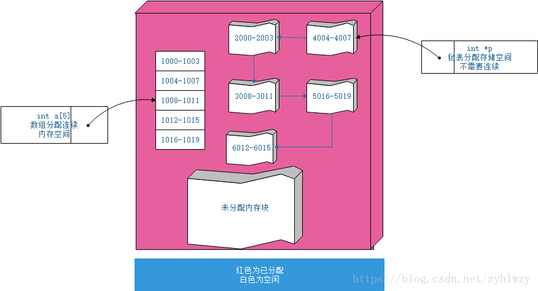
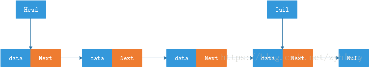
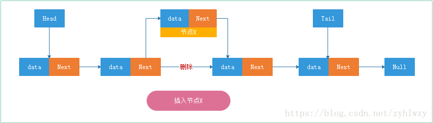
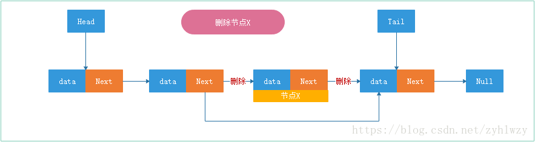
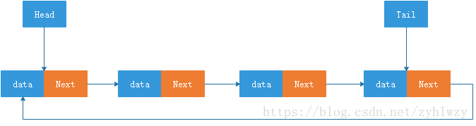
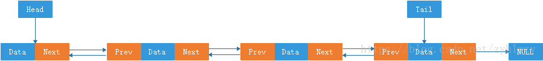
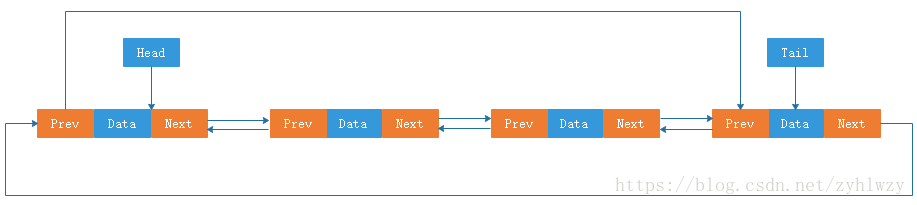
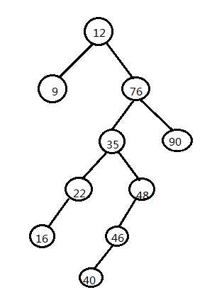

1. 说一下几种常见的排序算法和分别的复杂度

    1. 基本概念 
        1. 稳定排序(stable sort)和非稳定排序 

            稳定排序是所有相等的数经过某种排序方法后，仍能保持它们在排序之前的相对次序，。反之，就是非稳定的排序。 

            比如：一组数排序前是a1,a2,a3,a4,a5，其中a2=a4，经过某种排序后为a1,a2,a4,a3,a5， 

            则我们说这种排序是稳定的，因为a2排序前在a4的前面，排序后它还是在a4的前面。假如变成a1,a4,a2,a3,a5就不是稳定的了。 

        2. 内排序( internal sorting )和外排序( external sorting) 

            在排序过程中，所有需要排序的数都在内存，并在内存中调整它们的存储顺序，称为内排序；在排序过程中，只有部分数被调入内存，并借助内存调整数在外存中的存放顺序排序方法称为外排序。 

        3. 算法的时间复杂度和空间复杂度 

            所谓算法的时间复杂度，是指执行算法所需要的计算工作量。一个算法的空间复杂度，一般是指执行这个算法所需要的内存空间。 


    2. 几种常见算法 

        1. 冒泡排序(Bubble Sort) 

            冒泡排序(Bubble Sort)是一种简单直观的排序算法。它重复地走访过要排序的数列，一次比较两个元素，如果他们的顺序错误就把他们交换过来。走访数列的工作是重复地进行直到没有再需要交换，也就是说该数列已经排序完成。这个算法的名字由来是因为越小的元素会经由交换慢慢“浮”到数列的顶端。

            算法步骤：

            1）比较相邻的元素。如果第一个比第二个大，就交换他们两个。

            2）对每一对相邻元素作同样的工作，从开始第一对到结尾的最后一对。这步做完后，最后的元素会是最大的数。

            3）针对所有的元素重复以上的步骤，除了最后一个。

            4）持续每次对越来越少的元素重复上面的步骤，直到没有任何一对数字需要比较。

            

            冒泡排序是稳定的。算法时间复杂度是O(n^2)。 

        2. 选择排序(Selection Sort) 
           
            选择排序(Selection sort)是一种简单直观的排序算法。

            算法步骤：

            1）首先在未排序序列中找到最小（大）元素，存放到排序序列的起始位置

            2）再从剩余未排序元素中继续寻找最小（大）元素，然后放到已排序序列的末尾。

            3）重复第二步，直到所有元素均排序完毕。

            

            选择排序是不稳定的。算法复杂度是O(n^2)。        

        3. 插入排序(Insertion Sort) 

            插入排序是一种最简单直观的排序算法，它的工作原理是通过构建有序序列，对于未排序数据，在已排序序列中从后向前扫描，找到相应位置并插入。

            算法步骤：

            1）将第一待排序序列第一个元素看做一个有序序列，把第二个元素到最后一个元素当成是未排序序列。

            2）从头到尾依次扫描未排序序列，将扫描到的每个元素插入有序序列的适当位置。（如果待插入的元素与有序序列中的某个元素相等，则将待插入元素插入到相等元素的后面。）

            

            直接插入排序是稳定的。算法时间复杂度是O(n^2) 

        4. 堆排序(Heap Sort) 

            堆排序（Heapsort）是指利用堆这种数据结构所设计的一种排序算法。堆积是一个近似完全二叉树的结构，并同时满足堆积的性质：即子结点的键值或索引总是小于（或者大于）它的父节点。

            堆排序的平均时间复杂度为Ο(nlogn) 。

            算法步骤：

            1）创建一个堆H[0..n-1]

            2）把堆首（最大值）和堆尾互换

            3）把堆的尺寸缩小1，并调用shift_down(0),目的是把新的数组顶端数据调整到相应位置

            4） 重复步骤2，直到堆的尺寸为1

            

            堆排序是不稳定的。算法时间复杂度O(nlog2n)。 

        5. 归并排序(Merge Sort)

            归并排序(Merge Sort)是建立在归并操作上的一种有效的排序算法。该算法是采用分治法（Divide and Conquer）的一个非常典型的应用。

            算法步骤：

            申请空间，使其大小为两个已经排序序列之和，该空间用来存放合并后的序列

            设定两个指针，最初位置分别为两个已经排序序列的起始位置

            比较两个指针所指向的元素，选择相对小的元素放入到合并空间，并移动指针到下一位置 

            重复步骤3直到某一指针达到序列尾

            将另一序列剩下的所有元素直接复制到合并序列尾

            

            归并排序是稳定的。其时间复杂度无论是在最好情况下还是在最坏情况下均是O(nlog2n)。 

        6. 快速排序(Quick Sort)

            快速排序是由东尼·霍尔所发展的一种排序算法。在平均状况下，排序 n 个项目要Ο(n log n)次比较。在最坏状况下则需要Ο(n2)次比较，但这种状况并不常见。事实上，快速排序通常明显比其他Ο(n log n) 算法更快，因为它的内部循环（inner loop）可以在大部分的架构上很有效率地被实现出来。

            快速排序使用分治法（Divide and conquer）策略来把一个串行（list）分为两个子串行（sub-lists）。

            算法步骤：

            1 从数列中挑出一个元素，称为 “基准”（pivot），

            2 重新排序数列，所有元素比基准值小的摆放在基准前面，所有元素比基准值大的摆在基准的后面（相同的数可以到任一边）。在这个分区退出之后，该基准就处于数列的中间位置。这个称为分区（partition）操作。

            3 递归地（recursive）把小于基准值元素的子数列和大于基准值元素的子数列排序。

            递归的最底部情形，是数列的大小是零或一，也就是永远都已经被排序好了。虽然一直递归下去，但是这个算法总会退出，因为在每次的迭代（iteration）中，它至少会把一个元素摆到它最后的位置去。
            
            

            快速排序是不稳定的。最理想情况算法时间复杂度O(nlog2n)，最坏O(n ^2)。

        7. 希尔排序(Shell Sort)

            希尔排序，也称递减增量排序算法，是插入排序的一种更高效的改进版本。但希尔排序是非稳定排序算法。

            希尔排序是基于插入排序的以下两点性质而提出改进方法的：

            插入排序在对几乎已经排好序的数据操作时， 效率高， 即可以达到线性排序的效率 

            但插入排序一般来说是低效的， 因为插入排序每次只能将数据移动一位

            希尔排序的基本思想是：先将整个待排序的记录序列分割成为若干子序列分别进行直接插入排序，待整个序列中的记录“基本有序”时，再对全体记录进行依次直接插入排序。

            算法步骤：

            1）选择一个增量序列t1，t2，…，tk，其中ti>tj，tk=1；

            2）按增量序列个数k，对序列进行k 趟排序；

            3）每趟排序，根据对应的增量ti，将待排序列分割成若干长度为m 的子序列，分别对各子表进行直接插入排序。仅增量因子为1 时，整个序列作为一个表来处理，表长度即为整个序列的长度。

            

        8. 基数排序

            基数排序是一种非比较型整数排序算法，其原理是将整数按位数切割成不同的数字，然后按每个位数分别比较。由于整数也可以表达字符串（比如名字或日期）和特定格式的浮点数，所以基数排序也不是只能使用于整数。

            说基数排序之前，我们简单介绍桶排序：

            算法思想：是将阵列分到有限数量的桶子里。每个桶子再个别排序（有可能再使用别的排序算法或是以递回方式继续使用桶排序进行排序）。桶排序是鸽巢排序的一种归纳结果。当要被排序的阵列内的数值是均匀分配的时候，桶排序使用线性时间（Θ（n））。但桶排序并不是 比较排序，他不受到 O(n log n) 下限的影响。 简单来说，就是把数据分组，放在一个个的桶中，然后对每个桶里面的在进行排序。

            例如要对大小为[1..1000]范围内的n个整数A[1..n]排序

            首先，可以把桶设为大小为10的范围，具体而言，设集合B[1]存储[1..10]的整数，集合B[2]存储 (10..20]的整数，……集合B[i]存储( (i-1)*10, i*10]的整数，i = 1,2,..100。总共有 100个桶。

            然后，对A[1..n]从头到尾扫描一遍，把每个A[i]放入对应的桶B[j]中。 再对这100个桶中每个桶里的数字排序，这时可用冒泡，选择，乃至快排，一般来说任 何排序法都可以。

            最后，依次输出每个桶里面的数字，且每个桶中的数字从小到大输出，这 样就得到所有数字排好序的一个序列了。

            假设有n个数字，有m个桶，如果数字是平均分布的，则每个桶里面平均有n/m个数字。如果

            对每个桶中的数字采用快速排序，那么整个算法的复杂度是

            O(n + m * n/m*log(n/m)) = O(n + nlogn – nlogm)

            从上式看出，当m接近n的时候，桶排序复杂度接近O(n)

            当然，以上复杂度的计算是基于输入的n个数字是平均分布这个假设的。这个假设是很强的 ，实际应用中效果并没有这么好。如果所有的数字都落在同一个桶中，那就退化成一般的排序了。

            前面说的几大排序算法 ，大部分时间复杂度都是O（n2），也有部分排序算法时间复杂度是O(nlogn)。而桶式排序却能实现O（n）的时间复杂度。但桶排序的缺点是：

            1）首先是空间复杂度比较高，需要的额外开销大。排序有两个数组的空间开销，一个存放待排序数组，一个就是所谓的桶，比如待排序值是从0到m-1，那就需要m个桶，这个桶数组就要至少m个空间。

            2）其次待排序的元素都要在一定的范围内等等。
    
    5. 算法时间空间复杂度比较

        排序法|最差时间分析|平均时间复杂度|稳定度|空间复杂度
        --|--|--|--|--|--
        冒泡排序|O(n^2)|O(n^2)|稳定|O(1)
        快速排序|O(n^2)|O(n*log2n)|不稳定|O(log2n)~O(n)
        选择排序|O(n^2)|O(n^2)|稳定|O(1)
        二叉树排序|O(n^2)|O(n*log2n)|不稳定|O(n)
        插入排序|O(n^2)|O(n^2)|稳定|O(1)
        堆排序|O(n*log2n)|O(n*log2n)|不稳定	O(1)
        希尔排序|O|O|不稳定|O(1)

    原文：http://blog.sina.com.cn/s/blog_71fa0df50100zk0e.html
         https://jingyan.baidu.com/article/db55b609f856604ba30a2f18.html

2. 用Java写一个冒泡排序算法
   ```java
    package com.fhcq.bubblesort;

    public class BubbleSort {
        //主方法
        public static void main(String[] args) {
            int[] arr = { 3, 5, 7, 1, 8, 11, 9}; //定义数组 
            bubbleSort (arr); //开始排序
        }

        //排序方法
        public static void bubbleSort(int[] arrys) {
            //定义临时变量 temp
            int temp = 0;
            //用j为下标，遍历数组
            for (int j = 0; j < arrys.length; j++) {
            //对于每一个数组元素，从0到还未来排序的最大下标，总是把最大的数字放在后面
            for(int k = 0;k < arrys.length-j-1; k++){
                if(arrys[k] > arrys[k+1]){ //判断当前数字与后面数字的大小
                temp = arrys[k];
                arrys[k] = arrys[k+1];
                arrys[k+1] = temp; //用temp变量进行换值
                }
            }
        }
            bubblePrint(arrys); //打印
        }
        //打印方法
        public static void bubblePrint(int[] before){
            for(int i = 0;i < before.length; i++){ //遍历
            System.out.print(before[i] + ""); //打印，以空格隔开
            }
            System.out.println();//换行
        }
    }
   ```
3. 描述一下链式存储结构

    提起链式存储结构，其与数组是两个非常基础的数据结构，每当提到链式存储结构时，一般情况下我们都会将其与数组放到一块儿来比较。

    对于数组与链表，从结构上来看，数组是需要一块连续的内存空间来存储数据，对内存的要求非常高，比如说我们申请一个100M大小的数组，而如果我们的内存可用空间大于100M，但是没有连续的100M可用空间，那即便是我们的内存空间充足，在申请空间时也会申请失败。

    而对于链表来说，他对内存空间的要求就不会有那么高，它并不需要一块连续的内存空间，只要内存空间充足，即使内存空间存在碎片，只要碎片的大小足够存储一个链表节点的数据，该碎片的空间都有可能被分配，链表通过指针或者引用的方式将一组零散的空间串联起来使用。所以如果一个链表需要100M的空间，但是如果内存空间充足，但是没有一个连续的空间大于100M，也不会影响链表的空间分配。

    

    对于链式存储结构，一般情况下我们遇到最多且最常用的大概有单向链表，双向链表，循环链表三种。

    链表是通过指针或者引用将分散的内存块链接在一起，我们把串联在链表上的每一个内存块称为链表的节点。

    #### 单向链表
    在链表结构中，每个节点仅存储本身需要存储的数据和下一个节点地址的这种链表结构，我们称为单链表结构，其示意图如下：

    

    如图所示，在单链表中的每个节点中，除了数据区域外，还有一个区域存储了当前节点的下一节点的地址，我们把这个记录下个结点地址的指针或引用叫作后继指针或引用Next。

    在我们的单链表结构中，有两个节点比较特殊，那就是第一个节点和最后一个节点。在链式存储结构中，我们将第一个节点称为头结点，将最后一个节点称为尾节点。头节点记录链表的起始地址，有了这个地址，我们就可以遍历整个链表。尾节点的后继指针或者引用不是指向一个具体的节点，而是指向一个空地址NULL，从而表示该节点为链表的尾节点。

    与数组一样，链表也支持数据的插入、查找、删除。

    但是我们都知道，数组在进行数据的插入，删除操作时，为了保证内存数据的连续性，往往需要做大量的数据搬移工作，所以时间复杂度是O(n)。而在链表中插入或删除数据时，因为链表结构中的节点并不需要连续的存储空间，所以在链表中进行数据的插入和删除时并不需要搬移节点。对于链表的删除和插入操作，我们只需要调整相邻节点的后继指针即可，所以对应的时间复杂度是O(1)。

    

    


    和数组相比，链表如果需要访问第k个元素，就没有数组那么简单了。因为数组的内存数据是连续的，当我们需要访问第k个元素时，通过基地址（base_address）和数据类型大小就可以随机访问到数据所在的内存地址。
    
    ```
    array[k]_address=base_address+k*data_type_size;
    ```

    但是对于链表来讲，因为链表中各个节点的数据在内存中时分散的，不像数组那样是连续的存储空间，所以要访问链表中的第k个元素，只能从头结点开始，根据节点间的后继指针或引用逐一遍历，直到找到相应的节点，所以链表的随机访问的性能没有数组好，时间复杂度为O(n)。

    #### 循环链表
    说完单链表，我们继续来看一下循环链表。循环链表是一种特殊的单链表，特殊之处在于，我们在单链表中，尾节点的后继指针或者引用不是指向一个具体的节点，而是指向一个空地址NULL，表示这就是最后一个节点。而将单链表的尾节点从指向空地址NULL调整为指向头结点Head，就形成了循环链表。

    

    和单链表相比，循环链表的优点是从链尾到链头比较方便。当要处理的数据具有环型结构特点时，就特别适合采用循环链表。比如著名的约瑟夫问题，尽管用单链表也可以实现，但是用循环链表实现的话，代码就会简洁很多。

    #### 双向链表
    单向链表是单向的，只有一个后继指针或者引用Next指向后面的节点，而双向链表，指的是一个链表结构，它支持两个方向，每个节点不止只有一个后继指针或者引用Next指向后继节点，还有一个前驱指针或者引用Prev指向前面的节点。

    

    从图中可以得知，双向链表需要额外的空间来存储后继节点和前驱节点的地址，所以，存储同样多的数据，双向链表要比单向链表需要的存储空间要多。虽然两个指针或者引用比较浪费存储空间，但可以支持双向遍历，这样也带来了双向链表操作的灵活性。

    从双向链表的结构看，双向链表可以在O(1)的时间复杂度下找到前驱节点，基于此特性，在某些特殊的场景下，对节点的删除和插入操作，双向链表比单向链表会更高效。

    我们先看一下删除指定指针或引用指向的节点操作。

    1. 要删除指定指针或引用指向的节点，首先我们需要遍历整个链表，找到指定的节点X；
    2. 找到节点X之后，我们需要找到其前驱节点，对于单向链表来说，他是不支持直接获取前驱节点的，所以我们还需要重新再遍历一遍整个链表，找到节点X的前驱节点才能执行删除操作；
    3. 对于双向链表来说，这种情况就比较有优势了，找到指定节点X之后，它并不需要重新再遍历一遍链表寻找前驱节点，因为双向链表中的结点已经保存了前驱结点的指针或者引用；
    4. 所以对于找到了指定节点X并删除节点的情况，单向链表删除操作需要O(n)的时间复杂度，而双向链表只需要O(1)的时间复杂度；

    如果我们希望在链表的某个指定结点X前面插入一个结点，双向链表比单向链表也有很大的优势。双向链表可以在O(1)的时间复杂度内完成，而单向链表需要O(n)的时间复杂度才能完成。具体原因和我们上述的删除类似。

    基于双向链表在特定情况下相对于单向链表的优势，所以在我们实际的开发过程中，尽管双向链表相对耗内存，但是还是比单向链表应用广泛。比如在Java语言中LinkedHashMap 的实现原理也用到了双向链表。

    #### 双向循环链表
    上面我们说了单向链表、循环链表、双向链表，我们将循环链表和双向链表整合在一起，就形成了双向循环链表。

    

    通过前面内容的探讨，我们应该已经知道，数组和链表是两种截然不同的内存组织方式。正是因为内存存储的区别，它们插入、删除、随机访问操作的时间复杂度正好相反。

    不过，数组和链表的对比，并不能局限于时间复杂度。而且，在实际的软件开发中，不能仅仅利用复杂度分析就决定使用哪个数据结构来存储数据，一切都要根据具体情况具体分析，合适最好，共勉之。

    原文：https://blog.csdn.net/zyhlwzy/article/details/83037821

4. 如何遍历一棵二叉树

    首先编写二叉树类BinaryTree，代码如下：
    ```java
    public class BinaryTree {
        int data; // 根节点数据
        BinaryTree left; // 左子树
        BinaryTree right; // 右子树

        public BinaryTree(int data) { // 实例化二叉树类
            this.data = data;
            left = null;
            right = null;
        }

        public void insert(BinaryTree root, int data) { // 向二叉树中插入子节点
            if (data > root.data) { // 二叉树的左节点都比根节点小

                if (root.right == null) {
                    root.right = new BinaryTree(data);
                } else {
                    this.insert(root.right, data);
                }
            } else { // 二叉树的右节点都比根节点大
                if (root.left == null) {
                    root.left = new BinaryTree(data);
                } else {
                    this.insert(root.left, data);
                }
            }
        }
    }
    ```
    当建立好二叉树类后可以创建二叉树实例，并实现二叉树的先根遍历，中根遍历，后根遍历，代码如下：
    ```java
    public class BinaryTreePreorder {

        public static void preOrder(BinaryTree root) { // 先根遍历
            if (root != null) {
                System.out.print(root.data + "-");
                preOrder(root.left);
                preOrder(root.right);
            }
        }

        public static void inOrder(BinaryTree root) { // 中根遍历

            if (root != null) {
                inOrder(root.left);
                System.out.print(root.data + "--");
                inOrder(root.right);
            }
        }

        public static void postOrder(BinaryTree root) { // 后根遍历
            if (root != null) {
                postOrder(root.left);
                postOrder(root.right);
                System.out.print(root.data + "---");
            }
        }

        public static void main(String[] str) {
            int[] array = {12, 76, 35, 22, 16, 48, 90, 46, 9, 40};
            BinaryTree root = new BinaryTree(array[0]); // 创建二叉树
            for (int i = 1; i < array.length; i++) {
                root.insert(root, array[i]); // 向二叉树中插入数据
            }
            System.out.println("先根遍历：");
            preOrder(root);
            System.out.println();
            System.out.println("中根遍历：");
            inOrder(root);
            System.out.println();
            System.out.println("后根遍历：");
            postOrder(root);
        }
    }
    ```
    创建好的二叉树图形如下:

    

    当运行上面的程序后结果如下：
    ```
    先根遍历：
    12-9-76-35-22-16-48-46-40-90-
    中根遍历：
    9--12--16--22--35--40--46--48--76--90--
    后根遍历：
    9---16---22---40---46---48---35---90---76---12---
    ```

    原文：https://www.cnblogs.com/lxclqy/p/4736908.html

5. 倒排一个LinkedList
    ```java
    public class Test {
        public static void main(String args[]) {
            LinkedList<String> from = new LinkedList<String>();
            LinkedList<String> to = new LinkedList<String>();
            from.add("1");
            from.add("2");
            from.add("3");
            printList(from);

            Iterator<String> it = from.iterator();
            while(it.hasNext()) {
                to.addFirst(it.next());
            }
            printList(to);
        }
        public static void printList(LinkedList<String> list) {
            Iterator<String> it = list.iterator();
            while(it.hasNext()) {
            System.out.println(it.next());
        }
    }
    ```

    原文：https://zhidao.baidu.com/question/569040684.html

6. 用Java写一个递归遍历目录下面的所有文件
   
    ```java
    public class Test{
        public static void main(String[] args) {
		//取得目标目录
		File file = new File("D:");
		//获取目录下子文件及子文件夹
		File[] files = file.listFiles();
		readfile(files);
            
        }
        
        public static void readfile(File[] files) {
            if (files == null) {// 如果目录为空，直接退出  
                return;  
            } 
            for(File f:files) {
                //如果是文件，直接输出名字
                if(f.isFile()) {
                    System.out.println(f.getName());
                }
                //如果是文件夹，递归调用
                else if(f.isDirectory()) {
                    readfile(f.listFiles());
                }
            }
        }
    }
   ```

   原文：https://blog.csdn.net/qq_34309305/article/details/79194343 
