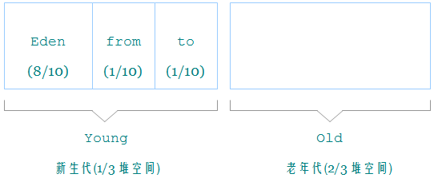
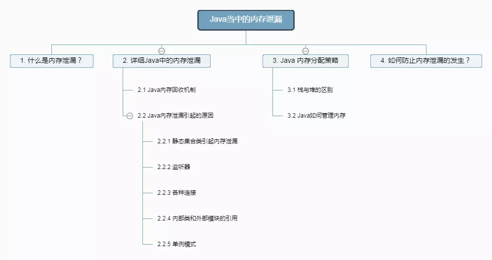
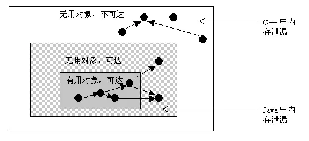
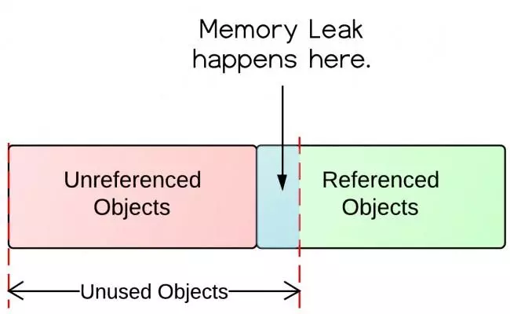
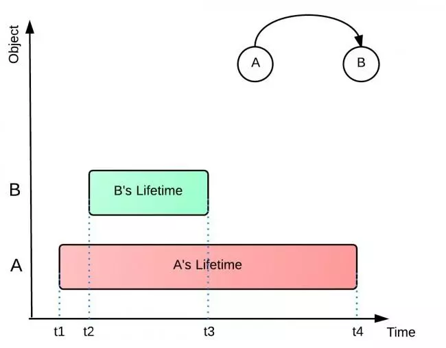
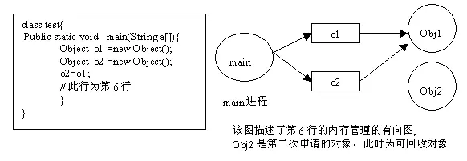
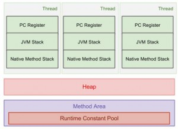

1. JVM堆的基本结构。

    Java堆可以细分为：新生代和老年代；在细致一点的有Eden空间、From Survivor空间、To Survivor空间等。

    这样划分的目的是为了使 JVM 能够更好的管理堆内存中的对象，可以根据跟个年代的特点采用最适当的收集算法。在新生代中，每次垃圾收集时都发现有大批的对象死去，只有少量存活，那就选用复制算法，只需要付出少量存活对象的复制成本就可以完成收集。而老年代中因为对象存活率高、没有额外空间对它进行分配担保，就必须使用"标记---整理"算法来进行回收。

    下图是Java堆内存默认划分示意图：

    

    绝大部分 Java 程序员应该都见过 "java.lang.OutOfMemoryError: PermGen space" 这个异常。这里的 "PermGen space"其实指的就是方法区。不过方法区和“PermGen space”又有着本质的区别。前者是 JVM 的规范，而后者则是 JVM 规范的一种实现，并且只有 HotSpot 才有 “PermGen space”，而对于其他类型的虚拟机，如 JRockit（Oracle）、J9（IBM） 并没有“PermGen space”。由于方法区主要存储类的相关信息，所以对于动态生成类的情况比较容易出现永久代的内存溢出。最典型的场景就是，在 jsp 页面比较多的情况，容易出现永久代内存溢出。

    方法区与Java堆一样，是各个线程共享的内存区域，它用于存储已被Java虚拟机加载的类信息、常量、静态变量、即时编译器编译后的代码等数据。

    在Java8中移除了永生代，取而代之是元空间(Metaspace)

    * 移除了永久代（PermGen），替换为元空间（Metaspace）

    * 永久代中的 class metadata 转移到了 native memory（本地内存，而不是虚拟机）；

    * 永久代中的 interned Strings 和 class static variables 转移到了 Java heap；

    * 永久代参数 （PermSize MaxPermSize） -> 元空间参数（MetaspaceSize MaxMetaspaceSize）

    原文：https://www.nowcoder.com/questionTerminal/5c3dc3914da548e5b0617f4da9da7488?toCommentId=84121

2. JVM的垃圾算法有哪几种？CMS垃圾回收的基本流程？

    一共有七种：
    1. Serial
    2. ParNew
    3. Parallel  Scavenge
    4. CMS
    5. Serial Old(MSC)
    6. Parrallel Old
    7. G1 

    #### CMS：Concurrent Mark Sweep。

    看名字就知道，CMS是一款并发、使用标记-清除算法的gc。
    
    CMS是针对老年代进行回收的GC。 

    #### CMS有什么用？

    CMS以获取最小停顿时间为目的。
    
    在一些对响应时间有很高要求的应用或网站中，用户程序不能有长时间的停顿，CMS 可以用于此场景。 

    #### CMS如何执行？

    总体来说CMS的执行过程可以分为以下几个阶段：  
    1. 初始标记(STW)
    2. 并发标记
    3. 并发预清理
    4. 重标记(STW)
    5. 并发清理
    6. 重置

    #### CMS缺点？

    1. CMS回收器采用的基础算法是Mark-Sweep。所有CMS不会整理、压缩堆空间
    2. CMS需要更多的CPU资源。
    3. CMS需要更大的堆空间。
    4. CMS回收器减少了回收的停顿时间，但是降低了堆空间的利用率。

    原文：https://blog.csdn.net/ITzhangdaopin/article/details/78730106 

3. JVM有哪些常用启动参数可以调整，描述几个？
    各主要JVM启动参数的作用如下：

    * -Xms：设置jvm内存的初始大小
    * -Xmx：设置jvm内存的最大值
    * -Xmn：设置新域的大小（这个似乎只对jdk1.4来说是有效的，后来就废弃了）
    * -Xss：设置每个线程的堆栈大小(也就是说,在相同物理内存下，减小这个值能生成更多的线程)
    * -XX：NewRatio:设置新域与旧域之比，如-XX：NewRatio=4就表示新域与旧域之比为1：4
    * -XX:NewSize：设置新域的初始值
    * -XX:MaxNewSize：设置新域的最大值
    * -XX:MaxPermSize：设置永久域的最大值
    * -XX:SurvivorRatio=n:设置新域中Eden区与两个Survivor区的比值。（Eden区主要是用来存放新生的对象，而两个Survivor区则用来存放每次垃圾回收后存活下来的对象）

    JVM启动参数使用中常见的错误：

    java.lang.OutOfMemoryError相信很多开发人员都用到过，这个主要就是JVM参数没有配好引起的，但是这种错误又分两种：java.lang.OutOfMemoryError:Javaheapspace和java.lang.OutOfMemoryError:PermGenspace，其中前者是有关堆内存的内存溢出，可以同过配置-Xms和-Xmx参数来设置，而后者是有关永久域的内存溢出，可以通过配置-XX:MaxPermSize来设置。

    原文：https://blog.csdn.net/ITzhangdaopin/article/details/78730554 

4. 如何查看JVM的内存使用情况？
    * jinfo:可以输出并修改运行时的java 进程的opts。 
    * jps:与unix上的ps类似，用来显示本地的java进程，可以查看本地运行着几个java程序，并显示他们的进程号。
    * jstat:一个极强的监视VM内存工具。可以用来监视VM内存内的各种堆和非堆的大小及其内存使用量。 
    * jmap:打印出某个java进程（使用pid）内存内的所有'对象'的情况（如：产生那些对象，及其数量）。 
    * jconsole:一个java GUI监视工具，可以以图表化的形式显示各种数据。并可通过远程连接监视远程的服务器VM。 

    详细：在使用这些工具前，先用JPS命令获取当前的每个JVM进程号，然后选择要查看的JVM。 

    1. jstat

        jstat工具特别强大，有众多的可选项，详细查看堆内各个部分的使用量，以及加载类的数量。使用时，需加上查看进程的进程id，和所选参数。以下详细介绍各个参数的意义。 

        * jstat -class pid:显示加载class的数量，及所占空间等信息。 
        * jstat -compiler pid:显示VM实时编译的数量等信息。 
        * jstat -gc pid:可以显示gc的信息，查看gc的次数，及时间。其中最后五项，分别是young gc的次数，young gc的时间，full gc的次数，full gc的时间，gc的总时间。 
        * jstat -gccapacity:可以显示，VM内存中三代（young,old,perm）对象的使用和占用大小，如：PGCMN显示的是最小perm的内存使用量，PGCMX显示的是perm的内存最大使用量，PGC是当前新生成的perm内存占用量，PC是但前perm内存占用量。其他的可以根据这个类推， OC是old内纯的占用量。 
        * jstat -gcnew pid:new对象的信息。 
        * jstat -gcnewcapacity pid:new对象的信息及其占用量。 
        * jstat -gcold pid:old对象的信息。 
        * jstat -gcoldcapacity pid:old对象的信息及其占用量。 
        * jstat -gcpermcapacity pid: perm对象的信息及其占用量。 
        * jstat -util pid:统计gc信息统计。 
        * jstat -printcompilation pid:当前VM执行的信息。 

        除了以上一个参数外，还可以同时加上 两个数字，如：jstat -printcompilation 3024 250 6是每250毫秒打印一次，一共打印6次，还可以加上-h3每三行显示一下标题。

    2. jmap
    
        jmap是一个可以输出所有内存中对象的工具，甚至可以将VM 中的heap，以二进制输出成文本。 
        命令：

        * jmap -dump:format=b,file=heap.bin <pid> 
            file：保存路径及文件名 
            pid：进程编号 
        * jmap -histo:live  pid| less :堆中活动的对象以及大小 
        * jmap -heap pid : 查看堆的使用状况信息 

    3. jinfo

        jinfo的用处比较简单，就是能输出并修改运行时的java进程的运行参数。用法是jinfo -opt pid 如：查看2788的MaxPerm大小可以用 jinfo -flag MaxPermSize 2788。 

    4. jconsole

        jconsole是一个用java写的GUI程序，用来监控VM，并可监控远程的VM，非常易用，而且功能非常强。使用方法：命令行里打 jconsole，选则进程就可以了。 
        JConsole中关于内存分区的说明。 

        * Eden Space (heap)： 内存最初从这个线程池分配给大部分对象。 
        * Survivor Space (heap)：用于保存在eden space内存池中经过垃圾回收后没有被回收的对象。 
        * Tenured Generation (heap)：用于保持已经在 survivor space内存池中存在了一段时间的对象。 
        * Permanent Generation (non-heap): 保存虚拟机自己的静态(refective)数据，例如类（class）和方法（method）对象。Java虚拟机共享这些类数据。这个区域被分割为只读的和只写的， 
        * Code Cache (non-heap):HotSpot Java虚拟机包括一个用于编译和保存本地代码（native code）的内存，叫做“代码缓存区”（code cache） 

    5. jstack

        * jstack ( 查看jvm线程运行状态，是否有死锁现象等等信息) : jstack pid : thread dump 
        * jstat -gcutil  pid  1000 100  : 1000ms统计一次gc情况统计100次； 

    另外推荐一款查看jmap dump 的内存对象工具 MemoryAnalyzer 
    网址：http://www.eclipse.org/mat/，可以查看dump时对象数量，内存占用，线程情况等。

    原文：https://boendev.iteye.com/blog/882479

5. Java程序是否会内存溢出，内存泄露情况发生？举几个例子。

    如下是整篇文章的结构，所需阅读时间大约20min
    

    Java当中的内存泄漏

    1. 什么是内存泄漏？

    内存泄漏：对象已经没有被应用程序使用，但是垃圾回收器没办法移除它们，因为还在被引用着。
    在Java中，内存泄漏就是存在一些被分配的对象，这些对象有下面两个特点，首先，这些对象是可达的，即在有向图中，存在通路可以与其相连；其次，这些对象是无用的，即程序以后不会再使用这些对象。如果对象满足这两个条件，这些对象就可以判定为Java中的内存泄漏，这些对象不会被GC所回收，然而它却占用内存。

    在C++中，内存泄漏的范围更大一些。有些对象被分配了内存空间，然后却不可达，由于C++中没有GC（Garbage Collection垃圾回收），这些内存将永远收不回来。在Java中，这些不可达的对象都由GC负责回收，因此程序员不需要考虑这部分的内存泄露。
    通过分析，我们得知，对于C++，程序员需要自己管理边和顶点，而对于Java程序员只需要管理边就可以了(不需要管理顶点的释放)。通过这种方式，Java提高了编程的效率。

    

    C++与Java当中的内存泄漏

    因此，通过以上分析，我们知道在Java中也有内存泄漏，但范围比C++要小一些。因为Java从语言上保证，任何对象都是可达的，所有的不可达对象都由GC管理。

    对于程序员来说，GC基本是透明的，不可见的。虽然，我们只有几个函数可以访问GC，例如运行GC的函数System.gc()，但是根据Java语言规范定义， 该函数不保证JVM的垃圾收集器一定会执行。因为，不同的JVM实现者可能使用不同的算法管理GC。通常，GC的线程的优先级别较低。JVM调用GC的策略也有很多种，有的是内存使用到达一定程度时，GC才开始工作，也有定时执行的，有的是平缓执行GC，有的是中断式执行GC。但通常来说，我们不需要关心这些。除非在一些特定的场合，GC的执行影响应用程序的性能，例如对于基于Web的实时系统，如网络游戏等，用户不希望GC突然中断应用程序执行而进行垃圾回收，那么我们需要调整GC的参数，让GC能够通过平缓的方式释放内存，例如将垃圾回收分解为一系列的小步骤执行，Sun提供的HotSpot JVM就支持这一特性。
    下面给出一个 Java 内存泄漏的典型例子，
    ```java
    Vector v = new Vector(10);

    for (int i = 0; i < 100; i++) {
        Object o = new Object();
        v.add(o);
        o = null;
    }
    ```
    在这个例子中，我们循环申请Object对象，并将所申请的对象放入一个 Vector 中，如果我们仅仅释放引用本身，那么 Vector 仍然引用该对象，所以这个对象对 GC 来说是不可回收的。因此，如果对象加入到Vector 后，还必须从 Vector 中删除，最简单的方法就是将 Vector 对象设置为 null。
    ```java
    v = null
    ```
    要想理解这个定义，我们需要先了解一下对象在内存中的状态。下面的这张图就解释了什么是无用对象以及什么是未被引用对象。

    

    上面图中可以看出，里面有被引用对象和未被引用对象。未被引用对象会被垃圾回收器回收，而被引用的对象却不会。未被引用的对象当然是不再被使用的对象，因为没有对象再引用它。然而无用对象却不全是未被引用对象。其中还有被引用的。就是这种情况导致了内存泄漏。

    2. 详细Java中的内存泄漏
        1. Java内存回收机制

            不论哪种语言的内存分配方式，都需要返回所分配内存的真实地址，也就是返回一个指针到内存块的首地址。Java中对象是采用new或者反射的方法创建的，这些对象的创建都是在堆（Heap）中分配的，所有对象的回收都是由Java虚拟机通过垃圾回收机制完成的。GC为了能够正确释放对象，会监控每个对象的运行状况，对他们的申请、引用、被引用、赋值等状况进行监控，Java会使用有向图的方法进行管理内存，实时监控对象是否可以达到，如果不可到达，则就将其回收，这样也可以消除引用循环的问题。在Java语言中，判断一个内存空间是否符合垃圾收集的标准有两个：一个是给对象赋予了空值null，以下再没有调用过另一个是给对象赋予了新值，这样重新分配了内存空间。

        2. Java内存泄漏引起的原因

            内存泄漏是指无用对象（不再使用的对象）持续占有内存或无用对象的内存得不到及时释放，从而造成内存空间的浪费称为内存泄漏。内存泄露有时不严重且不易察觉，这样开发者就不知道存在内存泄露，但有时也会很严重，会提示你Out of memory。

            Java内存泄漏的根本原因是什么呢？长生命周期的对象持有短生命周期对象的引用就很可能发生内存泄漏，尽管短生命周期对象已经不再需要，但是因为长生命周期持有它的引用而导致不能被回收，这就是Java中内存泄漏的发生场景。

            来先看看下面的例子，为什么会发生内存泄漏。下面这个例子中，A对象引用B对象，A对象的生命周期（t1-t4）比B对象的生命周期（t2-t3）长的多。当B对象没有被应用程序使用之后，A对象仍然在引用着B对象。这样，垃圾回收器就没办法将B对象从内存中移除，从而导致内存问题，因为如果A引用更多这样的对象，那将有更多的未被引用对象存在，并消耗内存空间。

            B对象也可能会持有许多其他的对象，那这些对象同样也不会被垃圾回收器回收。所有这些没在使用的对象将持续的消耗之前分配的内存空间。

            


            具体主要有如下几大类：
            1. 静态集合类引起内存泄漏
            
            像HashMap、Vector等的使用最容易出现内存泄露，这些静态变量的生命周期和应用程序一致，他们所引用的所有的对象Object也不能被释放，因为他们也将一直被Vector等引用着。
            例如：
            ```java
            Static Vector v = new Vector(10);

            for (int i = 0; i < 100; i++) {
                Object o = new Object();
                v.add(o);
                o = null;
            }
            ```
            在这个例子中，循环申请Object 对象，并将所申请的对象放入一个Vector 中，如果仅仅释放引用本身（o=null），那么Vector 仍然引用该对象，所以这个对象对GC 来说是不可回收的。因此，如果对象加入到Vector 后，还必须从Vector 中删除，最简单的方法就是将Vector对象设置为null。

            2. 监听器

            在 java 编程中，我们都需要和监听器打交道，通常一个应用当中会用到很多监听器，我们会调用一个控件的诸如addXXXListener() 等方法来增加监听器，但往往在释放对象的时候却没有记住去删除这些监听器，从而增加了内存泄漏的机会。

            3. 各种连接

            比如数据库连接（dataSourse.getConnection()），网络连接(socket)和io连接，除非其显式的调用了其close() 方法将其连接关闭，否则是不会自动被GC 回收的。对于Resultset 和Statement 对象可以不进行显式回收，但Connection 一定要显式回收，因为Connection 在任何时候都无法自动回收，而Connection一旦回收，Resultset 和Statement 对象就会立即为NULL。但是如果使用连接池，情况就不一样了，除了要显式地关闭连接，还必须显式地关闭Resultset Statement 对象（关闭其中一个，另外一个也会关闭），否则就会造成大量的Statement 对象无法释放，从而引起内存泄漏。这种情况下一般都会在try 里面去的连接，在finally里面释放连接。

            4. 内部类和外部模块的引用

            内部类的引用是比较容易遗忘的一种，而且一旦没释放可能导致一系列的后继类对象没有释放。此外程序员还要小心外部模块不经意的引用，例如程序员A 负责A 模块，调用了B 模块的一个方法如：
            ```java
            public void registerMsg(Object b);
            ```
            这种调用就要非常小心了，传入了一个对象，很可能模块B就保持了对该对象的引用，这时候就需要注意模块B是否提供相应的操作去除引用。

            5. 单例模式

            不正确使用单例模式是引起内存泄漏的一个常见问题，单例对象在初始化后将在 JVM 的整个生命周期中存在（以静态变量的方式），如果单例对象持有外部的引用，那么这个对象将不能被 JVM 正常回收，导致内存泄漏，考虑下面的例子：
            ```java
            public class A {
                public A() {
                    B.getInstance().setA(this);
                }
                ...
            }
            ```
            //B类采用单例模式
             ```java
            class B{
                private A a;
                private static B instance = new B();
                
                public B(){}
                
                public static B getInstance() {
                    return instance;
                }
                
                public void setA(A a) {
                    this.a = a;
                }

                public A getA() {
                    return a;
                }
            }
            ```
    3. Java 内存分配策略

        Java 程序运行时的内存分配策略有三种,分别是静态分配,栈式分配,和堆式分配，对应的，三种存储策略使用的内存空间主要分别是静态存储区（也称方法区）、栈区和堆区。

        静态存储区（方法区）：主要存放静态数据、全局 static 数据和常量。这块内存在程序编译时就已经分配好，并且在程序整个运行期间都存在。

        栈区 ：当方法被执行时，方法体内的局部变量（其中包括基础数据类型、对象的引用）都在栈上创建，并在方法执行结束时这些局部变量所持有的内存将会自动被释放。因为栈内存分配运算内置于处理器的指令集中，效率很高，但是分配的内存容量有限。

        堆区 ： 又称动态内存分配，通常就是指在程序运行时直接 new 出来的内存，也就是对象的实例。这部分内存在不使用时将会由 Java 垃圾回收器来负责回收。

        1. 栈与堆的区别
        
        在方法体内定义的（局部变量）一些基本类型的变量和对象的引用变量都是在方法的栈内存中分配的。当在一段方法块中定义一个变量时，Java 就会在栈中为该变量分配内存空间，当超过该变量的作用域后，该变量也就无效了，分配给它的内存空间也将被释放掉，该内存空间可以被重新使用。
        堆内存用来存放所有由 new 创建的对象（包括该对象其中的所有成员变量）和数组。在堆中分配的内存，将由 Java 垃圾回收器来自动管理。在堆中产生了一个数组或者对象后，还可以在栈中定义一个特殊的变量，这个变量的取值等于数组或者对象在堆内存中的首地址，这个特殊的变量就是我们上面说的引用变量。我们可以通过这个引用变量来访问堆中的对象或者数组。
        举个栗子：
        ```java
        public class Sample {
            int s1 = 0;
            Sample mSample1 = new Sample();
            
            public void method() {
                int s2 = 1;
                Sample mSample2 = new Sample();
            }
        }
        Sample mSample3 = new Sample();
        ```
        Sample 类的局部变量 s2 和引用变量 mSample2 都是存在于栈中，但 mSample2 指向的对象是存在于堆上的。
        mSample3 指向的对象实体存放在堆上，包括这个对象的所有成员变量 s1 和 mSample1，而它自己存在于栈中。
        ```
        结论：
        局部变量的基本数据类型和引用存储于栈中，引用的对象实体存储于堆中。—— 因为它们属于方法中的变量，生命周期随方法而结束。
        成员变量全部存储于堆中（包括基本数据类型，引用和引用的对象实体）—— 因为它们属于类，类对象终究是要被new出来使用的。
        ```
        了解了 Java 的内存分配之后，我们再来看看 Java 是怎么管理内存的。

        2. Java如何管理内存

        Java的内存管理就是对象的分配和释放问题。在 Java 中，程序员需要通过关键字 new 为每个对象申请内存空间 (基本类型除外)，所有的对象都在堆 (Heap)中分配空间。另外，对象的释放是由 GC 决定和执行的。在 Java 中，内存的分配是由程序完成的，而内存的释放是由 GC 完成的，这种收支两条线的方法确实简化了程序员的工作。但同时，它也加重了JVM的工作。这也是 Java 程序运行速度较慢的原因之一。因为GC 为了能够正确释放对象，GC 必须监控每一个对象的运行状态，包括对象的申请、引用、被引用、赋值等，GC 都需要进行监控。

        监视对象状态是为了更加准确地、及时地释放对象，而释放对象的根本原则就是该对象不再被引用。
        为了更好理解 GC 的工作原理，我们可以将对象考虑为有向图的顶点，将引用关系考虑为图的有向边，有向边从引用者指向被引对象。另外，每个线程对象可以作为一个图的起始顶点，例如大多程序从 main 进程开始执行，那么该图就是以 main 进程顶点开始的一棵根树。在这个有向图中，根顶点可达的对象都是有效对象，GC将不回收这些对象。如果某个对象 (连通子图)与这个根顶点不可达(注意，该图为有向图)，那么我们认为这个(这些)对象不再被引用，可以被 GC 回收。
        以下，我们举一个例子说明如何用有向图表示内存管理。对于程序的每一个时刻，我们都有一个有向图表示JVM的内存分配情况。以下右图，就是左边程序运行到第6行的示意图。
        ```java
        public class Test {

            public static void main(String[] args) {
                // TODO Auto-generated method stub
                Object o1 = new Object();
                Object o2 = new Object();
                o2 = o1;//此行为第6行
            }
        }
        ```
        

    4. 如何防止内存泄漏的发生？

        在了解了引起内存泄漏的一些原因后，应该尽可能地避免和发现内存泄漏。

        1. 好的编码习惯

        最基本的建议就是尽早释放无用对象的引用，大多数程序员在使用临时变量的时候，都是让引用变量在退出活动域后，自动设置为 null 。在使用这种方式时候，必须特别注意一些复杂的对象图，例如数组、列、树、图等，这些对象之间有相互引用关系较为复杂。对于这类对象，GC 回收它们一般效率较低。如果程序允许，尽早将不用的引用对象赋为null。另外建议几点：
        在确认一个对象无用后，将其所有引用显式的置为null；
        当类从 Jpanel 或 Jdialog 或其它容器类继承的时候，删除该对象之前不妨调用它的 removeall() 方法；在设一个引用变量为 null 值之前，应注意该引用变量指向的对象是否被监听，若有，要首先除去监听器，然后才可以赋空值；当对象是一个 Thread 的时候，删除该对象之前不妨调用它的
        interrupt() 方法；内存检测过程中不仅要关注自己编写的类对象，同时也要关注一些基本类型的对象，例如：int[]、String、char[] 等等；如果有数据库连接，使用 try…finally 结构，在 finally 中关闭 Statement 对象和连接。
        
        2.  好的测试工具

        在开发中不能完全避免内存泄漏，关键要在发现有内存泄漏的时候能用好的测试工具迅速定位问题的所在。市场上已有几种专业检查 Java 内存泄漏的工具，它们的基本工作原理大同小异，都是通过监测 Java 程序运行时，所有对象的申请、释放等动作，将内存管理的所有信息进行统计、分析、可视化。开发人员将根据这些信息判断程序是否有内存泄漏问题。这些工具包括 Optimizeit Profiler、JProbe Profiler、JinSight、Rational 公司的 Purify 等。

        3. 注意像 HashMap 、ArrayList 的集合对象

        特别注意一些像 HashMap 、ArrayList 的集合对象，它们经常会引发内存泄漏。当它们被声明为 static 时，它们的生命周期就会和应用程序一样长。

        4. 注意 事件监听 和 回调函数

        特别注意 事件监听 和 回调函数 。当一个监听器在使用的时候被注册，但不再使用之后却未被反注册。
        “如果一个类自己管理内存，那开发人员就得小心内存泄漏问题了。” 通常一些成员变量引用其他对象，初始化的时候需要置空。

    原文：https://www.jianshu.com/p/54b5da7c6816

6. 你常用的JVM配置和调优参数都有哪些？分别什么作用？

    #### 堆配置
    * -Xms:初始堆大小
    * -Xms：最大堆大小
    * -XX:NewSize=n:设置年轻代大小
    * -XX:NewRatio=n:设置年轻代和年老代的比值。如：为3表示年轻代和年老代比值为1：3，年轻代占整个年轻代年老代和的1/4
    * -XX:SurvivorRatio=n:年轻代中Eden区与两个Survivor区的比值。注意Survivor区有两个。如3表示Eden： 3 Survivor：2，一个Survivor区占整个年轻代的1/5
    * -XX:MaxPermSize=n:设置持久代大小


    说明：
    1. 一般初始堆和最大堆设置一样，因为：现在内存不是什么稀缺的资源，但是如果不一样，从初始堆到最大堆的过程会有一定的性能开销，所以一般设置为初始堆和最大堆一样。64位系统理论上可以设置为无限大，但是一般设置为4G,因为如果再大，JVM进行垃圾回收出现的暂停时间会比较长，这样全GC过长，影响JVM对外提供服务，所以不能太大。一般设置为4G。
    2. XX:NewRaio和-XX:SurvivorRatio这两个参数，都是设置年轻代和年老代的大小的，设置一个即可，第一是设置年轻代的大小，第二个是设置比值，理论上设置一个既可以满足需求


    #### 收集器设置
    * -XX:+UseSerialGC:设置串行收集器
    * -XX:+UseParallelGC:设置并行收集器
    * -XX:+UseParalledlOldGC:设置并行年老代收集器
    * -XX:+UseConcMarkSweepGC:设置并发收集器

    #### 垃圾回收统计信息
    打印GC回收的过程日志信息
    * -XX:+PrintGC 
    * -XX:+PrintGCDetails
    * -XX:+PrintGCTimeStamps
    * -Xloggc:filename

    #### 并行收集器设置
    * -XX:ParallelGCThreads=n:设置并行收集器收集时使用的CPU数。并行收集线程数
    * -XX:MaxGCPauseMillis=n:设置并行收集最大的暂停时间（如果到这个时间了，垃圾回收器依然没有回收完，也会停止回收）
    * -XX:GCTimeRatio=n:设置垃圾回收时间占程序运行时间的百分比。公式为：1/(1+n)
    * -XX:+CMSIncrementalMode:设置为增量模式。适用于单CPU情况
    * -XX:ParallelGCThreads=n:设置并发收集器年轻代手机方式为并行收集时，使用的CPU数。并行收集线程数

    原文：https://www.jianshu.com/p/5be9c56171dd

7. JVM的内存结构？

    #### 一、java内存组成介绍：堆(Heap)和非堆(Non-heap)内存
    
    按照官方的说法：“Java 虚拟机具有一个堆，堆是运行时数据区域，所有类实例和数组的内存均从此处分配。堆是在 Java 虚拟机启动时创建的。”“在JVM中堆之外的内存称为非堆内存(Non-heap memory)”。可以看出JVM主要管理两种类型的内存：堆和非堆。简单来说堆就是Java代码可及的内存，是留给开发人员使用的；非堆就是JVM留给 自己用的，所以方法区、JVM内部处理或优化所需的内存(如JIT编译后的代码缓存)、每个类结构(如运行时常数池、字段和方法数据)以及方法和构造方法 的代码都在非堆内存中。

    #### 二、JVM内存区域模型
    
    

    1. 方法区 
        
        也称”永久代” 、“非堆”， 它用于存储虚拟机加载的类信息、常量、静态变量、是各个线程共享的内存区域。默认最小值为16MB，最大值为64MB，可以通过-XX:PermSize 和 -XX:MaxPermSize 参数限制方法区的大小。

        运行时常量池：是方法区的一部分，其中的主要内容来自于JVM对Class的加载。

        Class文件中除了有类的版本、字段、方法、接口等描述信息外，还有一项信息是常量池，用于存放编译器生成的各种符号引用，这部分内容将在类加载后放到方法区的运行时常量池中。

    2. 虚拟机栈

        描述的是java 方法执行的内存模型：每个方法被执行的时候 都会创建一个“栈帧”用于存储局部变量表(包括参数)、操作栈、方法出口等信息。每个方法被调用到执行完的过程，就对应着一个栈帧在虚拟机栈中从入栈到出栈的过程。声明周期与线程相同，是线程私有的。

        局部变量表存放了编译器可知的各种基本数据类型(boolean、byte、char、short、int、float、long、double)、对象引用(引用指针，并非对象本身)，其中64位长度的long和double类型的数据会占用2个局部变量的空间，其余数据类型只占1个。局部变量表所需的内存空间在编译期间完成分配，当进入一个方法时，这个方法需要在栈帧中分配多大的局部变量是完全确定的，在运行期间栈帧不会改变局部变量表的大小空间。

    3. 本地方法栈

        与虚拟机栈基本类似，区别在于虚拟机栈为虚拟机执行的java方法服务，而本地方法栈则是为Native方法服务。

    4. 堆

        也叫做java 堆、GC堆是java虚拟机所管理的内存中最大的一块内存区域，也是被各个线程共享的内存区域，在JVM启动时创建。该内存区域存放了对象实例及数组(所有new的对象)。其大小通过-Xms(最小值)和-Xmx(最大值)参数设置，-Xms为JVM启动时申请的最小内存，默认为操作系统物理内存的1/64但小于1G，-Xmx为JVM可申请的最大内存，默认为物理内存的1/4但小于1G，默认当空余堆内存小于40%时，JVM会增大Heap到-Xmx指定的大小，可通过-XX:MinHeapFreeRation=来指定这个比列；当空余堆内存大于70%时，JVM会减小heap的大小到-Xms指定的大小，可通过XX:MaxHeapFreeRation=来指定这个比列，对于运行系统，为避免在运行时频繁调整Heap的大小，通常-Xms与-Xmx的值设成一样。

        由于现在收集器都是采用分代收集算法，堆被划分为新生代和老年代。新生代主要存储新创建的对象和尚未进入老年代的对象。老年代存储经过多次新生代GC(Minor GC)任然存活的对象。

        新生代： 程序新创建的对象都是从新生代分配内存，新生代由Eden Space和两块相同大小的Survivor Space(通常又称S0和S1或From和To)构成，可通过-Xmn参数来指定新生代的大小，也可以通过-XX:SurvivorRation来调整Eden Space及Survivor Space的大小。 老年代： 用于存放经过多次新生代GC任然存活的对象，例如缓存对象，新建的对象也有可能直接进入老年代，主要有两种情况：①.大对象，可通过启动参数设置-XX:PretenureSizeThreshold=1024(单位为字节，默认为0)来代表超过多大时就不在新生代分配，而是直接在老年代分配。②.大的数组对象，切数组中无引用外部对象。 老年代所占的内存大小为-Xmx对应的值减去-Xmn对应的值。

        ```
        Young Generation        即图中的Eden + From Space + To Space
        Eden                    存放新生的对象
        Survivor Space          有两个，存放每次垃圾回收后存活的对象
        Old Generation          Tenured Generation 即图中的Old Space 
                                主要存放应用程序中生命周期长的存活对象
        ```
    5. 程序计数器

        是最小的一块内存区域，它的作用是当前线程所执行的字节码的行号指示器，在虚拟机的模型里，字节码解释器工作时就是通过改变这个计数器的值来选取下一条需要执行的字节码指令，分支、循环、异常处理、线程恢复等基础功能都需要依赖计数器完成。

    #### 三、直接内存
    
    直接内存并不是虚拟机内存的一部分，也不是Java虚拟机规范中定义的内存区域。jdk1.4中新加入的NIO，引入了通道与缓冲区的IO方式，它可以调用Native方法直接分配堆外内存，这个堆外内存就是本机内存，不会影响到堆内存的大小。

    #### 四、Java堆内存的10个要点
    
    1. Java堆内存是操作系统分配给JVM的内存的一部分。
    2. 当我们创建对象时，它们存储在Java堆内存中。
    3. 为了便于垃圾回收，Java堆空间分成三个区域，分别叫作New Generation, Old Generation或叫作Tenured Generation，还有Perm Space。
    4. 你可以通过用JVM的命令行选项 -Xms, -Xmx, -Xmn来调整Java堆空间的大小。不要忘了在大小后面加上”M”或者”G”来表示单位。举个例子，你可以用 -Xmx256m来设置堆内存最大的大小为256MB。
    5. 你可以用JConsole或者 Runtime.maxMemory(), Runtime.totalMemory(), Runtime.freeMemory()来查看Java中堆内存的大小。
    6. 你可以使用命令“jmap”来获得heap dump，用“jhat”来分析heap dump。
    7. Java堆空间不同于栈空间，栈空间是用来储存调用栈和局部变量的。
    8. Java垃圾回收器是用来将死掉的对象(不再使用的对象)所占用的内存回收回来，再释放到Java堆空间中。
    9. 当你遇到java.lang.outOfMemoryError时，不要紧张，有时候仅仅增加堆空间就可以了，但如果经常出现的话，就要看看Java程序中是不是存在内存泄露了。
    10. 请使用Profiler和Heap dump分析工具来查看Java堆空间，可以查看给每个对象分配了多少内存。

    原文：http://www.hollischuang.com/archives/80

8. 常用的GC策略，什么时候会触发YGC，什么时候触发FGC？

    ### 一、内存回收策略和常见概念
    
    常见内存回收策略可以从以下几个维度来理解：
    1. 串行&并行 
        * 串行：单线程执行内存回收工作。十分简单，无需考虑同步等问题，但耗时较长，不适合多cpu。
        * 并行：多线程并发进行回收工作。适合多CPU，效率高。

    2. 并发& stop the world 
        * stop the world：jvm里的应用线程会挂起，只有垃圾回收线程在工作进行垃圾清理工作。简单，无需考虑回收不干净等问题。
        *  并发：在垃圾回收的同时，应用也在跑。保证应用的响应时间。会存在回收不干净需要二次回收的情况。
    
    3. 压缩&非压缩&copy 
        * 压缩：在进行垃圾回收后，会通过滑动，把存活对象滑动到连续的空间里，清理碎片，保证剩余的空间是连续的。
        * 非压缩：保留碎片，不进行压缩。
        * copy：将存活对象移到新空间，老空间全部释放。（需要较大的内存。）
 
    一个垃圾回收算法，可以从上面几个维度来考虑和设计，而最终产生拥有不同特性适合不同场景的垃圾回收器。


    ### 二、JVM的YGC&FGC
    
    YGC ：对新生代堆进行GC。频率比较高，因为大部分对象的存活寿命较短，在新生代里被回收。性能耗费较小。

    FGC ：全堆范围的GC。默认堆空间使用到达80%(可调整)的时候会触发FGC。以我们生产环境为例，一般比较少会触发FGC，有时10天或一周左右会有一次。


     ### 三、什么时候会触发YGC,什么时候触发FGC?

    * YGC的时机:

        * eden空间不足

    * FGC的时机：

        1. old空间不足；

        2. perm空间不足；

        3. 显示调用System.gc() ，包括RMI等的定时触发;

        4. YGC时的悲观策略；

        5. dump live的内存信息时(jmap –dump:live)。

    对YGC的 触发时机，相当的显而易见，就是eden空间不足， 这时候就肯定会触发ygc

    对于FGC的触发时机， old空间不足， 和perm的空间不足， 调用system.gc()这几个都比较显而易见，就是在这种情况下， 一般都会触发GC。

    最复杂的是所谓的悲观策略，它触发的机制是在首先会计算之前晋升的平均大小，也就是从新生代，通过ygc变成新生代的平均大小，然后如果旧生代剩余的空间小于晋升大小，那么就会触发一次FullGC。sdk考虑的策略是， 从平均和长远的情况来看，下次晋升空间不够的可能性非常大， 与其等到那时候在fullGC 不如悲观的认为下次肯定会触发FullGC， 直接先执行一次FullGC。而且从实际使用过程中来看， 也达到了比较稳定的效果。

    原文：https://blog.csdn.net/ITzhangdaopin/article/details/78737641 