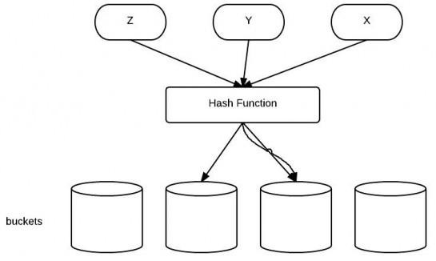
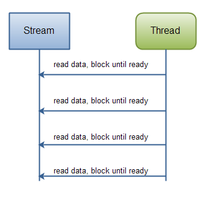
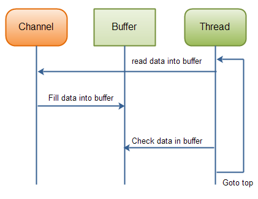
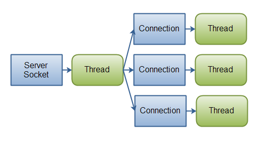

1. 接口与抽象类的区别？ 
    1. 抽象类

        抽象类是用来捕捉子类的通用特性的 。它不能被实例化，只能被用作子类的超类。抽象类是被用来创建继承层级里子类的模板。以JDK中的GenericServlet为例：
        ```java
        public abstract class GenericServlet implements Servlet, ServletConfig, Serializable {
            // abstract method
            abstract void service(ServletRequest req, ServletResponse res);

            void init() {
                // Its implementation
            }
            // other method related to Servlet
        }
        ```
        当HttpServlet类继承GenericServlet时，它提供了service方法的实现：
        ```java
        public class HttpServlet extends GenericServlet {
            void service(ServletRequest req, ServletResponse res) {
                // implementation
            }

            protected void doGet(HttpServletRequest req, HttpServletResponse resp) {
                // Implementation
            }

            protected void doPost(HttpServletRequest req, HttpServletResponse resp) {
                // Implementation
            }

            // some other methods related to HttpServlet
        }
        ```
    2. 接口

        接口是抽象方法的集合。如果一个类实现了某个接口，那么它就继承了这个接口的抽象方法。这就像契约模式，如果实现了这个接口，那么就必须确保使用这些方法。接口只是一种形式，接口自身不能做任何事情。以Externalizable接口为例：
        ```java
        public interface Externalizable extends Serializable {

            void writeExternal(ObjectOutput out) throws IOException;

            void readExternal(ObjectInput in) throws IOException, ClassNotFoundException;
        }
        ```
        当你实现这个接口时，你就需要实现上面的两个方法：
        ```java
        public class Employee implements Externalizable {

            int employeeId;
            String employeeName;

            @Override
            public void readExternal(ObjectInput in) throws IOException, ClassNotFoundException {
                employeeId = in.readInt();
                employeeName = (String) in.readObject();

            }

            @Override
            public void writeExternal(ObjectOutput out) throws IOException {

                out.writeInt(employeeId);
                out.writeObject(employeeName);
            }
        }
        ```
    3. 抽象类和接口的对比

        参数|抽象类|接口
        --|--|--
        默认的方法实现|它可以有默认的方法实现|接口完全是抽象的。它根本不存在方法的实现
        实现|子类使用extends关键字来继承抽象类。如果子类不是抽象类的话，它需要提供抽象类中所有声明的方法的实现。|子类使用关键字implements来实现接口。它需要提供接口中所有声明的方法的实现
        构造器|抽象类可以有构造器|接口不能有构造器
        与正常Java类的区别|除了你不能实例化抽象类之外，它和普通Java类没有任何区别|接口是完全不同的类型
        访问修饰符|抽象方法可以有public、protected和default这些修饰符|接口方法默认修饰符是public。你不可以使用其它修饰符。
        main方法|抽象方法可以有main方法并且我们可以运行它|接口没有main方法，因此我们不能运行它。
        多继承|抽象方法可以继承一个类和实现多个接口|接口只可以继承一个或多个其它接口
        速度|它比接口速度要快|接口是稍微有点慢的，因为它需要时间去寻找在类中实现的方法。
        添加新方法|如果你往抽象类中添加新的方法，你可以给它提供默认的实现。因此你不需要改变你现在的代码。|如果你往接口中添加方法，那么你必须改变实现该接口的类。
    4. 什么时候使用抽象类和接口

        1. 如果你拥有一些方法并且想让它们中的一些有默认实现，那么使用抽象类吧。
        1. 如果你想实现多重继承，那么你必须使用接口。由于Java不支持多继承，子类不能够继承多个类，但可以实现多个接口。因此你就可以使用接口来解决它。
        1. 如果基本功能在不断改变，那么就需要使用抽象类。如果不断改变基本功能并且使用接口，那么就需要改变所有实现了该接口的类。

    参考：http://www.importnew.com/12399.html

2. Java中的异常有哪几类？分别怎么使用？ 

    1. 异常类有分为编译时异常和运行时异常
        1. 编译时异常:写代码的时候就会提醒你有异常

            1. IOException
            1. SQLException
            1. CloneNotSupportedException
            1. parseException

        2. 运行时异常:java.lang.RuntimeException,运行的时候会在控制台提示异常

            1. NullPointerException: 空指针异常,一般出现于数组,空对象的变量和方法
            1. ArrayIndexOutOfBoundsException: 数组越界异常
            1. ArrayStoreException: 数据存储异常
            1. NoClassDefFoundException: java运行时系统找不到所引用的类
            1. ArithmeticException: 算数异常,一般在被除数是0中
            1. ClassCastException: 类型转换异常
            1. IllegalArgumentException: 非法参数异常
            1. IllegalThreadStateException: 非法线程状态异常
            1. NumberFormatException: 数据格式异常
            1. OutOfMemoryException: 内存溢出异常
            1. PatternSyntaxException: 正则异常

        3. 自定义异常:

            自定义一个类,继承某个异常类
            1. 如果继承的是Exception那么就定义了一个编译时异常
            1. 如果继承的是RuntimeException或者其子类,那么就定义了一个运行时异常

    1. 怎么使用
        1. 一种是在方法中声名异常,谁调用就把异常抛给谁

        2. 一种是使用try{}..catch{}块处理异常
            1. 如果多个异常处理的方式不同,可以用多个catch处理
            1. 如果所有异常处理方式一样,可以捕获一个父类异常进行统一的处理
            1. 如果多个异常分成了不同的组,那么同一组异常之间可以使用|隔开(jdk1.7开始)
            1. jdk1.7还增加了增强tr(){}catch(){},通常用于自动关流

    1. 异常知识扩展
        1. Throwable类是所有异常的超类,有两个子类,分为Error和Exception
            1. Error:错误是无法处理的,只能更改代码,就像一个人得癌症一样
            1. Exception:异常是可以处理的,就像是感冒一样,吃药就能好

        2. 在方法重写的时候
            1. 子类抛出的编译时异常不能超过父类编译时异常范围
            1. 子类不能抛出比父类更多的编译时异常(这里是指抛出异常的范围不能更大,但个数可以更多)
            编译时异常随你抛

    参考：https://blog.csdn.net/JetaimeHQ/article/details/83031899

3. 常用的集合类有哪些？比如List如何排序？ 

4. ArrayList和LinkedList内部的实现大致是怎样的？他们之间的区别和优缺点？ 

5. 内存溢出是怎么回事？请举一个例子？ 
    #### 内存泄露

    什么是内存泄露，因为执行程序指令，引入数据，装载数据等等，都是需要内存空间的，内存空间也是有限的。

    正常的程序执行，肯定是开辟内存空间，运行程序指令(输入、输出)，程序结束，释放空间。这样可以保证内存的往复利用。

    但是，有时候程序设计有漏洞或是不够严谨的话，导致占用的内存没有得到释放，那么这一块内存就没办法再利用了，这就是内存泄露。

    当不断出现内存泄露的时候，被占用的内存空间越来越多，最终到下一次需要使用内存空间的时候就会这样——空间不够了，溢出了。

    #### Java的内存溢出

    对于Java，内存溢出分三种情况。
    1. OutOfMemoryError： PermGen space

        Permanent Generation space 这个区域主要用来保存加来的Class的一些信息，在程序运行期间属于永久占用的，Java的GC不会对他进行释放，所以如果启动的程序加载的信息比较大，超出了这个空间的大小，就会发生溢出错误；

        解决的办法无非就是增加空间分配了——增加java虚拟机中的XX:PermSize和XX:MaxPermSize参数的大小，其中
        * XX:PermSize是初始永久保存区域大小
        * XX:MaxPermSize是最大永久保存区域大小。

    2. OutOfMemoryError：Java heap space

        heap 是Java内存中的堆区，主要用来存放对象，当对象太多超出了空间大小，GC又来不及释放的时候，就会发生溢出错误。
        Java中对象的创建是可控的，但是对象的回收是由GC自动的，一般来说，当已存在对象没有引用(即不可达)的时候，GC就会定时的来回收对象，释放空间。但是因为程序的设计问题，导致对象可达但是又没有用(即前文提到的内存泄露)，当这种情况越来越多的时候，问题就来了。
        针对这个问题，我们需要做一下两点：
        1. 检查程序，减少大量重复创建对象的死循环，减少内存泄露。
        2. 增加Java虚拟机中Xms（初始堆大小）和Xmx（最大堆大小）参数的大小。

    3. StackOverFlowError

        stack是Java内存中的栈空间，主要用来存放方法中的变量，参数等临时性的数据的，发生溢出一般是因为分配空间太小，或是执行的方法递归层数太多创建了占用了太多栈帧导致溢出。
        针对这个问题，除了修改配置参数-Xss参数增加线程栈大小之外，优化程序是尤其重要。

    参考：https://www.jianshu.com/p/8c31ef19983a

6. ==和equals的区别？ 
    1. 对于==，比较的是值是否相等
        * 如果作用于基本数据类型的变量，则直接比较其存储的 “值”是否相等；
        * 如果作用于引用类型的变量，则比较的是所指向的对象的地址

    2.  对于equals方法
        * equals方法不能作用于基本数据类型的变量，equals继承Object类，比较的是是否是同一个对象

        * 如果没有对equals方法进行重写，则比较的是引用类型的变量所指向的对象的地址；

        * 诸如String、Date等类对equals方法进行了重写的话，比较的是所指向的对象的内容。

    ```java
    public class TestString {
        public static void main(String[] args) {
        String s1 = "Monday";
        String s2 = "Monday";   //s1 == s2，因为指向String缓冲池的同一个地址
        String s3 = new String("Monday");//s2 != s3,但是s2 equals s3，s3不存放在String缓冲池，而是一个新地址
        s3 = s3.intern();   //s2 == s3同时s2 equals s3，intern()方法检查字符串池里是否存在"Monday"这么一个字符串，如果存在，就返回池里的字符串；如果不存在，该方法会 把"Monday"添加到字符串池中，然后再返回它的引用
    }
    ```

    参考：https://blog.csdn.net/qq_27471405/article/details/81010094
    
7. hashCode方法的作用？ 
    #### 前言
    Object提供给我们了一个Native的方法“public native int hashCode();”，本文讲讲Hash是什么以及HashCode的作用

    #### Hash
    先用一张图看下什么是Hash

    

    Hash是散列的意思，就是把任意长度的输入，通过散列算法变换成固定长度的输出，该输出就是散列值。关于散列值，有以下几个关键结论：
    1. 如果散列表中存在和散列原始输入K相等的记录，那么K必定在f(K)的存储位置上

    2. 不同关键字经过散列算法变换后可能得到同一个散列地址，这种现象称为碰撞

    3. 如果两个Hash值不同（前提是同一Hash算法），那么这两个Hash值对应的原始输入必定不同

    #### HashCode

    然后讲下什么是HashCode，总结几个关键点：

    1. HashCode的存在主要是为了查找的快捷性，HashCode是用来在散列存储结构中确定对象的存储地址的

    2. 如果两个对象equals相等，那么这两个对象的HashCode一定也相同

    3. 如果对象的equals方法被重写，那么对象的HashCode方法也尽量重写

    4. 如果两个对象的HashCode相同，不代表两个对象就相同，只能说明这两个对象在散列存储结构中，存放于同一个位置

    #### HashCode有什么用

    回到最关键的问题，HashCode有什么用？不妨举个例子：

    1. 假设内存中有0 1 2 3 4 5 6 7 8这9个位置，如果我有个字段叫做ID，那么我要把这个字段存放在以上8个位置之一，如果不用HashCode而任意存放，那么当查找时就需要到8个位置中去挨个查找

    2. 使用HashCode则效率会快很多，把ID的HashCode%8，然后把ID存放在取得余数的那个位置，然后每次查找该类的时候都可以通过ID的HashCode%8求余数直接找到存放的位置了

    3. 如果ID的HashCode%8算出来的位置上本身已经有数据了怎么办？这就取决于算法的实现了，比如ThreadLocal中的做法就是从算出来的位置向后查找第一个为空的位置，放置数据；HashMap的做法就是通过链式结构连起来。反正，只要保证放的时候和取的时候的算法一致就行了。

    4. 如果ID的HashCode%8相等怎么办（这种对应的是第三点说的链式结构的场景）？这时候就需要定义equals了。先通过HashCode%8来判断类在哪一个位置，再通过equals来在这个位置上寻找需要的类。对比两个类的时候也差不多，先通过HashCode比较，假如HashCode相等再判断equals。如果两个类的HashCode都不相同，那么这两个类必定是不同的。

    举个实际的例子Set。我们知道Set里面的元素是不可以重复的，那么如何做到？Set是根据equals()方法来判断两个元素是否相等的。
    
    比方说Set里面已经有1000个元素了，那么第1001个元素进来的时候，最多可能调用1000次equals方法，如果equals方法写得复杂，对比的东西特别多，那么效率会大大降低。使用HashCode就不一样了，
    
    比方说HashSet，底层是基于HashMap实现的，先通过HashCode取一个模，这样一下子就固定到某个位置了，如果这个位置上没有元素，那么就可以肯定HashSet中必定没有和新添加的元素equals的元素，就可以直接存放了，都不需要比较；如果这个位置上有元素了，逐一比较，比较的时候先比较HashCode，HashCode都不同接下去都不用比了，肯定不一样，HashCode相等，再equals比较，没有相同的元素就存，有相同的元素就不存。如果原来的Set里面有相同的元素，只要HashCode的生成方式定义得好（不重复），不管Set里面原来有多少元素，只需要执行一次的equals就可以了。这样一来，实际调用equals方法的次数大大降低，提高了效率。

    参考：https://www.cnblogs.com/xrq730/p/4842028.html

8. NIO是什么？适用于何种场景？ 
    #### Java NIO和IO之间的主要区别
    下表总结了Java NIO和IO之间的主要区别。 我将在表格后面的部分详细介绍每个区别。
    IO|NIO
    --|--
    面向流|利用缓冲区
    阻塞IO|非阻塞IO
    ||Selectors

    #### 流导向vs缓冲导向
    Java NIO和IO之间的第一大区别是IO是面向流的，其中NIO是面向缓冲区的。 那么，这是什么意思？

    面向流的Java IO意味着您一次从流中读取一个或多个字节。 你所做的读字节取决于你。 他们没有被缓存在任何地方。 而且，您不能前后移动数据流。 如果您需要前后移动从流中读取的数据，则需要先将其缓存在缓冲区中。

    Java NIO的面向缓冲区的方法略有不同。 数据被读入一个缓冲区，稍后进行处理。 您可以根据需要前后移动缓冲区。 这给你在处理过程中更多的灵活性。 但是，您还需要检查缓冲区是否包含您需要的所有数据，以便对其进行全面处理。 而且，您需要确保在将更多数据读入缓冲区时，不会覆盖尚未处理的缓冲区中的数据。

    #### 阻塞vs非阻塞IO
    Java IO的各种流都被阻塞。 这意味着，当一个线程调用一个read（）或write（）时，该线程被阻塞，直到有一些数据要读取，或者数据被完全写入。 线程在此期间不能做其他事情。

    Java NIO的非阻塞模式使得线程可以请求从一个通道读取数据，并且只获取当前可用的数据，或者根本没有任何数据可用。 线程可以继续使用别的东西，而不是在数据可用于读取之前保持阻塞状态。
    无阻塞写入也是如此。 一个线程可以请求将一些数据写入一个通道，但不要等待它被完全写入。 线程然后可以继续，同时做其他事情。

    线程在没有被IO阻塞的情况下花费空闲时间，通常是在其他通道上同时执行IO。 也就是说，一个线程现在可以管理多个输入输出通道。

    #### Selectors
    Java NIO的选择器允许单线程监视多个输入通道。 您可以使用选择器注册多个通道，然后使用单个线程“选择”可用于处理的输入通道，或者选择准备写入的通道。 这个选择器机制使单个线程可以轻松管理多个通道。

    #### NIO和IO如何影响应用程序设计
    无论您选择NIO还是IO作为您的IO工具包，都可能会影响您应用程序设计的以下方面：
    1. API调用NIO或IO类。
    2. 数据的处理。
    3. 用于处理数据的线程数。

    #### API调用
    当然，使用NIO时的API调用看起来不同于使用IO时的调用。 这并不奇怪。 而不只是从例如数据字节读取字节。 一个InputStream，数据必须首先被读入一个缓冲区，然后从那里被处理。
    #### 数据处理
    当使用纯粹的NIO设计时，数据的处理也会受到IO设计的影响。
    在IO设计中，您从InputStream或Reader读取字节的数据字节。 想象一下，你正在处理一系列基于行的文本数据。 例如：
    ```
    Name: Anna
    Age: 25
    Email: anna@mailserver.com
    Phone: 1234567890
    ```
    这条文本行可以像这样处理：
    ```java
    InputStream input = ... ; // get the InputStream from the client socket

    BufferedReader reader = new BufferedReader(new InputStreamReader(input));

    String nameLine   = reader.readLine();
    String ageLine    = reader.readLine();
    String emailLine  = reader.readLine();
    String phoneLine  = reader.readLine();
    ```
    注意处理状态是由程序执行的程度决定的。 换句话说，一旦第一个reader.readLine（）方法返回，您肯定知道已经读取了一整行文本。 readLine（）阻塞直到读完整行，这就是为什么。 你也知道这行包含名字。 同样，当第二个readLine（）调用返回时，您知道该行包含年龄等

    正如你所看到的，只有当有新的数据要读取时，程序才会进行，并且每一步你都知道数据是什么。 一旦正在执行的线程通过读取代码中的某段数据，线程就不会在数据中倒退（大部分不是）。 这个原理在这个图中也有说明：

    

    NIO的实现看起来不同。 这是一个简单的例子：
    ```java
    ByteBuffer buffer = ByteBuffer.allocate(48);

    int bytesRead = inChannel.read(buffer);
    ```
    注意从通道读取字节到ByteBuffer的第二行。 当该方法调用返回时，您不知道所需的所有数据是否在缓冲区内。 所有你知道的是，缓冲区包含一些字节。 这使得处理有点困难。

    想象一下，如果在第一次读取（缓冲区）调用之后，所有读入缓冲区的内容都是半行。 例如，"Name: An"。 你能处理这些数据吗？ 不是真的。 你需要等待，直到完整的一行数据已经进入缓冲区，才有意义处理任何数据。

    那么如何知道缓冲区中是否包含足够的数据才能处理？ 那么，你没有。 唯一的办法就是查看缓冲区中的数据。 结果是，您可能需要多次检查缓冲区中的数据，才能知道所有数据是否在内部。 这既是低效的，而且在程序设计方面可能变得混乱。 例如：
    ```java
    ByteBuffer buffer = ByteBuffer.allocate(48);

    int bytesRead = inChannel.read(buffer);

    while(! bufferFull(bytesRead) ) {
        bytesRead = inChannel.read(buffer);
    }
    ```
    bufferFull（）方法必须跟踪有多少数据被读入缓冲区，并根据缓冲区是否已满而返回true或false。 换句话说，如果缓冲区准备好处理，则认为已满。
    bufferFull（）方法扫描缓冲区，但必须保持缓冲区处于与调用bufferFull（）方法之前相同的状态。 否则，读入缓冲区的下一个数据可能无法在正确的位置读入。 这不是不可能的，但这是另一个需要注意的问题。
    如果缓冲区已满，可以进行处理。 如果它没有满，那么你可能能够部分处理任何数据，如果这在你的特定情况下是有意义的。 在许多情况下，它不是。
    图中显示了is-data-in-buffer-ready循环：

    

    #### 概要
    NIO允许您仅使用一个（或几个）线程来管理多个通道（网络连接或文件），但代价是解析数据可能比从阻塞流读取数据时要复杂一些。

    如果你需要管理数以千计的同时打开的连接，每一个只发送一点点的数据，例如聊天服务器，在NIO中实现服务器可能是一个优势。 同样，如果你需要保持与其他计算机的大量开放连接，例如 在P2P网络中，使用单个线程来管理所有出站连接可能是一个优势。 这一个线程，多个连接设计如下图所示：

    

    如果您的连接带宽非常高，一次发送大量数据，那么传统的IO服务器实现可能是最合适的。 该图说明了一个经典的IO服务器设计：

    

    参考：https://www.jianshu.com/p/18f9d350b5c9?mType=Group

9. HashMap实现原理，如何保证HashMap的线程安全？ 

10. JVM内存结构，为什么需要GC？ 

11. NIO模型，select/epoll的区别，多路复用的原理 

12. Java中一个字符占多少个字节，扩展再问int, long, double占多少字节 

13. 创建一个类的实例都有哪些办法？ 

14. final/finally/finalize的区别？ 

15. Session/Cookie的区别？ 

16. String/StringBuffer/StringBuilder的区别，扩展再问他们的实现？ 
    1. 三者在执行速度方面的比较：StringBuilder >  StringBuffer  >  String

    2. String <（StringBuffer，StringBuilder）的原因

        * String：字符串常
        * StringBuffer：字符创变量
        * StringBuilder：字符创变量
        ```java
        String s = "abcd";
        s = s+1;
        System.out.print(s);// result : abcd1
        ```
        首先创建对象s，赋予一个abcd，然后再创建一个新的对象s用来执行第二行代码，也就是说我们之前对象s并没有变化，所以我们说String类型是不可改变的对象了，由于这种机制，每当用String操作字符串时，实际上是在不断的创建新的对象，而原来的对象就会变为垃圾被GC回收掉，可想而知这样执行效率会有多低。

        而StringBuffer与StringBuilder就不一样了，他们是字符串变量，是可改变的对象，每当我们用它们对字符串做操作时，实际上是在一个对象上操作的，这样就不会像String一样创建一些而外的对象进行操作了，当然速度就快了

    3. 一个特殊的例子：
        ```java
        String str = "This is only a" + " simple" + " test"; //等同于 String str = "This is only a simple test";
        StringBuffer builder = new StringBuilder("This is only a").append(" simple").append(" test");
        ```
        这个时候StringBuffer居然速度上根本一点都不占优势。

    4. StringBuilder与 StringBuffer

        * StringBuilder：线程非安全的
        * StringBuffer：线程安全的

        当我们在字符串缓冲去被多个线程使用是，JVM不能保证StringBuilder的操作是安全的，虽然他的速度最快，但是可以保证StringBuffer是可以正确操作的。当然大多数情况下就是我们是在单线程下进行的操作，所以大多数情况下是建议用StringBuilder而不用StringBuffer的，就是速度的原因。

        对于三者使用的总结： 
        1. 如果要操作少量的数据用 = String
        2. 单线程操作字符串缓冲区 下操作大量数据 = StringBuilder
        3. 多线程操作字符串缓冲区 下操作大量数据 = StringBuffer

    参考：https://www.cnblogs.com/strugglion/p/6389236.html
17. Servlet的生命周期？ 

18. 如何用Java分配一段连续的1G的内存空间？需要注意些什么？ 

19. Java有自己的内存回收机制，但为什么还存在内存泄露的问题呢？ 

20. 什么是java序列化，如何实现java序列化?(写一个实例)？ 

21. String s = new String("abc");创建了几个 String Object? 