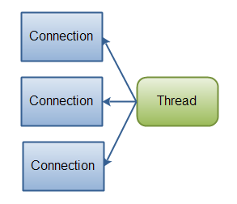
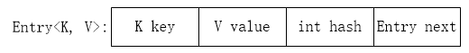
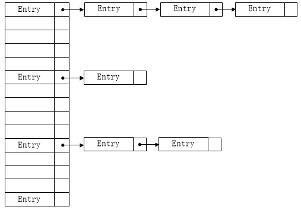
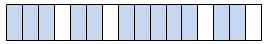

1. 接口与抽象类的区别？ 
    1. 抽象类

        抽象类是用来捕捉子类的通用特性的 。它不能被实例化，只能被用作子类的超类。抽象类是被用来创建继承层级里子类的模板。以JDK中的GenericServlet为例：
        ```java
        public abstract class GenericServlet implements Servlet, ServletConfig, Serializable {
            // abstract method
            abstract void service(ServletRequest req, ServletResponse res);

            void init() {
                // Its implementation
            }
            // other method related to Servlet
        }
        ```
        当HttpServlet类继承GenericServlet时，它提供了service方法的实现：
        ```java
        public class HttpServlet extends GenericServlet {
            void service(ServletRequest req, ServletResponse res) {
                // implementation
            }

            protected void doGet(HttpServletRequest req, HttpServletResponse resp) {
                // Implementation
            }

            protected void doPost(HttpServletRequest req, HttpServletResponse resp) {
                // Implementation
            }

            // some other methods related to HttpServlet
        }
        ```
    2. 接口

        接口是抽象方法的集合。如果一个类实现了某个接口，那么它就继承了这个接口的抽象方法。这就像契约模式，如果实现了这个接口，那么就必须确保使用这些方法。接口只是一种形式，接口自身不能做任何事情。以Externalizable接口为例：
        ```java
        public interface Externalizable extends Serializable {

            void writeExternal(ObjectOutput out) throws IOException;

            void readExternal(ObjectInput in) throws IOException, ClassNotFoundException;
        }
        ```
        当你实现这个接口时，你就需要实现上面的两个方法：
        ```java
        public class Employee implements Externalizable {

            int employeeId;
            String employeeName;

            @Override
            public void readExternal(ObjectInput in) throws IOException, ClassNotFoundException {
                employeeId = in.readInt();
                employeeName = (String) in.readObject();

            }

            @Override
            public void writeExternal(ObjectOutput out) throws IOException {

                out.writeInt(employeeId);
                out.writeObject(employeeName);
            }
        }
        ```
    3. 抽象类和接口的对比

        参数|抽象类|接口
        --|--|--
        默认的方法实现|它可以有默认的方法实现|接口完全是抽象的。它根本不存在方法的实现
        实现|子类使用extends关键字来继承抽象类。如果子类不是抽象类的话，它需要提供抽象类中所有声明的方法的实现。|子类使用关键字implements来实现接口。它需要提供接口中所有声明的方法的实现
        构造器|抽象类可以有构造器|接口不能有构造器
        与正常Java类的区别|除了你不能实例化抽象类之外，它和普通Java类没有任何区别|接口是完全不同的类型
        访问修饰符|抽象方法可以有public、protected和default这些修饰符|接口方法默认修饰符是public。你不可以使用其它修饰符。
        main方法|抽象方法可以有main方法并且我们可以运行它|接口没有main方法，因此我们不能运行它。
        多继承|抽象方法可以继承一个类和实现多个接口|接口只可以继承一个或多个其它接口
        速度|它比接口速度要快|接口是稍微有点慢的，因为它需要时间去寻找在类中实现的方法。
        添加新方法|如果你往抽象类中添加新的方法，你可以给它提供默认的实现。因此你不需要改变你现在的代码。|如果你往接口中添加方法，那么你必须改变实现该接口的类。
    4. 什么时候使用抽象类和接口

        1. 如果你拥有一些方法并且想让它们中的一些有默认实现，那么使用抽象类吧。
        1. 如果你想实现多重继承，那么你必须使用接口。由于Java不支持多继承，子类不能够继承多个类，但可以实现多个接口。因此你就可以使用接口来解决它。
        1. 如果基本功能在不断改变，那么就需要使用抽象类。如果不断改变基本功能并且使用接口，那么就需要改变所有实现了该接口的类。

    原文：http://www.importnew.com/12399.html

2. Java中的异常有哪几类？分别怎么使用？ 

    1. 异常类有分为编译时异常和运行时异常
        1. 编译时异常:写代码的时候就会提醒你有异常

            1. IOException
            1. SQLException
            1. CloneNotSupportedException
            1. parseException

        2. 运行时异常:java.lang.RuntimeException,运行的时候会在控制台提示异常

            1. NullPointerException: 空指针异常,一般出现于数组,空对象的变量和方法
            1. ArrayIndexOutOfBoundsException: 数组越界异常
            1. ArrayStoreException: 数据存储异常
            1. NoClassDefFoundException: java运行时系统找不到所引用的类
            1. ArithmeticException: 算数异常,一般在被除数是0中
            1. ClassCastException: 类型转换异常
            1. IllegalArgumentException: 非法参数异常
            1. IllegalThreadStateException: 非法线程状态异常
            1. NumberFormatException: 数据格式异常
            1. OutOfMemoryException: 内存溢出异常
            1. PatternSyntaxException: 正则异常

        3. 自定义异常:

            自定义一个类,继承某个异常类
            1. 如果继承的是Exception那么就定义了一个编译时异常
            1. 如果继承的是RuntimeException或者其子类,那么就定义了一个运行时异常

    1. 怎么使用
        1. 一种是在方法中声名异常,谁调用就把异常抛给谁

        2. 一种是使用try{}..catch{}块处理异常
            1. 如果多个异常处理的方式不同,可以用多个catch处理
            1. 如果所有异常处理方式一样,可以捕获一个父类异常进行统一的处理
            1. 如果多个异常分成了不同的组,那么同一组异常之间可以使用|隔开(jdk1.7开始)
            1. jdk1.7还增加了增强tr(){}catch(){},通常用于自动关流

    1. 异常知识扩展
        1. Throwable类是所有异常的超类,有两个子类,分为Error和Exception
            1. Error:错误是无法处理的,只能更改代码,就像一个人得癌症一样
            1. Exception:异常是可以处理的,就像是感冒一样,吃药就能好

        2. 在方法重写的时候
            1. 子类抛出的编译时异常不能超过父类编译时异常范围
            1. 子类不能抛出比父类更多的编译时异常(这里是指抛出异常的范围不能更大,但个数可以更多)
            编译时异常随你抛

    原文：https://blog.csdn.net/JetaimeHQ/article/details/83031899

3. 常用的集合类有哪些？比如List如何排序？ 

4. ArrayList和LinkedList内部的实现大致是怎样的？他们之间的区别和优缺点？ 

5. 内存溢出是怎么回事？请举一个例子？ 
    #### 内存泄露

    什么是内存泄露，因为执行程序指令，引入数据，装载数据等等，都是需要内存空间的，内存空间也是有限的。

    正常的程序执行，肯定是开辟内存空间，运行程序指令(输入、输出)，程序结束，释放空间。这样可以保证内存的往复利用。

    但是，有时候程序设计有漏洞或是不够严谨的话，导致占用的内存没有得到释放，那么这一块内存就没办法再利用了，这就是内存泄露。

    当不断出现内存泄露的时候，被占用的内存空间越来越多，最终到下一次需要使用内存空间的时候就会这样——空间不够了，溢出了。

    #### Java的内存溢出

    对于Java，内存溢出分三种情况。
    1. OutOfMemoryError： PermGen space

        Permanent Generation space 这个区域主要用来保存加来的Class的一些信息，在程序运行期间属于永久占用的，Java的GC不会对他进行释放，所以如果启动的程序加载的信息比较大，超出了这个空间的大小，就会发生溢出错误；

        解决的办法无非就是增加空间分配了——增加java虚拟机中的XX:PermSize和XX:MaxPermSize参数的大小，其中
        * XX:PermSize是初始永久保存区域大小
        * XX:MaxPermSize是最大永久保存区域大小。

    2. OutOfMemoryError：Java heap space

        heap 是Java内存中的堆区，主要用来存放对象，当对象太多超出了空间大小，GC又来不及释放的时候，就会发生溢出错误。
        Java中对象的创建是可控的，但是对象的回收是由GC自动的，一般来说，当已存在对象没有引用(即不可达)的时候，GC就会定时的来回收对象，释放空间。但是因为程序的设计问题，导致对象可达但是又没有用(即前文提到的内存泄露)，当这种情况越来越多的时候，问题就来了。
        针对这个问题，我们需要做一下两点：
        1. 检查程序，减少大量重复创建对象的死循环，减少内存泄露。
        2. 增加Java虚拟机中Xms（初始堆大小）和Xmx（最大堆大小）参数的大小。

    3. StackOverFlowError

        stack是Java内存中的栈空间，主要用来存放方法中的变量，参数等临时性的数据的，发生溢出一般是因为分配空间太小，或是执行的方法递归层数太多创建了占用了太多栈帧导致溢出。
        针对这个问题，除了修改配置参数-Xss参数增加线程栈大小之外，优化程序是尤其重要。

    原文：https://www.jianshu.com/p/8c31ef19983a

6. ==和equals的区别？ 
    1. 对于==，比较的是值是否相等
        * 如果作用于基本数据类型的变量，则直接比较其存储的 “值”是否相等；
        * 如果作用于引用类型的变量，则比较的是所指向的对象的地址

    2.  对于equals方法
        * equals方法不能作用于基本数据类型的变量，equals继承Object类，比较的是是否是同一个对象

        * 如果没有对equals方法进行重写，则比较的是引用类型的变量所指向的对象的地址；

        * 诸如String、Date等类对equals方法进行了重写的话，比较的是所指向的对象的内容。

    ```java
    public class TestString {
        public static void main(String[] args) {
        String s1 = "Monday";
        String s2 = "Monday";   //s1 == s2，因为指向String缓冲池的同一个地址
        String s3 = new String("Monday");//s2 != s3,但是s2 equals s3，s3不存放在String缓冲池，而是一个新地址
        s3 = s3.intern();   //s2 == s3同时s2 equals s3，intern()方法检查字符串池里是否存在"Monday"这么一个字符串，如果存在，就返回池里的字符串；如果不存在，该方法会 把"Monday"添加到字符串池中，然后再返回它的引用
    }
    ```

    原文：https://blog.csdn.net/qq_27471405/article/details/81010094
    
7. hashCode方法的作用？ 
    #### 前言
    Object提供给我们了一个Native的方法“public native int hashCode();”，本文讲讲Hash是什么以及HashCode的作用

    #### Hash
    先用一张图看下什么是Hash

    

    Hash是散列的意思，就是把任意长度的输入，通过散列算法变换成固定长度的输出，该输出就是散列值。关于散列值，有以下几个关键结论：
    1. 如果散列表中存在和散列原始输入K相等的记录，那么K必定在f(K)的存储位置上

    2. 不同关键字经过散列算法变换后可能得到同一个散列地址，这种现象称为碰撞

    3. 如果两个Hash值不同（前提是同一Hash算法），那么这两个Hash值对应的原始输入必定不同

    #### HashCode

    然后讲下什么是HashCode，总结几个关键点：

    1. HashCode的存在主要是为了查找的快捷性，HashCode是用来在散列存储结构中确定对象的存储地址的

    2. 如果两个对象equals相等，那么这两个对象的HashCode一定也相同

    3. 如果对象的equals方法被重写，那么对象的HashCode方法也尽量重写

    4. 如果两个对象的HashCode相同，不代表两个对象就相同，只能说明这两个对象在散列存储结构中，存放于同一个位置

    #### HashCode有什么用

    回到最关键的问题，HashCode有什么用？不妨举个例子：

    1. 假设内存中有0 1 2 3 4 5 6 7 8这9个位置，如果我有个字段叫做ID，那么我要把这个字段存放在以上8个位置之一，如果不用HashCode而任意存放，那么当查找时就需要到8个位置中去挨个查找

    2. 使用HashCode则效率会快很多，把ID的HashCode%8，然后把ID存放在取得余数的那个位置，然后每次查找该类的时候都可以通过ID的HashCode%8求余数直接找到存放的位置了

    3. 如果ID的HashCode%8算出来的位置上本身已经有数据了怎么办？这就取决于算法的实现了，比如ThreadLocal中的做法就是从算出来的位置向后查找第一个为空的位置，放置数据；HashMap的做法就是通过链式结构连起来。反正，只要保证放的时候和取的时候的算法一致就行了。

    4. 如果ID的HashCode%8相等怎么办（这种对应的是第三点说的链式结构的场景）？这时候就需要定义equals了。先通过HashCode%8来判断类在哪一个位置，再通过equals来在这个位置上寻找需要的类。对比两个类的时候也差不多，先通过HashCode比较，假如HashCode相等再判断equals。如果两个类的HashCode都不相同，那么这两个类必定是不同的。

    举个实际的例子Set。我们知道Set里面的元素是不可以重复的，那么如何做到？Set是根据equals()方法来判断两个元素是否相等的。
    
    比方说Set里面已经有1000个元素了，那么第1001个元素进来的时候，最多可能调用1000次equals方法，如果equals方法写得复杂，对比的东西特别多，那么效率会大大降低。使用HashCode就不一样了，
    
    比方说HashSet，底层是基于HashMap实现的，先通过HashCode取一个模，这样一下子就固定到某个位置了，如果这个位置上没有元素，那么就可以肯定HashSet中必定没有和新添加的元素equals的元素，就可以直接存放了，都不需要比较；如果这个位置上有元素了，逐一比较，比较的时候先比较HashCode，HashCode都不同接下去都不用比了，肯定不一样，HashCode相等，再equals比较，没有相同的元素就存，有相同的元素就不存。如果原来的Set里面有相同的元素，只要HashCode的生成方式定义得好（不重复），不管Set里面原来有多少元素，只需要执行一次的equals就可以了。这样一来，实际调用equals方法的次数大大降低，提高了效率。

    原文：https://www.cnblogs.com/xrq730/p/4842028.html

8. NIO是什么？适用于何种场景？ 
    #### Java NIO和IO之间的主要区别
    下表总结了Java NIO和IO之间的主要区别。 我将在表格后面的部分详细介绍每个区别。
    IO|NIO
    --|--
    面向流|利用缓冲区
    阻塞IO|非阻塞IO
    ||Selectors

    #### 流导向vs缓冲导向
    Java NIO和IO之间的第一大区别是IO是面向流的，其中NIO是面向缓冲区的。 那么，这是什么意思？

    面向流的Java IO意味着您一次从流中读取一个或多个字节。 你所做的读字节取决于你。 他们没有被缓存在任何地方。 而且，您不能前后移动数据流。 如果您需要前后移动从流中读取的数据，则需要先将其缓存在缓冲区中。

    Java NIO的面向缓冲区的方法略有不同。 数据被读入一个缓冲区，稍后进行处理。 您可以根据需要前后移动缓冲区。 这给你在处理过程中更多的灵活性。 但是，您还需要检查缓冲区是否包含您需要的所有数据，以便对其进行全面处理。 而且，您需要确保在将更多数据读入缓冲区时，不会覆盖尚未处理的缓冲区中的数据。

    #### 阻塞vs非阻塞IO
    Java IO的各种流都被阻塞。 这意味着，当一个线程调用一个read()或write()时，该线程被阻塞，直到有一些数据要读取，或者数据被完全写入。 线程在此期间不能做其他事情。

    Java NIO的非阻塞模式使得线程可以请求从一个通道读取数据，并且只获取当前可用的数据，或者根本没有任何数据可用。 线程可以继续使用别的东西，而不是在数据可用于读取之前保持阻塞状态。
    无阻塞写入也是如此。 一个线程可以请求将一些数据写入一个通道，但不要等待它被完全写入。 线程然后可以继续，同时做其他事情。

    线程在没有被IO阻塞的情况下花费空闲时间，通常是在其他通道上同时执行IO。 也就是说，一个线程现在可以管理多个输入输出通道。

    #### Selectors
    Java NIO的选择器允许单线程监视多个输入通道。 您可以使用选择器注册多个通道，然后使用单个线程“选择”可用于处理的输入通道，或者选择准备写入的通道。 这个选择器机制使单个线程可以轻松管理多个通道。

    #### NIO和IO如何影响应用程序设计
    无论您选择NIO还是IO作为您的IO工具包，都可能会影响您应用程序设计的以下方面：
    1. API调用NIO或IO类。
    2. 数据的处理。
    3. 用于处理数据的线程数。

    #### API调用
    当然，使用NIO时的API调用看起来不同于使用IO时的调用。 这并不奇怪。 而不只是从例如数据字节读取字节。 一个InputStream，数据必须首先被读入一个缓冲区，然后从那里被处理。
    #### 数据处理
    当使用纯粹的NIO设计时，数据的处理也会受到IO设计的影响。
    在IO设计中，您从InputStream或Reader读取字节的数据字节。 想象一下，你正在处理一系列基于行的文本数据。 例如：
    ```
    Name: Anna
    Age: 25
    Email: anna@mailserver.com
    Phone: 1234567890
    ```
    这条文本行可以像这样处理：
    ```java
    InputStream input = ... ; // get the InputStream from the client socket

    BufferedReader reader = new BufferedReader(new InputStreamReader(input));

    String nameLine   = reader.readLine();
    String ageLine    = reader.readLine();
    String emailLine  = reader.readLine();
    String phoneLine  = reader.readLine();
    ```
    注意处理状态是由程序执行的程度决定的。 换句话说，一旦第一个reader.readLine()方法返回，您肯定知道已经读取了一整行文本。 readLine()阻塞直到读完整行，这就是为什么。 你也知道这行包含名字。 同样，当第二个readLine()调用返回时，您知道该行包含年龄等

    正如你所看到的，只有当有新的数据要读取时，程序才会进行，并且每一步你都知道数据是什么。 一旦正在执行的线程通过读取代码中的某段数据，线程就不会在数据中倒退（大部分不是）。 这个原理在这个图中也有说明：

    

    NIO的实现看起来不同。 这是一个简单的例子：
    ```java
    ByteBuffer buffer = ByteBuffer.allocate(48);

    int bytesRead = inChannel.read(buffer);
    ```
    注意从通道读取字节到ByteBuffer的第二行。 当该方法调用返回时，您不知道所需的所有数据是否在缓冲区内。 所有你知道的是，缓冲区包含一些字节。 这使得处理有点困难。

    想象一下，如果在第一次读取（缓冲区）调用之后，所有读入缓冲区的内容都是半行。 例如，"Name: An"。 你能处理这些数据吗？ 不是真的。 你需要等待，直到完整的一行数据已经进入缓冲区，才有意义处理任何数据。

    那么如何知道缓冲区中是否包含足够的数据才能处理？ 那么，你没有。 唯一的办法就是查看缓冲区中的数据。 结果是，您可能需要多次检查缓冲区中的数据，才能知道所有数据是否在内部。 这既是低效的，而且在程序设计方面可能变得混乱。 例如：
    ```java
    ByteBuffer buffer = ByteBuffer.allocate(48);

    int bytesRead = inChannel.read(buffer);

    while(! bufferFull(bytesRead) ) {
        bytesRead = inChannel.read(buffer);
    }
    ```
    bufferFull()方法必须跟踪有多少数据被读入缓冲区，并根据缓冲区是否已满而返回true或false。 换句话说，如果缓冲区准备好处理，则认为已满。
    bufferFull()方法扫描缓冲区，但必须保持缓冲区处于与调用bufferFull()方法之前相同的状态。 否则，读入缓冲区的下一个数据可能无法在正确的位置读入。 这不是不可能的，但这是另一个需要注意的问题。
    如果缓冲区已满，可以进行处理。 如果它没有满，那么你可能能够部分处理任何数据，如果这在你的特定情况下是有意义的。 在许多情况下，它不是。
    图中显示了is-data-in-buffer-ready循环：

    

    #### 概要
    NIO允许您仅使用一个（或几个）线程来管理多个通道（网络连接或文件），但代价是解析数据可能比从阻塞流读取数据时要复杂一些。

    如果你需要管理数以千计的同时打开的连接，每一个只发送一点点的数据，例如聊天服务器，在NIO中实现服务器可能是一个优势。 同样，如果你需要保持与其他计算机的大量开放连接，例如 在P2P网络中，使用单个线程来管理所有出站连接可能是一个优势。 这一个线程，多个连接设计如下图所示：

    

    如果您的连接带宽非常高，一次发送大量数据，那么传统的IO服务器实现可能是最合适的。 该图说明了一个经典的IO服务器设计：

    

    原文：https://www.jianshu.com/p/18f9d350b5c9?mType=Group

9. HashMap实现原理，如何保证HashMap的线程安全？ 
    1. 前言

        能用图说清楚的，就坚决不用代码。能用代码撸清楚的，就坚决不写解释（不是不写注释哦）。
        
        以下所有仅针对JDK 1.7及之前中的HashMap。

    2. 数据结构

        HashMap内部通过维护一个Entry<K, V>数组（变量为table），来实现其基本功能，而Entry<K, V>是HashMap的内部类，其主要作用便是存储键值对，其数据结构大致如下图所示。

        

        从Entry的数据结构可以看出，多个Entry是可以形成一个单向链表的，HashMap中维护的Entry<K, V>数组（之后简称为Entry数组，或table，容易区分）其实就是存储的一系列Entry<K, V>链表的表头。那么HashMap中存储数据table数组的数据结构，大致可以如下图所示（假设只有部分数据）。

        

        注：Entry数组的默认长度为16，负载因子为0.75。

        将上图中的每一行，称为桶（bucket），那么table的索引便是bucketIndex。而HashMap中的插入、获取、删除等操作最主要的便是对table和桶（bucket）的操作。下面将主要通过插入操作，看其数据结构的变化。

    3. 插入

        对于上图中的数据结构，插入操作便是将要插入的键 - 值（key - value）对根据key计算hash值来选择具体的存储位置。

        插入函数的源码如下（以Mark开头的或者中文注释，非JDK源码中的注释，下同）：
        ```java
        public V put(K key, V value) {
            // Mark A Begin
            if (table == EMPTY_TABLE) {
                inflateTable(threshold);
            }
            if (key == null)
                return putForNullKey(value);
            // Mark A End

            int hash = hash(key); // 计算hash值
            int i = indexFor(hash, table.length); // 计算桶的位置索引（bucketIndex）

            // Mark B begin
            for (Entry<K,V> e = table[i]; e != null; e = e.next) {
                Object k;
                if (e.hash == hash && ((k = e.key) == key || key.equals(k))) {
                    V oldValue = e.value;
                    e.value = value;
                    e.recordAccess(this);
                    return oldValue;
                }
            }
            // Mark B end

            modCount++; // 记录修改次数，迭代的时候会据此判断是否有被修改
            addEntry(hash, key, value, i);
            return null;
        }
        ```
        在上面的代码中，代码段A（Mark A Begin - Mark A End，下同）的主要作用是如果table为空则初始化数组以及插入key为null时的操作，代码段B则是插入相同key时覆盖原有的值，并返回原有的值。这里重点关注的是addEntry(hash, key, value, i)方法。

        addEntry方法源码如下：
        ```java
        void addEntry(int hash, K key, V value, int bucketIndex) {
            if ((size >= threshold) && (null != table[bucketIndex])) {
                // 扩充table数组的大小
                resize(2 * table.length);
                // 重新计算hash值
                hash = (null != key) ? hash(key) : 0;
                // 重新计算桶的位置索引
                bucketIndex = indexFor(hash, table.length);
            }

            createEntry(hash, key, value, bucketIndex);
        }
        ```
        createEntry方法源码如下：
        ```java
        void createEntry(int hash, K key, V value, int bucketIndex) {
            Entry<K,V> e = table[bucketIndex];
            // 将新的Enrty元素插入到对应桶的表头
            table[bucketIndex] = new Entry<>(hash, key, value, e);
            size++;
        }
        ```
        Entry<>实例化的源码如下：
        ```java
        Entry(int h, K k, V v, Entry<K,V> n) {
            value = v;
            next = n; // 将原先桶的表头向后移动
            key = k;
            hash = h;
        }
        ```
        在整个插入操作中，有一个很重要的操作，便是对table数组扩容，扩容的算法相对简单，但是在多线程下它却容易引发一个线程安全的问题。

        注：扩容需要会把原先table中的值移动到新的数组中，再赋值给table变量，一个合适的初始大小和负载因子能够提高效率。

    4. 线程不安全

        在多线程环境下，假设有容器map，其存储的情况如下图所示（淡蓝色为已有数据）。
        

        此时的map已经达到了扩容阈值12（16 * 0.75 = 12），而此时线程A与线程B同时对map容器进行插入操作，那么都需要扩容。此时可能出现的情况如下：线程A与线程B都进行了扩容，此时便有两个新的table，那么再赋值给原先的table变量时，便会出现其中一个newTable会被覆盖，假如线程B扩容的newTable覆盖了线程A扩容的newTable，并且是在A已经执行了插入操作之后，那么就会出现线程A的插入失效问题，也即是如下图中的两个table只能有一个会最后存在，而其中一个插入的值会被舍弃的问题。
        

        这便是HashMap的线程不安全性，当然这只是其中的一点。而要消除这种隐患，则可以加锁或使用HashTable和ConcurrentHashMap这样的线程安全类，但是HashTable不被建议使用，推荐使用ConcurrentHashMap容器。

    原文：https://blog.csdn.net/t894690230/article/details/51323946

10. JVM内存结构，为什么需要GC？ 

11. NIO模型，select/epoll的区别，多路复用的原理 

12. Java中一个字符占多少个字节，扩展再问int, long, double占多少字节 
    1. 字节：byte：用来计量存储容量的一种计量单位；位：bit
    2. 一个字节等于8位  1byte = 8bit
        * 整型：
            * byte:1个字节 8位 -128~127
            * short ：2个字节 16位
            * int ：4个字节 32位
            * long：8个字节 64位
        * 浮点型：
            * float：4个字节 32 位
            * double ：8个字节 64位

            注：默认的是double类型，如3.14是double类型的，加后缀F（3.14F）则为float类型的。
        * char类型：

            char：2个字节。所以一个char类型的可以存储一个汉字。
        * Boolean 类型

            boolean: （true or false）（并未指明是多少字节  1字节  1位 4字节）

    补充：BigInteger类实现了任意精度的整数运算，BigDecimal实现了任意精度的浮点数运算。

    原文：https://blog.csdn.net/m0_37479246/article/details/79492828

13. 创建一个类的实例都有哪些办法？ 

    1. 关键字 new。工厂模式是对这种方式的包装；
    2. 类实现克隆接口，克隆一个实例。原型模式是一个应用实例；
    3. 用该类的加载器，newinstance。java的反射，反射使用实例：Spring的依赖注入、切面编程中动态代理
    4. sun.misc.Unsafe类，allocateInstance方法创建一个实例。（Java官方也不建议直接使用的Unsafe类，据说Oracle正在计划从Java 9中去掉Unsafe类）
    5. 实现序列化接口的类，通过IO流反序列化读取一个类，获得实例。

    原文：https://blog.csdn.net/lizhen54/article/details/74544801 

14. final/finally/finalize的区别？ 
    * final

        用于修饰类、成员变量和成员方法。
        * final修饰的类，不能被继承（String、StrngBuilder、StringBuffer、Math，不可变类），其中所有的方法都不能被重写，所以不能同时用abstract和final修饰（abstract修饰的是抽象类，抽象类是用于被子类继承的，和final起相反的作用）；
        * final修饰的方法不能被重写，但是子类可以用父类中final修饰的方法；
        * final修饰的成员变量是不可变的，如果成员变量是基本数据类型，初始化之后成员变量的值不能被改变，如果成员变量是引用类型，那么它只能指向初始化时指向的那个对象，不能再指向别的对象，但是对象中的内容是允许改变的。

    * finally

        finally是在异常处理时提供finally块来执行任何清除操作。不管有没有异常被抛出、捕获都会被执行。
        * try块中的内容是在无异常时执行到结束。
        * catch块中的内容，是在try块内容发生catch所声明的异常时，跳转到catch块中执行。
        * finally块则是无论异常是否发生都会执行finally块的内容，所以在代码逻辑中有需要无论发生什么都必须执行的代码，可以放在finally块中。

        try…catch…finally结构的语法格式
        ```java
        try{
            //可能会出现异常的代码段
        }catch(异常类名 处理该异常对象){
            //异常处理代码段
        }finally{
            //总是需要执行的代码段
        }
        ```
    * finalize

        finalize是方法名，java技术允许使用finalize()方法在垃圾收集器将对象从内存中清楚出去之前做必要的清理工作。这个方法是由垃圾收集器在确定这个对象没有被引用时对这个对象调用的，它是在Object类中定义的，因此所有的类都继承了它。子类覆盖finalize()方法以整理系统资源或者执行其他清理工作。finalize()方法是在垃圾收集器删除对象之前对这个对象调用的。

    原文：https://blog.csdn.net/qq_41939384/article/details/80662933

15. Session/Cookie的区别？ 
    #### 前言
    
    HTTP是一种无状态的协议，为了分辨链接是谁发起的，需自己去解决这个问题。不然有些情况下即使是同一个网站每打开一个页面也都要登录一下。而Session和Cookie就是为解决这个问题而提出来的两个机制。
    
    #### 应用场景
    * 登录网站，今输入用户名密码登录了，第二天再打开很多情况下就直接打开了。这个时候用到的一个机制就是cookie。
    * session一个场景是购物车，添加了商品之后客户端处可以知道添加了哪些商品，而服务器端如何判别呢，所以也需要存储一些信息就用到了session。

    #### 两者说明与比较
    1. Cookie

        通俗讲，是访问某些网站后在本地存储的一些网站相关信息，下次访问时减少一些步骤。更准确的说法是：Cookies是服务器在本地机器上存储的小段文本并随每一个请求发送至同一服务器，是在客户端保持状态的方案。
        Cookie的主要内容包括：名字，值，过期时间，路径和域。使用Fiddler抓包就可以看见，比方说我们打开百度的某个网站可以看到Headers包括Cookie，如下： 
        ```java
        BIDUPSID: 9D2194F1CB8D1E56272947F6B0E5D47E 
        PSTM: 1472480791 
        BAIDUID: 3C64D3C3F1753134D13C33AFD2B38367:FG 
        ispeed_lsm: 2 
        MCITY: -131: 
        pgv_pvi: 3797581824 
        pgv_si: s9468756992 
        BDUSS: JhNXVoQmhPYTVENEdIUnQ5S05xcHZMMVY5QzFRNVh5SzZoV0xMVDR6RzV-bEJZSVFBQUFBJCQAAAAAAAAAAAEAAACteXsbYnRfY2hpbGQAAAAAAAAAAAAAAAAAAAAAAAAAAAAAAAAAAAAAAAAAAAAAAAAAAAAAAAAAAAAAAAAAAAAAAAAAALlxKVi5cSlYZj 
        BD_HOME: 1 
        H_PS_PSSID: 1423_21080_17001_21454_21408_21530_21377_21525_21193_21340 
        BD_UPN: 123253 
        sug: 3 
        sugstore: 0 
        ORIGIN: 0 
        bdime: 0
        ```
        key, value形式。过期时间可设置的，
        * 不设，存储在内存当中，则浏览器关掉就消失了，称为Session cookie/transient cookie
        * 按设置的时间来存储在硬盘上的，过期后自动清除，Persistent cookie/permenent cookie。

        路径和域就是对应的域名，a网站的cookie自然不能给b用。

    2. Session
        * 存在服务器的一种用来存放用户数据的类HashTable结构。
        * 浏览器第一次发送请求时，服务器自动生成了一HashTable和一Session ID来唯一标识这个HashTable，并将其通过响应发送到浏览器。浏览器第二次发送请求会将前一次服务器响应中的Session ID放在请求中一并发送到服务器上，服务器从请求中提取出Session ID，并和保存的所有Session ID进行对比，找到这个用户对应的HashTable。 
            * 一般这个值会有个时间限制，超时后毁掉这个值，默认30分钟。
        * 当用户在应用程序的 Web页间跳转时，存储在 Session 对象中的变量不会丢失而是在整个用户会话中一直存在下去。
        * Session的实现方式和Cookie有一定关系。建立一个连接就生成一个session id，打开几个页面就好几个了，这里就用到了Cookie，把session id存在Cookie中，每次访问的时候将Session id带过去就可以识别了.

    3. 区别
        * 存储数据量方面：session 能够存储任意的 java 对象，cookie 只能存储 String 类型的对象
        * session在服务端，cookie在客户端。因Cookie在客户端所以可以编辑伪造，不是十分安全。
        * Session过多时会消耗服务器资源，大型网站会有专门Session服务器，Cookie存在客户端没问题。
        * 域的支持范围不一样，比方说a.com的Cookie在a.com下都能用，而www.a.com的Session在api.a.com下都不能用，解决这个问题的办法是JSONP或者跨域资源共享。

    #### session多服务器间共享

    1. 服务器实现的 session 复制或 session 共享，如 webSphere或 JBOSS 在搭集群时配置实现 session 复制或 session 共享.致命缺点:不好扩展和移植。
    2. 利用成熟技术做session复制，如12306使用的gemfire，如常见内存数据库redis或memorycache，虽较普适但依赖第三方.
    3. 将 session维护在客户端，利用 cookie，但客户端存在风险数据不安全，且可以存放的数据量较小，所以将session维护在客户端还要对 session 中的信息加密。
    4. 第二种方案和第三种方案的合体，可用gemfire实现 session 复制共享，还可将session 维护在 redis中实现 session 共享，同时可将 session 维护在客户端的cookie 中，但前提是数据要加密。

    这三种方式可迅速切换，而不影响应用正常执行。在实践中，首选 gemfire 或者 redis 作为 session 共享的载体，一旦 session 不稳定出现问题的时候，可以紧急切换 cookie 维护 session 作为备用，不影响应用提供服务

    #### 单点登录中，cookie 被禁用了怎么办？（一点登陆，子网站其他系统不用再登陆）
    单点登录的原理是后端生成一个 session ID，设置到 cookie，后面所有请求浏览器都会带上cookie，然后服务端从cookie获取 session ID，查询到用户信息。
    所以，保持登录的关键不是cookie，而是通过cookie 保存和传输的 session ID，本质是能获取用户信息的数据。
    除了cookie，还常用 HTTP 请求头来传输。但这个请求头浏览器不会像cookie一样自动携带，需手工处理

    原文：https://blog.csdn.net/liyifan687/article/details/80077928

16. String/StringBuffer/StringBuilder的区别，扩展再问他们的实现？ 
    1. 三者在执行速度方面的比较：StringBuilder >  StringBuffer  >  String

    2. String <（StringBuffer，StringBuilder）的原因

        * String：字符串常
        * StringBuffer：字符创变量
        * StringBuilder：字符创变量
        ```java
        String s = "abcd";
        s = s+1;
        System.out.print(s);// result : abcd1
        ```
        首先创建对象s，赋予一个abcd，然后再创建一个新的对象s用来执行第二行代码，也就是说我们之前对象s并没有变化，所以我们说String类型是不可改变的对象了，由于这种机制，每当用String操作字符串时，实际上是在不断的创建新的对象，而原来的对象就会变为垃圾被GC回收掉，可想而知这样执行效率会有多低。

        而StringBuffer与StringBuilder就不一样了，他们是字符串变量，是可改变的对象，每当我们用它们对字符串做操作时，实际上是在一个对象上操作的，这样就不会像String一样创建一些而外的对象进行操作了，当然速度就快了

    3. 一个特殊的例子：
        ```java
        String str = "This is only a" + " simple" + " test"; //等同于 String str = "This is only a simple test";
        StringBuffer builder = new StringBuilder("This is only a").append(" simple").append(" test");
        ```
        这个时候StringBuffer居然速度上根本一点都不占优势。

    4. StringBuilder与 StringBuffer

        * StringBuilder：线程非安全的
        * StringBuffer：线程安全的

        当我们在字符串缓冲去被多个线程使用是，JVM不能保证StringBuilder的操作是安全的，虽然他的速度最快，但是可以保证StringBuffer是可以正确操作的。当然大多数情况下就是我们是在单线程下进行的操作，所以大多数情况下是建议用StringBuilder而不用StringBuffer的，就是速度的原因。

        对于三者使用的总结： 
        1. 如果要操作少量的数据用 = String
        2. 单线程操作字符串缓冲区 下操作大量数据 = StringBuilder
        3. 多线程操作字符串缓冲区 下操作大量数据 = StringBuffer

    原文：https://www.cnblogs.com/strugglion/p/6389236.html
17. Servlet的生命周期？ 
    #### Servlet 生命周期
    1. Servlet 生命周期：Servlet 加载--->实例化--->服务--->销毁。
    2. init()：在Servlet的生命周期中，仅执行一次init()方法。它是在服务器装入Servlet时执行的，负责初始化Servlet对象。可以配置服务器，以在启动服务器或客户机首次访问Servlet时装入Servlet。无论有多少客户机访问Servlet，都不会重复执行init()。
    3. service()：它是Servlet的核心，负责响应客户的请求。每当一个客户请求一个HttpServlet对象，该对象的Service()方法就要调用，而且传递给这个方法一个“请求”（ServletRequest）对象和一个“响应”（ServletResponse）对象作为参数。在HttpServlet中已存在Service()方法。默认的服务功能是调用与HTTP请求的方法相应的do功能。
    4. destroy()： 仅执行一次，在服务器端停止且卸载Servlet时执行该方法。当Servlet对象退出生命周期时，负责释放占用的资源。一个Servlet在运行service()方法时可能会产生其他的线程，因此需要确认在调用destroy()方法时，这些线程已经终止或完成。

    #### Tomcat 与 Servlet 是如何工作的：

    

    步骤：
    1. Web Client 向Servlet容器（Tomcat）发出Http请求
    2. Servlet容器接收Web Client的请求
    3. Servlet容器创建一个HttpRequest对象，将Web Client请求的信息封装到这个对象中。
    4. Servlet容器创建一个HttpResponse对象
    5. Servlet容器调用HttpServlet对象的service方法，把HttpRequest对象与HttpResponse对象作为参数传给 HttpServlet 对象。
    6. HttpServlet调用HttpRequest对象的有关方法，获取Http请求信息。
    7. HttpServlet调用HttpResponse对象的有关方法，生成响应数据。
    8. Servlet容器把HttpServlet的响应结果传给Web Client。

    #### Servlet工作原理：

    1. 首先简单解释一下Servlet接收和响应客户请求的过程，首先客户发送一个请求，Servlet是调用service()方法对请求进行响应的，通过源代码可见，service()方法中对请求的方式进行了匹配，选择调用doGet,doPost等这些方法，然后再进入对应的方法中调用逻辑层的方法，实现对客户的响应。在Servlet接口和GenericServlet中是没有doGet()、doPost()等等这些方法的，HttpServlet中定义了这些方法，但是都是返回error信息，所以，我们每次定义一个Servlet的时候，都必须实现doGet或doPost等这些方法。

    2. 每一个自定义的Servlet都必须实现Servlet的接口，Servlet接口中定义了五个方法，其中比较重要的三个方法涉及到Servlet的生命周期，分别是上文提到的init(),service(),destroy()方法。GenericServlet是一个通用的，不特定于任何协议的Servlet,它实现了Servlet接口。而HttpServlet继承于GenericServlet，因此HttpServlet也实现了Servlet接口。所以我们定义Servlet的时候只需要继承HttpServlet即可。

    3. Servlet接口和GenericServlet是不特定于任何协议的，而HttpServlet是特定于HTTP协议的类，所以HttpServlet中实现了service()方法，并将请求ServletRequest、ServletResponse 强转为HttpRequest 和 HttpResponse。

    #### 创建Servlet对象的时机

    1. Servlet容器启动时：读取web.xml配置文件中的信息，构造指定的Servlet对象，创建ServletConfig对象，同时将ServletConfig对象作为参数来调用Servlet对象的init方法。
    2. 在Servlet容器启动后：客户首次向Servlet发出请求，Servlet容器会判断内存中是否存在指定的Servlet对象，如果没有则创建它，然后根据客户的请求创建HttpRequest、HttpResponse对象，从而调用Servlet 对象的service方法。
    3. Servlet容器在启动时自动创建Servlet，这是由在web.xml文件中为Servlet设置的<load-on-startup>属性决定的。从中我们也能看到同一个类型的Servlet对象在Servlet容器中以单例的形式存在。
    ```xml
    <servlet>
            <servlet-name>Init</servlet-name>
            <servlet-class>org.xl.servlet.InitServlet</servlet-class>
            <load-on-startup>1</load-on-startup>
    </servlet>
    ```
    原文：http://www.cnblogs.com/xuekyo/archive/2013/02/24/2924072.html

18. 如何用Java分配一段连续的1G的内存空间？需要注意些什么？ 

19. Java有自己的内存回收机制，但为什么还存在内存泄露的问题呢？ 

20. 什么是java序列化，如何实现java序列化?(写一个实例)？ 
    1. 串行化技术

        * Java 串行化技术可以使你将一个对象的状态写入一个Byte 流里，并且可以从其它地方把该Byte 流里的数据读出来，重新构造一个相同的对象。这种机制允许你将对象通过网络进行传播，并可以随时把对象持久化到数据库、文件等系统里。

            * Java的串行化机制是RMI、EJB等技术的技术基础
            * 用途：利用对象的串行化实现保存应用程序的当前工作状态，下次再启动的时候将自动地恢复到上次执行的状态。

        * 序列化就是一种用来处理对象流的机制，所谓对象流也就是将对象的内容进行流化。可以对流化后的对象进行读写操作，也可将流化后的对象传输于网络之间。序列化是为了解决在对对象流进行读写操作时所引发的问题。

        * 序列化的实现：将需要被序列化的类实现Serializable接口，然后使用一个输出流(如：FileOutputStream)来构造一个ObjectOutputStream(对象流)对象，接着，使用ObjectOutputStream对象的writeObject(Object obj)方法就可以将参数为obj的对象写出(即保存其状态)，要恢复的话则用输入流。

    2. 串行化的特点

        1. 如果某个类能够被串行化，其子类也可以被串行化。如果该类有父类，则分两种情况来考虑，如果该父类已经实现了可串行化接口。则其父类的相应字段及属性的处理和该类相同；如果该类的父类没有实现可串行化接口，则该类的父类所有的字段属性将不会串行化。

        2. 声明为static和transient类型的成员数据不能被串行化。因为static代表类的状态， transient代表对象的临时数据；

        3. 相关的类和接口：在java.io包中提供的涉及对象的串行化的类与接口有ObjectOutput接口、ObjectOutputStream类、ObjectInput接口、ObjectInputStream类。

            * ObjectOutput接口：它继承DataOutput接口并且支持对象的串行化，其内的writeObject()方法实现存储一个对象。
            * ObjectInput接口：它继承DataInput接口并且支持对象的串行化，其内的readObject()方法实现读取一个对象。
            * ObjectOutputStream类：它继承OutputStream类并且实现ObjectOutput接口。利用该类来实现将对象存储（调用ObjectOutput接口中的writeObject()方法）。
            * ObjectInputStream类：它继承InputStream类并且实现ObjectInput接口。利用该类来实现读取一个对象（调用ObjectInput接口中的readObject()方法）。

    对于父类的处理，如果父类没有实现串行化接口，则其必须有默认的构造函数（即没有参数的构造函数）。否则编译的时候就会报错。在反串行化的时候，默认构造函数会被调用。但是若把父类标记为可以串行化，则在反串行化的时候，其默认构造函数不会被调用。这是为什么呢？这是因为Java 对串行化的对象进行反串行化的时候，直接从流里获取其对象数据来生成一个对象实例，而不是通过其构造函数来完成。
    ```java
    import java.io.*;

    public class Cat implements Serializable {
        private String name;
        public Cat () {
            this.name = "new cat";
        }
        public String getName() {
            return this.name;
        }
        public void setName(String name) {
            this.name = name;
        }

        public static void main(String[] args) {
            Cat cat = new Cat();
            try {
                FileOutputStream fos = new FileOutputStream("catDemo.out");
                ObjectOutputStream oos = new ObjectOutputStream(fos);
                System.out.println(" 1> " + cat.getName());
                cat.setName("My Cat");
                oos.writeObject(cat);
                oos.close();
            } catch (Exception ex) {  
                ex.printStackTrace();
            }
            try {
                FileInputStream fis = new FileInputStream("catDemo.out");
                ObjectInputStream ois = new ObjectInputStream(fis);
                cat = (Cat) ois.readObject();
                System.out.println(" 2> " + cat.getName());
                ois.close();
            } catch (Exception ex) {
                ex.printStackTrace();
            }
        }
    }
    ```
    writeObject和readObject本身就是线程安全的，传输过程中是不允许被并发访问的。所以对象能一个一个接连不断的传过来
    原文：https://blog.csdn.net/cselmu9/article/details/41908741

21. String s = new String("abc");创建了几个 String Object? 

    对于String s=new String("abc"),这句话我们来大致分析一下步骤:
    1. 在虚拟机栈中为String类型的s分配内存
    2. 在堆中为分配一块内存用来保存"abc"
    3. 将堆中指向"abc"的地址赋值给s

    这样来分析的话是在堆中创建了一个对象,而有些人会认为s也是对象啊,这不是两个吗?其实不然,s只是一个对象的引用,他指向了在堆中创建的那个对象.

    原文：https://blog.csdn.net/qq_35634181/article/details/82961297 