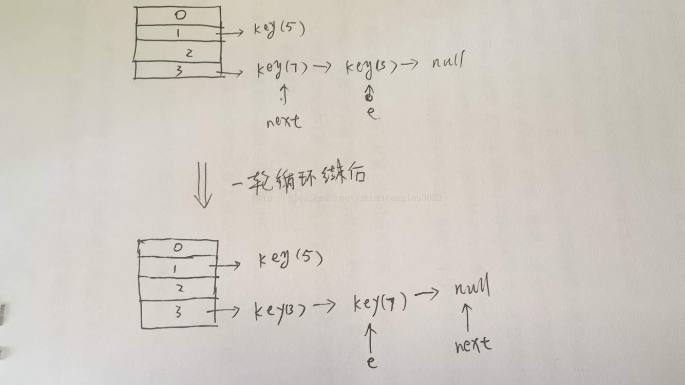

1. 如何创建线程？如何保证线程安全？
    创建线程有两种方式：
    1. 继承Thread类；
    2. 实现Runnable接口。

    一般说来，确保线程安全的方法有这几个：竞争与原子操作、同步与锁、可重入、过度优化。

    个人认为，保证线程安全，无外乎保持线程同步的方式，

    如：@synchronized、NSLock、dispatch_semaphore、NSCondition、pthread_mutex、OSSpinLock。

    然而：


    OSSpinLock和dispatch_semaphore的效率远远高于其他。

    @synchronized和NSConditionLock效率较差。

    鉴于OSSpinLock的不安全，所以我们在开发中如果考虑性能的话，建议使用dispatch_semaphore。

    如果不考虑性能，只是图个方便的话，那就使用@synchronized。

    原文：https://blog.csdn.net/ITzhangdaopin/article/details/78737892 

2. 如何实现一个线程安全的数据结构

3. 如何避免死锁
    在有些情况下死锁是可以避免的。本文将展示三种用于避免死锁的技术：

    * 加锁顺序
    * 加锁时限
    * 死锁检测

    #### 加锁顺序

    当多个线程需要相同的一些锁，但是按照不同的顺序加锁，死锁就很容易发生。

    如果能确保所有的线程都是按照相同的顺序获得锁，那么死锁就不会发生。看下面这个例子：
    ```
    Thread 1:
    lock A 
    lock B

    Thread 2:
    wait for A
    lock C (when A locked)

    Thread 3:
    wait for A
    wait for B
    wait for C
    ```
    如果一个线程(比如线程3)需要一些锁，那么它必须按照确定的顺序获取锁。它只有获得了从顺序上排在前面的锁之后，才能获取后面的锁。

    例如，线程2和线程3只有在获取了锁A之后才能尝试获取锁C(译者注：获取锁A是获取锁C的必要条件)。因为线程1已经拥有了锁A，所以线程2和3需要一直等到锁A被释放。然后在它们尝试对B或C加锁之前，必须成功地对A加了锁。

    按照顺序加锁是一种有效的死锁预防机制。但是，这种方式需要你事先知道所有可能会用到的锁(译者注：并对这些锁做适当的排序)，但总有些时候是无法预知的。

    #### 加锁时限
    另外一个可以避免死锁的方法是在尝试获取锁的时候加一个超时时间，这也就意味着在尝试获取锁的过程中若超过了这个时限该线程则放弃对该锁请求。若一个线程没有在给定的时限内成功获得所有需要的锁，则会进行回退并释放所有已经获得的锁，然后等待一段随机的时间再重试。这段随机的等待时间让其它线程有机会尝试获取相同的这些锁，并且让该应用在没有获得锁的时候可以继续运行(译者注：加锁超时后可以先继续运行干点其它事情，再回头来重复之前加锁的逻辑)。

    以下是一个例子，展示了两个线程以不同的顺序尝试获取相同的两个锁，在发生超时后回退并重试的场景：
    ```
    Thread 1 locks A
    Thread 2 locks B

    Thread 1 attempts to lock B but is blocked
    Thread 2 attempts to lock A but is blocked

    Thread 1's lock attempt on B times out
    Thread 1 backs up and releases A as well
    Thread 1 waits randomly (e.g. 257 millis) before retrying.

    Thread 2's lock attempt on A times out
    Thread 2 backs up and releases B as well
    Thread 2 waits randomly (e.g. 43 millis) before retrying.
    ```
    在上面的例子中，线程2比线程1早200毫秒进行重试加锁，因此它可以先成功地获取到两个锁。这时，线程1尝试获取锁A并且处于等待状态。当线程2结束时，线程1也可以顺利的获得这两个锁(除非线程2或者其它线程在线程1成功获得两个锁之前又获得其中的一些锁)。

    需要注意的是，由于存在锁的超时，所以我们不能认为这种场景就一定是出现了死锁。也可能是因为获得了锁的线程(导致其它线程超时)需要很长的时间去完成它的任务。

    此外，如果有非常多的线程同一时间去竞争同一批资源，就算有超时和回退机制，还是可能会导致这些线程重复地尝试但却始终得不到锁。如果只有两个线程，并且重试的超时时间设定为0到500毫秒之间，这种现象可能不会发生，但是如果是10个或20个线程情况就不同了。因为这些线程等待相等的重试时间的概率就高的多(或者非常接近以至于会出现问题)。
    (译者注：超时和重试机制是为了避免在同一时间出现的竞争，但是当线程很多时，其中两个或多个线程的超时时间一样或者接近的可能性就会很大，因此就算出现竞争而导致超时后，由于超时时间一样，它们又会同时开始重试，导致新一轮的竞争，带来了新的问题。)

    这种机制存在一个问题，在Java中不能对synchronized同步块设置超时时间。你需要创建一个自定义锁，或使用Java5中java.util.concurrent包下的工具。写一个自定义锁类不复杂，但超出了本文的内容。后续的Java并发系列会涵盖自定义锁的内容。

    #### 死锁检测

    死锁检测是一个更好的死锁预防机制，它主要是针对那些不可能实现按序加锁并且锁超时也不可行的场景。

    每当一个线程获得了锁，会在线程和锁相关的数据结构中(map、graph等等)将其记下。除此之外，每当有线程请求锁，也需要记录在这个数据结构中。

    当一个线程请求锁失败时，这个线程可以遍历锁的关系图看看是否有死锁发生。例如，线程A请求锁7，但是锁7这个时候被线程B持有，这时线程A就可以检查一下线程B是否已经请求了线程A当前所持有的锁。如果线程B确实有这样的请求，那么就是发生了死锁(线程A拥有锁1，请求锁7；线程B拥有锁7，请求锁1)。

    当然，死锁一般要比两个线程互相持有对方的锁这种情况要复杂的多。线程A等待线程B，线程B等待线程C，线程C等待线程D，线程D又在等待线程A。线程A为了检测死锁，它需要递进地检测所有被B请求的锁。从线程B所请求的锁开始，线程A找到了线程C，然后又找到了线程D，发现线程D请求的锁被线程A自己持有着。这是它就知道发生了死锁。

    下面是一幅关于四个线程(A,B,C和D)之间锁占有和请求的关系图。像这样的数据结构就可以被用来检测死锁。

    

    那么当检测出死锁时，这些线程该做些什么呢？

    一个可行的做法是释放所有锁，回退，并且等待一段随机的时间后重试。这个和简单的加锁超时类似，不一样的是只有死锁已经发生了才回退，而不会是因为加锁的请求超时了。虽然有回退和等待，但是如果有大量的线程竞争同一批锁，它们还是会重复地死锁(编者注：原因同超时类似，不能从根本上减轻竞争)。

    一个更好的方案是给这些线程设置优先级，让一个(或几个)线程回退，剩下的线程就像没发生死锁一样继续保持着它们需要的锁。如果赋予这些线程的优先级是固定不变的，同一批线程总是会拥有更高的优先级。为避免这个问题，可以在死锁发生的时候设置随机的优先级。

    原文：http://ifeve.com/deadlock-prevention/

4. Volatile关键字的作用？

    #### volatile的可见性和非原子性
    volatile保证了可见性，但是并不保证原子性！

    1. volatile关键字的两层语义
        
        一旦一个共享变量(类的成员变量、类的静态成员变量)被volatile修饰之后，那么就具备了两层语义：

        1. 保证了不同线程对这个变量进行操作时的可见性，即一个线程修改了某个变量的值，这新值对其他线程来说是立即可见的。

        2. 禁止进行指令重排序。
        
        
        volatile的可见性，即任何时刻只要有任何线程修改了volatile变量的值，其他线程总能获取到该最新值。具体更多实现可以参阅缓存一致性协议。

    2. 那么volatile为什么又不能保证原子性呢？

        以volatile int i = 10；i++；为例分析：

        i++实际为load、Increment、store三个操作。

        某一时刻线程1将i的值load取出来，放置到cpu缓存中，然后再将此值放置到寄存器A中，然后A中的值自增1(寄存器A中保存的是中间值，没有直接修改i，因此其他线程并不会获取到这个自增1的值)。如果在此时线程2也执行同样的操作，获取值i==10,自增1变为11，然后马上刷入主内存。此时由于线程2修改了i的值，实时的线程1中的i==10的值缓存失效，重新从主内存中读取，变为11。接下来线程1恢复。将自增过后的A寄存器值11赋值给cpu缓存i。这样就出现了线程安全问题。

    3. synchronized相对于volatile又是如何保证原子性呢？

        volatile：从最终汇编语言从面来看，volatile使得每次将i进行了修改之后，增加了一个内存屏障lock addl $0x0,(%rsp)保证修改的值必须刷新到主内存才能进行内存屏障后续的指令操作。但是内存屏障之前的指令并不是原子的。

        synchronized：则是使用lock cmpxchg %rsi,(%rdi)的原子指令，使得修改是原子操作。如果修改失败，则继续尝试，知道成功。

    #### 内存可见性&寄存器可见性
    数据在哪里存在呢？只在内存吗？不是的。数据在内存中存在，但是当用的时候会加载到CPU的寄存器里面。内存和寄存器是两个地方，从而出现了新的名词：内存可见性和寄存器可见性。

    为什么叫内存可见性呢？感觉很奇怪的名字。其实，明白以下道理就不奇怪了：
    数据的流动过程是：内存->寄存器->计算器


    很多时候，数据从内存地址读取到寄存器里面，后面的计算过程中CPU就一直使用寄存器里面的值，即是内存地址上的值发生变化，CPU也不知道，CPU此时就是井底之蛙，而变量此时可以称为：寄存器可见性。

    但是当变量被volatile修饰之后，CPU就不再偷懒，只要用到数据，它都会越过寄存器，直接从内存中读取，然后再在计算器中计算，最后返回给内存，这个时候变量就不在寄存器里面停留，就当寄存器不存在一样，这就称为内存可见性。

    原文：https://my.oschina.net/tantexian/blog/808032
          http://swiftlet.net/archives/3024

5. HashMap在多线程环境下使用需要注意什么？为什么？
    这个问题曾经有一个面试官问过我，当时我天真的以为是读写操作并发时存在脏数据的问题，当时面试官不置可否。我后面回来查资料，发现没有那么简单。并发操作HashMap，是有可能带来死循环以及数据丢失的问题的。

    具体情况如下：(以下代码转自美团点评技术团队的文章Java8系列之重新认识HashMap)

    情景如下代码:
    ```java
    public class HashMapInfiniteLoop {    
    
        private static HashMap<Integer,String> map = new HashMap<Integer,String>(2,0.75f);    
        public static void main(String[] args) {    
            map.put(5， "C");    
    
            new Thread("Thread1") {    
                public void run() {    
                    map.put(7, "B");    
                    System.out.println(map);    
                };    
            }.start();    
            new Thread("Thread2") {    
                public void run() {    
                    map.put(3, "A);    
                    System.out.println(map);    
                };    
            }.start();          
        }    
    }  
    ```

    其中，map初始化为一个长度为2的数组，loadFactor=0.75，threshold=2*0.75=1，也就是说当put第二个key的时候，map就需要进行扩容。

    考虑这样一种情况:
    先放出transfer的部分代码：
    ```java
        do {  
            Entry<K,V> next = e.next; //假设线程一执行到这里就被调度挂起了  
            int i = indexFor(e.hash, newCapacity);  
            e.next = newTable[i];  
            newTable[i] = e;  
            e = next;  
        } while (e != null);  
    ```

    线程1、线程2都添加了数据之后，线程1执行到transfer()方法的第一行就被调度挂起了，这时线程2被调度来执行扩容操作。线程2的扩容操作结束之后，线程1被调度回来继续执行，此时由于线程2的执行，e已经指向了线程2修改之后的反转链表，但是线程1并不知道线程2已经在它之前做过这些操作了，于是它继续往下走，此时next=key(7),

    然后计算索引。索引计算完之后执行e.next=newTable[i],此时e.next=key(7)。继续往下走，newTable[i]=e,此时newTable[i]=key(3)，再往下，e=next,此时e指向了key(7),本次循环结束。从线程二重组链表结束，到线程1第一轮循环结束的变化图如下:

    


    一切看起来都还没有什么问题。然后新一轮循环开始

    这一轮循环我们不需要走完，就能发现问题。

    第一句，执行后为:next=null;

    第二句，计算索引，还是i

    第三句，在这里就出问题了，这句话执行的是e.next=newTable[i],我们看上图，newTable[i]指向的是key(3),因此出现链表末尾的元素的next指针指向了链表头，循环链表就出现了。(按道理，HashMap是不存在循环链表的。)

    第四句话，将链表头的元素换成key(7)，而循环链表依然存在。

    第五句，e=null，执行到这循环结束，因为e=null了。

    整个过程并不会发生明显的异常。看起来一切安好。顺利的完成了rehash，但是悲剧在后面：当我们调用get()这个链表中不存在的元素的时候，就会出现死循环。go die

    一句话总结就是，并发环境下的rehash过程可能会带来循环链表，导致死循环致使线程挂掉。

    重新描述下：一开始是e[1]->3->7->5，t1和t2竞争，结果t2先扩展了hashmap，即由原来的table[1]变为table[3]，变成了e[1]->5,e[3]->7->3；t1继续往下执行时，由于遵循了原来的3->7，导致e[3]->7->3->7形成环形。后面要get的时候，存现死循环。

    因此并发环境下，建议使用Java.util.concurrent包中的ConcurrentHashMap以保证线程安全。

    至于HashTable，它并未使用分段锁，而是锁住整个数组，高并发环境下效率非常的低，会导致大量线程等待。
    同样的，Synchronized关键字、Lock性能都不如分段锁实现的ConcurrentHashMap。

    原文：https://blog.csdn.net/shuaicenglou3032/article/details/77745999 
          http://www.07net01.com/2016/04/1440275.html

6. Java程序中启动一个线程是用run还是start？

    Java的线程是通过java.lang.Thread类来实现的。VM启动时会有一个由主方法所定义的线程。可以通过创建Thread的实例来创建新的线程。每个线程都是通过某个特定Thread对象所对应的方法run()来完成其操作的，方法run()称为线程体。通过调用Thread类的start()方法来启动一个线程。

    在Java当中，线程通常都有五种状态，创建、就绪、运行、阻塞和死亡：
    　　第一是创建状态。在生成线程对象，并没有调用该对象的start方法，这是线程处于创建状态。
    　　第二是就绪状态。当调用了线程对象的start方法之后，该线程就进入了就绪状态，但是此时线程调度程序还没有把该线程设置为当前线程，此时处于就绪状态。在线程运行之后，从等待或者睡眠中回来之后，也会处于就绪状态。
    　　第三是运行状态。线程调度程序将处于就绪状态的线程设置为当前线程，此时线程就进入了运行状态，开始运行run函数当中的代码。
    　　第四是阻塞状态。线程正在运行的时候，被暂停，通常是为了等待某个事件的发生(比如说某项资源就绪)之后再继续运行。sleep，suspend，wait等方法都可以导致线程阻塞。
    　　第五是死亡状态。如果一个线程的run方法执行结束或者调用stop方法后，该线程就会死亡。对于已经死亡的线程，无法再使用start方法令其进入就绪。

    实现并启动线程有两种方法：
    1. 写一个类继承自Thread类，重写run方法。用start方法启动线程
    2. 写一个类实现Runnable接口，实现run方法。用new Thread(Runnable target).start()方法来启动

    多线程原理：相当于玩游戏机，只有一个游戏机(cpu)，可是有很多人要玩，于是，start是排队！等CPU选中你就是轮到你，你就run()，当CPU的运行的时间片执行完，这个线程就继续排队，等待下一次的run()。

    调用start()后，线程会被放到等待队列，等待CPU调度，并不一定要马上开始执行，只是将这个线程置于可动行状态。然后通过JVM，线程Thread会调用run()方法，执行本线程的线程体。先调用start后调用run，这么麻烦，为了不直接调用run？就是为了实现多线程的优点，没这个start不行。

    1. start()方法来启动线程，真正实现了多线程运行。这时无需等待run方法体代码执行完毕，可以直接继续执行下面的代码；通过调用Thread类的start()方法来启动一个线程， 这时此线程是处于就绪状态， 并没有运行。 然后通过此Thread类调用方法run()来完成其运行操作的， 这里方法run()称为线程体，它包含了要执行的这个线程的内容， Run方法运行结束， 此线程终止。然后CPU再调度其它线程。
    2. run()方法当作普通方法的方式调用。程序还是要顺序执行，要等待run方法体执行完毕后，才可继续执行下面的代码； 程序中只有主线程——这一个线程， 其程序执行路径还是只有一条， 这样就没有达到写线程的目的。
    记住：多线程就是分时利用CPU，宏观上让所有线程一起执行 ，也叫并发

    原文：https://www.cnblogs.com/sunflower627/p/4816821.html

7. 什么是守护线程？有什么用？
    Java提供了两种线程：守护线程和用户线程。

    守护线程又被称为“服务进程”“精灵线程”“后台线程”，是指在程序运行是在后台提供一种通用的线程，这种线程并不属于程序不可或缺的部分。 通俗点讲，任何一个守护线程都是整个JVM中所有非守护线程的“保姆”。

    用户线程和守护线程几乎一样，唯一的不同之处就在于如果用户线程已经全部退出运行，只剩下守护线程存在了，JVM也就退出了。  因为当所有非守护线程结束时，没有了被守护者，守护线程也就没有工作可做了，也就没有继续运行程序的必要了，程序也就终止了，同时会“杀死”所有守护线程。 也就是说，只要有任何非守护线程还在运行，程序就不会终止。

    在Java语言中，守护线程一般具有较低的优先级，它并非只由JVM内部提供，用户在编写程序时也可以自己设置守护线程，例如将一个用户线程设置为守护线程的方法就是在调用start()方法启动线程之前调用对象的setDaemon(true)方法，若将以上括号里的参数设置为false，则表示的是用户进程模式。   

    需要注意的是，当在一个守护线程中产生了其它线程，那么这些新产生的线程默认还是守护线程，用户线程也是如此。

    垃圾回收器就是一个守护线程。

    原文：https://www.cnblogs.com/wangyichuan/p/5966790.html

8. 什么是死锁？如何避免

    所谓死锁：是指两个或两个以上的进程在执行过程中，因争夺资源而造成的一种互相等待的现象，若无外力作用，它们都将无法推进下去。此时称系统处于死锁状态或系统产生了死锁，这些永远在互相等待的进程称为死锁进程。由于资源占用是互斥的，当某个进程提出申请资源后，使得有关进程在无外力协助下，永远分配不到必需的资源而无法继续运行，这就产生了一种特殊现象死锁。

    虽然进程在运行过程中，可能发生死锁，但死锁的发生也必须具备一定的条件，死锁的发生必须具备以下四个必要条件。

    1. 互斥条件：指进程对所分配到的资源进行排它性使用，即在一段时间内某资源只由一个进程占用。如果此时还有其它进程请求资源，则请求者只能等待，直至占有资源的进程用毕释放。

    2. 请求和保持条件：指进程已经保持至少一个资源，但又提出了新的资源请求，而该资源已被其它进程占有，此时请求进程阻塞，但又对自己已获得的其它资源保持不放。

    3. 不剥夺条件：指进程已获得的资源，在未使用完之前，不能被剥夺，只能在使用完时由自己释放。

    4. 环路等待条件：指在发生死锁时，必然存在一个进程——资源的环形链，即进程集合{P0，P1，P2，···，Pn}中的P0正在等待一个P1占用的资源；P1正在等待P2占用的资源，……，Pn正在等待已被P0占用的资源。

    在系统中已经出现死锁后，应该及时检测到死锁的发生，并采取适当的措施来解除死锁。目前处理死锁的方法可归结为以下四种：

    1. 预防死锁。

    　　这是一种较简单和直观的事先预防的方法。方法是通过设置某些限制条件，去破坏产生死锁的四个必要条件中的一个或者几个，来预防发生死锁。预防死锁是一种较易实现的方法，已被广泛使用。但是由于所施加的限制条件往往太严格，可能会导致系统资源利用率和系统吞吐量降低。

    2. 避免死锁。

    　　该方法同样是属于事先预防的策略，但它并不须事先采取各种限制措施去破坏产生死锁的的四个必要条件，而是在资源的动态分配过程中，用某种方法去防止系统进入不安全状态，从而避免发生死锁。

    3. 检测死锁。

    　　这种方法并不须事先采取任何限制性措施，也不必检查系统是否已经进入不安全区，此方法允许系统在运行过程中发生死锁。但可通过系统所设置的检测机构，及时地检测出死锁的发生，并精确地确定与死锁有关的进程和资源，然后采取适当措施，从系统中将已发生的死锁清除掉。

    4. 解除死锁。

    　　这是与检测死锁相配套的一种措施。当检测到系统中已发生死锁时，须将进程从死锁状态中解脱出来。常用的实施方法是撤销或挂起一些进程，以便回收一些资源，再将这些资源分配给已处于阻塞状态的进程，使之转为就绪状态，以继续运行。死锁的检测和解除措施，有可能使系统获得较好的资源利用率和吞吐量，但在实现上难度也最大。

9. 线程和进程的差别是什么？
    根本区别：进程是操作系统资源分配的基本单位，而线程是任务调度和执行的基本单位

    在开销方面：每个进程都有独立的代码和数据空间（程序上下文），程序之间的切换会有较大的开销；线程可以看做轻量级的进程，同一类线程共享代码和数据空间，每个线程都有自己独立的运行栈和程序计数器（PC），线程之间切换的开销小。

    所处环境：在操作系统中能同时运行多个进程（程序）；而在同一个进程（程序）中有多个线程同时执行（通过CPU调度，在每个时间片中只有一个线程执行）

    内存分配方面：系统在运行的时候会为每个进程分配不同的内存空间；而对线程而言，除了CPU外，系统不会为线程分配内存（线程所使用的资源来自其所属进程的资源），线程组之间只能共享资源。

    包含关系：没有线程的进程可以看做是单线程的，如果一个进程内有多个线程，则执行过程不是一条线的，而是多条线（线程）共同完成的；线程是进程的一部分，所以线程也被称为轻权进程或者轻量级进程。

    原文：https://blog.csdn.net/kuangsonghan/article/details/80674777 

10. Java里面的Threadlocal是怎样实现的？

    首先，ThreadLocal 不是用来解决共享对象的多线程访问问题的，一般情况下，通过ThreadLocal.set() 到线程中的对象是该线程自己使用的对象，其他线程是不需要访问的，也访问不到的。各个线程中访问的是不同的对象。 

    另外，说ThreadLocal使得各线程能够保持各自独立的一个对象，并不是通过ThreadLocal.set()来实现的，而是通过每个线程中的new 对象 的操作来创建的对象，每个线程创建一个，不是什么对象的拷贝或副本。通过ThreadLocal.set()将这个新创建的对象的引用保存到各线程的自己的一个map中，每个线程都有这样一个map，执行ThreadLocal.get()时，各线程从自己的map中取出放进去的对象，因此取出来的是各自自己线程中的对象，ThreadLocal实例是作为map的key来使用的。 

    如果ThreadLocal.set()进去的东西本来就是多个线程共享的同一个对象，那么多个线程的ThreadLocal.get()取得的还是这个共享对象本身，还是有并发访问问题。 

    下面来看一个hibernate中典型的ThreadLocal的应用： 
    ```java
    private static final ThreadLocal threadSession = new ThreadLocal();  
    
    public static Session getSession() throws InfrastructureException {  
        Session s = (Session) threadSession.get();  
        try {  
            if (s == null) {  
                s = getSessionFactory().openSession();  
                threadSession.set(s);  
            }  
        } catch (HibernateException ex) {  
            throw new InfrastructureException(ex);  
        }  
        return s;  
    }  
    ```
    可以看到在getSession()方法中，首先判断当前线程中有没有放进去session，如果还没有，那么通过sessionFactory().openSession()来创建一个session，再将session set到线程中，实际是放到当前线程的ThreadLocalMap这个map中，这时，对于这个session的唯一引用就是当前线程中的那个ThreadLocalMap（下面会讲到），而threadSession作为这个值的key，要取得这个session可以通过threadSession.get()来得到，里面执行的操作实际是先取得当前线程中的ThreadLocalMap，然后将threadSession作为key将对应的值取出。这个session相当于线程的私有变量，而不是public的。 
    显然，其他线程中是取不到这个session的，他们也只能取到自己的ThreadLocalMap中的东西。要是session是多个线程共享使用的，那还不乱套了。 
    试想如果不用ThreadLocal怎么来实现呢？可能就要在action中创建session，然后把session一个个传到service和dao中，这可够麻烦的。或者可以自己定义一个静态的map，将当前thread作为key，创建的session作为值，put到map中，应该也行，这也是一般人的想法，但事实上，ThreadLocal的实现刚好相反，它是在每个线程中有一个map，而将ThreadLocal实例作为key，这样每个map中的项数很少，而且当线程销毁时相应的东西也一起销毁了，不知道除了这些还有什么其他的好处。 

    总之，ThreadLocal不是用来解决对象共享访问问题的，而主要是提供了保持对象的方法和避免参数传递的方便的对象访问方式。归纳了两点： 
    1。每个线程中都有一个自己的ThreadLocalMap类对象，可以将线程自己的对象保持到其中，各管各的，线程可以正确的访问到自己的对象。 
    2。将一个共用的ThreadLocal静态实例作为key，将不同对象的引用保存到不同线程的ThreadLocalMap中，然后在线程执行的各处通过这个静态ThreadLocal实例的get()方法取得自己线程保存的那个对象，避免了将这个对象作为参数传递的麻烦。 

    当然如果要把本来线程共享的对象通过ThreadLocal.set()放到线程中也可以，可以实现避免参数传递的访问方式，但是要注意get()到的是那同一个共享对象，并发访问问题要靠其他手段来解决。但一般来说线程共享的对象通过设置为某类的静态变量就可以实现方便的访问了，似乎没必要放到线程中。 

    ThreadLocal的应用场合，我觉得最适合的是按线程多实例（每个线程对应一个实例）的对象的访问，并且这个对象很多地方都要用到。 

    下面来看看ThreadLocal的实现原理（jdk1.5源码） 
    ```java
    public class ThreadLocal<T> {  
        /** 
        * ThreadLocals rely on per-thread hash maps attached to each thread 
        * (Thread.threadLocals and inheritableThreadLocals).  The ThreadLocal 
        * objects act as keys, searched via threadLocalHashCode.  This is a 
        * custom hash code (useful only within ThreadLocalMaps) that eliminates 
        * collisions in the common case where consecutively constructed 
        * ThreadLocals are used by the same threads, while remaining well-behaved 
        * in less common cases. 
        */  
        private final int threadLocalHashCode = nextHashCode();  
    
        /** 
        * The next hash code to be given out. Accessed only by like-named method. 
        */  
        private static int nextHashCode = 0;  
    
        /** 
        * The difference between successively generated hash codes - turns 
        * implicit sequential thread-local IDs into near-optimally spread 
        * multiplicative hash values for power-of-two-sized tables. 
        */  
        private static final int HASH_INCREMENT = 0x61c88647;  
    
        /** 
        * Compute the next hash code. The static synchronization used here 
        * should not be a performance bottleneck. When ThreadLocals are 
        * generated in different threads at a fast enough rate to regularly 
        * contend on this lock, memory contention is by far a more serious 
        * problem than lock contention. 
        */  
        private static synchronized int nextHashCode() {  
            int h = nextHashCode;  
            nextHashCode = h + HASH_INCREMENT;  
            return h;  
        }  
    
        /** 
        * Creates a thread local variable. 
        */  
        public ThreadLocal() {  
        }  
    
        /** 
        * Returns the value in the current thread's copy of this thread-local 
        * variable.  Creates and initializes the copy if this is the first time 
        * the thread has called this method. 
        * 
        * @return the current thread's value of this thread-local 
        */  
        public T get() {  
            Thread t = Thread.currentThread();  
            ThreadLocalMap map = getMap(t);  
            if (map != null)  
                return (T)map.get(this);  
    
            // Maps are constructed lazily.  if the map for this thread  
            // doesn't exist, create it, with this ThreadLocal and its  
            // initial value as its only entry.  
            T value = initialValue();  
            createMap(t, value);  
            return value;  
        }  
    
        /** 
        * Sets the current thread's copy of this thread-local variable 
        * to the specified value.  Many applications will have no need for 
        * this functionality, relying solely on the {@link #initialValue} 
        * method to set the values of thread-locals. 
        * 
        * @param value the value to be stored in the current threads' copy of 
        *        this thread-local. 
        */  
        public void set(T value) {  
            Thread t = Thread.currentThread();  
            ThreadLocalMap map = getMap(t);  
            if (map != null)  
                map.set(this, value);  
            else  
                createMap(t, value);  
        }  
    
        /** 
        * Get the map associated with a ThreadLocal. Overridden in 
        * InheritableThreadLocal. 
        * 
        * @param  t the current thread 
        * @return the map 
        */  
        ThreadLocalMap getMap(Thread t) {  
            return t.threadLocals;  
        }  
    
        /** 
        * Create the map associated with a ThreadLocal. Overridden in 
        * InheritableThreadLocal. 
        * 
        * @param t the current thread 
        * @param firstValue value for the initial entry of the map 
        * @param map the map to store. 
        */  
        void createMap(Thread t, T firstValue) {  
            t.threadLocals = new ThreadLocalMap(this, firstValue);  
        }  
    
        .......  
    
        /** 
        * ThreadLocalMap is a customized hash map suitable only for 
        * maintaining thread local values. No operations are exported 
        * outside of the ThreadLocal class. The class is package private to 
        * allow declaration of fields in class Thread.  To help deal with 
        * very large and long-lived usages, the hash table entries use 
        * WeakReferences for keys. However, since reference queues are not 
        * used, stale entries are guaranteed to be removed only when 
        * the table starts running out of space. 
        */  
        static class ThreadLocalMap {  
    
        ........  
    
        }  
    
    }  

    ```
    可以看到ThreadLocal类中的变量只有这3个int型： 
    ```java
    private final int threadLocalHashCode = nextHashCode();  
    private static int nextHashCode = 0;  
    private static final int HASH_INCREMENT = 0x61c88647;  
    ```
    而作为ThreadLocal实例的变量只有 threadLocalHashCode 这一个，nextHashCode 和HASH_INCREMENT 是ThreadLocal类的静态变量，实际上HASH_INCREMENT是一个常量，表示了连续分配的两个ThreadLocal实例的threadLocalHashCode值的增量，而nextHashCode 的表示了即将分配的下一个ThreadLocal实例的threadLocalHashCode 的值。 

    可以来看一下创建一个ThreadLocal实例即new ThreadLocal()时做了哪些操作，从上面看到构造函数ThreadLocal()里什么操作都没有，唯一的操作是这句： 
    ```java
    private final int threadLocalHashCode = nextHashCode();  
    ```
    那么nextHashCode()做了什么呢： 
    ```java
    private static synchronized int nextHashCode() {  
        int h = nextHashCode;  
        nextHashCode = h + HASH_INCREMENT;  
        return h;  
    }  
    ```
    就是将ThreadLocal类的下一个hashCode值即nextHashCode的值赋给实例的threadLocalHashCode，然后nextHashCode的值增加HASH_INCREMENT这个值。 

    因此ThreadLocal实例的变量只有这个threadLocalHashCode，而且是final的，用来区分不同的ThreadLocal实例，ThreadLocal类主要是作为工具类来使用，那么ThreadLocal.set()进去的对象是放在哪儿的呢？ 

    看一下上面的set()方法，两句合并一下成为 
    ```java
    ThreadLocalMap map = Thread.currentThread().threadLocals;  
    ```
    这个ThreadLocalMap 类是ThreadLocal中定义的内部类，但是它的实例却用在Thread类中： 
    ```java
    public class Thread implements Runnable {  
        ......  
    
        /* ThreadLocal values pertaining to this thread. This map is maintained 
        * by the ThreadLocal class. */  
        ThreadLocal.ThreadLocalMap threadLocals = null;    
        ......  
    }  
    ```

    再看这句： 
    ```java
    if (map != null)  
        map.set(this, value);  
    ```
    也就是将该ThreadLocal实例作为key，要保持的对象作为值，设置到当前线程的ThreadLocalMap 中，get()方法同样大家看了代码也就明白了，ThreadLocalMap 类的代码太多了，我就不帖了，自己去看源码吧。 

    写了这么多，也不知讲明白了没有，有什么不当的地方还请大家指出来。

    原文：https://www.iteye.com/topic/103804

11. ConcurrentHashMap的实现原理是？

12. sleep和wait区别

13. notify和notifyAll区别

14. volatile关键字的作

15. ThreadLocal的作用与实现

16. 两个线程如何串行执行

17. 上下文切换是什么含义

18. 可以运行时kill掉一个线程吗？

19. 什么是条件锁、读写锁、自旋锁、可重入锁？

20. 线程池ThreadPoolExecutor的实现原理？