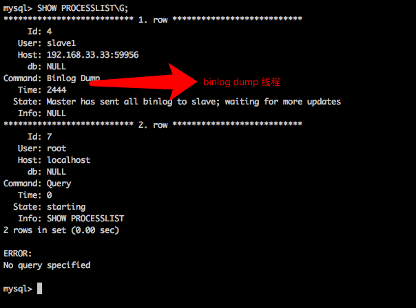
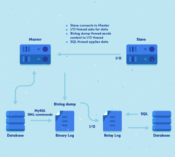

1. MySQL InnoDB、Mysaim的特点？
    1. MyISAM表引擎特点
        1. MyISAM 是MySQL缺省存贮引擎
        2. 具有检查和修复表格的大多数工具. 
        3. 表格可以被压缩
        4. 支持全文搜索.
        5. 不是事务安全的.如果事物回滚将造成不完全回滚，不具有原子性。
        6. 不支持外键。
        7. 如果执行大量的SELECT，MyISAM是更好的选择。
        8. 每张MyISAM 表被存放在三个文件 ：frm 文件存放表格定义，数据文件是MYD (MYData)，索引文件是MYI (MYIndex) 引伸。
        9. 表是保存成文件的形式,在跨平台的数据转移中使用MyISAM存储会省去不少的麻烦
        10. 较好的键统计分布
        11. 较好的auto_increment处理

    总结：

    读取操作在效率上要优于InnoDB.小型应用使用MyISAM是不错的选择.并发性弱于InnoDB。

    2. innodb表引擎特点
        1. 提供了具有事务提交、回滚和崩溃修复能力的事务安全型表。
        2. 提供了行锁，提供与 Oracle 类型一致的不加锁读取。
        3. 表中不需要扩大锁定，因为 InnoDB 的列锁定适宜非常小的空间。
        4. 提供外键约束。
        5. 设计目标是处理大容量数据库系统，它的 CPU 利用率是其它基于磁盘的关系数据库引擎所不能比的。
        6. 在主内存中建立其专用的缓冲池用于高速缓冲数据和索引。 
        7. 把数据和索引存放在表空间里，可能包含多个文件，这与其它的不一样，举例来说，在MyISAM 中，表被存放在单独的文件中。
        8. 表的大小只受限于操作系统的文件大小，一般为 2 GB。
        9. 所有的表都保存在同一个数据文件 ibdata1 中(也可能是使用独立的表空间文件的多个文件,使用共享表空间时比较不好备份单独的表)，免费的方案可以是拷贝数据文件、备份 binlog，或者用 mysqldump。

    总结：

    这些特性均提高了多用户并发操作的性能表现。

    注意：

    对于支持事物的InnoDB类型的表，影响速度的主要原因是AUTOCOMMIT默认设置是打开的，而且程序没有显式调用BEGIN 开始事务，导致每插入一条都自动Commit，严重影响了速度。即使autocommit打开也可以,可以在执行sql前调用begin，多条sql形成一个事务;或者不打开AUTOCOMMIT配置，将大大提高性能。

    3. MyISAM表和InnoDB表差别
        1. InnoDB类型支持事务处理,MyISAM类型不支持
        2. InnoDB不支持FULLTEXT类型的索引，MyISAM支持。
        3. InnoDB提供了行锁,MyISAM写入时锁表。

            InnoDB表的行锁也不是绝对的，如果在执行一个SQL语句时MySQL不能确定要扫描的范围，InnoDB表同样会锁全表，例如
            ```sql
            update table set num=1 where name like '%aaa%'
            ```
        4. InnoDB 中不保存表的具体行数，也就是说，执行
            ```sql
            select count(*) from table
            ```
            InnoDB要扫描一遍整个表来计算有多少行；但是MyISAM只要简单的读出保存好的行数即可。当count(*)语句包含 where条件时，两种表的操作是一样的。
        5. DELETE FROM table时，InnoDB不会重新建立表，而是一行一行的删除，MyISAM重建表。
        6. InnoDB不支持LOAD TABLE FROM MASTER操作 表的拷贝从主服务器转移到从属服务器. ；MyISAM表支持。
            解决方法是首先把InnoDB表改成MyISAM表，导入数据后再改成InnoDB表，但是对于使用的额外的InnoDB特性(例如外键)的表不适用。
        7. 对于AUTO_INCREMENT类型的字段，InnoDB中必须包含只有该字段的索引；但是在MyISAM表中，可以和其他字段一起建立联合索引。

    原文：https://blog.csdn.net/chenjiayi_yun/article/details/45746989 

2. 乐观锁和悲观锁的区别？

    悲观锁(Pessimistic Lock), 顾名思义，就是很悲观，每次去拿数据的时候都认为别人会修改，所以每次在拿数据的时候都会上锁，这样别人想拿这个数据就会block直到它拿到锁。传统的关系型数据库里边就用到了很多这种锁机制，比如行锁，表锁等，读锁，写锁等，都是在做操作之前先上锁。

    乐观锁(Optimistic Lock), 顾名思义，就是很乐观，每次去拿数据的时候都认为别人不会修改，所以不会上锁，但是在更新的时候会判断一下在此期间别人有没有去更新这个数据，可以使用版本号等机制。乐观锁适用于多读的应用类型，这样可以提高吞吐量，像数据库如果提供类似write_condition机制的其实都是提供的乐观锁。

    两种锁各有优缺点，不可认为一种好于另一种，像乐观锁适用于写比较少的情况下，即冲突真的很少发生的时候，这样可以省去了锁的开销，加大了系统的整个吞吐量。但如果经常产生冲突，上层应用会不断的进行retry，这样反倒是降低了性能，所以这种情况下用悲观锁就比较合适。

    原文：https://blog.csdn.net/hongchangfirst/article/details/26004335

3. 数据库隔离级别是什么？有什么作用？

    数据库事务的隔离级别有4种，由低到高分别为Read uncommitted 、Read committed 、Repeatable read 、Serializable 。而且，在事务的并发操作中可能会出现脏读，不可重复读，幻读。下面通过事例一一阐述它们的概念与联系。

    #### Read uncommitted

    读未提交，顾名思义，就是一个事务可以读取另一个未提交事务的数据。

    事例：老板要给程序员发工资，程序员的工资是3.6万/月。但是发工资时老板不小心按错了数字，按成3.9万/月，该钱已经打到程序员的户口，但是事务还没有提交，就在这时，程序员去查看自己这个月的工资，发现比往常多了3千元，以为涨工资了非常高兴。但是老板及时发现了不对，马上回滚差点就提交了的事务，将数字改成3.6万再提交。

    分析：实际程序员这个月的工资还是3.6万，但是程序员看到的是3.9万。他看到的是老板还没提交事务时的数据。这就是脏读。

    那怎么解决脏读呢？Read committed！读提交，能解决脏读问题。

    #### Read committed

    读提交，顾名思义，就是一个事务要等另一个事务提交后才能读取数据。

    事例：程序员拿着信用卡去享受生活（卡里当然是只有3.6万），当他埋单时（程序员事务开启），收费系统事先检测到他的卡里有3.6万，就在这个时候！！程序员的妻子要把钱全部转出充当家用，并提交。当收费系统准备扣款时，再检测卡里的金额，发现已经没钱了（第二次检测金额当然要等待妻子转出金额事务提交完）。程序员就会很郁闷，明明卡里是有钱的…

    分析：这就是读提交，若有事务对数据进行更新（UPDATE）操作时，读操作事务要等待这个更新操作事务提交后才能读取数据，可以解决脏读问题。但在这个事例中，出现了一个事务范围内两个相同的查询却返回了不同数据，这就是不可重复读。

    那怎么解决可能的不可重复读问题？Repeatable read ！

    #### Repeatable read

    重复读，就是在开始读取数据（事务开启）时，不再允许修改操作

    事例：程序员拿着信用卡去享受生活（卡里当然是只有3.6万），当他埋单时（事务开启，不允许其他事务的UPDATE修改操作），收费系统事先检测到他的卡里有3.6万。这个时候他的妻子不能转出金额了。接下来收费系统就可以扣款了。

    分析：重复读可以解决不可重复读问题。写到这里，应该明白的一点就是，不可重复读对应的是修改，即UPDATE操作。但是可能还会有幻读问题。因为幻读问题对应的是插入INSERT操作，而不是UPDATE操作。

    什么时候会出现幻读？

    事例：程序员某一天去消费，花了2千元，然后他的妻子去查看他今天的消费记录（全表扫描FTS，妻子事务开启），看到确实是花了2千元，就在这个时候，程序员花了1万买了一部电脑，即新增INSERT了一条消费记录，并提交。当妻子打印程序员的消费记录清单时（妻子事务提交），发现花了1.2万元，似乎出现了幻觉，这就是幻读。

    那怎么解决幻读问题？Serializable！

    #### Serializable 序列化

    Serializable 是最高的事务隔离级别，在该级别下，事务串行化顺序执行，可以避免脏读、不可重复读与幻读。但是这种事务隔离级别效率低下，比较耗数据库性能，一般不使用。

    值得一提的是：大多数数据库默认的事务隔离级别是Read committed，比如Sql Server , Oracle。Mysql的默认隔离级别是Repeatable read。

    原文：https://blog.csdn.net/qq_33290787/article/details/51924963 

4. MySQL主备同步的基本原理。

    1. 什么是mysql主从同步？

        当master(主)库的数据发生变化的时候，变化会实时的同步到slave(从)库。

    2. 主从同步有什么好处？

        * 水平扩展数据库的负载能力。
        * 容错，高可用。Failover(失败切换)/High Availability
        * 数据备份。

    3. 主从同步的原理是什么？

        首先我们来了解master-slave的体系结构。

        如下图：

        

        不管是delete、update、insert，还是创建函数、存储过程，所有的操作都在master上。当master有操作的时候,slave会快速的接收到这些操作，从而做同步。

        但是，这个机制是怎么实现的呢？

        在master机器上，主从同步事件会被写到特殊的log文件中(binary-log);
        在slave机器上，slave读取主从同步事件，并根据读取的事件变化，在slave库上做相应的更改。

        如此，就实现了主从同步了！

        下面我们来详细的了解。

        1. 主从同步事件有哪些

            上面说到：

            在master机器上，主从同步事件会被写到特殊的log文件中(binary-log);

            主从同步事件有3种形式:statement、row、mixed。

            * statement：会将对数据库操作的sql语句写入到binlog中。
            * row：会将每一条数据的变化写入到binlog中。
            * mixed：statement与row的混合。Mysql决定什么时候写statement格式的，什么时候写row格式的binlog。

        2. 在master机器上的操作

            当master上的数据发生改变的时候，该事件(insert、update、delete)变化会按照顺序写入到binlog中。

            binlog dump线程

            当slave连接到master的时候，master机器会为slave开启binlog dump线程。当master 的 binlog发生变化的时候，binlog dump线程会通知slave，并将相应的binlog内容发送给slave。

        3. 在slave机器上的操作

            当主从同步开启的时候，slave上会创建2个线程。

            I/O线程。该线程连接到master机器，master机器上的binlog dump线程会将binlog的内容发送给该I/O线程。该I/O线程接收到binlog内容后，再将内容写入到本地的relay log。
            SQL线程。该线程读取I/O线程写入的relay log。并且根据relay log的内容对slave数据库做相应的操作。
        
        4. 如何在master、slave上查看上述的线程？

            使用SHOW PROCESSLIST命令可以查看。

            如图，在master机器上查看binlog dump线程。

            

            如图，在slave机器上查看I/O、SQL线程。

            

    4. 讲了这么多，一图以蔽之

        

    5. 关于实战

5. select * from table t where size > 10 group by size order by size的sql语句执行顺序？

    Mysql的执行顺序是如下

    1. FORM: 对FROM的左边的表和右边的表计算笛卡尔积。产生虚表VT1
    2. ON: 对虚表VT1进行ON筛选，只有那些符合<join-condition>的行才会被记录在虚表VT2中。
    3. JOIN： 如果指定了OUTER JOIN（比如left join、 right join），那么保留表中未匹配的行就会作为外部行添加到虚拟表VT2中，产生虚拟表VT3, rug from子句
    4. 含两个以上的表的话，那么就会对上一个join连接产生的结果VT3和下一个表重复执行步骤1~3这三个步骤，一直到处理完所有的表为止。
    5. WHERE： 对虚拟表VT3进行WHERE条件过滤。只有符合<where-condition>的记录才会被插入到虚拟表VT4中。
    6. GROUP BY: 根据group by子句中的列，对VT4中的记录进行分组操作，产生VT5.
    7. CUBE | ROLLUP: 对表VT5进行cube或者rollup操作，产生表VT6.
    8. HAVING： 对虚拟表VT6应用having过滤，只有符合<having-condition>的记录才会被 插入到虚拟表VT7中。
    9. SELECT： 执行select操作，选择指定的列，插入到虚拟表VT8中。
    10. DISTINCT： 对VT8中的记录进行去重。产生虚拟表VT9.
    11. ORDER BY: 将虚拟表VT9中的记录按照<order_by_list>进行排序操作，产生虚拟表VT10.
    12. LIMIT：取出指定行的记录，产生虚拟表VT11, 并将结果返回。

    因此执行顺序将是 from table t > where size > 10 > group by size > order by size

    原文：https://www.jianshu.com/p/7331223c5a58

6. 如何优化数据库性能（索引、分库分表、批量操作、分页算法、升级硬盘SSD、业务优化、主从部署）。

    


7. SQL什么情况下不会使用索引（不包含，不等于，函数）. 
    1. 建立组合索引，但查询谓词并未使用组合索引的第一列，此处有一个INDEX SKIP SCAN概念。
    2. 在包含有null值的table列上建立索引，当时使用select count(*) from table时不会使用索引。
    3. 在索引列上使用函数时不会使用索引，如果一定要使用索引只能建立函数索引。
    4. 当被索引的列进行隐式的类型转换时不会使用索引。如:d select * from t where indexed_column = 5，而indexed_column列建立索引但类型是字符型，这时Oracle会产生
    隐式的类型转换，转换后的语句类似于select * from t where to_number(indexed_column) = 5，此时不走索引的情况类似于case3。日期转换也有类似问题，如:
    select * from t where trunc(date_col) = trunc(sysdate)其中date_col为索引列，这样写不会走索引，可改写成select * from t where date_col >= trunc(sysdate)
    and date_col < trunc(sysdate+1)，此查询会走索引。
    5. 并不是所有情况使用索引都会加快查询速度，full scan table 有时会更快，尤其是当查询的数据量占整个表的比重较大时，因为full scan table采用的是多块读，
    当Oracle优化器没有选择使用索引时不要立即强制使用，要充分证明使用索引确实查询更快时再使用强制索引。
    6. <>
    7. like’%dd’百分号在前
    8. not in ,not exist.

    原文：https://www.jianshu.com/p/7331223c5a58


8. 一般在什么字段上建索引 过滤数据最多的字段. 

    1. 表的主键、外键必须有索引；
    2. 数据量超过300的表应该有索引；
    3. 经常与其他表进行连接的表，在连接字段上应该建立索引；
    4. 经常出现在Where子句中的字段，特别是大表的字段，应该建立索引；
    5. 索引应该建在选择性高的字段上；
    6. 索引应该建在小字段上，对于大的文本字段甚至超长字段，不要建索引；
    7. 复合索引的建立需要进行仔细分析；尽量考虑用单字段索引代替

    链接：https://www.jianshu.com/p/7331223c5a58

9. 如何从一张表中查出name字段不包含“XYZ”的所有行？

    ```sql
    select * from t where t.name NOT LIKE ‘%XYZ%'
    ```

10. MySQL，B+索引实现，行锁实现，SQL优化
    
11. Redis，RDB和AOF，如何做高可用、集群

12. 如何解决高并发减库存问题

13. mysql存储引擎中索引的实现机制；

14. 数据库事务的几种粒度；

    事务（Transaction）及其ACID属性

    事务是由一组SQL语句组成的逻辑处理单元，事务具有以下4个属性，通常简称为事务的ACID属性。

    * 原子性（Atomicity）：事务是一个原子操作单元，其对数据的修改，要么全都执行，要么全都不执行。
    * 一致性（Consistent）：在事务开始和完成时，数据都必须保持一致状态。这意味着所有相关的数据规则都必须应用于事务的修改，以保持数据的完整性；事务结束时，所有的内部数据结构（如B树索引或双向链表）也都必须是正确的。
    * 隔离性（Isolation）：数据库系统提供一定的隔离机制，保证事务在不受外部并发操作影响的“独立”环境执行。这意味着事务处理过程中的中间状态对外部是不可见的，反之亦然。
    * 持久性（Durable）：事务完成之后，它对于数据的修改是永久性的，即使出现系统故障也能够保持。

    链接：https://www.jianshu.com/p/7331223c5a58

15. 行锁，表锁；乐观锁，悲观锁
