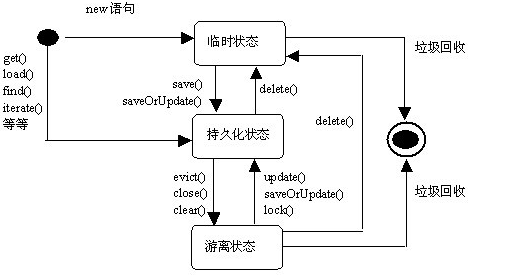
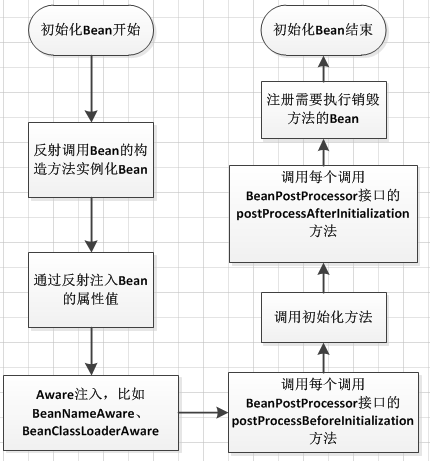

1. 描述一下Hibernate的三个状态？

    1. Hibernate 将操作的对象分为三种状态：
        * 瞬时 （Transient ）/临时状态/自由状态
        * 持久 （Persistent）
        * 脱管 （Detached）

        瞬时对象特征：

            　　第一、不处于 Session 的缓存中，也可以说，不被任何一个 Session 实例关联。

            　　第二、在数据库中没有对应的记录。

        持久化对象特征：

            　　第一、持久化对象总是被一个 session 关联。

            　　第二、持久化对象与数据库中的记录对应。

            　　第三、Session清理缓存的时候，会根据持久化对象的改变，更新数据库。

        托管对象特征：

            　　第一、Session断开关联

            　　第二、持有OID

    2. 三种状态的区别分析：

        * 只要与session关联的就是持久态。

        * Session没关联，没有OID就是瞬时状态。

        * Session没关联，有OID的就是游离状态。

    3. 持久化对象状态的相互转换：

        转换图：

        

        瞬时对象：

            如何直接获得  --- new 出来

            转换到持久态 ---- save、saveOrUpdate 保存操作

            转换到脱管态 ---- setId 设置OID持久化标识（这个id是数据库中存在的）

        持久对象：

            如何直接获得 ---- 通过session查询方法获得 get、load、createQuery、createCriteria

            转换到瞬时态 ---- delete 删除操作 （数据表不存在对应记录 ）（其实还有id，只是不叫OID）

            转换到脱管态 ---- close 关闭Session， evict、clear 从Session清除对象

        脱管对象：

            如何直接获得 ----- 无法直接获得 ，必须通过瞬时对象、持久对象转换获得

            转换到瞬时态 ---- 将id设置为 null,或者手动将数据库的对应的数据删掉

            转换到持久态 ---- update、saveOrUpdate、lock （对象重新放入Session ，重新与session关联）

        在Hibernate所有的操作只认OID，如果两个对象的OID一致，它就直接认为是同一个对象。

    原文：https://www.cnblogs.com/greatfish/p/6034448.html

2. Spring中Bean的生命周期。

    Spring框架中，一旦把一个Bean纳入Spring IOC容器之中，这个Bean的生命周期就会交由容器进行管理，一般担当管理角色的是BeanFactory或者ApplicationContext,认识一下Bean的生命周期活动，对更好的利用它有很大的帮助：

    下面以BeanFactory为例，说明一个Bean的生命周期活动

    1. Bean的建立， 由BeanFactory读取Bean定义文件，并生成各个实例
    2. Setter注入，执行Bean的属性依赖注入
    3. BeanNameAware的setBeanName(), 如果实现该接口，则执行其setBeanName方法
    4. BeanFactoryAware的setBeanFactory()，如果实现该接口，则执行其setBeanFactory方法
    5. BeanPostProcessor的processBeforeInitialization()，如果有关联的processor，则在Bean初始化之前都会执行这个实例的processBeforeInitialization()方法
    6. InitializingBean的afterPropertiesSet()，如果实现了该接口，则执行其afterPropertiesSet()方法
    7. Bean定义文件中定义init-method
    8. BeanPostProcessors的processAfterInitialization()，如果有关联的processor，则在Bean初始化之后都会执行这个实例的processAfterInitialization()方法
    9. DisposableBean的destroy()，在容器关闭时，如果Bean类实现了该接口，则执行它的destroy()方法
    10. Bean定义文件中定义destroy-method，在容器关闭时，可以在Bean定义文件中使用“destory-method”定义的方法
    
    如果使用ApplicationContext来维护一个Bean的生命周期，则基本上与上边的流程相同，只不过在执行BeanNameAware的setBeanName()后，若有Bean类实现了org.springframework.context.ApplicationContextAware接口，则执行其setApplicationContext()方法，然后再进行BeanPostProcessors的processBeforeInitialization()
    实际上，ApplicationContext除了向BeanFactory那样维护容器外，还提供了更加丰富的框架功能，如Bean的消息，事件处理机制等。

    在这里一用仓颉的一幅图说明流程： 转载自 https://www.cnblogs.com/xrq730/p/6363055.html
    

    以下是自己测试时打印的日志信息，可以看下加载顺序：
    ```java
    /**
    * @ClassName: MySpringBean
    * @Description: my spring bean to test
    * @author: daniel.zhao
    * @date: 2018年10月26日 上午10:12:37
    */
    public class MySpringBean implements BeanNameAware, BeanFactoryAware, InitializingBean, ApplicationContextAware {

        private ApplicationContext applicationContext;

        private static final Logger logger = LoggerFactory.getLogger(MySpringBean.class);

        public MySpringBean() {
            logger.info("new MySpringBean......");
        }

        @Override
        public void setApplicationContext(ApplicationContext context) throws BeansException {
            logger.info("ApplicationContextAware-setApplicationContext......");
            this.applicationContext = context;
        }

        @Override
        public void afterPropertiesSet() throws Exception {
            logger.info("InitializingBean-afterPropertiesSet......");
        }

        @Override
        public void setBeanFactory(BeanFactory bf) throws BeansException {
            logger.info("BeanFactoryAware-setBeanFactory......");
        }

        @Override
        public void setBeanName(String name) {
            logger.info("BeanNameAware-setBeanName......");
        }

        public void init() {
            logger.info("init-method......");
        }
    }
    ```
    ```java
    /**
    * @ClassName: MySpringBeanPostProcessor
    * @author: daniel.zhao
    * @date: 2018年10月26日 上午10:40:21
    */
    @Component
    public class MySpringBeanPostProcessor implements BeanPostProcessor {

        private static final Logger logger = LoggerFactory.getLogger(MySpringBeanPostProcessor.class);

        @Override
        public Object postProcessAfterInitialization(Object bean, String beanName) throws BeansException {
            if (bean instanceof MySpringBean) {
                logger.info("BeanPostProcessor-postProcessAfterInitialization......");
            }
            return bean;
        }

        @Override
        public Object postProcessBeforeInitialization(Object bean, String beanName) throws BeansException {
            if (bean instanceof MySpringBean) {
                logger.info("BeanPostProcessor-postProcessBeforeInitialization......");
            }
            return bean;
        }

    }
    ```
    ```
    2018-10-26 10:49:48.768  INFO 5732 --- [           main] com.daniel.bean.MySpringBean             : BeanNameAware-setBeanName......
    2018-10-26 10:49:48.769  INFO 5732 --- [           main] com.daniel.bean.MySpringBean             : BeanFactoryAware-setBeanFactory......
    2018-10-26 10:49:48.769  INFO 5732 --- [           main] com.daniel.bean.MySpringBean             : ApplicationContextAware-setApplicationContext......
    2018-10-26 10:49:48.770  INFO 5732 --- [           main] c.daniel.bean.MySpringBeanPostProcessor  : BeanPostProcessor-postProcessBeforeInitialization......
    2018-10-26 10:49:48.770  INFO 5732 --- [           main] com.daniel.bean.MySpringBean             : InitializingBean-afterPropertiesSet......
    2018-10-26 10:49:48.770  INFO 5732 --- [           main] com.daniel.bean.MySpringBean             : init-method......
    2018-10-26 10:49:48.771  INFO 5732 --- [           main] c.daniel.bean.MySpringBeanPostProcessor  : BeanPostProcessor-postProcessAfterInitialization......
    ```
3. SpringMVC或Struts处理请求的流程。

4. Spring AOP解决了什么问题？怎么实现的？

5. Spring事务的传播属性是怎么回事？它会影响什么？

6. Spring中BeanFactory和FactoryBean有什么区别？

7. Spring框架中IOC的原理是什么？

8. spring的依赖注入有哪几种方式

9. struts工作流程

10. 用Spring如何实现一个切面？

11. Spring 如何实现数据库事务？

12. Hibernate对一二级缓存的使用，Lazy-Load的理解； 

13. mybatis如何实现批量提交？