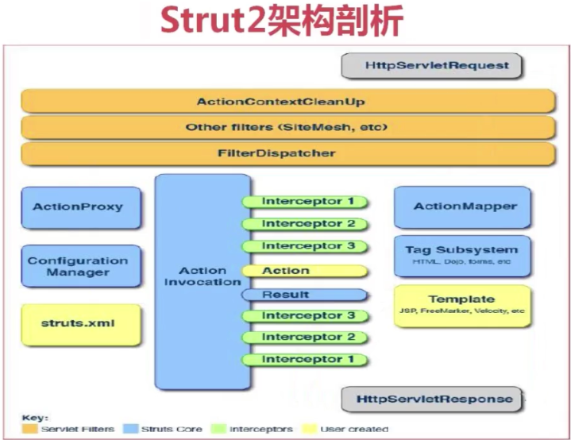
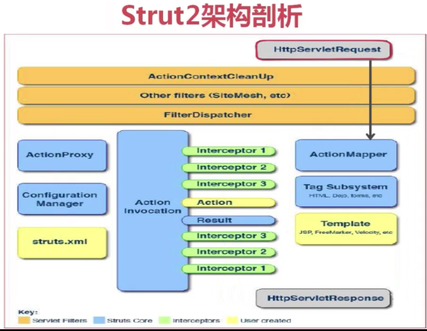
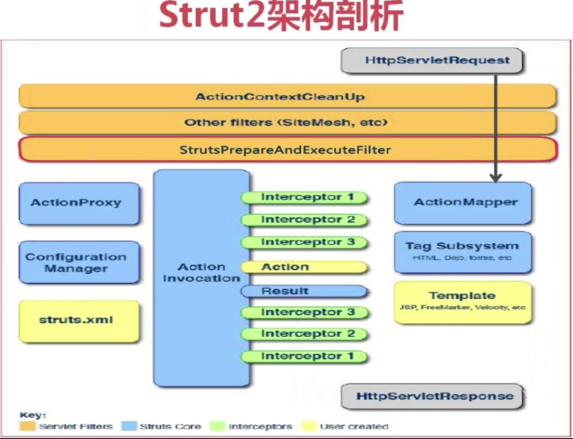
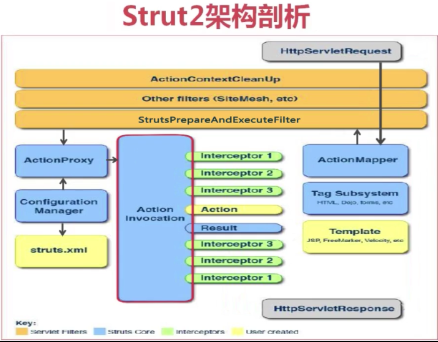
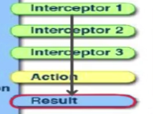
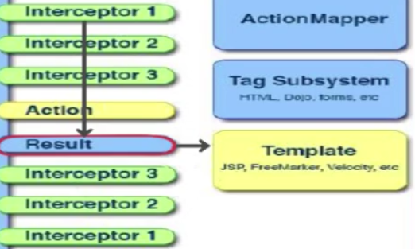
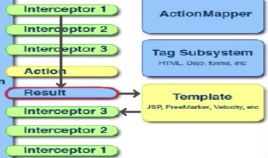
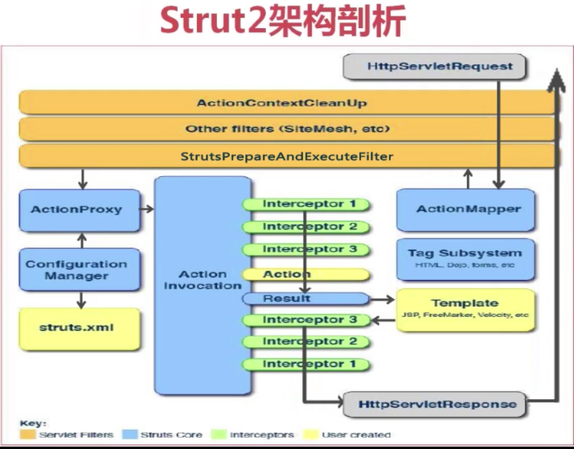
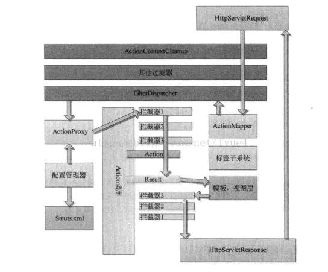

1. 描述一下Hibernate的三个状态？

    1. Hibernate 将操作的对象分为三种状态：
        * 瞬时 （Transient ）/临时状态/自由状态
        * 持久 （Persistent）
        * 脱管 （Detached）

        瞬时对象特征：

            　　第一、不处于 Session 的缓存中，也可以说，不被任何一个 Session 实例关联。

            　　第二、在数据库中没有对应的记录。

        持久化对象特征：

            　　第一、持久化对象总是被一个 session 关联。

            　　第二、持久化对象与数据库中的记录对应。

            　　第三、Session清理缓存的时候，会根据持久化对象的改变，更新数据库。

        托管对象特征：

            　　第一、Session断开关联

            　　第二、持有OID

    2. 三种状态的区别分析：

        * 只要与session关联的就是持久态。

        * Session没关联，没有OID就是瞬时状态。

        * Session没关联，有OID的就是游离状态。

    3. 持久化对象状态的相互转换：

        转换图：

        

        瞬时对象：

            如何直接获得  --- new 出来

            转换到持久态 ---- save、saveOrUpdate 保存操作

            转换到脱管态 ---- setId 设置OID持久化标识（这个id是数据库中存在的）

        持久对象：

            如何直接获得 ---- 通过session查询方法获得 get、load、createQuery、createCriteria

            转换到瞬时态 ---- delete 删除操作 （数据表不存在对应记录 ）（其实还有id，只是不叫OID）

            转换到脱管态 ---- close 关闭Session， evict、clear 从Session清除对象

        脱管对象：

            如何直接获得 ----- 无法直接获得 ，必须通过瞬时对象、持久对象转换获得

            转换到瞬时态 ---- 将id设置为 null,或者手动将数据库的对应的数据删掉

            转换到持久态 ---- update、saveOrUpdate、lock （对象重新放入Session ，重新与session关联）

        在Hibernate所有的操作只认OID，如果两个对象的OID一致，它就直接认为是同一个对象。

    原文：https://www.cnblogs.com/greatfish/p/6034448.html

2. Spring中Bean的生命周期。

    Spring框架中，一旦把一个Bean纳入Spring IOC容器之中，这个Bean的生命周期就会交由容器进行管理，一般担当管理角色的是BeanFactory或者ApplicationContext,认识一下Bean的生命周期活动，对更好的利用它有很大的帮助：

    下面以BeanFactory为例，说明一个Bean的生命周期活动

    1. Bean的建立， 由BeanFactory读取Bean定义文件，并生成各个实例
    2. Setter注入，执行Bean的属性依赖注入
    3. BeanNameAware的setBeanName(), 如果实现该接口，则执行其setBeanName方法
    4. BeanFactoryAware的setBeanFactory()，如果实现该接口，则执行其setBeanFactory方法
    5. BeanPostProcessor的processBeforeInitialization()，如果有关联的processor，则在Bean初始化之前都会执行这个实例的processBeforeInitialization()方法
    6. InitializingBean的afterPropertiesSet()，如果实现了该接口，则执行其afterPropertiesSet()方法
    7. Bean定义文件中定义init-method
    8. BeanPostProcessors的processAfterInitialization()，如果有关联的processor，则在Bean初始化之后都会执行这个实例的processAfterInitialization()方法
    9. DisposableBean的destroy()，在容器关闭时，如果Bean类实现了该接口，则执行它的destroy()方法
    10. Bean定义文件中定义destroy-method，在容器关闭时，可以在Bean定义文件中使用“destory-method”定义的方法
    
    如果使用ApplicationContext来维护一个Bean的生命周期，则基本上与上边的流程相同，只不过在执行BeanNameAware的setBeanName()后，若有Bean类实现了org.springframework.context.ApplicationContextAware接口，则执行其setApplicationContext()方法，然后再进行BeanPostProcessors的processBeforeInitialization()
    实际上，ApplicationContext除了向BeanFactory那样维护容器外，还提供了更加丰富的框架功能，如Bean的消息，事件处理机制等。

    在这里一用仓颉的一幅图说明流程： 转载自 https://www.cnblogs.com/xrq730/p/6363055.html
    

    以下是自己测试时打印的日志信息，可以看下加载顺序：
    ```java
    /**
    * @ClassName: MySpringBean
    * @Description: my spring bean to test
    * @author: daniel.zhao
    * @date: 2018年10月26日 上午10:12:37
    */
    public class MySpringBean implements BeanNameAware, BeanFactoryAware, InitializingBean, ApplicationContextAware {

        private ApplicationContext applicationContext;

        private static final Logger logger = LoggerFactory.getLogger(MySpringBean.class);

        public MySpringBean() {
            logger.info("new MySpringBean......");
        }

        @Override
        public void setApplicationContext(ApplicationContext context) throws BeansException {
            logger.info("ApplicationContextAware-setApplicationContext......");
            this.applicationContext = context;
        }

        @Override
        public void afterPropertiesSet() throws Exception {
            logger.info("InitializingBean-afterPropertiesSet......");
        }

        @Override
        public void setBeanFactory(BeanFactory bf) throws BeansException {
            logger.info("BeanFactoryAware-setBeanFactory......");
        }

        @Override
        public void setBeanName(String name) {
            logger.info("BeanNameAware-setBeanName......");
        }

        public void init() {
            logger.info("init-method......");
        }
    }
    ```
    ```java
    /**
    * @ClassName: MySpringBeanPostProcessor
    * @author: daniel.zhao
    * @date: 2018年10月26日 上午10:40:21
    */
    @Component
    public class MySpringBeanPostProcessor implements BeanPostProcessor {

        private static final Logger logger = LoggerFactory.getLogger(MySpringBeanPostProcessor.class);

        @Override
        public Object postProcessAfterInitialization(Object bean, String beanName) throws BeansException {
            if (bean instanceof MySpringBean) {
                logger.info("BeanPostProcessor-postProcessAfterInitialization......");
            }
            return bean;
        }

        @Override
        public Object postProcessBeforeInitialization(Object bean, String beanName) throws BeansException {
            if (bean instanceof MySpringBean) {
                logger.info("BeanPostProcessor-postProcessBeforeInitialization......");
            }
            return bean;
        }

    }
    ```
    ```
    2018-10-26 10:49:48.768  INFO 5732 --- [           main] com.daniel.bean.MySpringBean             : BeanNameAware-setBeanName......
    2018-10-26 10:49:48.769  INFO 5732 --- [           main] com.daniel.bean.MySpringBean             : BeanFactoryAware-setBeanFactory......
    2018-10-26 10:49:48.769  INFO 5732 --- [           main] com.daniel.bean.MySpringBean             : ApplicationContextAware-setApplicationContext......
    2018-10-26 10:49:48.770  INFO 5732 --- [           main] c.daniel.bean.MySpringBeanPostProcessor  : BeanPostProcessor-postProcessBeforeInitialization......
    2018-10-26 10:49:48.770  INFO 5732 --- [           main] com.daniel.bean.MySpringBean             : InitializingBean-afterPropertiesSet......
    2018-10-26 10:49:48.770  INFO 5732 --- [           main] com.daniel.bean.MySpringBean             : init-method......
    2018-10-26 10:49:48.771  INFO 5732 --- [           main] c.daniel.bean.MySpringBeanPostProcessor  : BeanPostProcessor-postProcessAfterInitialization......
    ```
3. SpringMVC或Struts处理请求的流程。
    1. SpringMVC的执行流程：

        发送请求——>DispatcherServiet捕获——>HandlerMapping查找Handler返回HandlerExecutionChain——>执行Handler返回ModelAndView ——>选择ViewResoler渲染视图——>返回客户端

        1. 客户端向服务器发送请求，请求被前端控制器DispatcherServlet捕获。

        2. DispatcherServlet对请求URL进行解析，得到请求资源标识符URI，通过URI调用HandlerMapping处理器映射器获取Handler配置的所有相关对象，返回Handler和HandlerExecutionChain。

        3. DispatcherServlet根据获得的Handler选择一个适合的HandlerAdapter处理器适配器，提取Request中的模型数据，填充Handler入参，执行Controller，返回一个ModlerAndView。

        4. DispatcherServlet根据返回的ModlerAndView选择一个合适的ViewResoler。

        5. DispatcherServlet通过ViewResoler结合Model和View来渲染视图。并将渲染结果返回给客户端。

    2. Struts2的执行流程：

        发送请求——>StrutsPrepareAndExecutionFilter拦截——>ActionMapper判断——>ConfigurationManager查找——>创建ActionInvocation实例——>执行相关拦截器——>响应客户端

        1. 客户端发送请求，经过一系列的过滤器，被核心过滤器StrutsPrepareAndExecutionFilter进行拦截。

        2. StrutsPrepareAndExecutionFilter通过ActionMapper来判断是否需要Action来处理，不需要就继续执行，需要的话就交给ActionProxy处理。

        3. ActionProxy通过ConfigurationManager询问框架的配置文件Struts.xml找到对应的Action。

        4. 创建一个ActionInvocation实例，调用对应的方法获取结果集的name，在调用的前后会执行相关的拦截器。

        5. 通过结果集的name找到对应的结果集对浏览器进行响应。

    原文：https://blog.csdn.net/roc_wl/article/details/83043542 

    #### Struts
    struts的架构图
    

    1. 提交请求

        客户端通过HttpServletRequest向servlet容器（即tomcat）提交一个请求。

        请求经过一系列的过滤器，例如图中的ActionContextCleanUp和Other filter(SlterMesh,etc)等，最后被struts的核心过滤器FilterDispatcher控制到。
        

        注：核心控制器2.1.3版本之后，struts的filterDispatcher核心控制器变成了StrutsPrepareAndExecuteFilte，如图：
        

        被核心控制器控制到之后才会访问Actionmapper来决定是否调用某个action（即用户是否要请求某个action）。如果是其他资源请求例如jsp页面，不会用到action。

    2. 移交控制权

        如果要用到action，核心控制器将控制权交给ActionProxy（即是action的代理）。

        ActionProxy获得控制权之后通过ConfigurationManager对象加载核心配置文件struts.xml。

        Struts的action在这个配置文件进行配置，所以要加载它。

    3. 创建ActionInvocation的实例

        如果在struts.xml找到需要调用的action, ActionProxy会创建一个ActionInvocation的实例。
        

    4. 调用action前的拦截器

        拦截器是struts2非常重要的概念，是核心功能实现。Struts中的大部分功能通过拦截器实现。

        Actioninvocation包括创建的action实例，同时包括另外非常重要的一部分------拦截器。

        调用action前后还会调用很多的拦截器。

        在调用action之前会依次调用用户所定义的拦截器。

    5. 调用action的业务方法进行业务处理

        当把action前的拦截器执行完之后才会调用action的业务方法进行业务处理，

        然后返回一个Result(业务方法对应String类型的返回值，即是字符串，例如SUCCESS，INPUT，ERROR，NONE，LOGIN和用户自己在struts对应定义result标签name属性的值)

        

    6. 匹配result

        然后根据返回的字符串来调度我们的视图来匹配我们的struts.xml中对应action标签中的result标签。

        一般来说返回一个jsp的页面，或者调用另外某一个action。

        
    7. 反向执行拦截器

        当返回视图之后并没有真正响应用户，还需要把执行过的拦截器倒过来反向执行一遍。
        
    8. 响应客户端

        当这些拦截器被反向执行之后，通过HttpServletResponse响应客户端的请求。
        

    原文：http://www.cnblogs.com/zzfweb/archive/2016/05/23/5521217.html

    #### SpringMVC
    流程分析：
    
    1. 用户发送请求至前端控制器DispatcherServlet
    2. DispatcherServlet收到请求调用HandlerMapping处理器映射器。
    3. 处理器映射器根据请求url找到具体的处理器，生成处理器对象及处理器拦截器(如果有则生成)一并返回DispatcherServlet。
    4. DispatcherServlet通过HandlerAdapter处理器适配器调用处理器
    5. 执行处理器(Controller，也叫后端控制器)。
    6. Controller执行完成返回ModelAndView
    7. HandlerAdapter将controller执行结果ModelAndView返回给DispatcherServlet
    8. DispatcherServlet将ModelAndView传给ViewReslover视图解析器
    9. ViewReslover解析后返回具体View
    10. DispatcherServlet对View进行渲染视图（即将模型数据填充至视图中）。
    11. DispatcherServlet响应用户

    组件分析：
    * DispatcherServlet：前端控制器

        用户请求到达前端控制器，它就相当于mvc模式中的c，dispatcherServlet是整个流程控制的中心，由它调用其它组件处理用户的请求，dispatcherServlet的存在降低了组件之间的耦合性。

    * HandlerMapping：处理器映射器

        HandlerMapping负责根据用户请求找到Handler即处理器，springmvc提供了不同的映射器实现不同的映射方式，例如：配置文件方式，实现接口方式，注解方式等。

    * Handler：处理器

        Handler 是继DispatcherServlet前端控制器的后端控制器，在DispatcherServlet的控制下Handler对具体的用户请求进行处理。

        由于Handler涉及到具体的用户业务请求，所以一般情况需要程序员根据业务需求开发Handler。

    * HandlAdapter：处理器适配器

        通过HandlerAdapter对处理器进行执行，这是适配器模式的应用，通过扩展适配器可以对更多类型的处理器进行执行。

    * View Resolver：视图解析器

        View Resolver负责将处理结果生成View视图，View Resolver首先根据逻辑视图名解析成物理视图名即具体的页面地址，再生成View视图对象，最后对View进行渲染将处理结果通过页面展示给用户。

    * View：视图

        springmvc框架提供了很多的View视图类型的支持，包括：jstlView、freemarkerView、pdfView等。我们最常用的视图就是jsp。

    原文：https://blog.csdn.net/qq_41907991/article/details/81392820 

4. Spring AOP解决了什么问题？怎么实现的？

5. Spring事务的传播属性是怎么回事？它会影响什么？

6. Spring中BeanFactory和FactoryBean有什么区别？

7. Spring框架中IOC的原理是什么？

8. spring的依赖注入有哪几种方式
    #### spring 四种依赖注入方式以及注解注入方式

    平常的java开发中，程序员在某个类中需要依赖其它类的方法，则通常是new一个依赖类再调用类实例的方法，这种开发存在的问题是new的类实例不好统一管理，spring提出了依赖注入的思想，即依赖类不由程序员实例化，

    而是通过spring容器帮我们new指定实例并且将实例注入到需要该对象的类中。依赖注入的另一种说法是“控制反转”，通俗的理解是：平常我们new一个实例，这个实例的控制权是我们程序员，
    而控制反转是指new实例工作不由我们程序员来做而是交给spring容器来做。
    
    spring有多种依赖注入的形式，下面仅介绍spring通过xml进行IOC配置的方式：

    * Set注入

        这是最简单的注入方式，假设有一个SpringAction，类中需要实例化一个SpringDao对象，那么就可以定义一个private的SpringDao成员变量，然后创建SpringDao的set方法（这是ioc的注入入口）：
        
        ```java
        package com.bless.springdemo.action;  
        public class SpringAction {  
                //注入对象springDao  
            private SpringDao springDao;  
                //一定要写被注入对象的set方法  
            public void setSpringDao(SpringDao springDao){  
                this.springDao = springDao;  
            }  
        
            public void ok(){  
                springDao.ok();  
            }  
        }
        ```
        随后编写spring的xml文件，<bean>中的name属性是class属性的一个别名，class属性指类的全名，因为在SpringAction中有一个公共属性Springdao，所以要在<bean>标签中创建一个<property>标签指定SpringDao。

        <property>标签中的name就是SpringAction类中的SpringDao属性名，ref指下面<bean name="springDao"...>，

        这样其实是spring将SpringDaoImpl对象实例化并且调用SpringAction的setSpringDao方法将SpringDao注入：
        ```xml
        <!--配置bean,配置后该类由spring管理-->  
        <bean name="springAction" class="com.bless.springdemo.action.SpringAction">  
            <!--(1)依赖注入,配置当前类中相应的属性-->  
            <property name="springDao" ref="springDao"></property>  
        </bean>  
        <bean name="springDao" class="com.bless.springdemo.dao.impl.SpringDaoImpl"></bean>  
        ```

    * 构造器注入

        这种方式的注入是指带有参数的构造函数注入，看下面的例子，我创建了两个成员变量SpringDao和User，但是并未设置对象的set方法，所以就不能支持第一种注入方式，
        这里的注入方式是在SpringAction的构造函数中注入，也就是说在创建SpringAction对象时要将SpringDao和User两个参数值传进来：
        ```java
        public class SpringAction {  
            //注入对象springDao  
            private SpringDao springDao;  
            private User user;  
            
            public SpringAction(SpringDao springDao,User user){  
                this.springDao = springDao;  
                this.user = user;  
                System.out.println("构造方法调用springDao和user");  
            }  
                    
            public void save(){  
                user.setName("卡卡");  
                springDao.save(user);  
            }  
        }
        ```
        在XML文件中同样不用<property>的形式，而是使用<constructor-arg>标签，ref属性同样指向其它<bean>标签的name属性：
        ```xml
        <!--配置bean,配置后该类由spring管理-->  
        <bean name="springAction" class="com.bless.springdemo.action.SpringAction">  
            <!--(2)创建构造器注入,如果主类有带参的构造方法则需添加此配置-->  
            <constructor-arg ref="springDao"></constructor-arg>  
            <constructor-arg ref="user"></constructor-arg>  
        </bean>  
        <bean name="springDao" class="com.bless.springdemo.dao.impl.SpringDaoImpl"></bean>  
        <bean name="user" class="com.bless.springdemo.vo.User"></bean> 
        ```

        解决构造方法参数的不确定性，你可能会遇到构造方法传入的两参数都是同类型的，为了分清哪个该赋对应值，则需要进行一些小处理：

        下面是设置index，就是参数位置：
        ```xml
        <bean name="springAction" class="com.bless.springdemo.action.SpringAction">  
            <constructor-arg index="0" ref="springDao"></constructor-arg>  
            <constructor-arg index="1" ref="user"></constructor-arg>  
        </bean> 
        ```
        另一种是设置参数类型：
        ```xml
        <constructor-arg type="java.lang.String" ref=""/>
        ```

    * 静态工厂的方法注入

        静态工厂顾名思义，就是通过调用静态工厂的方法来获取自己需要的对象，为了让spring管理所有对象，我们不能直接通过"工程类.静态方法()"来获取对象，而是依然通过spring注入的形式获取：
        ```java
        package com.bless.springdemo.factory;  
            
        import com.bless.springdemo.dao.FactoryDao;  
        import com.bless.springdemo.dao.impl.FactoryDaoImpl;  
        import com.bless.springdemo.dao.impl.StaticFacotryDaoImpl;  
        
        public class DaoFactory {  
            //静态工厂  
            public static final FactoryDao getStaticFactoryDaoImpl(){  
                return new StaticFacotryDaoImpl();  
            }  
        }
        ```
        同样看关键类，这里我需要注入一个FactoryDao对象，这里看起来跟第一种注入一模一样，但是看随后的xml会发现有很大差别:
        ```java
        public class SpringAction {  
                //注入对象  
        private FactoryDao staticFactoryDao;  
            
            public void staticFactoryOk(){  
                staticFactoryDao.saveFactory();  
            }  
            //注入对象的set方法  
            public void setStaticFactoryDao(FactoryDao staticFactoryDao) {  
                this.staticFactoryDao = staticFactoryDao;  
            }  
        }
        ```
        Spring的IOC配置文件，注意看<bean name="staticFactoryDao">指向的class并不是FactoryDao的实现类，而是指向静态工厂DaoFactory，并且配置 factory-method="getStaticFactoryDaoImpl"指定调用哪个工厂方法：

        ```xml
        <!--配置bean,配置后该类由spring管理-->  
        <bean name="springAction" class="com.bless.springdemo.action.SpringAction" >  
            <!--(3)使用静态工厂的方法注入对象,对应下面的配置文件(3)-->  
            <property name="staticFactoryDao" ref="staticFactoryDao"></property>  
        </bean>  
        <!--(3)此处获取对象的方式是从工厂类中获取静态方法-->  
        <bean name="staticFactoryDao" class="com.bless.springdemo.factory.DaoFactory" factory-method="getStaticFactoryDaoImpl"></bean>  
        ```
    * 实例工厂的方法注入

        实例工厂的意思是获取对象实例的方法不是静态的，所以你需要首先new工厂类，再调用普通的实例方法：
         ```java
        public class DaoFactory {  
            //实例工厂  
            public FactoryDao getFactoryDaoImpl(){  
                return new FactoryDaoImpl();  
            }
        } 
        ```
        那么下面这个类没什么说的，跟前面也很相似，但是我们需要通过实例工厂类创建FactoryDao对象：

        ```java
        public class SpringAction {  
            //注入对象  
            private FactoryDao factoryDao;  
            
            public void factoryOk(){  
                factoryDao.saveFactory();  
            }  
        
            public void setFactoryDao(FactoryDao factoryDao) {  
                this.factoryDao = factoryDao;  
            }  
        }
        ```
        最后看spring配置文件：
        ```xml
        <!--配置bean,配置后该类由spring管理-->  
        <bean name="springAction" class="com.bless.springdemo.action.SpringAction">  
            <!--(4)使用实例工厂的方法注入对象,对应下面的配置文件(4)-->  
            <property name="factoryDao" ref="factoryDao"></property>  
        </bean>  
            
        <!--(4)此处获取对象的方式是从工厂类中获取实例方法-->  
        <bean name="daoFactory" class="com.bless.springdemo.factory.DaoFactory"></bean>  
        <bean name="factoryDao" factory-bean="daoFactory" factory-method="getFactoryDaoImpl"></bean>
        ```
    总结
    Spring IOC注入方式用得最多的是(1)(2)种，多谢多练就会非常熟练。
    另外注意：通过Spring创建的对象默认是单例的，如果需要创建多实例对象可以在<bean>标签后面添加一个属性：
    ```xml
    <bean name="..." class="..." scope="prototype">  
    ```
    原文：https://www.cnblogs.com/YuyuanNo1/p/7872926.html

9. struts工作流程

    Struts2框架处理一个用户请求大致可分为如下几个步骤：
    

    1. 用户发出一个HttpServletRequest请求。

    2. 这个请求经过一系列的过滤器Filter来传送。如果Struts2与Site Mesh插件以及其他框架进行了集成，则请求首先要经过可选的ActionContextCleanUp过滤器。

    3. 调用FilterDispatcher。FilterDispatcher是控制器的核心，它通过询问ActionMapper来确定该请求是否需要调用某个Action.如果需要调用某个Action,则FilterDispatcher就把请求转交给ActionProxy处理。

    4. ActionProxy通过配置管理器Configuration Manager 询问框架的配置文件struts2.xml，从而找到需要调用的Action类

    5. ActionProxy创建一个ActionInvocation的实例，该实例使用命名模式来调用。在Action执行的前后，ActionInvocation实例根据配置文件加载与Action 相关的所有拦截器Interceptor。

    6. 一旦Action执行完毕，ActionInvocation实例根据struts.xml文件中的配置找到相对于的返回结果，返回结果通常是一个JSP或者FreeMarker的模板。

    7. 最后，HttpServletResponse响应通过web.xml文件中配置的过滤器返回。

    从MVC的角度看，可以对Struts2的工作流程做出如下描述：

    1. 浏览器发出请求

    2. 控制层中的核心控制器FilterDispatcher根据请求调用相应的Action.

    3. Struts2的拦截链（即一系列拦截器. 自动对请求调用一些通用的控制逻辑，如数据校验，对数据的封装和文件上传等功能。

    4. 回调Action中的execute()方法（Action对象的默认方法. ，并在方法体内调用业务逻辑组件，即自定义的Javabean 等来处理请求，如数据的查询处理等。

    5. Execute()方法返回后会产生一个输出。

    6. 该输出经过拦截器链自动处理，这和开始的拦截器链处理是相反的过程。

    7. 控制层最后将数据返还并更新视图层。

    由此，可以看到Struts2和MVC是相对应的，Struts2中FilterDispatcher对应着MVC中的控制层，Action对应着模型层，产生的结果Result对应视图层。

    原文：https://blog.csdn.net/lyue4/article/details/75503960 

10. 用Spring如何实现一个切面？

11. Spring 如何实现数据库事务？

    
    #### 一、事务的基本原理
    Spring事务 的本质其实就是数据库对事务的支持，没有数据库的事务支持，spring是无法提供事务功能的。对于纯JDBC操作数据库，想要用到事务，可以按照以下步骤进行：

    1. 获取连接 Connection con = DriverManager.getConnection()
    2. 开启事务con.setAutoCommit(true/false);
    3. 执行CRUD
    4. 提交事务/回滚事务 con.commit() / con.rollback();
    5. 关闭连接 conn.close();

    使用Spring的事务管理功能后，我们可以不再写步骤 2 和 4 的代码，而是由Spirng 自动完成。 那么Spring是如何在我们书写的 CRUD 之前和之后开启事务和关闭事务的呢？解决这个问题，也就可以从整体上理解Spring的事务管理实现原理了。下面简单地介绍下，注解方式为例子
    * 配置文件开启注解驱动，在相关的类和方法上通过注解@Transactional标识。
    * spring 在启动的时候会去解析生成相关的bean，这时候会查看拥有相关注解的类和方法，并且为这些类和方法生成代理，并根据@Transaction的相关参数进行相关配置注入，这样就在代理中为我们把相关的事务处理掉了（开启正常提交事务，异常回滚事务）。
    * 真正的数据库层的事务提交和回滚是通过binlog或者redo log实现的。

    #### 二、Spring 事务的传播属性
    所谓spring事务的传播属性，就是定义在存在多个事务同时存在的时候，spring应该如何处理这些事务的行为。这些属性在TransactionDefinition中定义，具体常量的解释见下表：

    常量名称|常量解释
    --|--
    PROPAGATION_REQUIRED|支持当前事务，如果当前没有事务，就新建一个事务。这是最常见的选择，也是 Spring 默认的事务的传播。
    PROPAGATION_REQUIRES_NEW|新建事务，如果当前存在事务，把当前事务挂起。新建的事务将和被挂起的事务没有任何关系，是两个独立的事务，外层事务失败回滚之后，不能回滚内层事务执行的结果，内层事务失败抛出异常，外层事务捕获，也可以不处理回滚操作
    PROPAGATION_SUPPORTS|支持当前事务，如果当前没有事务，就以非事务方式执行。
    PROPAGATION_MANDATORY|支持当前事务，如果当前没有事务，就抛出异常。
    PROPAGATION_NOT_SUPPORTED|以非事务方式执行操作，如果当前存在事务，就把当前事务挂起。
    PROPAGATION_NEVER| 以非事务方式执行，如果当前存在事务，则抛出异常。
    PROPAGATION_NESTED |如果一个活动的事务存在，则运行在一个嵌套的事务中。如果没有活动事务，则按REQUIRED属性执行。它使用了一个单独的事务，这个事务拥有多个可以回滚的保存点。内部事务的回滚不会对外部事务造成影响。它只对DataSourceTransactionManager事务管理器起效。

    #### 三、数据库隔离级别
    隔离级别|隔离级别的值|导致的问题
    --|--|--
    Read-Uncommitted|0|导致脏读
    Read-Committed|1|避免脏读，允许不可重复读和幻读
    Repeatable-Read|2|避免脏读，不可重复读，允许幻读
    Serializable|3|串行化读，事务只能一个一个执行，避免了脏读、不可重复读、幻读。执行效率慢，使用时慎重

    * 脏读：一事务对数据进行了增删改，但未提交，另一事务可以读取到未提交的数据。如果第一个事务这时候回滚了，那么第二个事务就读到了脏数据。
    * 不可重复读：一个事务中发生了两次读操作，第一次读操作和第二次操作之间，另外一个事务对数据进行了修改，这时候两次读取的数据是不一致的。
    * 幻读：第一个事务对一定范围的数据进行批量修改，第二个事务在这个范围增加一条数据，这时候第一个事务就会丢失对新增数据的修改。

    总结：
    * 隔离级别越高，越能保证数据的完整性和一致性，但是对并发性能的影响也越大。
    * 大多数的数据库默认隔离级别为 Read Commited，比如 SqlServer、Oracle
    * 少数数据库默认隔离级别为：Repeatable Read 比如： MySQL InnoDB

    #### 四、Spring中的隔离级别
    常量|解释
    --|--
    ISOLATION_DEFAULT|这是个 PlatfromTransactionManager 默认的隔离级别，使用数据库默认的事务隔离级别。另外四个与 JDBC 的隔离级别相对应。
    ISOLATION_READ_UNCOMMITTED|这是事务最低的隔离级别，它充许另外一个事务可以看到这个事务未提交的数据。这种隔离级别会产生脏读，不可重复读和幻像读。
    ISOLATION_READ_COMMITTED|保证一个事务修改的数据提交后才能被另外一个事务读取。另外一个事务不能读取该事务未提交的数据。
    ISOLATION_REPEATABLE_READ|这种事务隔离级别可以防止脏读，不可重复读。但是可能出现幻像读。
    ISOLATION_SERIALIZABLE|这是花费最高代价但是最可靠的事务隔离级别。事务被处理为顺序执行。

    #### 五、事务的嵌套
    通过上面的理论知识的铺垫，我们大致知道了数据库事务和spring事务的一些属性和特点，接下来我们通过分析一些嵌套事务的场景，来深入理解spring事务传播的机制。

    假设外层事务 Service A 的 Method A() 调用 内层Service B 的 Method B()

    * methodB为PROPAGATION_REQUIRED(spring 默认)

        执行 ServiceA.methodA() 的时候spring已经起了事务，这时调用 ServiceB.methodB()

        * ServiceB.methodB() 看到自己已经运行在 ServiceA.methodA() 的事务内部，就不再起新的事务。
        * ServiceB.methodB() 运行的时候发现自己没有在事务中，他就会为自己分配一个事务。
        这样，在 ServiceA.methodA() 或者在 ServiceB.methodB() 内的任何地方出现异常，事务都会被回滚。

    * methodB为PROPAGATION_REQUIRES_NEW，methodA为PROPAGATION_REQUIRED

        执行到 ServiceB.methodB() 的时候，ServiceA.methodA() 所在的事务就会挂起，ServiceB.methodB() 会起一个新的事务，等待 ServiceB.methodB() 的事务完成以后，它才继续执行。它与 PROPAGATION_REQUIRED 的事务区别在于事务的回滚程度了。因为 ServiceB.methodB() 是新起一个事务，那么就是存在两个不同的事务。

        * 如果 ServiceB.methodB() 已经提交，那么 ServiceA.methodA() 失败回滚，ServiceB.methodB() 是不会回滚的。
        * 如果 ServiceB.methodB() 失败回滚
            * 如果他抛出的异常被 ServiceA.methodA() 捕获，ServiceA.methodA() 事务仍然可能提交(主要看B抛出的异常是不是A会回滚的异常)。

    * methodB为PROPAGATION_SUPPORTS

        执行到ServiceB.methodB()时
        * 如果发现ServiceA.methodA()已经开启了一个事务，则加入当前的事务，
        * 如果发现ServiceA.methodA()没有开启事务，则自己也不开启事务。这种时候，内部方法的事务性完全依赖于最外层的事务。

    * methodB为PROPAGATION_NESTED

        * 如果 ServiceB.methodB 失败回滚
            * 内部事务(即 ServiceB#methodB) 将回滚到它执行前的 SavePoint 
            * 外部事务(即 ServiceA#methodA) 可以有以下两种处理方式:

                * 捕获异常，执行异常分支逻辑
                ```java
                void methodA() {
                    try {
                        ServiceB.methodB();
                    } catch (SomeException) {
                        // 执行其他业务, 如 ServiceC.methodC();
                    }
                }
                ```
                这种方式也是嵌套事务最有价值的地方, 它起到了分支执行的效果, 如果 ServiceB.methodB 失败, 那么执行 ServiceC.methodC(), 而 ServiceB.methodB 已经回滚到它执行之前的 SavePoint, 所以不会产生脏数据(相当于此方法从未执行过), 这种特性可以用在某些特殊的业务中, 而 PROPAGATION_REQUIRED 和 PROPAGATION_REQUIRES_NEW 都没有办法做到这一点。
                * 外部事务回滚/提交

                代码不做任何修改,外部事务(即 ServiceA#methodA) 将根据具体的配置决定自己是 commit 还是 rollback

    另外三种事务传播属性基本用不到，在此不做分析。

    #### 六、总结
    对于项目中需要使用到事务的地方，我建议开发者还是使用spring的TransactionCallback接口来实现事务，不要盲目使用spring事务注解，如果一定要使用注解，那么一定要对spring事务的传播机制和隔离级别有个详细的了解，否则很可能发生意想不到的效果。

    原文：https://www.cnblogs.com/wangyayun/p/6530189.html

12. Hibernate对一二级缓存的使用，Lazy-Load的理解

    1. 为什么使用缓存

        hibernate使用缓存减少对数据库的访问次数，从而提升hibernate的执行效率。hibernate中有两种类型的缓存：一级缓存和二级缓存。

    2. 一级缓存

        Hibenate中一级缓存，也叫做session的缓存，当调用session的save/saveOrUpdate/get/load/list/iterator方法的时候，都会把对象放入session的缓存中。

        一级缓存可以在session范围内减少数据库的访问次数，只在session范围有效，session关闭，一级缓存失效。

        session的缓存由hibernate维护， 用户不能操作缓存内容； 如果想操作缓存内容，必须通过hibernate提供的evit/clear方法操作。

        * 特点：

            * 只在当前session范围有效，作用时间短，效果不是特别明显！

            * 在短时间内多次操作数据库，效果比较明显！

        * list和iterator的区别

            * list：

                * 一次把所有的记录都查询出来

                * 会放入缓存，但不会从缓存中获取数据

            * Iterator：

                N+1查询； N表示所有的记录总数，即会先发送一条语句查询所有记录的主键（1），再根据每一个主键再去数据库查询（N）会放入缓存，也会从缓存中取数据

                ```java
                public void test5()throws Exception{
                        Session session = sf.openSession();
                        session.beginTransaction();

                        User user = new User();
                        user.setUserName("林黛玉");
                        session.save(user);
                        user.setUserName("嘉宝");
                        session.save(user);
                        session.getTransaction().commit();
                        session.close();
                    }
                ```
            由于一级缓存的作用，user对象只会被保存一次。

    3. 二级缓存

        Hibernate提供了基于应用程序级别的缓存， 可以跨多个session，即不同的session都可以访问缓存数据。 这个缓存也叫二级缓存。

        Hibernate提供的二级缓存有默认的实现，且是一种可插配的缓存框架！如果用户想用二级缓存，只需要在hibernate.cfg.xml中配置即可； 不想用，直接移除，不影响代码。如果用户觉得hibernate提供的框架框架不好用，自己可以换其他的缓存框架或自己实现缓存框架。

        开启二级缓存：

        list() 默认情况只会放入缓存，不会从一级缓存中取，配置查询缓存，可以让list()查询从二级缓存中取数据。

        ```xml
        <!--开启二级缓存-->
        <property name="hibernate.cache.use_second_level_cache">true</property>
        <!--指定使用的缓存框架-->
        <property name="hibernate.cache.provider_class">org.hibernate.cache.HashtableCacheProvider</property>

        <!--开启查询缓存-->
        <property name="hibernate.cache.use_query_cache">true</property>
        ```
        指定需要二级缓存的类：

            如果设置了集合缓存，集合所属的元素对象也要放入二级缓存，即Employee。
        ```xml
        <!--指定哪一些类需要加入二级缓存-->
        <class-cache class="com.juaner.department.Employee" usage="read-only"/>
        <class-cache class="com.juaner.department.Dept" usage="read-only"/>
        <!--集合缓存，集合所属的类型也要放入二级缓存-->
        <collection-cache collection="com.juaner.department.Dept.emps" usage="read-only"/>
        ```
    　　使用二级缓存：

        　　如果设置了查询缓存，需要手动设置setCacheable(true)。

        ```java
        @Test
        public void test1(){
            Session session = sf.openSession();
            session.beginTransaction();
            //setCacheable 指定从二级缓存中找，或放入二级缓存，针对list不从一级缓存中取数据的情况
            //从缓存中读数据，查询条件必须一致
            //缓存机制为Map<条件，结果>
            Query query = session.createQuery("from Dept").setCacheable(true);
            System.out.println(query.list());

            session.getTransaction().commit();
            session.close();

            Session session1 = sf.openSession();
            session1.beginTransaction();

            query = session1.createQuery("from Dept").setCacheable(true);
            System.out.println(query.list());

            session1.getTransaction().commit();
            session1.close();
        }
        ```

    4. get和load
        * get: 及时加载，只要调用get方法立刻向数据库查询
        * load:默认使用懒加载，当用到数据的时候才向数据库查询

    5. 懒加载

        当用到数据的时候才向数据库查询，这就是hibernate的懒加载特性。

        lazy|值
        --|--
        true|使用懒加载
        false|关闭懒加载
        extra|在集合数据懒加载时候提升效率，在真正使用数据的时候才向数据库发送查询的sql，如果调用集合的size()/isEmpty()方法，只是统计，不真正查询数据！

     参考：https://www.cnblogs.com/zhangzongle/p/5770367.html
13. mybatis如何实现批量提交？