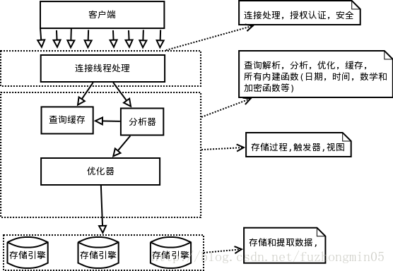
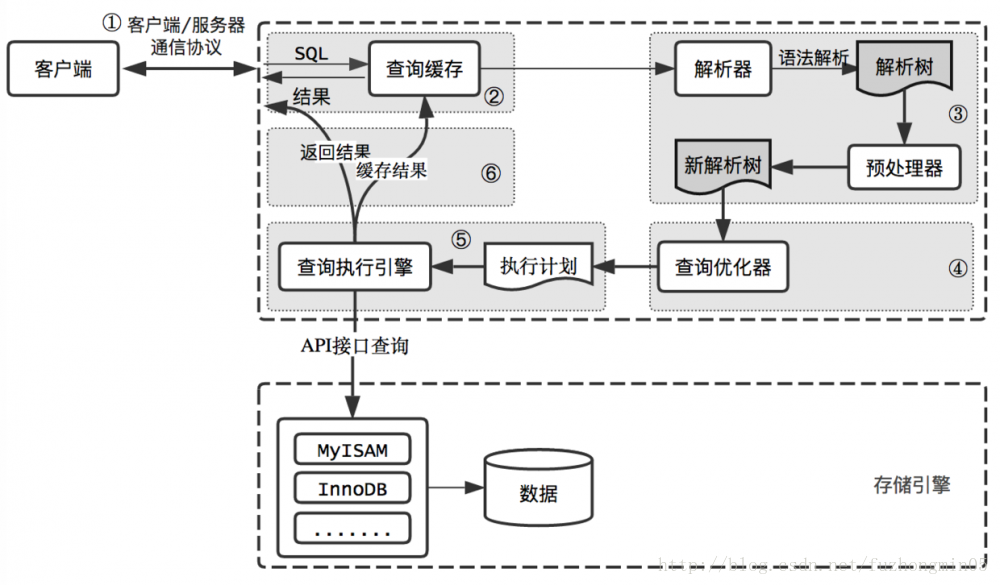
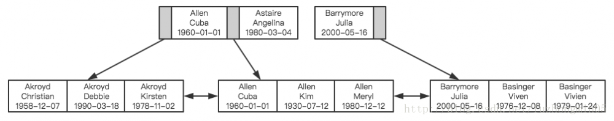

## MySQL逻辑架构及性能优化原理

说起MySQL的查询优化，相信所有人都了解一些最简单的技巧：不能使用SELECT *、不使用NULL字段、合理创建索引、为字段选择合适的数据类型….. 你是否真的理解这些优化技巧？是否理解其背后的工作原理？在实际场景下性能真有提升吗？我想未必。因而理解这些优化建议背后的原理就尤为重要。

#### MySQL逻辑架构
如果能在头脑中构建一幅MySQL各组件之间如何协同工作的架构图，有助于深入理解MySQL服务器。下图展示了MySQL的逻辑架构图。



MySQL逻辑架构整体分为三层

* 最上层为客户端层，并非MySQL所独有，诸如：连接处理、授权认证、安全等功能均在这一层处理。

* MySQL大多数核心服务均在中间这一层，包括查询解析、分析、优化、缓存、内置函数(比如：时间、数学、加密等函数)。所有的跨存储引擎的功能也在这一层实现：存储过程、触发器、视图等。

* 最下层为存储引擎，其负责MySQL中的数据存储和提取。和Linux下的文件系统类似，每种存储引擎都有其优势和劣势。中间的服务层通过API与存储引擎通信，这些API接口屏蔽了不同存储引擎间的差异。

**每一个客户端发起一个新的请求都由服务器端的连接/线程处理工具负责接收客户端的请求并开辟一个新的内存空间，在服务器端的内存中生成一个新的线程，当每一个用户连接到服务器端的时候就会在进程地址空间里生成一个新的线程用于响应客户端请求，用户发起的查询请求都在线程空间内运行， 结果也在这里面缓存并返回给服务器端**。 线程的重用和销毁都是由连接/线程处理管理器实现的。

综上所述：用户发起请求，连接/线程处理器开辟内存空间，开始提供查询的机制。

#### MySQL查询过程
用户总是希望MySQL能够获得更高的查询性能，最好的办法是弄清楚MySQL是如何优化和执行查询的。一旦理解了这一点，就会发现：很多的查询优化工作实际上就是遵循一些原则让MySQL的优化器能够按照预想的合理方式运行而已。

当向MySQL发送一个请求的时候，MySQL到底做了些什么呢？下图展示了MySQL的查询过程。



1. 客户端/服务端通信协议

    MySQL客户端/服务端**通信协议是“半双工”的：在任一时刻，要么是服务器向客户端发送数据，要么是客户端向服务器发送数据，这两个动作不能同时发生**。一旦一端开始发送消息，另一端要接收完整个消息才能响应它，所以我们无法也无须将一个消息切成小块独立发送，也没有办法进行流量控制。

    客户端用一个单独的数据包将查询请求发送给服务器，所以**当查询语句很长的时候，需要设置max_allowed_packet参数**。 但是需要注意的是，如果查询实在是太大，服务端会拒绝接收更多数据并抛出异常。

    与之相反的是，**服务器响应给用户的数据通常会很多，由多个数据包组成。但是当服务器响应客户端请求时，客户端必须完整的接收整个返回结果，而不能简单的只取前面几条结果，然后让服务器停止发送**。因而在实际开发中，尽量保持查询简单且只返回必需的数据，**减小通信间数据包的大小和数量是一个非常好的习惯，这也是查询中尽量避免使用SELECT *以及加上LIMIT限制的原因之一**。

2. 查询缓存

    在解析一个查询语句前，**如果查询缓存是打开的，那么MySQL会检查这个查询语句是否命中查询缓存中的数据。如果当前查询恰好命中查询缓存，在检查一次用户权限后直接返回缓存中的结果**。这种情况下，查询不会被解析，也不会生成执行计划，更不会执行。

    MySQL将缓存存放在一个引用表（不要理解成table，可以认为是类似于HashMap的数据结构），通过一个哈希值索引，这个哈希值通过查询本身、当前要查询的数据库、客户端协议版本号等一些可能影响结果的信息计算得来。所以两个查询在任何字符上的不同（例如：空格、注释），都会导致缓存不会命中。

    **如果查询中包含任何用户自定义函数、存储函数、用户变量、临时表、mysql库中的系统表，其查询结果都不会被缓存**。比如函数NOW()或者CURRENT_DATE()会因为不同的查询时间，返回不同的查询结果，再比如包含CURRENT_USER或者CONNECION_ID()的查询语句会因为不同的用户而返回不同的结果，将这样的查询结果缓存起来没有任何的意义。

    既然是缓存，就会失效，那查询缓存何时失效呢？MySQL的查询缓存系统会跟踪查询中涉及的每个表，**如果这些表（数据或结构）发生变化，那么和这张表相关的所有缓存数据都将失效**。正因为如此，**在任何的写操作时，MySQL必须将对应表的所有缓存都设置为失效**。如果查询缓存非常大或者碎片很多，这个操作就可能带来很大的系统消耗，甚至导致系统僵死一会儿。而且查询缓存对系统的额外消耗也不仅仅在写操作，读操作也不例外：

    1. 任何的查询语句在开始之前都必须经过检查，即使这条SQL语句永远不会命中缓存
    2. 如果查询结果可以被缓存，那么执行完成后，会将结果存入缓存，也会带来额外的系统消耗

    基于此，我们要知道并不是什么情况下查询缓存都会提高系统性能，缓存和失效都会带来额外消耗，只有当缓存带来的资源节约大于其本身消耗的资源时，才会给系统带来性能提升。如果系统确实存在一些性能问题，可以尝试打开查询缓存，并在数据库设计上做一些优化，比如：

    1. 多个小表代替一个大表，注意不要过度设计
    2. 批量插入代替循环单条插入
    3. 合理控制缓存空间大小，一般来说其大小设置为几十兆比较合适
    4. 可以通过SQL_CACHE和SQL_NO_CACHE来控制某个查询语句是否需要进行缓存

    最后的忠告是**不要轻易打开查询缓存，特别是写密集型应用**。如果你实在是忍不住，可以将query_cache_type设置为DEMAND，这时只有加入SQL_CACHE的查询才会走缓存，其他查询则不会，这样可以非常自由地控制哪些查询需要被缓存。

3. 语法解析和预处理

    MySQL通过关键字将SQL语句进行解析，并生成一颗对应的解析树。这个过程解析器主要通过语法规则来验证和解析。比如SQL中是否使用了错误的关键字或者关键字的顺序是否正确等等。预处理则会根据MySQL规则进一步检查解析树是否合法。比如检查要查询的数据表和数据列是否存在等等。

4. 查询优化

    经过前面的步骤生成的语法树被认为是合法的了，并且由优化器将其转化成查询计划。多数情况下，一条查询可以有很多种执行方式，最后都返回相应的结果。优化器的作用就是找到这其中最好的执行计划。

    MySQL使用基于成本的优化器，它尝试预测一个查询使用某种执行计划时的成本，并选择其中成本最小的一个。在MySQL可以通过查询当前会话的last_query_cost的值来得到其计算当前查询的成本。

    ```sql
    mysql> select * from t_message limit 10;
    ...省略结果集

    mysql> show status like 'last_query_cost';
    +-----------------+-------------+
    | Variable_name   | Value       |
    +-----------------+-------------+
    | Last_query_cost | 6391.799000 |
    +-----------------+-------------+
    ```

    示例中的结果表示优化器认为大概需要做6391个数据页的随机查找才能完成上面的查询。这个结果是根据一些列的统计信息计算得来的，这些统计信息包括：每张表或者索引的页面个数、索引的基数、索引和数据行的长度、索引的分布情况等等。

    有非常多的原因会导致MySQL选择错误的执行计划，比如统计信息不准确、不会考虑不受其控制的操作成本（用户自定义函数、存储过程）、MySQL认为的最优跟我们想的不一样（我们希望执行时间尽可能短，但MySQL值选择它认为成本小的，但成本小并不意味着执行时间短）等等。

    有非常多的原因会导致MySQL选择错误的执行计划，比如统计信息不准确、不会考虑不受其控制的操作成本（用户自定义函数、存储过程）、**MySQL认为的最优跟我们想的最优并不一样（我们希望执行时间尽可能短，但MySQL值选择它认为成本小的，但成本小并不意味着执行时间短）等等**。
    MySQL的查询优化器是一个非常复杂的部件，它使用了非常多的优化策略来生成一个最优的执行计划：

    1. 重新定义表的关联顺序（多张表关联查询时，并不一定按照SQL中指定的顺序进行，但有一些技巧可以指定关联顺序）

    2. 优化MIN()和MAX()函数（找某列的最小值，如果该列有索引，只需要查找B+Tree索引最左端，反之则可以找到最大值，具体原理见下文）

    3. 提前终止查询（比如：使用Limit时，查找到满足数量的结果集后会立即终止查询）

    4. 优化排序（在老版本MySQL会使用两次传输排序，即先读取行指针和需要排序的字段在内存中对其排序，然后再根据排序结果去读取数据行，而新版本采用的是单次传输排序，也就是一次读取所有的数据行，然后根据给定的列排序。对于I/O密集型应用，效率会高很多）

5. 查询执行引擎

    在完成解析和优化阶段以后，MySQL会生成对应的执行计划，查询执行引擎根据执行计划给出的指令逐步执行得出结果。**整个执行过程的大部分操作均是通过调用存储引擎实现的接口来完成，这些接口被称为handler API。查询过程中的每一张表由一个handler实例表示**。实际上，MySQL在查询优化阶段就为每一张表创建了一个handler实例，优化器可以根据这些实例的接口来获取表的相关信息，包括表的所有列名、索引统计信息等。存储引擎接口提供了非常丰富的功能，但其底层仅有几十个接口，这些接口像搭积木一样完成了一次查询的大部分操作。

6. 返回结果给客户端

    查询执行的最后一个阶段就是将结果返回给客户端。即使查询不到数据，MySQL仍然会返回这个查询的相关信息，比如该查询影响到的行数以及执行时间等等。

    如果查询缓存被打开且这个查询可以被缓存，MySQL也会将结果存放到缓存中。

    **结果集返回客户端是一个增量且逐步返回的过程。有可能MySQL在生成第一条结果时，就开始向客户端逐步返回结果集了。这样服务端就无须存储太多结果而消耗过多内存，也可以让客户端第一时间获得返回结果**。需要注意的是，结果集中的每一行都会以一个满足客户端/服务器通信协议的数据包发送，再通过TCP协议进行传输，在传输过程中，可能对MySQL的数据包进行缓存然后批量发送。

    回头总结一下MySQL整个查询执行过程，总的来说分为6个步骤：

    1. 客户端向MySQL服务器发送一条查询请求
    2. 服务器首先检查查询缓存，如果命中缓存，则立刻返回存储在缓存中的结果。否则进入下一阶段
    3. 服务器进行SQL解析、预处理、再由优化器生成对应的执行计划
    4. MySQL根据执行计划，调用存储引擎的API来执行查询
    5. 将结果返回给客户端，同时缓存查询结果

#### 性能优化建议
下面会从3个不同方面给出一些优化建议。但请等等，一句忠告：**不要听信自己看到的关于优化的“绝对真理”**，包括本文所讨论的内容，而应该是在实际的业务场景下通过测试来验证你关于执行计划以及响应时间的假设。

1. scheme设计与数据类型优化

    **选择数据类型只要遵循小而简单的原则就好，越小的数据类型通常会更快，占用更少的磁盘、内存，处理时需要的CPU周期也更少。越简单的数据类型在计算时需要更少的CPU周期**，比如，整型就比字符操作代价低，因而会使用整型来存储ip地址，使用DATETIME来存储时间，而不是使用字符串。

    这里总结几个可能容易理解错误的技巧：

    1. 通常来说**把可为NULL的列改为NOT NULL不会对性能提升有多少帮助，只是如果计划在列上创建索引，就应该将该列设置为NOT NULL**。
    2. **对整数类型指定宽度，比如INT(11)，没有任何卵用**。INT使用4字节存储空间，那么它所表示的数值范围已经确定，所以INT(1)和INT(20)对于存储和计算是相同的。
    3. UNSIGNED表示不允许负值，大致可以使正数的上限提高一倍。比如TINYINT存储范围是-128 ~ 127，而UNSIGNED TINYINT存储的范围却是0 – 255。
    4. 通常来讲，**没有太大的必要使用DECIMAL数据类型。即使是在需要存储财务数据时，仍然可以使用BIGINT。比如需要精确到万分之一，那么可以将数据乘以一百万然后使用BIGINT存储。这样可以避免浮点数计算不准确和DECIMAL精确计算代价高的问题**。
    5. TIMESTAMP使用4个字节存储空间，DATETIME使用8个字节存储空间。因而，**TIMESTAMP只能表示1970 –2038年，比DATETIME表示的范围小得多，而且TIMESTAMP的值因时区不同而不同**。
    6. 大多数情况下没有使用枚举类型的必要，其中一个缺点是枚举的字符串列表是固定的，添加和删除字符串（枚举选项）必须使用ALTER TABLE（如果只只是在列表末尾追加元素，不需要重建表）。
    7. 表的列不要太多。原因是存储引擎的API工作时需要在服务器层和存储引擎层之间通过行缓冲格式拷贝数据，然后在服务器层将缓冲内容解码成各个列，这个转换过程的代价是非常高的。**如果列太多而实际使用的列又很少的话，有可能会导致CPU占用过高**。
    8.大表ALTER TABLE非常耗时，MySQL执行大部分修改表结果操作的方法是用新的结构**创建一个张空表，从旧表中查出所有的数据插入新表，然后再删除旧表**。尤其当内存不足而表又很大，而且还有很大索引的情况下，耗时更久。

2. 创建高性能索引

    索引是提高MySQL查询性能的一个重要途径，但**过多的索引可能会导致过高的磁盘使用率以及过高的内存占用，从而影响应用程序的整体性能。应当尽量避免事后才想起添加索引**，因为事后可能需要监控大量的SQL才能定位到问题所在，而且添加索引的时间肯定是远大于初始添加索引所需要的时间，可见索引的添加也是非常有技术含量的。

3. 索引相关的数据结构和算法

    通常我们所说的索引是指B-Tree索引，它是目前关系型数据库中查找数据最为常用和有效的索引，大多数存储引擎都支持这种索引。使用B-Tree这个术语，是因为MySQL在CREATE TABLE或其它语句中使用了这个关键字，但实际上不同的存储引擎可能使用不同的数据结构，比如**InnoDB存储引擎就是使用的B+Tree**。

    B+Tree中的B是指balance，意为平衡。需要注意的是，**B+树索引并不能找到一个给定键值的具体行，它找到的只是被查找数据行所在的页，接着数据库会把页读入到内存，再在内存中进行查找，最后得到要查找的数据**。

    随着数据库中数据的增加，**索引本身大小随之增加，不可能全部存储在内存中，因此索引往往以索引文件的形式存储的磁盘上**。这样的话，索引查找过程中就要产生磁盘I/O消耗，相对于内存存取，I/O存取的消耗要高几个数量级。可以想象一下一棵几百万节点的二叉树的深度是多少？如果将这么大深度的一颗二叉树放磁盘上，每读取一个节点，需要一次磁盘的I/O读取，整个查找的耗时显然是不能够接受的。那么如何减少查找过程中的I/O存取次数？

    一种**行之有效**的解决方法是**减少树的深度，将二叉树变为m叉树（多路搜索树），而B+Tree就是一种多路搜索树**。理解B+Tree时，只需要理解其最重要的两个特征即可：**第一，所有的关键字（可以理解为数据）都存储在叶子节点（Leaf Page），非叶子节点（Index Page）并不存储真正的数据，所有记录节点都是按键值大小顺序存放在同一层叶子节点上。其次，所有的叶子节点由指针连接**。如下图为高度为3的简化了的B+Tree。

    

    对B+树可以进行两种查找运算：

    1. 从最小关键字起顺序查找

    2. 从根结点开始，进行随机查找

    在随机查找时，从根结点出发，与B树的查找方式相同，只不过即使在非终端结点上找到了待查的关键字，也不终止，而是继续向下一直到达包含待查关键字的叶子结点。因此，在B+树中，不管随机查找成功与否，每次随机查找都是走了一条从根到叶子结点的路径。如果需要进行顺序查找，从最左侧包含最小关键字的叶子结点出发，不经过分支结点（即非终端结点），沿着指向下一叶子结点的指针可遍历所有的关键字。

    下图展示了一种可能的索引方式。左边是数据表，一共有两列七条记录，最左边的是数据记录的物理地址（注意逻辑上相邻的记录在磁盘上并不是一定物理相邻的）。为了加快Col2的查找，可以维护一个右边所示的二叉查找树，每个节点分别包含索引键值和一个指向对应数据记录物理地址的指针，这样就可以运用二叉查找在O(log2N)的复杂度内获取到相应数据。

    

    数据库索引采用B+树的主要原因是B树在提高了磁盘IO性能的同时并没有解决元素遍历的效率低下的问题。正是为了解决这个问题，B+树应运而生。B+树只要遍历叶子节点就可以实现整棵树的遍历。而且在数据库中基于范围的查询是非常频繁的，而B树不支持这样的操作（或者说效率太低）。B+树元素遍历效率极高，B+树的结构也特别适合带有范围的查找。比如查找学校18-22岁的学生人数，可以通过从根结点出发进行随机查找，找到第一个18岁的学生（此时到达了叶子结点），然后再在叶子结点出发顺序查找到符合范围的所有记录。

    为表设置索引是要付出代价的：一是增加了数据库的存储空间，二是在插入和修改数据时要花费较多的时间（因为索引也要随之变动）。

#### 高性能策略
通过上文，相信你对B+Tree的数据结构已经有了大致的了解，但MySQL中索引是如何组织数据的存储呢？以一个简单的示例来说明，假如有如下数据表：

```sql
CREATE TABLE People(
    last_name varchar(50) not null,
    first_name varchar(50) not null,
    dob date not null,
    gender enum(`m`,`f`) not null,
    key(last_name,first_name,dob)
);
```

对于表中每一行数据，索引中包含了last_name、first_name、dob列的值，下图展示了索引是如何组织数据存储的。



可以看到，索引首先根据第一个字段来排列顺序，当名字相同时，则根据第三个字段，即出生日期来排序，正是因为这个原因，才有了索引的“最左原则”。

1. MySQL不会在“非独立的列”上建立索引。

    ”独立的列”是指索引列不能是表达式的一部分，也不能是函数的参数。比如：

    ```sql
    select * from where id + 1 = 5
    ```

    我们很容易看出其等价于 id = 4，但是MySQL无法自动解析这个表达式，使用函数是同样的道理。

2. 前缀索引

    如果列很长，通常可以索引开始的部分字符，这样可以有效节约索引空间，从而提高索引效率。

3. 多列索引和索引顺序

    在多数情况下，在**多个列上建立独立的索引并不能提高查询性能。理由非常简单，MySQL不知道选择哪个索引的查询效率更好**，所以在老版本，比如MySQL 5.0之前就会随便选择一个列的索引，而新的版本会采用合并索引的策略。举个简单的例子，在一张电影演员表中，在actor_id和film_id两个列上都建立了独立的索引，然后有如下查询：

    ```sql
    select film_id,actor_id from film_actor where actor_id = 1 or film_id = 1
    ```

    老版本的MySQL会随机选择一个索引，但新版本做如下的优化：

    ```sql
    select film_id,actor_id from film_actor where actor_id = 1
    union all
    select film_id,actor_id from film_actor where film_id = 1 and actor_id <> 1
    ```

    * 当出现**多个索引做相交操作时（多个AND条件，比如上例中如果改成where film_id = 1 and actor_id = 1），通常来说一个包含所有相关列的索引要优于多个独立索引**。

    * 当出现多个索引做联合操作时（多个OR条件，如上例中查询语句），对结果集的合并、排序等操作需要耗费大量的CPU和内存资源，特别是当其中的某些索引的选择性不高，需要返回合并大量数据时，查询成本更高。所以这种情况下还不如走全表扫描。

    因此explain时如果发现有索引合并（Extra字段出现Using union），应该好好检查一下查询和表结构是不是已经是最优的，如果查询和表都没有问题，那只能说明索引建的非常糟糕，应当慎重考虑索引是否合适，有可能一个包含所有相关列的多列索引更适合。

    前面我们提到过索引如何组织数据存储的，从图中可以看到多列索引时，多列索引的顺序对于查询是至关重要的，很明显应该把选择性更高的字段放到索引的前面，这样通过第一个字段就可以过滤掉大多数不符合条件的数据。

    理解索引选择性的概念后，就不难确定哪个字段的选择性较高了，查一下就知道了，比如：

    ```sql
    SELECT * FROM payment where staff_id = 2 and customer_id = 584
    ```

    是应该创建(staff_id,customer_id)的索引还是应该颠倒一下顺序？执行下面的查询，哪个字段的选择性更接近1就把哪个字段索引前面就好。

    ```sql
    select count(distinct staff_id)/count(*) as staff_id_selectivity,
        count(distinct customer_id)/count(*) as customer_id_selectivity,
        count(*) from payment
    ```

    多数情况下使用这个原则没有任何问题。

4. 避免多个范围条件

    实际开发中，我们会经常使用多个范围条件，比如想查询某个时间段内登录过的用户：

    ```sql
    select user.* from user where login_time > '2017-04-01' and age between 18 and 30;
    ```

    这个查询有一个问题：它有两个范围条件，login_time列和age列，MySQL可以使用login_time列的索引或者age列的索引，但无法同时使用它们。

5. 覆盖索引

    **如果一个索引包含或者说覆盖所有需要查询的字段的值，那么就没有必要再回表查询，这就称为覆盖索引**。覆盖索引是非常有用的工具，可以极大的提高性能，因为查询只需要扫描索引会带来许多好处：

    * 索引条目远小于数据行大小，如果只读取索引，极大减少数据访问量

    * 索引是有按照列值顺序存储的，对于I/O密集型的范围查询要比随机从磁盘读取每一行数据的IO要少的多

6. 使用索引扫描来排序

    MySQL有两种方式可以生产有序的结果集，**其一是对结果集进行排序的操作，其二是按照索引顺序扫描得出的结果自然是有序的。如果explain的结果中type列的值为index表示使用了索引扫描来做排序**。

    扫描索引本身很快，因为只需要从一条索引记录移动到相邻的下一条记录。但如果索引本身不能覆盖所有需要查询的列，那么就不得不每扫描一条索引记录就回表查询一次对应的行。这个读取操作基本上是随机I/O，因此按照索引顺序读取数据的速度通常要比顺序地全表扫描要慢。

    在设计索引时，如果一个索引既能够满足排序，又满足查询，是最好的。

    只有当索引的列顺序和ORDER BY子句的顺序完全一致，并且所有列的排序方向也一样时，才能够使用索引来对结果做排序。如果查询需要关联多张表，则只有ORDER BY子句引用的字段全部为第一张表时，才能使用索引做排序。ORDER BY子句和查询的限制是一样的，都要满足最左前缀的要求（有一种情况例外，就是最左的列被指定为常数，下面是一个简单的示例），其它情况下都需要执行排序操作，而无法利用索引排序。

    ```sql
    // 最左列为常数，索引：(date,staff_id,customer_id)

    select  staff_id,customer_id from demo where date = '2015-06-01' order by staff_id,customer_id
    ```

7. 冗余和重复索引

    冗余索引是指在**相同的列上按照相同的顺序创建的相同类型的索引，应当尽量避免这种索引，发现后立即删除**。比如有一个索引(A,B)，再创建索引(A)就是冗余索引。冗余索引经常发生在为表添加新索引时，比如有人新建了索引(A,B)，但这个索引不是扩展已有的索引(A)。

    大多数情况下都应该尽量扩展已有的索引而不是创建新索引。但有极少情况下出现性能方面的考虑需要冗余索引，比如扩展已有索引而导致其变得过大，从而影响到其他使用该索引的查询。

8. 删除长期未使用的索引

    **定期删除一些长时间未使用过的索引是一个非常好的习惯。**

    关于索引这个话题打算就此打住，最后要说一句，索引并不总是最好的工具，只有当索引帮助提高查询速度带来的好处大于其带来的额外工作时，索引才是有效的。对于非常小的表，简单的全表扫描更高效。对于中到大型的表，索引就非常有效。对于超大型的表，建立和维护索引的代价随之增长，这时候其他技术也许更有效，比如分区表。最后的最后，explain后再提测是一种美德。

    在工作中，我们用于捕捉性能问题最常用的就是打开慢查询，定位执行效率差的SQL，那么当我们定位到一个SQL以后还不算完事，我们还需要知道该SQL的执行计划，比如是全表扫描，还是索引扫描，这些都需要通过EXPLAIN去完成。EXPLAIN命令是查看优化器如何决定执行查询的主要方法。可以帮助我们深入了解MySQL的基于开销的优化器，还可以获得很多可能被优化器考虑到的访问策略的细节，以及当运行SQL语句时哪种策略预计会被优化器采用。

#### 其他优化

1. 优化COUNT()查询

    COUNT()可能是被大家误解最多的函数了，它有两种不同的作用，其一是统计某个列值的数量，其二是统计行数。统计列值时，要求列值是非空的，它不会统计NULL。如果确认括号中的表达式不可能为空时，实际上就是在统计行数。最简单的就是当使用COUNT(*)时，并不是我们所想象的那样扩展成所有的列，实际上，它会忽略所有的列而直接统计所有的行数。

    我们最常见的误解也就在这儿，在括号内指定了一列却希望统计结果是行数，而且还常常误以为前者的性能会更好。但实际并非这样，如果要统计行数，直接使用COUNT(*)，意义清晰，且性能更好。

    有时候某些业务场景并不需要完全精确的COUNT值，可以用近似值来代替，EXPLAIN出来的行数就是一个不错的近似值，而且执行EXPLAIN并不需要真正地去执行查询，所以成本非常低。通常来说，执行COUNT()都需要扫描大量的行才能获取到精确的数据，因此很难优化，MySQL层面还能做得也就只有覆盖索引了。如果不还能解决问题，只有从架构层面解决了，比如添加汇总表，或者使用redis这样的外部缓存系统。

2. 优化关联查询

    在大数据场景下，表与表之间通过一个冗余字段来关联，要比直接使用JOIN有更好的性能。如果确实需要使用关联查询的情况下，需要特别注意的是：

    确保ON和USING字句中的列上有索引。在创建索引的时候就要考虑到关联的顺序。当表A和表B用列c关联的时候，如果优化器关联的顺序是A、B，那么就不需要在A表的对应列上创建索引。没有用到的索引会带来额外的负担，一般来说，除非有其他理由，只需要在关联顺序中的第二张表的相应列上创建索引（具体原因下文分析）。

    确保任何的GROUP BY和ORDER BY中的表达式只涉及到一个表中的列，这样MySQL才有可能使用索引来优化。

    要理解优化关联查询的第一个技巧，就需要理解MySQL是如何执行关联查询的。当前MySQL关联执行的策略非常简单，它对任何的关联都执行嵌套循环关联操作，即先在一个表中循环取出单条数据，然后在嵌套循环到下一个表中寻找匹配的行，依次下去，直到找到所有表中匹配的行为为止。然后根据各个表匹配的行，返回查询中需要的各个列。

    太抽象了？以上面的示例来说明，比如有这样的一个查询：

    ```sql
    SELECT A.xx,B.yy
    FROM A INNER JOIN B USING(c)
    WHERE A.xx IN (5,6)
    ```

    假设MySQL按照查询中的关联顺序A、B来进行关联操作，那么可以用下面的伪代码表示MySQL如何完成这个查询：

    ```sql
    outer_iterator = SELECT A.xx,A.c FROM A WHERE A.xx IN (5,6);
    outer_row = outer_iterator.next;
    while(outer_row) {
        inner_iterator = SELECT B.yy FROM B WHERE B.c = outer_row.c;
        inner_row = inner_iterator.next;
        while(inner_row) {
            output[inner_row.yy,outer_row.xx];
            inner_row = inner_iterator.next;
        }
        outer_row = outer_iterator.next;
    }
    ```

    可以看到，最外层的查询是根据A.xx列来查询的，A.c上如果有索引的话，整个关联查询也不会使用。再看内层的查询，很明显B.c上如果有索引的话，能够加速查询，因此只需要在关联顺序中的第二张表的相应列上创建索引即可。

3. 优化LIMIT分页

    当需要分页操作时，通常会使用LIMIT加上偏移量的办法实现，同时加上合适的ORDER BY字句。如果有对应的索引，通常效率会不错，否则，MySQL需要做大量的文件排序操作。

    一个常见的问题是当偏移量非常大的时候，比如：LIMIT 10000 20这样的查询，MySQL需要查询10020条记录然后只返回20条记录，前面的10000条都将被抛弃，这样的代价非常高。

    优化这种查询一个最简单的办法就是尽可能的使用覆盖索引扫描，而不是查询所有的列。然后根据需要做一次关联查询再返回所有的列。对于偏移量很大时，这样做的效率会提升非常大。考虑下面的查询：

    ```sql
    SELECT film_id,description FROM film ORDER BY title LIMIT 50,5;
    ```

    如果这张表非常大，那么这个查询最好改成下面的样子：

    ```sql
    SELECT film.film_id,film.description
    FROM film INNER JOIN (
        SELECT film_id FROM film ORDER BY title LIMIT 50,5
    ) AS tmp USING(film_id);
    ```

    这里的延迟关联将大大提升查询效率，让MySQL扫描尽可能少的页面，获取需要访问的记录后在根据关联列回原表查询所需要的列。

    有时候如果可以使用书签记录上次取数据的位置，那么下次就可以直接从该书签记录的位置开始扫描，这样就可以避免使用OFFSET，比如下面的查询：

    ```sql
    SELECT id FROM t LIMIT 10000, 10;
    ```

    改为：

    ```sql
    SELECT id FROM t WHERE id > 10000 LIMIT 10;
    ```

    其它优化的办法还包括使用预先计算的汇总表，或者关联到一个冗余表，冗余表中只包含主键列和需要做排序的列。

4. 优化UNION

    MySQL处理UNION的策略是先创建临时表，然后再把各个查询结果插入到临时表中，最后再来做查询。因此很多优化策略在UNION查询中都没有办法很好的时候。经常需要手动将WHERE、LIMIT、ORDER BY等字句“下推”到各个子查询中，以便优化器可以充分利用这些条件先优化。

    除非确实需要服务器去重，否则就一定要使用UNION ALL，如果没有ALL关键字，MySQL会给临时表加上DISTINCT选项，这会导致整个临时表的数据做唯一性检查，这样做的代价非常高。当然即使使用ALL关键字，MySQL总是将结果放入临时表，然后再读出，再返回给客户端。虽然很多时候没有这个必要，比如有时候可以直接把每个子查询的结果返回给客户端。

#### 总结

    理解查询是如何执行以及时间都消耗在哪些地方，再加上一些优化过程的知识有助于更好的理解MySQL，理解常见优化技巧背后的原理。

原文：https://www.cnblogs.com/liujiacai/p/7605612.html
    https://blog.csdn.net/fuzhongmin05/article/details/70904190