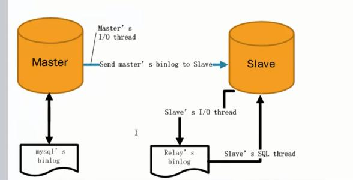

# linux系统mysql主从配置

## 一、原理



mysql主从配置的流程大体如图：

1. master会将变动记录到二进制日志里面；

2. master有一个I/O线程将二进制日志发送到slave;

3. slave有一个I/O线程把master发送的二进制写入到relay日志里面；

4. slave有一个SQL线程，按照relay日志处理slave的数据；

 

## 二、操作步骤

按照原理，我们开启mysql主从复制，我们大体需要做以下操作：

1. 开启master的二进制日志

2. 开启slave的二进制日志

3. 将slave指向master

4. 开始复制

 

## 三、开启master二进制日志

1. 编辑mysql的配置文件，使用命令：
```
vim /etc/my.cnf
```
2. 添加二进制日志配置，开启二进制（master-bin只是日志文件名称，可以自己指定. 
```
log-bin=master-bin
server-id=1
```
注意：server-id是要指定的，不然会报错，每一台指定一个唯一标识符

 

## 四、授权

我们需要给slave配置一个用户/密码的权限
```sql
mysql>GRANT REPLICATION SLAVE ON *.* TO '用户名'@'slave数据库的IP地址' IDENTIFIED BY '密码';
```
这行命令的意思是：允许在某个IP地址的某个用户以某个密码对当前数据库的所有库和所有表进行复制操作

注意：以上配置了权限，我们需要刷新以下权限使用命令：

 
```sql
mysql>flush privileges;
```

或者直接重启mysql服务：
```
service mysql restart;
```

## 五、查看以下master的状态

其实主要是查看以下master的日志文件名字，以及文件所在的位置，使用命令：
```sql
show master status;
```
可以看到类似如下信息：
```
+-------------------+----------+--------------+------------------+-------------------+

| File              | Position | Binlog_Do_DB | Binlog_Ignore_DB | Executed_Gtid_Set |

+-------------------+----------+--------------+------------------+-------------------+

| master-bin.000001 |     1516 |              |                  |                   |

+-------------------+----------+--------------+------------------+-------------------+
```
 

File: 日志文件名称

Position: 日志所在位置

 

## 六、开启slave的二进制日志

进入slave的服务器

1. 编辑mysql的配置文件，使用命令：
```
vim /etc/my.cnf
```
2. 添加二进制日志配置，开启二进制（relay-bin只是日志文件名称，可以自己指定. 
```
log-bin=relay-bin
server-id=2
```
注意：server-id是要指定的，不然会报错，每一台指定一个唯一标识符

 

## 七、将slave指向master
```sql
mysql>CHANGE MASTER TO
>MASTER_HOST='master所在服务器的IP',
>MASTER_USER='master授权的账号',
>MASTER_PASSWORD='master授权的密码',
>MASTER_LOG_FILE='master的日志文件名',
>MASTER_LOG_POS=master的日志所在位置;
```

## 八、开始主从复制

在slave上执行
```sql
mysql>start slave;
```
我们可以查看slave的运行状态：
```sql
show slave status\G;
```
可以看到类似如下内容：

```
*************************** 1. row ***************************
               Slave_IO_State: Waiting for master to send event
                  Master_Host: master的IP地址
                  Master_User: root
                  Master_Port: 3306
                Connect_Retry: 60
              Master_Log_File: master-bin.000001
          Read_Master_Log_Pos: 1516
               Relay_Log_File: slave-bin.000004
                Relay_Log_Pos: 1117
        Relay_Master_Log_File: master-bin.000001
             Slave_IO_Running: Yes
            Slave_SQL_Running: Yes
......    
```
注意：

Slave_IO_Running: YES 表示slave的日志读取线程开启

Slave_SQL_Running: YES 表示SQL执行线程开启

如果有主从复制有错误信息其实也可以看到

 

## 九、测试

以上我们就将主从复制功能设置完毕了，我们可以通过在master里面创建数据库，或者表，插入数据等来测试一下

 

## 十、注意点

1. 开启了主从复制，slave库如果写入数据的话，可能导致数据回滚从而主从复制线程中断，可以通过以下方式解决：
```sql
mysql> stop slave;
mysql> set GLOBAL SQL_SLAVE_SKIP_COUNTER=1;
mysql> start slave;
```
2. 如果要停止slave的复制可以使用命令：
```sql
mysql>stop slave;
```
3. 由于主从复制是基于I/O的日志，所以会存在一定延时，如果对数据一致性要求非常高的话，简单的主从复制在实际环境中会存在问题 

参考：https://www.cnblogs.com/lay2017/p/9043985.html