## 基本元素

* 数据类型
* 数据类型比较规则
* 文字
* 格式的模型
* Null值
* 数据库对象
* 数据库对象名称和别名
* SQL语句中模式对象和部分的语法


1. 数据类型

    Oracle数据库操作的每个值都有一个数据类型。值的数据类型将一组固定的属性与该值关联起来。这些属性导致Oracle以不同的方式对待一种数据类型的值。例如，可以添加NUMBER数据类型的值，但不能添加RAW数据类型的值。

    Oracle数据库提供了一系列内置的数据类型以及用户定义的若干类别，均可用作数据类型，Oracle数据类型的语法出现在下面的图表中。

    数据类型可以是标量类型，也可以是非标量类型。
    * 标量类型包含原子值，大对象(LOB)是标量数据类型的一种特殊形式，表示二进制或字符数据的大标量值。
    * 非标量(有时称为“集合”)包含一组值。

    Oracle预编译器可以识别嵌入式SQL程序中的其他数据类型。这些数据类型称为外部数据类型，与主机变量相关联。不要将内置数据类型、用户定义的类型与外部数据类型混淆。

    **datatypes::=**

    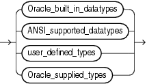


    Oracle内置的数据类型如下

    * **Oracle_built_in_datatypes::=**

        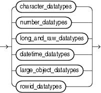

        1. **character_datatypes::=**
        
            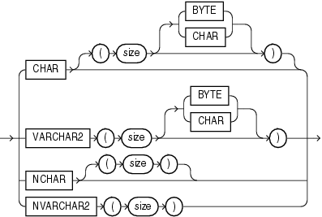

        2. **number_datatypes::=**

            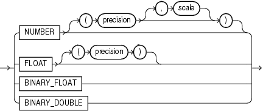

        3. **long_and_raw_datatypes::=**

            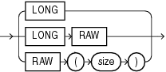

        4. **datetime_datatypes::=**

            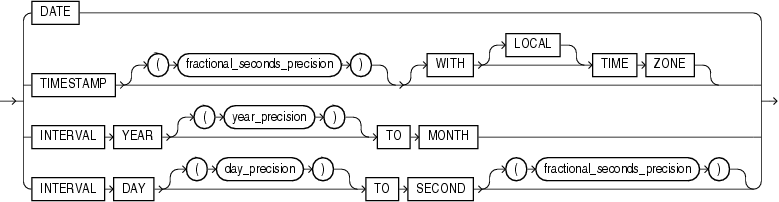

        5. **large_object_datatypes::=**

            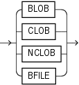

        6. **rowid_datatypes::=**

            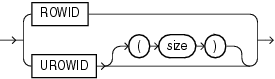

    * **ANSI_supported_datatypes::=**

        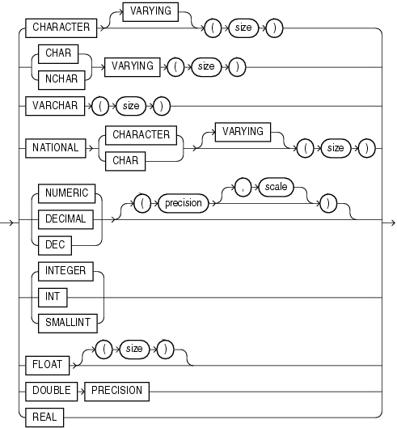

    * **Oracle_supplied_types::=**

        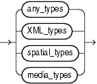

    * **any_types::=**

        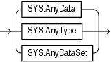

    * **XML_types::=**

        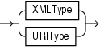
        

    * **spatial_types::=**

        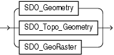

    * **media_types::=**

        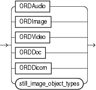

    * **still_image_object_types::=**

        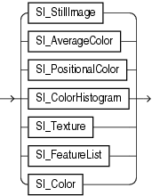

    1. Oracle内置的数据类型

        Code|Data Type|Description
        --|--|--
        1|VARCHAR2(size [BYTE \| CHAR])|具有最大长度大小字节或字符的可变长度字符串。</br>如果MAX_STRING_SIZE = EXTENDED，则为32767字节或字符</br>如果MAX_STRING_SIZE =STANDARD，则为4000字节或字符
        1|NVARCHAR2(size)|具有最大长度大小字符的可变长度Unicode字符串。对于AL16UTF16编码，字节数可以达到2倍大小，对于UTF8编码，字节数可以达到3倍大小。</br>如果MAX_STRING_SIZE = EXTENDED，则为32767字节或字符</br>如果MAX_STRING_SIZE =STANDARD，则为4000字节或字符
        2|NUMBER [ (p [, s]) ]|具有精度p和刻度s的数。精度p的范围从1到38，s的刻度从-84到127不等。精度和比例尺都是十进制的。数字值需要1到22个字节。</br>s为正数时，四舍五入保留s位小数；s为负数时，则从小数点左侧开始第s位进行四舍五入。通过s刻度计算后得到一个值，如果这个值的有效位超过了p位，则报错。</br>比如number(2,1) 有效位最大为2，小数点后最多保留1位，存11.1 得出错 有效位为3，大于2；</br>比如number(2,-3) 有效位最大为2+3=5，没有小数位，存99999 得出错，因为四舍五入后变为100000，有效位为6，大于5。
        2|FLOAT [(p)]|具有精度p的NUMBER数据类型的子类型。浮点值在内部表示为NUMBER。精度p可以从1到126位二进制数字。浮点值需要1到22个字节。换算关系：binary precision＝int(b*0.30103)，保留precision位精度。相当于转成科学记数法后，a=b*10^n，b最多保留precision位。
        8|LONG|可变长度的字符数据，最大可达2g，或2^31 -1字节。提供向后兼容性。尽可能不要创建这种类型的列，可以使用LOB列(CLOB, NCLOB, BLOB)
        12|DATE|有效日期从公元前4712年1月1日到公元9999年12月31日。默认格式由NLS_DATE_FORMAT参数显式地确定，或由NLS_TERRITORY参数隐式地确定。大小固定为7字节。此数据类型包含datetime字段YEAR、MONTH、DAY、HOUR、MINUTE和SECOND。它没有小数秒或时区。
        100|BINARY_FLOAT|32位浮点数。这种数据类型需要4个字节。
        101|BINARY_DOUBLE|64位浮点数。这种数据类型需要8个字节。
        180|TIMESTAMP [(fractional_seconds_precision)]|date的Year、month和day值，以及hour、minute和second值，其中fractional_seconds_precision是SECOND datetime字段的小数部分中的数字。fractional_seconds_precision的接受值为0到9。默认值是6。默认格式由NLS_TIMESTAMP_FORMAT参数显式地确定，或由NLS_TERRITORY参数隐式地确定。大小为7或11字节，这取决于精度。此数据类型包含datetime字段YEAR、MONTH、DAY、HOUR、MINUTE和SECOND。它包含小数秒，但没有时区。
        181|TIMESTAMP [(fractional_seconds_precision)] WITH TIME ZONE|跟TIMESTAMP一样</br>大小固定为13字节。这个数据类型包含datetime字段YEAR、MONTH、DAY、HOUR、MINUTE、SECOND、TIMEZONE_HOUR和TIMEZONE_MINUTE。它有小数秒和显式时区。
        231|TIMESTAMP [(fractional_seconds_precision)] WITH LOCAL TIME ZONE|跟TIMESTAMP WITH TIME ZONE一样</br>额外注意两点：当数据存储在数据库中时，它被规范化为数据库时区；检索数据时，用户将在会话时区中看到数据。
        182|INTERVAL YEAR [(year_precision)] TO MONTH|存储以年和月为单位的时间段，其中year_precision是YEAR datetime字段中的数字。接受的值是0到9。默认值是2。大小固定为5字节。
        183|INTERVAL DAY [(day_precision)] TO SECOND [(fractional_seconds_precision)]|以天、小时、分钟和秒为单位存储一段时间。</br>day_precision是DAY datetime字段中的最大数字。接受的值是0到9。默认值是2。</br>fractional_seconds_precision是SECOND字段的小数部分的位数。接受的值是0到9。默认值是6。大小固定为11字节。
        23|RAW(size)|长度大小为字节的原始二进制数据。必须为原始值指定大小。最大尺寸是:</br>如果MAX_STRING_SIZE = EXTENDED，则为32767字节</br>如果MAX_STRING_SIZE =STANDARD，则为2000字节
        24|LONG RAW|可变长度的原始二进制数据，最大可达2g。
        69|ROWID|以64为基数的字符串表示表中某一行的惟一地址。这种数据类型主要用于ROWID伪列返回的值。
        208|UROWID [(size)]|基64字符串表示索引组织表的一行的逻辑地址。可选的大小是UROWID类型的列的大小。最大大小和默认值是4000字节。
        96|CHAR [(size [BYTE | CHAR])]|长度大小为字节或字符的固定长度字符数据。最大大小为2000字节或字符。默认值和最小大小为1字节。BYTE 和CHAR具有与VARCHAR2相同的语义。
        96|NCHAR[(size)]|长度大小字符的固定长度字符数据。对于AL16UTF16编码，字节数可以达到2倍大小，对于UTF8编码，字节数可以达到3倍大小。最大大小由国家字符集定义确定，上限为2000字节。默认值和最小大小为1个字符。
        112|CLOB|包含单字节或多字节字符的字符大对象。支持固定宽度和可变宽度字符集，都使用数据库字符集。最大大小为(4 gb - 1) *(数据库块大小)。
        112|NCLOB|包含Unicode字符的字符大对象。支持固定宽度和可变宽度字符集，都使用数据库国家字符集。最大大小为(4 gb - 1) *(数据库块大小)。存储国家字符集数据。
        113|BLOB|二进制大对象。最大大小为(4 gb - 1) *(数据库块大小)。
        114|BFILE|包含存储在数据库外的大型二进制文件的定位器。启用对驻留在数据库服务器上的外部lob的字节流I/O访问。最大容量为4g。

    2. 扩展的数据类型

        从Oracle数据库12c开始，可以为VARCHAR2、NVARCHAR2和原始数据类型指定最大大小32767字节。通过设置初始化参数MAX_STRING_SIZE，可以控制数据库是否支持这个新的最大大小:

        * 如果MAX_STRING_SIZE = STANDARD，则适用Oracle数据库12c之前版本的大小限制:VARCHAR2和NVARCHAR2数据类型为4000字节，原始数据类型为2000字节。这是默认值。
        * 如果MAX_STRING_SIZE = EXTENDED，那么VARCHAR2、NVARCHAR2和原始数据类型的大小限制为32767字节。

        ```
        设置MAX_STRING_SIZE = EXTENDED可能会更新数据库对象，并可能使它们失效。有关此参数的含义以及如何设置和启用此新功能的完整信息，请参阅Oracle数据库参考资料。
        ```

    3. Rowid数据类型

        数据库中的每一行都有一个地址。下面的部分描述了Oracle数据库中的两种行地址形式。

        1. ROWID数据类型

            本机用于Oracle数据库的堆组织表中的行具有行地址，称之为rowid。

            您可以通过查询伪列rowid来检查rowid行地址。这个伪列的值是表示每一行地址的字符串。这些字符串的数据类型为ROWID。您还可以创建包含具有ROWID数据类型的实际列的表和集群。Oracle数据库不保证这些列的值是有效的rowid。

            Rowids包含以下信息:
            * 包含该行的数据文件的数据块。这个字符串的长度取决于您的操作系统。
            * 数据块中的行。
            * 包含该行的数据库文件。第一个数据文件是数字1。这个字符串的长度取决于您的操作系统。
            * 数据对象号，它是分配给每个数据库段的标识号。您可以从数据字典视图USER_OBJECTS、DBA_OBJECTS和ALL_OBJECTS中检索数据对象号。共享相同段的对象(例如，相同集群中的集群表)具有相同的对象号。
            
            行id存储为64个基本值，这些值可以包含字符A-Z、A-Z、0-9以及加号(+)和正斜杠(/)。无法直接使用rowid。您可以使用提供的包DBMS_ROWID来解释rowid内容。包函数提取并提供关于上面列出的四个rowid元素的信息。

        2. UROWID数据类型

            有些表的行具有非物理或永久地址，或者不是由Oracle数据库生成的地址。例如，索引组织的表的行地址存储在可以移动的索引叶中。外部表的行id(例如通过网关访问的DB2表)不是标准的Oracle行id。

            Oracle使用universal rowids (urowids)存储索引组织表和外表的地址。索引组织的表具有逻辑urowid，而外部表具有外部urowid。这两种类型的urowid都存储在ROWID伪列中(堆组织表的物理行也是如此)。

            Oracle基于表的主键创建逻辑行。只要主键不变，逻辑行就不会改变。索引组织表的ROWID伪列具有UROWID数据类型。您可以像访问堆组织表的ROWID伪列一样访问这个伪列(使用SELECT…ROWID声明)。如果希望存储索引组织表的行id，则可以为表定义一个类型为UROWID的列，并将ROWID伪列的值检索到该列中。

    4. ANSI，DB2及SQL/DS数据类型

        创建表和集群的SQL语句还可以使用ANSI数据类型和来自IBM产品SQL/DS和DB2的数据类型。

        Oracle识别与Oracle数据库数据类型名称不同的ANSI或IBM数据类型名称。

        它将数据类型转换为等效的Oracle数据类型，将Oracle数据类型记录为列数据类型的名称，并根据下表中显示的转换将列数据存储在Oracle数据类型中。

        1. ANSI数据类型转化为Oracle数据类型

            ANSI SQL数据类型|Oracle数据类型
            --|--
            CHARACTER(n)</br>CHAR(n)	|	CHAR(n)
            CHARACTER VARYING(n)</br>CHAR VARYING(n)	|	VARCHAR2(n)
            NATIONAL CHARACTER(n)</br>NATIONAL CHAR(n)</br>NCHAR(n)	|	NCHAR(n)
            NATIONAL CHARACTER VARYING(n)</br>NATIONAL CHAR VARYING(n)</br>NCHAR VARYING(n)	|	NVARCHAR2(n)
            NUMERIC[(p,s)]</br>	DECIMAL[(p,s)] (Note 1)	| NUMBER(p,s)
            INTEGER</br>INT</br>SMALLINT	|	NUMBER(p,0)
            FLOAT (Note 2)</br>DOUBLE PRECISION (Note 3)</br>REAL (Note 4)	|	FLOAT(126)</br>FLOAT(126)</br>FLOAT(63)

            注意点：
            1. NUMERIC和DECIMAL数据类型只能指定定点数字。对于这些数据类型，scale默认为0。
            2. FLOAT数据类型是具有二进制精度b的浮点数。该数据类型的默认精度为126二进制或38十进制。
            3. DOUBLE PRECISION数据类型是一个浮点数，具有二进制精度126。
            4. REAL数据类型是一个浮点数，二进制精度为63，或者十进制18。

        2. SQL/DS and DB2数据类型转化为Oracle数据类型

            SQL/DS and DB2数据类型|Oracle数据类型
            --|--
            CHARACTER(n)|CHAR(n)
            VARCHAR(n)|VARCHAR(n)
            LONG VARCHAR|LONG
            DECIMAL(p,s) (Note 1)|NUMBER(p,s)
            INTEGER</br>SMALLINT|NUMBER(p,0)
            FLOAT (Note 2)|NUMBER

            注意点：
            1. DECIMAL数据类型只能指定定点数字。对于这种数据类型，s默认为0。
            2. FLOAT数据类型是具有二进制精度b的浮点数。该数据类型的默认精度为126二进制或38十进制。

    5. 用户自定义类型
    6. Oracle提供的类型
    7. 任何类型
    8. XML类型
    9. 空间类型
    10. 媒体类型

2. 数据类型比较规则

    1. 数字值

        较大的值被认为大于较小的值。所有负数都小于零，所有正数都小于零。因此-1小于100;-100小于-1。
        
        浮点值NaN(不是数字)大于任何其他数字值，并且等于它本身。

    2. 日期值

        较晚的日期被认为比较早的日期更大。例如，相当于“29-MAR-2005”的日期小于“05-JAN-2006”的日期，而“05-JAN-2006 1:35pm”大于“05-JAN-2005 10:09am”的日期。

    3. 字符值

        字符值的比较基于两个度量:

        1. 二进制或语言排序

            在二进制比较中，默认为Oracle根据数据库字符集中字符的数字代码的串联值来比较字符串。也就是说，如果一个字符的数值大于另一个字符在字符集中的数值，则该字符大于另一个字符。Oracle认为空白比任何字符都小，在大多字符集中都是正确的

            常用的字符集
            * 7位ASCII(美国信息交换标准码)
            * EBCDIC码(扩展二进制编码的十进制交换码)
            * ISO 8859/1(国际标准化组织)
            * JEUC日本扩展UNIX


            如果数字代码的二进制序列与正在比较的字符的语言序列不匹配，则语言比较非常有用。如果NLS_SORT参数的设置不是二进制的，并且NLS_COMP参数被设置为language，则使用语言比较。在语言排序中，所有SQL排序和比较都基于NLS_SORT指定的语言规则。

        2. 空白填充或非填充比较语义

            使用空白填充的语义，如果两个值的长度不同，那么Oracle首先在较短的值的末尾添加空白，以便它们的长度相等。然后，Oracle将逐个比较字符直到出现不同字符。在第一个不同位置具有较大字符的值被认为是较大的。如果两个值没有不同的字符，则认为它们是相等的。这条规则意味着，如果两个值只在后面的空格数上不同，那么它们就是相等的。只有当比较中的两个值都是数据类型CHAR、NCHAR、文本文本或用户函数返回的值的表达式时，Oracle才使用空白填充的比较语义。

            使用非填充语义，Oracle按字符比较两个值，直到第一个不同的字符。在该位置具有较大字符的值被认为是较大的。如果两个长度不同的值在较短的值结束之前是相同的，则认为较长的值更大。如果两个长度相等的值没有不同的字符，则认为这些值是相等的。当比较中的一个或两个值具有VARCHAR2或NVARCHAR2数据类型时，Oracle使用非填充比较语义。

            使用不同的比较语义比较两个字符值的结果可能不同。下表显示了使用每种比较语义比较五对字符值的结果。通常，空白填充和非填充比较的结果是相同的。表中的最后一个比较说明了填充空白和非填充比较语义之间的差异。

            用空格填充|非填充
            --|--
            'ac' > 'ab'	| 'ac' > 'ab'
            'ab' > 'a  '| 'ab' > 'a   '
            'ab' > 'a'	| 'ab' > 'a'
            'ab' = 'ab'	| 'ab' = 'ab'
            'a ' = 'a'	| 'a ' > 'a'

    4. 对象值

        使用以下两个比较函数之一比较对象值:MAP和ORDER。这两个函数都比较对象类型实例，但是它们之间有很大的不同。必须将这些函数指定为将与其他对象类型进行比较的任何对象类型的一部分。

    5. varray和嵌套表(跳过)
    6. 数据类型优先级

        Oracle使用数据类型优先级来确定隐式数据类型转换，这将在下一节中讨论。Oracle数据类型的优先级如下:
        * Datetime和interval数据类型
        * BINARY_DOUBLE
        * BINARY_FLOAT
        * NUMBER
        * 字符数据类型
        * 所有其他内置数据类型

    7. 数据转换

        通常，表达式不能包含不同数据类型的值。例如，一个表达式不能将5乘以10然后加上“JAMES”。然而，Oracle支持从一种数据类型到另一种数据类型的隐式和显式值转换。

        隐式和显式数据转换

        Oracle建议您指定显式转换，而不是依赖于隐式或自动转换，原因如下:
        * 当使用显式数据类型转换函数时，SQL语句更容易理解。
        * 隐式数据类型转换可能对性能产生负面影响，特别是如果将列值的数据类型转换为常量的数据类型，而不是相反。
        * 隐式转换依赖于它发生的上下文，在每种情况下可能不会以相同的方式工作。例如，根据NLS_DATE_FORMAT参数的值，从datetime值隐式转换为VARCHAR2值可能会返回一个意外的年份。
        * 隐式转换的算法在不同的软件版本和Oracle产品之间可能会发生变化。显式转换的行为更易于预测。
        * 如果隐式数据类型转换发生在索引表达式中，那么Oracle数据库可能不会使用索引，因为索引是为预转换数据类型定义的。这可能会对性能产生负面影响。


        1. 隐式转换

            当这种转换有意义时，Oracle数据库会自动将值从一种数据类型转换为另一种数据类型。Oracle隐式转换的矩阵（省略）

            不能直接将LONG转换为INTERVAL，但是可以使用TO_CHAR(INTERVAL)将LONG转换为VARCHAR2，然后将得到的VARCHAR2值转换为INTERVAL。

            1. 隐式数据类型转换规则

                * 在INSERT 和UPDATE 操作期间，Oracle将值转换为受影响列的数据类型。
                * 在SELECT FROM操作期间，Oracle将列中的数据转换为目标变量的类型。
                * 在操作数值时，Oracle通常调整精度和比例，以允许最大容量。在这种情况下，这些操作产生的数值数据类型可能与底层表中找到的数值数据类型不同。
                * 当比较字符值和数值时，Oracle将字符数据转换为数值。
                * 字符值或数字值与浮点数值之间的转换可能不精确，因为字符类型和数字使用十进制精度表示数值，而浮点数使用二进制精度。
                * 当将CLOB值转换为字符数据类型(如VARCHAR2)或将BLOB转换为原始数据时，如果要转换的数据大于目标数据类型，那么数据库将返回一个错误。
                * 在从时间戳值转换为日期值期间，时间戳值的小数秒部分将被截断。这种行为与Oracle数据库的早期版本不同，在早期版本中，时间戳值的小数秒部分是四舍五入的。
                * 从BINARY_FLOAT到BINARY_DOUBLE的转换是精确的。
                * 如果BINARY_DOUBLE值使用了比BINARY_FLOAT所支持的更精确的位，那么从BINARY_DOUBLE到BINARY_FLOAT的转换就是不精确的。
                * 在比较字符值和日期值时，Oracle将字符数据转换为日期。
                * 当使用SQL函数或操作符时，如果参数不是它所接受的数据类型，Oracle会将该参数转换为所接受的数据类型。
                * 在进行赋值时，Oracle将等号(=)右侧的值转换为赋值对象左侧的数据类型。
                * 在连接操作期间，Oracle将非字符数据类型转换为CHAR或NCHAR。
                * 在对字符和非字符数据类型进行算术运算和比较时，Oracle会根据需要将任何字符数据类型转换为数字、日期或rowid。在CHAR/VARCHAR2和NCHAR/NVARCHAR2之间的算术运算中，Oracle转换为一个数字。
                * 大多数SQL字符函数都支持接受CLOB作为参数，Oracle在CLOB和字符类型之间执行隐式转换。因此，尚未为clob启用的函数可以通过隐式转换接受clob。在这种情况下，Oracle在调用函数之前将clob转换为CHAR或VARCHAR2。如果CLOB大于4000字节，那么Oracle只将前4000字节转换为CHAR。
                * 在将RAW 或LONG RAW转换为字符数据或从字符数据转换为字符数据时，二进制数据以十六进制形式表示，十六进制字符表示每四位RAW数据。有关更多信息，请参考“原始和长原始数据类型”。
                * 比较CHAR和VARCHAR2以及NCHAR和NVARCHAR2类型可能需要不同的字符集。在这种情况下，默认的转换方向是从数据库字符集到国家字符集。表2-11显示了不同字符类型之间隐式转换的方向（省略）。

            2. 隐式数据转换示例

                * 文本文字的例子

                    文本文字“10”具有数据类型CHAR。Oracle隐式地将它转换为数字数据类型，如果它出现在数字表达式中，如下面的语句所示:
                    
                    ```sql
                    SELECT salary + '10'
                    FROM employees;
                    ```

                * 字符和数值的例子

                    当条件比较字符值和数字值时，Oracle隐式地将字符值转换为数字值，而不是将数字值转换为字符值。在下面的语句中，Oracle隐式地将“200”转换为200:
                    
                    ```sql
                    SELECT last_name
                    FROM employees
                    WHERE employee_id = '200';
                    ```
                
                * 日期例子

                    在下面的语句中，Oracle使用默认日期格式“DD-MON-YY”隐式地将“24-JUN-06”转换为日期值:

                    ```sql
                    SELECT last_name
                    FROM employees 
                    WHERE hire_date = '24-JUN-06';
                    ```
        
        2. 显式数据转换

            可以使用SQL转换函数显式指定数据类型转换。表2-12（省略）显示了显式地将值从一种数据类型转换为另一种数据类型的SQL函数。
            
            在Oracle可以执行隐式数据类型转换的情况下，不能指定LONG和LONG RAW。例如，LONG和LONG RAW不能出现在带有函数或操作符的表达式中。有关LONG数据类型和LONG RAW数据类型的限制的信息，请参阅“长数据类型”。

    8. 数据转换中的安全考虑

        当datetime值通过隐式转换或不指定格式模型的显式转换转换为文本时，格式模型由全球化会话参数之一定义。根据源数据类型，参数名为NLS_DATE_FORMAT、NLS_TIMESTAMP_FORMAT或NLS_TIMESTAMP_TZ_FORMAT。这些参数的值可以在客户机环境或ALTER SESSION语句中指定。

        当将没有显式格式模型的转换应用于连接到动态SQL语句文本的datetime值时，格式模型对会话参数的依赖可能会对数据库安全性产生负面影响。动态SQL语句是那些在将文本传递到数据库执行之前将文本从片段连接起来的语句。动态SQL通常与内置的PL/SQL包DBMS_SQL关联，或者与PL/SQL语句EXECUTE IMMEDIATE关联，但这些并不是动态构造的SQL文本作为参数传递的惟一地方。例如:

        ```sql
        EXECUTE IMMEDIATE
        'SELECT last_name FROM employees WHERE hire_date > ''' || start_date || '''';
        ```

        start_date具有DATE数据类型。

        在上面的例子中，start_date的值使用会话参数NLS_DATE_FORMAT中指定的格式模型转换为文本。结果被连接到SQL文本中。datetime格式模型可以简单地由双引号括起来的文本组成。因此，任何能够显式地为会话设置全球化参数的用户都可以决定通过上述转换生成什么文本。    
        * 如果SQL语句是由PL/SQL过程执行的，则该过程很容易通过会话参数进行SQL注入。   
        * 如果过程以definer的权限(比会话本身具有更高的权限)运行，用户可以获得对敏感数据的未经授权的访问。

        数值的隐式和显式转换也可能遇到类似的问题，因为转换结果可能取决于会话参数NLS_NUMERIC_CHARACTERS。此参数定义十进制和组分隔符。如果将十进制分隔符定义为引号或双引号，就会出现一些SQL注入的可能性。

3. 文字

    术语literal和constant值是同义词，指的是固定的数据值。例如，“JACK”、“BLUE ISLAND”和“101”都是字符文字;5001是一个数字文字。字符文本用单引号括起来，以便Oracle能够将它们与模式对象名称区分开来。
    本节包括以下主题:
    * 文本文字
    * 数字文字
    * 日期时间文字
    * 时间间隔文字

    许多SQL语句和函数要求您指定字符和数字文字值。还可以将文字指定为表达式和条件的一部分。
    * 使用“text”表示法指定字符表示法
    * 使用“N”表示法指定国家字符表示法
    * 使用整数或数字表示法指定数字表示法
    
    具体取决于文字的上下文。这些符号的语法形式出现在下面的小节中。

    要将datetime或interval数据类型指定为文字，必须考虑数据类型中包含的任何可选精度。“数据类型”的相关部分提供了将datetime和interval数据类型指定为文字的示例。

    1. 文本文字

        在此引用的其他部分的表达式、条件、SQL函数和SQL语句语法中出现字符串时，使用文本文字表示法指定值。
        
        此引用可互换使用术语**文本文本、字符文本和字符串**。文本、字符和字符串文本总是被单引号包围。如果语法使用术语char，则可以指定文本文本或解析为字符数据的另一个表达式——例如，hr.employee的last_name列。当char出现在语法中时，不使用单引号。

        文本文字或字符串的语法如下:

        string::=
        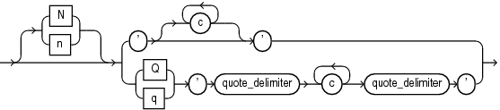

        其中N或N使用国家字符集(NCHAR或NVARCHAR2数据)指定文字。默认情况下，使用这种表示法输入的文本在服务器使用时通过数据库字符集转换为国家字符集。为了避免在将文本文本转换为数据库字符集时可能丢失数据，将环境变量ORA_NCHAR_LITERAL_REPLACE设置为TRUE。这样做可以透明地替换内部的n'，并保留用于SQL处理的文本文本。

        * 在语法的顶部分支:
            1. c是用户字符集中的任何成员。文字中的单引号(')前必须有转义字符。要在文字中表示一个单引号，请输入两个单引号。
            2. ' '是两个单引号，分别以文本的开头和结尾。

        * 在语法的底部分支:
            1. Q或Q表示将使用另一种引用机制。这种机制允许为文本字符串使用多种分隔符。
            2. 最外层的' '是两个单引号，分别位于开始和结束quote_delimiter之前和之后。
            3. c是用户字符集的任何成员。您可以在由c字符组成的文本文本中包含引号(")。您还可以包括quote_delimiter，只要它不是紧跟在单引号后面。
            4. quote_delimiter是除空格、制表符和返回外的任何单字节或多字节字符。quote_delimiter可以是单引号。但是，如果quote_delimiter出现在文本文本本身中，请确保它不会立即后跟单引号。
            5. 如果开始的quote_delimiter是[、{、<或(，那么结束的quote_delimiter必须是相应的]、}、>或)之一。在所有其他情况下，开始和结束quote_delimiter必须是相同的字符。

        文本文本具有CHAR和VARCHAR2数据类型的属性:
            
            在表达式和条件中，Oracle通过使用空白填充的比较语义对文本文本进行比较，将其视为具有数据类型CHAR。

            如果初始化参数MAX_STRING_SIZE = STANDARD，文本文本的最大长度为4000字节。
            如果MAX_STRING_SIZE = EXTENDED，文本文本的最大长度为32767字节。

        下面是一些有效文本文本:

        ```
        'Hello'
        'ORACLE.dbs'
        'Jackie''s raincoat'
        '09-MAR-98'
        N'nchar literal'
        ```

        下面是一些使用替代引用机制的有效文本文本:

        ```
        q'!name LIKE '%DBMS_%%'!'
        q'<'So,' she said, 'It's finished.'>'
        q'{SELECT * FROM employees WHERE last_name = 'Smith';}'
        nq'ï Ÿ1234 ï'
        q'"name like '['"'
        ```
        
    2. 数字文字

        1. 整型文本

            在此引用的其他部分中描述的表达式、条件、SQL函数和SQL语句中出现整数时，必须使用整数符号指定整数。
            integer的语法如下:

            integer::=
            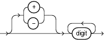

            digit是0,1,2,3,4,5,6,7,8,9其中之一

            一个整数最多可以存储38位精度。
            以下是一些有效整数:

            ```
            7
            +255
            ```

        2. 数字和浮点型文本

            在此引用的其他部分的表达式、条件、SQL函数和SQL语句中出现数字或n时，必须使用数字或浮点表示法指定值。
            数字的语法如下:

            number::=
            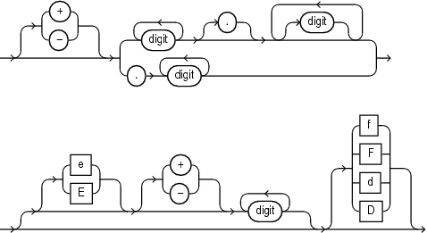
            

            * +或-表示正或负的值。如果省略符号，则默认值为正值。
            * 数字是0、1、2、3、4、5、6、7、8或9中的一个。
            * e或E表示数字是用科学符号表示的。E后面的数字指定指数。指数可以从-130到125。
            * f或F表示该数字是一个32位二进制浮点数，类型为BINARY_FLOAT。
            * d或D表示该数字是一个64位二进制浮点数，类型为BINARY_DOUBLE。
            * 如果省略f或F和d或D，则该数字的类型为number。
            * 后缀f (f)和d (d)仅在浮点数文字中受支持，而不支持将转换为数字的字符串。例如，如果Oracle正在等待一个数字，并且它遇到了字符串“9”，那么它将把这个字符串转换为数字9。但是，如果Oracle遇到字符串“9f”，则转换失败并返回一个错误。


            一个数的类型数最多可存储38位精度。如果文字需要比NUMBER、BINARY_FLOAT或BINARY_DOUBLE提供的精度更高的精度，那么Oracle将截断该值。如果文字的范围超出NUMBER、BINARY_FLOAT或BINARY_DOUBLE所支持的范围，那么Oracle将引发一个错误。

            数字文字是SQL语法元素，对NLS设置不敏感。数字文字中的十进制分隔符总是句点(.)。但是，如果在需要数值的地方指定了文本文本，那么文本文本将以对nls敏感的方式隐式转换为数字。文本文本中包含的十进制分隔符必须是使用初始化参数NLS_NUMERIC_CHARACTERS建立的分隔符。Oracle建议在SQL脚本中使用数字文字，使它们独立于NLS环境工作。
            
            下面的示例演示了小数分隔符在数值和文本文本中的行为。这些例子假设您已经使用以下语句为当前会话建立了逗号(，)作为NLS十进制分隔符:
            
            ```sql
            ALTER SESSION SET NLS_NUMERIC_CHARACTERS=',.';
            ```

            前面的语句还将句点(.)设置为NLS组分隔符，但这与这些示例无关。
            
            本例在数字文字1.23中使用所需的十进制分隔符(.)，在文本文字“2,34”中使用已建立的NLS十进制分隔符(，)。文本文本被转换为数值2.34，输出使用逗号表示小数分隔符。

            ```sql
            SELECT 2 * 1.23, 3 * '2,34' FROM DUAL;

                2*1.23   3*'2,34'
            ---------- ----------
                2,46       7,02
            ```

            下一个例子显示，逗号不被视为数字文字的一部分。相反，逗号在一个由两个数字表达式组成的列表中被视为分隔符:2*1和23。

            ```sql
            SELECT 2 * 1,23 FROM DUAL;

                2*1         23
            ---------- ----------
                  2         23
            ```

            下一个示例显示，文本文本中的十进制分隔符必须匹配NLS十进制分隔符，以便隐式文本到数字的转换成功。由于十进制分隔符(.)与已建立的NLS十进制分隔符(，)不匹配，下面的语句失败:

            ```sql
            SELECT 3 * '2.34' FROM DUAL;
                        *
            ERROR at line 1:
            ORA-01722: invalid number 
            ```

            下面是一些有效的NUMBER文本
            
            ```
            25
            +6.34
            0.5
            25e-03
            -1
            ```

            以下是一些有效的浮点数文字:

            ```
            25f
            +6.34F
            0.5d
            -1D
            ```
    
    3. 日期时间文字

        Oracle数据库支持四种datetime数据类型:DATE, TIMESTAMP, TIMESTAMP WITH TIME ZONE, 和TIMESTAMP WITH LOCAL TIME ZONE.

        1. Date文字

            可以将DATE值指定为字符串文字，也可以使用TO_DATE函数将字符或数值转换为日期值。DATE文字是Oracle数据库接受TO_DATE表达式代替字符串文字的唯一情况。
            要将DATE值指定为文字值，必须使用公历。您可以指定一个ANSI文字，如下例所示:

            ```sql
            DATE '1998-12-25'
            ```

            ANSI日期文字不包含时间部分，必须以“YYYY-MM-DD”格式指定。或者，您可以指定Oracle日期值，如下面的示例所示:

            ```sql
            TO_DATE('98-DEC-25 17:30','YY-MON-DD HH24:MI')
            ```

            Oracle DATE值的默认日期格式由初始化参数NLS_DATE_FORMAT指定。这个示例日期格式包括一个表示月份的日期的两位数、月份名称的缩写、一年的最后两位数字和一个24小时时间指定。
            
            当在日期表达式中使用默认日期格式的字符值时，Oracle会自动将其转换为日期值。

            如果指定一个没有时间组件的日期值，则默认时间为午夜(分别为24小时和12小时的时钟时间，为00:00:00或12:00:00)。如果指定的日期值没有日期，则默认日期是当前月份的第一天。

            Oracle日期列总是同时包含日期和时间字段。因此，如果查询DATE列，则必须在查询中指定时间字段，或者确保将日期列中的时间字段设置为midnight。否则，Oracle可能不会返回您期望的查询结果。可以使用TRUNC date函数将时间字段设置为midnight，也可以在查询中包含大于或小于条件，而不是相等或不等条件。
            
            下面是一些例子，假设一个表my_table有一个数字列row_num和一个DATE列datecol:

            
            ```sql
            INSERT INTO my_table VALUES (1, SYSDATE);
            INSERT INTO my_table VALUES (2, TRUNC(SYSDATE));

            SELECT *
            FROM my_table;

            ROW_NUM DATECOL
            ---------- ---------
                    1 03-OCT-02
                    2 03-OCT-02

            SELECT *
            FROM my_table
            WHERE datecol > TO_DATE('02-OCT-02', 'DD-MON-YY');

            ROW_NUM DATECOL
            ---------- ---------
                    1 03-OCT-02
                    2 03-OCT-02

            SELECT *
            FROM my_table
            WHERE datecol = TO_DATE('03-OCT-02','DD-MON-YY');

            ROW_NUM DATECOL
            ---------- ---------
                    2 03-OCT-02
            ```

             如果您知道DATE列的时间字段设置为midnight，那么您可以查询DATE列，如下面的示例所示，或者使用DATE文字:

            ```sql
            SELECT *
            FROM my_table
            WHERE datecol = DATE '2002-10-03';


            ROW_NUM DATECOL
            ---------- ---------
                    2 03-OCT-02
            ```

            但是，如果DATE列包含midnight以外的值，则必须过滤查询中的时间字段以获得正确的结果。例如:

            ```sql
            SELECT *
            FROM my_table
            WHERE TRUNC(datecol) = DATE '2002-10-03';


            ROW_NUM DATECOL
            ---------- ---------
                    1 03-OCT-02
                    2 03-OCT-02
            ```

            Oracle将TRUNC函数应用于查询中的每一行，因此如果确保数据中时间字段的午夜值，性能会更好。要确保时间字段设置为午夜，请在插入和更新期间使用以下方法之一:

            * Use the TO_DATE function to mask out the time fields:
            
            ```sql
            INSERT INTO my_table
            VALUES (3, TO_DATE('3-OCT-2002','DD-MON-YYYY'));
            ```

            * Use the DATE literal:

            ```sql
            INSERT INTO my_table
            VALUES (4, '03-OCT-02');
            ```

            * Use the TRUNC function:

            ```sql
            INSERT INTO my_table
            VALUES (5, TRUNC(SYSDATE));
            ```

            date函数SYSDATE返回当前系统日期和时间。函数CURRENT_DATE返回当前会话日期。有关SYSDATE、TO_* datetime函数和默认日期格式的信息。

        2. TIMESTAMP文字

            TIMESTAMP数据类型存储年、月、日、小时、分钟、秒和小数秒值。当您将时间戳指定为文字时，fractional_seconds_precision值可以是任意数字，最多可以是9，如下所示:

            ```sql
            TIMESTAMP '1997-01-31 09:26:50.124'

            select * from my_table where datecol >= TIMESTAMP '1997-01-31 09:26:50.124'
            ```

        3. TIMESTAMP WITH TIME ZONE文字

            TIMESTAMP WITH TIME ZONE是TIMESTAMP的变体，它包含时区区域名称或时区偏移量。当您将TIMESTAMP WITH TIME ZONE指定为文字时，fractional_seconds_precision值可以是任意数字，最多可以是9。例如:

            ```sql
            TIMESTAMP '1997-01-31 09:26:56.66 +02:00'
            ```

            如果两个TIMESTAMP WITH TIME ZONE在UTC中表示相同的时刻，则认为它们是相同的，而不考虑存储在数据中的TIME ZONE偏移量。例如,

            ```sql
            TIMESTAMP '1999-04-15 8:00:00 -8:00'
            ```

            与下面的一样

            ```sql
            TIMESTAMP '1999-04-15 11:00:00 -5:00'
            ```

            太平洋标准时间的上午8点是东部标准时间的上午11点。

        4. TIMESTAMP WITH LOCAL TIME ZONE文字

            TIMESTAMP WITH LOCAL TIME ZONE数据类型与IMESTAMP WITH TIME ZONE不同，因为存储在数据库中的数据被规范化为数据库时区。时区偏移量不作为列数据的一部分存储。对于本地时区，没有用于TIMESTAMP WITH LOCAL TIME ZONE的文字。相反，您可以使用任何其他有效的datetime文字来表示这种数据类型的值。下表显示了一些可以用来将值插入带有TIMESTAMP WITH LOCAL TIME ZONE的格式，以及查询返回的相应值。

            插入语句的值|查询返回的值
            --|--
            '19-FEB-2004'|19-FEB-2004.00.00.000000 AM
            SYSTIMESTAMP|19-FEB-04 02.54.36.497659 PM
            TO_TIMESTAMP('19-FEB-2004', 'DD-MON-YYYY')|19-FEB-04 12.00.00.000000 AM
            SYSDATE|19-FEB-04 02.55.29.000000 PM
            TO_DATE('19-FEB-2004', 'DD-MON-YYYY')|19-FEB-04 12.00.00.000000 AM
            TIMESTAMP'2004-02-19 8:00:00 US/Pacific'|19-FEB-04 08.00.00.000000 AM

    4. 时间间隔文字

        interval文字指定一段时间。您可以用年、月或天、小时、分钟和秒来指定这些差异。Oracle数据库支持两种类型的间隔文字，YEAR TO MONTH和DAY TO SECOND。
        
        每种类型都包含一个前导字段，也可能包含一个尾部字段。前导字段定义了被度量的日期或时间的基本单位。尾部字段定义所考虑的基本单元的最小增量。例如，YEAR TO MONTH的间隔考虑年到最近月份的间隔。DAY TO MINUTE的间隔考虑天到最近分钟的间隔。

        如果有数值形式的日期数据，则可以使用NUMTOYMINTERVAL或NUMTODSINTERVAL转换函数将数值数据转换为区间值。

        区间文字主要用于分析函数。

        1. INTERVAL YEAR TO MONTH

            使用以下语法指定YEAR TO MONTH的间隔文字:

            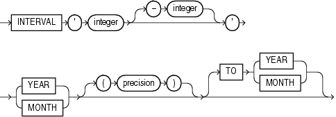

            * 'integer [-integer]'为文字的开头和可选结尾字段指定整数值。如果前面的字段是YEAR，后面的字段是MONTH，那么MONTH字段的整数值范围是0到11。

            * 精度是前导字段的最大位数。前导字段精度的有效范围是0到9，默认值是2。

            **前导字段限制**

            如果指定尾部字段，那么它的重要性必须小于引导字段。例如，从“0-1”月到年的间隔是无效的。

            以下年份到月份的间隔文字表示时间间隔为123年2个月:

            ```sql
            INTERVAL '123-2' YEAR(3) TO MONTH
            ```

            其他形式的文字如下，包括一些缩略版本:

            interval文字形式|解释
            --|--
            INTERVAL '123-2' YEAR(3) TO MONTH|间隔123年2个月。如果前导字段精度大于2位的默认值，则必须指定它。
            INTERVAL '123' YEAR(3)|间隔123年0个月
            INTERVAL '300' MONTH(3)|间隔30个月
            INTERVAL '4' YEAR|映射为INTERVAL '4-0' YEAR TO MONTH，并表示4年
            INTERVAL '50' MONTH|映射为INTERVAL '4-2' YEAR TO MONTH，并表示为50个月或4年2个月
            INTERVAL '123' YEAR|返回一个错误，因为默认精度是2，而“123”有3位数字。

            您可以将一个INTERVAL YEAR TO MONTH的文字添加或减去另一个INTERVAL YEAR TO MONTH的文字，例如:

            ```sql
            INTERVAL '5-3' YEAR TO MONTH + INTERVAL'20' MONTH = 
            INTERVAL '6-11' YEAR TO MONTH
            ```

        2. INTERVAL DAY TO SECOND

            使用以下语法指定DAY TO SECOND的间隔文字:

            interval_day_to_second::=
            
            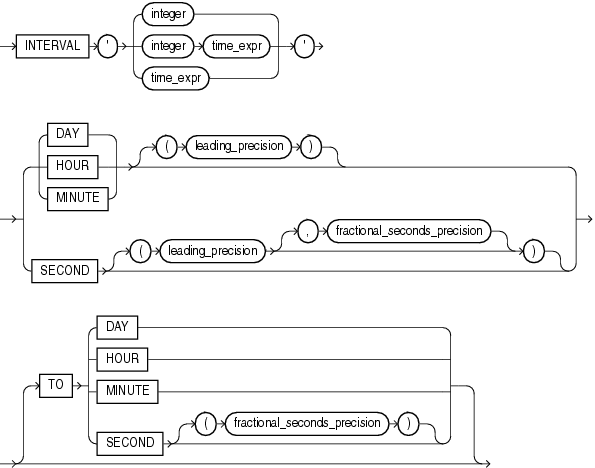

            * integer指定天数。如果这个值包含的数字比领先精度指定的数字多，那么Oracle将返回一个错误。

            * time_expr以HH[:MI[:SS[.n]]]或 MI[:SS[.n]] 或SS[.n]格式指定一个时间。，其中n表示秒的小数部分。如果n包含的数字比fractional_seconds_precision指定的数字多，则n四舍五入为fractional_seconds_precision值指定的数字。只有在前导字段为DAY时，才可以在整数和空格后面指定time_expr。

            * leading_precision是前导字段中的位数。接受的值是0到9。默认值是2。

            * fractional_seconds_precision是第二个datetime字段的小数部分的数字。接受的值是1到9。默认值是6。

            **前导字段限制**

            如果指定尾部字段，那么它的重要性必须小于引导字段。例如，INTERVAL MINUTE TO DAY是无效的。由于这个限制，如果SECOND是前置字段，那么interval文字就不能有任何尾部字段。
            
            尾部字段的有效取值范围如下:

            * HOUR: 0 to 23
            * MINUTE: 0 to 59
            * SECOND: 0 to 59.999999999

            以下是不同形式的INTERVAL DAY TO SECOND文字的例子，包括一些缩略版:

            interval文字形式|解释
            --|--
            INTERVAL '4 5:12:10.222' DAY TO SECOND(3)	|4天5小时12分10秒222千分之一秒。
            INTERVAL '4 5:12' DAY TO MINUTE	|4天5小时12分钟。
            INTERVAL '400 5' DAY(3) TO HOUR	|400天5小时。
            INTERVAL '400' DAY(3)	|400天
            INTERVAL '11:12:10.2222222' HOUR TO SECOND(7)	|11小时12分钟10.2222222秒。
            INTERVAL '11:20' HOUR TO MINUTE	|11小时20分钟。
            INTERVAL '10' HOUR	|10小时
            INTERVAL '10:22' MINUTE TO SECOND	|10分钟22秒
            INTERVAL '10' MINUTE	|10分钟
            INTERVAL '4' DAY	|4天
            INTERVAL '25' HOUR	|25小时
            INTERVAL '40' MINUTE	|40分钟
            INTERVAL '120' HOUR(3)	|120小时
            INTERVAL '30.12345' SECOND(2,4)	|30.1235秒。小数秒“12345”四舍五入为“1235”，因为精度是4。

            您可以将一个DAY TO SECOND时间间隔加或减到另一个DAY TO SECOND时间间隔。例如：
            
            ```sql
            INTERVAL'20' DAY - INTERVAL'240' HOUR = INTERVAL'10-0' DAY TO SECOND
            ```
            
4. 格式的模型

    格式模型是描述存储在字符串中的datetime或数字数据格式的字符文字。格式模型不会更改数据库中值的内部表示形式。当将字符串转换为日期或数字时，格式模型决定Oracle数据库如何解释该字符串。在SQL语句中，可以使用格式模型作为TO_CHAR和TO_DATE函数的参数来指定:

    * 用于Oracle从数据库返回值的格式
    * 为Oracle指定要存储在数据库中的值的格式

    例如：

    * 字符串'17:45:29'的datetime格式模型是'HH24:MI:SS'。
    * 字符串“11- 11- 1999”的datetime格式模型是“DD-Mon-YYYY”。
    * 字符串“$2,304.25”的数字格式模型是“$9,999.99”。

    本节的剩余部分将描述如何使用以下格式模型:

    * 数字格式的模型
    * Datetime格式模型
    * 格式模型修改器

    1. 数字格式的模型

        您可以在以下功能中使用数字格式模型:

        * 在TO_CHAR函数中，将NUMBER、BINARY_FLOAT或BINARY_DOUBLE数据类型的值转换为VARCHAR2数据类型
        * 在TO_NUMBER函数中，将CHAR或VARCHAR2数据类型的值转换为NUMBER数据类型
        * 在TO_BINARY_FLOAT和TO_BINARY_DOUBLE函数中，将CHAR和VARCHAR2表达式转换为BINARY_FLOAT或BINARY_DOUBLE值

        所有数字格式模型都将数字四舍五入为指定的有效数字。如果一个值的小数点左边的有效数字比格式中指定的数字多，则用#替换该值。此事件通常发生在使用带限制性数字格式字符串的TO_CHAR时，这会导致舍入操作。比如：

        ```sql
        select to_char(123456789,'99,99,99,99') c from dual;

        C
        ------------
        ############
        ```
        
        * 如果一个正数的值非常大，不能用指定的格式表示，那么无穷大符号(~)将代替该值。同样，如果一个负数的值非常小，不能用指定的格式表示，那么负无穷符号将代替值(-~)。
        * 如果将BINARY_FLOAT或BINARY_DOUBLE值转换为CHAR或NCHAR，并且输入为无穷大或NaN(不是数字)，那么Oracle总是返回磅符号来替换该值。但是，如果省略了格式模型，那么Oracle将以字符串的形式返回Inf或Nan。

        数字格式模型由一个或多个数字格式元素组成。下面的表列出了数字格式模型的元素，并提供了一些示例。
        
        除非格式模型包含MI、S或PR格式元素，否则负返回值自动包含前导负号，正返回值自动包含前导空格。

        元素|例子|描述
        --|--|--
        ,(逗号)|9,999|返回指定位置的逗号。可以在数字格式模型中指定多个逗号。</br>限制：逗号不能出现在最左或最右，逗号的前后不能是“.”。
        .(句点)|99,99|返回小数点，这是指定位置的句点(.)。</br>限制：您只能在数字格式模型中指定一个句点
        $|$999|返回一个带有$前缀的值
        0|0999</br>9990|返回前导0。</br>返回尾部0。
        9|999|返回具有指定位数的值，如果为正，则使用前导空格;如果为负，则使用前导减号。前导零是空的，除了一个零值，它为定点数的整数部分返回一个零。
        B|B9999|当整数部分为零时(无论格式模型中的零是什么)，返回定点数字的整数部分的空格。
        C|C9999|在指定位置返回ISO货币符号(NLS_ISO_CURRENCY参数的当前值)。即带了前缀CNY
        D|99D99|在指定位置返回十进制字符，这是NLS_NUMERIC_CHARACTER参数的当前值。默认值是句点(.)。</br>限制:您只能在数字格式模型中指定一个十进制字符。
        EEEE|9.9EEEE|返回一个用科学符号表示的值。
        G|9G999|在指定位置返回组分隔符(NLS_NUMERIC_CHARACTER参数的当前值)。可以在数字格式模型中指定多个组分隔符。</br>限制:在数字格式模型中，组分隔符不能出现在十进制字符或句点的右侧。
        L|L999|在指定位置返回本地货币符号(NLS_CURRENCY参数的当前值)。
        MI|9999MI|返回带负号(-)的负值。返回带空白结尾的正值。限制:MI格式元素只能出现在数字格式模型的最后一个位置。
        PR|9999PR|返回<尖括号>中的负值。返回带前导和尾随空格的正值。</br>限制:PR格式元素只能出现在数字格式模型的最后一个位置。
        RN</br>rn|RN</br>rn|返回一个大写罗马数字形式的值。</br>返回一个小写罗马数字形式的值。</br>值可以是1到3999之间的整数。
        S|S9999|返回带前导负号(-)的负值。</br>返回带前导加号(+)的正值。</br>返回带负号(-)的负值。</br>返回带加号(+)的正值。</br>限制:S格式元素只能出现在数字格式模型的第一个或最后一个位置。
        TM|TM|文本最小数字格式模型返回(以十进制输出形式)可能的最小字符数。此元素不区分大小写。</br>默认值是TM9，它以固定的符号返回数字，除非输出超过64个字符。如果输出超过64个字符，Oracle数据库将自动以科学符号返回该数字。</br>限制:不能在此元素之前加上任何其他元素。
        U|U9999|返回指定位置的欧元(或其他)双货币符号，由NLS_DUAL_CURRENCY参数的当前值决定。
        V|999V99|返回一个乘以10n的值(如果需要，四舍五入)，其中n是V后面的9。
        X|XXXX</br>xxxx|返回指定位数的十六进制值。如果指定的数字不是整数，则Oracle数据库将其四舍五入为整数。</br>限制:此元素只接受正值或0。负值返回错误。

        按查询语句

        ```sql
        SELECT TO_CHAR(number, 'fmt')
        FROM DUAL;
        ```

        number转换如表：

        number	|	'fmt'	|	Result
        --|--|--
        -1234567890	|	9999999999S	|	'1234567890-'
        0	|	99.99	|	' .00'
        0.1	|	99.99	|	' .10'
        -0.2	|	99.99	|	' -.20'
        0	|	90.99	|	' 0.00'
        0.1	|	90.99	|	' 0.10'
        -0.2	|	90.99	|	' -0.20'
        0	|	9999	|	' 0'
        1	|	9999	|	' 1'
        0	|	B9999	|	' '
        1	|	B9999	|	' 1'
        0	|	B90.99	|	' '
        123.456	|	999.999	|	' 123.456'
        -123.456	|	999.999	|	'-123.456'
        123.456	|	FM999.009	|	'123.456'
        123.456	|	9.9EEEE	|	' 1.2E+02'
        1.00E+123	|	9.9EEEE	|	' 1.0E+123'
        123.456	|	FM9.9EEEE	|	'1.2E+02'
        123.45	|	FM999.009	|	'123.45'
        123	|	FM999.009	|	'123.00'
        123.45	|	L999.99	|	' $123.45'
        123.45	|	FML999.99	|	'$123.45'
        1234567890	|	9999999999S	|	'1234567890+'

    2. Datetime格式模型

        您可以在以下功能中使用datetime格式模型:
        
        * 在TO_* datetime函数中，将非默认格式的字符值转换为datetime值。(TO_* datetime函数是TO_DATE、TO_TIMESTAMP和TO_TIMESTAMP_TZ。)
        * 在TO_CHAR函数中，将datetime值转换为非默认格式的字符值(例如，从应用程序打印日期)
        datetime格式模型的总长度不能超过22个字符。

        默认的datetime格式要么使用NLS会话参数NLS_DATE_FORMAT、NLS_TIMESTAMP_FORMAT和NLS_TIMESTAMP_TZ_FORMAT显式指定，要么使用NLS会话参数NLS_TERRITORY隐式指定。您可以使用ALTER session语句更改会话的默认datetime格式。

        datetime格式模型由一个或多个datetime格式元素组成。
        * 对于输入格式模型，格式项不能出现两次，表示类似信息的格式项不能组合。例如，您不能在相同的格式字符串中使用'SYYYY'和'BC'。
        * 第二列表示format元素是否可以在TO_* datetime函数中使用。所有格式元素都可以在TO_CHAR函数中使用。
        * 以下datetime格式元素可以用于时间戳和间隔格式模型，但不能用于原始的日期格式模型:FF、TZD、TZH、TZM和TZR。
        * 许多datetime格式元素都是用空格填充的，或者将0引导到特定的长度。

        **日期格式元素中的大写字母**

        将拼出的单词、缩写或罗马数字大写，然后将相应格式元素大写。例如，日期格式模型“DAY”生成大写单词“MONDAY”;“天”产生“周一”;“day”产生“monday”。

        **Datetime格式模型中的标点符号和字符文字**

        您可以在日期格式模型中包含这些字符:
        * 标点符号，如连字符、斜杠、逗号、句号和冒号
        * 字符文字，用双引号括起来
        * 这些字符出现在返回值中的位置与它们出现在格式模型中的位置相同。

        Datetime格式元素
        元素|TO_* datetime函数|描述
        --|--|--
        -</br>/</br>,</br>.</br>;</br>:</br>"text"| Yes	|	结果中复制了标点符号和引用的文本。
        AD</br>A.D.	|	Yes	|	带或不带句点的AD指示符。
        AM</br>A.M.	|	Yes	|	带或不带句点的AM指示符。
        BC</br>B.C.	|	Yes	|	带或不带句点的BC指示符。	
        CC</br>SCC	|		|	世纪</br>例如，2002年返回21;2000年返回20。
        D	|	Yes	|	星期几(1-7)。此元素取决于会话的NLS区域。
        DAY	|	Yes	|	天的名字。
        DD	|	Yes	|	一个月第几天 (1-31).
        DDD	|	Yes	|	一年第几天 (1-366).
        DL	|	Yes	|	返回一个长日期格式的值，该值是Oracle数据库日期格式的扩展，由NLS_DATE_FORMAT参数的当前值决定。使日期组件(日名、月号等)的外观依赖于NLS_TERRITORY和NLS_LANGUAGE参数。例如，在AMERICAN_AMERICA地区中，这相当于指定格式“fmDay、Month dd、yyyy”。在GERMAN_GERMANY地区，它相当于指定格式“fmDay, dd. Month yyyy”。</br>限制:只能用TS元素指定这种格式，以空格分隔。
        DS	|	Yes	|	返回短日期格式的值。使日期组件(日名、月号等)的外观依赖于NLS_TERRITORY和NLS_LANGUAGE参数。例如，在AMERICAN_AMERICA地区中，这相当于指定格式“MM/DD/RRRR”。在ENGLISH_UNITED_KINGDOM地区，它相当于指定格式'DD/MM/RRRR'。</br>限制:只能用TS元素指定这种格式，以空格分隔。
        DY	|	Yes	|	日的缩写。
        E	|	Yes	|	缩写的时代名称(日本帝国历、中华民国官方历、泰国佛历)。
        EE	|	Yes	|	全时代名称(日本帝国历、中华民国官方历、泰国佛历)。
        FF [1..9]	|	Yes	|	分数秒;没有打印基数字符。使用X format元素添加基数字符。使用FF之后的数字1到9来指定返回的datetime值的小数部分的数字。如果没有指定数字，则Oracle数据库将使用为datetime数据类型或数据类型的默认精度指定的精度。在时间戳和间隔格式中有效，但在日期格式中无效。</br>例子:“HH: MI: SS.FF”</br>SELECT TO_CHAR(SYSTIMESTAMP, 'SS.FF3') from DUAL;
        FM	|	Yes	|	返回一个没有前导或尾随空格的值。
        FX	|	Yes	|	要求字符数据和格式模型之间精确匹配。
        HH	|	Yes	|	一天中的小时(1-12)。
        HH12	|		|	
        HH24	|	Yes	|	一天中的小时 (0-23).
        IW	|		|	一年中的日历周(1-52或1-53)，由ISO 8601标准定义。</br>日历周从星期一开始。</br>一年中第一个日历周包括1月4日。</br>一年中第一个日历周可能包括12月29日、30日和31日。</br>一年中最后一个日历周可能包括1月1日、2日和3日。
        IYYY	|		|	按ISO 8601标准定义的包含日历周的一年中的四位数字。
        IYY</br>IY</br>I	|		|	按ISO 8601标准，一年中包含日历周的最后3、2或1位数字。
        J	|	Yes	|	儒略日;自公元前4712年1月1日起的天数。用J指定的数字必须是整数。
        MI	|	Yes	|	分钟 (0-59).
        MM	|	Yes	|	月份 (01-12; January = 01).
        MON	|	Yes	|	月的缩写。
        MONTH	|	Yes	|	月份名称
        PM</br>P.M.	|	Yes	|	带或不带句点的PM指示符。
        Q	|		|	年季度 (1, 2, 3, 4; January - March = 1).
        RM	|	Yes	|	罗马的月份表示 (I-XII; January = I).
        RR	|	Yes	|	让您存储20世纪的日期在21世纪只有两个数字。
        RRRR	|	Yes	|	圆的。接受4位或2位输入。如果是2位，则提供与RR相同的返回值。如果不需要此功能，则输入4位数的年份。
        SS	|	Yes	|	秒 (0-59).
        SSSSS	|	Yes	|	秒午夜(0-86399).
        TS	|	Yes	|	返回短时间格式的值。使时间组件(小时、分钟等)的外观依赖于NLS_TERRITORY和NLS_LANGUAGE初始化参数。</br>限制:只能用DL或DS元素指定这种格式，用空格分隔。
        TZD 	|	Yes	|	夏令时的信息。TZD值是一个带夏令时信息的缩写时区字符串。它必须与TZR中指定的区域相对应。在时间戳和间隔格式中有效，但在日期格式中无效。</br>例如:PST(美国/太平洋标准时间);PDT(美国/太平洋夏令时)。
        TZH	|	Yes	|	时区小时。(参见TZM format元素。)在时间戳和间隔格式中有效，但在日期格式中无效。</br>例如: 'HH:MI:SS.FFTZH:TZM'.
        TZM	|	Yes	|	时区。(参见TZH format元素。)在时间戳和间隔格式中有效，但在日期格式中无效。</br>例如: 'HH:MI:SS.FFTZH:TZM'.
        TZR	|	Yes	|	时区区域信息。该值必须是数据库中支持的时区区域名称之一。在时间戳和间隔格式中有效，但在日期格式中无效。</br>Example: US/Pacific
        WW	|		|	一年中的第一周(1-53)，第一周从一年的第一天开始，一直持续到第七天。
        W	|		|	月的第一周(1-5)，第一周从月的第一天开始，到第7周结束。
        X	|	Yes	|	本地基数符号</br>例如: 'HH:MI:SSXFF'.
        Y,YYY	|	Yes	|	年在这个位置加逗号。
        YEAR</br>SYEAR	|		|	一年,拼出;S用一个负号(-)作为BC日期的前缀。
        YYYY</br>SYYYY	|	Yes	|	4位;S用一个负号作为BC日期的前缀。
        YYY</br>YY</br>Y|	Yes	|	一年的最后三位、两位或一位。

        Oracle数据库以一定的灵活性将字符串转换为日期。例如,当TO_DATE函数,模型包含标点符号格式匹配输入字符串缺少部分或所有这些角色,提供每个数值元素的输入字符串包含允许的最大数量的位数的例子中,两个数字“05”“毫米”或“YYYY”四个数字“2007”。以下语句不返回错误:
        
        ```sql
        SELECT TO_CHAR(TO_DATE('0207','MM/YY'), 'MM/YY') FROM DUAL;
        TO_CH
        -----
        02/07
        ```

        但是，下面的格式字符串确实会返回一个错误，因为FX (format precise)格式修饰符需要表达式和格式字符串的精确匹配:

        ```sql
        SELECT TO_CHAR(TO_DATE('0207', 'fxmm/yy'), 'mm/yy') FROM DUAL;
        SELECT TO_CHAR(TO_DATE('0207', 'fxmm/yy'), 'mm/yy') FROM DUAL;
                            *
        ERROR at line 1:
        ORA-01861: literal does not match format string
        ```

        允许任何非字母数字字符匹配格式模型中的标点符号。例如，下面的语句不会返回错误:

        ```sql
        SELECT TO_CHAR (TO_DATE('02#07','MM/YY'), 'MM/YY') FROM DUAL;

        TO_CH
        -----
        02/07
        ```sql
        
    3. 格式模型修改器

        在TO_CHAR函数的格式模型中使用的FM和FX修饰符控制空白填充和精确的格式检查。

        格式模型中可以出现多个修饰符。在这种情况下，后面的每个事件都会切换修饰符的效果。它的效果在模型第一次出现后对模型的部分启用，然后对第二次出现后的部分禁用，然后对第三次出现后的部分重新启用，依此类推。

        * FM

            Fill mode。Oracle使用尾随空白字符和前导零来填充格式元素，使其宽度保持不变。宽度等于相关格式模型中最大元素的显示宽度:

            * 数值元素由前导零填充到元素允许的最大值的宽度。例如，YYYY元素填充为四位(长度为'9999')，HH24填充为两位(长度为'23')，DDD填充为三位(长度为'366')。

            * 字母元素元素MONTH,MON,DAY和DY的通过尾部填充空格达到最长的宽度：最长的月份全称，最长的月份名字缩写,最长的完整日期名称、或最长的日期名称缩写,这些有效的名称由NLS_DATE_LANGUAGE和NLS_CALENDAR参数的值所决定。
            
                例如，当NLS_DATE_LANGUAGE为AMERICAN而NLS_CALENDAR为GREGORIAN(缺省值)时，MONTH的最大元素是SEPTEMBER，因此MONTH format元素的所有值都被填充为9个显示字符。NLS_DATE_LANGUAGE和NLS_CALENDAR参数的值在TO_CHAR和TO_* datetime函数的第三个参数中指定，或者从当前会话的NLS环境中检索它们。
            * 字符元素RM由尾随空格填充，长度为4，即“viii”的长度。
            * 其他字符元素和拼出的数字(SP、SPTH和THSP后缀)没有填充。

            FM修饰符在TO_CHAR函数的返回值中抑制上述填充。

        * FX

            Format exact。此修饰符为TO_DATE函数的字符参数和datetime格式模型指定精确匹配:
            
            * 字符参数中的标点符号和引用文本必须与格式模型的对应部分完全匹配(大小写除外)。
            * 字符参数不能有额外的空格。如果没有FX, Oracle将忽略额外的空格。
            * 字符参数中的数字数据必须具有与格式模型中相应元素相同的数字数目。如果没有* FX，字符参数中的数字可以省略前导零。
            
            启用FX时，还可以使用FM修饰符禁用对前导零的检查。

            如果字符参数的任何部分违反了这些条件，那么Oracle将返回一条错误消息。

        如果字符参数的任何部分违反了这些条件，那么Oracle将返回一条错误消息。

        Format Model例子

        下面的语句使用日期格式模型返回字符表达式:
        
        ```sql
        SELECT TO_CHAR(SYSDATE, 'fmDDTH') || ' of ' ||
            TO_CHAR(SYSDATE, 'fmMonth') || ', ' ||
            TO_CHAR(SYSDATE, 'YYYY') "Ides" 
        FROM DUAL; 

        Ides 
        ------------------ 
        3RD of April, 2008
        ```

        前面的语句也使用FM修饰符。如果省略FM，则将月份空白填充为9个字符:

        ```sql
        SELECT TO_CHAR(SYSDATE, 'DDTH') || ' of ' ||
        TO_CHAR(SYSDATE, 'Month') || ', ' ||
        TO_CHAR(SYSDATE, 'YYYY') "Ides"
        FROM DUAL; 

        Ides 
        ----------------------- 
        03RD of April    , 2008 
        ```

        下面的语句使用包含两个连续单引号的日期格式模型在返回值中放置单引号:

        ```sql
        SELECT TO_CHAR(SYSDATE, 'fmDay') || '''s Special' "Menu"
        FROM DUAL; 

        Menu 
        ----------------- 
        Tuesday's Special 
        ```

        在格式模型中的字符文本中，可以使用两个连续的单引号实现相同的目的。

        使用FX格式模型修改器匹配字符数据和格式模型

        char|'fmt'|'Math or Error'
        --|--|--
        '15/ JAN /1998'	|	'DD-MON-YYYY'	|	Match
        ' 15! JAN % /1998'	|	'DD-MON-YYYY'	|	Error
        '15/JAN/1998'	|	'FXDD-MON-YYYY'	|	Error
        '15-JAN-1998'	|	'FXDD-MON-YYYY'	|	Match
        '1-JAN-1998'	|	'FXDD-MON-YYYY'	|	Error
        '01-JAN-1998'	|	'FXDD-MON-YYYY'	|	Match
        '1-JAN-1998'	|	'FXFMDD-MON-YYYY'	|	Match


    4. String-to-Date转换规则

        在将字符串值转换为日期值时应用以下附加格式规则(除非您在格式模型中使用了FX或FXFM修饰符来控制精确的格式检查):

        * 如果指定了数字格式元素的所有数字(包括前导零)，则可以从日期字符串中省略格式字符串中包含的标点符号。例如，为两位数格式元素(如MM、DD和YY)指定02而不是2。
        * 可以从日期字符串中省略格式字符串末尾的时间字段。
        * 您可以在日期字符串中使用任何非字母数字字符来匹配格式字符串中的标点符号。
        * 如果datetime格式元素和日期字符串中相应的字符匹配失败，Oracle将尝试使用其他格式元素，如表所示。

        原始格式元素|尝试用其他格式元素替换原始格式元素
        --|--
        'MM'	|	'MON' and 'MONTH'
        'MON	|	'MONTH'
        'MONTH'	|	'MON'
        'YY'	|	'YYYY'
        'RR'	|	'RRRR'

5. Null值

    如果一行中的一列没有值，那么该列就是null，或者包含null。空值可以出现在不受not NULL或主键完整性约束约束的任何数据类型的列中。当实际值未知或值没有意义时使用null。
    
    Oracle数据库将长度为零的字符值视为null。但是，不要使用null来表示0的数值，因为它们是不相等的。

    1. 具有比较条件的Nulls

        要测试空值，只使用比较条件IS NULL和IS NOT NULL。如果您使用任何其他带有null的条件，并且结果取决于null的值，那么结果是未知的。因为null表示缺乏数据，所以null不能等于或不等于任何值或另一个null。然而，Oracle在计算解码函数时认为两个null是相等的。有关语法和其他信息，请参阅DECODE。

        如果两个null出现在复合键中，Oracle还认为它们是相等的。也就是说，如果键的所有非空组件都相等，Oracle认为包含null的两个复合键是相同的。

    2. null的条件

        求值为未知行为的条件几乎为FALSE。例如，在WHERE子句中带有条件的SELECT语句，其计算结果为UNKNOWN，则不返回任何行。然而，对未知条件的求值不同于FALSE，因为对未知条件求值的后续操作将求值为未知。因此，NOT FALSE求值为TRUE, but NOT UNKNOWN求值为UNKNOWN。

        表显示了在条件中涉及null的各种计算示例。如果SELECT语句的WHERE子句中使用了对UNKNOWN求值的条件，则不会为该查询返回任何行。

        条件|A的值|求值
        --|--|--
        a IS NULL	|	10	|	FALSE
        a IS NOT NULL	|	10	|	TRUE
        a IS NULL	|	NULL	|	TRUE
        a IS NOT NULL	|	NULL	|	FALSE
        a = NULL	|	10	|	UNKNOWN
        a != NULL	|	10	|	UNKNOWN
        a = NULL	|	NULL	|	UNKNOWN
        a != NULL	|	NULL	|	UNKNOWN
        a = 10	|	NULL	|	UNKNOWN
        a != 10	|	NULL	|	UNKNOWN

6. 注释

    您可以创建两种类型的注释:
    * SQL语句中的注释存储为执行SQL语句的应用程序代码的一部分。
    * 与单个模式或非模式对象关联的注释连同对象本身的元数据一起存储在数据字典中。

    1. SQL语句中的注释

        注释可以使您的应用程序更容易阅读和维护。例如，可以在语句中包含一条注释，描述应用程序中语句的用途。除了提示之外，SQL语句中的注释不影响语句的执行。

        语句中的任何关键字、参数或标点符号之间都可以出现注释。你可以用两种方式在一个语句中包含一条注释:

        * 以斜杠和星号(/\*)开始注释。继续评论的文本。此文本可以跨多行。用星号和斜杠(*/)结束注释。开始和结束字符不需要用空格或换行符与文本分开。
        * 以——(两个连字符)开始评论。继续注释的文本。此文本不能扩展到新行。用换行符结束注释。
        
        一些用于输入SQL的工具有额外的限制。例如，如果使用SQL*Plus，默认情况下，在多行注释中不能有空行。有关更多信息，请参考作为数据库接口使用的工具的文档。
        一个SQL语句可以包含两种风格的多个注释。注释的文本可以包含数据库字符集中的任何可打印字符。

        例如，这些声明包含许多注释:

        ```sql
        SELECT last_name, employee_id, salary + NVL(commission_pct, 0), 
            job_id, e.department_id
        /* Select all employees whose compensation is
        greater than that of Pataballa.*/
        FROM employees e, departments d
        /*The DEPARTMENTS table is used to get the department name.*/
        WHERE e.department_id = d.department_id
            AND salary + NVL(commission_pct,0) >   /* Subquery:       */
            (SELECT salary + NVL(commission_pct,0)
                /* total compensation is salary + commission_pct */
                FROM employees 
                WHERE last_name = 'Pataballa')
        ORDER BY last_name, employee_id;

        SELECT last_name,                                   -- select the name
            employee_id                                  -- employee id
            salary + NVL(commission_pct, 0),             -- total compensation
            job_id,                                      -- job
            e.department_id                              -- and department
        FROM employees e,                                 -- of all employees
            departments d
        WHERE e.department_id = d.department_id
            AND salary + NVL(commission_pct, 0) >           -- whose compensation 
                                                            -- is greater than
                (SELECT salary + NVL(commission_pct,0)      -- the compensation
                FROM employees 
                WHERE last_name = 'Pataballa')            -- of Pataballa
        ORDER BY last_name                                -- and order by last name
                employee_id                              -- and employee id.
        ;
        ```

    2. 对模式和非模式对象的注释

        您可以使用COMMENT命令将注释与模式对象(表、视图、实体化视图、操作符、索引类型、挖掘模型)或非模式对象(edition)关联起来。还可以在列上创建注释，列是表模式对象的一部分。与模式和非模式对象关联的注释存储在数据字典中。

    3. 提示

        提示是SQL语句中的注释，它将指令传递给Oracle数据库优化器。优化器使用这些提示为语句选择执行计划，除非存在某些条件阻止优化器这样做。

        在Oracle7中引入了提示，当优化器生成非最优计划时，用户几乎没有资源。现在Oracle提供了许多工具，包括SQL Tuning Advisor、SQL plan management和SQL Performance Analyzer，以帮助您解决优化器无法解决的性能问题。Oracle强烈建议您使用这些工具而不是提示。这些工具比提示优越得多，因为在持续使用的基础上，随着数据和数据库环境的变化，它们提供了新的解决方案。

        提示应该谨慎使用，并且只有在您收集了相关表的统计信息并在没有使用EXPLAIN plan语句提示的情况下评估优化器计划之后才使用提示。更改数据库条件以及在后续版本中增强查询性能会对代码中的提示如何影响性能产生重大影响。

        如果您决定使用提示而不是更高级的调优工具，请注意，从长期来看，使用提示所带来的任何短期好处可能不会继续导致性能的提高。（跳过）。

7. 数据库对象
8. 数据库对象名称和别名
9. SQL语句中模式对象和部分的语法

原文：https://docs.oracle.com/database/121/SQLRF/sql_elements001.htm#SQLRF50998