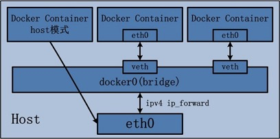
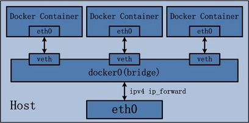
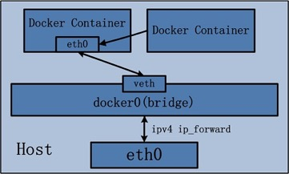
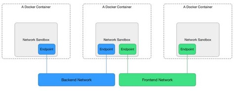
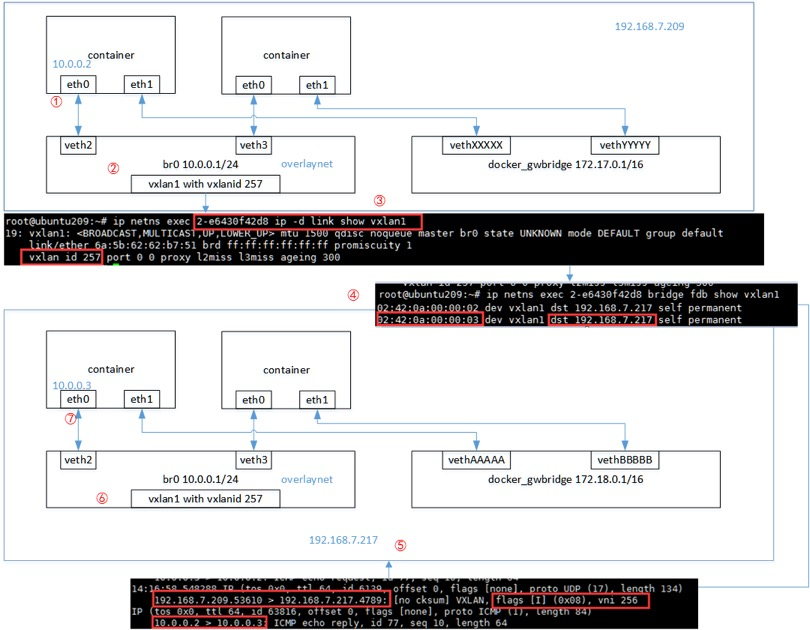
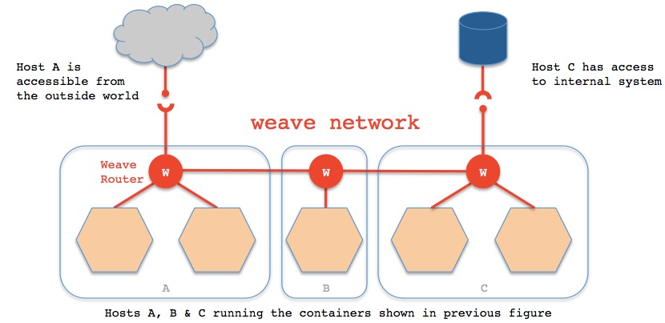
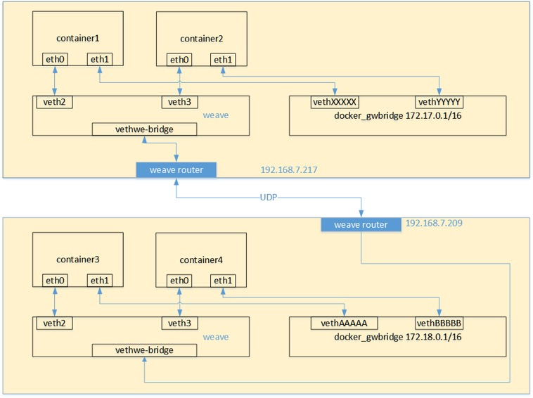
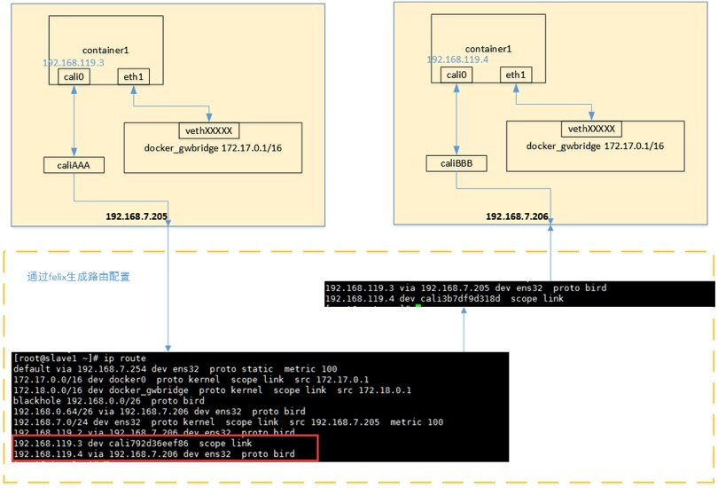

## docker容器网络通信原理分析
**概述**

自从docker容器出现以来，容器的网络通信就一直是大家关注的焦点，也是生产环境的迫切需求。而容器的网络通信又可以分为两大方面：单主机容器上的相互通信和跨主机的容器相互通信。而本文将分别针对这两方面，对容器的通信原理进行简单的分析，帮助大家更好地使用docker。

1. **docker单主机容器通信**

    基于对net namespace的控制，docker可以为在容器创建隔离的网络环境，在隔离的网络环境下，容器具有完全独立的网络栈，与宿主机隔离，也可以使容器共享主机或者其他容器的网络命名空间，基本可以满足开发者在各种场景下的需要。按docker官方的说法，docker容器的网络有五种模式：

    * bridge：docker默认的网络模式，为容器创建独立的网络命名空间，容器具有独立的网卡等所有单独的网络栈，是最常用的使用方式。
    * host：直接使用容器宿主机的网络命名空间。
    * none：为容器创建独立网络命名空间，但不为它做任何网络配置，容器中只有lo，用户可以在此基础上，对容器网络做任意定制。
    * 其他容器：与host模式类似，只是容器将与指定的容器共享网络命名空间。
    * 用户自定义：docker 1.9版本以后新增的特性，允许容器使用第三方的网络实现或者创建单独的bridge网络，提供网络隔离能力。
    这些网络模式在相互网络通信方面的对比如下所示：

    模式|是否支持多主机|南北向通信机制|东西向通信机制
    --|--|--|--
    bridge|否|宿主机端口绑定|通过Linux bridge
    host|是|按宿主机网络通信|按宿主机网络通信
    none|否|无法通信|只能用link通信
    其他容器|否|宿主机端口绑定|通过link通信
    用户自定义|按网络实现而定|按网络实现而定|按网络实现而定

    南北向通信指容器与宿主机外界的访问机制，东西向流量指同一宿主机上与其他容器相互访问的机制。

    1. **host模式**

        由于容器和宿主机共享同一个网络命名空间，换言之，容器的IP地址即为宿主机的IP地址。所以容器可以和宿主机一样，使用宿主机的任意网卡，实现和外界的通信。其网络模型可以参照下图：

        

        采用host模式的容器，可以直接使用宿主机的IP地址与外界进行通信，若宿主机具有公有IP，那么容器也拥有这个公有IP。同时容器内服务的端口也可以使用宿主机的端口，无需额外进行NAT转换，而且由于容器通信时，不再需要通过linuxbridge等方式转发或者数据包的拆封，性能上有很大优势。当然，这种模式有优势，也就有劣势，主要包括以下几个方面：

        * 最明显的就是容器不再拥有隔离、独立的网络栈。容器会与宿主机竞争网络栈的使用，并且容器的崩溃就可能导致宿主机崩溃，在生产环境中，这种问题可能是不被允许的。
        * 容器内部将不再拥有所有的端口资源，因为一些端口已经被宿主机服务、bridge模式的容器端口绑定等其他服务占用掉了。
    2. **bridge模式**

        bridge模式是docker默认的，也是开发者最常使用的网络模式。在这种模式下，docker为容器创建独立的网络栈，保证容器内的进程使用独立的网络环境，实现容器之间、容器与宿主机之间的网络栈隔离。同时，通过宿主机上的docker0网桥，容器可以与宿主机乃至外界进行网络通信。其网络模型可以参考下图：

        

        从该网络模型可以看出，容器从原理上是可以与宿主机乃至外界的其他机器通信的。同一宿主机上，容器之间都是连接到docker0这个网桥上的，它可以作为虚拟交换机使容器可以相互通信。然而，由于宿主机的IP地址与容器veth pair的 IP地址均不在同一个网段，故仅仅依靠veth pair和namespace的技术，还不足以使宿主机以外的网络主动发现容器的存在。为了使外界可以方位容器中的进程，docker采用了端口绑定的方式，也就是通过iptables的NAT，将宿主机上的端口端口流量转发到容器内的端口上。

        举一个简单的例子，使用下面的命令创建容器，并将宿主机的3306端口绑定到容器的3306端口：
        ```bash
        docker run -tid –name db -p 3306:3306 MySQL
        ```
        在宿主机上，可以通过iptables -t nat -L -n，查到一条DNAT规则：
        ```bash
        DNAT tcp — 0.0.0.0/0 0.0.0.0/0 tcp dpt:3306 to:172.17.0.5:3306
        ```
        上面的172.17.0.5即为bridge模式下，创建的容器IP。

        很明显，bridge模式的容器与外界通信时，必定会占用宿主机上的端口，从而与宿主机竞争端口资源，对宿主机端口的管理会是一个比较大的问题。同时，由于容器与外界通信是基于三层上iptables NAT，性能和效率上的损耗是可以预见的。

    3. **none模式**
    
        在这种模式下，容器有独立的网络栈，但不包含任何网络配置，只具有lo这个loopback网卡用于进程通信。也就是说，none模式为容器做了最少的网络设置，但是俗话说得好“少即是多”，在没有网络配置的情况下，通过第三方工具或者手工的方式，开发这任意定制容器的网络，提供了最高的灵活性。

    4. **其他容器模式**

        其他网络模式是docker中一种较为特别的网络的模式。在这个模式下的容器，会使用其他容器的网络命名空间，其网络隔离性会处于bridge桥接模式与host模式之间。当容器共享其他容器的网络命名空间，则在这两个容器之间不存在网络隔离，而她们又与宿主机以及除此之外其他的容器存在网络隔离。其网络模型可以参考下图：

        


        在这种模式下的容器可以通过localhost来同一网络命名空间下的其他容器，传输效率较高。而且这种模式还节约了一定数量的网络资源，但它并没有改变容器与外界通信的方式。在一些特殊的场景中非常有用，例如，kubernetes的pod，kubernetes为pod创建一个基础设施容器，同一pod下的其他容器都以其他容器模式共享这个基础设施容器的网络命名空间，相互之间以localhost访问，构成一个统一的整体。

    5. **用户定义网络模式**

        在用户定义网络模式下，开发者可以使用任何docker支持的第三方网络driver来定制容器的网络。并且，docker 1.9以上的版本默认自带了bridge和overlay两种类型的自定义网络driver。可以用于集成calico、weave、openvswitch等第三方厂商的网络实现。

        除了docker自带的bridge driver，其他的几种driver都可以实现容器的跨主机通信。而基于bdrige driver的网络，docker会自动为其创建iptables规则，保证与其他网络之间、与docker0之间的网络隔离。例如，使用下面的命令创建一个基于bridge driver的自定义网络：
        ```bash
        docker network create bri1
        ```
        则docker会自动生成如下的iptables规则，保证不同网络上的容器无法互相通信。
        ```bash
        -A DOCKER-ISOLATION -i br-8dba6df70456 -o docker0 -j DROP
        -A DOCKER-ISOLATION -i docker0 -o br-8dba6df70456 -j DROP
        ```
        除此之外，bridge driver的所有行为都和默认的bridge模式完全一致。而overlay及其他driver，则可以实现容器的跨主机通信。

2. **docker跨主机容器通信**

    早期大家的跨主机通信方案主要有以下几种：

    * **容器使用host模式**：容器直接使用宿主机的网络，这样天生就可以支持跨主机通信。虽然可以解决跨主机通信问题，但这种方式应用场景很有限，容易出现端口冲突，也无法做到隔离网络环境，一个容器崩溃很可能引起整个宿主机的崩溃。

    * **端口绑定**：通过绑定容器端口到宿主机端口，跨主机通信时，使用主机IP+端口的方式访问容器中的服务。显而易见，这种方式仅能支持网络栈的四层及以上的应用，并且容器与宿主机紧耦合，很难灵活的处理，可扩展性不佳。

    * **docker外定制容器网络**：在容器通过docker创建完成后，然后再通过修改容器的网络命名空间来定义容器网络。典型的就是很久以前的pipework，容器以none模式创建，pipework通过进入容器的网络命名空间为容器重新配置网络，这样容器网络可以是静态IP、vxlan网络等各种方式，非常灵活，容器启动的一段时间内会没有IP，明显无法在大规模场景下使用，只能在实验室中测试使用。

    * **第三方SDN定义容器网络**：使用Open vSwitch或Flannel等第三方SDN工具，为容器构建可以跨主机通信的网络环境。这些方案一般要求各个主机上的docker0网桥的cidr不同，以避免出现IP冲突的问题，限制了容器在宿主机上的可获取IP范围。并且在容器需要对集群外提供服务时，需要比较复杂的配置，对部署实施人员的网络技能要求比较高。

    上面这些方案有各种各样的缺陷，同时也因为跨主机通信的迫切需求，docker 1.9版本时，官方提出了基于vxlan的overlay网络实现，原生支持容器的跨主机通信。同时，还支持通过libnetwork的plugin机制扩展各种第三方实现，从而以不同的方式实现跨主机通信。就目前社区比较流行的方案来说，跨主机通信的基本实现方案有以下几种：

    * 基于隧道的overlay网络：按隧道类型来说，不同的公司或者组织有不同的实现方案。docker原生的overlay网络就是基于vxlan隧道实现的。ovn则需要通过geneve或者stt隧道来实现的。flannel最新版本也开始默认基于vxlan实现overlay网络。

    * 基于包封装的overlay网络：基于UDP封装等数据包包装方式，在docker集群上实现跨主机网络。典型实现方案有weave、flannel的早期版本。

    * 基于三层实现SDN网络：基于三层协议和路由，直接在三层上实现跨主机网络，并且通过iptables实现网络的安全隔离。典型的方案为Project Calico。同时对不支持三层路由的环境，Project Calico还提供了基于IPIP封装的跨主机网络实现。

    下面，本从网络通信模型的角度，对这些方案的通信原理做一个简单的比较，从中可以窥见各种方案在性能上的本质差别。

    1. **docker容器的CNM模型**

        首先，科普下docker容器的CNM网络模型，calico、weave等第三方实现都是基于CNM模型与docker集成的。CNM网络模型的结构如下图所示：
        
        

        在上面的图中：

        * Sandbox代表容器的网络命名空间，包含了容器的完整网络栈，不同的容器之间可以完全隔离。在宿主机上，就表现为独立的网络命名空间。
        * Endpoint代表容器接入网络的端点，可以形象地认为一个Endpoint对容器来说，就是一张物理网卡。
        * Network代表一组可以直接相互通信的Endpoint集合，可以基于LinuxBridge或者VLAN实现。在宿主机上，每个网络都是一个独立的网络命名空间，宿主机上同一网络的的容器，都通过veth pair链接到这个网络命名空间上。

    2. **docker原生overlay的网络通信模型**

        docker官方文档的示例中，overlay网络是在swarm集群中配置的，但实际上，overlay网络可以独立于swarm集群实现，只需要满足以下前提条件即可。

        * 有consul或者etcd，zookeeper的集群key-value存储服务；
        * 组成集群的所有主机的主机名不允许重复，因为docker守护进程与consul通信时，以主机名相互区分；
        * 所有主机都可以访问集群key-value的服务端口，按具体类型需要打开进行配置。例如docker daemon启动时增加参数
            ```
            –cluster-store=etcd://<ETCD-IP>:4001 – -cluster-advertise=eth0:2376
            ```
        * overlay网络依赖宿主机三层网络的组播实现，需要在所有宿主机的防火墙上打开下列端口

            协议|端口|说明
            --|--|--
            udp|4789|容器之间流量的vxlan端口
            tcp/udp|7946|docker守护进程的控制端口

        * 宿主机内核版本10以上（1.9版本时，要求3.16以上）

        满足以上条件后，就可以通过docker network命令来创建跨主机的overlay网络了，例如： docker network create -d overlay overlaynet 在集群的不同主机上，使用overlaynet这个网络创建容器，形成如下图所示的网络拓扑：

        

        由于容器和overlay的网络的网络命名空间文件不再操作系统默认的/var/run/netns下，只能手动通过软连接的方式查看。
        ```bash
        ln -s /var/run/docker/netns /var/run/netns
        ```
        这样就可以通过ip netns查看到容器和网络的网络命名空间了。

        容器的网络命名空间名称可以通过docker inspect -f ‘{{.NetworkSettings.SandboxKey}}’ <容器ID>方式查看到。网络的网络命名空间则是通过docker network ls查看到的网络短ID。

        有时候网络的网络命名空间名称前面会带上1-、2-等序号，有时候不带。但不影响网络的通信和操作。

        从这个通信过程中来看，跨主机通信过程中的步骤如下：

        1. 容器的网络命名空间与overlay网络的网络命名空间通过一对veth pair连接起来，当容器对外通信时，veth pair起到网线的作用，将流量发送到overlay网络的网络命名空间中。
        2. 容器的veth pair对端eth2与vxlan设备通过br0这个Linux bridge桥接在一起，br0在同一宿主机上起到虚拟机交换机的作用，如果目标地址在同一宿主机上，则直接通信，如果不再则通过设置在vxlan1这个vxlan设备进行跨主机通信。
        3. vxlan1设备上会在创建时，由docker daemon为其分配vxlan隧道ID，起到网络隔离的作用。
        4. docker主机集群通过key/value存储共享数据，在7946端口上，相互之间通过gossip协议学习各个宿主机上运行了哪些容器。守护进程根据这些数据来在vxlan1设备上生成静态MAC转发表。
        5. 根据静态MAC转发表的设置，通过UDP端口4789，将流量转发到对端宿主机的网卡上。
        6. 根据流量包中的vxlan隧道ID，将流量转发到对端宿主机的overlay网络的网络命名空间中。
        7. 对端宿主机的overlay网络的网络命名空间中br0网桥，起到虚拟交换机的作用，将流量根据MAC地址转发到对应容器内部。
        
        虽然上面的网络通信模型可以实现容器的跨主机通信，但还是有一些缺陷，造成实际使用上的不便，例如：

        * 由于vxlan网络与宿主机网络默认不再同一网络环境下，为了解决宿主机与容器的通信问题，docker为overlay网络中的容器额外增加了网卡eth1作为宿主机与容器通信的通道。这样在使用容器服务时，就必须根据访问性质的不同，选择不同的网卡地址，造成使用上的不便。
        * 容器对外暴露服务仍然只能使用端口绑定的方式，外界无法简单地直接使用容器IP访问容器服务。
        * 从上面的通信过程中来看，原生的overlay网络通信必须依赖docker守护进程及key/value存储来实现网络通信，约束较多，容器在启动后的一段时间内可能无法跨主机通信，这对一些比较敏感的应用来说是不可靠的。

   3. **weave网络通信模型**

        weave通过在docker集群的每个主机上启动虚拟的路由器，将主机作为路由器，形成互联互通的网络拓扑，在此基础上，实现容器的跨主机通信。其主机网络拓扑参见下图：

        

        如上图所示，在每一个部署Docker的主机（可能是物理机也可能是虚拟机）上都部署有一个W（即weave router，它本身也可以以一个容器的形式部署）。weave网络是由这些weave routers组成的对等端点（peer）构成，并且可以通过weave命令行定制网络拓扑。

        每个部署了weave router的主机之间都会建立TCP和UDP两个连接，保证weave router之间控制面流量和数据面流量的通过。控制面由weave routers之间建立的TCP连接构成，通过它进行握手和拓扑关系信息的交换通信。控制面的通信可以被配置为加密通信。而数据面由weave routers之间建立的UDP连接构成，这些连接大部分都会加密。这些连接都是全双工的，并且可以穿越防火墙。

        当容器通过weave进行跨主机通信时，其网络通信模型可以参考下图：

        

        从上面的网络模型图中可以看出，对每一个weave网络中的容器，weave都会创建一个网桥，并且在网桥和每个容器之间创建一个veth pair，一端作为容器网卡加入到容器的网络命名空间中，并为容器网卡配置ip和相应的掩码，一端连接在网桥上，最终通过宿主机上weave router将流量转发到对端主机上。其基本过程如下：

        1. 容器流量通过veth pair到达宿主机上weave router网桥上。
        2. weave router在混杂模式下使用pcap在网桥上截获网络数据包，并排除由内核直接通过网桥转发的数据流量，例如本子网内部、本地容器之间的数据以及宿主机和本地容器之间的流量。捕获的包通过UDP转发到所其他主机的weave router端。
        3. 在接收端，weave router通过pcap将包注入到网桥上的接口，通过网桥的上的veth pair，将流量分发到容器的网卡上。

        weave默认基于UDP承载容器之间的数据包，并且可以完全自定义整个集群的网络拓扑，但从性能和使用角度来看，还是有比较大的缺陷的：

        * weave自定义容器数据包的封包解包方式，不够通用，传输效率比较低，性能上的损失也比较大。
        * 集群配置比较负载，需要通过weave命令行来手工构建网络拓扑，在大规模集群的情况下，加重了管理员的负担。

    4. **calico网络通信模型**

        calico是纯三层的SDN 实现，它基于BPG 协议和Linux自身的路由转发机制，不依赖特殊硬件，容器通信也不依赖iptables NAT或Tunnel 等技术。能够方便的部署在物理服务器、虚拟机（如 OpenStack）或者容器环境下。同时calico自带的基于iptables的ACL管理组件非常灵活，能够满足比较复杂的安全隔离需求。

        在主机网络拓扑的组织上，calico的理念与weave类似，都是在主机上启动虚拟机路由器，将每个主机作为路由器使用，组成互联互通的网络拓扑。当安装了calico的主机组成集群后，其拓扑如下图所示：

        

        每个主机上都部署了calico/node作为虚拟路由器，并且可以通过calico将宿主机组织成任意的拓扑集群。当集群中的容器需要与外界通信时，就可以通过BGP协议将网关物理路由器加入到集群中，使外界可以直接访问容器IP，而不需要做任何NAT之类的复杂操作。

        当容器通过calico进行跨主机通信时，其网络通信模型如下图所示：

        

        从上图可以看出，当容器创建时，calico为容器生成veth pair，一端作为容器网卡加入到容器的网络命名空间，并设置IP和掩码，一端直接暴露在宿主机上，并通过设置路由规则，将容器IP暴露到宿主机的通信路由上。于此同时，calico为每个主机分配了一段子网作为容器可分配的IP范围，这样就可以根据子网的CIDR为每个主机生成比较固定的路由规则。

        当容器需要跨主机通信时，主要经过下面的简单步骤：

        1. 容器流量通过veth pair到达宿主机的网络命名空间上。
        2. 根据容器要访问的IP所在的子网CIDR和主机上的路由规则，找到下一跳要到达的宿主机IP。
        3. 流量到达下一跳的宿主机后，根据当前宿主机上的路由规则，直接到达对端容器的veth pair插在宿主机的一端，最终进入容器。
        
        从上面的通信过程来看，跨主机通信时，整个通信路径完全没有使用NAT或者UDP封装，性能上的损耗确实比较低。但正式由于calico的通信机制是完全基于三层的，这种机制也带来了一些缺陷，例如：

        * calico目前只支持TCP、UDP、ICMP、ICMPv6协议，如果使用其他四层协议（例如NetBIOS协议），建议使用weave、原生overlay等其他overlay网络实现。
        * 基于三层实现通信，在二层上没有任何加密包装，因此只能在私有的可靠网络上使用。
        * 流量隔离基于iptables实现，并且从etcd中获取需要生成的隔离规则，有一些性能上的隐患。


参考：https://www.cnblogs.com/ilinuxer/p/6680205.html