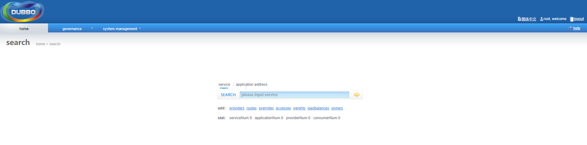
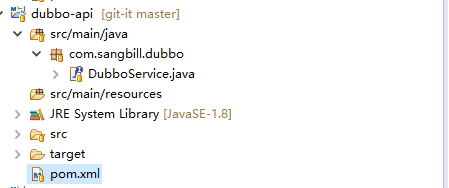
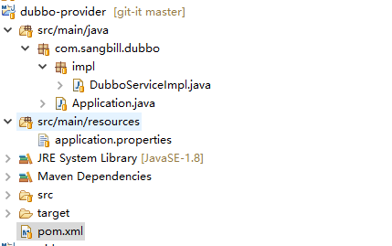
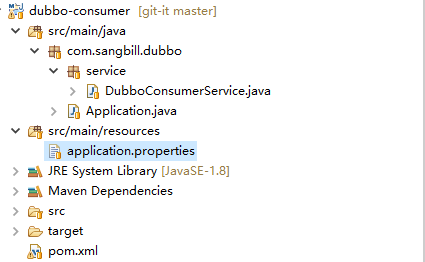
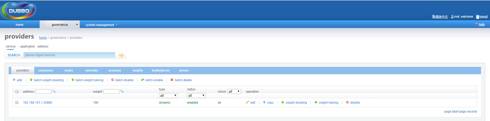
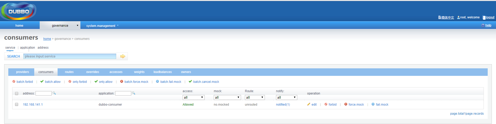

### Dubbo服务框架搭建
在服务框架搭建之前，要先安装好zookeeper,dubbo-admin，并启动好zookeeper，发布dubbo-admin。

假如dubbo-admin的访问地址为http://192.168.141.129:8080
访问，可以看到效果


**1、搭建工程**

该工程是maven工程，共有三个模块：dubb-api,dubbo-provider,dubbo-consumer。

如图


pom.xml：假如了三个模块和依赖的父项目
```xml
<modules>
    <module>dubbo-api</module>
    <module>dubbo-provider</module>
    <module>dubbo-consumer</module>
</modules>

<parent>
    <groupId>org.springframework.boot</groupId>
    <artifactId>spring-boot-starter-parent</artifactId>
    <version>1.5.1.RELEASE</version>
</parent>
<properties>
    <dubbo-spring-boot>1.0.0</dubbo-spring-boot>
</properties>
```

**2、dubbo-api**
如图



DubboService:定义接口类
```java
public interface DubboService {
	public String sayHello(String name);
}
```

**3、dubbo-provider**
如图



pom.xml：添加依赖
```xml
<dependencies>
    <dependency>
        <groupId>com.sangbill</groupId>
        <artifactId>dubbo-api</artifactId>
        <version>${parent.version}</version>
    </dependency>
    
    <!-- Spring Boot Dubbo 依赖 -->
    <dependency>
        <groupId>io.dubbo.springboot</groupId>
        <artifactId>spring-boot-starter-dubbo</artifactId>
        <version>${dubbo-spring-boot}</version>
    </dependency>

    <!-- Spring Boot Web 依赖 -->
    <dependency>
        <groupId>org.springframework.boot</groupId>
        <artifactId>spring-boot-starter-web</artifactId>
    </dependency>

    <!-- Spring Boot Test 依赖 -->
    <dependency>
        <groupId>org.springframework.boot</groupId>
        <artifactId>spring-boot-starter-test</artifactId>
        <scope>test</scope>
    </dependency>

    <!-- Junit -->
    <dependency>
        <groupId>junit</groupId>
        <artifactId>junit</artifactId>
    </dependency>
</dependencies>
```

DubboServiceImpl：实现了接口DubboService
```java
@Service
public class DubboServiceImpl implements DubboService {

	public String sayHello(String name) {
		return name;
	}
}
```

Application：启用类
```java
@SpringBootApplication
public class Application {

	public static void main(String[] args) {
		SpringApplication.run(Application.class, args);
	}
}
```

application.properties:定义了注册,spring.dubbo.scan是指dubbo接口类所在的包
```
server.port=8080
spring.dubbo.application.name=dubbo-provider
spring.dubbo.registry.address=zookeeper://192.168.141.129:2181
spring.dubbo.protocol.name=dubbo
spring.dubbo.protocol.port=20880
spring.dubbo.scan=com.sangbill.dubbo
```

**4、dubbo-consumer**
如图



pom.xml：添加依赖
```xml
<dependencies>
    <dependency>
        <groupId>com.sangbill</groupId>
        <artifactId>dubbo-api</artifactId>
        <version>${parent.version}</version>
    </dependency>
    
    <!-- Spring Boot Dubbo 依赖 -->
    <dependency>
        <groupId>io.dubbo.springboot</groupId>
        <artifactId>spring-boot-starter-dubbo</artifactId>
        <version>${dubbo-spring-boot}</version>
    </dependency>

    <!-- Spring Boot Web 依赖 -->
    <dependency>
        <groupId>org.springframework.boot</groupId>
        <artifactId>spring-boot-starter-web</artifactId>
    </dependency>

    <!-- Spring Boot Test 依赖 -->
    <dependency>
        <groupId>org.springframework.boot</groupId>
        <artifactId>spring-boot-starter-test</artifactId>
        <scope>test</scope>
    </dependency>

    <!-- Junit -->
    <dependency>
        <groupId>junit</groupId>
        <artifactId>junit</artifactId>
    </dependency>
</dependencies>
```

DubboConsumerService：dubbo消费类
```java
@Component
public class DubboConsumerService {

    @Reference
    DubboService dubboService;

    public void printMsg() {
        System.out.println(dubboService.sayHello("abd"));
    }
}
```

Application：启用类
```java
@SpringBootApplication
public class Application {
    public static void main(String[] args) {
        ConfigurableApplicationContext run = SpringApplication.run(Application.class, args);
        DubboConsumerService consumerService = run.getBean(DubboConsumerService.class);
        consumerService.printMsg();
    }
}
```

application.properties:定义了注册,spring.dubbo.scan是指dubbo接口类所在的包
```
server.port=8081
spring.dubbo.application.name=dubbo-consumer
spring.dubbo.registry.address=zookeeper://192.168.141.129:2181
spring.dubbo.scan=com.sangbill.dubbo
```


**2、添加对dubbo-admin查看分组的配置**
假如dubbo-admin的项目发布在tomcat下的/webapps/ROOT
1. dubbo.properties

   路径为/ROOT/WEB-INF/dubbo.properties，追加内容：
   ```
   dubbo.registry.group=dubbo
   ```

2. dubbo-admin.xml

    路径为/ROOT/WEB-INF/classes/META-INF/spring/dubbo-admin.xml，修改节点 <dubbo:registry />如下：

    ```
    <!-- <dubbo:registry address="${dubbo.registry.address}" check="false" file="false"/> -->
    <dubbo:registry group="${dubbo.registry.group}" address="${dubbo.registry.address}" check="false" file="false" />
    ```
3. 重新启动dubbo-admin


**3、框架启动与测试**

1. 启动dubbo-provider项目，查看控制台，地址：http://192.168.141.129:8080/governance/providers

如图



可以看到已经注册了，并开始提供服务。

2. 启动dubbo-consumer项目，查看控制台，地址：http://192.168.141.129:8080/governance/consumers

如图



可以看到已经消费了一次。