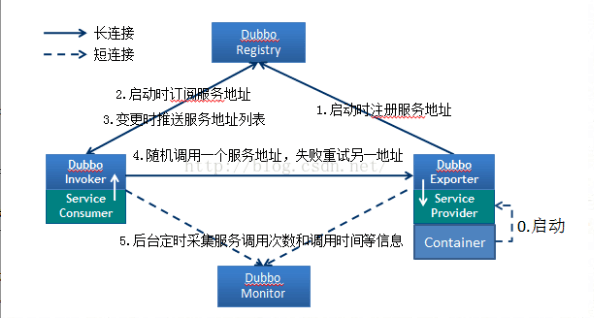

### Dubbo框架的产生背景
大规模服务化之前，应用只是通过RMI或Hessian等工具，简单的暴露和引用远程服务，通过配置服务的URL地址进行调用，通过F5等硬件进行负载均衡。

1. 当服务越来越多，服务的URL配置管理变得非常困难，F5硬件负载均衡器的单点压力也越来越大；此时需要一个服务注册中心，动态的注册和发现服务，使服务的位置透明。并通过在消费方，获取服务提供方地址列表，从而实现软负载均衡和Failover，来降低对F5硬件负载均衡器的依赖，也能减少部分成本。

2. 当进一步发展，服务间依赖关系变得错踪复杂，甚至分不清哪个应用要在哪个应用之前启动，架构师都不能完整的描述应用的架构关系。这时，需要自动画出应用间的依赖关系图，以帮助架构师理清理关系。
3. 接着，服务的调用量越来越大，服务的容量问题就暴露出来，这个服务需要多少机器支撑？什么时候该加机器？为了解决这些问题，第一步，要将服务现在每天的调用量，响应时间，都统计出来，作为容量规划的参考指标。其次，要可以动态调整权重，在线上，将某台机器的权重一直加大，并在加大的过程中记录响应时间的变化，直到响应时间到达阀值，记录此时的访问量，再以此访问量乘以机器数反推总容量。

## Dubbo基本原理
dubbo的实现原理

节点角色说明：

* Provider: 暴露服务的服务提供方。
* Consumer: 调用远程服务的服务消费方。
* Registry: 服务注册与发现的注册中心。
* Monitor: 统计服务的调用次调和调用时间的监控中心。
* Container: 服务运行容器。

调用关系说明：

0. (start)服务容器负责启动，加载，运行服务提供者。
1. (register)服务提供者在启动时，向注册中心注册自己提供的服务。
2. (subscribe)服务消费者在启动时，向注册中心订阅自己所需的服务。
3. (notify)注册中心返回服务提供者地址列表给消费者，如果有变更，注册中心将基于长连接推送变更数据给消费者。
4. (invoke) 服务消费者，从提供者地址列表中，基于软负载均衡算法，选一台提供者进行调用，如果调用失败，再选另一台调用。
5. (count)服务消费者和提供者，在内存中累计调用次数和调用时间，定时每分钟发送一次统计数据到监控中心。

Doubbo 特性：
1. 连通性： 
* 注册中心负责服务地址的注册与查找，相当于目录服务，服务提供者和消费者只在启动时与注册中心交互，注册中心不转发请求，压力较小；
* 监控中心负责统计各服务调用次数，调用时间等，统计先在内存汇总后每分钟一次发送到监控中心服务器，并以报表展示；
* 服务提供者向注册中心注册其提供的服务，并汇报调用时间到监控中心，此时间不包含网络开销；
* 服务消费者向注册中心获取服务提供者地址列表，并根据负载算法直接调用提供者，同时汇报调用时间到监控中心，此时间包含网络开销； 
* 注册中心，服务提供者，服务消费者三者之间均为长连接，监控中心除外； 
注册中心通过长连接感知服务提供者的存在，服务提供者宕机，注册中心将立即推送事件通知消费者；
* 注册中心和监控中心全部宕机，不影响已运行的提供者和消费者，消费者在本地缓存了提供者列表； 
* 注册中心和监控中心都是可选的，服务消费者可以直连服务提供者；

2. 健壮性：
* 监控中心宕掉不影响使用，只是丢失部分采样数据；
* 数据库宕掉后，注册中心仍能通过缓存提供服务列表查询，但不能注册新服务； 
* 注册中心对等集群，任意一台宕掉后，将自动切换到另一台；
* 注册中心全部宕掉后，服务提供者和服务消费者仍能通过本地缓存通讯；
* 服务提供者无状态，任意一台宕掉后，不影响使用 ；
* 服务提供者全部宕掉后，服务消费者应用将无法使用，并无限次重连等待服务提供者恢复；

3. 伸缩性： 
* 注册中心为对等集群，可动态增加机器部署实例，所有客户端将自动发现新的注册中心；
* 服务提供者无状态，可动态增加机器部署实例，注册中心将推送新的服务提供者信息给消费者；

4. 升级性： 
* 当服务集群规模进一步扩大，带动IT治理结构进一步升级，需要实现动态部署，进行流动计算，现有分布式服务架构不会带来阻力。
总结：综上所述，可以得知注册中心是dubbo的核心；

* 服务提供者将服务器的地址列表提供给注册中心，服务消费者去注册中心订阅需要的地址列表，从而实现了服务地址透明；

* 当服务提供的集群有部分机器宕机时，注册中心能够及时感知，并且通知给服务消费者，从而实现动态获取服务地址，平滑增减服务器；

* 服务消费者可以通过注册中心提供的服务地址列表，根据软负载均衡算法来实现服务器端的负载均衡，替代昂贵的F5硬负载；

* dubbo可以让我们的分布式环境变得更加坚挺，当部分机器宕机时，尽可能的降低对服务的影响，增强服务的抗击打能力；