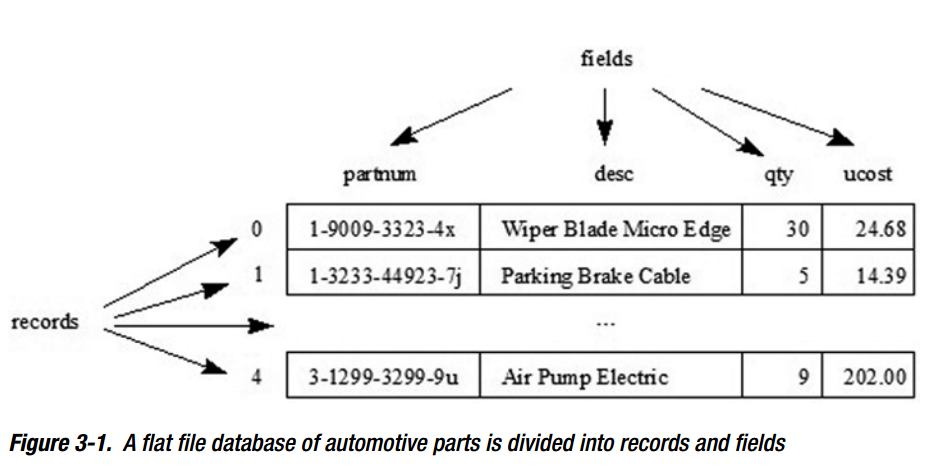
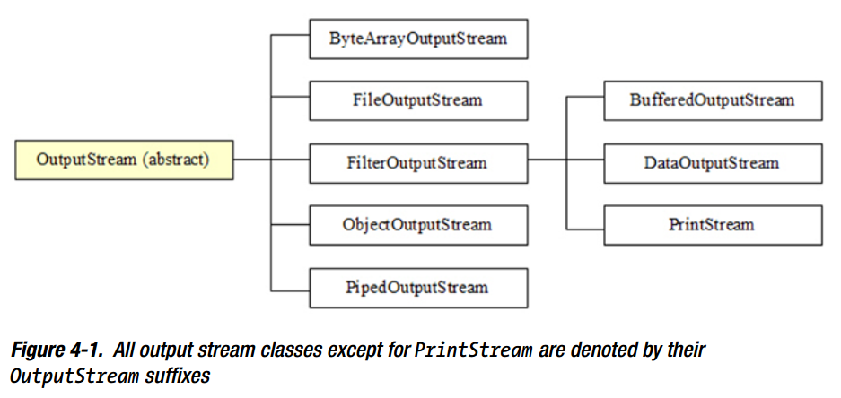
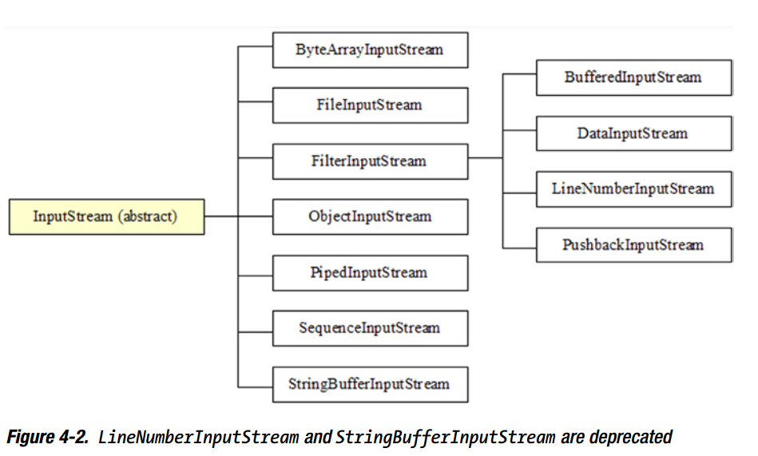

## Java IO

1. File

    * 构造方法

        方法|说明
        --|--
        File(String pathname)|通过路径创建文件实例
        File(String parent, String child)|通过父路径和子路径创建文件实例
        File(File parent,String child)|通过一个父文件路径名和子路径创建文件实例

    * 存储的抽象路径

        ```java
        File file = new File("..\\src\\test1.txt");
        ```

        以上面的代码为例，解析下面的方法
        方法|说明
        --|--
        String path()|得到的是构造file的时候的路径，输出为  *..\src\test1.txt*
        String getAbsolutePath()|得到的是全路径</br>如果构造的时候就是全路径那直接返回全路径</br>如果构造的时候试相对路径，返回当前目录的路径+构造file时候的路径</br>输出为 *D:\Workspaces\git-base\..\src\test1.txt*
        String getCanonicalPath()|CanonicalPath不但是全路径，而且把..或者.这样的符号解析出来</br>输出为  *D:\Workspaces\src\test1.txt*
        boolean isAbsolute()|判断抽象路径是否是绝对的

    * 列举系统根目录

        ```java
        import java.io.File;

        public class DumpRoots {
            public static void main(String[] args) {
                File[] roots = File.listRoots();
                for (File root  : roots)
                    System.out.println(root);
            }
        }
        ```

    * 系统磁盘空间

        方法|说明
        --|--
        long getFreeSpace() |返回此抽象路径名所命名的分区中未分配的字节数，如果抽象路径不命名分区则返回0
        long getTotalSpace() |返回此抽象路径名所命名的分区中总的字节数，如果抽象路径不命名分区则返回0
        long getUsableSpace() |返回此抽象路径名所命名的分区中可用于当前JVM的字节数

        ```java
        import java.io.File;

        public class PartitionSpace {
            public static void main(String[] args) {
                File[] roots = File.listRoots();
                for (File root  : roots) {
                    System.out.println("Partition : " + root);
                    System.out.println("Free space on this partition = " + root.getFreeSpace());
                    System.out.println("Usable space on this partition = " + root.getUsableSpace());
                    System.out.println("Total space on this partition = " + root.getTotalSpace());
                    System.out.println("***");
                }
            }
        }
        ```

    * 列举目录

        **对于一个File实例，如果这个实例是个路径，则可以获取路径下的文件和目录**

        方法|说明
        --|--
        String[] list()|返回目录下所有文件路径名数组
        String[] list(FilenameFilter filter)|返回目录下满足文件命名过滤器的所有文件路径名数组
        File[] listFiles()|返回目录下所有文件数组
        File[] list(FileFilter filter)|返回目录下满足文件过滤器的所有文件数组
        File[] list(FilenameFilter filter)|返回目录下满足文件命名过滤器的所有文件数组

        ```java
        import java.io.File;
        import java.io.FilenameFilter;

        public class Dir {
            public static void main(String[] args) {
                File file = new File("C:");
                FilenameFilter fnf = new FilenameFilter() {
                    public boolean accept(File dir, String name) {
                        return name.endsWith(".log");
                    }
                };
                String[] names = file.list(fnf);
                for (String name  : names)
                    System.out.println(name);
            }
        }
        ```

    * 创建/修改 文件与目录

        **得到一个File实例，通过这个实例既可以创建文件也可以创建目录。**

        方法|说明
        --|--
        boolean createNewFile()|通过抽象的路径来生成文件
        static File createTempFile(String prefix, String suffix)|通过抽象的路径来生成默认的临时文件
        boolean delete()|通过抽象的路径删除文件或目录
        boolean mkdir()|通过抽象的路径来生成目录，成功返回true，否则返回false，这个方法只会一步到位，比如系统有路径 *C:\\*，要创建 **C:\\a.txt** 能成功，**C:\\abc\\a.txt**则不能成功
        boolean mkdirs()|只要抽象的路径不存在，则会一级级的创建，成功返回true，否则返回false

    * 文件权限

        文件自带一些自身的权限：可执行，可读，可写

        方法|说明
        --|--
        boolean setExecutable(boolean executable, boolean ownerOnly) |设置是否可执行，该权限是对于文件所有者还是所有人
        boolean setReadable(boolean executable, boolean ownerOnly) |设置是否可读，该权限是对于文件所有者还是所有人
        boolean setWritable(boolean executable, boolean ownerOnly) |设置是否可写，该权限是对于文件所有者还是所有人

2. RandomAccessFile

    Java通过提供一个类java.io.RandomAccessFileclass来支持随机存储

    * 构造器

        方法|说明
        --|--
        RandomAccessFile(File file, String mode)|创建或打开一个新文件，是创建还是打开新的文件取决于mode
        RandomAccessFile(String path, String mode)|创建或打开一个新文件，是创建还是打开新的文件取决于mode

        两个方法中，mode参数只能是"r", "rw","rws"或"rwd"，否则抛出java.lang.IllegalArgumentException。

        * r  : 打开一个存在的文件，并且只读。
        * rw  : 文件存在则提供读写，不存在则创建新文件再提供读写。
        * rwd  : 文件存在则提供读写，不存在则创建新文件再提供读写，并且每个对文件内容的更新操作都会异步的写入到底层设备
        * rwd  : 文件存在则提供读写，不存在则创建新文件再提供读写，并且每个对文件内容或文件元数据的更新操作都会异步的写入到底层设备

    * RandomAccessFile方法

        方法|说明
        --|--
        void close()|关闭文件并释放任何所关联的操作系统资源
        FileDescriptor getFD()|返回文件所关联的descriptor对象
        long getFilePointer()|返回文件指针的当前基于零的文件内字节偏移量
        long length()|返回文件长度(按字节计算)
        int read()|从文件读取并返回下一个字节(从0-255)或到达文件底部返回-1
        int read(byte[] b)|从用文件中读取b长度的字节数据到b数组中
        char readChar()|从文件读取并返回一个字符，相当于读取两个字节，依次为b1，b2，读出来的结果等价于(char) ((b1<< 8) | b2)
        int readInt|从文件读取并返回一个32位的整数，相当于读取四个字节，依次为b1，b2，b3，b4，读出来的结果等价于(b1 << 24) | (b2 << 16) | (b3 << 8) | b4
        void seek(long pos)|设置文件指针当前位移到pos的位置
        void setLength(long newLength)|设置文件长度，如果length()比newLength大，则清空，如果getFilePointer比newLength大，则setLength返回后offset设置为newLength，如果length()比newLength小，则文件被扩展。
        int skipBytes(int n)|尝试跳过n个字节，传递负数不起任何作用。
        void write(byte[] b)|从字节数组b写入b长度字节数据到写入文件的当前文件指针开始位置
        void write(int b)|将b的低8位作为32位整数写入文件的当前文件指针位置
        void writeChars(String s)|将字符串s作为字符序列写入文件的当前文件指针开始位置
        void writeInt(int i)|将32位整数i写入文件的当前文件指针位置

        ```java
        import java.io.FileDescriptor;
        import java.io.IOException;
        import java.io.RandomAccessFile;

        public class RandomAccessFileDemo {
            public static void main(String[] args) throws IOException {
                RandomAccessFile raf = new RandomAccessFile("employee.dat", "rw");
                FileDescriptor fd = raf.getFD();
                String str = "abcd我们好";
                // Perform a critical write operation.
                raf.write(str.getBytes());
                // Synchronize with the underlying disk by flushing the operating system
                // output buffers to the disk.
                fd.sync();
                // Perform a non-critical write operation where synchronization isn't
                // necessary.
                raf.write(str.getBytes());
                // Do other work.
                // Close the file, emptying output buffers to the disk.
                raf.close();
            }
        }
        ```

    * RandomAccessFile应用

        RandomAccessFile对于创建平面文件数据库、单个文件非常有用。组织成记录和字段，如图

        

        PartsDB对象

        ```java
        import java.io.IOException;
        import java.io.RandomAccessFile;

        public class PartsDB {
            public final static int PARTNUM_LEN = 20;
            public final static int DESC_LEN = 30;
            public final static int QUAN_LEN = 4;
            public final static int COST_LEN = 4;
            private final static int REC_LEN = 2 * PARTNUM_LEN + 2 * DESC_LEN + QUAN_LEN + COST_LEN;
            private RandomAccessFile raf;

            public PartsDB(String path) throws IOException {
                raf = new RandomAccessFile(path, "rw");
            }

            public void append(String partnum, String partdesc, int qty, int ucost) throws IOException {
                raf.seek(raf.length());
                write(partnum, partdesc, qty, ucost);
            }

            public void close() {
                try {
                    raf.close();
                } catch (IOException ioe) {
                    System.err.println(ioe);
                }
            }

            public int numRecs() throws IOException {
                return (int) raf.length() / REC_LEN;
            }

            public Part select(int recno) throws IOException {
                if (recno < 0 || recno >= numRecs())
                    throw new IllegalArgumentException(recno + " out of range");
                raf.seek(recno * REC_LEN);
                return read();
            }

            public void update(int recno, String partnum, String partdesc, int qty, int ucost) throws IOException {
                if (recno < 0 || recno >= numRecs())
                    throw new IllegalArgumentException(recno + " out of range");
                raf.seek(recno * REC_LEN);
                write(partnum, partdesc, qty, ucost);
            }

            private Part read() throws IOException {
                StringBuffer sb = new StringBuffer();
                for (int i = 0; i < PARTNUM_LEN; i++)
                    sb.append(raf.readChar());
                String partnum = sb.toString().trim();
                sb.setLength(0);
                for (int i = 0; i < DESC_LEN; i++)
                    sb.append(raf.readChar());
                String partdesc = sb.toString().trim();
                int qty = raf.readInt();
                int ucost = raf.readInt();
                return new Part(partnum, partdesc, qty, ucost);
            }

            private void write(String partnum, String partdesc, int qty, int ucost) throws IOException {
                StringBuffer sb = new StringBuffer(partnum);
                if (sb.length() > PARTNUM_LEN)
                    sb.setLength(PARTNUM_LEN);
                else if (sb.length() < PARTNUM_LEN) {
                    int len = PARTNUM_LEN - sb.length();
                    for (int i = 0; i < len; i++)
                        sb.append(" ");
                }
                raf.writeChars(sb.toString());
                sb = new StringBuffer(partdesc);
                if (sb.length() > DESC_LEN)
                    sb.setLength(DESC_LEN);
                else if (sb.length() < DESC_LEN) {
                    int len = DESC_LEN - sb.length();
                    for (int i = 0; i < len; i++)
                        sb.append(" ");
                }
                raf.writeChars(sb.toString());
                raf.writeInt(qty);
                raf.writeInt(ucost);
            }

            public static class Part {
                private String partnum;
                private String desc;
                private int qty;
                private int ucost;

                public Part(String partnum, String desc, int qty, int ucost) {
                    this.partnum = partnum;
                    this.desc = desc;
                    this.qty = qty;
                    this.ucost = ucost;
                }

                String getDesc() {
                    return desc;
                }

                String getPartnum() {
                    return partnum;
                }

                int getQty() {
                    return qty;
                }

                int getUnitCost() {
                    return ucost;
                }
            }
        }
        ```

        PartsDB对象及使用

        ```java
        import java.io.IOException;

        public class UsePartsDB {
            public static void main(String[] args) {
                PartsDB pdb = null;
                try {
                    pdb = new PartsDB("parts.db");
                    if (pdb.numRecs() == 0) {
                        // Populate the database with records.
                        pdb.append("1-9009-3323-4x", "Wiper Blade Micro Edge", 30, 2468);
                        pdb.append("1-3233-44923-7j", "Parking Brake Cable", 5, 1439);
                        pdb.append("2-3399-6693-2m", "Halogen Bulb H4 55/60W", 22, 813);
                        pdb.append("2-599-2029-6k", "Turbo Oil Line O-Ring ", 26, 155);
                        pdb.append("3-1299-3299-9u", "Air Pump Electric", 9, 20200);
                    }
                    dumpRecords(pdb);
                    pdb.update(1, "1-3233-44923-7j", "Parking Brake Cable", 5, 1995);
                    dumpRecords(pdb);
                } catch (IOException ioe) {
                    System.err.println(ioe);
                } finally {
                    if (pdb != null)
                        pdb.close();
                }
            }

            static void dumpRecords(PartsDB pdb) throws IOException {
                for (int i = 0; i < pdb.numRecs(); i++) {
                    PartsDB.Part part = pdb.select(i);
                    System.out.print(format(part.getPartnum(), PartsDB.PARTNUM_LEN, true));
                    System.out.print(" | ");
                    System.out.print(format(part.getDesc(), PartsDB.DESC_LEN, true));
                    System.out.print(" | ");
                    System.out.print(format("" + part.getQty(), 10, false));
                    System.out.print(" | ");
                    String s = part.getUnitCost() / 100 + "." + part.getUnitCost() % 100;
                    if (s.charAt(s.length() - 2) == '.')
                        s += "0";
                    System.out.println(format(s, 10, false));
                }
                System.out.println("Number of records = " + pdb.numRecs());
                System.out.println();
            }

            static String format(String value, int maxWidth, boolean leftAlign) {
                StringBuffer sb = new StringBuffer();
                int len = value.length();
                if (len > maxWidth) {
                    len = maxWidth;
                    value = value.substring(0, len);
                }
                if (leftAlign) {
                    sb.append(value);
                    for (int i = 0; i < maxWidth - len; i++)
                        sb.append(" ");
                } else {
                    for (int i = 0; i < maxWidth - len; i++)
                        sb.append(" ");
                    sb.append(value);
                }
                return sb.toString();
            }
        }
        ```

3. Streams

    伴随java.io.File and java.io.RandomAccessFile，Java的经典I/Oj基础还提供了流来执行I/O操作。
    一个流是一个任意长度的有序字节序列。

    * 流类的概览

        java.io包体统了几种输出流和输入流，如图

        

        

        除此之外，java包还提供了额外的输出输入流，比如java.util.zip包

        * CheckedOutputStream
        * CheckedInputStream
        * DeflaterOutputStream
        * DeflaterInputStream
        * GZIPOutputStream
        * GZIPInputStream
        * InflaterOutputStream
        * InflaterInputStream
        * ZipOutputStream
        * ZipInputStream

        又比如java.util.jar包

        * JarOutputStream
        * JarInputStream

    * OutputStream和InputStream

        Java提供OutputStream和InputStream来描述执行流 I/O

        *OutputStream的方法*
        方法|说明
        --|--
        void close|关闭输出流并释放任何与这个流关联的操作系统资源
        void flush()|通过写入任何已经缓存的字节到目的地来刷新此输出流
        void write(byte[] b)|从b数组写入b长度的字节数据到这个输出流
        void write(byte[] b,int off,int len)|从b数组写入len长度的字节数据到这个输出流在off的位置
        void write(int b)|往这个输出流写入字节b，只有低8位会被写入，高32位被忽略

        *InputStream的方法*
        方法|说明
        --|--
        int available()|通过下一次的read()方法，返回一个能被这个输入流读取的估算值。
        void close()|关闭输入流并释放任何与这个流关联的操作系统资源
        void mark(int readlimit)|标记这个输入流的当前位置
        boolean markSupported()|如果这个输入流支持mark()或reset()方法则返回true，否则返回false
        int read()|从这输入流读取并返回下一个字节,该值是一个0-255整数，如果到达留的底部，返回-1
        int read(byte[] b)|从输入流读取一些数据并存储到字节数组b中
        int read(byte[] b,int off,int len)|从输入流读取不超过n长度的数据并存储到字节数组b中off的位置
        void reset()|重置输入流的指针到上次调用mark()的位置。
        long skip(long n)|从这个输入流中跳过并丢弃n个字节的数据

    * ByteArrayOutputStream和ByteArrayInputStream

        * ByteArrayOutputStream

            对象内置属性
            * byte buf[] : 存储数据的buf
            * int count : 在buf中有效的字节数

            方法|说明
            --|--
            ByteArrayOutputStream()|创建一个输出流对象，默认初始化32个字节的buf
            ByteArrayOutputStream(int size)|创建一个输出流对象，初始化size个字节的buf

            ByteArrayInputStream方法对象内置属性
            * byte buf[] : 存储数据的buf
            * int count : 在buf中有效的字节数

        * ByteArrayInputStream

            对象内置属性
            * byte buf[] : 存储数据的buf
            * int pos : 要从输入流buf读取的下一个字符的索引
            * int mark : 流当前标记的位置
            * int count : 大于输入流buf中最后一个有效字符的索引

            方法|说明
            --|--
            ByteArrayInputStream(byte[] buf)|创建一个输入流对象，直接使用buf作为buf，并设置pos为0，count为buf的长度
            ByteArrayInputStream(byte[] buf, int offset, int count)|创建一个输入流对象，直接使用buf作为buf，pos设置为offset，count为min(offset+length,buf.length)，mark为offset。

            ByteArrayOutputStream和ByteArrayInputStream对于处理图片转换很有用，可以先读取图片到字节数组，然后处理该数组，最后写回到图片。

    * FileOutputStream和FileInputStream

        *FileOutputStream的方法*
        方法|说明
        --|--
        FileOutputStream(String name)|创建一个文件输出流来写入到指定名字的文件，且创建一个新的FileDescriptor对象来表示这个file的连接，如果是一个目录而不是一个文件，则不创建也不能打开，并且抛出异常
        FileOutputStream(File file)|创建一个文件输出流来写入到指定File实例，且创建一个新的FileDescriptor对象来表示这个file的连接，如果是一个目录而不是一个文件，则不创建也不能打开，并且抛出异常

        *FileInputStream的方法*
        方法|说明
        --|--
        FileInputStream(String name)|通过打开一个实际文件连接来创建一个文件输入流，且创建一个新的FileDescriptor对象来表示这个file的连接
        FileInputStream(File file)|通过打开一个实际文件连接来创建一个文件输入流，该文件由文件系统中的Fileobject文件命名，且创建一个新的FileDescriptor对象来表示这个file的连接

        ```java
        import java.io.FileInputStream;
        import java.io.FileNotFoundException;
        import java.io.FileOutputStream;
        import java.io.IOException;

        public class Copy {
            public static void main(String[] args) {

                String src = "a.txt";
                String desc = "b.txt";
                FileInputStream fis = null;
                FileOutputStream fos = null;
                try {
                    fis = new FileInputStream(src);
                    fos = new FileOutputStream(desc);
                    int b; // I chose b instead of byte because byte is a reserved
                    // word.
                    while ((b = fis.read()) != -1)
                        fos.write(b);
                } catch (FileNotFoundException fnfe) {
                    System.err.println(
                            args[0] + " could not be opened for input, or " + args[1] + " could not be created for output");
                } catch (IOException ioe) {
                    System.err.println("I/O error: " + ioe.getMessage());
                } finally {
                    if (fis != null)
                        try {
                            fis.close();
                        } catch (IOException ioe) {
                            assert false; // shouldn't happen in this context
                        }
                    if (fos != null)
                        try {
                            fos.close();
                        } catch (IOException ioe) {
                            assert false; // shouldn't happen in this context
                        }
                }
            }
        }
        ```

    * PipedOutputStream和PipedInputStream

        线程间经常通讯，一种方法涉及使用共享变量，另一种方法是使用管道流，通过使用PipedOutputStream和PipedInputStream这两个类。PipedOutputStream让**发送线程**写字节数组流数据到**接收线程**的PipedInputStream实例。

        *PipedOutputStream的方法*
        方法|说明
        --|--
        PipedOutputStream()|创建一个管道输出流，但还没连接到管道输入流，使用前必须连接到一个管道输入流
        PipedOutputStream(PipedInputStream dest)|创建一个管道输出流，且已经连接到管道输入流

        *PipedInputStream的方法*
        方法|说明
        --|--
        PipedInputStream()|创建一个管道输入流，但还没连接到管道输出流，使用前必须连接到一个管道输入流
        PipedOutputStream(PipedOutputStream src)|创建一个管道输出流，且已经连接到管道输出流
        PipedInputStream(int pipeSize)|创建一个管道输入流，但还没连接到管道输出流，使用pipeSize来设定输入流buffer的大小，使用前必须连接到一个管道输入流

        ```java 
        import java.io.IOException;
        import java.io.PipedInputStream;
        import java.io.PipedOutputStream;

        public class PipedStreamsDemo {
            final static int LIMIT = 10;

            public static void main(String[] args) throws IOException {
                final PipedOutputStream pos = new PipedOutputStream();
                final PipedInputStream pis = new PipedInputStream(pos);
                Runnable senderTask = new Runnable() {
                    public void run() {
                        try{
                            for (int i = 0; i < LIMIT; i++) {
                                pos.write((byte)(Math.random()*256));
                            }
                        }catch(IOException e){
                            e.printStackTrace();
                        }finally {
                            try{
                                pos.close();
                            }catch(IOException e){
                                e.printStackTrace();
                            }
                        }
                    }
                };
                Runnable receiveTask = new Runnable() {
                    public void run() {
                        try{
                            int b;
                            while ((b = pis.read()) != -1) {
                                System.out.println(b);
                            }
                        }catch(IOException e){
                            e.printStackTrace();
                        }finally {
                            try{
                                pis.close();
                            }catch(IOException e){
                                e.printStackTrace();
                            }
                        }
                    }
                };

                Thread sender = new Thread(senderTask);
                Thread receiver = new Thread(receiveTask);
                sender.start();
                receiver.start();
            }
        }
        ```

    * FilterOutputStream和FilterInputStream

        前面所说的byteArray，file以及piped流都是原封不动的传递字节数据到目的地。
        Java还支持过滤缓冲区流，压缩/解压，解密/解密，或者在到达目的地之前处理一个流的字节序列。

        * FilterOutputStream

            一个过滤输出流把数据传递给write()方法，过滤它，把过滤后的数据写入到潜在的输出流，也许是另一个输出流或目的输出流

            由于FilterOutputStream继承OutputStream，且内置了一个属性OutputStream out，该类所实现的方法大多直接调用out的方法。

            方法|说明
            --|--
            FilterOutputStream(OutputStream out)|构造一个输出流过滤器，并设置out属性

        * FilterOutputStream

            过滤器输入流从其底层输入获取数据流——可能是另一个过滤器输入流或源输入流。

            与FilterOutputStream相似，FilterInputStream继承InputStream，且内置了一个属性InputStream in，该类所实现的方法大多直接调用in的方法

            方法|说明
            --|--
            FilterOutputStream(InputStream in)|构造一个输出流过滤器，并设置in属性

    * BufferedOutputStream和BufferedInputStream

        FileOutputStream和FileInputStream存在着性能问题，每个文件输出流write()方法调用和文件输入流read()都会使用native方法，该方法会调用底层操作系统的函数，这些native方法降低I/O。

        具体的BufferedOutputStream和bufferdinputstream**过滤器流**类通过最小化底层输出流write()方法和输入流read()方法来提高性能，另外，BufferedOutputStream的write()方法和BufferedInputStream的read()
        方法考虑Java缓冲区：

        * 当一个写缓冲区满了，write方法会调用底层输出流write()方法来清空缓冲区，如此后续可以继续调用write方法直到再一次被写满。
        * 当一个读缓冲区空了，read方法会调用底层输出流read()方法来填充缓冲区，如此后续可以继续调用read方法直到再一次空了。

        **BufferedOutputStream继承于FilterOutputStream，而BufferedInputStream继承于FilterInputStream**

        *BufferedOutputStream方法*
        方法|说明
        --|--
        BufferedOutputStream(OutputStream out)|创建一个缓存输出流，并设置内置out
        BufferedOutputStream(OutputStream out, int size)|创建一个缓存输出流，并设置内置out，初始化内置的buf，字节大小为size

        *BufferedInputStream方法*
        方法|说明
        --|--
        BufferedInputStream(InputStream in)|创建一个缓存输入流，并设置内置in
        BufferedInputStream(InputStream in, int size)|创建一个缓存输入流，并设置内置in，初始化内置的buf，字节大小为size

    * DataOutputStream和DataInputStream

        FileOutputStream和FileInputStream主要用于读写字节或字节数组，却没提供读写原始类型，比如integers和strings。

        因此，Java提供了具体的DataOutputStream和DataInputStream**过滤器流**类，每个类都通过提供以与操作系统无关的方式编写或读取基元类型值和字符串的方法来克服这种限制

        * 整数值以大端格式读写
        * 浮点值和双精度浮点值根据IEEE 754标准进行读写，该标准为每个浮点值指定4个字节，每个双精度浮点值指定8个字节。
        * 字符串是根据UTF-8的修改版本编写和读取的，UTF-8是一种可变长度编码，有效存储双字节Unicode字符的标准。

        ```java
        import java.io.DataInputStream;
        import java.io.DataOutputStream;
        import java.io.FileInputStream;
        import java.io.FileOutputStream;
        import java.io.IOException;

        public class DataStreamsDemo {
            final static String FILENAME = "values.dat";

            public static void main(String[] args) {
                try {
                    FileOutputStream fos = new FileOutputStream(FILENAME);
                    DataOutputStream dos = new DataOutputStream(fos);
                    dos.writeInt(1995);
                    dos.writeUTF("Saving this String in modified UTF-8 format!");
                    dos.writeFloat(1.0F);
                } catch (IOException ioe) {
                    System.err.println("I/O error: " + ioe.getMessage());
                }
                try {
                    FileInputStream fis = new FileInputStream(FILENAME);
                    DataInputStream dis = new DataInputStream(fis);

                    System.out.println(dis.readInt());
                    System.out.println(dis.readUTF());
                    System.out.println(dis.readFloat());
                } catch (IOException ioe) {
                    System.err.println("I/O error: " + ioe.getMessage());
                }
            }
        }
        ```

    * 对象序列化和反序列化

        

4. Writers and Readers

原文：book/Java I-O, NIO and NIO.2.pdf