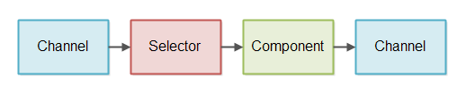
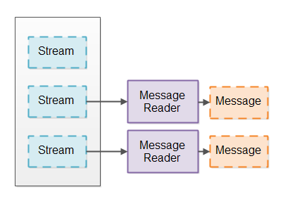
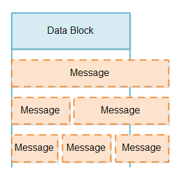
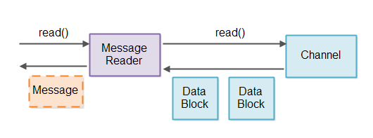

## 非阻塞IO服务器

即使您了解Java NIO非阻塞特性(选择器、通道、缓冲区等)是如何工作的，设计非阻塞服务器仍然很困难。与阻塞IO相比，非阻塞IO包含几个挑战。本非阻塞服务器教程将讨论非阻塞服务器的主要挑战，并描述一些可能的解决方案。

找到关于设计非阻塞服务器的良好信息是困难的。因此，本教程提供的解决方案是基于我自己的工作和想法。如果你有其他选择或者更好的主意，我很乐意听到!你可以在文章下面写一条评论，或者给我发一封电子邮件(见我们的About页面)，或者在Twitter上找到我。

本教程中描述的思想是围绕Java NIO设计的。但是，我相信这些思想可以在其他语言中重用，只要它们具有某种类似于选择器的构造。据我所知，这些结构是由底层OS提供的，所以很有可能您也可以用其他语言访问它。

1. 非阻塞服务器- GitHub存储库

    我已经创建了本教程中介绍的概念的简单证明，并将其放在GitHub存储库中供您查看。以下是GitHub库:

    https://github.com/jjenkov/java-nio-server

2. 非阻塞IO管道

    非阻塞IO管道是处理非阻塞IO的组件链。这包括以非阻塞方式读取和写入IO。下面是一个简化的非阻塞IO管道的例子:

    

    组件使用选择器检查通道何时有数据要读取。然后组件读取输入数据并根据输入生成一些输出。再次将输出写入通道。

    非阻塞IO管道不需要都读写数据。有些管道可能只读取数据，有些管道可能只写入数据。

    上面的图表只显示了一个组件。非阻塞IO管道可能有多个组件处理传入数据。非阻塞IO管道的长度取决于管道需要做什么。

    非阻塞IO管道也可以同时从多个通道读取数据。例如，从多个套接字通道读取数据。

    上图中的控制流程也得到了简化。它是启动通过选择器从通道读取数据的组件。并不是通道将数据推入选择器，然后从选择器推入组件，即使这是上面的图表所建议的。

3. 非阻塞与阻塞IO管道

    非阻塞IO管道和阻塞IO管道之间最大的区别是如何从底层通道(套接字或文件)读取数据。

    IO管道通常从某些流(从套接字或文件)读取数据，并将数据拆分为一致的消息。这类似于将数据流分解为令牌，以便使用令牌器进行解析。相反，您将数据流分解为更大的消息。我将为消息读取器调用组件将流分解为消息。下面是一个消息阅读器将消息流分解为消息的例子:

    

    阻塞IO管道可以使用一个类似inputstream的接口，在这个接口中，每次可以从底层通道读取一个字节，而类似inputstream的接口会阻塞该接口，直到有数据可以读取为止。这将导致阻塞消息读取器实现。

    对流使用阻塞IO接口大大简化了消息阅读器的实现。阻塞消息阅读器永远不必处理没有从流中读取数据的情况，或者只从流中读取部分消息并需要稍后恢复消息解析的情况。

    类似地，阻塞消息编写器(向流编写消息的组件)永远不必处理只编写了消息的一部分以及稍后必须恢复消息编写的情况。

    * 阻塞IO管道缺点

        虽然阻塞消息读取器更容易实现，但它有一个不幸的缺点，即需要为需要分割为消息的每个流分配一个单独的线程。之所以需要这样做，是因为每个流块的IO接口直到有一些数据可以从中读取为止。这意味着单个线程不能尝试从一个流读取数据，如果没有数据，则从另一个流读取。只要线程试图从流中读取数据，线程就会阻塞，直到实际有一些数据需要读取。

        如果IO管道是服务器的一部分，服务器必须处理许多并发连接，那么服务器将需要每个活动输入连接一个线程。如果服务器在任何时候只有几百个并发连接，这可能不是问题。但是，如果服务器有数百万个并发连接，这种设计就不能很好地扩展。每个线程的堆栈将占用320K(32位JVM)和1024K(64位JVM)之间的内存。因此，1.000.000个线程将占用1 TB内存!这是在服务器使用任何内存来处理传入消息之前(例如，为消息处理期间使用的对象分配内存)。

        为了减少线程数量，许多服务器使用这样的设计:服务器保存一个线程池(例如100)，每次从入站连接读取一条消息。入站连接保存在队列中，线程按照入站连接放入队列的顺序处理来自每个入站连接的消息。本设计如下图所示:

        

        然而，这种设计要求入站连接合理地频繁地发送数据。如果入站连接可能处于非活动状态的时间更长，那么大量非活动连接实际上可能阻塞线程池中的所有线程。这意味着服务器响应变慢，甚至没有响应。

        一些服务器设计试图通过在线程池中的线程数量上增加一些弹性来缓解这个问题。例如，如果线程池耗尽线程，线程池可能启动更多的线程来处理负载。这种解决方案意味着需要更多的慢速连接才能使服务器停止响应。但是请记住，您可以运行多少线程仍然有一个上限。因此，对于1.000.000个慢速连接，这将不能很好地扩展。

4. 基本的非阻塞IO管道设计

    非阻塞IO管道可以使用一个线程从多个流读取消息。这要求流可以切换到非阻塞模式。在非阻塞模式下，当您试图从流中读取数据时，流可能返回0或更多字节。如果流没有要读取的数据，则返回0字节。当流实际上有一些数据要读取时，返回1+字节。

    为了避免检查需要读取0字节的流，我们使用Java NIO选择器。可以使用选择器注册一个或多个SelectableChannel实例。当您在选择器上调用select()或selectNow()时，它只给您一个SelectableChannel实例，该实例实际上具有要读取的数据。本设计如下图所示:

    

5. 阅读部分的信息

    当我们从SelectableChannel读取数据块时，我们不知道该数据块包含的消息是少还是多。数据块可能包含部分消息(少于消息)、完整消息或多于消息，例如1.5或2.5 messsages。各种部分信息的可能性说明如下:

    

    处理部分信息有两个挑战:

    1. 检测数据块中是否有完整的消息。
    2. 如何处理部分消息，直到消息的其余部分到达。

    检测完整的消息需要消息阅读器查看数据块中的数据，以查看数据是否包含至少一条完整的消息。如果数据块包含一个或多个完整的消息，则可以通过管道发送这些消息进行处理。寻找完整消息的过程会重复很多次，因此这个过程必须尽可能快。

    当数据块中有部分消息时，无论是单独的还是在一个或多个完整消息之后，都需要存储该部分消息，直到该消息的其余部分从通道到达为止。

    检测完整消息和存储部分消息都是消息阅读器的职责。为了避免混合来自不同通道实例的消息数据，我们将每个通道使用一个消息阅读器。设计是这样的:

    

    在检索到要从选择器读取数据的通道实例之后，与该通道关联的消息读取器将读取数据并尝试将其分解为消息。如果这导致读取任何完整的消息，则可以将这些消息通过读取管道传递到需要处理它们的任何组件。

    消息阅读器当然是特定于协议的。消息阅读器需要知道它要读取的消息的消息格式。如果我们的服务器实现要跨协议重用，它需要能够插入消息阅读器实现——可能通过以某种方式接受消息阅读器工厂作为配置参数。

6. 存储部分信息

    既然我们已经确定了在接收到完整消息之前存储部分消息是消息阅读器的职责，那么我们需要弄清楚应该如何实现该部分消息存储。

    我们需要考虑两个设计因素:
    
    1. 我们希望尽可能少地复制消息数据。复制越多，性能越低。
    2. 我们希望完整的消息以连续的字节序列存储，以便更容易地解析消息。

    * 消息读取器内置Buffer

        显然，部分消息需要存储在某种缓冲区中。简单的实现方法是在每个消息阅读器内部有一个缓冲区。然而，这个缓冲区应该有多大?它需要足够大，甚至能够存储允许的最大消息。因此，如果允许的最大消息是1MB，那么每个消息阅读器中的内部缓冲区至少需要1MB。

        当我们到达数百万个连接时，每个连接使用1MB并不能真正工作。1.000.000 x 1MB仍然是1TB的内存!如果消息的最大大小是16MB呢?还是128 mb ?           

    * 可调整大小的Buffers

        另一个选项是实现一个可调整大小的缓冲区，以便在每个消息阅读器中使用。可调整大小的缓冲区将从小处开始，如果消息对于缓冲区来说太大，则会展开缓冲区。这样，每个连接都不需要1MB的缓冲区。每个连接只占用存储下一条消息所需的内存。

        有几种方法可以实现可调整大小的缓冲区。它们都有优点和缺点，所以我将在接下来的部分中讨论它们。    
    * 通过Copy调整大小

        实现可调整大小的缓冲区的第一种方法是从4KB这样的小缓冲区开始。如果消息不能装入4KB缓冲区，则可以分配一个更大的缓冲区，例如8KB，并将4KB缓冲区中的数据复制到更大的缓冲区中。

        按大小复制缓冲区实现的优点是，消息的所有数据都保存在一个连续的字节数组中。这使得解析消息更加容易。

        按大小复制缓冲区实现的缺点是，它会导致为更大的消息复制大量数据。

        为了减少数据复制，您可以分析流经系统的消息的大小，以找到一些可以减少复制量的缓冲区大小。例如，您可能会看到大多数消息都小于4KB，因为它们只包含非常小的请求/响应。这意味着第一个缓冲区大小应该是4KB。

        然后您可能会看到，如果消息大于4KB，通常是因为它包含一个文件。然后您可能会注意到，流经系统的大多数文件都小于128KB。然后，使第二个缓冲区大小为128KB是有意义的。

        最后，您可能会看到，一旦消息超过128KB，消息的大小就没有真正的模式了，所以最后的缓冲区大小应该是最大的消息大小。

        使用这3种基于流经系统的消息大小的缓冲区大小，您将在一定程度上减少数据复制。低于4KB的消息将永远不会被复制。对于1.000.000个并发连接，导致1.000.000 x 4KB = 4GB，这在今天(2015年)的大多数服务器中是可能的。4KB到128KB之间的消息将被复制一次，并且只需要将4KB数据复制到128KB缓冲区中。在128KB到最大消息大小之间的消息将被复制两次。第一次将复制4KB，第二次将复制128KB，因此对于最大的消息，总共复制132KB。假设128KB以上的消息不多，这可能是可以接受的。

        一旦消息被完全处理，分配的内存应该再次被释放。这样，从相同连接接收到的下一条消息又以最小的缓冲区大小开始。这对于确保在连接之间更有效地共享内存是必要的。大多数情况下，并非所有连接都需要同时使用大缓冲区。

        我有一个完整的教程，介绍如何实现这样一个内存缓冲区，它支持可调整大小的数组:可调整大小的数组。本教程还包含一个到GitHub存储库的链接，其中的代码显示了一个工作实现。

    * 通过Append调整大小

        另一种调整缓冲区大小的方法是使缓冲区由多个数组组成。当需要调整缓冲区大小时，只需分配另一个字节数组并将数据写入其中。

        有两种方法可以增加这样的缓冲区。
        
        * 一种方法是分配单独的字节数组并保存这些字节数组的列表。
        * 另一种方法是分配较大的共享字节数组的片，然后保存分配给缓冲区的片的列表。就我个人而言，我觉得切片方法稍微好一些，但是差别很小。

        通过附加单独的数组或片来增长缓冲区的优点是，在编写期间不需要复制任何数据。所有数据都可以直接从套接字(通道)复制到数组或片中。

        以这种方式增长缓冲区的缺点是数据不是存储在一个连续的数组中。这使得消息解析更加困难，因为解析器需要同时查找每个单独数组的末尾和所有数组的末尾。由于您需要在书面数据中查找消息的结尾，因此使用这个模型并不太容易。

    * TLV编码信息

7. 写入部分的信息
8. 把它们放在一起
9. 服务器线程模型

原文：http://tutorials.jenkov.com/java-nio/index.html