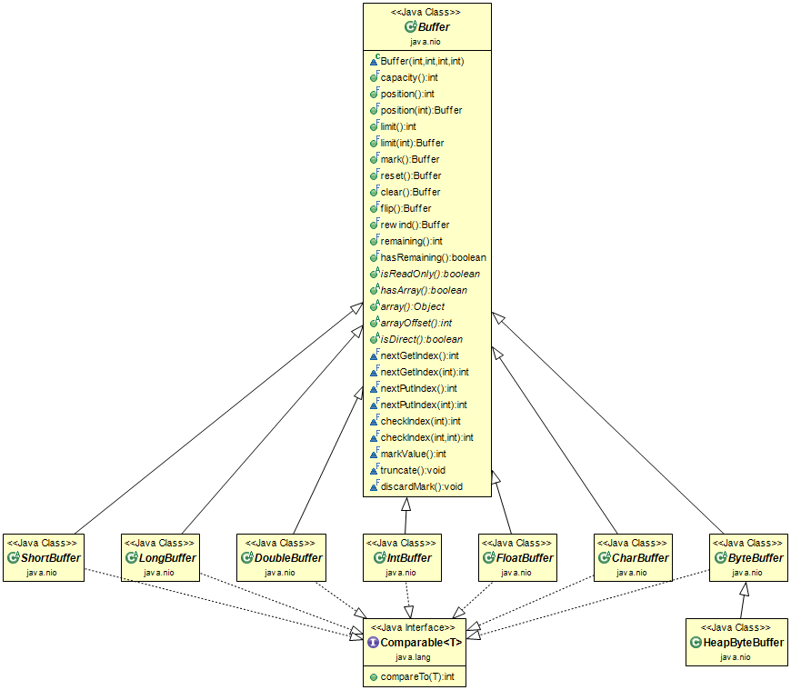
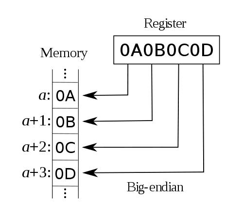
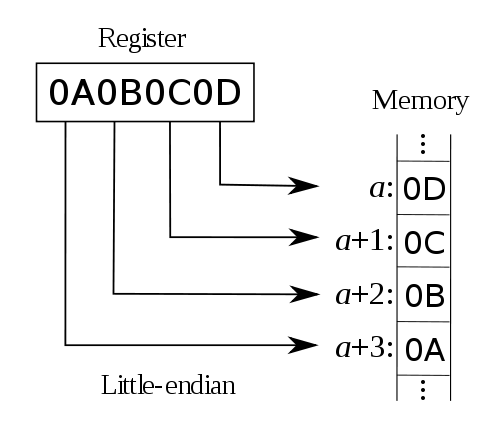
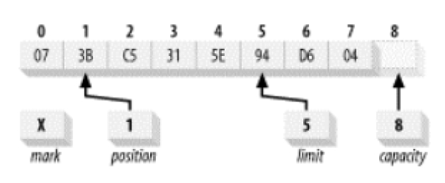
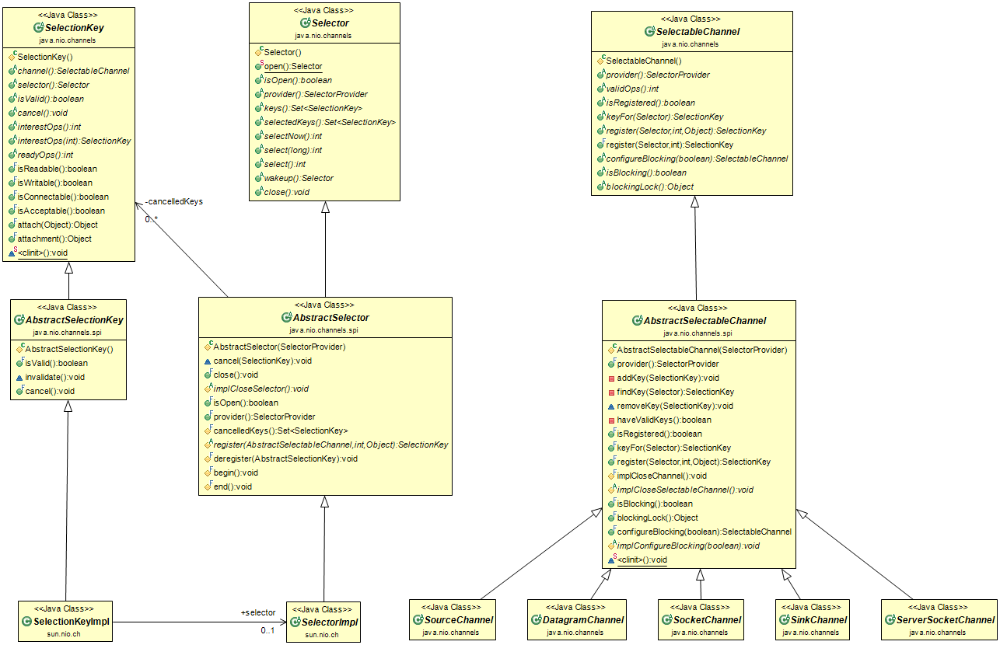

## Java NIO

1. Buffers

    NIO基于Buffer，通过通道方式从I/O服务中发送或接收数据。

    * Buffer属性
        * capacity:总容量
        * limit:标记着首个不能被读或被写的下标
        * position:下一个要读或要写的下标
        * mark:一个初始标记下标，rewind()调用后，position会被重置，mark被置为-1。

        mark <= position <= limit <= capacity

    * Buffer及子类

        

        方法|说明
        --|--
        Object array()|返回支持buffer的数组
        int arrayOffset() |返回buffer的数组中首个buffer元素的下标
        int capacity()|返回buffer的容量大小
        Buffer clear()|清空buffer，返回此buffer
        Buffer flip()|设置游标，limit置为position，position置为0，返回此buffer
        boolean hasArray()|此缓冲区有数组组成且不是只读，则返回true，否则返回false
        boolean hasRemaining()|如果至少有一个元素在buffer中，则返回true
        boolean isDirect()|此buffer是直接字节buffer，则返回true
        boolean isReadOnly()|只读则返回true
        int limit()|返回limit
        Buffer limit(int newLimit)|设置limit值
        Buffer mark()|设置mark到position，返回此buffer
        int position()|返回position
        Buffer position(int newPosition|设置position值，返回此buffer
        int remaining()|返回position和limit之间元素数量
        Buffer reset()|重置buffer的position到前一次标记的位置
        Buffer rewind()|跟初始化一样，position置为0，mark为-1

        **Buffer不是线程安全的，所以在多线程环境中需要添加synchronization保持同步**

        Buffer是一个抽象类，java.nio包含了几个抽象类，都是基本类型且继承于Buffer
        * Boolean
        * ByteBuffer
        * CharBuffer
        * DoubleBuffer
        * FloatBuffer
        * IntBuffer
        * LongBuffer
        * ShortBuffer

        ```java
        import java.nio.Buffer;
        import java.nio.ByteBuffer;

        public class BufferDemo {
            public static void main(String[] args) {
                Buffer buffer = ByteBuffer.allocate(7);
                System.out.println("Capacity: " + buffer.capacity());
                System.out.println("Limit: " + buffer.limit());
                System.out.println("Position: " + buffer.position());
                System.out.println("Remaining: " + buffer.remaining());
                System.out.println("Changing buffer limit to 5");
                buffer.limit(5);
                System.out.println("Limit: " + buffer.limit());
                System.out.println("Position: " + buffer.position());
                System.out.println("Remaining: " + buffer.remaining());
                System.out.println("Changing buffer position to 3");
                buffer.position(3);
                System.out.println("Position: " + buffer.position());
                System.out.println("Remaining: " + buffer.remaining());
                System.out.println(buffer);
            }
        }
        ```

    * Buffer详解

        Buffer的众多子类都有相同功能，用ByteBuffer作为例子展开详解Buffer。

        * Buffer创建

            ByteBuffer创建可以用以下静态方法，其内部实现类是HeapByteBuffer

            方法|说明
            --|--
            ByteBuffer allocate(int capacity)|按指定容量大小申请一块新的字节buffer，它有一个后备数组
            ByteBuffer allocateDirect(int capacity)|按指定容量大小申请一块新的直接字节buffer，它有一个后备数组
            ByteBuffer wrap(byte[] array)|将字节数组包装到buffer中，新buffer由数组支持
            ByteBuffer wrap(byte[] array, int offset, int length)|将字节数组包装到buffer中，新buffer由数组支持，position设置为offset，limit设置为offset+length，capacity设置为array.length

            *ByteBuffer通过allocate()和wrap()方法创建的buffer是非直接字节buffer，是支持数组的。*

            假如bufferA创建后，执行方法bufferA.duplicate()生成bufferB，那么bufferA和bufferB各自用一套(mark,position,limit)，但两者的正真数组是一样的，故具有一样的特性:是否只读，是否直接字节buffer。

        * Buffer读写

            ByteBuffer通过put()和get()方法设置和获取数据

            方法|说明
            --|--
            ByteBuffer put(byte x)|position+1，再设置position位置的数据
            ByteBuffer put(int index, byte x)|设置index位置的数据
            ByteBuffer get()|position+1，再获取position位置的数据
            ByteBuffer get()|获取index位置的数据

            *为了效率最大化，可以用以下一些方法设置和获取数据*

            * ByteBuffer put(byte[] src)
            * ByteBuffer put(byte[] src, int offset, int length)
            * ByteBuffer get(byte[] dst)
            * ByteBuffer get(byte[] dst, int offset, int length) 

        * Buffer翻转

            当设置完数据后，如果要把有效的数据输出去，因此可以调用flip()。
            
            * flip():limit置为position，position置为0；

        * Buffer标记

            有时需要再数组中做些标记，然后从特定的标记位置开始做一些操作，因此可以用到mark()和reset()。
            
            * mark():设置mark值为当前position值
            * reset():设置position的值为mark值

        * Buffer子类操作

            * compact():把当前[position,limit]的数据移动到[0,limit-position]，并设置position为limit-position，limit为capacity。

                ```java
                buf.clear(); // Prepare buffer for use
                while (in.read(buf) != -1){//把数据读入到buffer时，都是从position位置开始的
                    buf.flip(); // 相当于buffer进入读模式，limit置为position，position置为0
                    out.write(buf); // 整个待写数据是[0,limit]，从buffer写数据，可能写了部分[0,position]，剩余[position,limit]数据还没写
                    buf.compact(); // 剩余[position,limit]数据整体的移动到最开始位置，并设置position为limit-position，已备下一次读入
                }
                ```

                compact()方法把未写buffer数据移动到buffer的开头，这样一来下一次read()方法调用时追加读数据到buffer数据中，如果没调用compact可能出现覆盖的情况。**这里的read和write方法会影响buff的position值**。
            
            * equals():判断当前buffer是否跟另外一个buffer相等，标准是元素类型相同 [position,limit]长度一致，比[position,limit]这段数据且确保每个元素一样。
            * compareTo():当前buffer与另一个buffer比较，比较两个buffer中[position,limit]这段数据（以短的那一段为准）

        * 字节排序

            假如要向内存地址为a的地方写入数据0x0A0B0C0D，那么这4个字节分别落在哪个地址的内存上呢？这就涉及到字节序的问题了。

            每个数据都有所谓的“有效位（significant byte）”，它的意思是“表示这个数据所用的字节”。例如一个32位整数，它的有效位就是4个字节。而对于0x0A0B0C0D来说，它的有效位从高到低便是0A、0B、0C及0D——这里您可以把它作为一个256进制的数来看（相对于我们平时所用的10进制数）。

            而所谓大字节序（big endian），便是指其“最高有效位（most significant byte）”落在低地址上的存储方式。例如像地址a写入0x0A0B0C0D之后，在内存中的数据便是：

            

            而对于小字节序（little endian）来说就正好相反了，它把“最低有效位（least significant byte）”放在低地址上。例如：

            

            对于我们常用的CPU架构，如Intel，AMD的CPU使用的都是小字节序，而例如Mac OS以前所使用的Power PC使用的便是大字节序（不过现在Mac OS也使用Intel的CPU了）。此外，除了大字节序和小字节序之外，还有一种很少见的中字节序（middle endian），它会以2143的方式来保存数据（相对于大字节序的1234及小字节序的4321）。

            在java.nio中，字节顺序由ByteOrder类封装。

            ```java
            package java.nio; 
            public final class ByteOrder {
                private String name;
                private ByteOrder(String name) {
                    this.name = name;
                }
                public static final ByteOrder BIG_ENDIAN = new ByteOrder("BIG_ENDIAN");

                public static final ByteOrder LITTLE_ENDIAN  = new ByteOrder("LITTLE_ENDIAN");
                public static ByteOrder nativeOrder() {
                    return Bits.byteOrder();
                }
                public String toString() {
                    return name;
                }
            }
            ```

            ByteOrder类定义了决定从缓冲区中存储或检索多字节数值时使用哪一字节顺序的常量。这个类的作用就像一个类型安全的枚举。它定义了以其本身实例预初始化的两个public区域。只有这两个ByteOrder实例总是存在于JVM中，因此它们可以通过使用--操作符进行比较。如果您需要知道JVM运行的硬件平台的固有字节顺序，请调用静态类函数nativeOrder()。它将返回两个已确定常量中的一个。调用toString()将返回一个包含两个文字字符串BIG_ENDIAN或者LITTLE_ENDIAN之一的String。假设一个叫buffer的ByteBuffer对象处于下图的状态：

            

            这段代码： 

            ```java
            //返回一个由缓冲区中位置1-4的byte数据值组成的int型变量的值。实际的返回值取决于缓冲区的当前的比特排序(byte-order)设置
            int value = buffer.getInt(); 
            int value = buffer.order(ByteOrder.BIG_ENDIAN).getInt(); //更具体的写法，这将会返回值0x3BC5315E
            int value = buffer.order(ByteOrder.LITTLE_ENDIAN).getInt(); //返回值0x5E31C53B
            ```

        * 直接字节Buffer

            直接字节Buffer对于JVM处理I/O是最高效的，因此用于channel是高效的。下文做详解

2. Channels

    通道是一个对象，能够打开一个连接到一个硬件设备，一个文件，一个网络socket，一个应用组件，或者是一个可以提供读写或其他I/O操作特性的对象。通道在字节缓冲区和基于操作系统I/O服务的来源或目的地之间高效的传输数据。

    * 通道及其子类

        

        Java通过java.nio.channels和java.nio.channels.spi来提供通道的，所有的通道实现类都实现java.nio.channels.Channel接口，Channel接口声明了下面的方法

        1. 方法

            方法|说明
            --|--
            void close()|关闭通道
            boolean isOpen()|返回此通道的打开状态

        2. Channel子类(接口类)

            * java.nio.channels.WriteableByteChannel
            * java.nio.channels.ReadableByteChannel
            * java.nio.channels.InterruptibleChannel
            * java.nio.channels.NetworkChannel
            * java.nio.channels.AsynchronousChannel

            1. WriteableByteChannel和ReadableByteChannel

                * WriteableByteChannel接口声明了一个抽象方法 int write(ByteBuffer buffer)，该方法从buffer写入一序列字节到当前通道。
                * ReadableByteChannel接口声明了一个抽象方法 int read(ByteBuffer buffer)，该方法从当前通道中读取一序列字节到buffer中。

            2. InterruptibleChannel

                说明一个通道可以异步的被关闭和被中断，这个接口重载了Channel的close()方法头，添加额外说明：在当前通道发生I/O操作阻塞的任何线程都会受到AsynchronousCloseException异常。主要强调两点：

                * 实现该接口的通道是可异步被关闭的
                * 实现该接口的通道是可异步被中断的

        3. 获取Channel方式

            java.nio.channels包提供了两个方法从流中获取通道。

            方法|说明
            --|--
            WritableByteChannel newChannel(OutputStream outputStream)|根据指定的输出流返回一个可写字节通道
            ReadableByteChannel newChannel(InputStream inputStream)|根据指定的输入流返回一个可读字节通道

            几个I/O类被改造支持通道创建，比如
            * java.io.RandomAccessFile声明一个FileChannel getChannel()
            * java.net.Socket声明一个SocketChannel getChannel()

            ```java
            import java.io.IOException;
            import java.nio.ByteBuffer;
            import java.nio.channels.Channels;
            import java.nio.channels.ReadableByteChannel;
            import java.nio.channels.WritableByteChannel;

            public class ChannelDemo {
                public static void main(String[] args) {
                    ReadableByteChannel src = Channels.newChannel(System.in);
                    WritableByteChannel dest = Channels.newChannel(System.out);
                    try {
                        copy(src, dest); // or copyAlt(src, dest);
                    } catch (IOException ioe) {
                        System.err.println("I/O error: " + ioe.getMessage());
                    } finally {
                        try {
                            src.close();
                            dest.close();
                        } catch (IOException ioe) {
                            ioe.printStackTrace();
                        }
                    }
                }

                static void copy(ReadableByteChannel src, WritableByteChannel dest) throws IOException {
                    ByteBuffer buffer = ByteBuffer.allocateDirect(2048);
                    while (src.read(buffer) != -1) {
                        buffer.flip();
                        dest.write(buffer);
                        buffer.compact();
                    }
                    buffer.flip();
                    while (buffer.hasRemaining())
                        dest.write(buffer);
                }

                static void copyAlt(ReadableByteChannel src, WritableByteChannel dest) throws IOException {
                    ByteBuffer buffer = ByteBuffer.allocateDirect(2048);
                    while (src.read(buffer) != -1) {
                        buffer.flip();
                        while (buffer.hasRemaining())
                            dest.write(buffer);
                        buffer.clear();
                    }
                }
            }
            ```

    * Channel详情

        1. 散射/收集 IO

            散射/收集 IO分别定义了两个接口
            * ScatteringByteChannel: 继承接口ReadableByteChannel，并定义两个方法
                * long read(ByteBuffer[] dsts)
                * long read(ByteBuffer[] dsts, int offset, int length)
            * GatheringByteChannel: 继承接口WritableByteChannel，并定义两个方法
                * long write(ByteBuffer[] dsts)
                * long write(ByteBuffer[] dsts, int offset, int length)

            ```java
            import java.io.FileInputStream;
            import java.io.FileOutputStream;
            import java.io.IOException;
            import java.nio.ByteBuffer;
            import java.nio.channels.Channels;
            import java.nio.channels.GatheringByteChannel;
            import java.nio.channels.ScatteringByteChannel;

            public class GatterAndScatterChannelDemo {
                public static void main(String[] args) throws IOException {
                    ScatteringByteChannel src;
                    FileInputStream fis = new FileInputStream("x.dat");
                    src = (ScatteringByteChannel) Channels.newChannel(fis);
                    ByteBuffer buffer1 = ByteBuffer.allocateDirect(5);
                    ByteBuffer buffer2 = ByteBuffer.allocateDirect(3);
                    ByteBuffer[] buffers = {buffer1, buffer2};
                    src.read(buffers);
                    buffer1.flip();
                    while (buffer1.hasRemaining())
                        System.out.println(buffer1.get());
                    System.out.println();
                    buffer2.flip();
                    while (buffer2.hasRemaining())
                        System.out.println(buffer2.get());
                    buffer1.rewind();
                    buffer2.rewind();
                    GatheringByteChannel dest;
                    FileOutputStream fos = new FileOutputStream("y.dat");
                    dest = (GatheringByteChannel) Channels.newChannel(fos);
                    buffers[0] = buffer2;
                    buffers[1] = buffer1;
                    dest.write(buffers);
                }
            }
            ```

        2. 文件通道

            文件通道是一种能够读，写，映射，操作文件的通道。可以通过以下方式获取文件通道

            * java.io.FileInputStream.getChannel()
            * java.io.FileOutputStream.getChannel()
            * java.io.RandomAccessFile.getChannel()

            这个抽象类java.nio.channels.FileChannel描述了一个文件通道。该类继承AbstractInterruptibleChannel抽象类，因此可中断。另外，该类实现了接口SeekableByteChannel，GatheringByteChannel，ScatteringByteChannel，因此可以在基础文件上写入，读取，散射或收集I/O。

            方法|说明
            --|--
            void force(boolean metadata)|所有对文件通道的更新都提交到对应的文件。metadata为true则更新文件metadata，否则不更新
            long position()|返回这个文件通道的文件位置
            FileChannel position(long newPosition)|设置这个文件通道的文件位置到newPosition
            int read(ByteBuffer buffer)|从文件通道中读取字节到指定的buffer
            int read(ByteBuffer dst, long position)|从文件通道中读取字节到指定的buffer，并从position位置开始
            long size()|返回基础文件的大小(按字节算)
            FileChannel truncate(long size)|将此通道的文件截断为给定的大小。size大于当前文件大小，丢弃文件新末尾之外的任何字节，否则文件不做改变，且position设置size
            int write(ByteBuffer buffer)|从指定的buffer写入到文件通道
            int write(ByteBuffer src, long position)|从指定的buffer写入到文件通道，并从position位置开始

            ```java
            import java.io.IOException;
            import java.io.RandomAccessFile;
            import java.nio.ByteBuffer;
            import java.nio.channels.FileChannel;

            public class FileChannelDemo {
                public static void main(String[] args) throws IOException {
                    RandomAccessFile raf = new RandomAccessFile("temp", "rw");
                    FileChannel fc = raf.getChannel();
                    long pos;
                    System.out.println("Position = " + (pos = fc.position()));
                    System.out.println("size: " + fc.size());
                    String msg = "This is a test message.";
                    ByteBuffer buffer = ByteBuffer.allocateDirect(msg.length() * 2);
                    buffer.asCharBuffer().put(msg);
                    fc.write(buffer);
                    fc.force(true);
                    System.out.println("position: " + fc.position());
                    System.out.println("size: " + fc.size());
                    buffer.clear();
                    fc.position(pos);
                    fc.read(buffer);
                    buffer.flip();
                    while (buffer.hasRemaining())
                        System.out.print(buffer.getChar());
                }
            }
            ```

            1. 文件锁定

                在Java1.4后支持了锁定一个文件的所有或部分，文件锁分为独占锁和共享锁，读写锁的三种状态：

                1. 当读写锁是写加锁状态时，在这个锁被解锁之前，所有试图对这个锁加锁的线程都会被阻塞

                2. 当读写锁在读加锁状态时，所有试图以读模式对它进行加锁的线程都可以得到访问权，但是以写模式对它进行加锁的线程将会被阻塞

                3. 当读写锁在读模式的锁状态时，如果有另外的线程试图以写模式加锁，读写锁通常会阻塞随后的读模式锁的请求，这样可以避免读模式锁长期占用，而等待的写模式锁请求则长期阻塞。

                **文件锁定注意要点**

                * 如果操作系统不支持共享锁，那么对共享锁的请求将转为独占锁
                * 锁是基于每个文件应用的。它们不是基于每个线程或每个通道应用的。运行在同一JVM上的两个线程通过不同的通道请求对同一文件区域的独占锁，并被授予访问权限。但是，如果这些线程运行在不同的jvm上，第二个线程就会阻塞。锁最终由操作系统的文件系统仲裁，而且几乎总是在进程级。它们不在线程级别仲裁。锁与文件关联，而不是与文件句柄或通道关联

                获取独占锁和共享锁的方法

                方法|说明
                --|--
                FileLock lock()|获取此文件通道的基础文件上的独占锁
                FileLock lock(long position, long size, boolean shared)|从指定位置开始的一块区域，获取独占锁(shared为false)或共享锁(shared为true)
                FileLock tryLock()|以非阻塞的方式尝试获取此文件通道的基础文件上的独占锁
                FileLock tryLock(long position, long size, boolean shared)|从指定位置开始的一块区域，以非阻塞的方式尝试获取独占锁(shared为false)或共享锁(shared为true)

                上面的四个方法都返回了一个FileLock的实例，该实例的方法如下

                方法|说明
                --|--
                FileChannel channel()|返回文件锁的文件通道
                void close()|调用了release()方法来释放锁
                boolean isShared()|判断文件锁是不是共享锁
                boolean isValid()|只有文件锁被释放或关联的文件通道被关闭则返回true，否则返回false
                void release()|释放锁

                ```java
                FileLock lock = fileChannel.lock();
                try{
                // interact with the file channel
                }catch (IOException ioe){
                // handle the exception
                }finally{
                    lock.release();
                }
                ```

            2. 映射文件到内存

                FileChannel声明了map()方法，该方法允许您在打开的文件的区域和java.nio.MappedByteBuffer之间创建虚拟内存映射。如下
                *MappedByteBuffer map(FileChannel.MapMode mode, long position, long size)*

                FileChannel.MapMode的枚举类型
                * READ_ONLY:尝试修改buffer会抛出java.nio.ReadOnlyBufferException异常
                * READ_WRITE:buffer做的修改会反映到文件中，但对于其他程序未必可见
                * PRIVATE:对结果缓冲区所做的更改将不会传播到文件，并且对映射相同文件的其他程序也不可见。相反，更改将导致创建缓冲区中已修改部分的私有副本。当缓冲区被垃圾收集时，这些更改将丢失。

                ```java
                import java.io.IOException;
                import java.io.RandomAccessFile;
                import java.nio.MappedByteBuffer;
                import java.nio.channels.FileChannel;

                public class FileChannelMapDemo {
                    public static void main(String[] args) throws IOException {
                        if (args.length != 1) {
                            System.out.println("usage: java ChannelDemo filespec");
                            return;
                        }
                        RandomAccessFile raf = new RandomAccessFile(args[0], "rw");
                        FileChannel fc = raf.getChannel();
                        long size = fc.size();
                        System.out.println("Size: " + size);
                        MappedByteBuffer mbb = fc.map(FileChannel.MapMode.READ_WRITE, 0, size);
                        while (mbb.remaining() > 0)
                            System.out.print((char) mbb.get());
                        System.out.println();
                        System.out.println();
                        for (int i = 0; i < mbb.limit() / 2; i++) {
                            byte b1 = mbb.get(i);
                            byte b2 = mbb.get(mbb.limit() - i - 1);
                            mbb.put(i, b2);
                            mbb.put(mbb.limit() - i - 1, b1);
                        }
                        mbb.flip();
                        while (mbb.remaining() > 0)
                            System.out.print((char) mbb.get());
                        fc.close();
                    }
                }
                ```

            3. 通道之间传递字节

                为了优化执行批量传输的常见实践，在FileChannel中添加了两种方法，以避免使用中间缓冲区:

                * long transferFrom(ReadableByteChannel src, long position, long count):从指定可读字节通道传输字节到这个文件通道

                * long transferTo(long position, long count,WritableByteChannel target):从这个文件通道传输字节到指定可写字节通道

                ```java
                import java.io.FileInputStream;
                import java.io.IOException;
                import java.nio.channels.Channels;
                import java.nio.channels.FileChannel;
                import java.nio.channels.WritableByteChannel;

                public class FileChannelTransferDemo {
                    public static void main(String[] args) {
                        if (args.length != 1) {
                            System.err.println("usage: java ChannelDemo filespec");
                            return;
                        }
                        try (FileInputStream fis = new FileInputStream(args[0])) {
                            FileChannel inChannel = fis.getChannel();
                            WritableByteChannel outChannel = Channels.newChannel(System.out);
                            inChannel.transferTo(0, inChannel.size(), outChannel);
                        } catch (IOException ioe) {
                            System.out.println("I/O error: " + ioe.getMessage());
                        }
                    }
                }
                ```

        3. Socket通道

            共有三个socket通道类：ServerSocketChannel，SocketChannel，DatagramChannel，其继承关系为

            类名|抽象父类|接口类
            --|--|--
            ServerSocketChannel|AbstractSelectableChannel|NetworkChannel
            SocketChannel|AbstractSelectableChannel|ByteChannel, ScatteringByteChannel, GatheringByteChannel, NetworkChannel
            DatagramChannel|AbstractSelectableChannel|ByteChannel, ScatteringByteChannel, GatheringByteChannel, NetworkChannel

            因此可以在基础文件上写入，读取，散射或收集I/O。

            *ServerSocketChannel，SocketChannel，DatagramChannel都是线程安全的，而buffer是非线程安全。*

            SelectableChannel定义了方法来阻塞或非阻塞

            方法|说明
            SelectableChannel configureBlocking(boolean block)|设置可选择通道阻塞状态
            boolean isBlocking()|判断可选择通道是否阻塞
            Object blockingLock()|返回配置阻塞同步的对象

            blockingLock()这个方法能让你阻止其他线程改变socket通道的阻塞状态

            ```java
            ServerSocketChannel ssc = ServerSocketChannel.open();
            SocketChannel sc = null;
            Object lock = ssc.blockingLock();
            // Thread might block when obtaining the lock associated with
            // the lock object.
            synchronized (lock) {
                // Current thread owns the lock. No other thread can
                // change blocking mode.
                // Obtaining server socket channel's current blocking mode.
                boolean blocking = ssc.isBlocking();
                // Set server socket channel to nonblocking.
                ssc.configureBlocking(false);
                // Obtain next connection, which is null when there is no
                // connection.
                sc = ssc.accept();
                // Restore previous blocking mode.
                ssc.configureBlocking(blocking);
            }
            // The lock is released and some other thread may modify the
            // server socket channel's blocking mode.
            if (sc != null)
                communicateWithSocket(sc);
            ```

            1. Server Socket通道

                方法|说明
                --|--
                static ServerSocketChannel open()|尝试打开一个server-socket通道（初始化未绑定），在连接进来之前必须调用对等socket的bind()方法来绑定特定的地址
                ServerSocket socket()|返回这个server socket通道关联的对等socket实例
                SocketChannel accept()|接受与这个通道socket的连接

                server socket通道在TCP/IP流协议中扮演着服务端。

                ```java
                import java.io.IOException;
                import java.net.InetSocketAddress;
                import java.nio.ByteBuffer;
                import java.nio.channels.ServerSocketChannel;
                import java.nio.channels.SocketChannel;

                public class SocketServerChannelDemo {
                    public static void main(String[] args) throws IOException {
                        System.out.println("Starting server...");
                        ServerSocketChannel ssc = ServerSocketChannel.open();
                        ssc.socket().bind(new InetSocketAddress(9999));
                        ssc.configureBlocking(false);
                        String msg = "Local address: " + ssc.socket().getLocalSocketAddress();
                        ByteBuffer buffer = ByteBuffer.wrap(msg.getBytes());
                        while (true) {
                            System.out.print(".");
                            SocketChannel sc = ssc.accept();
                            if (sc != null) {
                                System.out.println();
                                System.out.println("Received connection from " + sc.socket().getRemoteSocketAddress());
                                buffer.rewind();
                                sc.write(buffer);
                                sc.close();
                            } else
                                try {
                                    Thread.sleep(100);
                                } catch (InterruptedException ie) {
                                    assert false; // shouldn't happen
                                }
                        }
                    }
                }
                ```


            2. Socket通道

                方法|说明
                --|--
                static SocketChannel open()|尝试打开一个socket通道
                static SocketChannel open(InetSocketAddress remoteAddr)|尝试打开一个socket通道并连接到remoteAddr
                Socket socket()|返回这个socket通道关联的对等socket实例
                boolean connect(SocketAddress remoteAddr)|尝试连接这个socket通道上的socket对象到remoteAddr
                boolean isConnectionPending()|当连接操作正在等待完成时，返回true;否则,返回false。
                boolean finishConnect()|完成连接socket通道的过程
                boolean isConnected()|如果通道socket是被打开或已经连接，返回true，否则，返回false。

                server socket通道在TCP/IP流协议中扮演着客户端。

                ```java
                import java.io.IOException;
                import java.net.InetSocketAddress;
                import java.nio.ByteBuffer;
                import java.nio.channels.SocketChannel;

                public class SocketChannelDemo {
                    public static void main(String[] args) {
                        try {
                            SocketChannel sc = SocketChannel.open();
                            sc.configureBlocking(false);
                            InetSocketAddress addr = new InetSocketAddress("localhost", 9999);
                            sc.connect(addr);
                            while (!sc.finishConnect())
                                System.out.println("waiting to finish connection");
                            ByteBuffer buffer = ByteBuffer.allocate(200);
                            while (sc.read(buffer) >= 0) {
                                buffer.flip();
                                while (buffer.hasRemaining())
                                    System.out.print((char) buffer.get());
                                buffer.clear();
                            }
                            sc.close();
                        } catch (IOException ioe) {
                            System.err.println("I/O error: " + ioe.getMessage());
                        }
                    }
                }
                ```

            3. Datagram通道

                DatagramChannel为无连接的面向包的协议(如UDP/IP)建模。

                方法|说明
                --|--
                static DatagramChannel open()|尝试打开数据包通道
                DatagramSocket socket()|返回这个数据包通道关联的对等socket实例
                boolean isConnected()|如果通道socket是被打开或已经连接，返回true，否则，返回false。
                DatagramChannel disconnect()|断开与这个通道的socket的连接
                SocketAddress receive(ByteBuffer buffer)|通过通道返回一个数据包
                int send(ByteBuffer buffer, SocketAddress destAddr)|通过通道返送一个数据包

                ```java
                import java.io.IOException;
                import java.net.InetSocketAddress;
                import java.net.SocketAddress;
                import java.nio.ByteBuffer;
                import java.nio.channels.DatagramChannel;

                public class DatagramChannelDemo {
                    final static int PORT = 9999;

                    public static void main(String[] args) throws IOException {
                        System.out.println("server starting and listening on port " + PORT + " for incoming requests...");
                        DatagramChannel dcServer = DatagramChannel.open();
                        dcServer.socket().bind(new InetSocketAddress(PORT));
                        ByteBuffer symbol = ByteBuffer.allocate(4);
                        ByteBuffer payload = ByteBuffer.allocate(16);
                        while (true) {
                            payload.clear();
                            symbol.clear();
                            SocketAddress sa = dcServer.receive(symbol);
                            if (sa == null)
                                return;
                            System.out.println("Received request from " + sa);
                            String stockSymbol = new String(symbol.array(), 0, 4);
                            System.out.println("Symbol: " + stockSymbol);
                            if (stockSymbol.toUpperCase().equals("MSFT")) {
                                payload.putFloat(0, 37.40f); // open share price
                                payload.putFloat(4, 37.22f); // low share price
                                payload.putFloat(8, 37.48f); // high share price
                                payload.putFloat(12, 37.41f); // close share price
                            } else {
                                payload.putFloat(0, 0.0f);
                                payload.putFloat(4, 0.0f);
                                payload.putFloat(8, 0.0f);
                                payload.putFloat(12, 0.0f);
                            }
                            dcServer.send(payload, sa);
                        }
                    }
                }
                ```

        4. Pipe

            java.nio.channels包下还包含了Pipe类，Pipe描述实现单向管道的一对通道，单向管道是在两个实体(如两个文件通道或两个套接字通道)之间单向传递数据的管道。管道类似于java.io.PipedInputStream和java.io.PipedOutputStream类。

            方法|说明
            static Pipe open()|打开一个新管道
            SourceChannel source()|返回这个管道的来源通道
            SinkChannel sink()|此方法返回管道的接收通道

            **Pipes只能用于相同JVM内传输数据，不能用于不同JVM中和额外程序中传递数据。**

            ```java
            import java.io.IOException;
            import java.nio.ByteBuffer;
            import java.nio.channels.Pipe;
            import java.nio.channels.ReadableByteChannel;
            import java.nio.channels.WritableByteChannel;

            public class PipeDemo {
                final static int BUFSIZE = 10;
                final static int LIMIT = 3;

                public static void main(String[] args) throws IOException {
                    final Pipe pipe = Pipe.open();
                    Runnable senderTask = new Runnable() {
                        @Override
                        public void run() {
                            WritableByteChannel src = pipe.sink();
                            ByteBuffer buffer = ByteBuffer.allocate(BUFSIZE);
                            for (int i = 0; i < LIMIT; i++) {
                                buffer.clear();
                                for (int j = 0; j < BUFSIZE; j++)
                                    buffer.put((byte) (Math.random() * 256));
                                buffer.flip();
                                try {
                                    while (src.write(buffer) > 0)
                                        ;
                                } catch (IOException ioe) {
                                    System.err.println(ioe.getMessage());
                                }
                            }
                            try {
                                src.close();
                            } catch (IOException ioe) {
                                ioe.printStackTrace();
                            }
                        }
                    };
                    Runnable receiverTask = new Runnable() {
                        @Override
                        public void run() {
                            ReadableByteChannel dst = pipe.source();
                            ByteBuffer buffer = ByteBuffer.allocate(BUFSIZE);
                            try {
                                while (dst.read(buffer) >= 0) {
                                    buffer.flip();
                                    while (buffer.remaining() > 0)
                                        System.out.println(buffer.get() & 255);
                                    buffer.clear();
                                }
                            } catch (IOException ioe) {
                                System.err.println(ioe.getMessage());
                            }
                        }
                    };
                    Thread sender = new Thread(senderTask);
                    Thread receiver = new Thread(receiverTask);
                    sender.start();
                    receiver.start();
                }
            }
            ```

3. Selectors

   非阻塞模式是执行准备就绪选择的基础，它将检查I/O流是否准备好执行写、读和其他操作所涉及的工作转移到操作系统，而不是在实际I/O中执行这些操作。

    1. Selector认识

        
        
        一个selector是由抽象类java.nio.channels.Selector创建的一个对象。selector维护一个通道集合，并检查它们是否准备好执行读、写和其他操作。通过select()方法把检查工作代理到操作系统。

        Selector总是和selectable通道一起使用的，这些通道继承于抽象类**java.nio.channels.SelectableChannel**，比如
        * java.nio.channels.SocketChannel
        * java.nio.channels.ServerSocketChannel  
        * java.nio.channels.DatagramChannel 
        * java.nio.channels.Pipe.SinkChannel
        * java.nio.channels.Pipe.SourceChannel  

        ```java
        Selector selector = Selector.open();
        ```

        创建selector后，selectable通道可用以下方法注册到通道中
        
        
        * SelectionKey register(Selector sel, int ops) :以ops方式注册到sel中
        * SelectionKey register(Selector sel, int ops, Object att) :以ops方式注册到sel中，att是一个任意的对象，可以方便辨认一个通道或添加额外的信息到通道

        ops的枚举说明
        * OP_ACCEPT: socket接入操作
        * OP_CONNECT: socket连接操作
        * OP_READ: 读操作
        * OP_WRITE: 写操作

    2. Selector执行选择

        * 典型用法

            通道需要设置成非阻塞模式，应用的典型用法是进入一个死循环，并完成以下的操作
            
            1. 执行选择操作
            2. 通过迭代器获取selected keys
            3. 迭代keys，并执行通道操作


        * Selector的select方法
                
           选择器的操作是通过调用Selector的select()方法
            * select() :执行一个阻塞的选择操作，满足某个条件才会返回，无论哪个先至
                * 至少一个通道被选择
                * wakeup()方法被调用
                * 当前线程被中断
            * select(long timeout) :跟select()一样，多了一个超时条件。
            * selectNow() :　是select()的非阻塞版本。

        * 通道的动作

            SelectionKey的通道动作判断
            
            * boolean isAcceptable()：通道是否接受一个连接
            * boolean isConnectable()：通道是否完成连接
            * boolean isReadable()：通道是否可读
            * boolean isWritable()：通道是否可写

        ```java
        import java.io.IOException;
        import java.net.InetSocketAddress;
        import java.nio.ByteBuffer;
        import java.nio.channels.SocketChannel;
        import java.util.Date;

        public class SelectorClient {
            final static int DEFAULT_PORT = 9999;

            static ByteBuffer bb = ByteBuffer.allocateDirect(8);

            public static void main(String[] args) {
                int port = DEFAULT_PORT;
                if (args.length > 0)
                    port = Integer.parseInt(args[0]);

                try {
                    SocketChannel sc = SocketChannel.open();
                    InetSocketAddress addr = new InetSocketAddress("localhost", port);
                    sc.connect(addr);

                    long time = 0;
                    while (sc.read(bb) != -1) {
                        bb.flip();
                        while (bb.hasRemaining()) {
                            time <<= 8;
                            time |= bb.get() & 255;
                        }
                        bb.clear();
                    }
                    System.out.println(new Date(time));
                    sc.close();
                } catch (IOException ioe) {
                    System.err.println("I/O error: " + ioe.getMessage());
                }
            }
        }
        ```

        ```java
        import java.io.IOException;
        import java.net.InetSocketAddress;
        import java.net.ServerSocket;
        import java.nio.ByteBuffer;
        import java.nio.channels.SelectionKey;
        import java.nio.channels.Selector;
        import java.nio.channels.ServerSocketChannel;
        import java.nio.channels.SocketChannel;
        import java.util.Iterator;

        public class SelectorServer {
            final static int DEFAULT_PORT = 9999;

            static ByteBuffer bb = ByteBuffer.allocateDirect(8);

            public static void main(String[] args) throws IOException {
                int port = DEFAULT_PORT;
                if (args.length > 0)
                    port = Integer.parseInt(args[0]);
                System.out.println("Server starting ... listening on port " + port);

                ServerSocketChannel ssc = ServerSocketChannel.open();
                ServerSocket ss = ssc.socket();
                ss.bind(new InetSocketAddress(port));
                ssc.configureBlocking(false);

                Selector s = Selector.open();
                ssc.register(s, SelectionKey.OP_ACCEPT);

                while (true) {
                    int n = s.select();
                    if (n == 0)
                        continue;
                    Iterator<?> it = s.selectedKeys().iterator();
                    while (it.hasNext()) {
                        SelectionKey key = (SelectionKey) it.next();
                        if (key.isAcceptable()) {
                            SocketChannel sc;
                            sc = ((ServerSocketChannel) key.channel()).accept();
                            if (sc == null)
                                continue;
                            System.out.println("Receiving connection");
                            bb.clear();
                            bb.putLong(System.currentTimeMillis());
                            bb.flip();
                            System.out.println("Writing current time");
                            while (bb.hasRemaining())
                                sc.write(bb);
                            sc.close();
                        }
                        it.remove();
                    }
                }
            }
        }
        ```

原文:book/Java I-O, NIO and NIO.2.pdf
https://blog.csdn.net/will_awoke/article/details/25803725