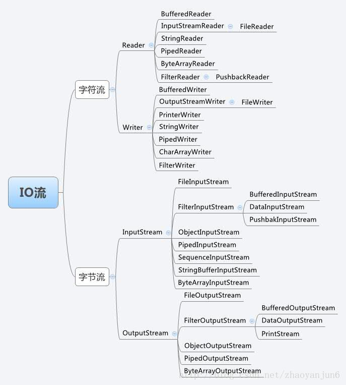
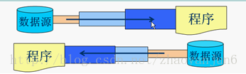
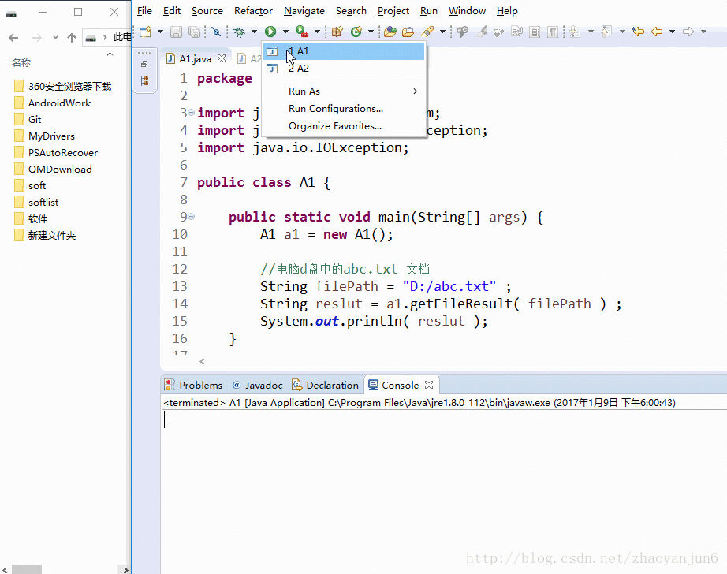

## Java IO流学习总结

#### Java流类图结构：


#### 流的概念和作用
流是一组有顺序的，有起点和终点的字节集合，是对数据传输的总称或抽象。即数据在两设备间的传输称为流，流的本质是数据传输，根据数据传输特性将流抽象为各种类，方便更直观的进行数据操作。

#### IO流的分类
* 根据处理数据类型的不同分为：字符流和字节流
* 根据数据流向不同分为：输入流和输出流
#### 字符流和字节流
字符流的由来： 因为数据编码的不同，而有了对字符进行高效操作的流对象。本质其实就是基于字节流读取时，去查了指定的码表。 字节流和字符流的区别：

* 读写单位不同：字节流以字节（8bit）为单位，字符流以字符为单位，根据码表映射字符，一次可能读多个字节。
* 处理对象不同：字节流能处理所有类型的数据（如图片、avi等），而字符流只能处理字符类型的数据。

* 字节流：一次读入或读出是8位二进制。
* 字符流：一次读入或读出是16位二进制。

**设备上的数据无论是图片或者视频，文字，它们都以二进制存储的。二进制的最终都是以一个8位为数据单元进行体现，所以计算机中的最小数据单元就是字节。意味着，字节流可以处理设备上的所有数据，所以字节流一样可以处理字符数据。**

结论：只要是处理纯文本数据，就优先考虑使用字符流。 除此之外都使用字节流。
#### 输入流和输出流
输入流只能进行读操作，输出流只能进行写操作，程序中需要根据待传输数据的不同特性而使用不同的流。

#### 输入字节流 InputStream
* InputStream 是所有的输入字节流的父类，它是一个抽象类。
* ByteArrayInputStream、StringBufferInputStream、FileInputStream 是三种基本的介质流，它们分别从Byte 数组、StringBuffer、和本地文件中读取数据。
* PipedInputStream 是从与其它线程共用的管道中读取数据，与Piped 相关的知识后续单独介绍。
* ObjectInputStream 和所有FilterInputStream 的子类都是装饰流（装饰器模式的主角）。
#### 输出字节流 OutputStream
* OutputStream 是所有的输出字节流的父类，它是一个抽象类。
* ByteArrayOutputStream、FileOutputStream 是两种基本的介质流，它们分别向Byte 数组、和本地文件中写入数据。
* PipedOutputStream 是向与其它线程共用的管道中写入数据。
* ObjectOutputStream 和所有FilterOutputStream 的子类都是装饰流。
总结：

* 输入流：InputStream或者Reader：从文件中读到程序中；
* 输出流：OutputStream或者Writer：从程序中输出到文件中；
#### 节点流
节点流：直接与数据源相连，读入或读出。
直接使用节点流，读写不方便，为了更快的读写文件，才有了处理流。


常用的节点流
* 父　类 ：InputStream 、OutputStream、 Reader、 Writer
* 文　件 ：FileInputStream 、 FileOutputStrean 、FileReader 、FileWriter 文件进行处理的节点流
* 数　组 ：ByteArrayInputStream、 ByteArrayOutputStream、 CharArrayReader 、CharArrayWriter 对数组进行处理的节点流（对应的不再是文件，而是内存中的一个数组）
字符串 ：StringReader、 StringWriter 对字符串进行处理的节点流
* 管　道 ：PipedInputStream 、PipedOutputStream 、PipedReader 、PipedWriter 对管道进行处理的节点流
#### 处理流
处理流和节点流一块使用，在节点流的基础上，再套接一层，套接在节点流上的就是处理流。如BufferedReader.处理流的构造方法总是要带一个其他的流对象做参数。一个流对象经过其他流的多次包装，称为流的链接。



常用的处理流
* 缓冲流：BufferedInputStrean 、BufferedOutputStream、 BufferedReader、 BufferedWriter 增加缓冲功能，避免频繁读写硬盘。
* 转换流：InputStreamReader 、OutputStreamReader实现字节流和字符流之间的转换。
* 数据流： DataInputStream 、DataOutputStream 等-提供将基础数据类型写入到文件中，或者读取出来。

转换流

InputStreamReader 、OutputStreamWriter 要InputStream或OutputStream作为参数，实现从字节流到字符流的转换。

构造函数
```java
InputStreamReader(InputStream);        //通过构造函数初始化，使用的是本系统默认的编码表GBK。
InputStreamWriter(InputStream,String charSet);   //通过该构造函数初始化，可以指定编码表。
OutputStreamWriter(OutputStream);      //通过该构造函数初始化，使用的是本系统默认的编码表GBK。
OutputStreamwriter(OutputStream,String charSet);   //通过该构造函数初始化，可以指定编码表。
```
#### 实战演练
* FileInputStream类的使用：读取文件内容
```java
package com.app;

import java.io.FileInputStream;
import java.io.FileNotFoundException;
import java.io.IOException;

public class A1 {

    public static void main(String[] args) {
        A1 a1 = new A1();
    
        //电脑d盘中的abc.txt 文档
        String filePath = "D:/abc.txt" ;
        String reslut = a1.readFile( filePath ) ;
        System.out.println( reslut ); 
    }


    /**
     * 读取指定文件的内容
     * @param filePath ： 文件的路径
     * @return  返回的结果
     */
    public String readFile( String filePath ){
        FileInputStream fis=null;
        String result = "" ;
        try {
            // 根据path路径实例化一个输入流的对象
            fis  = new FileInputStream( filePath );

            //2. 返回这个输入流中可以被读的剩下的bytes字节的估计值；
            int size =  fis.available() ;
            //3. 根据输入流中的字节数创建byte数组；
            byte[] array = new byte[size];
            //4.把数据读取到数组中；
            fis.read( array ) ; 

            //5.根据获取到的Byte数组新建一个字符串，然后输出；
            result = new String(array); 

        } catch (FileNotFoundException e) {
            e.printStackTrace();
        }catch (IOException e) {
            e.printStackTrace();
        }finally{
            if ( fis != null) {
                try {
                    fis.close();
                } catch (IOException e) {
                    e.printStackTrace();
                }
            }
        }

        return result ;
    }
}
```
* FileOutputStream 类的使用：将内容写入文件
```java
package com.app;
import java.io.FileNotFoundException;
import java.io.FileOutputStream;
import java.io.IOException;

public class A2 {

    public static void main(String[] args) {
        A2 a2 = new A2();

        //电脑d盘中的abc.txt 文档
        String filePath = "D:/abc.txt" ;

        //要写入的内容
        String content = "今天是2017/1/9,天气很好" ;
        a2.writeFile( filePath , content  ) ;

    }

    /**
     * 根据文件路径创建输出流
     * @param filePath ： 文件的路径
     * @param content : 需要写入的内容
     */
    public void writeFile( String filePath , String content ){
        FileOutputStream fos = null ;
        try {
            //1、根据文件路径创建输出流
            fos  = new FileOutputStream( filePath );

            //2、把string转换为byte数组；
            byte[] array = content.getBytes() ;
            //3、把byte数组输出；
            fos.write( array );

        } catch (FileNotFoundException e) {
            e.printStackTrace();
        }catch (IOException e) {
            e.printStackTrace();
        }finally{
            if ( fos != null) {
                try {
                    fos.close();
                } catch (IOException e) {
                    e.printStackTrace();
                }
            }
        }
    }
}
```
注意：

1. 在实际的项目中，所有的IO操作都应该放到子线程中操作，避免堵住主线程。
2. FileInputStream在读取文件内容的时候，我们传入文件的路径（"D:/abc.txt"）, 如果这个路径下的文件不存在，那么在执行readFile()方法时会报FileNotFoundException异常。
3. FileOutputStream在写入文件的时候，我们传入文件的路径（"D:/abc.txt"）, 如果这个路径下的文件不存在，那么在执行writeFile()方法时, 会默认给我们创建一个新的文件。还有重要的一点，不会报异常。
效果图：



综合练习，实现复制文件，从D盘复制到E盘
```java
package com.app;
import java.io.FileInputStream;
import java.io.FileNotFoundException;
import java.io.FileOutputStream;
import java.io.IOException;

public class A3 {

    public static void main(String[] args) {
        A3 a2 = new A3();

        //电脑d盘中的cat.png 图片的路径
        String filePath1 = "D:/cat.png" ;

        //电脑e盘中的cat.png 图片的路径
        String filePath2 = "E:/cat.png" ;

        //复制文件
        a2.copyFile( filePath1 , filePath2 );

    }

    /**
     * 文件复制 
     * @param filePath_old : 需要复制文件的路径
     * @param filePath_new : 复制文件存放的路径
     */
    public void copyFile( String filePath_old  , String filePath_new){
        FileInputStream fis=null ;
        FileOutputStream fout = null ;
        try {
            // 根据path路径实例化一个输入流的对象
            fis  = new FileInputStream( filePath_old );

            //2. 返回这个输入流中可以被读的剩下的bytes字节的估计值；
            int size =  fis.available() ;
            //3. 根据输入流中的字节数创建byte数组；
            byte[] array = new byte[size];
            //4.把数据读取到数组中；
            fis.read( array ) ; 

            //5、根据文件路径创建输出流
            fout = new FileOutputStream( filePath_new ) ;
            
            //5、把byte数组输出；
            fout.write( array );

        } catch (FileNotFoundException e) {
            e.printStackTrace();
        }catch (IOException e) {
            e.printStackTrace();
        }finally{
            if ( fis != null) {
                try {
                    fis.close();
                } catch (IOException e) {
                    e.printStackTrace();
                }
            }
            if ( fout != null ) {
                try {
                    fout.close();
                } catch (IOException e) {
                    e.printStackTrace();
                }   
            }
        }
    }
}
```