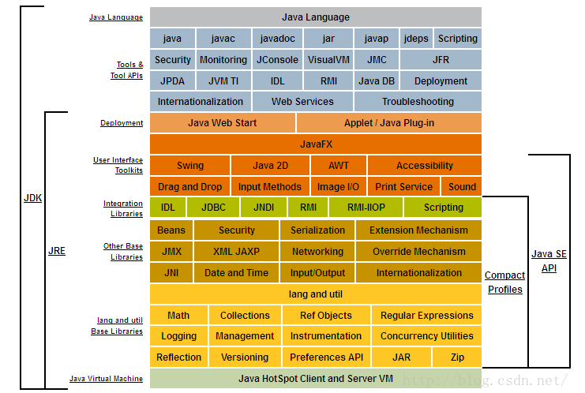
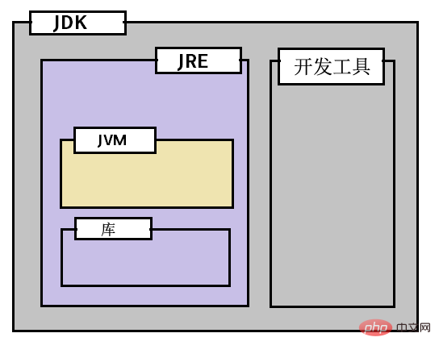

## Java基本概念

1. JVM，JRE和JDK之间的区别

    总体概念图

    

    1. JVM

        1. JVM概念

            * JVM(java虚拟机)是一个抽象机器。 它被称为虚拟机，因为它实际上不存在。
            * 它是一个提供可以执行Java字节码的运行时环境的规范。 
            * 它是指定Java虚拟机工作的规范。但具体实现是JRE。 
            * 运行时实例只要在命令提示符上编写java命令来运行java类，就会创建JVM实例。 
            * JVM可用于许多硬件和软件平台。JVM,JRE和JDK是平台相关的，因为每个OS的配置不同。但是，Java是平台无关的。

        2. JVM执行以下主要任务

            * 加载代码
            * 验证代码
            * 执行代码
            * 提供运行时环境

        3. JVM提供了以下定义

            * 内存区
            * 类文件格式
            * 寄存器集合
            * 垃圾收集堆
            * 致命错误报告等

        4. JVM内部体系结构

            * 类加载器(Classloader)
            * 内存区域
                * 类(方法)区域
                * 堆
                * 栈
                * 程序计数器寄存器
                * 本地方法堆栈
            * 执行引擎 
            * 虚拟处理器
            * 解释器
            * 即时(JIT)编译器

    2. JRE

        **JRE(Java Runtime Enviroment)是Java的运行环境。面向Java程序的使用者，而不是开发者。**如果你仅下载并安装了JRE，那么你的系统只能运行Java程序。JRE是运行Java程序所必须环境的集合，包含JVM标准实现及 Java核心类库。它包括 **Java虚拟机**、Java平台核心类和支持文件。它不包含开发工具(编译器、调试器等)。

    3. JDK

        **JDK(Java Development Kit)又称J2SDK(Java2 Software Development Kit)，是Java开发工具包，它提供了Java的开发环境(提供了编译器javac等工具，用于将java文件编译为class文件)和运行环境(提 供了JVM和Runtime辅助包，用于解析class文件使其得到运行)。** 如果你下载并安装了JDK，那么你不仅可以开发Java程序，也同时拥有了运行Java程序的平台。JDK是整个Java的核心，包括了 **Java运行环境(JRE)**，一堆Java工具tools.jar和Java标准类库 (rt.jar)。

    JVM、JRE、JDK的区别总结：

    1. JVM是一个规范，提供可以执行Java字节码的运行时环境。
    2. JRE = 运行Java应用程序的JVM + 库。
    3. JDK = JRE + 开发Java应用程序的工具。

    三者之间的关系图：

    

2. Java SE，Java EE和Java ME之间的区别

    1. Java SE

        标准版Java SE（Java Platform，Standard Edition）。JavaSE以前成为J2SE。**它语序开发和部署在桌面，服务器，嵌入式环境和实时环境中使用Java应用程序。** JavaSE包含了支持JavaWeb服务的开发的类，并为Java Platform,Enterprise Edition(Java EE)提供了基础。

    2. Java EE

        企业版Java EE（Java Platform，Enterprise Edition）。这个版本以前成为J2EE。**企业版本帮助开发和部署可移植，健壮，可伸缩切安全的服务器端Java应用程序。**

    3. Java ME

        微型版Java ME（Java Platform，Micro Edition）。这个版本以前称为J2ME。**Java ME为在移动设备和嵌入式设备（笔记手机，PDA，电视机顶盒和打印机）上运行的应用程序提供一个健壮且灵活的环境。**

3. JCP与JCR

    1. JCP

        Java Community Process ，Java社区进程，Java标准指定组织。

        JCP成立于1998年，[官网](https://www.jcp.org/en/home/index)，由社会各界Java组成的社区，规划和领导Java的发展，其成员可以在[这里](https://jcp.org/en/participation/members)看到。 

        是一个开放的国际组织，主要由Java开发者以及被授权者组成，职能是发展和更新Java技术规范、参考实现（RI）、技术兼容包（TCK）。Java技术和JCP两者的原创者都是SUN计算机公司。然而，JCP已经由SUN于1995年创造Java的非正式过程，演进到如今有数百名来自世界各地Java代表成员一同监督Java发展的正式程序。

        JCP维护的规范包括J2ME、J2SE、J2EE，XML，OSS，JAIN等。组织成员可以提交JCR（Java Specification Requests），通过**特定程序**以后，进入到下一版本的规范里面。

        特定程序过程：

        1. 加入Java功能或特性时，以jsr正式文件提交jcp。
        2. jcp执行委员会（Executive Committee）通过，方可成为最终的标准文件。
        3. jsr成为最终文件后，必须根据jsr成果做出免费且开发原始码的参考实现称为RI（Reference Implementation），并提供TCK（Technology Compatibility Kit）作为技术兼容测试工具箱。

    2. JSR

        Java Specification Requests，Java规范请求，由JCP成员向委员会提交的Java发展议案，经过一系列流程后，如果通过最终会体现在未来的Java中。

        [官网](https://jcp.org/en/jsr/all)

    3. OpenJDK
        
        Sun公司初始设立的开发Java源码组织，是组织也是开源JDK的名字。http://openjdk.java.net/jeps/0

原文：https://blog.csdn.net/xyang889/article/details/82157062
http://www.php.cn/java-article-413158.html
http://www.cnblogs.com/wengbm/p/8047706.html
https://blog.csdn.net/yuanjin_1990/article/details/80612746 
https://www.cnblogs.com/doit8791/p/10575992.html