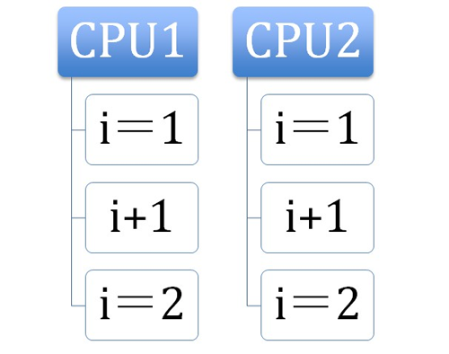
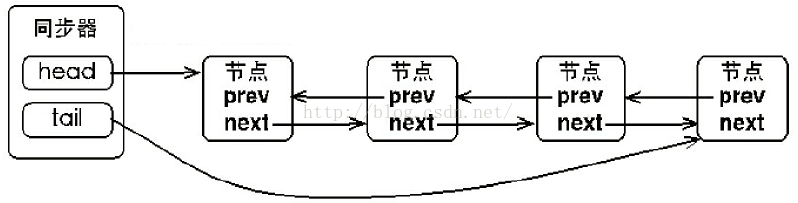
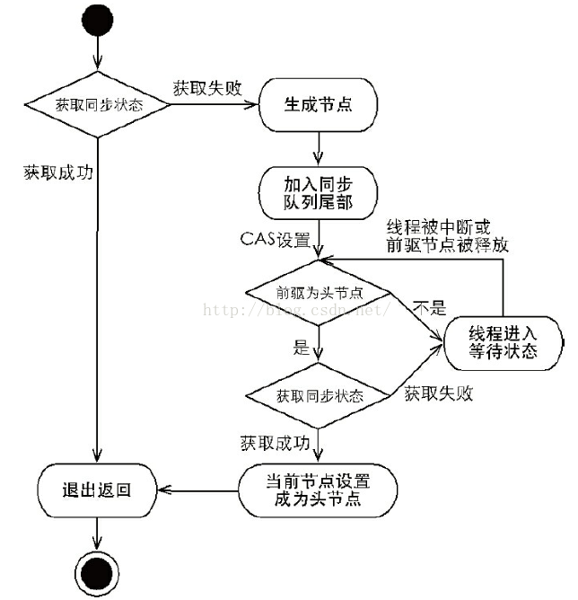
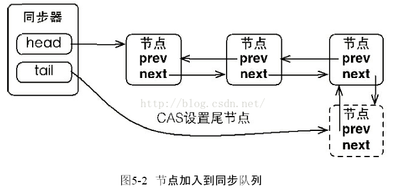
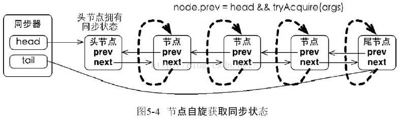
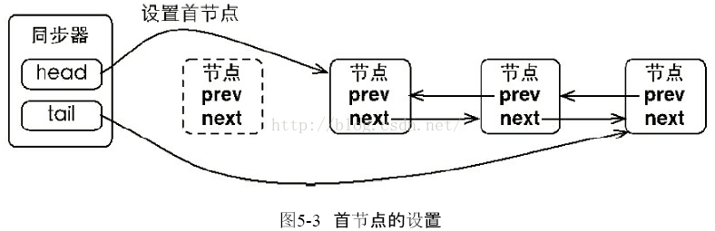
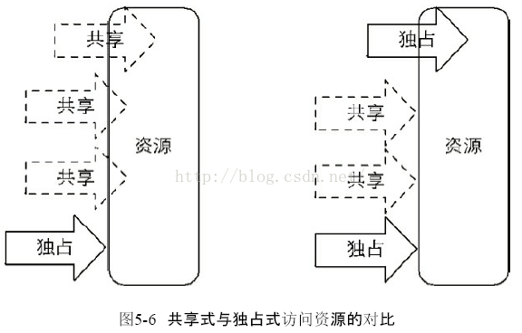
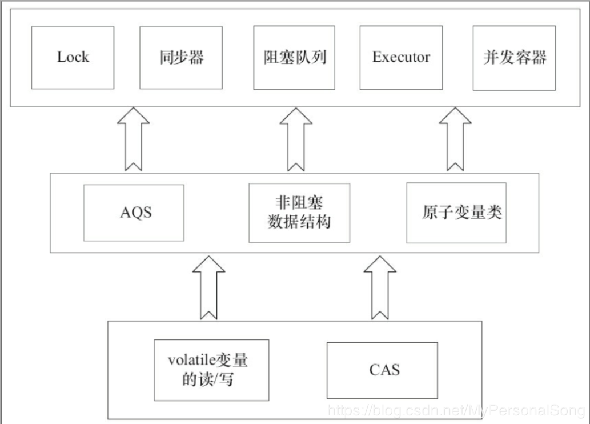

## 并发基础详解

本文从CAS和AbstractQueuedSynchronizer同步器这两部分谈论下并发编程的基础

1. CAS
    1. CAS概念

        CAS:Compare and Swap, 翻译成比较并交换。

        java.util.concurrent包中借助CAS实现了区别于synchronouse同步锁的一种乐观锁。

    2. CAS应用

        CAS有3个操作数，内存值V，旧的预期值A，要修改的新值B。当且仅当预期值A和内存值V相同时，将内存值V修改为B，否则什么都不做。

    3. 非阻塞算法 （nonblocking algorithms）

        一个线程的失败或者挂起不应该影响其他线程的失败或挂起的算法。

        现代的CPU提供了特殊的指令，可以自动更新共享数据，而且能够检测到其他线程的干扰，而 compareAndSet() 就用这些代替了锁定。

        拿出AtomicInteger来研究在没有锁的情况下是如何做到数据正确性的。

        ```java
        private volatile int value;
        ```

        首先毫无以为，在没有锁的机制下可能需要借助volatile原语，保证线程间的数据是可见的（共享的）。这样在获取变量的值的时候才能直接读取。

        ```java
        public final int get() {
            return value;
        }
        ```

        然后来看看++i是怎么做到的。

        ```java
        public final int incrementAndGet() {
            for (;;) {
                int current = get();
                int next = current + 1;
                if (compareAndSet(current, next))
                    return next;
            }
        }
        ```

        在这里采用了CAS操作，每次从内存中读取数据然后将此数据和+1后的结果进行CAS操作，如果成功就返回结果，否则重试直到成功为止。

        而compareAndSet利用JNI来完成CPU指令的操作。

        ```java
        public final boolean compareAndSet(int expect, int update) {
            return unsafe.compareAndSwapInt(this, valueOffset, expect, update);
        }
        ```

        整体的过程就是这样子的，利用CPU的CAS指令，同时借助JNI来完成Java的非阻塞算法。其它原子操作都是利用类似的特性完成的。

        其中

        ```java
        unsafe.compareAndSwapInt(this, valueOffset, expect, update);
        ```

        实现类似：

        ```java
        if (this == expect) {
            this = update;
            return true;
        } else {
            return false;
        }
        ```

        那么问题就来了，成功过程中需要2个步骤：比较this == expect，替换this = update，compareAndSwapInt如何这两个步骤的原子性呢？ 参考CAS的原理。

    4. CAS原理

        CAS通过调用JNI的代码实现的。JNI:Java Native Interface为JAVA本地调用，允许java调用其他语言。而compareAndSwapInt就是借助C来调用CPU底层指令实现的。

        下面从分析比较常用的CPU（intel x86）来解释CAS的实现原理。

        下面是sun.misc.Unsafe类的compareAndSwapInt()方法的源代码：

        ```java
        public final native boolean compareAndSwapInt(Object o, long offset,int expected,int x);
        ```

        可以看到这是个本地方法调用。这个本地方法在openjdk中依次调用的c++代码为：

        * unsafe.cpp
        * atomic.cpp
        * atomicwindowsx86.inline.hpp

        这个本地方法的最终实现在openjdk的如下位置：openjdk-7-fcs-src-b147-27jun2011\openjdk\hotspot\src\oscpu\windowsx86\vm\ atomicwindowsx86.inline.hpp（对应于windows操作系统，X86处理器）。下面是对应于intel x86处理器的源代码的片段：

         ```C
        // Adding a lock prefix to an instruction on MP machine
        // VC++ doesn't like the lock prefix to be on a single line
        // so we can't insert a label after the lock prefix.
        // By emitting a lock prefix, we can define a label after it.
        #define LOCK_IF_MP(mp) __asm cmp mp, 0  \
                            __asm je L0      \
                            __asm _emit 0xF0 \
                            __asm L0:

        inline jint     Atomic::cmpxchg    (jint     exchange_value, volatile jint*     dest, jint     compare_value) {
        // alternative for InterlockedCompareExchange
        int mp = os::is_MP();
        __asm {
                mov edx, dest
                mov ecx, exchange_value
                mov eax, compare_value
                LOCK_IF_MP(mp)
                cmpxchg dword ptr [edx], ecx
            }
        }
        ```

        如上面源代码所示，程序会根据当前处理器的类型来决定是否为cmpxchg指令添加lock前缀。如果程序是在多处理器上运行，就为cmpxchg指令加上lock前缀（lock cmpxchg）。反之，如果程序是在单处理器上运行，就省略lock前缀（单处理器自身会维护单处理器内的顺序一致性，不需要lock前缀提供的内存屏障效果）。

        intel的手册对lock前缀的说明如下：

        1. 确保对内存的读-改-写操作原子执行。

            在Pentium及Pentium之前的处理器中，带有lock前缀的指令在执行期间会锁住总线，使得其他处理器暂时无法通过总线访问内存。很显然，这会带来昂贵的开销。从Pentium 4，Intel Xeon及P6处理器开始，intel在原有总线锁的基础上做了一个很有意义的优化：**如果要访问的内存区域（area of memory）在lock前缀指令执行期间已经在处理器内部的缓存中被锁定（即包含该内存区域的缓存行当前处于独占或以修改状态），并且该内存区域被完全包含在单个缓存行（cache line）中，那么处理器将直接执行该指令。由于在指令执行期间该缓存行会一直被锁定，其它处理器无法读/写该指令要访问的内存区域，因此能保证指令执行的原子性。这个操作过程叫做缓存锁定（cache locking）**，缓存锁定将大大降低lock前缀指令的执行开销，但是当多处理器之间的竞争程度很高或者指令访问的内存地址未对齐时，仍然会锁住总线。

        2. 禁止该指令与之前和之后的读和写指令重排序。

        3. 把写缓冲区中的所有数据刷新到内存中。

        备注知识：

        关于CPU的锁有如下3种：

        1. 处理器自动保证基本内存操作的原子性

            首先处理器会自动保证基本的内存操作的原子性。**处理器保证从系统内存当中读取或者写入一个字节是原子的，意思是当一个处理器读取一个字节时，其他处理器不能访问这个字节的内存地址**。奔腾6和最新的处理器能自动保证单处理器对同一个缓存行里进行16/32/64位的操作是原子的，但是复杂的内存操作处理器不能自动保证其原子性，比如跨总线宽度，跨多个缓存行，跨页表的访问。但是处理器提供总线锁定和缓存锁定两个机制来保证复杂内存操作的原子性。

        2. 使用总线锁保证原子性

            第一个机制是通过总线锁保证原子性。如果多个处理器同时对共享变量进行读改写（i++就是经典的读改写操作）操作，那么共享变量就会被多个处理器同时进行操作，这样读改写操作就不是原子的，操作完之后共享变量的值会和期望的不一致，举个例子：如果i=1,我们进行两次i++操作，我们期望的结果是3，但是有可能结果是2。如下图

            

            原因是有可能多个处理器同时从各自的缓存中读取变量i，分别进行加一操作，然后分别写入系统内存当中。那么想要保证读改写共享变量的操作是原子的，就必须保证CPU1读改写共享变量的时候，CPU2不能操作缓存了该共享变量内存地址的缓存。

            处理器使用总线锁就是来解决这个问题的。所谓总线锁就是使用处理器提供的一个LOCK＃信号，当一个处理器在总线上输出此信号时，其他处理器的请求将被阻塞住,那么该处理器可以独占使用共享内存。

        3. 使用缓存锁保证原子性

            第二个机制是通过缓存锁定保证原子性。在同一时刻我们只需保证对某个内存地址的操作是原子性即可，但总线锁定把CPU和内存之间通信锁住了，这使得锁定期间，其他处理器不能操作其他内存地址的数据，所以总线锁定的开销比较大，最近的处理器在某些场合下使用缓存锁定代替总线锁定来进行优化。

            频繁使用的内存会缓存在处理器的L1，L2和L3高速缓存里，那么原子操作就可以直接在处理器内部缓存中进行，并不需要声明总线锁，在奔腾6和最近的处理器中可以使用“缓存锁定”的方式来实现复杂的原子性。**所谓“缓存锁定”就是如果缓存在处理器缓存行中内存区域在LOCK操作期间被锁定，当它执行锁操作回写内存时，处理器不在总线上声言LOCK＃信号，而是修改内部的内存地址，并允许它的缓存一致性机制来保证操作的原子性**，因为缓存一致性机制会阻止同时修改被两个以上处理器缓存的内存区域数据，当其他处理器回写已被锁定的缓存行的数据时会起缓存行无效，在例1中，当CPU1修改缓存行中的i时使用缓存锁定，那么CPU2就不能同时缓存了i的缓存行。

            但是有两种情况下处理器不会使用缓存锁定。
            * 第一种情况是：当操作的数据不能被缓存在处理器内部，或操作的数据跨多个缓存行（cache line），则处理器会调用总线锁定。
            * 第二种情况是：有些处理器不支持缓存锁定。对于Inter486和奔腾处理器,就算锁定的内存区域在处理器的缓存行中也会调用总线锁定。

            以上两个机制我们可以通过Inter处理器提供了很多LOCK前缀的指令来实现。比如位测试和修改指令BTS，BTR，BTC，交换指令XADD，CMPXCHG和其他一些操作数和逻辑指令，比如ADD（加），OR（或）等，被这些指令操作的内存区域就会加锁，导致其他处理器不能同时访问它。

    5. CAS缺点

        CAS虽然很高效的解决原子操作，但是CAS仍然存在三大问题。ABA问题，循环时间长开销大和只能保证一个共享变量的原子操作。

        1. ABA问题。

            因为CAS需要在操作值的时候检查下值有没有发生变化，如果没有发生变化则更新，但是如果一个值原来是A，变成了B，又变成了A，那么使用CAS进行检查时会发现它的值没有发生变化，但是实际上却变化了。**ABA问题的解决思路就是使用版本号。在变量前面追加上版本号，每次变量更新的时候把版本号加一，那么A－B－A 就会变成1A-2B－3A**。

            从Java1.5开始JDK的atomic包里提供了一个类AtomicStampedReference来解决ABA问题。这个类的compareAndSet方法作用是首先检查当前引用是否等于预期引用，并且当前标志是否等于预期标志，如果全部相等，则以原子方式将该引用和该标志的值设置为给定的更新值。

            关于ABA问题参考文档: http://blog.hesey.net/2011/09/resolve-aba-by-atomicstampedreference.html

        2. 循环时间长开销大。

            自旋CAS如果长时间不成功，会给CPU带来非常大的执行开销。如果JVM能支持处理器提供的pause指令那么效率会有一定的提升，**pause指令**有两个作用

            * 第一它可以延迟流水线执行指令（de-pipeline）,使CPU不会消耗过多的执行资源，延迟的时间取决于具体实现的版本，在一些处理器上延迟时间是零。

            * 第二它可以避免在退出循环的时候因内存顺序冲突（memory order violation）而引起CPU流水线被清空（CPU pipeline flush），从而提高CPU的执行效率。

        3. 只能保证一个共享变量的原子操作。

            **当对一个共享变量执行操作时，我们可以使用循环CAS的方式来保证原子操作，但是对多个共享变量操作时，循环CAS就无法保证操作的原子性**，这个时候就可以用锁，或者有一个取巧的办法，就是把多个共享变量合并成一个共享变量来操作。比如有两个共享变量i＝2,j=a，合并一下ij=2a，然后用CAS来操作ij。从Java1.5开始JDK提供了AtomicReference类来保证引用对象之间的原子性，你可以把多个变量放在一个对象里来进行CAS操作。

2. AbstractQueuedSynchronizer
    
    1. 队列同步器（AQS）

        队列同步器AbstractQueuedSynchronizer（以下简称**同步器**），是用来构建锁或者其他同步组件的基础框架，它使用了一个int成员变量表示同步状态，通过内置的FIFO队列来完成资源获取线程的排队工作，并发包的作者（Doug Lea）期望它能够成为实现大部分同步需求的基础。

    2. AQS的模板方法设计模式

        AQS的设计是使用模板方法设计模式，它将**一些方法开放给子类进行重写，而同步器给同步组件所提供模板方法又会重新调用被子类所重写的方法**。举个例子，AQS中需要重写的方法tryAcquire：
        ```java
        protected boolean tryAcquire(int arg) {
           throw new UnsupportedOperationException();
        }
        ```

        ReentrantLock中NonfairSync（继承AQS）会重写该方法为：
        ```java
        protected final boolean tryAcquire(int acquires) {
            return nonfairTryAcquire(acquires);
        }
        ```

        而AQS中的模板方法acquire():
        ```java
        public final void acquire(int arg) {
            if (!tryAcquire(arg) &&
                acquireQueued(addWaiter(Node.EXCLUSIVE), arg))
                selfInterrupt();
        }
        ```

        会调用tryAcquire方法，而此时当继承AQS的NonfairSync调用模板方法acquire时就会调用已经被NonfairSync重写的tryAcquire方法。这就是使用AQS的方式，在弄懂这点后会在lock的实现理解有很大的提升。可以归纳总结为这么几点：

        1. 同步组件（这里不仅仅指锁，还包括CountDownLatch等）的实现依赖于同步器AQS，在同步组件实现中，使用AQS的方式被推荐定义继承AQS的静态内存类；

        2. AQS采用模板方法进行设计，AQS的protected修饰的方法需要由继承AQS的子类进行重写实现，当调用AQS的子类的方法时就会调用被重写的方法；

        3. AQS负责同步状态的管理，线程的排队，等待和唤醒这些底层操作，而Lock等同步组件主要专注于实现同步语义；

        4. 在重写AQS的方式时，使用AQS提供的getState(),setState(),compareAndSetState()方法进行修改同步状态

        AQS**可重写**的方法如下图（摘自《java并发编程的艺术》一书）：

        * **protected boolean tryAcquire(int arg)**：独占式获取同步状态，实现该方法需要查询当前状态并判断同步状态是否符合预期，然后在进行CAS设置同步状态
       
        * **protected boolean tryRelease(int arg)**：独占式释放同步状态，等待获取同步状态的线程将有机会获取同步状态
        
        * **protected boolean tryAcquireShared(int arg)**：共享式获取同步状态，返回大于等于0的值，表示获取成功，反之，获取失败
        
        * **protected boolean tryReleaseShared(int arg)**：共享式释放同步状态
        
        * **protected boolean isHeldExclusively()**：当前同步器是否在独占式下被线程占用，一般该方法表示是否被当前线程所独占

        在实现同步组件时AQS提供的**模板方法**如下：

        * **void acquire(int arg)**：独占式获取同步状态，如果当前线程获取同步状态成功，则由该方法返回，否则，将会进入同步队列等待，该方法将会调用重写的tryAcquire(int arg)方法
        
        * **void tryAcquireNanos(int arg,long nanos)**：在acquireInterruptibly(int arg)基础上增加了超时限制，如果当前线程在超时时间内没有获取同步状态，那么将返回false，如果获取到了返回true
        
        * **void acquireShared(int arg)**：共享式获取同步状态，如果当前线程获取同步状态，将会进入同步队列等待，与独占式获取的主要区别是在同一时刻可以有多个线程获取到同步状态
        
        * **void acquireSharedInterruptibly(int arg)**：与acquireShared(int arg)相同，该方法响应中断
        
        * **void tryAcquireSharedNanos(int arg,long nanos)**：在acquireSharedInterruptibly(int arg)基础上增加了超时限制

        * **void release(int arg)**：独占式的释放同步状态，该方法会在释放同步状态之后，将同步队列中第一个节点包含的线程唤醒

        * **void releaseShared(int arg)**：共享式的释放同步状态

        * **Collection\<Thread\> getQueuedThreads**：获取等待在同步队列上的线程集合

        AQS提供的模板方法可以分为3类：

        * 独占式获取与释放同步状态；
        * 共享式获取与释放同步状态；
        * 查询同步队列中等待线程情况；
        
        同步组件通过AQS提供的模板方法实现自己的同步语义。

    

    3. 同步器的基本结构

        当共享资源被某个线程占有，其他请求该资源的线程将会阻塞，从而进入同步队列。就数据结构而言，队列的实现方式无外乎两者一是通过数组的形式，另外一种则是链表的形式。AQS中的同步队列则是通过链式方式（一个FIFO双向队列）进行实现。同步队列中的节点（Node）用来保存"获取同步状态失败的线程"引用、等待状态以及前驱和后继节点。

        同步器包含了两个节点类型的引用，一个指向头节点，而另一个指向尾节点。

        ```java
        public abstract class AbstractQueuedSynchronizer extends AbstractOwnableSynchronizer  
            implements java.io.Serializable {  
            ......  
            private transient volatile Node head;//头节点  
            private transient volatile Node tail;//尾节点  
            private volatile int state;//*同步状态*  
            ......  
            static final class Node {  
                volatile int waitStatus;//等待状态  
                volatile Node prev;//前驱  
                volatile Node next;//后继  
                volatile Thread thread;//线程引用  

                
                int CANCELLED =  1//节点从同步队列中取消
                int SIGNAL    = -1//后继节点的线程处于等待状态，如果当前节点释放同步状态会通知后继节点，使得后继节点的线程能够运行；
                int CONDITION = -2//当前节点进入等待队列中
                int PROPAGATE = -3//表示下一次共享式同步状态获取将会无条件传播下去
                int INITIAL = 0;//初始状态
                ......  
            }  
            ......  
        }   
        ```

        注：Node类型的prev、next属性以及AbstractQueuedSynchronizer类型的head 、tail属性都设置为volatile，保证可见性。

        


        通过对源码的理解以及做实验的方式，现在我们可以清楚的知道这样几点：


        1. 节点的数据结构，即AQS的静态内部类Node,节点的等待状态等信息；

        2. 同步队列是一个双向队列，AQS通过持有头尾指针管理同步队列；

        那么，节点如何进行入队和出队是怎样做的了？实际上这对应着锁的获取和释放两个操作：获取锁失败进行入队操作，获取锁成功进行出队操作。

    4. 独占式

        1. 独占式同步状态获取

            通过调用同步器的acquire(int arg)方法可以获取同步状态。该方法对中断不敏感，也就是说，由于线程获取同步状态失败后进入同步队列中，后续对线程进行中断操作时，线程不会从同步队列中移除。

            ```java
            public final void acquire(int arg) {
                    //先看同步状态是否获取成功，如果成功则方法结束返回
                    //若失败则先调用addWaiter()方法再调用acquireQueued()方法
                    if (!tryAcquire(arg) &&
                        acquireQueued(addWaiter(Node.EXCLUSIVE), arg))
                        selfInterrupt();
            }
            ```

            独占式同步状态获取流程
            主要逻辑：首先调用自定义同步器实现的tryAcquire(int arg)方法，该方法保证线程安全的获取同步状态，如果同步状态获取失败，则构造同步节点（独占式Node.EXCLUSIVE，同一时刻只能有一个线程成功获取同步状态）并通过addWaiter(Node node)方法将该节点加入到同步队列的尾部，最后调用acquireQueued(Node node,int arg)方法，使得该节点以“死循环”的方式获取同步状态。

            
            
            * 将节点加入同步队列

                当前线程获取同步状态失败时，同步器会将*当前线程、等待状态*等信息构造成为一个节点（Node）并将其加入*同步队列*，同时会**阻塞当前线程**。

                试想一下，当一个线程成功地获取了同步状态（或者锁），其他线程将无法获取到同步状态，转而被构造成为节点并加入到同步队列中，而这个加入队列的过程必须要保证线程安全。

                因此，同步器提供了一个**基于CAS的设置尾节点的方法：compareAndSetTail(Node expect, Node update)**，它需要传递当前线程“认为”的尾节点和当前节点，只有设置成功后，当前节点才正式与之前的尾节点建立关联。

                

                ```java
                //将节点加入到同步队列的尾部
                private Node addWaiter(Node mode) {
                        Node node = new Node(Thread.currentThread(), mode);//生成节点（Node）
                        // Try the fast path of enq; backup to full enq on failure
                        //快速尝试在尾部添加
                        Node pred = tail;
                        if (pred != null) {
                            node.prev = pred;//先将当前节点node的前驱指向当前tail
                            if (compareAndSetTail(pred, node)) {//CAS尝试将tail设置为node
                                //如果CAS尝试成功，就说明"设置当前节点node的前驱"与"CAS设置tail"之间没有别的线程设置tail成功
                                //只需要将"之前的tail"的后继节点指向node即可
                                pred.next = node;
                                return node;
                            }
                        }
                        enq(node);//否则，通过死循环来保证节点的正确添加
                        return node;
                }
                ```

                ```java
                //将节点加入到同步队列的尾部
                 private Node enq(final Node node) {
                    for (;;) {//通过死循环来保证节点的正确添加
                        Node t = tail;
                        if (t == null) { // Must initialize 同步队列为空的情况
                            if (compareAndSetHead(new Node()))
                                tail = head;
                        } else {
                            node.prev = t;
                            if (compareAndSetTail(t, node)) {//直到CAS成功为止
                                t.next = node;
                                return t;//结束循环
                            }
                        }
                    }
                }
                ```

                在enq(final Node node)方法中，同步器通过“死循环”来保证节点的正确添加，在“死循环”中只有通过CAS将节点设置成为尾节点之后，当前线程才能从该方法返回，否则，当前线程不断地尝试设置。可以看出，enq(final Node node)方法将并发添加节点的请求通过CAS变得“*串行化*”了。

                **串行化的优点**

                如果通过加锁同步的方式添加节点，线程必须获取锁后才能添加尾节点，那么必然会导致其他线程等待加锁而阻塞，获取锁的线程释放锁后阻塞的线程又会被唤醒，而线程的阻塞和唤醒需要依赖于系统内核完成，因此程序的执行需要从用户态切换到核心态，而这样的切换是非常耗时的操作。如果我们通过”循环CAS“来添加节点的话，所有线程都不会被阻塞，而是不断失败重试，线程不需要进行锁同步，不仅消除了线程阻塞唤醒的开销而且消除了加锁解锁的时间开销。但是循环CAS也有其缺点，循环CAS通过不断尝试来添加节点，如果说CAS操作失败那么将会占用处理器资源。

                **节点的自旋**

                节点进入同步队列之后，就进入了一个自旋的过程，每个节点（或者说是线程）都在自省地观察，当条件满足，获取到了同步状态，就可以从这个自旋过程中退出，否则依旧留在这个自旋过程中。

                ```java
                final boolean acquireQueued(final Node node, int arg) {  
                    boolean failed = true;  
                    try {  
                        boolean interrupted = false;  
                        for (;;) {//无限循环  
                            final Node p = node.predecessor();  
                            if (p == head && tryAcquire(arg)) {//前驱节点是首节点且获取到了同步状态  
                                setHead(node); //设置首节点  
                                p.next = null; // help GC 断开引用  
                                failed = false;  
                                return interrupted;//从自旋中退出  
                            }  
                            if (shouldParkAfterFailedAcquire(p, node) &&//获取同步状态失败后判断是否需要阻塞或中断  
                                parkAndCheckInterrupt())//阻塞当前线程  
                                interrupted = true;  
                        }  
                    } finally {  
                        if (failed)  
                            cancelAcquire(node);  
                    }  
                } 
                ```

                ```java
                /**Checks and updates status for a node that failed to acquire. 
                 * Returns true if thread should block. This is the main signal control in all acquire loops.*/  
                private static boolean shouldParkAfterFailedAcquire(Node pred, Node node) {  
                    int ws = pred.waitStatus;//获取前驱节点的等待状态  
                    if (ws == Node.SIGNAL)  
                    //SIGNAL状态：前驱节点释放同步状态或者被取消，将会通知后继节点。因此，可以放心的阻塞当前线程，返回true。  
                        /* This node has already set status asking a release to signal it, so it can safely park.*/  
                        return true;  
                    if (ws > 0) {//前驱节点被取消了，跳过前驱节点并重试  
                        /* Predecessor was cancelled. Skip over predecessors and indicate retry. */  
                        do {  
                            node.prev = pred = pred.prev;  
                        } while (pred.waitStatus > 0);  
                        pred.next = node;  
                    } else {//独占模式下，一般情况下这里指前驱节点等待状态为SIGNAL  
                        /* waitStatus must be 0 or PROPAGATE.  Indicate that we  need a signal, but don't park yet.  Caller will need to 
                         * retry to make sure it cannot acquire before parking. */  
                        compareAndSetWaitStatus(pred, ws, Node.SIGNAL);//设置当前节点等待状态为SIGNAL  
                    }  
                    return false;  
                }
                ```

                ```java
                /** Convenience method to park and then check if interrupted 。return {@code true} if interrupted */  
                private final boolean parkAndCheckInterrupt() {  
                    LockSupport.park(this);//阻塞当前线程  
                    return Thread.interrupted();  
                }
                ```

                

                可以看到节点和节点之间在循环检查的过程中基本不相互通信，而是简单地判断自己的前驱是否为头节点，这样就使得节点的释放规则符合FIFO。并且也便于对过早通知的处理（过早通知是指：前驱节点不是头节点的线程由于中断而被唤醒）。

                当同步状态获取成功之后，当前线程从acquire(int arg)方法返回，如果对于锁这种并发组件而言，代表着当前线程获取了锁。

                **设置首节点**

                同步队列遵循FIFO，首节点是获取同步状态成功的节点，首节点的线程在释放同步状态时，将会唤醒后续节点，而后续节点将会在获取同步状态成功时将自己设置为首节点。

                

                设置首节点是由获取同步状态成功的线程来完成的，由于只有一个线程能够成功的获取到同步状态，因此设置头节点的方法并不需要使用CAS来保证，它只需要将首节点设置成为原首节点后继节点，并断开首节点的next引用即可。


        2. 独占式同步状态释放

            当前线程获取同步状态并执行了相应逻辑之后，就需要释放同步状态，使得后续节点能够继续获取同步状态。通过调用同步器的**release(int arg)**方法可以释放同步状态，该方法在释放了同步状态之后，会"唤醒"其后继节点（进而使后继节点重新尝试获取同步状态）。

            ```java
            public final boolean release(int arg) {  
                if (tryRelease(arg)) {//释放同步状态  
                    Node h = head;  
                    if (h != null && h.waitStatus != 0)//独占模式下这里表示SIGNAL  
                        unparkSuccessor(h);//唤醒后继节点  
                    return true;  
                }  
                return false;  
            }
            ```

            ```java
            /** Wakes up node's successor, if one exists.*/  
            private void unparkSuccessor(Node node) {  
                int ws = node.waitStatus;//获取当前节点等待状态  
                if (ws < 0)  
                    compareAndSetWaitStatus(node, ws, 0);//更新等待状态  
              
                /* Thread to unpark is held in successor, which is normally just the next node.   
                   But if cancelled or apparently null, 
                 * traverse backwards from tail to find the actual non-cancelled successor.*/  
                Node s = node.next;  
                if (s == null || s.waitStatus > 0) {//找到第一个没有被取消的后继节点（等待状态为SIGNAL）  
                    s = null;  
                    for (Node t = tail; t != null && t != node; t = t.prev)  
                        if (t.waitStatus <= 0)  
                            s = t;  
                }  
                if (s != null)  
                    LockSupport.unpark(s.thread);//唤醒后继线程  
            }
            ```
        
        
        
     
     
    5. 共享式

        1. 共享式同步状态获取

            共享式获取与独占式获取最主要的区别在于同一时刻能否有多个线程同时获取到同步状态。以文件的读写为例，如果一个程序在对文件进行读操作，那么这一时刻对于该文件的写操作均被阻塞，而读操作能够同时进行。写操作要求对资源的独占式访问，而读操作可以是共享式访问。

            


#### concurrent包的实现

由于java的CAS同时具有 volatile 读和volatile写的内存语义，因此Java线程之间的通信现在有了下面四种方式：

1. A线程写volatile变量，随后B线程读这个volatile变量。
2. A线程写volatile变量，随后B线程用CAS更新这个volatile变量。
3. A线程用CAS更新一个volatile变量，随后B线程用CAS更新这个volatile变量。
4. A线程用CAS更新一个volatile变量，随后B线程读这个volatile变量。

Java的CAS会使用现代处理器上提供的高效机器级别原子指令，这些原子指令以原子方式对内存执行读-改-写操作，这是在多处理器中实现同步的关键（从本质上来说，能够支持原子性读-改-写指令的计算机器，是顺序计算图灵机的异步等价机器，因此任何现代的多处理器都会去支持某种能对内存执行原子性读-改-写操作的原子指令）。同时，volatile变量的读/写和CAS可以实现线程之间的通信。把这些特性整合在一起，就形成了整个concurrent包得以实现的基石。如果我们仔细分析concurrent包的源代码实现，会发现一个通用化的实现模式：

1. 首先，声明共享变量为volatile；
2. 然后，使用CAS的原子条件更新来实现线程之间的同步；
3. 同时，配合以volatile的读/写和CAS所具有的volatile读和写的内存语义来实现线程之间的通信。

AQS，非阻塞数据结构和原子变量类（java.util.concurrent.atomic包中的类），这些concurrent包中的基础类都是使用这种模式来实现的，而concurrent包中的高层类又是依赖于这些基础类来实现的。从整体来看，concurrent包的实现示意图如下：



原文：http://www.cnblogs.com/kisty/p/5408264.html
https://www.jianshu.com/p/7a65ab32de2a
https://blog.csdn.net/summer_yuxia/article/details/71452310 