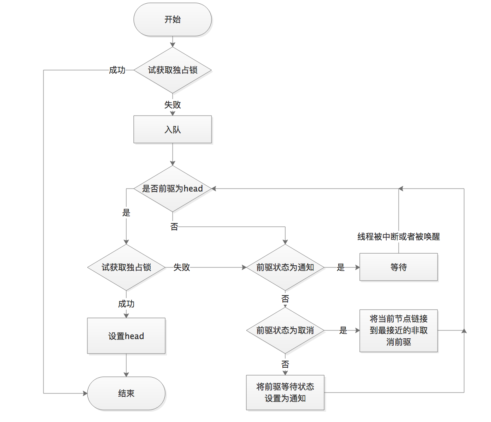

## 并发基础详解

本文从CAS和AbstractQueuedSynchronizer同步器这两部分谈论下并发编程的基础

1. CAS
    1. CAS概念

        CAS:Compare and Swap, 翻译成比较并交换。

        java.util.concurrent包中借助CAS实现了区别于synchronouse同步锁的一种乐观锁。

    2. CAS应用

        CAS有3个操作数，内存值V，旧的预期值A，要修改的新值B。当且仅当预期值A和内存值V相同时，将内存值V修改为B，否则什么都不做。

    3. 非阻塞算法 （nonblocking algorithms）

        一个线程的失败或者挂起不应该影响其他线程的失败或挂起的算法。

        现代的CPU提供了特殊的指令，可以自动更新共享数据，而且能够检测到其他线程的干扰，而 compareAndSet() 就用这些代替了锁定。

        拿出AtomicInteger来研究在没有锁的情况下是如何做到数据正确性的。

        ```java
        private volatile int value;
        ```

        首先毫无以为，在没有锁的机制下可能需要借助volatile原语，保证线程间的数据是可见的（共享的）。这样在获取变量的值的时候才能直接读取。

        ```java
        public final int get() {
            return value;
        }
        ```

        然后来看看++i是怎么做到的。

        ```java
        public final int incrementAndGet() {
            for (;;) {
                int current = get();
                int next = current + 1;
                if (compareAndSet(current, next))
                    return next;
            }
        }
        ```

        在这里采用了CAS操作，每次从内存中读取数据然后将此数据和+1后的结果进行CAS操作，如果成功就返回结果，否则重试直到成功为止。

        而compareAndSet利用JNI来完成CPU指令的操作。

        ```java
        public final boolean compareAndSet(int expect, int update) {
            return unsafe.compareAndSwapInt(this, valueOffset, expect, update);
        }
        ```

        整体的过程就是这样子的，利用CPU的CAS指令，同时借助JNI来完成Java的非阻塞算法。其它原子操作都是利用类似的特性完成的。

        其中

        ```java
        unsafe.compareAndSwapInt(this, valueOffset, expect, update);
        ```

        实现类似：

        ```java
        if (this == expect) {
            this = update;
            return true;
        } else {
            return false;
        }
        ```

        那么问题就来了，成功过程中需要2个步骤：比较this == expect，替换this = update，compareAndSwapInt如何这两个步骤的原子性呢？ 参考CAS的原理。

    4. CAS原理

        CAS通过调用JNI的代码实现的。JNI:Java Native Interface为JAVA本地调用，允许java调用其他语言。而compareAndSwapInt就是借助C来调用CPU底层指令实现的。

        下面从分析比较常用的CPU（intel x86）来解释CAS的实现原理。

        下面是sun.misc.Unsafe类的compareAndSwapInt()方法的源代码：

        ```java
        public final native boolean compareAndSwapInt(Object o, long offset,int expected,int x);
        ```

        可以看到这是个本地方法调用。这个本地方法在openjdk中依次调用的c++代码为：

        * unsafe.cpp
        * atomic.cpp
        * atomicwindowsx86.inline.hpp

        这个本地方法的最终实现在openjdk的如下位置：openjdk-7-fcs-src-b147-27jun2011\openjdk\hotspot\src\oscpu\windowsx86\vm\ atomicwindowsx86.inline.hpp（对应于windows操作系统，X86处理器）。下面是对应于intel x86处理器的源代码的片段：

         ```C
        // Adding a lock prefix to an instruction on MP machine
        // VC++ doesn't like the lock prefix to be on a single line
        // so we can't insert a label after the lock prefix.
        // By emitting a lock prefix, we can define a label after it.
        #define LOCK_IF_MP(mp) __asm cmp mp, 0  \
                            __asm je L0      \
                            __asm _emit 0xF0 \
                            __asm L0:

        inline jint     Atomic::cmpxchg    (jint     exchange_value, volatile jint*     dest, jint     compare_value) {
        // alternative for InterlockedCompareExchange
        int mp = os::is_MP();
        __asm {
                mov edx, dest
                mov ecx, exchange_value
                mov eax, compare_value
                LOCK_IF_MP(mp)
                cmpxchg dword ptr [edx], ecx
            }
        }
        ```

        如上面源代码所示，程序会根据当前处理器的类型来决定是否为cmpxchg指令添加lock前缀。如果程序是在多处理器上运行，就为cmpxchg指令加上lock前缀（lock cmpxchg）。反之，如果程序是在单处理器上运行，就省略lock前缀（单处理器自身会维护单处理器内的顺序一致性，不需要lock前缀提供的内存屏障效果）。

        intel的手册对lock前缀的说明如下：

        1. 确保对内存的读-改-写操作原子执行。

            在Pentium及Pentium之前的处理器中，带有lock前缀的指令在执行期间会锁住总线，使得其他处理器暂时无法通过总线访问内存。很显然，这会带来昂贵的开销。从Pentium 4，Intel Xeon及P6处理器开始，intel在原有总线锁的基础上做了一个很有意义的优化：**如果要访问的内存区域（area of memory）在lock前缀指令执行期间已经在处理器内部的缓存中被锁定（即包含该内存区域的缓存行当前处于独占或以修改状态），并且该内存区域被完全包含在单个缓存行（cache line）中，那么处理器将直接执行该指令。由于在指令执行期间该缓存行会一直被锁定，其它处理器无法读/写该指令要访问的内存区域，因此能保证指令执行的原子性。这个操作过程叫做缓存锁定（cache locking）**，缓存锁定将大大降低lock前缀指令的执行开销，但是当多处理器之间的竞争程度很高或者指令访问的内存地址未对齐时，仍然会锁住总线。

        2. 禁止该指令与之前和之后的读和写指令重排序。

        3. 把写缓冲区中的所有数据刷新到内存中。

        备注知识：

        关于CPU的锁有如下3种：

        1. 处理器自动保证基本内存操作的原子性

            首先处理器会自动保证基本的内存操作的原子性。**处理器保证从系统内存当中读取或者写入一个字节是原子的，意思是当一个处理器读取一个字节时，其他处理器不能访问这个字节的内存地址**。奔腾6和最新的处理器能自动保证单处理器对同一个缓存行里进行16/32/64位的操作是原子的，但是复杂的内存操作处理器不能自动保证其原子性，比如跨总线宽度，跨多个缓存行，跨页表的访问。但是处理器提供总线锁定和缓存锁定两个机制来保证复杂内存操作的原子性。

        2. 使用总线锁保证原子性

            第一个机制是通过总线锁保证原子性。如果多个处理器同时对共享变量进行读改写（i++就是经典的读改写操作）操作，那么共享变量就会被多个处理器同时进行操作，这样读改写操作就不是原子的，操作完之后共享变量的值会和期望的不一致，举个例子：如果i=1,我们进行两次i++操作，我们期望的结果是3，但是有可能结果是2。如下图

            

            原因是有可能多个处理器同时从各自的缓存中读取变量i，分别进行加一操作，然后分别写入系统内存当中。那么想要保证读改写共享变量的操作是原子的，就必须保证CPU1读改写共享变量的时候，CPU2不能操作缓存了该共享变量内存地址的缓存。

            处理器使用总线锁就是来解决这个问题的。所谓总线锁就是使用处理器提供的一个LOCK＃信号，当一个处理器在总线上输出此信号时，其他处理器的请求将被阻塞住,那么该处理器可以独占使用共享内存。

        3. 使用缓存锁保证原子性

            第二个机制是通过缓存锁定保证原子性。在同一时刻我们只需保证对某个内存地址的操作是原子性即可，但总线锁定把CPU和内存之间通信锁住了，这使得锁定期间，其他处理器不能操作其他内存地址的数据，所以总线锁定的开销比较大，最近的处理器在某些场合下使用缓存锁定代替总线锁定来进行优化。

            频繁使用的内存会缓存在处理器的L1，L2和L3高速缓存里，那么原子操作就可以直接在处理器内部缓存中进行，并不需要声明总线锁，在奔腾6和最近的处理器中可以使用“缓存锁定”的方式来实现复杂的原子性。**所谓“缓存锁定”就是如果缓存在处理器缓存行中内存区域在LOCK操作期间被锁定，当它执行锁操作回写内存时，处理器不在总线上声言LOCK＃信号，而是修改内部的内存地址，并允许它的缓存一致性机制来保证操作的原子性**，因为缓存一致性机制会阻止同时修改被两个以上处理器缓存的内存区域数据，当其他处理器回写已被锁定的缓存行的数据时会起缓存行无效，在例1中，当CPU1修改缓存行中的i时使用缓存锁定，那么CPU2就不能同时缓存了i的缓存行。

            但是有两种情况下处理器不会使用缓存锁定。
            * 第一种情况是：当操作的数据不能被缓存在处理器内部，或操作的数据跨多个缓存行（cache line），则处理器会调用总线锁定。
            * 第二种情况是：有些处理器不支持缓存锁定。对于Inter486和奔腾处理器,就算锁定的内存区域在处理器的缓存行中也会调用总线锁定。

            以上两个机制我们可以通过Inter处理器提供了很多LOCK前缀的指令来实现。比如位测试和修改指令BTS，BTR，BTC，交换指令XADD，CMPXCHG和其他一些操作数和逻辑指令，比如ADD（加），OR（或）等，被这些指令操作的内存区域就会加锁，导致其他处理器不能同时访问它。

    5. CAS缺点

        CAS虽然很高效的解决原子操作，但是CAS仍然存在三大问题。ABA问题，循环时间长开销大和只能保证一个共享变量的原子操作。

        1. ABA问题。

            因为CAS需要在操作值的时候检查下值有没有发生变化，如果没有发生变化则更新，但是如果一个值原来是A，变成了B，又变成了A，那么使用CAS进行检查时会发现它的值没有发生变化，但是实际上却变化了。**ABA问题的解决思路就是使用版本号。在变量前面追加上版本号，每次变量更新的时候把版本号加一，那么A－B－A 就会变成1A-2B－3A**。

            从Java1.5开始JDK的atomic包里提供了一个类AtomicStampedReference来解决ABA问题。这个类的compareAndSet方法作用是首先检查当前引用是否等于预期引用，并且当前标志是否等于预期标志，如果全部相等，则以原子方式将该引用和该标志的值设置为给定的更新值。

            关于ABA问题参考文档: http://blog.hesey.net/2011/09/resolve-aba-by-atomicstampedreference.html

        2. 循环时间长开销大。

            自旋CAS如果长时间不成功，会给CPU带来非常大的执行开销。如果JVM能支持处理器提供的pause指令那么效率会有一定的提升，**pause指令**有两个作用

            * 第一它可以延迟流水线执行指令（de-pipeline）,使CPU不会消耗过多的执行资源，延迟的时间取决于具体实现的版本，在一些处理器上延迟时间是零。

            * 第二它可以避免在退出循环的时候因内存顺序冲突（memory order violation）而引起CPU流水线被清空（CPU pipeline flush），从而提高CPU的执行效率。

        3. 只能保证一个共享变量的原子操作。

            **当对一个共享变量执行操作时，我们可以使用循环CAS的方式来保证原子操作，但是对多个共享变量操作时，循环CAS就无法保证操作的原子性**，这个时候就可以用锁，或者有一个取巧的办法，就是把多个共享变量合并成一个共享变量来操作。比如有两个共享变量i＝2,j=a，合并一下ij=2a，然后用CAS来操作ij。从Java1.5开始JDK提供了AtomicReference类来保证引用对象之间的原子性，你可以把多个变量放在一个对象里来进行CAS操作。

2. AbstractQueuedSynchronizer
    
    1. 队列同步器（AQS）

        队列同步器AbstractQueuedSynchronizer（以下简称**同步器**），是用来构建锁或者其他同步组件的基础框架，它使用了一个int成员变量表示同步状态，通过内置的FIFO队列来完成资源获取线程的排队工作，并发包的作者（Doug Lea）期望它能够成为实现大部分同步需求的基础。

    2. AQS的模板方法设计模式

        AQS的设计是使用模板方法设计模式，它将**一些方法开放给子类进行重写，而同步器给同步组件所提供模板方法又会重新调用被子类所重写的方法**。举个例子，AQS中需要重写的方法tryAcquire：
        ```java
        protected boolean tryAcquire(int arg) {
           throw new UnsupportedOperationException();
        }
        ```

        ReentrantLock中NonfairSync（继承AQS）会重写该方法为：
        ```java
        protected final boolean tryAcquire(int acquires) {
            return nonfairTryAcquire(acquires);
        }
        ```

        而AQS中的模板方法acquire():
        ```java
        public final void acquire(int arg) {
            if (!tryAcquire(arg) &&
                acquireQueued(addWaiter(Node.EXCLUSIVE), arg))
                selfInterrupt();
        }
        ```

        会调用tryAcquire方法，而此时当继承AQS的NonfairSync调用模板方法acquire时就会调用已经被NonfairSync重写的tryAcquire方法。这就是使用AQS的方式，在弄懂这点后会在lock的实现理解有很大的提升。可以归纳总结为这么几点：

        1. 同步组件（这里不仅仅指锁，还包括CountDownLatch等）的实现依赖于同步器AQS，在同步组件实现中，使用AQS的方式被推荐定义继承AQS的静态内存类；

        2. AQS采用模板方法进行设计，AQS的protected修饰的方法需要由继承AQS的子类进行重写实现，当调用AQS的子类的方法时就会调用被重写的方法；

        3. AQS负责同步状态的管理，线程的排队，等待和唤醒这些底层操作，而Lock等同步组件主要专注于实现同步语义；

        4. 在重写AQS的方式时，使用AQS提供的getState(),setState(),compareAndSetState()方法进行修改同步状态

        AQS**可重写**的方法如下图（摘自《java并发编程的艺术》一书）：

        * **protected boolean tryAcquire(int arg)**：独占式获取同步状态，实现该方法需要查询当前状态并判断同步状态是否符合预期，然后在进行CAS设置同步状态
       
        * **protected boolean tryRelease(int arg)**：独占式释放同步状态，等待获取同步状态的线程将有机会获取同步状态
        
        * **protected boolean tryAcquireShared(int arg)**：共享式获取同步状态，返回大于等于0的值，表示获取成功，反之，获取失败
        
        * **protected boolean tryReleaseShared(int arg)**：共享式释放同步状态
        
        * **protected boolean isHeldExclusively()**：当前同步器是否在独占式下被线程占用，一般该方法表示是否被当前线程所独占

        在实现同步组件时AQS提供的**模板方法**如下：

        * **void acquire(int arg)**：独占式获取同步状态，如果当前线程获取同步状态成功，则由该方法返回，否则，将会进入同步队列等待，该方法将会调用重写的tryAcquire(int arg)方法
        
        * **void tryAcquireNanos(int arg,long nanos)**：在acquireInterruptibly(int arg)基础上增加了超时限制，如果当前线程在超时时间内没有获取同步状态，那么将返回false，如果获取到了返回true
        
        * **void acquireShared(int arg)**：共享式获取同步状态，如果当前线程获取同步状态，将会进入同步队列等待，与独占式获取的主要区别是在同一时刻可以有多个线程获取到同步状态
        
        * **void acquireSharedInterruptibly(int arg)**：与acquireShared(int arg)相同，该方法响应中断
        
        * **void tryAcquireSharedNanos(int arg,long nanos)**：在acquireSharedInterruptibly(int arg)基础上增加了超时限制

        * **void release(int arg)**：独占式的释放同步状态，该方法会在释放同步状态之后，将同步队列中第一个节点包含的线程唤醒

        * **void releaseShared(int arg)**：共享式的释放同步状态

        * **Collection\<Thread\> getQueuedThreads**：获取等待在同步队列上的线程集合

        AQS提供的模板方法可以分为3类：

        * 独占式获取与释放同步状态；
        * 共享式获取与释放同步状态；
        * 查询同步队列中等待线程情况；
        
        同步组件通过AQS提供的模板方法实现自己的同步语义。

    

    3. 同步器的基本结构

        当共享资源被某个线程占有，其他请求该资源的线程将会阻塞，从而进入同步队列。就数据结构而言，队列的实现方式无外乎两者一是通过数组的形式，另外一种则是链表的形式。AQS中的同步队列则是通过链式方式（一个FIFO双向队列）进行实现。同步队列中的节点（Node）用来保存"获取同步状态失败的线程"引用、等待状态以及前驱和后继节点。

        同步器包含了两个节点类型的引用，一个指向头节点，而另一个指向尾节点。

        ```java
        public abstract class AbstractQueuedSynchronizer extends AbstractOwnableSynchronizer  
            implements java.io.Serializable {  
            ......  
            private transient volatile Node head;//头节点  
            private transient volatile Node tail;//尾节点  
            private volatile int state;//*同步状态*  
            ......  
            static final class Node {  
                volatile int waitStatus;//等待状态  
                volatile Node prev;//前驱  
                volatile Node next;//后继  
                volatile Thread thread;//线程引用  

                
                int CANCELLED =  1//当前线程因为超时或者中断被取消。这是一个终结态，也就是状态到此为止
                int SIGNAL    = -1//当前线程的后继线程被阻塞或者即将被阻塞，当前线程释放锁或者取消后需要唤醒后继线程。这个状态一般都是后继线程来设置前驱节点的
                int CONDITION = -2//当前节点进入等待队列中
                int PROPAGATE = -3//表示下一次共享式同步状态获取将会无条件传播下去
                                  //0初始状态
                ......  
            }  
            ......  
        }   
        ```

        


        上图为自制的AQS状态的流转图，AQS中0状态和CONDITION状态为始态，CANCELLED状态为终态。0状态同时也可以是节点生命周期的终态。
        **注意，上图仅表示状态之间流转的可达性，并不代表一定能够从一个状态沿着线随意跃迁。**

        在AQS中包含了head和tail两个Node引用，其中head在逻辑上的含义是当前持有锁的线程，head节点实际上是一个虚节点，本身并不会存储线程信息。
        当一个线程无法获取锁而被加入到同步队列时，会用CAS来设置尾节点tail为当前线程对应的Node节点。
        head和tail在AQS中是延迟初始化的，也就是在需要的时候才会被初始化，也就意味着在所有线程都能获取到锁的情况下，队列中的head和tail都会是null。

        注：Node类型的prev、next属性以及AbstractQueuedSynchronizer类型的head 、tail属性都设置为volatile，保证可见性。

        

    4. 源码分析

        1. 获取独占锁的实现

            下面来具体看看acquire(int arg)的实现：

            ```java
            /**
            * 获取独占锁，对中断不敏感。
            * 首先尝试获取一次锁，如果成功，则返回；
            * 否则会把当前线程包装成Node插入到队列中，在队列中会检测是否为head的直接后继，并尝试获取锁,
            * 如果获取失败，则会通过LockSupport阻塞当前线程，直至被释放锁的线程唤醒或者被中断，随后再次尝试获取锁，如此反复。
            */
            public final void acquire(int arg) {
                if (!tryAcquire(arg) &&
                    acquireQueued(addWaiter(Node.EXCLUSIVE), arg))
                    selfInterrupt();
            }

            /**
            * 在队列中新增一个节点。
            */
            private Node addWaiter(Node mode) {
                Node node = new Node(Thread.currentThread(), mode);
                Node pred = tail;
                // 快速尝试
                if (pred != null) {
                    node.prev = pred;
                    // 通过CAS在队尾插入当前节点
                    if (compareAndSetTail(pred, node)) {
                        pred.next = node;
                        return node;
                    }
                }
                // 初始情况或者在快速尝试失败后插入节点
                enq(node);
                return node;
            }

            /**
            * 通过循环+CAS在队列中成功插入一个节点后返回。
            */
            private Node enq(final Node node) {
                for (;;) {
                    Node t = tail;
                    // 初始化head和tail
                    if (t == null) {
                        if (compareAndSetHead(new Node()))
                            tail = head;
                    } else {
                        /*
                        * AQS的精妙就是体现在很多细节的代码，比如需要用CAS往队尾里增加一个元素
                        * 此处的else分支是先在CAS的if前设置node.prev = t，而不是在CAS成功之后再设置。
                        * 一方面是基于CAS的双向链表插入目前没有完美的解决方案，另一方面这样子做的好处是：
                        * 保证每时每刻tail.prev都不会是一个null值，否则如果node.prev = t
                        * 放在下面if的里面，会导致一个瞬间tail.prev = null，这样会使得队列不完整。
                        */
                        node.prev = t;
                        // CAS设置tail为node，成功后把老的tail也就是t连接到node。
                        if (compareAndSetTail(t, node)) {
                            t.next = node;
                            return t;
                        }
                    }
                }
            }

            /**
            * 在队列中的节点通过此方法获取锁，对中断不敏感。
            */
            final boolean acquireQueued(final Node node, int arg) {
                boolean failed = true;
                try {
                    boolean interrupted = false;
                    for (;;) {
                        final Node p = node.predecessor();
                        /*
                        * 检测当前节点前驱是否head，这是试获取锁的资格。
                        * 如果是的话，则调用tryAcquire尝试获取锁,
                        * 成功，则将head置为当前节点。
                        */
                        if (p == head && tryAcquire(arg)) {
                            setHead(node);
                            p.next = null; // help GC
                            failed = false;
                            return interrupted;
                        }
                        /*
                        * 如果未成功获取锁则根据前驱节点判断是否要阻塞。
                        * 如果阻塞过程中被中断，则置interrupted标志位为true。
                        * shouldParkAfterFailedAcquire方法在前驱状态不为SIGNAL的情况下都会循环重试获取锁。
                        */
                        if (shouldParkAfterFailedAcquire(p, node) &&
                            parkAndCheckInterrupt())
                            interrupted = true;
                    }
                } finally {
                    if (failed)
                        cancelAcquire(node);
                }
            }

            /**
            * 根据前驱节点中的waitStatus来判断是否需要阻塞当前线程。
            */
            private static boolean shouldParkAfterFailedAcquire(Node pred, Node node) {
                int ws = pred.waitStatus;
                if (ws == Node.SIGNAL)
                    /*
                    * 前驱节点设置为SIGNAL状态，在释放锁的时候会唤醒后继节点，
                    * 所以后继节点（也就是当前节点）现在可以阻塞自己。
                    */
                    return true;
                if (ws > 0) {
                    /*
                    * 前驱节点状态为取消,向前遍历，更新当前节点的前驱为往前第一个非取消节点。
                    * 当前线程会之后会再次回到循环并尝试获取锁。
                    */
                    do {
                        node.prev = pred = pred.prev;
                    } while (pred.waitStatus > 0);
                    pred.next = node;
                } else {
                    /**
                    * 等待状态为0或者PROPAGATE(-3)，设置前驱的等待状态为SIGNAL,
                    * 并且之后会回到循环再次重试获取锁。
                    */
                    compareAndSetWaitStatus(pred, ws, Node.SIGNAL);
                }
                return false;
            }

            private final boolean parkAndCheckInterrupt() {
                LockSupport.park(this);//调用park()使线程进入waiting状态
                return Thread.interrupted();//如果被唤醒，查看自己是不是被中断的。
            }

            /**
            * 该方法实现某个node取消获取锁。
            */
            private void cancelAcquire(Node node) {

                if (node == null)
                    return;

                node.thread = null;

                // 遍历并更新节点前驱，把node的prev指向前部第一个非取消节点。
                Node pred = node.prev;
                while (pred.waitStatus > 0)
                    node.prev = pred = pred.prev;

                // 记录pred节点的后继为predNext，后续CAS会用到。
                Node predNext = pred.next;

                // 直接把当前节点的等待状态置为取消,后继节点即便也在cancel可以跨越node节点。
                node.waitStatus = Node.CANCELLED;

                /*
                    * 如果CAS将tail从node置为pred节点了
                    * 则剩下要做的事情就是尝试用CAS将pred节点的next更新为null以彻底切断pred和node的联系。
                    * 这样一来就断开了pred与pred的所有后继节点，这些节点由于变得不可达，最终会被回收掉。
                    * 由于node没有后继节点，所以这种情况到这里整个cancel就算是处理完毕了。
                    *
                    * 这里的CAS更新pred的next即使失败了也没关系，说明有其它新入队线程或者其它取消线程更新掉了。
                    */
                if (node == tail && compareAndSetTail(node, pred)) {
                    compareAndSetNext(pred, predNext, null);
                } else {
                    // 如果node还有后继节点，这种情况要做的事情是把pred和后继非取消节点拼起来。
                    int ws;
                    if (pred != head &&
                        ((ws = pred.waitStatus) == Node.SIGNAL ||
                            (ws <= 0 && compareAndSetWaitStatus(pred, ws, Node.SIGNAL))) &&
                        pred.thread != null) {
                        Node next = node.next;
                        /* 
                            * 如果node的后继节点next非取消状态的话，则用CAS尝试把pred的后继置为node的后继节点
                            * 这里if条件为false或者CAS失败都没关系，这说明可能有多个线程在取消，总归会有一个能成功的。
                            */
                        if (next != null && next.waitStatus <= 0)
                            compareAndSetNext(pred, predNext, next);
                    } else {
                        /*
                            * 这时说明pred == head或者pred状态取消或者pred.thread == null
                            * 在这些情况下为了保证队列的活跃性，需要去唤醒一次后继线程。
                            * 举例来说pred == head完全有可能实际上目前已经没有线程持有锁了，
                            * 自然就不会有释放锁唤醒后继的动作。如果不唤醒后继，队列就挂掉了。
                            * 
                            * 这种情况下看似由于没有更新pred的next的操作，队列中可能会留有一大把的取消节点。
                            * 实际上不要紧，因为后继线程唤醒之后会走一次试获取锁的过程，
                            * 失败的话会走到shouldParkAfterFailedAcquire的逻辑。
                            * 那里面的if中有处理前驱节点如果为取消则维护pred/next,踢掉这些取消节点的逻辑。
                            */
                        unparkSuccessor(node);
                    }
                    
                    /*
                        * 取消节点的next之所以设置为自己本身而不是null,
                        * 是为了方便AQS中Condition部分的isOnSyncQueue方法,
                        * 判断一个原先属于条件队列的节点是否转移到了同步队列。
                        *
                        * 因为同步队列中会用到节点的next域，取消节点的next也有值的话，
                        * 可以断言next域有值的节点一定在同步队列上。
                        *
                        * 在GC层面，和设置为null具有相同的效果。
                        */
                    node.next = node; 
                }
            }

            /**
            * 唤醒后继线程。
            */
            private void unparkSuccessor(Node node) {
                int ws = node.waitStatus;
                // 尝试将node的等待状态置为0,这样的话,后继争用线程可以有机会再尝试获取一次锁。
                if (ws < 0)
                    compareAndSetWaitStatus(node, ws, 0);

                Node s = node.next;
                /*
                * 这里的逻辑就是如果node.next存在并且状态不为取消，则直接唤醒s即可
                * 否则需要从tail开始向前找到node之后最近的非取消节点。
                *
                * 这里为什么要从tail开始向前查找也是值得琢磨的:
                * 如果读到s == null，不代表node就为tail，参考addWaiter以及enq函数中的我的注释。
                * 不妨考虑到如下场景：
                * 1. node某时刻为tail
                * 2. 有新线程通过addWaiter中的if分支或者enq方法添加自己
                * 3. compareAndSetTail成功
                * 4. 此时这里的Node s = node.next读出来s == null，但事实上node已经不是tail，它有后继了!
                */
                if (s == null || s.waitStatus > 0) {
                    s = null;
                    for (Node t = tail; t != null && t != node; t = t.prev)
                        if (t.waitStatus <= 0)
                            s = t;
                }
                if (s != null)
                    LockSupport.unpark(s.thread);
            }
            ```

            AQS独占锁的获取的流程示意如下：

            

        2. 释放独占锁的实现

            上面已经分析了acquire的实现，下面来看看release的实现：
            对于释放一个独占锁，首先会调用tryRelease，在完全释放掉独占锁后，这时后继线程是可以获取到独占锁的，
            因此释放者线程需要做的事情是唤醒一个队列中的后继者线程，让它去尝试获取独占锁。

            上述所谓完全释放掉锁的含义，简单来说就是当前锁处于无主状态，等待线程有可能可以获取。
            举例：对于可重入锁ReentrantLock, 每次tryAcquire后，state会+1，每次tryRelease后，state会-1，如果state变为0了，则此时称独占锁被完全释放了。

            下面，我们来看一下release的具体代码实现：

            ```java
            public final boolean release(int arg) {
                if (tryRelease(arg)) {
                    /*
                    * 此时的head节点可能有3种情况:
                    * 1. null (AQS的head延迟初始化+无竞争的情况)
                    * 2. 当前线程在获取锁时new出来的节点通过setHead设置的
                    * 3. 由于通过tryRelease已经完全释放掉了独占锁，有新的节点在acquireQueued中获取到了独占锁，并设置了head

                    * 第三种情况可以再分为两种情况：
                    * （一）时刻1:线程A通过acquireQueued，持锁成功，set了head
                    *          时刻2:线程B通过tryAcquire试图获取独占锁失败失败，进入acquiredQueued
                    *          时刻3:线程A通过tryRelease释放了独占锁
                    *          时刻4:线程B通过acquireQueued中的tryAcquire获取到了独占锁并调用setHead
                    *          时刻5:线程A读到了此时的head实际上是线程B对应的node
                    * （二）时刻1:线程A通过tryAcquire直接持锁成功，head为null
                    *          时刻2:线程B通过tryAcquire试图获取独占锁失败失败，入队过程中初始化了head，进入acquiredQueued
                    *          时刻3:线程A通过tryRelease释放了独占锁，此时线程B还未开始tryAcquire
                    *          时刻4:线程A读到了此时的head实际上是线程B初始化出来的傀儡head
                    */
                    Node h = head;
                    // head节点状态不会是CANCELLED，所以这里h.waitStatus != 0相当于h.waitStatus < 0
                    if (h != null && h.waitStatus != 0)
                        // 唤醒后继线程，此函数在acquire中已经分析过，不再列举说明
                        unparkSuccessor(h);
                    return true;
                }
                return false;
            }
            ```
            整个release做的事情就是
            1. 调用tryRelease
            2. 如果tryRelease返回true也就是独占锁被完全释放，唤醒后继线程。
                这里的唤醒是根据head几点来判断的，上面代码的注释中也分析了head节点的情况，只有在head存在并且等待状态小于零的情况下唤醒。

        3. 获取共享锁的实现

            与获取独占锁的实现不同的关键在于，共享锁允许多个线程持有。
            如果需要使用AQS中共享锁，在实现tryAcquireShared方法时需要注意，返回负数表示获取失败;返回0表示成功，但是后继争用线程不会成功;返回正数表示
            获取成功，并且后继争用线程也可能成功。

            下面来看一下具体的代码实现：

            ```java
            public final void acquireShared(int arg) {
                if (tryAcquireShared(arg) < 0)
                    doAcquireShared(arg);
            }

            private void doAcquireShared(int arg) {
                final Node node = addWaiter(Node.SHARED);
                boolean failed = true;
                try {
                    boolean interrupted = false;
                    for (;;) {
                        final Node p = node.predecessor();
                        if (p == head) {
                            int r = tryAcquireShared(arg);
                            // 一旦共享获取成功，设置新的头结点，并且唤醒后继线程
                            if (r >= 0) {
                                setHeadAndPropagate(node, r);
                                p.next = null; // help GC
                                if (interrupted)
                                    selfInterrupt();
                                failed = false;
                                return;
                            }
                        }
                        if (shouldParkAfterFailedAcquire(p, node) &&
                            parkAndCheckInterrupt())
                            interrupted = true;
                    }
                } finally {
                    if (failed)
                        cancelAcquire(node);
                }
            }

            /**
            * 这个函数做的事情有两件:
            * 1. 在获取共享锁成功后，设置head节点
            * 2. 根据调用tryAcquireShared返回的状态以及节点本身的等待状态来判断是否要需要唤醒后继线程。
            */
            private void setHeadAndPropagate(Node node, int propagate) {
                // 把当前的head封闭在方法栈上，用以下面的条件检查。
                Node h = head;
                setHead(node);
                /*
                * propagate是tryAcquireShared的返回值，这是决定是否传播唤醒的依据之一。
                * h.waitStatus为SIGNAL或者PROPAGATE时也根据node的下一个节点共享来决定是否传播唤醒，
                * 这里为什么不能只用propagate > 0来决定是否可以传播在本文下面的思考问题中有相关讲述。
                */
                if (propagate > 0 || h == null || h.waitStatus < 0 ||
                    (h = head) == null || h.waitStatus < 0) {
                    Node s = node.next;
                    if (s == null || s.isShared())
                        doReleaseShared();
                }
            }

            /**
            * 这是共享锁中的核心唤醒函数，主要做的事情就是唤醒下一个线程或者设置传播状态。
            * 后继线程被唤醒后，会尝试获取共享锁，如果成功之后，则又会调用setHeadAndPropagate,将唤醒传播下去。
            * 这个函数的作用是保障在acquire和release存在竞争的情况下，保证队列中处于等待状态的节点能够有办法被唤醒。
            */
            private void doReleaseShared() {
                /*
                * 以下的循环做的事情就是，在队列存在后继线程的情况下，唤醒后继线程；
                * 或者由于多线程同时释放共享锁由于处在中间过程，读到head节点等待状态为0的情况下，
                * 虽然不能unparkSuccessor，但为了保证唤醒能够正确稳固传递下去，设置节点状态为PROPAGATE。
                * 这样的话获取锁的线程在执行setHeadAndPropagate时可以读到PROPAGATE，从而由获取锁的线程去释放后继等待线程。
                */
                for (;;) {
                    Node h = head;
                    // 如果队列中存在后继线程。
                    if (h != null && h != tail) {
                        int ws = h.waitStatus;
                        if (ws == Node.SIGNAL) {
                            if (!compareAndSetWaitStatus(h, Node.SIGNAL, 0))
                                continue;
                            unparkSuccessor(h);
                        }
                        // 如果h节点的状态为0，需要设置为PROPAGATE用以保证唤醒的传播。
                        else if (ws == 0 &&
                                !compareAndSetWaitStatus(h, 0, Node.PROPAGATE))
                            continue;
                    }
                    // 检查h是否仍然是head，如果不是的话需要再进行循环。
                    if (h == head)
                        break;
                }
            }
            ```

        4. 释放共享锁的实现

            释放共享锁与获取共享锁的代码共享了doReleaseShared，用于实现唤醒的传播。
            
            ```java
            public final boolean releaseShared(int arg) {
                if (tryReleaseShared(arg)) {
                    // doReleaseShared的实现上面获取共享锁已经介绍
                    doReleaseShared();
                    return true;
                }
                return false;
            }
            ```


    5. 一些思考

        AQS的代码实在是很精妙，要看懂大致套路并不困难，但是要完全领悟其中的一些细节是一件需要花功夫来仔细琢磨品味的事情。
        
        下面列出一些看源码时的问题与思考:

        1. 插入节点时的代码顺序

            addWaiter和enq方法中新增一个节点时为什么要先将新节点的prev置为tail再尝试CAS，而不是CAS成功后来构造节点之间的双向链接?
            
            这是因为，双向链表目前没有基于CAS原子插入的手段，如果我们将**node.prev = t**和**t.next = node**（t为方法执行时读到的tail，引用封闭在栈上）放到compareAndSetTail(t, node)成功后执行，如下所示：

            ```java
            if (compareAndSetTail(t, node)) {
                node.prev = t;
                t.next = node;
                return t;
            }
            ```

            会导致这一瞬间的tail也就是t的prev为null，这就使得这一瞬间队列处于一种不一致的中间状态。

        2. 唤醒节点时为什么从tail向前遍历

            unparkSuccessor方法中为什么唤醒后继节点时要从tail向前查找最接近node的非取消节点，而不是直接从node向后找到第一个后break掉?

            在上面的代码注释中已经提及到这一点：
            如果读到s == null，不代表node就为tail。
            考虑如下场景：

            1. node某时刻为tail
            2. 有新线程通过addWaiter中的if分支或者enq方法添加自己
            3. compareAndSetTail成功
            4. 此时这里的Node s = node.next读出来s == null，**但事实上node已经不是tail，它有后继了!**

        3. unparkSuccessor有新线程争锁是否存在漏洞

            unparkSuccessor方法在被release调用时是否存在这样的一个漏洞?
            * 时刻1: node -> tail && tail.waitStatus == Node.CANCELLED (node的下一个节点为tail，并且tail处于取消状态)
            * 时刻2: unparkSuccessor读到s.waitStatus > 0
            * 时刻3: unparkSuccessor从tail开始遍历
            * 时刻4: tail节点对应线程执行cancelAcquire方法中的if (node == tail && compareAndSetTail(node, pred)) 返回true,
            此时tail变为pred(也就是node)
            * 时刻5: 有新线程进队列tail变为新节点
            * 时刻6: unparkSuccessor没有发现需要唤醒的节点

            最终新节点阻塞并且前驱节点结束调用，新节点再也无法被unpark
            这种情况不会发生,确实可能出现从tail向前扫描，没有读到新入队的节点，但别忘了acquireQueued的思想就是不断循环检测是否能够独占获取锁，否则再进行判断是否要阻塞自己，而release的第一步就是tryRelease，它的语义为true表示完全释放独占锁，完全释放之后才会执行后面的逻辑，也就是unpark后继线程。在这种情况下，新入队的线程应当能获取到锁。如果没有获取锁，则必然是在覆盖tryAcquire/tryRelease的实现有问题，导致前驱节点成功释放了独占锁，后继节点获取独占锁仍然失败。也就是说AQS框架的可靠性还在某些程度上依赖于具体子类的实现，子类实现如果有bug，那AQS再精巧也扛不住。

        4. AQS如何保证队列活跃

            AQS如何保证在节点释放的同时又有新节点入队的情况下，不出现原持锁线程释放锁，后继线程被自己阻塞死的情况,保持同步队列的活跃？

            回答这个问题，需要理解shouldParkAfterFailedAcquire和unparkSuccessor这两个方法。

            以独占锁为例，后继争用线程阻塞自己的情况是读到前驱节点的等待状态为SIGNAL,只要不是这种情况都会再试着去争取锁。
            假设后继线程读到了前驱状态为SIGNAL，说明之前在tryAcquire的时候，前驱持锁线程还没有tryRelease完全释放掉独占锁。
            此时如果前驱线程完全释放掉了独占锁，则在unparkSuccessor中还没执行完置waitStatus为0的操作，也就是还没执行到下面唤醒后继线程的代码，否则后继线程会再去争取锁。

            那么就算后继争用线程此时把自己阻塞了，也一定会马上被前驱线程唤醒。

            那么是否可能持锁线程执行唤醒后继线程的逻辑时，后继线程读到前驱等待状态为SIGNAL把自己给阻塞，再也无法苏醒呢？

            这个问题在上面的问题3中已经有答案了，确实可能在扫描后继需要唤醒线程时读不到新来的线程，但只要tryRelease语义实现正确，在true时表示完全释放独占锁，
            则后继线程理应能够tryAcquire成功，shouldParkAfterFailedAcquire在读到前驱状态不为SIGNAL会给当前线程再一次获取锁的机会的。

            别看AQS代码写的有些复杂，状态有些多，还真的就是没毛病，各种情况都能覆盖。

        5. PROPAGATE状态存在的意义

            在setHeadAndPropagate中我们可以看到如下的一段代码:

            if (propagate > 0 || h == null || h.waitStatus < 0 ||
                (h = head) == null || h.waitStatus < 0) {
                Node s = node.next;
                if (s == null || s.isShared())
                    doReleaseShared();
            }
            为什么不只是用propagate > 0来判断呢？我们知道目前AQS代码中的Node.PROPAGATE状态就是为了此处可以读取到h.waitStatus < 0（PROPAGATE值为-3）；如果这里可以只用propagate > 0来判断，是否PROPAGATE状态都没有存在的必要了？

            我接触JAVA比较晚，接触的时候就已经是JDK8的年代了。这个问题我思考了很久，没有想到很合理的解释来说明PROPAGATE状态存在的必要性。
            在网上也鲜少有相关方面的资料、博客提及到这些。后来通过浏览Doug Lea的个人网站，发现在很久以前AQS的代码确实是没有PROPAGATE的，PROPAGATE的引入是为了解决共享锁并发释放导致的线程hang住问题。

      6. AQS如何防止内存泄露

        AQS维护了一个FIFO队列，它是如何保证在运行期间不发生内存泄露的？
        AQS在无竞争条件下，甚至都不会new出head和tail节点。
        线程成功获取锁时设置head节点的方法为setHead，由于头节点的thread并不重要，此时会置node的thread和prev为null，完了之后还会置原先head也就是线程对应node的前驱的next为null，从而实现队首元素的安全移出。
        而在取消节点时，也会令node.thread = null，在node不为tail的情况下，会使node.next = node（之所以这样也是为了isOnSyncQueue实现更加简洁）

#### concurrent包的实现

由于java的CAS同时具有 volatile 读和volatile写的内存语义，因此Java线程之间的通信现在有了下面四种方式：

1. A线程写volatile变量，随后B线程读这个volatile变量。
2. A线程写volatile变量，随后B线程用CAS更新这个volatile变量。
3. A线程用CAS更新一个volatile变量，随后B线程用CAS更新这个volatile变量。
4. A线程用CAS更新一个volatile变量，随后B线程读这个volatile变量。

Java的CAS会使用现代处理器上提供的高效机器级别原子指令，这些原子指令以原子方式对内存执行读-改-写操作，这是在多处理器中实现同步的关键（从本质上来说，能够支持原子性读-改-写指令的计算机器，是顺序计算图灵机的异步等价机器，因此任何现代的多处理器都会去支持某种能对内存执行原子性读-改-写操作的原子指令）。同时，volatile变量的读/写和CAS可以实现线程之间的通信。把这些特性整合在一起，就形成了整个concurrent包得以实现的基石。如果我们仔细分析concurrent包的源代码实现，会发现一个通用化的实现模式：

1. 首先，声明共享变量为volatile；
2. 然后，使用CAS的原子条件更新来实现线程之间的同步；
3. 同时，配合以volatile的读/写和CAS所具有的volatile读和写的内存语义来实现线程之间的通信。

AQS，非阻塞数据结构和原子变量类（java.util.concurrent.atomic包中的类），这些concurrent包中的基础类都是使用这种模式来实现的，而concurrent包中的高层类又是依赖于这些基础类来实现的。从整体来看，concurrent包的实现示意图如下：


原文：http://www.cnblogs.com/kisty/p/5408264.html
https://www.jianshu.com/p/7a65ab32de2a
https://www.cnblogs.com/micrari/p/6937995.html
https://blog.csdn.net/summer_yuxia/article/details/71452310
https://www.cnblogs.com/waterystone/p/4920797.html