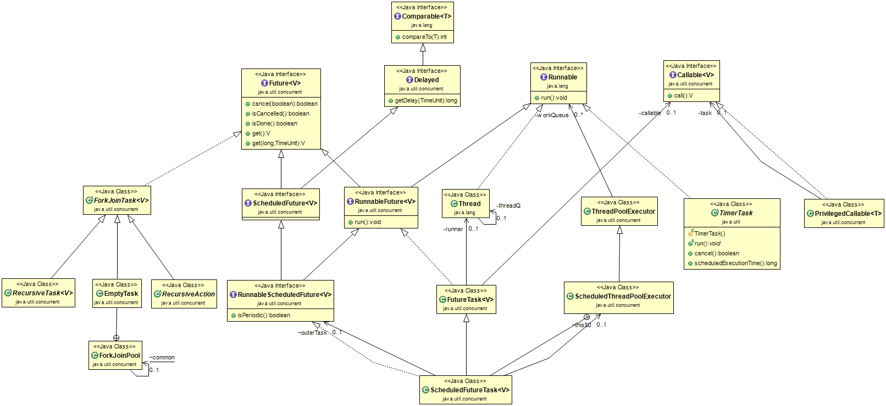

## 线程

线程在java并发编程中极为重要，本文就以线程作为核心谈论下相关的类和接口应用，其继承关系如图



1. **Future**

    Future，表示异步计算的结果，该接口提供的方法主要为了检查计算是否完成，等待完成，从计算中获取结果。

    方法|说明
    --|--
    boolean cancel(boolean mayInterruptIfRunning)|试图取消此任务的执行。如果任务已经完成、已经被取消或由于其他原因无法取消，则此尝试将失败。如果成功，并且在调用cancel时此任务尚未启动，则永远不应该运行此任务。如果任务已经启动，那么mayInterruptIfRunning参数决定执行该任务的线程是否应该在试图停止该任务时被中断。
    boolean isCancelled()|任务完成前，是否被取消
    boolean isDone()|如果任务已完成，则返回true
    V get()|如果需要，等待计算完成，然后检索其结果
    V get(long timeout, TimeUnit unit)|如果需要，则在给定的时间内等待计算完成，如果可用，则检索其结果。

    1. <span id="ScheduledFuture">**ScheduledFuture**</span>

        ScheduledFuture，延迟产生结果的动作可以被取消，通常，调度的Future是使用ScheduledExecutorService调度任务的结果。

        >此接口同时继承了接口[Delay](#Delay)。

        1. <span id="RunnableScheduledFuture">**RunnableScheduledFuture**</span>

            一个可执行的ScheduledFuture，run方法的成功执行将导致Future的完成，并允许访问其结果。

            >此接口同时继承了接口[RunnableFuture](#RunnableFuture)。

            方法|说明
            --|--
            boolean isPeriodic()|如果此任务是周期性的，则返回true。一个周期性的任务可能会根据某个时间表重新运行。非周期性任务只能执行一次。

    2. <span id="RunnableFuture">**RunnableFuture**</span>

        一个可执行的Future，run方法的成功执行将导致Future的完成，并允许访问其结果。
        
        >此接口同时继承了接口[Runnable](#Runnable)。

        方法|说明
        --|--
        void run()|将这个future设置为其计算结果，除非它已被取消。

        1. [RunnableScheduledFuture](#RunnableScheduledFuture)

        2. <span id="FutureTask">FutureTask</span>

            一个可取消的异步计算任务，提供了一个基本的Future的实现，可以启动或取消任务，如果任务完成可以取回结果。只有当任务完成才能取回结果，在完成前调用get方法会阻塞，一旦完成，任务就不能重新开始或取消除非任务本身调用runAndReset。

            FutureTask可以用来包装一个可调用的或可运行的对象。因为FutureTask实现Runnable，所以可以将FutureTask提交给Executor执行。

            >此类同时继承了接口[Callable](#Callable)。


            方法|说明
            --|--
            FutureTask(Runnable runnable, V result)|创建一个FutureTask，它将在运行时执行给定的Runnable，并安排get在成功完成时返回给定的结果，内部也是把runnable封装成callable，且callable的返回就是result。
            FutureTask(Callable<V> callable)|创建一个FutureTask，它将在运行时执行给定的Callable
            void run()|主要执行内部callable对象call()方法
            void finishCompletion()|移除并唤醒所有等待线程，调用done()方法, 设置callable为null，这是为了防止任务再次被执行
            void done()|默认什么也不做，子类继承FutureTask时，可以重写done方法，那么finishCompletion执行到最后会调用done()

            FutureTask的state枚举值

            * NEW(新建)          -> 0
            * COMPLETING(执行中)   -> 1      
            * NORMAL(完成)       -> 2
            * EXCEPTIONAL(异常)  -> 3
            * CANCELLED(取消)    -> 4
            * INTERRUPTING(中断中) -> 5
            * INTERRUPTED(被中断)  -> 6

            FutureTask的state状态转换
            * NEW -> COMPLETING -> NORMAL
            * NEW -> COMPLETING -> EXCEPTIONAL
            * NEW -> CANCELLED
            * NEW -> INTERRUPTING -> INTERRUPTED

            ```java
            import java.util.concurrent.Callable;
            import java.util.concurrent.ExecutionException;
            import java.util.concurrent.ExecutorService;
            import java.util.concurrent.Executors;
            import java.util.concurrent.FutureTask;

            public class FutureDemo {

                public static void main(String[] args) {
                    Task task = new Task();// 新建异步任务
                    FutureTask<Integer> future = new FutureTask<Integer>(task) {
                        // 异步任务执行完成，回调
                        @Override
                        protected void done() {
                            try {
                                System.out.println("future.done():" + get());
                            } catch (InterruptedException e) {
                                e.printStackTrace();
                            } catch (ExecutionException e) {
                                e.printStackTrace();
                            }
                        }
                    };
                    // 创建线程池（使用了预定义的配置）
                    ExecutorService executor = Executors.newCachedThreadPool();
                    executor.execute(future);

                    try {
                        Thread.sleep(1000);
                    } catch (InterruptedException e1) {
                        e1.printStackTrace();
                    }
                    // 可以取消异步任务
                    // future.cancel(true);

                    try {
                        // 阻塞，等待异步任务执行完毕-获取异步任务的返回值
                        System.out.println("future.get():" + future.get());
                    } catch (InterruptedException e) {
                        e.printStackTrace();
                    } catch (ExecutionException e) {
                        e.printStackTrace();
                    }
                }

                // 异步任务
                static class Task implements Callable<Integer> {
                    // 返回异步任务的执行结果
                    @Override
                    public Integer call() throws Exception {
                        int i = 0;
                        for (; i < 10; i++) {
                            try {
                                System.out.println(Thread.currentThread().getName() + "_" + i);
                                Thread.sleep(500);
                            } catch (InterruptedException e) {
                                e.printStackTrace();
                            }
                        }
                        return i;
                    }
                }
            }
            ```

    3. *ForkJoinTask*


2. <span id="Delay">**Delayed**</span>

    Delayed，一种混合风格的接口，用于标记在给定延迟之后应该执行的对象。
    此接口的实现必须定义一个compareTo方法，该方法提供与其getDelay方法一致的顺序。

    方法|说明
    --|--
    long getDelay(TimeUnit unit)|在给定的时间单位内返回与此对象关联的剩余延迟。

    1. [ScheduledFuture](#ScheduledFuture)


3. <span id="Runnable">**Runnable**<span id="Runnable">

    Runnable，应该由其实例打算由线程执行的任何类实现，定义了一个方法。
    
    方法|说明
    --|--
    void run()|当一个对象实现接口Runnable被用来创建一个线程时，启动线程会导致对象的run方法在单独的执行线程中被调用。
    1. [RunnableFuture](#RunnableFuture)
    2. Thread

        Thread，线程是程序中执行的线程。java虚拟机允许应用程序同时运行多个执行线程。
        
        * 每个线程都有一个优先级，优先级较高的线程优先于优先级较低的线程执行。父线程创建子线程，子线程的优先级默认和父线程一样。

        * 每个线程也可以标记为守护进程，也可以不标记为守护进程。当Java虚拟机启动时，通常有一个单线程守护进程线程(它通常调用一些指定类的名为main的方法)。Java虚拟机继续执行线程，直到下列情况之一发生:

            1. Runtime类调用了exit方法且并且安全管理器允许执行exit操作。
            2. 不是守护进程线程的所有线程都已死亡，要么从对run方法的调用返回，要么抛出一个在run方法之外传播的异常。
        
        * 有两种方法可以创建新的执行线程。
            
            1. 将一个类声明为Thread的子类。这个子类应该覆盖类Thread的run方法。
                
                ```java
                class PrimeThread extends Thread {
                    long minPrime;
                    PrimeThread(long minPrime) {
                        this.minPrime = minPrime;
                    }

                    public void run() {
                        // compute primes larger than minPrime
                        . . .
                    }

                    public static void main(String[] args) {
                        PrimeThread p = new PrimeThread(143);
                        p.start();
                    }
                }
                ```

            2. 创建线程的另一种方法是声明一个实现Runnable接口的类。然后该类实现run方法。然后可以分配类的实例，在创建线程时作为参数传递，并启动它。

                ```java
                class PrimeRun implements Runnable {
                    long minPrime;
                    PrimeRun(long minPrime) {
                        this.minPrime = minPrime;
                    }

                    public void run() {
                        // compute primes larger than minPrime
                        . . .
                    }

                    public static void main(String[] args) {
                        PrimeRun p = new PrimeRun(143);
                        new Thread(p).start();
                    }
                }
                ```

        

        方法|说明
        --|--
        Thread()|分配一个新的线程对象，且默认线程名称为Thread-N
        Thread(Runnable target)|分配一个新的线程对象，且默认线程名称为Thread-N，且设置内部的Runnable
        Thread(Runnable target, AccessControlContext acc)|创建一个继承给定AccessControlContext的新线程。这不是一个公共构造函数。


    3. [ThreadPoolExecutor](#Java-并发编程-线程池.md)

4. <span id="Callable">**Callable**</span>

    Callable，一个任务返回结果且可能抛出异常，实现类都要实现一个方法call。Callable类似于java.lang.Runnable，因为它们都是为可能由另一个线程执行实例的类设计的。但是，Runnable不会返回结果，也不会抛出已检查的异常。

    方法|说明
    --|--
    V call()|计算一个结果，如果不能够则抛出异常

    1. [FutureTask](#FutureTask)
    2. RunnableAdapter

        RunnableAdapter属于Executors的内部类，是runnable转为callable的适配器

        方法|说明
        --|--
        RunnableAdapter(Runnable task, T result)|设置内部的runnable和result
        T call()|调用task的run()方法，并返回result

        ```java
        public FutureTask(Runnable runnable, V result) {
            this.callable = Executors.callable(runnable, result);
            this.state = NEW;       // ensure visibility of callable
        }
        ```

参考：https://blog.csdn.net/hkx951/article/details/82019471

    


