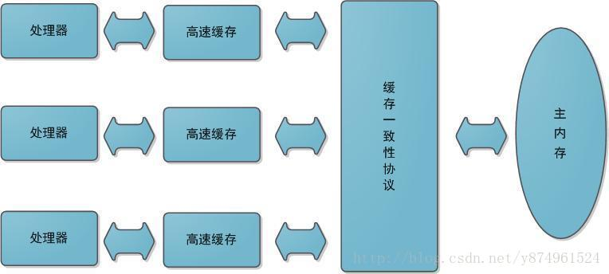
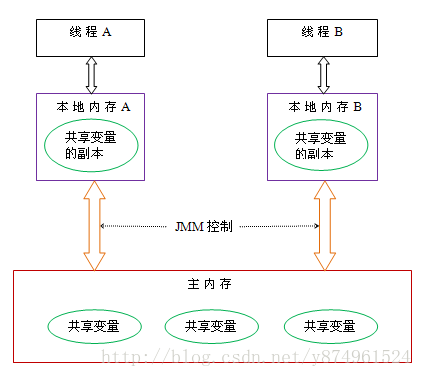
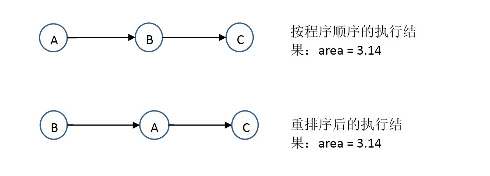

## 深入理解Java内存模型

谈论深入理解Java内存模型，将按五个部分进行深入解读：
1. 基础
    1. 硬件的效率与一致性
    2. 并发编程模型的分类
    3. Java中的内存模型
    4. 重排序
    5. 处理器重排序与内存屏障指令
    6. happens-before

2. 重排序
    1. 数据依赖性
    2. as-if-serial语义
    3. 程序顺序规则
    4. 重排序对多线程的影响

3. 顺序一致性
    1. 数据竞争与顺序一致性保证
    2. 顺序一致性内存模型
    3. 同步程序的顺序一致性效果
    4. 未同步程序的执行特性

4. volatile
    1. volatile的特性
    2. volatile写-读建立的happens before关系
    3. volatile写-读的内存语义
    4. volatile内存语义的实现
    5. JSR-133为什么要增强volatile的内存语义

5. 锁
    1. 锁的释放-获取建立的happens before 关系

## 基础

多任务和高并发是衡量一台计算机处理器的能力重要指标之一。一般衡量一个服务器性能的高低好坏，使用每秒事务处理数（Transactions Per Second，TPS）这个指标比较能说明问题，它代表着一秒内服务器平均能响应的请求数，而TPS值与程序的并发能力有着非常密切的关系。在讨论Java内存模型和线程之前，先简单介绍一下硬件的效率与一致性。

1. 硬件的效率与一致性

    由于计算机的存储设备与处理器的运算能力之间有几个数量级的差距，所以现代计算机系统都不得不加入一层读写速度尽可能接近处理器运算速度的高速缓存（cache）来作为内存与处理器之间的缓冲：将运算需要使用到的数据复制到缓存中，让运算能快速进行，当运算结束后再从缓存同步回内存之中没这样处理器就无需等待缓慢的内存读写了。

    基于高速缓存的存储交互很好地解决了处理器与内存的速度矛盾，但是引入了一个新的问题：**缓存一致性（Cache Coherence）**。在多处理器系统中，每个处理器都有自己的高速缓存，而他们又共享同一主存，如下图所示：多个处理器运算任务都涉及同一块主存，需要一种协议可以保障数据的一致性，这类协议有MSI、MESI、MOSI及Dragon Protocol等。Java虚拟机内存模型中定义的内存访问操作与硬件的缓存访问操作是具有可比性的，后续将介绍Java内存模型。

    


    除此之外，为了使得处理器内部的运算单元能竟可能被充分利用，处理器可能会对输入代码进行乱起执行（Out-Of-Order Execution）优化，处理器会在计算之后将对乱序执行的代码进行结果重组，保证结果准确性。与处理器的乱序执行优化类似，Java虚拟机的即时编译器中也有类似的指令重排序（Instruction Recorder）优化。


2. 并发编程模型的分类

    在并发编程中，我们需要处理两个关键问题：线程之间如何通信及线程之间如何同步（这里的线程是指并发执行的活动实体）。通信是指线程之间以何种机制来交换信息。在命令式编程中，线程之间的通信机制有两种：**共享内存和消息传递**。

    * 在共享内存的并发模型里，线程之间共享程序的公共状态，线程之间通过写-读内存中的公共状态来隐式进行通信。
    
    * 在消息传递的并发模型里，线程之间没有公共状态，线程之间必须通过明确的发送消息来显式进行通信。

    同步是指程序用于控制不同线程之间操作发生相对顺序的机制。

    * 在共享内存并发模型里，同步是显式进行的。程序员必须显式指定某个方法或某段代码需要在线程之间互斥执行。
    * 在消息传递的并发模型里，由于消息的发送必须在消息的接收之前，因此同步是隐式进行的。

    **Java的并发采用的是共享内存模型，Java线程之间的通信总是隐式进行**，整个通信过程对程序员完全透明。如果编写多线程程序的Java程序员不理解隐式进行的线程之间通信的工作机制，很可能会遇到各种奇怪的内存可见性问题。

3. Java中的内存模型

    Java中的内存模型与硬件中的内存模型类似.

    * 主内存与工作内存

        Java内存模型的主要目标是定义程序中各个变量的访问规则，即在虚拟机中将变量存储到内存和从内存中取出变量这样底层细节。**此处的变量与Java编程时所说的变量不一样，指包括了实例字段、静态字段和构成数组对象的元素**，但是不包括局部变量与方法参数，后者是线程私有的，不会被共享。

        **Java内存模型中规定了所有的变量都存储在主内存中**，每条线程还有自己的工作内存（可以与前面将的处理器的高速缓存类比），线程的工作内存中保存了该线程使用到的变量到主内存副本拷贝，**线程对变量的所有操作（读取、赋值）都必须在工作内存中进行，而不能直接读写主内存中的变量**。不同线程之间无法直接访问对方工作内存中的变量，线程间变量值的传递均需要在主内存来完成，线程、主内存和工作内存的交互关系如下图所示，和上图很类似。

        


        **NOTE: 工作内存只会拷贝对象的引用,而不是直接拷贝整个对象,对象在堆中生成,对所有对象都是可见的**。

    * 主内存与工作内存之间的通信

        Java线程之间的通信由Java内存模型（本文简称为JMM）控制，JMM决定一个线程对共享变量的写入何时对另一个线程可见。从抽象的角度来看，JMM定义了线程和主内存之间的抽象关系：**线程之间的共享变量存储在主内存（main memory）中，每个线程都有一个私有的本地内存（local memory），本地内存中存储了该线程以读/写共享变量的副本**。本地内存是JMM的一个抽象概念，并不真实存在。**它涵盖了缓存，写缓冲区，寄存器以及其他的硬件和编译器优化**。 
        
        

         两个线程之间进行通信时，必须经过下面两个步骤

        1. 线程A把本地内存A中更新过的共享变量刷新到主内存中去。
        2. 线程B到主内存中去读取线程A之前已更新过的共享变量。

        这两个过程就是通过JMM内存之间的交互指令实现的。

        

        如上图所示，本地内存A和B有主内存中共享变量x的副本。

        假设初始时，这三个内存中的x值都为0。线程A在执行时，把更新后的x值（假设值为1）临时存放在自己的本地内存A中。当线程A和线程B需要通信时，线程A首先会把自己本地内存中修改后的x值刷新到主内存中，此时主内存中的x值变为了1。

        随后，线程B到主内存中去读取线程A更新后的x值，此时线程B的本地内存的x值也变为了1。

        从整体来看，这两个步骤实质上是线程A在向线程B发送消息，而且这个通信过程必须要经过主内存。JMM通过控制主内存与每个线程的本地内存之间的交互，来为java程序员提供内存可见性保证。

    * 内存之间的交互操作

        关于主内存与工作内存之间的具体交互协议，即一个变量如何从主内存拷贝到工作内存、如何从工作内存同步到主内存之间的实现细节，Java内存模型定义了以下八种操作来完成：

        八种线程之间的交互指令：
        1. lock（锁定）：作用于主内存的变量，把一个变量标识为一条线程独占状 。

        2. unlock（解锁）：作用于主内存变量，把一个处于锁定状态的变量释放出来，释放后的变量才可以被其他线程锁定。

        3. read（读取）：作用于主内存变量，把一个变量值从主内存传输到线程的工作内存中，以便随后的load动作使用

        4. load（载入）：作用于工作内存的变量，它把read操作从主内存中得到的变量值放入工作内存的变量副本中。

        5. use（使用）：作用于工作内存的变量，把工作内存中的一个变量值传递给执行引擎，每当虚拟机遇到一个需要使用变量的值的字节码指令时将会执行这个操作。

        6. assign（赋值）：作用于工作内存的变量，它把一个从执行引擎接收到的值赋值给工作内存的变量，每当虚拟机遇到一个给变量赋值的字节码指令时执行这个操作。

        7. store（存储）：作用于工作内存的变量，把工作内存中的一个变量的值传送到主内存中，以便随后的write的操作。

        8. write（写入）：作用于主内存的变量，它把store操作从工作内存中一个变量的值传送到主内存的变量中。

    * JMM对交互指令的约束

        如果要把一个变量从主内存中复制到工作内存，就需要按顺寻地执行read和load操作，如果把变量从工作内存中同步回主内存中，就要按顺序地执行store和write操作。

        Java内存模型只要求上述操作必须按顺序执行，而没有保证必须是连续执行。也就是read和load之间，store和write之间是可以插入其他指令的，如对主内存中的变量a、b进行访问时，可能的顺序是read a，read b，load b， load a。Java内存模型还规定了在执行上述八种基本操作时，必须满足如下规则：

        * 不允许read和load、store和write操作之一单独出现

        * 不允许一个线程丢弃它的最近assign的操作，即变量在工作内存中改变了之后必须同步到主内存中。

        * 不允许一个线程无原因地（没有发生过任何assign操作）把数据从工作内存同步回主内存中。

        * 一个新的变量只能在主内存中诞生，不允许在工作内存中直接使用一个未被初始化（load或assign）的变量。即就是对一个变量实施use和store操作之前，必须先执行过了assign和load操作。

        * 一个变量在同一时刻只允许一条线程对其进行lock操作，lock和unlock必须成对出现

        * 如果对一个变量执行lock操作，将会清空工作内存中此变量的值，在执行引擎使用这个变量前需要重新执行load或assign操作初始化变量的值

        * 如果一个变量事先没有被lock操作锁定，则不允许对它执行unlock操作；也不允许去unlock一个被其他线程锁定的变量。

        * 对一个变量执行unlock操作之前，必须先把此变量同步到主内存中（执行store和write操作）。

4. 重排序

    在执行程序时为了提高性能，编译器和处理器常常会对指令做重排序。重排序分三种类型：

    1. 编译器优化的重排序。编译器在不改变单线程程序语义的前提下，可以重新安排语句的执行顺序。
    2. 指令级并行的重排序。现代处理器采用了指令级并行技术（Instruction-Level Parallelism， ILP）来将多条指令重叠执行。如果不存在数据依赖性，处理器可以改变语句对应机器指令的执行顺序。
    3. 内存系统的重排序。由于处理器使用缓存和读/写缓冲区，这使得加载和存储操作看上去可能是在乱序执行。

    从java源代码到最终实际执行的指令序列，会分别经历下面三种重排序：

    

    上述的1属于编译器重排序，2和3属于处理器重排序。这些重排序都可能会导致多线程程序出现内存可见性问题。

    * 对于编译器，JMM的编译器重排序规则会禁止特定类型的编译器重排序（不是所有的编译器重排序都要禁止）。
    * 对于处理器重排序，JMM的处理器重排序规则会要求java编译器在生成指令序列时，插入特定类型的内存屏障（memory barriers，intel称之为memory fence）指令，通过内存屏障指令来禁止特定类型的处理器重排序（不是所有的处理器重排序都要禁止）。

    JMM属于语言级的内存模型，它确保在不同的编译器和不同的处理器平台之上，通过禁止特定类型的编译器重排序和处理器重排序，为程序员提供一致的内存可见性保证。

5. 处理器重排序与内存屏障指令

    现代的处理器使用写缓冲区来临时保存向内存写入的数据。写缓冲区可以保证指令流水线持续运行，它可以避免由于处理器停顿下来等待向内存写入数据而产生的延迟。同时，通过以批处理的方式刷新写缓冲区，以及合并写缓冲区中对同一内存地址的多次写，可以减少对内存总线的占用。虽然写缓冲区有这么多好处，但每个处理器上的写缓冲区，仅仅对它所在的处理器可见。这个特性会对内存操作的执行顺序产生重要的影响：处理器对内存的读/写操作的执行顺序，不一定与内存实际发生的读/写操作顺序一致！为了具体说明，请看下面示例：

    Processor A	|Processor B
    --|--
    a = 1; //A1 |b = 2; //B1
    x = b; //A2	|y = a; //B2
    ```
    初始状态：a = b = 0
    处理器允许执行后得到结果：x = y = 0
    ```

    假设处理器A和处理器B按程序的顺序并行执行内存访问，最终却可能得到x = y = 0的结果。具体的原因如下图所示：

    

    这里处理器A和处理器B可以同时把共享变量写入自己的写缓冲区（A1，B1），然后从内存中读取另一个共享变量（A2，B2），最后才把自己写缓存区中保存的脏数据刷新到内存中（A3，B3）。当以这种时序执行时，程序就可以得到x = y = 0的结果。

    从内存操作实际发生的顺序来看，直到处理器A执行A3来刷新自己的写缓存区，写操作A1才算真正执行了。虽然处理器A执行内存操作的顺序为：A1->A2，但内存操作实际发生的顺序却是：A2->A1。此时，处理器A的内存操作顺序被重排序了（处理器B的情况和处理器A一样，这里就不赘述了）。

    这里的关键是，由于写缓冲区仅对自己的处理器可见，它会导致处理器执行内存操作的顺序可能会与内存实际的操作执行顺序不一致。由于现代的处理器都会使用写缓冲区，因此现代的处理器都会允许对写-读操做重排序。


    下面是常见处理器允许的重排序类型的列表：

    &nbsp;|Load-Load	|Load-Store	|Store-Store	|Store-Load	|数据依赖
    --|--|--|--|--|--
    sparc-TSO	|N	|N	|N	|Y	|N
    x86	        |N	|N	|N	|Y	|N
    ia64	    |Y	|Y	|Y	|Y	|N
    PowerPC	    |Y	|Y	|Y	|Y	|N

    上表单元格中的“N”表示处理器不允许两个操作重排序，“Y”表示允许重排序。

    从上表我们可以看出：常见的处理器都允许Store-Load重排序；常见的处理器都不允许对存在数据依赖的操作做重排序。sparc-TSO和x86拥有相对较强的处理器内存模型，它们仅允许对写-读操作做重排序（因为它们都使用了写缓冲区）。

    ※注1：sparc-TSO是指以TSO(Total Store Order)内存模型运行时，sparc处理器的特性。

    ※注2：上表中的x86包括x64及AMD64。

    ※注3：由于ARM处理器的内存模型与PowerPC处理器的内存模型非常类似，本文将忽略它。

    ※注4：数据依赖性后文会专门说明。

    为了保证内存可见性，java编译器在生成指令序列的适当位置会插入内存屏障指令来禁止特定类型的处理器重排序。
    
    

    JMM把内存屏障指令分为下列四类：

    屏障类型	|指令示例	|说明
    --|--|--
    LoadLoad Barriers	|Load1; LoadLoad; Load2	|确保Load1数据的装载，之前于Load2及所有后续装载指令的装载。
    StoreStore Barriers	|Store1; StoreStore; Store2	|确保Store1数据对其他处理器可见（刷新到内存），之前于Store2及所有后续存储指令的存储。
    LoadStore Barriers	|Load1; LoadStore; Store2	|确保Load1数据装载，之前于Store2及所有后续的存储指令刷新到内存。
    StoreLoad Barriers	|Store1; StoreLoad; Load2	|确保Store1数据对其他处理器变得可见（指刷新到内存），之前于Load2及所有后续装载指令的装载。StoreLoad Barriers会使该屏障之前的所有内存访问指令（存储和装载指令）完成之后，才执行该屏障之后的内存访问指令。

    StoreLoad Barriers是一个“全能型”的屏障，它同时具有其他三个屏障的效果。现代的多处理器大都支持该屏障（其他类型的屏障不一定被所有处理器支持）。执行该屏障开销会很昂贵，因为当前处理器通常要把写缓冲区中的数据全部刷新到内存中（buffer fully flush）。

6. happens-before

    从JDK5开始，java使用新的JSR -133内存模型（本文除非特别说明，针对的都是JSR- 133内存模型）。JSR-133提出了happens-before的概念，通过这个概念来阐述操作之间的内存可见性。如果一个操作执行的结果需要对另一个操作可见，那么这两个操作之间必须存在happens-before关系。这里提到的两个操作既可以是在一个线程之内，也可以是在不同线程之间。 与程序员密切相关的happens-before规则如下：

    * 程序顺序规则：一个线程中的每个操作，happens- before 于该线程中的任意后续操作。
    * 监视器锁规则：对一个监视器锁的解锁，happens- before 于随后对这个监视器锁的加锁。
    * volatile变量规则：对一个volatile域的写，happens- before 于任意后续对这个volatile域的读。
    * 传递性：如果A happens- before B，且B happens- before C，那么A happens- before C。
    
    注意，两个操作之间具有happens-before关系，并不意味着前一个操作必须要在后一个操作之前执行！happens-before仅仅要求前一个操作（执行的结果）对后一个操作可见，且前一个操作按顺序排在第二个操作之前（the first is visible to and ordered before the second）。happens- before的定义很微妙，后文会具体说明happens-before为什么要这么定义。

    happens-before与JMM的关系如下图所示：

    

    如上图所示，一个happens-before规则通常对应于多个编译器重排序规则和处理器重排序规则。对于java程序员来说，happens-before规则简单易懂，它避免程序员为了理解JMM提供的内存可见性保证而去学习复杂的重排序规则以及这些规则的具体实现。

## 重排序

1. 数据依赖性

    如果两个操作访问同一个变量，且这两个操作中有一个为写操作，此时这两个操作之间就存在数据依赖性。数据依赖分下列三种类型：

    名称	|代码示例	|说明
    --|--|--
    写后读	|a = 1;b = a;	|写一个变量之后，再读这个位置。
    写后写	|a = 1;a = 2;	|写一个变量之后，再写这个变量。
    读后写	|a = b;b = 1;	|读一个变量之后，再写这个变量。

    上面三种情况，只要重排序两个操作的执行顺序，程序的执行结果将会被改变。

    前面提到过，编译器和处理器可能会对操作做重排序。编译器和处理器在重排序时，会遵守数据依赖性，编译器和处理器不会改变存在数据依赖关系的两个操作的执行顺序。

    注意，这里所说的数据依赖性仅针对单个处理器中执行的指令序列和单个线程中执行的操作，不同处理器之间和不同线程之间的数据依赖性不被编译器和处理器考虑。

2. as-if-serial语义

    as-if-serial语义的意思指：不管怎么重排序（编译器和处理器为了提高并行度），（单线程）程序的执行结果不能被改变。编译器，runtime 和处理器都必须遵守as-if-serial语义。

    为了遵守as-if-serial语义，编译器和处理器不会对存在数据依赖关系的操作做重排序，因为这种重排序会改变执行结果。但是，如果操作之间不存在数据依赖关系，这些操作可能被编译器和处理器重排序。为了具体说明，请看下面计算圆面积的代码示例：

    double pi  = 3.14;    //A
    double r   = 1.0;     //B
    double area = pi * r * r; //C
    上面三个操作的数据依赖关系如下图所示：

    

    如上图所示，A和C之间存在数据依赖关系，同时B和C之间也存在数据依赖关系。因此在最终执行的指令序列中，C不能被重排序到A和B的前面（C排到A和B的前面，程序的结果将会被改变）。但A和B之间没有数据依赖关系，编译器和处理器可以重排序A和B之间的执行顺序。下图是该程序的两种执行顺序：

    

    as-if-serial语义把单线程程序保护了起来，遵守as-if-serial语义的编译器，runtime 和处理器共同为编写单线程程序的程序员创建了一个幻觉：单线程程序是按程序的顺序来执行的。as-if-serial语义使单线程程序员无需担心重排序会干扰他们，也无需担心内存可见性问题。

3. 程序顺序规则

    根据happens- before的程序顺序规则，上面计算圆的面积的示例代码存在三个happens- before关系：

    A happens- before B；
    B happens- before C；
    A happens- before C；
    这里的第3个happens- before关系，是根据happens- before的传递性推导出来的。

    这里A happens- before B，但实际执行时B却可以排在A之前执行（看上面的重排序后的执行顺序）。在第一章提到过，如果A happens- before B，JMM并不要求A一定要在B之前执行。JMM仅仅要求前一个操作（执行的结果）对后一个操作可见，且前一个操作按顺序排在第二个操作之前。这里操作A的执行结果不需要对操作B可见；而且重排序操作A和操作B后的执行结果，与操作A和操作B按happens- before顺序执行的结果一致。在这种情况下，JMM会认为这种重排序并不非法（not illegal），JMM允许这种重排序。

    在计算机中，软件技术和硬件技术有一个共同的目标：在不改变程序执行结果的前提下，尽可能的开发并行度。编译器和处理器遵从这一目标，从happens- before的定义我们可以看出，JMM同样遵从这一目标。

4. 重排序对多线程的影响

    现在让我们来看看，重排序是否会改变多线程程序的执行结果。请看下面的示例代码：
    ```java
    class ReorderExample {
        int a = 0;
        boolean flag = false;

        public void writer() {
            a = 1;                   //1
            flag = true;             //2
        }

        public void reader() {
            if (flag) {                //3
                int i =  a * a;        //4
                ……
            }
        }
    }
    ```
    flag变量是个标记，用来标识变量a是否已被写入。这里假设有两个线程A和B，A首先执行writer()方法，随后B线程接着执行reader()方法。线程B在执行操作4时，能否看到线程A在操作1对共享变量a的写入？

    答案是：不一定能看到。

    由于操作1和操作2没有数据依赖关系，编译器和处理器可以对这两个操作重排序；同样，操作3和操作4没有数据依赖关系，编译器和处理器也可以对这两个操作重排序。让我们先来看看，当操作1和操作2重排序时，可能会产生什么效果？请看下面的程序执行时序图：

    

    如上图所示，操作1和操作2做了重排序。程序执行时，线程A首先写标记变量flag，随后线程B读这个变量。由于条件判断为真，线程B将读取变量a。此时，变量a还根本没有被线程A写入，在这里多线程程序的语义被重排序破坏了！

    ※注：本文统一用红色的虚箭线表示错误的读操作，用绿色的虚箭线表示正确的读操作。

    下面再让我们看看，当操作3和操作4重排序时会产生什么效果（借助这个重排序，可以顺便说明控制依赖性）。下面是操作3和操作4重排序后，程序的执行时序图：

    


    在程序中，操作3和操作4存在控制依赖关系。当代码中存在控制依赖性时，会影响指令序列执行的并行度。为此，编译器和处理器会采用猜测（Speculation）执行来克服控制相关性对并行度的影响。以处理器的猜测执行为例，执行线程B的处理器可以提前读取并计算a*a，然后把计算结果临时保存到一个名为重排序缓冲（reorder buffer ROB）的硬件缓存中。当接下来操作3的条件判断为真时，就把该计算结果写入变量i中。

    从图中我们可以看出，猜测执行实质上对操作3和4做了重排序。重排序在这里破坏了多线程程序的语义！

    在单线程程序中，对存在控制依赖的操作重排序，不会改变执行结果（这也是as-if-serial语义允许对存在控制依赖的操作做重排序的原因）；但在多线程程序中，对存在控制依赖的操作重排序，可能会改变程序的执行结果。

## 顺序一致性

1. 数据竞争与顺序一致性保证

    当程序未正确同步时，就会存在数据竞争。java内存模型规范对数据竞争的定义如下：
    * 在一个线程中写一个变量，
    * 在另一个线程读同一个变量，
    * 而且写和读没有通过同步来排序。
    
    当代码中包含数据竞争时，程序的执行往往产生违反直觉的结果（前一章的示例正是如此）。如果一个多线程程序能正确同步，这个程序将是一个没有数据竞争的程序。

    JMM对正确同步的多线程程序的内存一致性做了如下保证：

    * 如果程序是正确同步的，程序的执行将具有顺序一致性（sequentially consistent）--即程序的执行结果与该程序在顺序一致性内存模型中的执行结果相同（马上我们将会看到，这对于程序员来说是一个极强的保证）。这里的同步是指广义上的同步，包括对常用同步原语（lock，volatile和final）的正确使用。

2. 顺序一致性内存模型

    顺序一致性内存模型是一个被计算机科学家理想化了的理论参考模型，它为程序员提供了极强的内存可见性保证。顺序一致性内存模型有两大特性：

    * 一个线程中的所有操作必须按照程序的顺序来执行。
    * （不管程序是否同步）所有线程都只能看到一个单一的操作执行顺序。在顺序一致性内存模型中，每个操作都必须原子执行且立刻对所有线程可见。

    顺序一致性内存模型为程序员提供的视图如下：

    


    在概念上，顺序一致性模型有一个单一的全局内存，这个内存通过一个左右摆动的开关可以连接到任意一个线程。同时，每一个线程必须按程序的顺序来执行内存读/写操作。从上图我们可以看出，在任意时间点最多只能有一个线程可以连接到内存。当多个线程并发执行时，图中的开关装置能把所有线程的所有内存读/写操作串行化。

    为了更好的理解，下面我们通过两个示意图来对顺序一致性模型的特性做进一步的说明。

    假设有两个线程A和B并发执行。其中A线程有三个操作，它们在程序中的顺序是：A1->A2->A3。B线程也有三个操作，它们在程序中的顺序是：B1->B2->B3。

    假设这两个线程使用监视器来正确同步：A线程的三个操作执行后释放监视器，随后B线程获取同一个监视器。那么程序在顺序一致性模型中的执行效果将如下图所示：

    


    现在我们再假设这两个线程没有做同步，下面是这个未同步程序在顺序一致性模型中的执行示意图：

    

    未同步程序在顺序一致性模型中虽然整体执行顺序是无序的，但所有线程都只能看到一个一致的整体执行顺序。以上图为例，线程A和B看到的执行顺序都是：B1->A1->A2->B2->A3->B3。之所以能得到这个保证是因为顺序一致性内存模型中的每个操作必须立即对任意线程可见。

    但是，在JMM中就没有这个保证。未同步程序在JMM中不但整体的执行顺序是无序的，而且所有线程看到的操作执行顺序也可能不一致。比如，在当前线程把写过的数据缓存在本地内存中，且还没有刷新到主内存之前，这个写操作仅对当前线程可见；从其他线程的角度来观察，会认为这个写操作根本还没有被当前线程执行。只有当前线程把本地内存中写过的数据刷新到主内存之后，这个写操作才能对其他线程可见。在这种情况下，当前线程和其它线程看到的操作执行顺序将不一致。

3. 同步程序的顺序一致性效果

    下面我们对前面的示例程序ReorderExample用监视器来同步，看看正确同步的程序如何具有顺序一致性。

    请看下面的示例代码：

    ```java
    class SynchronizedExample {
        int a = 0;
        boolean flag = false;

        public synchronized void writer() {
            a = 1;
            flag = true;
        }

        public synchronized void reader() {
            if (flag) {
                int i = a;
                ……
            }
        }
    }
    ```
    上面示例代码中，假设A线程执行writer()方法后，B线程执行reader()方法。这是一个正确同步的多线程程序。根据JMM规范，该程序的执行结果将与该程序在顺序一致性模型中的执行结果相同。下面是该程序在两个内存模型中的执行时序对比图：

    

    在顺序一致性模型中，所有操作完全按程序的顺序串行执行。而在JMM中，临界区内的代码可以重排序（但JMM不允许临界区内的代码“逸出”到临界区之外，那样会破坏监视器的语义）。JMM会在退出监视器和进入监视器这两个关键时间点做一些特别处理，使得线程在这两个时间点具有与顺序一致性模型相同的内存视图（具体细节后文会说明）。虽然线程A在临界区内做了重排序，但由于监视器的互斥执行的特性，这里的线程B根本无法“观察”到线程A在临界区内的重排序。这种重排序既提高了执行效率，又没有改变程序的执行结果。

    从这里我们可以看到JMM在具体实现上的基本方针：在不改变（正确同步的）程序执行结果的前提下，尽可能的为编译器和处理器的优化打开方便之门。

4. 未同步程序的执行特性

    对于未同步或未正确同步的多线程程序，JMM只提供最小安全性：线程执行时读取到的值，要么是之前某个线程写入的值，要么是默认值（0，null，false），JMM保证线程读操作读取到的值不会无中生有（out of thin air）的冒出来。为了实现最小安全性，JVM在堆上分配对象时，首先会清零内存空间，然后才会在上面分配对象（JVM内部会同步这两个操作）。因此，在以清零的内存空间（pre-zeroed memory）分配对象时，域的默认初始化已经完成了。

    JMM不保证未同步程序的执行结果与该程序在顺序一致性模型中的执行结果一致。因为未同步程序在顺序一致性模型中执行时，整体上是无序的，其执行结果无法预知。保证未同步程序在两个模型中的执行结果一致毫无意义。

    和顺序一致性模型一样，未同步程序在JMM中的执行时，整体上也是无序的，其执行结果也无法预知。同时，未同步程序在这两个模型中的执行特性有下面几个差异：

    顺序一致性模型保证单线程内的操作会按程序的顺序执行，而JMM不保证单线程内的操作会按程序的顺序执行（比如上面正确同步的多线程程序在临界区内的重排序）。这一点前面已经讲过了，这里就不再赘述。

    顺序一致性模型保证所有线程只能看到一致的操作执行顺序，而JMM不保证所有线程能看到一致的操作执行顺序。这一点前面也已经讲过，这里就不再赘述。

    JMM不保证对64位的long型和double型变量的读/写操作具有原子性，而顺序一致性模型保证对所有的内存读/写操作都具有原子性。

    第3个差异与处理器总线的工作机制密切相关。在计算机中，数据通过总线在处理器和内存之间传递。每次处理器和内存之间的数据传递都是通过一系列步骤来完成的，这一系列步骤称之为总线事务（bus transaction）。总线事务包括读事务（read transaction）和写事务（write transaction）。读事务从内存传送数据到处理器，写事务从处理器传送数据到内存，每个事务会读/写内存中一个或多个物理上连续的字。这里的关键是，总线会同步试图并发使用总线的事务。在一个处理器执行总线事务期间，总线会禁止其它所有的处理器和I/O设备执行内存的读/写。下面让我们通过一个示意图来说明总线的工作机制：

    

    如上图所示，假设处理器A，B和C同时向总线发起总线事务，这时总线仲裁（bus arbitration）会对竞争作出裁决，这里我们假设总线在仲裁后判定处理器A在竞争中获胜（总线仲裁会确保所有处理器都能公平的访问内存）。此时处理器A继续它的总线事务，而其它两个处理器则要等待处理器A的总线事务完成后才能开始再次执行内存访问。假设在处理器A执行总线事务期间（不管这个总线事务是读事务还是写事务），处理器D向总线发起了总线事务，此时处理器D的这个请求会被总线禁止。

    总线的这些工作机制可以把所有处理器对内存的访问以串行化的方式来执行；在任意时间点，最多只能有一个处理器能访问内存。这个特性确保了单个总线事务之中的内存读/写操作具有原子性。

    在一些32位的处理器上，如果要求对64位数据的读/写操作具有原子性，会有比较大的开销。为了照顾这种处理器，java语言规范鼓励但不强求JVM对64位的long型变量和double型变量的读/写具有原子性。当JVM在这种处理器上运行时，会把一个64位long/ double型变量的读/写操作拆分为两个32位的读/写操作来执行。这两个32位的读/写操作可能会被分配到不同的总线事务中执行，此时对这个64位变量的读/写将不具有原子性。

    当单个内存操作不具有原子性，将可能会产生意想不到后果。请看下面示意图：

    

    如上图所示，假设处理器A写一个long型变量，同时处理器B要读这个long型变量。处理器A中64位的写操作被拆分为两个32位的写操作，且这两个32位的写操作被分配到不同的写事务中执行。同时处理器B中64位的读操作被拆分为两个32位的读操作，且这两个32位的读操作被分配到同一个的读事务中执行。当处理器A和B按上图的时序来执行时，处理器B将看到仅仅被处理器A“写了一半“的无效值。


## volatile

1. volatile的特性

    当我们声明共享变量为volatile后，对这个变量的读/写将会很特别。理解volatile特性的一个好方法是：把对volatile变量的单个读/写，看成是使用同一个监视器锁对这些单个读/写操作做了同步。下面我们通过具体的示例来说明，请看下面的示例代码：

    ```java
    class VolatileFeaturesExample {
        volatile long vl = 0L;  //使用volatile声明64位的long型变量

        public void set(long l) {
            vl = l;   //单个volatile变量的写
        }

        public void getAndIncrement () {
            vl++;    //复合（多个）volatile变量的读/写
        }


        public long get() {
            return vl;   //单个volatile变量的读
        }
    }
    ```
    假设有多个线程分别调用上面程序的三个方法，这个程序在语意上和下面程序等价：

    ```java
    class VolatileFeaturesExample {
        long vl = 0L;               // 64位的long型普通变量

        public synchronized void set(long l) {     //对单个的普通 变量的写用同一个监视器同步
            vl = l;
        }

        public void getAndIncrement () { //普通方法调用
            long temp = get();           //调用已同步的读方法
            temp += 1L;                  //普通写操作
            set(temp);                   //调用已同步的写方法
        }
        public synchronized long get() { 
        //对单个的普通变量的读用同一个监视器同步
            return vl;
        }
    }
    ```
    如上面示例程序所示，对一个volatile变量的单个读/写操作，与对一个普通变量的读/写操作使用同一个监视器锁来同步，它们之间的执行效果相同。

    监视器锁的happens-before规则保证释放监视器和获取监视器的两个线程之间的内存可见性，这意味着对一个volatile变量的读，总是能看到（任意线程）对这个volatile变量最后的写入。

    监视器锁的语义决定了临界区代码的执行具有原子性。这意味着即使是64位的long型和double型变量，只要它是volatile变量，对该变量的读写就将具有原子性。如果是多个volatile操作或类似于volatile++这种复合操作，这些操作整体上不具有原子性。

    简而言之，volatile变量自身具有下列特性：

    * 可见性: 对一个volatile变量的读，总是能看到（任意线程）对这个volatile变量最后的写入。
    * 原子性：对任意单个volatile变量的读/写具有原子性，但类似于volatile++这种复合操作不具有原子性。

2. volatile写-读建立的happens before关系

    上面讲的是volatile变量自身的特性，对程序员来说，volatile对线程的内存可见性的影响比volatile自身的特性更为重要，也更需要我们去关注。

    从JSR-133开始，volatile变量的写-读可以实现线程之间的通信。

    从内存语义的角度来说，volatile与监视器锁有相同的效果：
    * volatile写和监视器的释放有相同的内存语义；
    * volatile读与监视器的获取有相同的内存语义。

    请看下面使用volatile变量的示例代码：
    ```java
    class VolatileExample {
        int a = 0;
        volatile boolean flag = false;

        public void writer() {
            a = 1;                   //1
            flag = true;               //2
        }

        public void reader() {
            if (flag) {                //3
                int i =  a;           //4
                ……
            }
        }
    }
    ```
    假设线程A执行writer()方法之后，线程B执行reader()方法。根据happens before规则，这个过程建立的happens before 关系可以分为两类：

    根据程序次序规则，1 happens before 2; 3 happens before 4。
    根据volatile规则，2 happens before 3。
    根据happens before 的传递性规则，1 happens before 4。
    上述happens before 关系的图形化表现形式如下：**（缺图）**


    在上图中，每一个箭头链接的两个节点，代表了一个happens before 关系。黑色箭头表示程序顺序规则；橙色箭头表示volatile规则；蓝色箭头表示组合这些规则后提供的happens before保证。

    这里A线程写一个volatile变量后，B线程读同一个volatile变量。A线程在写volatile变量之前所有可见的共享变量，在B线程读同一个volatile变量后，将立即变得对B线程可见。


3. volatile写-读的内存语义

    * volatile写的内存语义如下：
        
        当写一个volatile变量时，JMM会把该线程对应的本地内存中的共享变量刷新到主内存。
        以上面示例程序VolatileExample为例，假设线程A首先执行writer()方法，随后线程B执行reader()方法，初始时两个线程的本地内存中的flag和a都是初始状态。下图是线程A执行volatile写后，共享变量的状态示意图：

        

        如上图所示，线程A在写flag变量后，本地内存A中被线程A更新过的两个共享变量的值被刷新到主内存中。此时，本地内存A和主内存中的共享变量的值是一致的。

    * volatile读的内存语义如下：

        当读一个volatile变量时，JMM会把该线程对应的本地内存置为无效。线程接下来将从主内存中读取共享变量。
        下面是线程B读同一个volatile变量后，共享变量的状态示意图：

        


        如上图所示，在读flag变量后，本地内存B已经被置为无效。此时，线程B必须从主内存中读取共享变量。线程B的读取操作将导致本地内存B与主内存中的共享变量的值也变成一致的了。

    如果我们把volatile写和volatile读这两个步骤综合起来看的话，在读线程B读一个volatile变量后，写线程A在写这个volatile变量之前所有可见的共享变量的值都将立即变得对读线程B可见。

    下面对volatile写和volatile读的内存语义做个总结：

    * 线程A写一个volatile变量，实质上是线程A向接下来将要读这个volatile变量的某个线程发出了（其对共享变量所在修改的）消息。
    * 线程B读一个volatile变量，实质上是线程B接收了之前某个线程发出的（在写这个volatile变量之前对共享变量所做修改的）消息。
    * 线程A写一个volatile变量，随后线程B读这个volatile变量，这个过程实质上是线程A通过主内存向线程B发送消息。

4. volatile内存语义的实现（比较难理解，先过）

    下面，让我们来看看JMM如何实现volatile写/读的内存语义。

    前文我们提到过重排序分为编译器重排序和处理器重排序。为了实现volatile内存语义，JMM会分别限制这两种类型的重排序类型。下面是JMM针对编译器制定的volatile重排序规则表：

    是否能重排序	|第二个操作|&nbsp;|&nbsp;
    --|--|--|--
    **第一个操作**	|普通读/写	|volatile读	|volatile写
    普通读/写	|&nbsp;|&nbsp; |NO
    volatile读	|NO	|NO	|NO
    volatile写	|&nbsp;|NO	|NO

    举例来说，第一行最后一个单元格的意思是：在程序顺序中，当第一个操作为普通变量的读或写时，如果第二个操作为volatile写，则编译器不能重排序这两个操作。

    从上表我们可以看出：

    * 当第二个操作是volatile写时，不管第一个操作是什么，都不能重排序。这个规则确保volatile写之前的操作不会被编译器重排序到volatile写之后。
    * 当第一个操作是volatile读时，不管第二个操作是什么，都不能重排序。这个规则确保volatile读之后的操作不会被编译器重排序到volatile读之前。
    * 当第一个操作是volatile写，第二个操作是volatile读时，不能重排序。

    为了实现volatile的内存语义，编译器在生成字节码时，会在指令序列中插入内存屏障来禁止特定类型的处理器重排序。对于编译器来说，发现一个最优布置来最小化插入屏障的总数几乎不可能，为此，JMM采取保守策略。下面是基于保守策略的JMM内存屏障插入策略：

    * 在每个volatile写操作的前面插入一个StoreStore屏障。
    * 在每个volatile写操作的后面插入一个StoreLoad屏障。
    * 在每个volatile读操作的后面插入一个LoadLoad屏障。
    * 在每个volatile读操作的后面插入一个LoadStore屏障。

    上述内存屏障插入策略非常保守，但它可以保证在任意处理器平台，任意的程序中都能得到正确的volatile内存语义。

    下面是保守策略下，volatile写插入内存屏障后生成的指令序列示意图：

    

    上图中的StoreStore屏障可以保证在volatile写之前，其前面的所有普通写操作已经对任意处理器可见了。这是因为StoreStore屏障将保障上面所有的普通写在volatile写之前刷新到主内存。

    这里比较有意思的是volatile写后面的StoreLoad屏障。这个屏障的作用是避免volatile写与后面可能有的volatile读/写操作重排序。因为编译器常常无法准确判断在一个volatile写的后面，是否需要插入一个StoreLoad屏障（比如，一个volatile写之后方法立即return）。为了保证能正确实现volatile的内存语义，JMM在这里采取了保守策略：在每个volatile写的后面或在每个volatile读的前面插入一个StoreLoad屏障。从整体执行效率的角度考虑，JMM选择了在每个volatile写的后面插入一个StoreLoad屏障。因为volatile写-读内存语义的常见使用模式是：一个写线程写volatile变量，多个读线程读同一个volatile变量。当读线程的数量大大超过写线程时，选择在volatile写之后插入StoreLoad屏障将带来可观的执行效率的提升。从这里我们可以看到JMM在实现上的一个特点：首先确保正确性，然后再去追求执行效率。

    下面是在保守策略下，volatile读插入内存屏障后生成的指令序列示意图：

    


    上图中的LoadLoad屏障用来禁止处理器把上面的volatile读与下面的普通读重排序。LoadStore屏障用来禁止处理器把上面的volatile读与下面的普通写重排序。

    上述volatile写和volatile读的内存屏障插入策略非常保守。在实际执行时，只要不改变volatile写-读的内存语义，编译器可以根据具体情况省略不必要的屏障。下面我们通过具体的示例代码来说明：
    ```java
    class VolatileBarrierExample {
        int a;
        volatile int v1 = 1;
        volatile int v2 = 2;

        void readAndWrite() {
            int i = v1;           //第一个volatile读
            int j = v2;           // 第二个volatile读
            a = i + j;            //普通写
            v1 = i + 1;          // 第一个volatile写
            v2 = j * 2;          //第二个 volatile写
        }

        …                    //其他方法
    }
    ```
    针对readAndWrite()方法，编译器在生成字节码时可以做如下的优化：**（缺图）**


    注意，最后的StoreLoad屏障不能省略。因为第二个volatile写之后，方法立即return。此时编译器可能无法准确断定后面是否会有volatile读或写，为了安全起见，编译器常常会在这里插入一个StoreLoad屏障。

    上面的优化是针对任意处理器平台，由于不同的处理器有不同“松紧度”的处理器内存模型，内存屏障的插入还可以根据具体的处理器内存模型继续优化。以x86处理器为例，上图中除最后的StoreLoad屏障外，其它的屏障都会被省略。

    前面保守策略下的volatile读和写，在 x86处理器平台可以优化成：**（缺图）**


    前文提到过，x86处理器仅会对写-读操作做重排序。X86不会对读-读，读-写和写-写操作做重排序，因此在x86处理器中会省略掉这三种操作类型对应的内存屏障。在x86中，JMM仅需在volatile写后面插入一个StoreLoad屏障即可正确实现volatile写-读的内存语义。这意味着在x86处理器中，volatile写的开销比volatile读的开销会大很多（因为执行StoreLoad屏障开销会比较大）。

5. JSR-133为什么要增强volatile的内存语义

    在JSR-133之前的旧Java内存模型中，虽然不允许volatile变量之间重排序，但旧的Java内存模型允许volatile变量与普通变量之间重排序。在旧的内存模型中，VolatileExample示例程序可能被重排序成下列时序来执行：**（缺图）**


    在旧的内存模型中，当1和2之间没有数据依赖关系时，1和2之间就可能被重排序（3和4类似）。其结果就是：读线程B执行4时，不一定能看到写线程A在执行1时对共享变量的修改。

    因此在旧的内存模型中 ，volatile的写-读没有监视器的释放-获所具有的内存语义。为了提供一种比监视器锁更轻量级的线程之间通信的机制，JSR-133专家组决定增强volatile的内存语义：严格限制编译器和处理器对volatile变量与普通变量的重排序，确保volatile的写-读和监视器的释放-获取一样，具有相同的内存语义。从编译器重排序规则和处理器内存屏障插入策略来看，只要volatile变量与普通变量之间的重排序可能会破坏volatile的内存语意，这种重排序就会被编译器重排序规则和处理器内存屏障插入策略禁止。

    由于volatile仅仅保证对单个volatile变量的读/写具有原子性，而监视器锁的互斥执行的特性可以确保对整个临界区代码的执行具有原子性。在功能上，监视器锁比volatile更强大；在可伸缩性和执行性能上，volatile更有优势。如果读者想在程序中用volatile代替监视器锁，请一定谨慎。


## 锁

1. 锁的释放-获取建立的happens before 关系

    锁是java并发编程中最重要的同步机制。锁除了让临界区互斥执行外，还可以让释放锁的线程向获取同一个锁的线程发送消息。

    下面是锁释放-获取的示例代码：
    ```java
    class MonitorExample {
        int a = 0;

        public synchronized void writer() {  //1
            a++;                             //2
        }                                    //3

        public synchronized void reader() {  //4
            int i = a;                       //5
            ……
        }                                    //6
    }
    ```

    假设线程A执行writer()方法，随后线程B执行reader()方法。根据happens before规则，这个过程包含的happens before 关系可以分为两类：

    * 根据程序次序规则，1 happens before 2, 2 happens before 3; 4 happens before 5, 5 happens before 6。
    * 根据监视器锁规则，3 happens before 4。
    * 根据happens before 的传递性，2 happens before 5。

    上述happens before 关系的图形化表现形式如下：

    

    在上图中，每一个箭头链接的两个节点，代表了一个happens before 关系。**（线条颜色不区分，看图就好）**
    * 黑色箭头表示程序顺序规则；
    * 橙色箭头表示监视器锁规则；
    * 蓝色箭头表示组合这些规则后提供的happens before保证。

    上图表示在线程A释放了锁之后，随后线程B获取同一个锁。在上图中，2 happens before 5。因此，线程A在释放锁之前所有可见的共享变量，在线程B获取同一个锁之后，将立刻变得对B线程可见。

2. 锁释放和获取的内存语义

    * 当线程释放锁时，JMM会把该线程对应的本地内存中的共享变量刷新到主内存中。以上面的MonitorExample程序为例，A线程释放锁后，共享数据的状态示意图如下：

        


    * 当线程获取锁时，JMM会把该线程对应的本地内存置为无效。从而使得被监视器保护的临界区代码必须要从主内存中去读取共享变量。下面是锁获取的状态示意图：

        

    对比锁释放-获取的内存语义与volatile写-读的内存语义，可以看出：**锁释放与volatile写有相同的内存语义；锁获取与volatile读有相同的内存语义**。

    下面对锁释放和锁获取的内存语义做个总结：

    * 线程A释放一个锁，实质上是线程A向接下来将要获取这个锁的某个线程发出了（线程A对共享变量所做修改的）消息。
    * 线程B获取一个锁，实质上是线程B接收了之前某个线程发出的（在释放这个锁之前对共享变量所做修改的）消息。
    * 线程A释放锁，随后线程B获取这个锁，这个过程实质上是线程A通过主内存向线程B发送消息。

3. 锁内存语义的实现

    本文将借助ReentrantLock的源代码，来分析锁内存语义的具体实现机制。

    请看下面的示例代码：
    ```java
    class ReentrantLockExample {
        int a = 0;
        ReentrantLock lock = new ReentrantLock();

        public void writer() {
            lock.lock();         //获取锁
            try {
                a++;
            } finally {
                lock.unlock();  //释放锁
            }
        }

        public void reader () {
            lock.lock();        //获取锁
            try {
                int i = a;
                ……
            } finally {
                lock.unlock();  //释放锁
            }
        }
    }
    ```
    在ReentrantLock中，调用lock()方法获取锁；调用unlock()方法释放锁。

    ReentrantLock的实现依赖于java同步器框架AbstractQueuedSynchronizer（本文简称之为AQS）。AQS使用一个整型的volatile变量（命名为state）来维护同步状态，马上我们会看到，这个volatile变量是ReentrantLock内存语义实现的关键。 下面是ReentrantLock的类图（仅画出与本文相关的部分）：

    

    ReentrantLock分为公平锁和非公平锁，我们首先分析公平锁。

    使用公平锁时，加锁方法lock()的方法调用轨迹如下：

    1. ReentrantLock : lock()
    2. FairSync : lock()
    3. AbstractQueuedSynchronizer : acquire(int arg)
    4. ReentrantLock : tryAcquire(int acquires)

    在第4步真正开始加锁，下面是该方法的源代码：
    ```java
    protected final boolean tryAcquire(int acquires) {
        final Thread current = Thread.currentThread();
        int c = getState();   //获取锁的开始，首先读volatile变量state
        if (c == 0) {
            if (isFirst(current) &&
                compareAndSetState(0, acquires)) {
                setExclusiveOwnerThread(current);
                return true;
            }
        }
        else if (current == getExclusiveOwnerThread()) {
            int nextc = c + acquires;
            if (nextc < 0)  
                throw new Error("Maximum lock count exceeded");
            setState(nextc);
            return true;
        }
        return false;
    }
    ```
    从上面源代码中我们可以看出，加锁方法首先读volatile变量state。

    在使用公平锁时，解锁方法unlock()的方法调用轨迹如下：

    1. ReentrantLock : unlock()
    2. AbstractQueuedSynchronizer : release(int arg)
    3. Sync : tryRelease(int releases)

    在第3步真正开始释放锁，下面是该方法的源代码：
    ```java
    protected final boolean tryRelease(int releases) {
        int c = getState() - releases;
        if (Thread.currentThread() != getExclusiveOwnerThread())
            throw new IllegalMonitorStateException();
        boolean free = false;
        if (c == 0) {
            free = true;
            setExclusiveOwnerThread(null);
        }
        setState(c);           //释放锁的最后，写volatile变量state
        return free;
    }
    ```

    从上面的源代码我们可以看出，在释放锁的最后写volatile变量state。

    公平锁在释放锁的最后写volatile变量state；在获取锁时首先读这个volatile变量。根据volatile的happens-before规则，释放锁的线程在写volatile变量之前可见的共享变量，在获取锁的线程读取同一个volatile变量后将立即变的对获取锁的线程可见。

    现在我们分析非公平锁的内存语义的实现。

    非公平锁的释放和公平锁完全一样，所以这里仅仅分析非公平锁的获取。

    使用公平锁时，加锁方法lock()的方法调用轨迹如下：

    1. ReentrantLock : lock()
    2. NonfairSync : lock()
    3. AbstractQueuedSynchronizer : compareAndSetState(int expect, int update)

    在第3步真正开始加锁，下面是该方法的源代码：
    ```java
    protected final boolean compareAndSetState(int expect, int update) {
        return unsafe.compareAndSwapInt(this, stateOffset, expect, update);
    }
    ```

    该方法以原子操作的方式更新state变量，本文把java的compareAndSet()方法调用简称为CAS。JDK文档对该方法的说明如下：如果当前状态值等于预期值，则以原子方式将同步状态设置为给定的更新值。此操作具有 volatile 读和写的内存语义。

    这里我们分别从编译器和处理器的角度来分析,CAS如何同时具有volatile读和volatile写的内存语义。

    前文我们提到过，编译器不会对volatile读与volatile读后面的任意内存操作重排序；编译器不会对volatile写与volatile写前面的任意内存操作重排序。组合这两个条件，意味着为了同时实现volatile读和volatile写的内存语义，编译器不能对CAS与CAS前面和后面的任意内存操作重排序。

    下面我们来分析在常见的intel x86处理器中，CAS是如何同时具有volatile读和volatile写的内存语义的。

    下面是sun.misc.Unsafe类的compareAndSwapInt()方法的源代码：
    ```java
    public final native boolean compareAndSwapInt(Object o, long offset,int expected,int x);
    ```
    可以看到这是个本地方法调用。这个本地方法在openjdk中依次调用的c++代码为：unsafe.cpp，atomic.cpp和atomicwindowsx86.inline.hpp。这个本地方法的最终实现在openjdk的如下位置：openjdk-7-fcs-src-b147-27jun2011\openjdk\hotspot\src\oscpu\windowsx86\vm\ atomicwindowsx86.inline.hpp（对应于windows操作系统，X86处理器）。下面是对应于intel x86处理器的源代码的片段：
    ```c
    // Adding a lock prefix to an instruction on MP machine
    // VC++ doesn't like the lock prefix to be on a single line
    // so we can't insert a label after the lock prefix.
    // By emitting a lock prefix, we can define a label after it.
    #define LOCK_IF_MP(mp) __asm cmp mp, 0  \
                        __asm je L0      \
                        __asm _emit 0xF0 \
                        __asm L0:

    inline jint     Atomic::cmpxchg    (jint     exchange_value, volatile jint*     dest, jint     compare_value) {
    // alternative for InterlockedCompareExchange
    int mp = os::is_MP();
    __asm {
        mov edx, dest
        mov ecx, exchange_value
        mov eax, compare_value
        LOCK_IF_MP(mp)
        cmpxchg dword ptr [edx], ecx
    }
    }
    ```

    如上面源代码所示，程序会根据当前处理器的类型来决定是否为cmpxchg指令添加lock前缀。如果程序是在多处理器上运行，就为cmpxchg指令加上lock前缀（lock cmpxchg）。反之，如果程序是在单处理器上运行，就省略lock前缀（单处理器自身会维护单处理器内的顺序一致性，不需要lock前缀提供的内存屏障效果）。

    intel的手册对lock前缀的说明如下：

    1. 确保对内存的读-改-写操作原子执行。在Pentium及Pentium之前的处理器中，带有lock前缀的指令在执行期间会锁住总线，使得其他处理器暂时无法通过总线访问内存。很显然，这会带来昂贵的开销。从Pentium 4，Intel Xeon及P6处理器开始，intel在原有总线锁的基础上做了一个很有意义的优化：如果要访问的内存区域（area of memory）在lock前缀指令执行期间已经在处理器内部的缓存中被锁定（即包含该内存区域的缓存行当前处于独占或以修改状态），并且该内存区域被完全包含在单个缓存行（cache line）中，那么处理器将直接执行该指令。由于在指令执行期间该缓存行会一直被锁定，其它处理器无法读/写该指令要访问的内存区域，因此能保证指令执行的原子性。这个操作过程叫做缓存锁定（cache locking），缓存锁定将大大降低lock前缀指令的执行开销，但是当多处理器之间的竞争程度很高或者指令访问的内存地址未对齐时，仍然会锁住总线。
    2. 禁止该指令与之前和之后的读和写指令重排序。
    3. 把写缓冲区中的所有数据刷新到内存中。

    上面的第2点和第3点所具有的内存屏障效果，足以同时实现volatile读和volatile写的内存语义。

    经过上面的这些分析，现在我们终于能明白为什么JDK文档说CAS同时具有volatile读和volatile写的内存语义了。

    现在对公平锁和非公平锁的内存语义做个总结：

    * 公平锁和非公平锁释放时，最后都要写一个volatile变量state。
    * 公平锁获取时，首先会去读这个volatile变量。
    * 非公平锁获取时，首先会用CAS更新这个volatile变量,这个操作同时具有volatile读和volatile写的内存语义。

    从本文对ReentrantLock的分析可以看出，锁释放-获取的内存语义的实现至少有下面两种方式：

    * 利用volatile变量的写-读所具有的内存语义。
    * 利用CAS所附带的volatile读和volatile写的内存语义。

4. concurrent包的实现

    由于java的CAS同时具有 volatile 读和volatile写的内存语义，因此Java线程之间的通信现在有了下面四种方式：

    * A线程写volatile变量，随后B线程读这个volatile变量。
    * A线程写volatile变量，随后B线程用CAS更新这个volatile变量。
    * A线程用CAS更新一个volatile变量，随后B线程用CAS更新这个volatile变量。
    * A线程用CAS更新一个volatile变量，随后B线程读这个volatile变量。

    Java的CAS会使用现代处理器上提供的高效机器级别原子指令，这些原子指令以原子方式对内存执行读-改-写操作，这是在多处理器中实现同步的关键（从本质上来说，能够支持原子性读-改-写指令的计算机器，是顺序计算图灵机的异步等价机器，因此任何现代的多处理器都会去支持某种能对内存执行原子性读-改-写操作的原子指令）。同时，volatile变量的读/写和CAS可以实现线程之间的通信。把这些特性整合在一起，就形成了整个concurrent包得以实现的基石。如果我们仔细分析concurrent包的源代码实现，会发现一个通用化的实现模式：

    1. 首先，声明共享变量为volatile；
    2. 然后，使用CAS的原子条件更新来实现线程之间的同步；
    3. 同时，配合以volatile的读/写和CAS所具有的volatile读和写的内存语义来实现线程之间的通信。

    AQS，非阻塞数据结构和原子变量类（java.util.concurrent.atomic包中的类），这些concurrent包中的基础类都是使用这种模式来实现的，而concurrent包中的高层类又是依赖于这些基础类来实现的。从整体来看，concurrent包的实现示意图如下：

    


原文：https://blog.csdn.net/y874961524/article/details/61617778
https://blog.csdn.net/jim110/article/details/45665593
https://www.cnblogs.com/chenssy/p/6393321.html
https://blog.csdn.net/u012233832/article/details/79619648
https://www.cnblogs.com/java1024/p/8589537.html
https://blog.csdn.net/hqq2023623/article/details/51011434
https://book.2cto.com/201508/55071.html
https://blog.csdn.net/MyPersonalSong/article/details/83416393