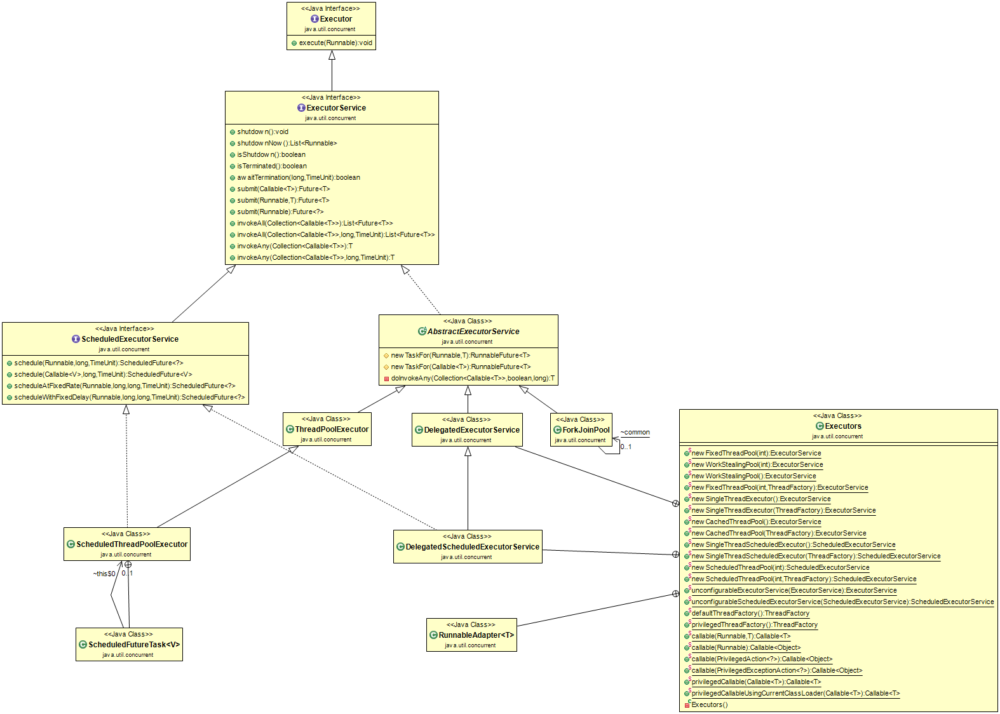

## Java线程池

线程池是可以控制线程创建、释放，并通过某种策略尝试复用线程去执行任务的一种管理框架，从而实现线程资源与任务之间的一种平衡。

线程池的类架构图如下



1. **Executor**

    Executor，这个对象执行已提交的可执行任务。这个接口提供了一种将任务提交与每个任务如何运行的机制(包括线程使用、调度等细节)分离的方法。

    Executor接口只有一个方法
    * void execute(Runnable command):在未来某个时间执行给定的任务，这个命令可以在一个新线程，线程池的线程等执行。

    * 一个Executor通常直接使用而不明确的创建线程，比如

        ```java
        Executor executor = an Executor;
        executor.execute(new RunnableTask1());
        executor.execute(new RunnableTask2());
        ```

    * Executor任务可以不是严格异步的，比如executor可以在调用者线程直接执行提交的任务

        ```java
       class DirectExecutor implements Executor {
            public void execute(Runnable r) {
                r.run();
            }
        }
        ```

    * 更常用的是，任务在一些线程执行而不是调用者的线程

        ```java
        class ThreadPerTaskExecutor implements Executor {
            public void execute(Runnable r) {
                new Thread(r).start();
            }
        }
        ```

    * 许多Executor实现对任务的调度方式和时间施加了某种限制。执行器将任务的提交序列化到第二个执行器，说明了复合执行器。

        ```java
        public class SerialExecutor implements Executor {
            final Queue<Runnable> tasks = new ArrayDeque<Runnable>();
            final Executor executor;
            Runnable active;

            SerialExecutor(Executor executor) {
                this.executor = executor;
            }

            public synchronized void execute(final Runnable r) {
                tasks.offer(new Runnable() {

                    @Override
                    public void run() {
                        try {
                            r.run();
                        } finally {
                            scheduleNext();
                        }

                    }
                });
                if (active == null) {
                    scheduleNext();
                }
            }

            private void scheduleNext() {
                active = tasks.poll();
                if ((active = tasks.poll()) != null) {
                    executor.execute(active);
                }
            }
        }
        ```

2. **ExecutorService**

    ExecutorService，提供方法管理终端且能产生一个Future来追踪一个或多个异步任务。

    ExecutorService可以被关闭，这样会引起拒绝新任务。共有两个方法提供关闭。

    * shutdown:允许之前已经提交的任务在终止之前继续执行
    * shutdownNow:阻止等待的任务启动并且尝试停止正在运行的任务

    方法submit扩展了基本方法Executor.execute(Runnable)，方法创建并返回一个可用于取消执行和/或等待完成的Future。

    方法invokeAny和invokeAll执行最常用的批量执行形式，执行一组任务，然后等待至少一个或全部任务完成。

    ```java
    public class ExecutorServiceDemo {
        class NetworkService implements Runnable{
            private final ServerSocket serverSocket;
            private final ExecutorService pool;

            public NetworkService(int port, int poolSize) throws IOException {
                serverSocket = new ServerSocket(port);
                pool = Executors.newFixedThreadPool(poolSize);
            }


            @Override
            public void run() {
                try {
                    for (;;) {
                        pool.execute(new Handler(serverSocket.accept()));
                    }
                } catch (Exception e) {
                    pool.shutdown();
                }
            }
        }

        public class Handler implements Runnable {
            private final Socket socket;
            public Handler(Socket socket) {
                this.socket = socket;
            }

            @Override
            public void run() {
                //reed and service request on socket
            }
        }
    }
    ```

    方法|说明
    --|--
    void shutdown()|启动有序关闭，在此过程中执行先前提交的任务，但不接受任何新任务。如果已经关闭，调用不会产生额外的效果。
    List<Runnable> shutdownNow()|尝试停止所有正在积极执行的任务，停止处理等待的任务，并返回等待执行的任务列表。
    boolean isShutdown()|如果executor已经被关闭则返回true
    boolean isTerminated()|如果关闭后所有任务都已完成，则返回true。注意，除非首先调用shutdown或shutdown now，否则isTerminated永远不会为真。
    boolean awaitTermination(long timeout, TimeUnit unit) throws InterruptedException|阻塞，直到所有任务都在关机请求之后执行完毕，或者超时发生，或者当前线程被中断(以先发生的情况为准)。
    <T> Future<T> submit(Callable<T> task)|提交一个有返回值的任务以执行，并返回一个表示该任务未决结果的Future。
    <T> Future<T> submit(Runnable task, T result)|提交要执行的可运行任务，并返回表示该任务的Future。将来的get方法将在成功完成后返回给定的结果。
    Future<?> submit(Runnable task)|提交要执行的可运行任务，并返回表示该任务的Future。将来的get方法将在成功完成后返回null。
    <T> List<Future<T>> invokeAll(Collection<? extends Callable<T>> tasks) throws InterruptedException|执行给定的多个任务，在所有任务完成后返回一个Future列表，持有执行状态和返回结果
    <T> List<Future<T>> invokeAll(Collection<? extends Callable<T>> tasks,long timeout, TimeUnit unit) throws InterruptedException|执行给定的多个任务，在所有任务完成后或超时时返回一个Future列表，持有执行状态和返回结果
    <T> T invokeAny(Collection<? extends Callable<T>> tasks) throws InterruptedException, ExecutionException|执行给定的任务，返回已成功完成的任务的结果(即，没有抛出异常)，如果有的话。在正常或异常返回时，未完成的任务将被取消
    <T> T invokeAny(Collection<? extends Callable<T>> tasks,long timeout, TimeUnit unit)|执行给定的任务，返回已成功完成的任务的结果(即，而不抛出异常)，如果在给定超时之前有任何异常。

3. **ScheduledExecutorService**

    ScheduledExecutorService，一个能够在给定时延迟时间执行命令或周期性执行任务。

    这些调度方法可以在一定延迟后创建任务，并且返回一个可以取消或检查执行情况的任务对象。
    方法scheduleAtFiexed和scheduleWithFixedDelay都创建并周期的执行任务直到任务取消。

    例子中，ScheduledExecutorService在一小时内每10秒beep一次。

    ```java
    public class ScheduledExecutorServiceDemo {
        class BeeperControl{
            private final ScheduledExecutorService scheduler = Executors.newScheduledThreadPool(1);
            
            public void beepForAnHour(){
                final Runnable beeper = new Runnable() {          
                    @Override
                    public void run() {
                        System.out.println("beep");
                    }
                };
                
                final ScheduledFuture<?> beeperHandle = scheduler.scheduleAtFixedRate(beeper, 10, 10, TimeUnit.SECONDS);
                scheduler.schedule(new Runnable() {
                    @Override
                    public void run() {
                        beeperHandle.cancel(true);
                    }
                }, 60*60, TimeUnit.SECONDS);
            }        
        }
    }
    ```

    方法|说明
    --|--
    ScheduledFuture<?> schedule(Runnable command, long delay, TimeUnit unit)|创建并执行一个一次性任务，在给定延迟时间后开始有效，返回一个ScheduledFuture对象，用get方法会返回null
    <V> ScheduledFuture<V> schedule(Callable<V> callable, long delay, TimeUnit unit)|创建并执行一个一次性任务，在给定延迟时间后开始有效，返回一个ScheduledFuture对象，用get方法会返回执行任务后的结果
    ScheduledFuture<?> scheduleAtFixedRate(Runnable command, long initialDelay, long period, TimeUnit unit)|创建并执行一个周期性操作，该操作在给定的初始延迟之后首先启用，然后在给定的时间段内启用。**如果此任务的任何执行时间超过其周期，则后续执行可能会延迟开始，但不会并发执行**。如果任务的任何执行遇到异常，则禁止后续执行。否则，任务将仅通过执行器的取消或终止来终止。
    ScheduledFuture<?> scheduleWithFixedDelay(Runnable command, long initialDelay, long delay, TimeUnit unit)|创建并执行一个周期性操作，该操作在给定的初始延迟之后首先启用，**然后在一次执行的终止与下一次执行之间的给定延迟中启用**。如果任务的任何执行遇到异常，则禁止后续执行。否则，任务将仅通过执行器的取消或终止来终止。

    **scheduleAtFixedRate和scheduleWithFixedDelay的区别**
    * scheduleAtFixedRate，是以上一个任务开始的时间计时，period时间过去后，检测上一个任务是否执行完毕，如果上一个任务执行完毕，则当前任务立即执行，如果上一个任务没有执行完毕，则需要等上一个任务执行完毕后立即执行。

    * scheduleWithFixedDelay，是以上一个任务结束时开始计时，delay时间过去后，立即执行。

4. *AbstractExecutorService*

    AbstractExecutorService，提供ExecutorService执行方法的默认实现。该类使用newTaskFor返回的RunnableFuture以实现submit、invokeAny和invokeAll方法，该方法默认为这个包中提供的FutureTask类。

    ```java
    public class AbstractExecutorServiceDemo extends ThreadPoolExecutor{

        static class Task implements RunnableFuture<V>{...};
        
        protected RunnableFuture<V> newTaskFor(Callable<V> c){
            return new Task(c);
        }
        protected Runnable newTaskFor(Runnable r,V v){
            return new Task(r,v);
        }
        
        // ... add constructors, etc.
        
    }
    ```

    方法|说明
    --|--
    <T> RunnableFuture<T> newTaskFor(Runnable runnable, T value)|由给定的runnable和value，返回一个RunnableFuture
    <T> RunnableFuture<T> newTaskFor(Callable<T> callable)|由给定的callable，返回一个RunnableFuture