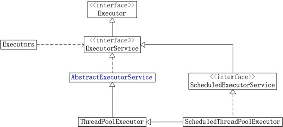

## Java线程池

线程池是可以控制线程创建、释放，并通过某种策略尝试复用线程去执行任务的一种管理框架，从而实现线程资源与任务之间的一种平衡。

线程池的类架构图如下


1. **Executor**

    Executor，这个对象执行已提交的可执行任务。这个接口提供了一种将任务提交与每个任务如何运行的机制(包括线程使用、调度等细节)分离的方法。

    Executor接口只有一个方法
    * void execute(Runnable command):在未来某个时间执行给定的任务，这个命令可以在一个新线程，线程池的线程等执行。

    * 一个Executor通常直接使用而不明确的创建线程，比如

        ```java
        Executor executor = an Executor;
        executor.execute(new RunnableTask1());
        executor.execute(new RunnableTask2());
        ```

    * Executor任务可以不是严格异步的，比如executor可以在调用者线程直接执行提交的任务

        ```java
       class DirectExecutor implements Executor {
            public void execute(Runnable r) {
                r.run();
            }
        }
        ```

    * 更常用的是，任务在一些线程执行而不是调用者的线程

        ```java
        class ThreadPerTaskExecutor implements Executor {
            public void execute(Runnable r) {
                new Thread(r).start();
            }
        }
        ```

    * 许多Executor实现对任务的调度方式和时间施加了某种限制。执行器将任务的提交序列化到第二个执行器，说明了复合执行器。

        ```java
        public class SerialExecutor implements Executor {
            final Queue<Runnable> tasks = new ArrayDeque<Runnable>();
            final Executor executor;
            Runnable active;

            SerialExecutor(Executor executor) {
                this.executor = executor;
            }

            public synchronized void execute(final Runnable r) {
                tasks.offer(new Runnable() {

                    @Override
                    public void run() {
                        try {
                            r.run();
                        } finally {
                            scheduleNext();
                        }

                    }
                });
                if (active == null) {
                    scheduleNext();
                }
            }

            private void scheduleNext() {
                active = tasks.poll();
                if ((active = tasks.poll()) != null) {
                    executor.execute(active);
                }
            }
        }
        ```

2. **ExecutorService**

    ExecutorService，提供方法管理终端且能产生一个Future来追踪一个或多个异步任务。

    ExecutorService可以被关闭，这样会引起拒绝新任务。共有两个方法提供关闭。

    * shutdown:允许之前已经提交的任务在终止之前继续执行
    * shutdownNow:阻止等待的任务启动并且尝试停止正在运行的任务

    方法submit扩展了基本方法Executor.execute(Runnable)，方法创建并返回一个可用于取消执行和/或等待完成的Future。

    方法invokeAny和invokeAll执行最常用的批量执行形式，执行一组任务，然后等待至少一个或全部任务完成。

    ```java
    public class ExecutorServiceDemo {
        class NetworkService implements Runnable{
            private final ServerSocket serverSocket;
            private final ExecutorService pool;

            public NetworkService(int port, int poolSize) throws IOException {
                serverSocket = new ServerSocket(port);
                pool = Executors.newFixedThreadPool(poolSize);
            }


            @Override
            public void run() {
                try {
                    for (;;) {
                        pool.execute(new Handler(serverSocket.accept()));
                    }
                } catch (Exception e) {
                    pool.shutdown();
                }
            }
        }

        public class Handler implements Runnable {
            private final Socket socket;
            public Handler(Socket socket) {
                this.socket = socket;
            }

            @Override
            public void run() {
                //reed and service request on socket
            }
        }
    }
    ```

    方法|说明
    --|--
    void shutdown()|启动有序关闭，在此过程中执行先前提交的任务，但不接受任何新任务。如果已经关闭，调用不会产生额外的效果。
    List<Runnable> shutdownNow()|尝试停止所有正在积极执行的任务，停止处理等待的任务，并返回等待执行的任务列表。
    boolean isShutdown()|如果executor已经被关闭则返回true
    boolean isTerminated()|如果关闭后所有任务都已完成，则返回true。注意，除非首先调用shutdown或shutdown now，否则isTerminated永远不会为真。
    boolean awaitTermination(long timeout, TimeUnit unit) throws InterruptedException|阻塞，直到所有任务都在关机请求之后执行完毕，或者超时发生，或者当前线程被中断(以先发生的情况为准)。
    <T> Future<T> submit(Callable<T> task)|提交一个有返回值的任务以执行，并返回一个表示该任务未决结果的Future。
    <T> Future<T> submit(Runnable task, T result)|提交要执行的可运行任务，并返回表示该任务的Future。将来的get方法将在成功完成后返回给定的结果。
    Future<?> submit(Runnable task)|提交要执行的可运行任务，并返回表示该任务的Future。将来的get方法将在成功完成后返回null。
    <T> List<Future<T>> invokeAll(Collection<? extends Callable<T>> tasks) throws InterruptedException|执行给定的多个任务，在所有任务完成后返回一个Future列表，持有执行状态和返回结果
    <T> List<Future<T>> invokeAll(Collection<? extends Callable<T>> tasks,long timeout, TimeUnit unit) throws InterruptedException|执行给定的多个任务，在所有任务完成后或超时时返回一个Future列表，持有执行状态和返回结果
    <T> T invokeAny(Collection<? extends Callable<T>> tasks) throws InterruptedException, ExecutionException|执行给定的任务，返回已成功完成的任务的结果(即，没有抛出异常)，如果有的话。在正常或异常返回时，未完成的任务将被取消
    <T> T invokeAny(Collection<? extends Callable<T>> tasks,long timeout, TimeUnit unit)|执行给定的任务，返回已成功完成的任务的结果(即，而不抛出异常)，如果在给定超时之前有任何异常。

3. **ScheduledExecutorService**

二、ThreadPoolExecutor

    1、ThreadPoolExecutor构造参数

    2、ThreadPoolExecutor线程池执行流程

三、Executors静态工厂创建几种常用线程池

## 一、线程池架构



概括一下：

* Executor是最基础的执行接口；

* ExecutorService接口继承了Executor，在其上做了一些shutdown()、submit()的扩展，可以说是真正的线程池接口；

* AbstractExecutorService抽象类实现了ExecutorService接口中的大部分方法；

* TheadPoolExecutor继承了AbstractExecutorService，是线程池的具体实现；

* ScheduledExecutorService接口继承了ExecutorService接口，提供了带"周期执行"功能ExecutorService；

* ScheduledThreadPoolExecutor既继承了TheadPoolExecutor线程池，也实现了ScheduledExecutorService接口，是带"周期执行"功能的线程池；

* Executors是线程池的静态工厂，其提供了快捷创建线程池的静态方法。

1. Executor接口

    “执行者”接口，只提供了一个方法：

    ```java
    void execute(Runnable command);
    ```

    可以用来执行已经提交的Runnable任务对象，这个接口提供了一种将“任务提交”与“任务执行”解耦的方法。

2. ExecutorService接口

    “执行者服务”接口，可以说是真正的线程池接口，在Executor接口的基础上做了一些扩展，主要是

    * 管理任务如何终止的 shutdown相关方法

        ```java
        /**
        * 启动一次有序的关闭，之前提交的任务执行，但不接受新任务
        * 这个方法不会等待之前提交的任务执行完毕
        */
        void shutdown();

        /**
        * 试图停止所有正在执行的任务，暂停处理正在等待的任务，返回一个等待执行的任务列表
        * 这个方法不会等待正在执行的任务终止
        */
        List<Runnable> shutdownNow();

        /**
        * 如果已经被shutdown，返回true
        */
        boolean isShutdown();

        /**
        * 如果所有任务都已经被终止，返回true
        * 是否为终止状态
        */
        boolean isTerminated();

        /**
        * 在一个shutdown请求后，阻塞的等待所有任务执行完毕
        * 或者到达超时时间，或者当前线程被中断
        */
        boolean awaitTermination(long timeout, TimeUnit unit) throws InterruptedException;
        ```

    * 可以生成用于追踪一个或多个异步任务执行结果的Future对象的 submit()相关方法

        ```java
        /**
        * 提交一个可执行的任务，返回一个Future代表这个任务
        * 等到任务成功执行，Future#get()方法会返回null
        */
        Future<?> submit(Runnable task);

        /**
        * 提交一个可以执行的任务，返回一个Future代表这个任务
        * 等到任务执行结束，Future#get()方法会返回这个给定的result
        */
        <T> Future<T> submit(Runnable task, T result);

        /**
        * 提交一个有返回值的任务，并返回一个Future代表等待的任务执行的结果
        * 等到任务成功执行，Future#get()方法会返回任务执行的结果
        */
        <T> Future<T> submit(Callable<T> task);
        ```

3. ScheduledExecutorService接口

    ```java
    /**
    * 在给定延时后，创建并执行一个一次性的Runnable任务
    * 任务执行完毕后，ScheduledFuture#get()方法会返回null
    */
    public ScheduledFuture<?> schedule(Runnable command, long delay, TimeUnit unit);

    /**
    * 在给定延时后，创建并执行一个ScheduledFutureTask
    * ScheduledFuture 可以获取结果或取消任务
    */
    public <V> ScheduledFuture<V> schedule(Callable<V> callable, ong delay, TimeUnit unit);

    /**
    * 创建并执行一个在给定初始延迟后首次启用的定期操作，后续操作具有给定的周期
    * 也就是将在 initialDelay 后开始执行，然后在 initialDelay+period 后执行，接着在 initialDelay + 2 * period 后执行，依此类推
    * 如果执行任务发生异常，随后的任务将被禁止，否则任务只会在被取消或者Executor被终止后停止
    * 如果任何执行的任务超过了周期，随后的执行会延时，不会并发执行
    */
    public ScheduledFuture<?> scheduleAtFixedRate(Runnable command,
                                                    long initialDelay,
                                                    long period,
                                                    TimeUnit unit);

    /**
    * 创建并执行一个在给定初始延迟后首次启用的定期操作，随后，在每一次执行终止和下一次执行开始之间都存在给定的延迟
    * 如果执行任务发生异常，随后的任务将被禁止，否则任务只会在被取消或者Executor被终止后停止
    */
    public ScheduledFuture<?> scheduleWithFixedDelay(Runnable command,
                                                        long initialDelay,
                                                        long delay,
                                                        TimeUnit unit);
    ```

## 二、ThreadPoolExecutor

1. ThreadPoolExecutor构造参数

    ```java
    public ThreadPoolExecutor(int corePoolSize,
                          int maximumPoolSize,
                          long keepAliveTime,
                          TimeUnit unit,
                          BlockingQueue<Runnable> workQueue,
                          ThreadFactory threadFactory,
                          RejectedExecutionHandler handler)
    ```

    * corePoolSize

        线程池中的核心线程数，当提交一个任务时，线程池创建一个新线程执行任务，直到当前线程数等于corePoolSize；

        如果当前线程数为corePoolSize，继续提交的任务被保存到阻塞队列中，等待被执行；

        如果执行了线程池的prestartAllCoreThreads()方法，线程池会提前创建并启动所有核心线程。

    * maximumPoolSize

        线程池中允许的最大线程数。如果当前阻塞队列满了，且继续提交任务，则创建新的线程执行任务，前提是当前线程数小于maximumPoolSize

    * keepAliveTime

        线程空闲时的存活时间，即当线程没有任务执行时，继续存活的时间。默认情况下，该参数只在线程数大于corePoolSize时才有用

    * workQueue

        workQueue必须是BlockingQueue阻塞队列。当线程池中的线程数超过它的corePoolSize的时候，线程会进入阻塞队列进行阻塞等待。通过workQueue，线程池实现了阻塞功能

        **几种排队的策略**：

        1. 不排队，直接提交

            将任务直接交给线程处理而不保持它们，可使用SynchronousQueue
            如果不存在可用于立即运行任务的线程（即线程池中的线程都在工作），则试图把任务加入缓冲队列将会失败，因此会构造一个新的线程来处理新添加的任务，并将其加入到线程池中（corePoolSize-->maximumPoolSize扩容）
            Executors.newCachedThreadPool()采用的便是这种策略

        2. 无界队列

            可以使用LinkedBlockingQueue（基于链表的有界队列，FIFO），理论上是该队列可以对无限多的任务排队

            将导致在所有corePoolSize线程都工作的情况下将新任务加入到队列中。这样，创建的线程就不会超过corePoolSize，也因此，maximumPoolSize的值也就无效了

        3. 有界队列

            可以使用ArrayBlockingQueue（基于数组结构的有界队列，FIFO），并指定队列的最大长度

            使用有界队列可以防止资源耗尽，但也会造成超过队列大小和maximumPoolSize后，提交的任务被拒绝的问题，比较难调整和控制。

    * threadFactory

        创建线程的工厂，通过自定义的线程工厂可以给每个新建的线程设置一个具有识别度的线程名

        ```java
        /**
        * The default thread factory
        */
        static class DefaultThreadFactory implements ThreadFactory {
            private static final AtomicInteger poolNumber = new AtomicInteger(1);
            private final ThreadGroup group;
            private final AtomicInteger threadNumber = new AtomicInteger(1);
            private final String namePrefix;

            DefaultThreadFactory() {
                SecurityManager s = System.getSecurityManager();
                group = (s != null) ? s.getThreadGroup() :
                                    Thread.currentThread().getThreadGroup();
                namePrefix = "pool-" +
                            poolNumber.getAndIncrement() +
                            "-thread-";
            }

            public Thread newThread(Runnable r) {
                Thread t = new Thread(group, r,
                                    namePrefix + threadNumber.getAndIncrement(),
                                    0);
                if (t.isDaemon())
                    t.setDaemon(false);
                if (t.getPriority() != Thread.NORM_PRIORITY)
                    t.setPriority(Thread.NORM_PRIORITY);
                return t;
            }
        }
        ```

        Executors静态工厂里默认的threadFactory，线程的命名规则是“pool-数字-thread-数字”

    * RejectedExecutionHandler（饱和策略）

        线程池的饱和策略，当阻塞队列满了，且没有空闲的工作线程，如果继续提交任务，必须采取一种策略处理该任务，线程池提供了4种策略：

        1. AbortPolicy：直接抛出异常，默认策略；

        2. CallerRunsPolicy：用调用者所在的线程来执行任务；

        3. DiscardOldestPolicy：丢弃阻塞队列中靠最前的任务，并执行当前任务；

        4. DiscardPolicy：直接丢弃任务；

        当然也可以根据应用场景实现RejectedExecutionHandler接口，自定义饱和策略，如记录日志或持久化存储不能处理的任务。

2. ThreadPoolExecutor线程池执行流程

    根据ThreadPoolExecutor源码前面大段的注释，我们可以看出，当试图通过execute方法将一个Runnable任务添加到线程池中时，按照如下顺序来处理：

    1. 如果线程池中的线程数量少于corePoolSize，就创建新的线程来执行新添加的任务；

    2. 如果线程池中的线程数量大于等于corePoolSize，但队列workQueue未满，则将新添加的任务放到workQueue中，按照FIFO的原则依次等待执行（线程池中有线程空闲出来后依次将队列中的任务交付给空闲的线程执行）；

    3. 如果线程池中的线程数量大于等于corePoolSize，且队列workQueue已满，但线程池中的线程数量小于maximumPoolSize，则会创建新的线程来处理被添加的任务；

    4. 如果线程池中的线程数量等于了maximumPoolSize，就用RejectedExecutionHandler来做拒绝处理

    总结，当有新的任务要处理时，先看线程池中的线程数量是否大于**corePoolSize**，再看缓冲队列**workQueue**是否满，最后看线程池中的线程数量是否大于**maximumPoolSize**

    另外，当线程池中的线程数量大于corePoolSize时，如果里面有线程的空闲时间超过了keepAliveTime，就将其移除线程池

## 三、Executors静态工厂创建几种常用线程池

Exectors工厂类提供了线程池的初始化接口，主要有如下几种：

* newFixedThreadPool

```java
public static ExecutorService  (int nThreads) {
    return new ThreadPoolExecutor(nThreads, nThreads,
                                  0L, TimeUnit.MILLISECONDS,
                                  new LinkedBlockingQueue<Runnable>());
}

public static ExecutorService newFixedThreadPool(int nThreads, ThreadFactory threadFactory) {
    return new ThreadPoolExecutor(nThreads, nThreads,
                                  0L, TimeUnit.MILLISECONDS,
                                  new LinkedBlockingQueue<Runnable>(),
                                  threadFactory);
}
```

创建一个指定工作线程数的线程池，其中参数 corePoolSize 和 maximumPoolSize 相等，阻塞队列基于LinkedBlockingQueue

它是一个典型且优秀的线程池，它具有线程池提高程序效率和节省创建线程时所耗的开销的优点。但是在线程池空闲时，即线程池中没有可运行任务时，它也不会释放工作线程，还会占用一定的系统资源

* newSingleThreadExecutor

```java
public static ExecutorService newSingleThreadExecutor() {
    return new FinalizableDelegatedExecutorService
        (new ThreadPoolExecutor(1, 1,
                                0L, TimeUnit.MILLISECONDS,
                                new LinkedBlockingQueue<Runnable>()));
}

public static ExecutorService newSingleThreadExecutor(ThreadFactory threadFactory) {
    return new FinalizableDelegatedExecutorService
        (new ThreadPoolExecutor(1, 1,
                                0L, TimeUnit.MILLISECONDS,
                                new LinkedBlockingQueue<Runnable>(),
                                threadFactory));
}
```

初始化的线程池中只有一个线程，如果该线程异常结束，会重新创建一个新的线程继续执行任务，**唯一的线程可以保证所提交任务的顺序执行**，内部使用LinkedBlockingQueue作为阻塞队列

* newCachedThreadPool

```java
public static ExecutorService newCachedThreadPool() {
    return new ThreadPoolExecutor(0, Integer.MAX_VALUE,
                                  60L, TimeUnit.SECONDS,
                                  new SynchronousQueue<Runnable>());
}

public static ExecutorService newCachedThreadPool(ThreadFactory threadFactory) {
    return new ThreadPoolExecutor(0, Integer.MAX_VALUE,
                                  60L, TimeUnit.SECONDS,
                                  new SynchronousQueue<Runnable>(),
                                  threadFactory);
}
```

创建一个可缓存工作线程的线程池，默认存活时间60秒，线程池的线程数可达到Integer.MAX_VALUE，即2147483647，内部使用SynchronousQueue作为阻塞队列；

在没有任务执行时，当线程的空闲时间超过keepAliveTime，则工作线程将会终止，当提交新任务时，如果没有空闲线程，则创建新线程执行任务，会导致一定的系统开销

* newScheduledThreadPool

```java
public static ScheduledExecutorService newScheduledThreadPool(int corePoolSize) {
    return new ScheduledThreadPoolExecutor(corePoolSize);
}

public static ScheduledExecutorService newScheduledThreadPool(
        int corePoolSize, ThreadFactory threadFactory) {
    return new ScheduledThreadPoolExecutor(corePoolSize, threadFactory);
}
```

初始化的线程池可以在指定的时间内周期性的执行所提交的任务，在实际的业务场景中可以使用该线程池定期的同步数据

**注意：**

ScheduledExecutorService.scheduleAtFixedRate() 指的是“以固定的频率”执行，period（周期）指的是两次成功执行之间的时间

比如，scheduleAtFixedRate(command, 5, 2, second)，第一次开始执行是5s后，假如执行耗时1s，那么下次开始执行是7s后，再下次开始执行是9s后

而ScheduledExecutorService.scheduleWithFixedDelay()  指的是“以固定的延时”执行，delay（延时）指的是一次执行终止和下一次执行开始之间的延迟

还是上例，scheduleWithFixedDelay(command, 5, 2, second)，第一次开始执行是5s后，假如执行耗时1s，执行完成时间是6s后，那么下次开始执行是8s后，再下次开始执行是11s后