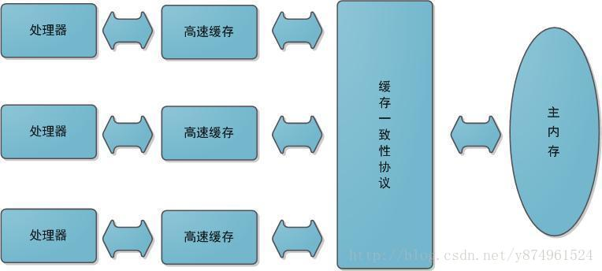
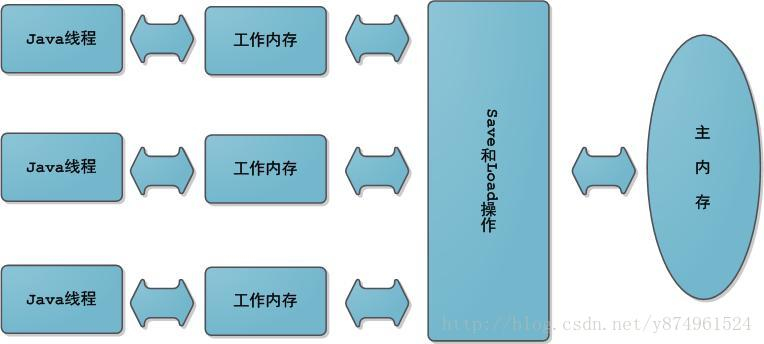
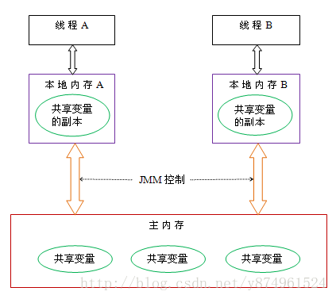
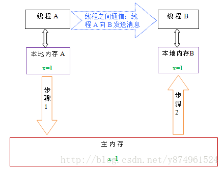

## Java 线程通信内存模型---主内存与工作内存

```
多任务和高并发是衡量一台计算机处理器的能力重要指标之一。一般衡量一个服务器性能的高低好坏，使用每秒事务处理数（Transactions Per Second，TPS）这个指标比较能说明问题，它代表着一秒内服务器平均能响应的请求数，而TPS值与程序的并发能力有着非常密切的关系。在讨论Java内存模型和线程之前，先简单介绍一下硬件的效率与一致性。
```

#### 硬件的效率与一致性

 由于计算机的存储设备与处理器的运算能力之间有几个数量级的差距，所以现代计算机系统都不得不加入一层读写速度尽可能接近处理器运算速度的高速缓存（cache）来作为内存与处理器之间的缓冲：将运算需要使用到的数据复制到缓存中，让运算能快速进行，当运算结束后再从缓存同步回内存之中没这样处理器就无需等待缓慢的内存读写了。

 基于高速缓存的存储交互很好地解决了处理器与内存的速度矛盾，但是引入了一个新的问题：**缓存一致性（Cache Coherence）**。在多处理器系统中，每个处理器都有自己的高速缓存，而他们又共享同一主存，如下图所示：多个处理器运算任务都涉及同一块主存，需要一种协议可以保障数据的一致性，这类协议有MSI、MESI、MOSI及Dragon Protocol等。Java虚拟机内存模型中定义的内存访问操作与硬件的缓存访问操作是具有可比性的，后续将介绍Java内存模型。




除此之外，为了使得处理器内部的运算单元能竟可能被充分利用，处理器可能会对输入代码进行乱起执行（Out-Of-Order Execution）优化，处理器会在计算之后将对乱序执行的代码进行结果重组，保证结果准确性。与处理器的乱序执行优化类似，Java虚拟机的即时编译器中也有类似的指令重排序（Instruction Recorder）优化。

#### Java中的内存模型

Java中的内存模型与硬件中的内存模型类似.

* **主内存与工作内存**

    Java内存模型的主要目标是定义程序中各个变量的访问规则，即在虚拟机中将变量存储到内存和从内存中取出变量这样底层细节。**此处的变量与Java编程时所说的变量不一样，指包括了实例字段、静态字段和构成数组对象的元素**，但是不包括局部变量与方法参数，后者是线程私有的，不会被共享。

    **Java内存模型中规定了所有的变量都存储在主内存中**，每条线程还有自己的工作内存（可以与前面将的处理器的高速缓存类比），线程的工作内存中保存了该线程使用到的变量到主内存副本拷贝，**线程对变量的所有操作（读取、赋值）都必须在工作内存中进行，而不能直接读写主内存中的变量**。不同线程之间无法直接访问对方工作内存中的变量，线程间变量值的传递均需要在主内存来完成，线程、主内存和工作内存的交互关系如下图所示，和上图很类似。

    


    **NOTE: 工作内存只会拷贝对象的引用,而不是直接拷贝整个对象,对象在堆中生成,对所有对象都是可见的**。

* 主内存与工作内存之间的通信

    Java线程之间的通信由Java内存模型（本文简称为JMM）控制，JMM决定一个线程对共享变量的写入何时对另一个线程可见。从抽象的角度来看，JMM定义了线程和主内存之间的抽象关系：**线程之间的共享变量存储在主内存（main memory）中，每个线程都有一个私有的本地内存（local memory），本地内存中存储了该线程以读/写共享变量的副本**。本地内存是JMM的一个抽象概念，并不真实存在。**它涵盖了缓存，写缓冲区，寄存器以及其他的硬件和编译器优化**。 
    
    

* 内存之间的交互操作

    关于主内存与工作内存之间的具体交互协议，即一个变量如何从主内存拷贝到工作内存、如何从工作内存同步到主内存之间的实现细节，Java内存模型定义了以下八种操作来完成：

    八种线程之间的交互指令：
    1. lock（锁定）：作用于主内存的变量，把一个变量标识为一条线程独占状 。

    2. unlock（解锁）：作用于主内存变量，把一个处于锁定状态的变量释放出来，释放后的变量才可以被其他线程锁定。

    3. read（读取）：作用于主内存变量，把一个变量值从主内存传输到线程的工作内存中，以便随后的load动作使用

    4. load（载入）：作用于工作内存的变量，它把read操作从主内存中得到的变量值放入工作内存的变量副本中。

    5. use（使用）：作用于工作内存的变量，把工作内存中的一个变量值传递给执行引擎，每当虚拟机遇到一个需要使用变量的值的字节码指令时将会执行这个操作。

    6. assign（赋值）：作用于工作内存的变量，它把一个从执行引擎接收到的值赋值给工作内存的变量，每当虚拟机遇到一个给变量赋值的字节码指令时执行这个操作。

    7. store（存储）：作用于工作内存的变量，把工作内存中的一个变量的值传送到主内存中，以便随后的write的操作。

    8. write（写入）：作用于主内存的变量，它把store操作从工作内存中一个变量的值传送到主内存的变量中。

* JMM对交互指令的约束

    如果要把一个变量从主内存中复制到工作内存，就需要按顺寻地执行read和load操作，如果把变量从工作内存中同步回主内存中，就要按顺序地执行store和write操作。

    Java内存模型只要求上述操作必须按顺序执行，而没有保证必须是连续执行。也就是read和load之间，store和write之间是可以插入其他指令的，如对主内存中的变量a、b进行访问时，可能的顺序是read a，read b，load b， load a。Java内存模型还规定了在执行上述八种基本操作时，必须满足如下规则：

    * 不允许read和load、store和write操作之一单独出现

    * 不允许一个线程丢弃它的最近assign的操作，即变量在工作内存中改变了之后必须同步到主内存中。

    * 不允许一个线程无原因地（没有发生过任何assign操作）把数据从工作内存同步回主内存中。

    * 一个新的变量只能在主内存中诞生，不允许在工作内存中直接使用一个未被初始化（load或assign）的变量。即就是对一个变量实施use和store操作之前，必须先执行过了assign和load操作。

    * 一个变量在同一时刻只允许一条线程对其进行lock操作，lock和unlock必须成对出现

    * 如果对一个变量执行lock操作，将会清空工作内存中此变量的值，在执行引擎使用这个变量前需要重新执行load或assign操作初始化变量的值

    * 如果一个变量事先没有被lock操作锁定，则不允许对它执行unlock操作；也不允许去unlock一个被其他线程锁定的变量。

    * 对一个变量执行unlock操作之前，必须先把此变量同步到主内存中（执行store和write操作）。

* 主内存与工作内存之间的通信
    
    两个线程之间进行通信时，必须经过下面两个步骤

    * 线程A把本地内存A中更新过的共享变量刷新到主内存中去。

    * 线程B到主内存中去读取线程A之前已更新过的共享变量。

    这两个过程就是通过JMM内存之间的交互指令实现的。

    


    如上图所示，本地内存A和B有主内存中共享变量x的副本。

    假设初始时，这三个内存中的x值都为0。线程A在执行时，把更新后的x值（假设值为1）临时存放在自己的本地内存A中。当线程A和线程B需要通信时，线程A首先会把自己本地内存中修改后的x值刷新到主内存中，此时主内存中的x值变为了1。

    随后，线程B到主内存中去读取线程A更新后的x值，此时线程B的本地内存的x值也变为了1。

    从整体来看，这两个步骤实质上是线程A在向线程B发送消息，而且这个通信过程必须要经过主内存。JMM通过控制主内存与每个线程的本地内存之间的交互，来为java程序员提供内存可见性保证。

原文：https://blog.csdn.net/y874961524/article/details/61617778