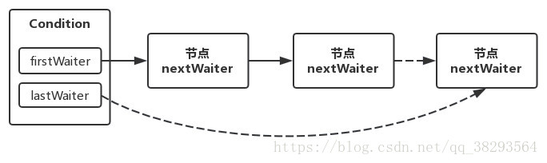
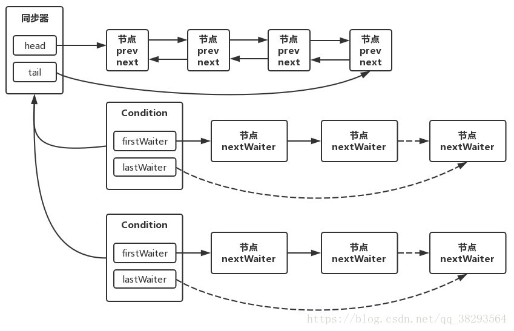
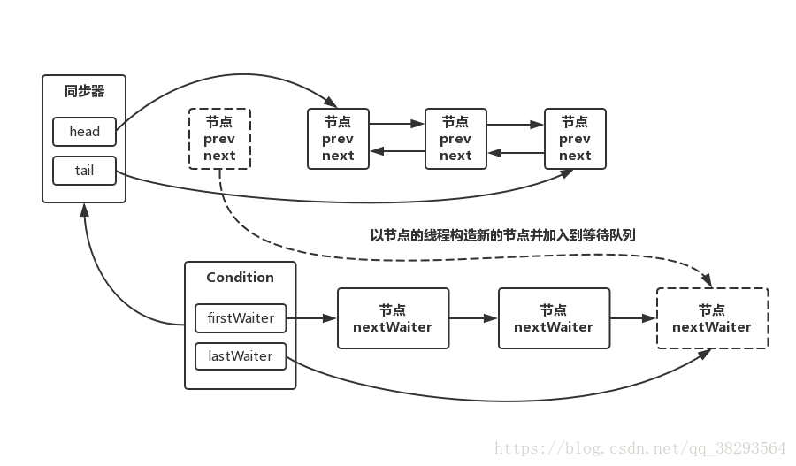
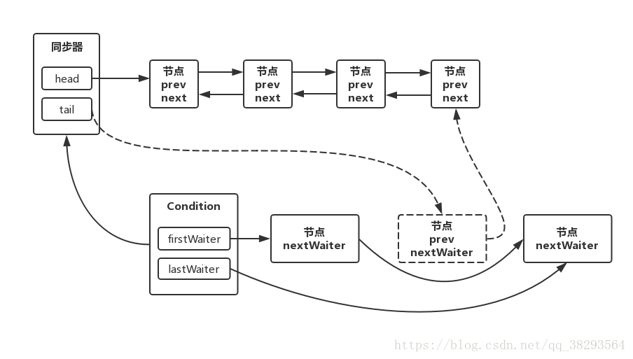

## Lock、Condition、ReentrantLock、ReentrantReadWriteLock

#### Lock

1. 背景

    锁是用来控制多个线程访问共享资源的方式，一般来说，一个锁能够防止多个线程同时访问共享资源。在Java SE5之前，Java程序是靠synchronized关键字实现锁功能的，使用synchronized关键字将会隐式地获取锁，但是它将锁的获取和释放固化了，也就是先获取再释放，这种方式简化了同步的管理，可是扩展性没有显式地锁获取和释放来的好。例如，考虑下面这样一个情景：

    针对一个场景，使用synchronized进行锁获取和释放，先获得锁A，然后获得锁B，当锁B获取之后，释放锁A同时获取锁C，当锁C获得后，在释放B同时获取锁D，以此类推。这时，使用synchronized关键字就不那么容易实现了，而使用显式地锁获取和释放则很简单。

    在Java SE5之后，并发包中新增了Lock接口以及相关实现类，用来实现锁功能，它提供了与synchronized类似的同步功能，只是在使用时需要显式地获取和释放锁。虽然它缺少了隐式获取释放锁的便捷性，但是却拥有了锁获取与释放的可操作性、可中断的获取锁以及超时获取锁等多种synchronized所不具备的特性。

2. Lock接口

    Lock接口的使用很简单，常见的使用方式如下代码所示：
    ```java
    Lock lock = new ReentrantLock();
    lock.lock();
    
    try {
        // do something...
    } finally {
        lock.unlock();
    }
    ```

    在使用Lock锁的时候要**注意**以下几点：

    * 要在finally块中释放锁，目的是保证在获取到锁之后，最终能够被释放。
    * 不要将获取锁的过程写在try块中，因为如果在获取锁（可以是自定义的锁）时发生了异常，在异常抛出的同时，也会导致锁的无故释放。

    Lock接口提供的synchronized不具备的**主要特征**如下：
    特  性|描  述
    --|--
    尝试非阻塞地获取锁|当前线程尝试获取锁，如果这一刻锁没有被其他线程获取到，则成功获取并持有锁。
    能被中断地获取锁|与synchronized不同，获取到锁的线程能够相应中断，当获取到锁的线程被中断时，中断异常将会被抛出，同时锁会被释放。
    超时获取锁|在指定的截止时间之前获取锁，如果截止时间到了仍没有获取到锁，则返回。

    Lock是一个接口，它定义了锁获取和释放的基本操作，**Lock的API**如下所示：
    方法名称|描  述
    --|--
    void lock()|获取锁，调用该方法当前线程会获取锁，当锁获取后，从该方法返回。
    void lockInterruptibly() throws InterruptedException|可中断地获取锁，与lock()方法的不同之处在于该方法会响应中断，即在锁的获取中可以中断当前线程。
    boolean tryLock()|尝试非阻塞地获取锁，调用该方法后立即返回，如果能够获取锁则返回true，否则返回false。
    boolean tryLock(long time, TimeUnit unit) throws InterruptedException|超时地获取锁，当前线程在以下3种情况下会返回：</br>1. 当前线程在超时时间内获取了锁 </br>2. 当前线程在超时时间内被中断 </br>3. 超时时间结束，返回false
    void unlock()|释放锁
    Condition newCondition()|获取等待通知组件，在组件和当前的锁绑定，当前线程只有获取了锁，才能调用该组件的await()方法，而调用后，当前线程将会释放锁。

    Lock接口的实现基本都是通过聚合了一个AbstractQueuedSynchronizer同步器的子类来完成线程访问控制的，下面介绍Lock的实现类。


#### Condition

1. 背景

    在Java程序中，任意一个Java对象，都拥有一组监视器方法（定义在java.lang.Object类上），主要包括wait()、wait(long)、notify()、notifyAll()方法，这些方法与synchronized关键字配合，可以实现等待/通知模式。Condition接口也提供了类似Object的监视器方法，与Lock配合可以实现等待/通知模式，但是这两者在使用方式以及功能特性上还是有区别的。Object的监视器方法与Condition接口对比如下：

    对比项|Object监视器方法|Condition
    --|--|--
    前置条件|获取对象的监视器锁|调用Lock.lock()获取锁</br>调用Lock.newCondition()获取Condition对象
    调用方法|直接调用：object.wait()|直接调用：condition.await()
    等待队列个数|一个|多个
    当前线程释放锁并进入等待队列|支持|支持
    当前线程释放锁并进入等待队列，在等待状态中不响应中断|不支持|支持
    当前线程释放锁并进入超时等待状态|支持|支持
    当前线程释放锁并进入等待状态到将来的某个时间|不支持|支持
    唤醒等待队列中的一个线程|支持|支持
    唤醒等待队列中的全部线程|支持|支持

2. Condition接口

    方法名称|描  述
    --|--
    void await() throws InterruptedException|当前线程进入等待状态直到被通知（signal）或中断。
    void awaitUninterruptibly()|当前线程进入等待状态直到被通知，该方法不响应中断。
    long awaitNanos(long nanosTimeout) throws InterruptedException|当前线程进入等待状态直到被通知、中断或者超时，返回值表示剩余超时时间。
    boolean awaitUntil(Date deadline) throws InterruptedException|当前线程进入等待状态直到被通知、中断或者到某个时间。如果没有到指定时间就被通知，方法返回true，否则，表示到了指定时间，返回false。
    void signal()|唤醒一个等待在Condition上的线程，该线程从等待方法返回前必须获得与Condition相关联的锁。
    void signalAll()|唤醒所有等待在Condition上的线程，能够从等待方法返回的线程必须获得与Condition相关联的锁。

3. Condition的实现类ConditionObject

    可以通过Lock.newCondition()方法获取Condition对象，而我们知道Lock对于同步状态的实现都是通过内部的自定义同步器实现的，newCondition()方法也不例外，**所以，Condition接口的唯一实现类是同步器AQS的内部类ConditionObject**，因为Condition的操作需要获取相关的锁，所以作为同步器的内部类也比较合理，该类定义如下：

    ```java
    public class ConditionObject implements Condition, java.io.Serializable
    ```

    每个Condition对象都包含着一个队列（以下称为等待队列），该队列是Condition对象实现等待/通知功能的关键。

    * 等待队列

        等待队列是一个FIFO队列，在队列中的每个节点都包含了一个线程引用，该线程就是在Condition对象上等待的线程，如果一个线程调用了Condition.await()方法，那么该线程将会释放锁、构造成节点加入等待队列并进入等待状态。事实上，节点的定义复用了AQS中Node节点的定义，也就是说，同步队列和等待队列中节点类型都是AQS的静态内部类AbstractQueuedSynchronized.Node。

        一个Condition包含一个等待队列，Condition拥有首节点（firstWaiter）和尾节点（lastWaiter）。当前线程调用Condition.await()方法之后，将会以当前线程构造节点，并将节点从尾部加入等待队列，等待队列的基本结构如下图所示：

        

        Condition拥有首尾节点的引用，而新增节点只需要将原来的尾节点nextWaiter指向它，并且更新尾节点即可。上述更新过程不需要CAS保证，原因在于调用await()方法的线程必定是获取了锁的线程，也就是说该过程是由锁来保证线程安全的。

        在Object的监视器模型上，一个对象拥有一个同步队列和等待队列，而并发包中的Lock（更确切地说是同步器）拥有一个同步队列和多个等待队列，其对应关系如下图所示：

        

        Condition的实现是同步器的内部类，因此每个Condition实例都能够访问同步器提供的方法，相当于每个Condition都拥有所属同步器的引用。

    * **await() 等待**

        调用Condition的await()方法会使当前线程进入等待状态，同时线程状态变为等待状态，当从await()方法返回时，当前线程一定获取了Condition相关联的锁。

        如果从队列（同步队列和等待队列）的角度看await()方法，当调用await()方法时，相当于同步队列的首节点（获取了锁的节点）移动到Condition的等待队列中。

        Condition的await()方法如下：

        ```java
        public final void await() throws InterruptedException {
            // 检测线程中断状态
            if (Thread.interrupted())
                throw new InterruptedException();
            // 将当前线程包装为Node节点加入等待队列
            Node node = addConditionWaiter();
            // 释放同步状态，也就是释放锁
            int savedState = fullyRelease(node);
            int interruptMode = 0;
            // 检测该节点是否在同步队中，如果不在，则说明该线程还不具备竞争锁的资格，则继续等待
            while (!isOnSyncQueue(node)) {
                // 挂起线程
                LockSupport.park(this);
                if ((interruptMode = checkInterruptWhileWaiting(node)) != 0)
                    break;
            }
            // 竞争同步状态
            if (acquireQueued(node, savedState) && interruptMode != THROW_IE)
                interruptMode = REINTERRUPT;
            // 清理条件队列中的不是在等待条件的节点
            if (node.nextWaiter != null) // clean up if cancelled
                unlinkCancelledWaiters();
            if (interruptMode != 0)
                reportInterruptAfterWait(interruptMode);
        }
        ```

        调用该方法的线程是成功获取了锁的线程，也就是同步队列中的首节点，该方法会将当前线程构造节点并加入等待队列中，然后释放同步状态，唤醒同步队列中的后继节点，然后当前线程会进入等待状态。

    * *addConditionWaiter 加入等待队列*

        调用方法addConditionWaiter()方法来加入等待队列：

        ```java
        private Node addConditionWaiter() {
            // 尾节点
            Node t = lastWaiter;
            // 尾节点如果不是CONDITION状态，则表示该节点不处于等待状态，需要清理节点
            if (t != null && t.waitStatus != Node.CONDITION) {
                unlinkCancelledWaiters();
                t = lastWaiter;
            }
            // 根据当前线程创建Node节点
            Node node = new Node(Thread.currentThread(), Node.CONDITION);
            // 将该节点加入等待队列的末尾
            if (t == null)
                firstWaiter = node;
            else
                t.nextWaiter = node;
            lastWaiter = node;
            return node;
        }
        ```

        如果从队列的角度看，当前线程加入到Condition的等待队列，如下图所示：

        

    * *fullyRelease(Node) 全释放*

        将当前线程加入到等待队列之后，需要释放同步状态，该操作通过fullyRelease(Node)方法来完成：

        ```java
        final int fullyRelease(Node node) {
            boolean failed = true;
            try {
                // 获取同步状态
                int savedState = getState();
                // 释放锁
                if (release(savedState)) {
                    failed = false;
                    return savedState;
                } else {
                    throw new IllegalMonitorStateException();
                }
            } finally {
                if (failed)
                    node.waitStatus = Node.CANCELLED;
            }
        }
        ```
    * *isOnSyncQueue(Node) 检查其对应节点是否在同步队列中*
    
        线程释放锁之后，我们需要通过isOnSyncQueue(Node)方法不断自省地检查其对应节点是否在同步队列中：

        ```java
        final boolean isOnSyncQueue(Node node) {
            // 节点状态为CONDITION，或者前驱节点为null，返回false
            if (node.waitStatus == Node.CONDITION || node.prev == null)
                return false;
            // 后继节点不为null，那么肯定在同步队列中
            if (node.next != null) // If has successor, it must be on queue
                return true;
            
            return findNodeFromTail(node);
        }
        ```

        若节点不在同步队列中，则挂起当前线程，若线程在同步队列中，且获取了同步状态，可能会调用unlinkCancelledWaiters()方法来清理等待队列中不为CONDITION 状态的节点：

        ```java
        private void unlinkCancelledWaiters() {
            Node t = firstWaiter;
            Node trail = null;
            while (t != null) {
                Node next = t.nextWaiter;
                if (t.waitStatus != Node.CONDITION) {
                    t.nextWaiter = null;
                    if (trail == null)
                        firstWaiter = next;
                    else
                        trail.nextWaiter = next;
                    if (next == null)
                        lastWaiter = trail;
                }
                else
                    trail = t;
                t = next;
            }
        }
        ```

    * **signal() 通知**
    
        调用Condition的signal()方法，将会唤醒在等待队列中等待时间最长的节点（首节点），在唤醒节点之前，会将节点移到同步队列中。Condition的signal()方法如下所示：

        ```java
        public final void signal() {
            // 判断是否是当前线程获取了锁
            if (!isHeldExclusively())
                throw new IllegalMonitorStateException();
            // 唤醒等待队列的首节点
            Node first = firstWaiter;
            if (first != null)
                doSignal(first);
        }
        ```
    * *doSignal(Node) 真正做唤醒的操作*
    
        该方法最终调用doSignal(Node)方法来唤醒节点：

        ```java
        private void doSignal(Node first) {
            do {
                // 把等待队列的首节点移除之后，要修改首结点
                if ( (firstWaiter = first.nextWaiter) == null)
                    lastWaiter = null;
                first.nextWaiter = null;
            } while (!transferForSignal(first) &&
                        (first = firstWaiter) != null);
        }
        ```

    * *transferForSignal(Node) 将节点移动到同步队列*
    
        将节点移动到同步队列是通过transferForSignal(Node)方法完成的：

        ```java
        final boolean transferForSignal(Node node) {
            // 尝试将该节点的状态从CONDITION修改为0
            if (!compareAndSetWaitStatus(node, Node.CONDITION, 0))
                return false;
            
            // 将节点加入到同步队列尾部，返回该节点的前驱节点
            Node p = enq(node);
            int ws = p.waitStatus;
            // 如果前驱节点的状态为CANCEL或者修改waitStatus失败，则直接唤醒当前线程
            if (ws > 0 || !compareAndSetWaitStatus(p, ws, Node.SIGNAL))
                LockSupport.unpark(node.thread);
            return true;
        }
        ```

        节点从等待队列移动到同步队列的过程如下图所示：

        


        被唤醒后的线程，将从await()方法中的while循环中退出（因为此时isOnSyncQueue(Node)方法返回true），进而调用acquireQueued()方法加入到获取同步状态的竞争中。

        成功获取了锁之后，被唤醒的线程将从先前调用的await()方法返回，此时，该线程已经成功获取了锁。

    * **signalAll() 通知所有等待队列中的节点**

        Condition的signalAll()方法，相当于对等待队列的每个节点均执行一次signal()方法，效果就是将等待队列中的所有节点移动到同步队列中。

原文：https://blog.csdn.net/qq_38293564/article/details/80476659
https://blog.csdn.net/qq_38293564/article/details/80554516