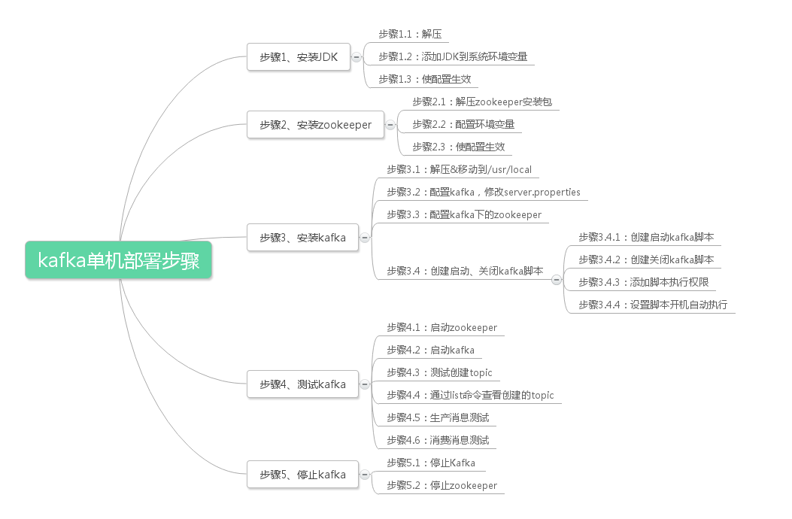

## 介绍
Kafka是分布式发布-订阅消息系统，最初由LinkedIn公司开发，之后成为之后成为Apache基金会的一部分，由Scala和Java编写。Kafka是一种快速、可扩展的、设计内在就是分布式的，分区的和可复制的提交日志服务。

它与传统系统相比，有以下不同：

它被设计为一个分布式系统，易于向外扩展；
它同时为发布和订阅提供高吞吐量；
它支持多订阅者，当失败时能自动平衡消费者；
它将消息持久化到磁盘，因此可用于批量消费，例如ETL，以及实时应用程序。
## 基础概念
* Broker：Kafka集群包含一个或多个服务器，这些服务器就是Broker
* Topic：每条发布到Kafka集群的消息都必须有一个Topic
* Partition：是物理概念上的分区，为了提供系统吞吐率，在物理上每个* Topic会分成一个或多个Partition，每个Partition对应一个文件夹
* Producer：消息产生者，负责生产消息并发送到Kafka Broker
* Consumer：消息消费者，向kafka broker读取消息并处理的客户端。
* Consumer Group：每个Consumer属于一个特定的组，组可以用来实现一条消息被组内多个成员消费等功能。

## 安装kakfka
### 前提：
* Linux版本：CentOS release 7.0 (Final) 
* JDK版本：jdk-8u152-linux-x64.tar.gz
* zookeeper版本：zookeeper-3.3.6.tar.gz 
* kafka版本：kafka_2.11-0.9.0.1.tgz .tgz


**1、安装JDK**

参考文档：linux常见软件安装.md，安装jdk部分

**2、安装zookeeper**

参考文档：Zookeepe介绍&安装配置&常用命令使用.md，安装zookeeper部分


**3、安装kafka**
1. 下载，解压，重命名
    ```bash
    cd /usr/local/
    wget https://archive.apache.org/dist/kafka/0.9.0.1/kafka_2.11-0.9.0.1.tgz
    tar -xzvf kafka_2.11-0.9.0.1.tgz
    mv kafka__2.11-0.9.0.1  kafka 
    ```
2. 配置kafka，修改server.properties 
    ```bash
    mkdir /usr/local/kafka/log/kafka #创建kafka日志目录 
    cd /usr/local/kafka/config #进入配置目录 
    vi server.properties #编辑修改相应的参数 
    broker.id=0 
    port=9092 #端口号 
    host.name=192.168.141.129 #服务器IP地址，修改为自己的服务器IP 
    log.dirs=/usr/local/kafka/log/kafka #日志存放路径，上面创建的目录 
    zookeeper.connect=127.0.0.1:2181 #zookeeper地址和端口，单机配置部署，127.0.0.1:2181 
    ```
3. 配置kafka下的zookeeper 
    ```bash
    mkdir /usr/local/kafka/zookeeper #创建zookeeper目录 
    mkdir /usr/local/kafka/log/zookeeper #创建zookeeper日志目录 
    cd /usr/local/kafka/config #进入配置目录 
    vi zookeeper.properties #编辑修改相应的参数 
    dataDir=/usr/local/kafka/zookeeper #zookeeper数据目录 
    dataLogDir=/usr/local/kafka/log/zookeeper #zookeeper日志目录 
    clientPort=2181 
    maxClientCnxns=100 
    tickTime=2000 
    initLimit=10 
    ```

4. 创建启动、关闭kafka脚本
   
    ```bash
    cd /usr/local/kafka #切换目录
    ```
    1. 创建启动kafka脚本 
    ```bash
    vi kafkastart.sh #编辑，添加以下代码
    
    #!/bin/bash
    #启动zookeeper
    /usr/local/kafka/bin/zookeeper-server-start.sh /usr/local/kafka/config/zookeeper.properties &
    sleep 3 #等3秒后执行
    #启动kafka
    /usr/local/kafka/bin/kafka-server-start.sh /usr/local/kafka/config/server.properties &
    ```
    2. 创建关闭kafka脚本
    ```bash
    vi kafkastop.sh #编辑，添加以下代码
    
    #!/bin/bash
    #关闭zookeeper
    /usr/local/kafka/bin/zookeeper-server-stop.sh /usr/local/kafka/config/zookeeper.properties &
    sleep 3 #等3秒后执行
    #关闭kafka
    /usr/local/kafka/bin/kafka-server-stop.sh /usr/local/kafka/config/server.properties &
    ```
    3. #添加脚本执行权限
    ```bash
    chmod +x kafkastart.sh
    chmod +x kafkastop.sh
    ```
    4. 设置脚本开机自动执行 
    ```bash
    vi /etc/rc.d/rc.local #编辑，在最后添加一行

    sh /usr/local/kafka/kafkastart.sh & ＃设置开机自动在后台运行脚本 
    sh /usr/local/kafka/kafkastart.sh #启动kafka 
    sh /usr/local/kafka/kafkastop.sh #关闭kafka 
    ```

## 测试kafka
<font color="yellow">必须要重启一下系统，真是尴尬</font>
1. 启动zookeeper 
    ```bash
    [root@test bin]# sh $zookeeper_home/bin/zkServer.sh start 
    JMX enabled by default 
    Using config: /home/laoyang/zookeeper/bin/../conf/zoo.cfg 
    grep: /home/laoyang/zookeeper/bin/../conf/zoo.cfg: No such file or directory 
    Starting zookeeper ... STARTED 
    ``
2. 启动kafka 
    ```bash
    [root@test kafka]# ./kafkastart.sh
    ```
3. 测试创建topic 
    ```bash
    cd /usr/local/kafka/bin 
    ./kafka-topics.sh --create --zookeeper 127.0.0.1:2181 --replication-factor 1 --partitions 1 --topic test 
    ```
4. 通过list命令查看创建的topic 
    ```bash
    cd /usr/local/kafka/bin 
    ./kafka-topics.sh --list --zookeeper 127.0.0.1:2181
    ```
5. 生产消息测试 
    ```bash
    [root@test bin]# ./kafka-console-producer.sh --broker-list 127.0.0.1:9092 --topic test 
    laoyang I love you! 
    ```
6. 消费消息测试 
    ```bash
    [root@test bin]# ./kafka-console-consumer.sh --zookeeper 127.0.0.1:2181 --topic test --from-beginning 
    I'm laoyang #之前测试输入的内容 
    laoyang I love you! 
    ```
    经过以上6步，代表kafka安装成功。

## 停止kafka 
1. 停止Kafka 
    ```bash
    cd /usr/local/kafka 
    [root@test kafka]# ./kafkastop.sh 
    ```
2. 停止Zookeeper server 
    ```bash
    sh $zookeeper_home/bin/zkServer.sh stop 
    ```