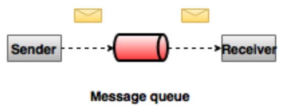
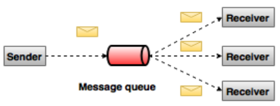
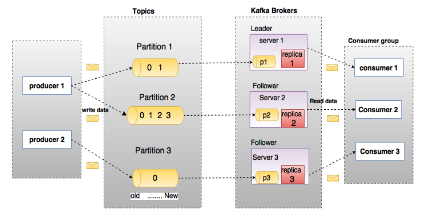
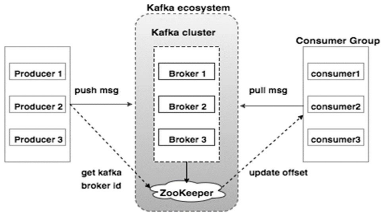

## **Kafka简介**
转载请注明出处：http://www.cnblogs.com/BYRans/

Apache Kafka发源于LinkedIn，于2011年成为Apache的孵化项目，随后于2012年成为Apache的主要项目之一。Kafka使用Scala和Java进行编写。Apache Kafka是一个快速、可扩展的、高吞吐、可容错的分布式发布订阅消息系统。Kafka具有高吞吐量、内置分区、支持数据副本和容错的特性，适合在大规模消息处理场景中使用。

接下来先介绍下消息系统的基本理念，然后再介绍Kafka。

### **消息系统介绍**
一个消息系统负责将数据从一个应用传递到另外一个应用，应用只需关注于数据，无需关注数据在两个或多个应用间是如何传递的。分布式消息传递基于可靠的消息队列，在客户端应用和消息系统之间异步传递消息。有两种主要的消息传递模式：点对点传递模式、发布-订阅模式。大部分的消息系统选用发布-订阅模式。

### **点对点消息系统**
在点对点消息系统中，消息持久化到一个队列中。此时，将有一个或多个消费者消费队列中的数据。但是一条消息只能被消费一次。当一个消费者消费了队列中的某条数据之后，该条数据则从消息队列中删除。该模式即使有多个消费者同时消费数据，也能保证数据处理的顺序。这种架构描述示意图如下：

发布-订阅消息系统
在发布-订阅消息系统中，消息被持久化到一个topic中。与点对点消息系统不同的是，消费者可以订阅一个或多个topic，消费者可以消费该topic中所有的数据，同一条数据可以被多个消费者消费，数据被消费后不会立马删除。在发布-订阅消息系统中，消息的生产者称为发布者，消费者称为订阅者。该模式的示例图如下：

## **Kafka概述**
Apache Kafka是一个分布式的发布-订阅消息系统，能够支撑海量数据的数据传递。在离线和实时的消息处理业务系统中，Kafka都有广泛的应用。Kafka将消息持久化到磁盘中，并对消息创建了备份保证了数据的安全。Kafka在保证了较高的处理速度的同时，又能保证数据处理的低延迟和数据的零丢失。

Kafka的优势在于：

可靠性：Kafka是一个具有分区机制、副本机制和容错机制的分布式消息系统
可扩展性：Kafka消息系统支持集群规模的热扩展
高性能：Kafka在数据发布和订阅过程中都能保证数据的高吞吐量。即便在TB级数据存储的情况下，仍然能保证稳定的性能。
## **Kafka术语**
在深入理解Kafka之前，先介绍一下Kafka中的术语。下图展示了Kafka的相关术语以及之间的关系：

上图中一个topic配置了3个partition。Partition1有两个offset：0和1。Partition2有4个offset。Partition3有1个offset。副本的id和副本所在的机器的id恰好相同。

如果一个topic的副本数为3，那么Kafka将在集群中为每个partition创建3个相同的副本。集群中的每个broker存储一个或多个partition。多个producer和consumer可同时生产和消费数据。

各个术语的详细介绍如下：

* **Topic**：在Kafka中，使用一个类别属性来划分数据的所属类，划分数据的这个类称为topic。如果把Kafka看做为一个数据库，topic可以理解为数据库中的一张表，topic的名字即为表名。
* **Partition**：topic中的数据分割为一个或多个partition。每个topic至少有一个partition。每个partition中的数据使用多个segment文件存储。partition中的数据是有序的，partition间的数据丢失了数据的顺序。如果topic有多个partition，消费数据时就不能保证数据的顺序。在需要严格保证消息的消费顺序的场景下，需要将partition数目设为1。（个人认为像队列，并形成日志文件）
* **Partition offse**t：每条消息都有一个当前Partition下唯一的64字节的offset，它指明了这条消息的起始位置。
Replicas of partition：副本是一个分区的备份。副本不会被消费者消费，副本只用于防止数据丢失，即消费者不从为follower的partition中消费数据，而是从为leader的partition中读取数据。
* **Broker**：
    * Kafka 集群包含一个或多个服务器，服务器节点称为broker。
    * broker存储topic的数据。如果某topic有N个partition，集群有N个broker，那么每个broker存储该topic的一个partition。
    * 如果某topic有N个partition，集群有(N+M)个broker，那么其中有N个broker存储该topic的一个partition，剩下的M个broker不存储该topic的partition数据。
    * 如果某topic有N个partition，集群中broker数目少于N个，那么一个broker存储该topic的一个或多个partition。在实际生产环境中，尽量避免这种情况的发生，这种情况容易导致Kafka集群数据不均衡。
* **Producer**：生产者即数据的发布者，该角色将消息发布到Kafka的topic中。broker接收到生产者发送的消息后，broker将该消息追加到当前用于追加数据的segment文件中。生产者发送的消息，存储到一个partition中，生产者也可以指定数据存储的partition。
* **Consumer**：消费者可以从broker中读取数据。消费者可以消费多个topic中的数据。
* **Leader**：每个partition有多个副本，其中有且仅有一个作为Leader，Leader是当前负责数据的读写的partition。
* **Follower**：Follower跟随Leader，所有写请求都通过Leader路由，数据变更会广播给所有Follower，Follower与Leader保持数据同步。如果Leader失效，则从Follower中选举出一个新的Leader。当Follower与Leader挂掉、卡住或者同步太慢，leader会把这个follower从“in sync replicas”（ISR）列表中删除，重新创建一个Follower。
## **Kafka架构**
Kafka的架构示意图如下：

* **Broker**：Kafka的broker是无状态的，broker使用Zookeeper维护集群的状态。Leader的选举也由Zookeeper负责。
* **Zookeeper**：Zookeeper负责维护和协调broker。当Kafka系统中新增了broker或者某个broker发生故障失效时，由ZooKeeper通知生产者和消费者。生产者和消费者依据Zookeeper的broker状态信息与broker协调数据的发布和订阅任务。
* **Producer**：生产者将数据推送到broker上，当集群中出现新的broker时，所有的生产者将会搜寻到这个新的broker，并自动将数据发送到这个broker上。
* **Consumer**：因为Kafka的broker是无状态的，所以consumer必须使用partition offset来记录消费了多少数据。如果一个consumer指定了一个topic的offset，意味着该consumer已经消费了该offset之前的所有数据。consumer可以通过指定offset，从topic的指定位置开始消费数据。consumer的offset存储在Zookeeper中。
## **Kafka工作流程**
Kafka将某topic的数据存储到一个或多个partition中。一个partition内数据是有序的，每条数据都有一个唯一的index，这个index叫做offset。新来的数据追加到partition的尾部。每条数据可以在不同的broker上做备份，从而保证了Kafka使用的可靠性。

生产者将消息发送到topic中，消费者可以选择多种消费方式消费Kafka中的数据。下面介绍两种消费方式的流程。

### **一个消费者订阅数据：**
* 生产者将数据发送到指定topic中
* Kafka将数据以partition的方式存储到broker上。Kafka支持数据均衡，例如生产者生成了两条消息，topic有两个partition，那么Kafka将在两个partition上分别存储一条消息
* 消费者订阅指定topic的数据
* 当消费者订阅topic中消息时，Kafka将当前的offset发给消费者，同时将offset存储到Zookeeper中
* 消费者以特定的间隔（如100ms）向Kafka请求数据
* 当Kafka接收到生产者发送的数据时，Kafka将这些数据推送给消费者
消费者受到Kafka推送的数据，并进行处理
当消费者处理完该条消息后，消费者向Kafka broker发送一个该消息已被消费的反馈
* 当Kafka接到消费者的反馈后，Kafka更新offset包括Zookeeper中的offset。
* 以上过程一直重复，直到消费者停止请求数据
* 消费者可以重置offset，从而可以灵活消费存储在Kafka上的数据

### **消费者组数据消费流程**
Kafka支持消费者组内的多个消费者同时消费一个topic，一个消费者组由具有同一个Group ID的多个消费者组成。具体流程如下：

* 生产者发送数据到指定的topic
* Kafka将数据存储到broker上的partition中
* 假设现在有一个消费者订阅了一个topic，topic名字为“test”，消费者的Group ID为“Group1”
* 此时Kafka的处理方式与只有一个消费者的情况一样
* 当Kafka接收到一个同样Group ID为“Group1”、消费的topic同样为“test"的消费者的请求时，Kafka把数据操作模式切换为分享模式，此时数据将在两个消费者上共享。
* 当消费者的数目超过topic的partition数目时，后来的消费者将消费不到Kafka中的数据。因为在Kafka给每一个消费者消费者至少分配一个partition，一旦partition都被指派给消费者了，新来的消费者将不会再分配partition。即一个partition只能分配给一个消费者，一个消费者可以消费多个partition。

## **Kafka自带工具**

Kafka tool包在org.apache.Kafka.tools.*下，分为系统工具和复制工具两类，重点介绍几个系统工具：

* Kafka Migration Tool：该工具用于将broker的版本从一个版本更新或还原为另一版本。
* Mirror Maker：该工具用于将源Kafka集群的数据镜像到目的集群。
* Consumer Offset Checker：该工具用于显示指定topic和消费者组的信息，信息包括：消费者组名、topic名、partition、offset、logSize、owner等。