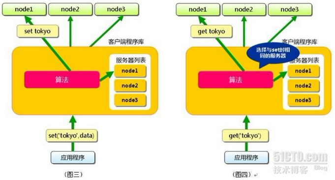
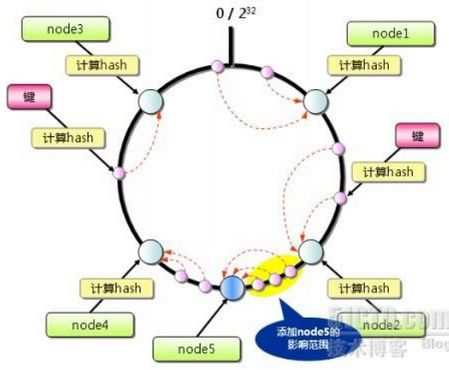

### **一、MemCached使用场景**
    通常，我们会在访问量高的Web网站和应用中使用MemCache，用来缓解数据库的压力，并且提升网站和应用的响应速度。

1. 适用memcached的业务场景
    * 访问频繁的数据库数据（身份token、首页动态）
    * 访问频繁的查询条件和结果
    * 作为Session的存储方式（提升Session存取性能）
    * 页面缓存
    * 更新频繁的非重要数据（访客量、点击次数）
    * 大量的hot数据

2.  不适用memcached的业务场景
    * 缓存对象的大小大于1MB   
        Memcached本身就不是为了处理庞大的多媒体（large media）和巨大的二进制块（streaming huge blobs）而设计的。   
    * key的长度大于250字符   
    * 虚拟主机不让运行memcached服务   
        如果应用本身托管在低端的虚拟私有服务器上，像vmware, xen这类虚拟化技术并不适合运行memcached。Memcached需要接管和控制大块的内存，如果memcached管理的内存被OS或 hypervisor交换出去，memcached的性能将大打折扣。 
    * 应用运行在不安全的环境中   
        Memcached为提供任何安全策略，仅仅通过telnet就可以访问到memcached。如果应用运行在共享的系统上，需要着重考虑安全问题。 
    * 业务本身需要的是持久化数据或者说需要的应该是database

### **二、MemCached工作原理**

1. 工作原理
    
    1. 客户端请求数据
    2. 检查MemCached中是否有对应数据
    3. 有的话直接返回，结束
    4. 没有的话，去数据库里请求数据
    5. 将数据写入MemCached，供下次请求时使用
    6. 返回数据，结束

2. 注意点
    * MemCached采用了C/S架构，在Server端启动后，以守护程序的方式，监听客户端的请求。启动时可以指定监听的IP（服务器的内网ip/外网ip）、端口号（所以做分布式测试时，一台服务器上可以启动多个不同端口号的MemCached进程）、使用的内存大小等关键参数。一旦启动，服务就会一直处于可用状态。

    * 为了提高性能，MemCached缓存的数据全部存储在MemCached管理的内存中，所以重启服务器之后缓存数据会清空，不支持持久化。
    * 缓存到MemCached中的数据库数据，在更新数据库时要注意同时更新MemCached
    
### **三、MemCached分布式**

    为了提升MemCached的存储容量和性能，我们应用的客户端可能会对应多个MemCached服务器来提供服务，这就是MemCached的分布式。

1. 分布式实现原理

    MemCached的目前版本是通过C实现，采用了单进程、单线程、异步I/O，基于事件(event_based)的服务方式.使用libevent作为事件通知实现。多个Server可以协同工作，但这些 Server 之间保存的数据各不相同，而且并不通信（与之形成对比的，比如JBoss Cache，某台服务器有缓存数据更新时，会通知集群中其他机器更新缓存或清除缓存数据），每个Server只是对自己的数据进行管理。

    Client端通过IP地址和端口号指定Server端，将需要缓存的数据是以key->value对的形式保存在Server端。key的值通过hash进行转换，根据hash值把value传递到对应的具体的某个Server上。当需要获取对象数据时，也根据key进行。首先对key进行hash，通过获得的值可以确定它被保存在了哪台Server上，然后再向该Server发出请求。Client端只需要知道保存hash(key)的值在哪台服务器上就可以了。

    

    当向MemCached集群存入/取出key/value时，MemCached客户端程序根据一定的算法计算存入哪台服务器，然后再把key/value值存到此服务器中。也就是说，存取数据分二步走，第一步，选择服务器，第二步存取数据。

2. 分布式算法解析

    * 余数算法：

        先求得键的整数散列值（也是就键string的HashCODE值 什么是HashCode），再除以服务器台数，根据余数确定存取服务器，这种方法计算简单，高效，但在memcached服务器增加或减少时，几乎所有的缓存都会失效。

    * 散列算法：

        先算出MemCached服务器的散列值，并将其分布到0到2的32次方的圆上，然后用同样的方法算出存储数据的键的散列值并映射至圆上，最后从数据映射到的位置开始顺时针查找，将数据保存到查找到的第一个服务器上，如果超过2的32次方，依然找不到服务器，就将数据保存到第一台MemCached服务器上。如果添加了一台MemCached服务器，只在圆上增加服务器的逆时针方向的第一台服务器上的键会受到影响。

    
