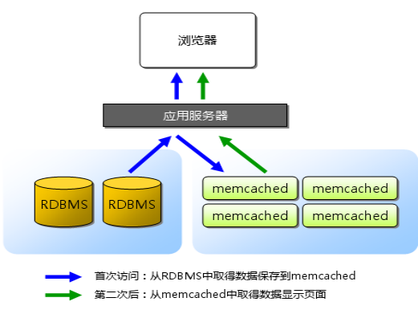

### **一、MemCached使用场景**
    通常，我们会在访问量高的Web网站和应用中使用MemCache，用来缓解数据库的压力，并且提升网站和应用的响应速度。

1. 适用memcached的业务场景
    * 访问频繁的数据库数据（身份token、首页动态）
    * 访问频繁的查询条件和结果
    * 作为Session的存储方式（提升Session存取性能）
    * 页面缓存
    * 更新频繁的非重要数据（访客量、点击次数）
    * 大量的hot数据

2.  不适用memcached的业务场景
    * 缓存对象的大小大于1MB   
        Memcached本身就不是为了处理庞大的多媒体（large media）和巨大的二进制块（streaming huge blobs）而设计的。   
    * key的长度大于250字符   
    * 虚拟主机不让运行memcached服务   
        如果应用本身托管在低端的虚拟私有服务器上，像vmware, xen这类虚拟化技术并不适合运行memcached。Memcached需要接管和控制大块的内存，如果memcached管理的内存被OS或 hypervisor交换出去，memcached的性能将大打折扣。 
    * 应用运行在不安全的环境中   
        Memcached为提供任何安全策略，仅仅通过telnet就可以访问到memcached。如果应用运行在共享的系统上，需要着重考虑安全问题。 
    * 业务本身需要的是持久化数据或者说需要的应该是database

### **二、MemCached工作原理**

1. 工作原理
    
    1. 客户端请求数据
    2. 检查MemCached中是否有对应数据
    3. 有的话直接返回，结束
    4. 没有的话，去数据库里请求数据
    5. 将数据写入MemCached，供下次请求时使用
    6. 返回数据，结束

2. 注意点
    * MemCached采用了C/S架构，在Server端启动后，以守护程序的方式，监听客户端的请求。启动时可以指定监听的IP（服务器的内网ip/外网ip）、端口号（所以做分布式测试时，一台服务器上可以启动多个不同端口号的MemCached进程）、使用的内存大小等关键参数。一旦启动，服务就会一直处于可用状态。

    * 为了提高性能，MemCached缓存的数据全部存储在MemCached管理的内存中，所以重启服务器之后缓存数据会清空，不支持持久化。
    * 缓存到MemCached中的数据库数据，在更新数据库时要注意同时更新MemCached
    
