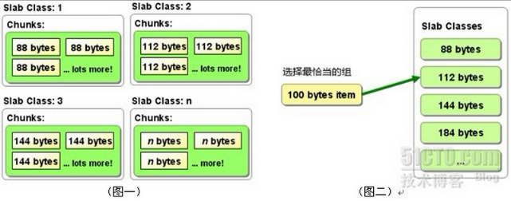

# MemCached使用场景
通常，我们会在访问量高的Web网站和应用中使用MemCache，用来缓解数据库的压力，并且提升网站和应用的响应速度。

**在应用程序中，我们通常在以下节点来使用MemCached：**

1. 访问频繁的数据库数据（身份token、首页动态）
2. 访问频繁的查询条件和结果
3. 作为Session的存储方式（提升Session存取性能）
4. 页面缓存
5. 更新频繁的非重要数据（访客量、点击次数）
6. 大量的hot数据

**常用工作流程（如下图）：**

1. 客户端请求数据
2. 检查MemCached中是否有对应数据
3. 有的话直接返回，结束
4. 没有的话，去数据库里请求数据
5. 将数据写入MemCached，供下次请求时使用
6. 返回数据，结束

（注意：缓存到MemCached中的数据库数据，在更新数据库时要注意同时更新MemCached）

# 不适用memcached的业务场景： 
1. 缓存对象的大小大于1MB   
   Memcached本身就不是为了处理庞大的多媒体（large media）和巨大的二进制块（streaming huge blobs）而设计的。   
2. key的长度大于250字符   
3. 虚拟主机不让运行memcached服务   
   如果应用本身托管在低端的虚拟私有服务器上，像vmware, xen这类虚拟化技术并不适合运行memcached。Memcached需要接管和控制大块的内存，如果memcached管理的内存被OS或 hypervisor交换出去，memcached的性能将大打折扣。 
4. 应用运行在不安全的环境中   
   Memcached为提供任何安全策略，仅仅通过telnet就可以访问到memcached。如果应用运行在共享的系统上，需要着重考虑安全问题。 
5. 业务本身需要的是持久化数据或者说需要的应该是database

# MemCached工作原理
MemCached采用了C/S架构，在Server端启动后，以守护程序的方式，监听客户端的请求。启动时可以指定监听的IP（服务器的内网ip/外网ip）、端口号（所以做分布式测试时，一台服务器上可以启动多个不同端口号的MemCached进程）、使用的内存大小等关键参数。一旦启动，服务就会一直处于可用状态。
为了提高性能，MemCached缓存的数据全部存储在MemCached管理的内存中，所以重启服务器之后缓存数据会清空，不支持持久化。

## （1）Memcached内存管理
### 内存结构

1. slab_class里，存放的是一组组chunk大小相同的slab
2. 每个slab里面包含若干个page，page的默认大小是1M，如果slab大小100M，就包含100个page
3. 每个page里面包含若干个chunk，chunk是数据的实际存放单位，每个slab里面的chunk大小相同
### 内存分配方式
1. Memcached利用slab allocation机制来分配和管理内存，它按照预先规定的大小，将分配的内存分割成特定长度的内存块，再把尺寸相同的内存块分成组，数据在存放时，根据键值大小去匹配slab大小，找就近的slab存放，所以存在空间浪费现象。而传统的内存管理方式是，使用完通过malloc分配的内存后通过free来回收内存，这种方式容易产生内存碎片并降低操作系统对内存的管理效率。
2. 存放数据时，首先slab要申请内存，申请内存是以page为单位的。所以在放入第一个数据的时候，无论大小为多少，都会有1M大小的page被分配给该slab。申请到page后，slab会将这个page的内存按chunk的大小进行切分，这样就变成了一个chunk数组，最后从这个chunk数组中选择一个用于存储数据。

**示例：**

MemCache中的value存放位置是由value的大小决定，value会被存放到与chunk大小最接近的一个slab中，比如slab[1]的chunk大小为88字节、slab[2]的chunk大小为112字节、slab[3]的chunk大小为144字节（默认相邻slab内的chunk基本以1.25为比例进行增长，MemCache启动时可以用-f指定这个比例），那么一个100字节的value，将被放到2号slab中。

### 内存回收方式
1. 当数据容量用完MemCached分配的内存后，就会基于LRU(Least Recently
Used)算法清理失效的缓存数据（放入数据时可设置失效时间），或者清理最近最少使用的缓存数据，然后放入新的数据。
2. 在LRU中，MemCached使用的是一种Lazy
Expiration策略，自己不会监控存入的key/vlue对是否过期，而是在获取key值时查看记录的时间戳，检查key/value对空间是否过期，这样可减轻服务器的负载。
3. 需要注意的是，如果MemCache启动没有追加-M，则表示禁止LRU，这种情况下内存不够会报Out Of Memory错误。

**针对MemCache的内存分配及回收算法，总结三点：**

1. MemCache的内存分配chunk里面会有内存浪费，88字节的value分配在128字节（紧接着大的用）的chunk中，就损失了30字节，但是这也避免了管理内存碎片的问题
2. MemCache的LRU算法不是针对全局的，是针对slab的
3. 应该可以理解为什么MemCache存放的value大小是限制的，因为一个新数据过来，slab会先以page为单位申请一块内存，申请的内存最多就只有1M，所以value大小自然不能大于1M了
## （2）MemCached分布式
为了提升MemCached的存储容量和性能，我们应用的客户端可能会对应多个MemCached服务器来提供服务，这就是MemCached的分布式。
### 分布式实现原理
MemCached的目前版本是通过C实现，采用了单进程、单线程、异步I/O，基于事件(event_based)的服务方式.使用libevent作为事件通知实现。多个Server可以协同工作，但这些 Server 之间保存的数据各不相同，而且并不通信（与之形成对比的，比如JBoss Cache，某台服务器有缓存数据更新时，会通知集群中其他机器更新缓存或清除缓存数据），每个Server只是对自己的数据进行管理。

Client端通过IP地址和端口号指定Server端，将需要缓存的数据是以key->value对的形式保存在Server端。key的值通过hash进行转换，根据hash值把value传递到对应的具体的某个Server上。当需要获取对象数据时，也根据key进行。首先对key进行hash，通过获得的值可以确定它被保存在了哪台Server上，然后再向该Server发出请求。Client端只需要知道保存hash(key)的值在哪台服务器上就可以了。

当向MemCached集群存入/取出key/value时，MemCached客户端程序根据一定的算法计算存入哪台服务器，然后再把key/value值存到此服务器中。也就是说，存取数据分二步走，第一步，选择服务器，第二步存取数据。

### 分布式算法解析
1. 余数算法：

    先求得键的整数散列值（也是就键string的HashCODE值 什么是HashCode），再除以服务器台数，根据余数确定存取服务器，这种方法计算简单，高效，但在memcached服务器增加或减少时，几乎所有的缓存都会失效。
2. 散列算法：

    先算出MemCached服务器的散列值，并将其分布到0到2的32次方的圆上，然后用同样的方法算出存储数据的键的散列值并映射至圆上，最后从数据映射到的位置开始顺时针查找，将数据保存到查找到的第一个服务器上，如果超过2的32次方，依然找不到服务器，就将数据保存到第一台MemCached服务器上。如果添加了一台MemCached服务器，只在圆上增加服务器的逆时针方向的第一台服务器上的键会受到影响。

    
## （3）MemCached线程管理
MemCached网络模型是典型的单进程多线程模型，采用libevent处理网络请求，主进程负责将新来的连接分配给work线程，work线程负责处理连接，有点类似与负载均衡，通过主进程分发到对应的工作线程。
MemCached默认有7个线程，4个主要的工作线程，3个辅助线程，线程可划分为以下4种：

1. 主线程，负责MemCached服务器初始化，监听TCP、Unix Domain连接请求；
2. 工作线程池，MemCached默认4个工作线程，可通过启动参数修改，负责处理TCP、UDP，Unix域套接口链路上的请求；
3. assoc维护线程，MemCached内存中维护一张巨大的hash表，该线程负责hash表动态增长；
4. slab维护线程，即内存管理模块维护线程，负责class中slab的平衡，MemCached启动选项中可关闭该线程。
更多见：MemCache-网络线程模型-原码分析

## （4）MemCached特性与限制
1. MemCache中可以保存的item数据量是没有限制的，只要内存足够
2. MemCache单进程在32位机中最大使用内存为2G，这个之前的文章提了多次了，64位机则没有限制
3. Key最大为250个字节，超过该长度无法存储
4. 单个item最大数据是1MB，超过1MB的数据不予存储
5. MemCache服务端是不安全的，比如已知某个MemCache节点，可以直接telnet过去，并通过flush_all让已经存在的键值对立即失效，所以MemCache服务器最好配置到内网环境，通过防火墙制定可访问客户端
6. 不能够遍历MemCache中所有的item，因为这个操作的速度相对缓慢且会阻塞其他的操作
7. MemCached的高性能源自于两阶段哈希结构：第一阶段在客户端，通过Hash算法根据Key值算出一个节点；第二阶段在服务端，通过一个内部的Hash算法，查找真正的item并返回给客户端。从实现的角度看，MemCache是一个非阻塞的、基于事件的服务器程序
8. MemCache设置添加某一个Key值的时候，传入expiry为0表示这个Key值永久有效，这个Key值也会在30天之后失效，见memcache.c的源代码：