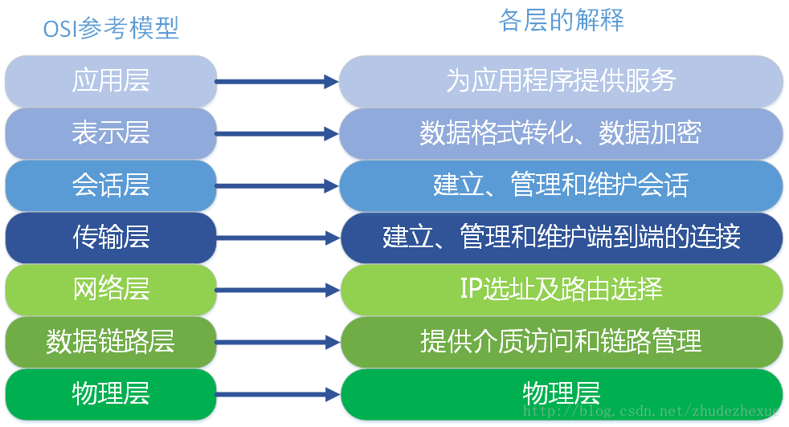
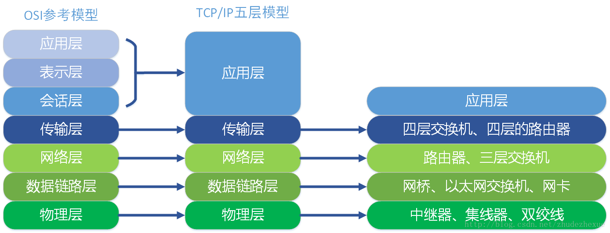
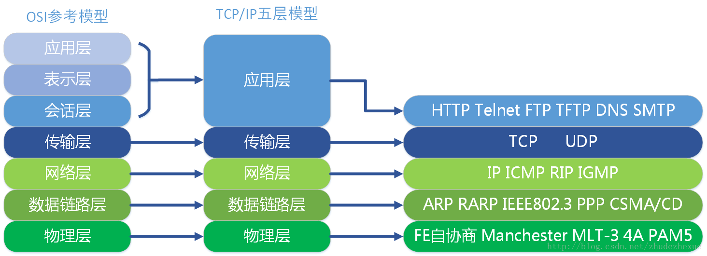
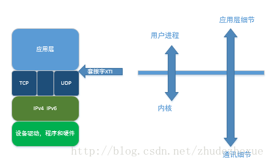
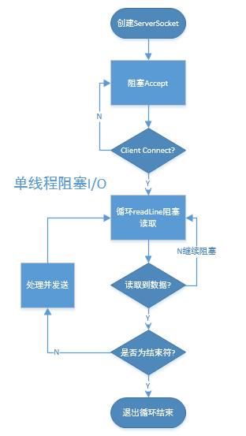
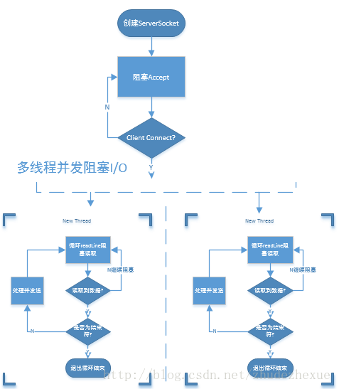
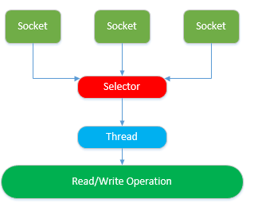

## Netty产生的历史背景
#### OSI(Open System Interconnect)开放式网络模型： 



#### TCP/IP五层模型和映射关系： 






#### Socket(套接字)： 

　　套接字编程接口，是在 TCP/IP 协议族中，应用层进入传输层的接口。用套接字编写使用 TCP或UDP 的网络应用程序。应用层是用户进程，下面是系统内核的一部分功能。 



#### 同步 异步 与 阻塞 非阻塞： 
* 同步、异步，是指通信机制，通过什么方式回答结果。 
    1. 同步，调用后，如果没有结果，调用不返回任何消息。 
    2. 异步，调用后，直接返回，但并不是返回结果，被调用者，通过状态、通知来通知调用者。 

* 阻塞、非阻塞，是指程序等待调用结果时的状态。 
    1. 阻塞，在调用结果返回前，当前进程/线程被阻塞，直到被调用者返回结果才继续。 
    2. 非阻塞，即使不能立即得到结果，也不会阻塞当前进程/线程，可以偶尔回来查看有无结果。 

#### Asynchronous设计： 

　　Netty所有的API都是Asynchronous的，Asynchronous设计能够更加高效的利用系统资源；java实现Asynchronous的两种方法：
1. Callback; 
2. Future; 

Netty将这两种方法合理使用以实现Asynchronous。
 
I/O复用：

　　关于I/O多路复用(又被称为“事件驱动”)，首先要理解的是，操作系统为你提供了一个功能，当你的某个socket可读或者可写的时候，它可以给你一个通知。这样当配合非阻塞的socket使用时，只有当系统通知我哪个描述符可读了，我才去执行read操作，可以保证每次read都能读到有效数据而不做纯返回-1和EAGAIN的无用功。写操作类似。操作系统的这个功能通过select/poll/epoll/kqueue之类的系统调用函数来使用，这些函数都可以同时监视多个描述符的读写就绪状况，这样，多个描述符的I/O操作都能在一个线程内并发交替地顺序完成，这就叫I/O多路复用，这里的“复用”指的是复用同一个线程。

#### JAVA网络编程历史： 

1. JAVA Local Api(java.net)阻塞I/O； 

    阻塞I/O处理并发采取的策略是为每个客户端的连接开辟一个新的线程去处理客户端的发送接收，这样就意味着有多少个客户端就有多少个线程；这样对于客户端较少的系统尚可以接受，但是对于并发量较大的系统会带来以下问题： 

    * JVM能够创建的线程是有限的，即使Java虚拟机（JVM）在物理上可以支持非常大数量的线程，但是线程间上下文的切换是非常耗CPU的，远在到达该极限之前，上下文切换所带来的开销就会带来很大的麻烦； 

    * JVM每开启一个线程就会为线程的调用栈分配内存，这个值默认为64K到1M，所以当线程达到一定的数量时对系统内存也是一种考验； 
    
    * 当大量客户端连接上以后，可能会有较多的线程处于等待休眠状态只是等待数据输入和输出就绪，这样对系统资源也是一种浪费；

    单线程并发阻塞I/O: 

    

    多线程并发阻塞I/O: 
　　
    

    阻塞I/O并发伪代码：

    ```java
    public class EchoServer {
        public void server(int port) throws IOException {
            final ServerSocket server = new ServerSocket(port);
            try {
                while (true) {
                    // if no server connect will blocking here
                    final Socket clientSocket = server.accept();
                    new Thread(new Runnable() {
                        @Override
                        public void run() {
                            try {
                                BufferedReader reader =
                                        new BufferedReader(new InputStreamReader(clientSocket.getInputStream()));
                                PrintWriter writer = new PrintWriter(clientSocket.getOutputStream(), true);
                                while (true) {
                                    writer.println(reader.readLine());
                                    writer.flush();
                                }
                            } catch (IOException e) {
                                try {
                                    clientSocket.close();
                                } catch (IOException ex) {
                                }
                            }
                        }
                    }).start();
                }
            } catch (IOException e) {
            }
        }
    }
    ```

2. JAVA NIO非阻塞I/0； 

    NIO最开始是新的输入/输出（New Input/Output）的英文缩写，但是，该Java API已经出现足够长的时间了，不再是“新的”了，因此，如今大多数的用户认为NIO代表非阻塞I/O（Non-blocking I/O），而阻塞I/O（blocking I/O）是旧的输入/输出（old input/output，OIO）。你也可能遇到它被称为普通I/O（plain I/O）的时候。 

    NIO允许使用操作系统的事件通知API注册一组非阻塞套接字，以确定它们中是否有任何的套接字已经有数据可供读写。

    class java.nio.channels.Selector是Java的非阻塞I/O实现的关键。它使用了事件通知API以确定在一组非阻塞套接字中有哪些已经就绪能够进行I/O相关的操作。因为可以在任何的时间检查任意的读操作或者写操作的完成状态，一个单一的线程便可以处理多个并发的连接，并发模型如下：

    

    Selector 是NIO的一个组件，用于检测一个或者多个Channel(Socket)是否可读或者可写，这样一个单一的Selector就能够用于处理多个连接了，使用Selector的几个主要步骤如下：

    1. 创建一个或者多个Selector对象供已经打开的Channel(Socket)去注册； 

    2. 为Channel(Socket)注册Selector可以选择绑定如下事件： 
        * OP_ACCEPT 
        * OP_CONNECT 
        * OP_READ 
        * OP_WRITE 

    3. 当Channel注册号Selector后，可以调用Selector.select()去阻塞查询，看是否有绑定的事件发生；

    4. 当有事件产生后可以通过SelectionKey去获取产生事件的Channel并处理事件； 
　　非阻塞I/O并发伪代码：

    ```java
    public class NioEchoServer
    {
        public void server(int port) throws IOException
        {
            ServerSocketChannel serverChannel = ServerSocketChannel.open();
            ServerSocket ss = serverChannel.socket();
            InetSocketAddress address = new InetSocketAddress(port);
            ss.bind(address);
            serverChannel.configureBlocking(flase);
            Selector selector = Selector.open();
            serverChannel.register(selector,SelectionKey.OP_ACCEPT);
            while(true)
            {
                try{
                    selector.select();
                }catch(IOException e)
                {
                    e.printStackTrace();
                }

                Set readyKeys = selector.selectedKeys();
                Iterator iterator = readyKeys.iterator();
                while(iterator.hasNext())
                {
                    SelectionKey key = (SelectionKey) iterator.next();
                    iterator.remove();
                    try{
                        if(key.isAcceptable())
                        {
                            ServerSocketChannel server = (ServerSocketChannel)key.channel();
                            SocketChannel client = server.accept();
                            client.configureBlocking(false);
                            client.register(selector,SelectionKey.OP_WRITE|
                            SelectionKey.OP_READ,ByteBuffer.allocate(100));
                        }
                        if(key.isReadable())
                        {
                            SocketChannel client = (SocketChannel) key.channel();
                            ByteBuffer output = (ByteBuffer) key.attachment();
                            client.read(output);
                        }
                        if(key.isWritable())
                        {
                            SocketChannel client = (SocketChannel) key.channel();
                            ByteBuffer output = (ByteBuffer) key.attachment();
                            output.flip();
                            client.write(output);
                            output.compact();
                        }
                    }catch(IOException e)
                    {
                        key.cancel();
                        try{
                            key.channel().close();
                        }catch(IOException e)
                        {
                        }
                    }
                }
            }
        }
    }
    ```
    NIO与NIO.2的区别是NIO.2通过为Channel注册一个CompletionHandler去监听事件，而不用自己阻塞查询事件的发生。

3. 高性能网络编程专家Netty;

    虽然NIO能够解决阻塞I/O编程带来的问题，但是面对复杂的系统，使用java api进行编程要达到高效和安全的调度并不容易，所以Netty就孕育而生了，Netty是在NIO的基础上构建的网络编程框架，屏蔽了复杂的调用，提供简单易用的API，同时将业务逻辑和网络处理代码进行解耦。 

原文：https://blog.csdn.net/zhudezhexue/article/details/78206962 