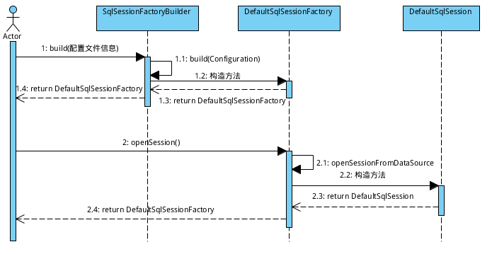
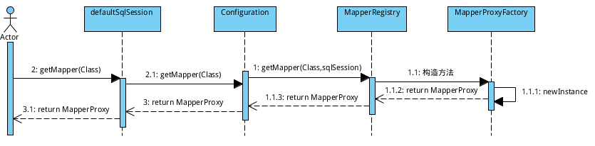
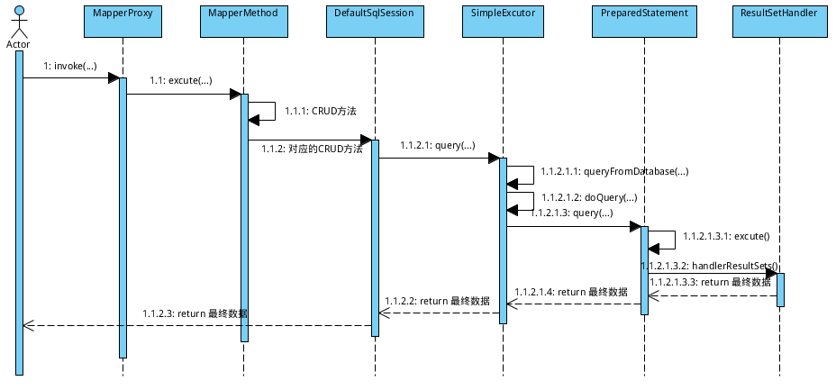

#mybatis 源码分析

最近太忙了，一直没时间继续更新博客，今天忙里偷闲继续我的Mybatis学习之旅。在前九篇中，介绍了mybatis的配置以及使用， 那么本篇将走进mybatis的源码，分析mybatis 的执行流程， 好啦，鄙人不喜欢口水话，还是直接上干活吧：

1. SqlSessionFactory 与 SqlSession.

    通过前面的章节对于mybatis 的介绍及使用，大家都能体会到SqlSession的重要性了吧， 没错，从表面上来看，咱们都是通过SqlSession去执行sql语句（注意：是从表面看，实际的待会儿就会讲）。那么咱们就先看看是怎么获取SqlSession的吧：

    

    1. 首先，SqlSessionFactoryBuilder去读取mybatis的配置文件，然后build一个DefaultSqlSessionFactory。源码如下：

        ```java
        /**
        * 一系列的构造方法最终都会调用本方法（配置文件为Reader时会调用本方法，还有一个InputStream方法与此对应）
        * @param reader
        * @param environment
        * @param properties
        * @return
        */
        public SqlSessionFactory build(Reader reader, String environment, Properties properties) {
            try {
            //通过XMLConfigBuilder解析配置文件，解析的配置相关信息都会封装为一个Configuration对象
            XMLConfigBuilder parser = new XMLConfigBuilder(reader, environment, properties);
            //这儿创建DefaultSessionFactory对象
            return build(parser.parse());
            } catch (Exception e) {
            throw ExceptionFactory.wrapException("Error building SqlSession.", e);
            } finally {
            ErrorContext.instance().reset();
            try {
                reader.close();
            } catch (IOException e) {
                // Intentionally ignore. Prefer previous error.
            }
            }
        }

        public SqlSessionFactory build(Configuration config) {
            return new DefaultSqlSessionFactory(config);
        }

        ```

    2. 当我们获取到SqlSessionFactory之后，就可以通过SqlSessionFactory去获取SqlSession对象。源码如下：

        ```java
        /**
        * 通常一系列openSession方法最终都会调用本方法
        * @param execType 
        * @param level
        * @param autoCommit
        * @return
        */
        private SqlSession openSessionFromDataSource(ExecutorType execType, TransactionIsolationLevel level, boolean autoCommit) {
            Transaction tx = null;
            try {
            //通过Confuguration对象去获取Mybatis相关配置信息, Environment对象包含了数据源和事务的配置
            final Environment environment = configuration.getEnvironment();
            final TransactionFactory transactionFactory = getTransactionFactoryFromEnvironment(environment);
            tx = transactionFactory.newTransaction(environment.getDataSource(), level, autoCommit);
            //之前说了，从表面上来看，咱们是用sqlSession在执行sql语句， 实际呢，其实是通过excutor执行， excutor是对于Statement的封装
            final Executor executor = configuration.newExecutor(tx, execType);
            //关键看这儿，创建了一个DefaultSqlSession对象
            return new DefaultSqlSession(configuration, executor, autoCommit);
            } catch (Exception e) {
            closeTransaction(tx); // may have fetched a connection so lets call close()
            throw ExceptionFactory.wrapException("Error opening session.  Cause: " + e, e);
            } finally {
            ErrorContext.instance().reset();
            }
        }
        ```

    3. 通过以上步骤，咱们已经得到SqlSession对象了。接下来就是该干嘛干嘛去了（话说还能干嘛，当然是执行sql语句咯）。看了上面，咱们也回想一下之前写的Demo

        ```java
        SqlSessionFactory sessionFactory = null;  
        String resource = "mybatis-conf.xml";  
        try {
            //SqlSessionFactoryBuilder读取配置文件
            sessionFactory = new SqlSessionFactoryBuilder().build(Resources  
                    .getResourceAsReader(resource));
        } catch (IOException e) {  
            e.printStackTrace();  
        }
        //通过SqlSessionFactory获取SqlSession
        SqlSession sqlSession = sessionFactory.openSession();
        ```

    还真这么一回事儿，对吧！

    SqlSession咱们也拿到了，咱们可以调用SqlSession中一系列的select...,  insert..., update..., delete...方法轻松自如的进行CRUD操作了。 就这样？ 那咱配置的映射文件去哪儿了？  别急， 咱们接着往下看：

2. 利器之MapperProxy:

    

    在mybatis中，通过MapperProxy动态代理咱们的dao， 也就是说， 当咱们执行自己写的dao里面的方法的时候，其实是对应的mapperProxy在代理。那么，咱们就看看怎么获取MapperProxy对象吧：

    1. 通过SqlSession从Configuration中获取。源码如下：

        ```java
        /**
        * 什么都不做，直接去configuration中找， 哥就是这么任性
        */
        @Override
        public <T> T getMapper(Class<T> type) {
            return configuration.<T>getMapper(type, this);
        }
        ```

    2. SqlSession把包袱甩给了Configuration, 接下来就看看Configuration。源码如下：

        ```java
        /**
        * 烫手的山芋，俺不要，你找mapperRegistry去要
        * @param type
        * @param sqlSession
        * @return
        */
        public <T> T getMapper(Class<T> type, SqlSession sqlSession) {
            return mapperRegistry.getMapper(type, sqlSession);
        }
        ```

    3. Configuration不要这烫手的山芋，接着甩给了MapperRegistry， 那咱看看MapperRegistry。 源码如下：

        ```java
        /**
        * 烂活净让我来做了，没法了，下面没人了，我不做谁来做
        * @param type
        * @param sqlSession
        * @return
        */
        @SuppressWarnings("unchecked")
        public <T> T getMapper(Class<T> type, SqlSession sqlSession) {
            //能偷懒的就偷懒，俺把粗活交给MapperProxyFactory去做
            final MapperProxyFactory<T> mapperProxyFactory = (MapperProxyFactory<T>) knownMappers.get(type);
            if (mapperProxyFactory == null) {
            throw new BindingException("Type " + type + " is not known to the MapperRegistry.");
            }
            try {
            //关键在这儿
            return mapperProxyFactory.newInstance(sqlSession);
            } catch (Exception e) {
            throw new BindingException("Error getting mapper instance. Cause: " + e, e);
            }
        }
        ```

    4. MapperProxyFactory是个苦B的人，粗活最终交给它去做了。咱们看看源码：

        ```java
        /**
        * 别人虐我千百遍，我待别人如初恋
        * @param mapperProxy
        * @return
        */
        @SuppressWarnings("unchecked")
        protected T newInstance(MapperProxy<T> mapperProxy) {
            //动态代理我们写的dao接口
            return (T) Proxy.newProxyInstance(mapperInterface.getClassLoader(), new Class[] { mapperInterface }, mapperProxy);
        }

        public T newInstance(SqlSession sqlSession) {
            final MapperProxy<T> mapperProxy = new MapperProxy<T>(sqlSession, mapperInterface, methodCache);
            return newInstance(mapperProxy);
        }
        ```

        通过以上的动态代理，咱们就可以方便地使用dao接口啦， 就像之前咱们写的demo那样：

        ```java
        UserDao userMapper = sqlSession.getMapper(UserDao.class);  
        User insertUser = new User();
        ```

        这下方便多了吧， 呵呵， 貌似mybatis的源码就这么一回事儿啊。

        别急，还没完， 咱们还没看具体是怎么执行sql语句的呢。

3. Excutor:

    

    接下来，咱们才要真正去看sql的执行过程了。

    上面，咱们拿到了MapperProxy, 每个MapperProxy对应一个dao接口， 那么咱们在使用的时候，MapperProxy是怎么做的呢？ 源码奉上：

    MapperProxy:

    ```java
    /**
    * MapperProxy在执行时会触发此方法
    */
    @Override
    public Object invoke(Object proxy, Method method, Object[] args) throws Throwable {
        try {
            if (Object.class.equals(method.getDeclaringClass())) {
                return method.invoke(this, args);
            } else if (isDefaultMethod(method)) {
                return invokeDefaultMethod(proxy, method, args);
            }
        } catch (Throwable t) {
            throw ExceptionUtil.unwrapThrowable(t);
        }
        //二话不说，主要交给MapperMethod自己去管
        final MapperMethod mapperMethod = cachedMapperMethod(method);
        return mapperMethod.execute(sqlSession, args);
    }
    ```

    MapperMethod:

    ```java
    /**
    * 看着代码不少，不过其实就是先判断CRUD类型，然后根据类型去选择到底执行sqlSession中的哪个方法，绕了一圈，又转回sqlSession了
    * @param sqlSession
    * @param args
    * @return
    */
    public Object execute(SqlSession sqlSession, Object[] args) {
        Object result;
        switch (command.getType()) {
            case INSERT: {
                Object param = method.convertArgsToSqlCommandParam(args);
                result = rowCountResult(sqlSession.insert(command.getName(), param));
                break;
            }
            case UPDATE: {
                Object param = method.convertArgsToSqlCommandParam(args);
                result = rowCountResult(sqlSession.update(command.getName(), param));
                break;
            }
            case DELETE: {
                Object param = method.convertArgsToSqlCommandParam(args);
                result = rowCountResult(sqlSession.delete(command.getName(), param));
                break;
            }
            case SELECT:
                if (method.returnsVoid() && method.hasResultHandler()) {
                    executeWithResultHandler(sqlSession, args);
                    result = null;
                } else if (method.returnsMany()) {
                    result = executeForMany(sqlSession, args);
                } else if (method.returnsMap()) {
                    result = executeForMap(sqlSession, args);
                } else if (method.returnsCursor()) {
                    result = executeForCursor(sqlSession, args);
                } else {
                    Object param = method.convertArgsToSqlCommandParam(args);
                    result = sqlSession.selectOne(command.getName(), param);
                }
                break;
            case FLUSH:
                result = sqlSession.flushStatements();
                break;
            default:
                throw new BindingException("Unknown execution method for: " + command.getName());
        }
        if (result == null && method.getReturnType().isPrimitive() && !method.returnsVoid()) {
        throw new BindingException("Mapper method '" + command.getName() 
            + " attempted to return null from a method with a primitive return type (" + method.getReturnType() + ").");
        }
        return result;
    }
    ```

    既然又回到SqlSession了， 那么咱们就看看SqlSession的CRUD方法了，为了省事，还是就选择其中的一个方法来做分析吧。这儿，咱们选择了selectList方法：

    ```java
    public <E> List<E> selectList(String statement, Object parameter, RowBounds rowBounds) {
        try {
            MappedStatement ms = configuration.getMappedStatement(statement);
            //CRUD实际上是交给Excetor去处理， excutor其实也只是穿了个马甲而已，小样，别以为穿个马甲我就不认识你嘞！
            return executor.query(ms, wrapCollection(parameter), rowBounds, Executor.NO_RESULT_HANDLER);
        } catch (Exception e) {
            throw ExceptionFactory.wrapException("Error querying database.  Cause: " + e, e);
        } finally {
            ErrorContext.instance().reset();
        }
    }
    ```

    然后，通过一层一层的调用，最终会来到doQuery方法， 这儿咱们就随便找个Excutor看看doQuery方法的实现吧，我这儿选择了SimpleExecutor:

    ```java
    public <E> List<E> doQuery(MappedStatement ms, Object parameter, RowBounds rowBounds, ResultHandler resultHandler, BoundSql boundSql) throws SQLException {
        Statement stmt = null;
        try {
            Configuration configuration = ms.getConfiguration();
            StatementHandler handler = configuration.newStatementHandler(wrapper, ms, parameter, rowBounds, resultHandler, boundSql);
            stmt = prepareStatement(handler, ms.getStatementLog());
            //StatementHandler封装了Statement, 让 StatementHandler 去处理
            return handler.<E>query(stmt, resultHandler);
        } finally {
            closeStatement(stmt);
        }
    }
    ```

    接下来，咱们看看StatementHandler的一个实现类 PreparedStatementHandler（这也是我们最常用的，封装的是PreparedStatement）, 看看它使怎么去处理的：

    ```java
    public <E> List<E> query(Statement statement, ResultHandler resultHandler) throws SQLException {
        //到此，原形毕露， PreparedStatement, 这个大家都已经滚瓜烂熟了吧
        PreparedStatement ps = (PreparedStatement) statement;
        ps.execute();
        //结果交给了ResultSetHandler 去处理
        return resultSetHandler.<E> handleResultSets(ps);
    }
    ```

    到此， 一次sql的执行流程就完了。 我这儿仅抛砖引玉，建议有兴趣的去看看Mybatis3的源码。

    好啦，本次就到此结束啦，最近太忙了， 又该忙去啦。

    总流程：
    1. SqlSessionFactoryBuilder->SqlSessionFactory->SqlSession->MapperProxy
    2. MapperProxy实现invoke方法，并内部调用SqlSession的CRUD方法

原文：https://www.cnblogs.com/dongying/p/4142476.html