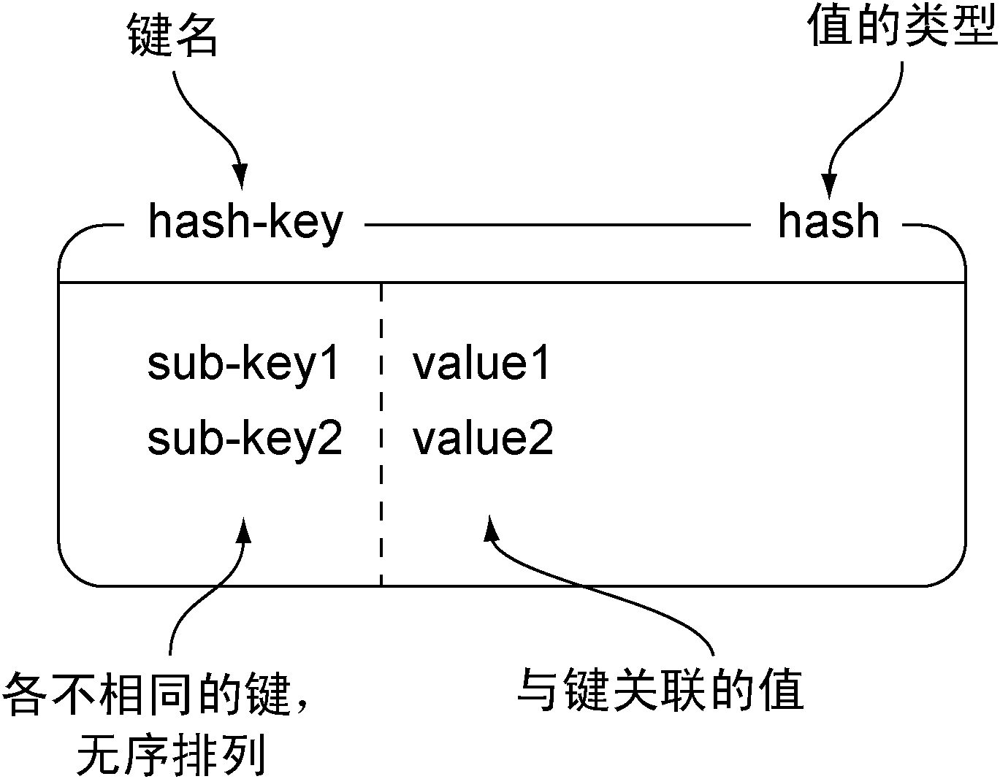

## Redis数据结构

1. Redis提供的5种结构

结构类型|结构存储的值|结构的读写能力
--|--|--
STRING|可以是字符串、整数或者浮点数|对整个字符串或者字符串的其中一部分执行操作；对整数和浮点数执行自增（increment）或者自减（decrement）操作
LIST|一个链表，链表上的每个节点都包含了一个字符串|从链表的两端推入或者弹出元素；根据偏移量对链表进行修剪（trim）；读取单个或者多个元素；根据值查找或者移除元素
SET|包含字符串的无序收集器（unordered collection），并且被包含的每个字符串都是独一无二、各不相同的|添加、获取、移除单个元素；检查一个元素是否存在于集合中；计算交集、并集、差集；从集合里面随机获取元素
HASH|包含键值对的无序散列表|添加、获取、移除单个键值对；获取所有键值对
ZSET（有序集合）|字符串成员（member）与浮点数分值（score）之间的有序映射，元素的排列顺序由分值的大小决定|添加、获取、删除单个元素；根据分值范围（range）或者成员来获取元素

## 数据结构的说明
1. 字符串
    * 说明

        Redis的STRING和其他编程语言或者其他键值存储提供的字符串非常相似。本书在使用图片表示键和值的时候，通常会将键名（key name）和值的类型放在方框的顶部，并将值放在方框的里面。图1-1以键为hello、值为world的STRING为例，分别标记了方框的各个部分。

        
    * 命令表格
        命令|行为
        --|--
        GET|获取存储在给定键中的值
        SET|设置存储在给定键中的值
        DEL|删除存储在给定键中的值（这个命令可以用于所有类型）
    * 命令举例
        ```
        set hello world
        get hello
        del hello
        get hello
        ```
        

2. list
    * 说明

        Redis对链表（linked-list）结构的支持使得它在键值存储的世界中独树一帜。一个列表结构可以有序地存储多个字符串，和表示字符串时使用的方法一样，本节使用带有标签的方框来表示列表，并将列表包含的元素放在方框里面。
        图1-2展示了一个这样的示例。
        
        

        list-key是一个包含3个元素的列表键，注意列表里面的元素是可以重复的
        Redis列表可执行的操作和很多编程语言里面的列表操作非常相似

    * 命令表格
        命令|行为
        --|--
        LPUSH|将给定值推入列表的左端
        RPUSH|将给定值推入列表的右端
        LRANGE|获取列表在给定范围上的所有值
        LINDEX|获取列表在给定位置上的单个元素
        LPOP|从列表的右端弹出一个值，并返回被弹出的值
        RLPOP|从列表的左端弹出一个值，并返回被弹出的值

    * 命令举例
        ```
        rpush list-key item
        rpush list-key item2
        rpush list-key item
        lrange list-key 0 -1
        lindex list-key 1
        lpop list-key
        lrange list-key 0 -1
        ```
        

3. set
    * 说明

        Redis的集合和列表都可以存储多个字符串，它们之间的不同在于，列表可以存储多个相同的字符串，而集合则通过使用散列表来保证自己存储的每个字符串都是各不相同的（这些散列表只有键，但没有与键相关联的值）。本书表示集合的方法和表示列表的方法基本相同，图1-3展示了一个包含3个元素的示例集合。
        
        

    * 命令表格
        命令|行为
        --|--
        SADD|将给定元素添加到集合
        SMEMBERS|返回集合包含的所有元素，（如果集合包含的元素非常多，那么SMEMBERS命令的执行速度可能会很慢，所以请谨慎地使用这个命令）
        SISMEMBER|检查给定元素是否存在于集合中
        SREM|如果给定的元素存在于集合中，那么移除这个元素

    * 命令举例
        ```
        sadd set-key item
        sadd set-key item2
        sadd set-key item3
        sadd set-key item
        smembers set-key
        sismember set-key item4
        sismember set-key item
        srem set-key item2
        srem set-key item2
        ```
        

4. hset
    * 说明

       Redis的散列可以存储多个键值对之间的映射。和字符串一样，散列存储的值既可以是字符串又可以是数字值，并且用户同样可以对散列存储的数字值执行自增操作或者自减操作。图1-4展示了一个包含两个键值对的散列。
        
        

    * 命令表格
        命令|行为
        --|--
        HSET|在散列里面关联起给定的键值对
        HGET|获取指定散列键的值
        HGETALL|获取散列包含的所有键值对
        HDEL|如果给定键存在于散列里面，那么移除这个键

    * 命令举例
        ```
        hset hash-key sub-key1 value1
        hset hash-key sub-key2 value2
        hset hash-key sub-key1 value1
        hgetall hash-key

        hdel hash-key sub-key2
        hdel hash-key sub-key2
        hget hash-key sub-key1
        hgetall hash-key
        ```
        

5. zset
    * 说明

       有序集合和散列一样，都用于存储键值对：有序集合的键被称为成员（member），每个成员都是独一无二的；而有序集合的值则被称为分值（score），分值必须为浮点数。有序集合是Redis里面唯一一个既可以根据成员访问元素（这一点和散列一样），又可以根据分值以及分值的排列顺序来访问元素的结构。图1-5展示了一个包含两个元素的有序集合示例。
        
        

    * 命令表格
        命令|行为
        --|--
        ZADD|将一个带有给定分值的成员添加到有序集合里面
        ZRANGE|根据元素在有序排列中所处的位置，从有序集合里面获取多个元素
        ZRANGEBYSCORE|获取有序集合在给定分值范围内的所有元素
        ZREM|如果给定成员存在于有序集合，那么移除这个成员

    * 命令举例
        ```
        zadd zset-key 728 member1
        zadd zset-key 982 member0
        zadd zset-key 982 member0
        zrange zset-key 0 -1

        zrangebyscore zset-key 0 -1
        zrem zset-key member1
        zrem zset-key member1
        ```
        