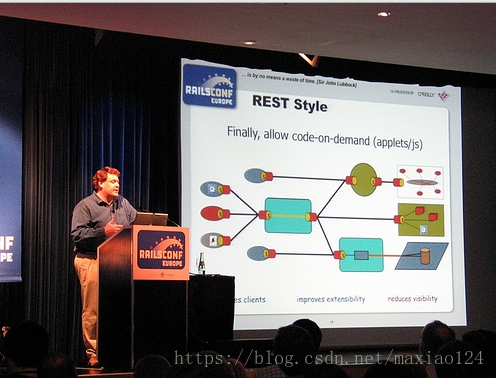
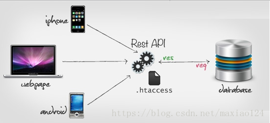

REST服务与Restful风格
### 一、REST来源
REST：是一组架构约束条件和原则，REST是Roy Thomas Fielding在他2000年的博士论文中提出的。 
这里写图片描述 

图 1 Roy Thomas Fielding是HTTP协议（1.0版和1.1版）的主要设计者、Apache服务器作者之一、Apache基金会第一任主席

### 二、什么是REST
REST（Representational State Transfer）：表现层状态转移，一种软件架构风格，不是标准。
* Representational （表现层） : "资源"具体呈现出来的形式，比如：
    * 一段文本
    * 一张图片
    * 一首歌曲
    * 一种服务
* State Transfer（状态转移）：就是HTTP协议里面，四个表示操作方式的动词：GET、POST、PUT、DELETE。它们分别对应四种基本操作：
    * GET用来获取资源
    * POST用来新建资源（也可以用于更新资源）
    * PUT用来更新资源
    * DELETE用来删除资源

综合上面的解释，我们总结一下什么是RESTful架构：
1. 每一个URI代表一种资源；
2. 客户端和服务器之间，传递这种资源的某种表现层；
3. 客户端通过四个HTTP动词，对服务器端资源进行操作，实现"表现层状态转化"。

### 三、什么是RESTful
* 基于REST构建的API就是Restful风格。

### 四、为什么使用RESTful
1. JSP技术可以让我们在页面中嵌入Java代码，但是这样的技术实际上限制了我们的开发效率，因为需要我们Java工程师将html转换为jsp页面，并写一些脚本代码，或者前端代码。这样会严重限制我们的开发效率，也不能让我们的java工程师专注于业务功能的开发，所以目前越来越多的互联网公司开始实行前后端分离。 
2. 近年随着移动互联网的发展，各种类型的Client层出不穷，RESTful可以通过一套统一的接口为Web，iOS和Android提供服务。另外对于广大平台来说，比如微博开放平台，微信开放平台等，它们不需要有显式的前端，只需要一套提供服务的接口，RESTful无疑是最好的选择。RESTful架构如下：
 
这里写图片描述