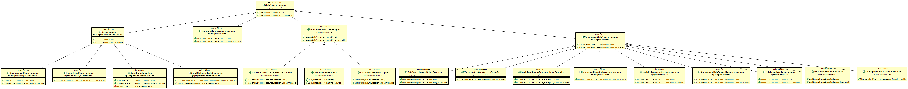

## Spring-spring架构-数据存取-DAO支持

Spring中对数据访问对象(DAO)的支持旨在以一致的方式简化数据访问技术(如JDBC、Hibernate或JPA)的使用。这使您可以相当容易地在上述持久性技术之间切换，而且还使您不必担心捕获特定于每种技术的异常。

1. 一致的异常层次结构

    Spring提供了从特定于技术的异常(如SQLException)到它自己的异常类层次结构(其中DataAccessException作为根异常)的方便转换。这些异常将原始异常包装起来，这样就不会有丢失关于可能出错的任何信息的风险。

    除了JDBC异常，Spring还可以包装JPA和hibernate特定的异常，将它们转换为一组集中的运行时异常。这允许您仅在适当的层中处理大多数不可恢复的持久性异常，而不会在DAOs中有烦人的样板捕获抛出块和异常声明。(不过，您仍然可以在任何需要的地方捕获和处理异常。)如上所述，JDBC异常(包括特定于数据库的方言)也被转换为相同的层次结构，这意味着您可以在一致的编程模型中使用JDBC执行一些操作。

    前面的讨论适用于Spring支持的各种ORM框架中的各种模板类。如果使用基于拦截器的类，应用程序必须关心如何处理HibernateExceptions和PersistenceExceptions本身，最好分别委托给SessionFactoryUtils的convertHibernateAccessException(..)或convertJpaAccessException()方法。这些方法将异常转换为与org.springframework.dao中异常层次结构兼容的异常。由于没有选中PersistenceExceptions ，它们也可能被抛出(不过，在异常方面牺牲了泛型DAO抽象)。

    下图显示了Spring提供的异常层次结构。(注意，图中详细描述的类层次结构只显示了整个DataAccessException层次结构的一个子集)

    

2. 用于配置DAO或存储库类的注释

    确保数据访问对象(DAOs)或存储库提供异常转换的最佳方法是使用@Repository注释。该注释还允许组件扫描支持查找和配置DAOs和存储库，而不需要为它们提供XML配置条目。下面的例子展示了如何使用@Repository注释:

    ```java
    @Repository 
    public class SomeMovieFinder implements MovieFinder {
        // ...
    }
    ```

    任何DAO或存储库实现都需要访问持久性资源，这取决于使用的持久性技术。例如，基于JDBC的存储库需要访问JDBC数据源，而基于jpa的存储库需要访问EntityManager。完成此任务的最简单方法是使用@Autowired、@Inject、@Resource或@PersistenceContext注释之一注入此资源依赖项。下面的例子适用于JPA存储库:

    ```java
    @Repository
    public class JpaMovieFinder implements MovieFinder {

        @PersistenceContext
        private EntityManager entityManager;

        // ...

    }
    ```

    如果使用经典Hibernate api，可以注入SessionFactory，如下例所示:

    ```java
    @Repository
    public class HibernateMovieFinder implements MovieFinder {

        private SessionFactory sessionFactory;

        @Autowired
        public void setSessionFactory(SessionFactory sessionFactory) {
            this.sessionFactory = sessionFactory;
        }

        // ...

    }
    ```

    我们在这里展示的最后一个例子是典型的JDBC支持。您可以将数据源注入到初始化方法中，在初始化方法中，您将使用该数据源创建一个JdbcTemplate和其他数据访问支持类(如SimpleJdbcCall和其他类)。下面的示例自动拖拽数据源:

    ```java
    @Repository
    public class JdbcMovieFinder implements MovieFinder {

        private JdbcTemplate jdbcTemplate;

        @Autowired
        public void init(DataSource dataSource) {
            this.jdbcTemplate = new JdbcTemplate(dataSource);
        }

        // ...

    }
    ```