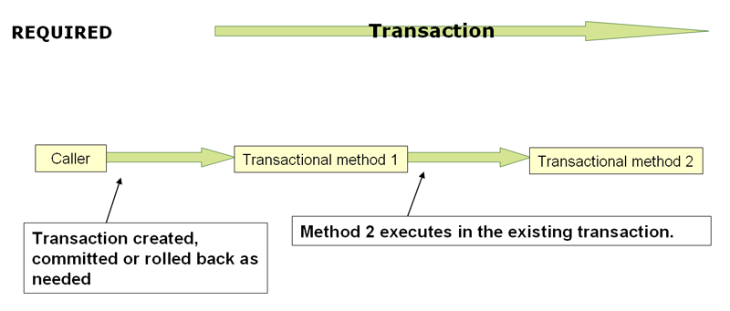
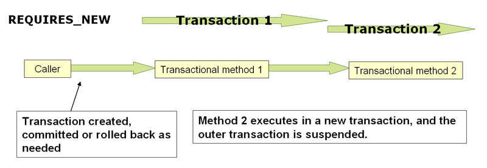

## 事务管理

全面的事务支持是使用Spring框架的最重要原因之一。Spring框架为事务管理提供了一致的抽象，提供了以下好处:
* 跨不同事务API(如Java事务API (JTA)、JDBC、Hibernate和Java持久性API (JPA))的一致编程模型。
* 支持声明性事务管理。
* 用于程序化事务管理的API比复杂事务API(如JTA)更简单。
* 与Spring的数据访问抽象的优秀集成。

1. Spring框架事务支持模型的优点

    传统上，Java EE开发人员有两种事务管理选择:全局事务或本地事务，这两种事务都有很大的局限性。在接下来的两部分中，我们将回顾全局和本地事务管理，然后讨论Spring框架的事务管理支持如何解决全局和本地事务模型的限制。

    1. 全局事务

        全局事务允许您处理多个事务资源，通常是关系数据库和消息队列。应用服务器通过JTA管理全局事务，JTA是一个很麻烦的API(部分原因是它的异常模型)。此外，JTA UserTransaction通常需要来自JNDI，这意味着您还需要使用JNDI才能使用JTA。全局事务的使用限制了应用程序代码的任何潜在重用，因为JTA通常只在应用程序服务器环境中可用。

        以前，使用全局事务的首选方法是通过EJB CMT(容器管理事务)。CMT是声明性事务管理的一种形式(与程序化事务管理不同)。EJB CMT消除了对与事务相关的JNDI查找的需要，尽管EJB本身的使用需要使用JNDI。它消除了编写Java代码来控制事务的大部分(但不是全部)需求。显著的缺点是CMT与JTA和应用服务器环境绑定在一起。此外，只有在选择在EJB中实现业务逻辑(或者至少在事务EJB facade之后)时，才可以使用它。EJB的负面影响通常是如此之大，以至于这不是一个有吸引力的提议，特别是在声明性事务管理的替代方案方面。

    2. 本地事务

        本地事务是特定于资源的，例如与JDBC连接相关联的事务。本地事务可能更容易使用，但有一个明显的缺点:它们不能跨多个事务资源工作。例如，使用JDBC连接管理事务的代码不能在全局JTA事务中运行。由于应用服务器不参与事务管理，因此它无法帮助确保跨多个资源的正确性。(值得注意的是，大多数应用程序使用一个事务资源。)另一个缺点是本地事务对编程模型具有侵入性。
    
    3. Spring框架的一致编程模型
    
        Spring解决了全局事务和本地事务的缺点。它允许应用程序开发人员在任何环境中使用一致的编程模型。您只需编写一次代码，就可以从不同环境中的不同事务管理策略中获益。Spring框架同时提供声明性和程序性事务管理。大多数用户更喜欢声明性事务管理，我们在大多数情况下推荐使用声明性事务管理。
        
        使用程序化事务管理，开发人员使用Spring Framework事务抽象，它可以运行在任何底层事务基础设施上。使用首选的声明模型，开发人员通常只编写很少或根本不编写与事务管理相关的代码，因此不依赖于Spring Framework事务API或任何其他事务API。

2. 理解Spring框架事务抽象

    Spring事务抽象的关键是事务策略的概念。事务策略由org.springframework.transaction.PlatformTransactionManager接口定义，如下所示:
    
    ```java
    public interface PlatformTransactionManager {

        TransactionStatus getTransaction(TransactionDefinition definition) throws TransactionException;

        void commit(TransactionStatus status) throws TransactionException;

        void rollback(TransactionStatus status) throws TransactionException;
    }
    ```

    这主要是一个服务提供者接口(service provider interface, SPI)，尽管您可以从应用程序代码中以编程方式使用它。因为PlatformTransactionManager是一个接口，所以它可以根据需要轻松地模拟或存根。它不绑定到查找策略，比如JNDI。PlatformTransactionManager实现的定义与Spring Framework IoC容器中的任何其他对象(或bean)一样。仅这一点就使Spring Framework事务成为一个有价值的抽象，即使在使用JTA时也是如此。您可以比直接使用JTA更容易地测试事务代码。

    同样，为了与Spring的理念保持一致，可以由任何PlatformTransactionManager接口的方法抛出的TransactionException都是unchecked(也就是说，它扩展了java.lang.RuntimeException)。事务基础设施失败几乎总是致命的。在极少数情况下，应用程序代码实际上可以从事务失败中恢复，应用程序开发人员仍然可以选择捕获和处理TransactionException。重要的一点是，开发人员并不是被迫这样做的。

    getTransaction(..)方法根据TransactionDefinition参数返回一个TransactionStatus对象。如果当前调用堆栈中存在匹配的事务，则返回的TransactionStatus可能表示一个新事务，也可能表示一个现有事务。后一种情况的含义是，与Java EE事务上下文一样，事务状态与执行线程相关联。

    TransactionDefinition接口指定:

    * Propagation(传播):通常，在事务范围内执行的所有代码都在该事务中运行。但是，如果事务方法在事务上下文已经存在时执行，则可以指定行为。例如，代码可以在现有事务中继续运行(通常情况下)，或者可以挂起现有事务并创建一个新事务。Spring提供了EJB CMT中熟悉的所有事务传播选项。要了解Spring中事务传播的语义，请参阅事务传播。

    * Isolation(隔离):此事务与其他事务的工作隔离的程度。例如，该事务能否看到来自其他事务的未提交写操作?

    * Timeout(超时):此事务在超时并由基础事务基础设施自动回滚之前运行的时间。
    
    * Read-only status(只读状态):当代码读取但不修改数据时，可以使用只读事务。在某些情况下，只读事务是一种有用的优化，比如在使用Hibernate时。

    这些设置反映了标准的事务概念。如果需要，请参考讨论事务隔离级别和其他核心事务概念的资源。理解这些概念对于使用Spring框架或任何事务管理解决方案都是必不可少的。

    TransactionStatus接口为事务代码提供了一种简单的方法来控制事务执行和查询事务状态。这些概念应该很熟悉，因为它们对所有事务api都是通用的。下面的清单显示了TransactionStatus接口:
    
    ```java
    public interface TransactionStatus extends SavepointManager {

        boolean isNewTransaction();

        boolean hasSavepoint();

        void setRollbackOnly();

        boolean isRollbackOnly();

        void flush();

        boolean isCompleted();

    }
    ```

    无论您在Spring中选择声明式事务管理还是程序化事务管理，定义正确的PlatformTransactionManager实现都是绝对必要的。您通常通过依赖项注入来定义此实现。
    PlatformTransactionManager实现通常需要了解它们工作的环境:JDBC、JTA、Hibernate等等。下面的示例展示了如何定义本地平台transactionmanager实现(在本例中，使用普通JDBC)。

    您可以通过创建一个类似于下面的bean来定义JDBC数据源:
    
    ```xml
    <bean id="dataSource" class="org.apache.commons.dbcp.BasicDataSource" destroy-method="close">
        <property name="driverClassName" value="${jdbc.driverClassName}" />
        <property name="url" value="${jdbc.url}" />
        <property name="username" value="${jdbc.username}" />
        <property name="password" value="${jdbc.password}" />
    </bean>
    ```

    然后，相关的PlatformTransactionManager bean定义具有对数据源定义的引用。它应该类似于下面的例子:

    ```xml
    <bean id="txManager" class="org.springframework.jdbc.datasource.DataSourceTransactionManager">
        <property name="dataSource" ref="dataSource"/>
    </bean>
    ```

    如果在Java EE容器中使用JTA，则使用通过JNDI获得的容器数据源，并结合Spring的JtaTransactionManager。下面的示例显示了JTA和JNDI查找版本的样子:

    ```xml
    <?xml version="1.0" encoding="UTF-8"?>
    <beans xmlns="http://www.springframework.org/schema/beans"
        xmlns:xsi="http://www.w3.org/2001/XMLSchema-instance"
        xmlns:jee="http://www.springframework.org/schema/jee"
        xsi:schemaLocation="
            http://www.springframework.org/schema/beans
            https://www.springframework.org/schema/beans/spring-beans.xsd
            http://www.springframework.org/schema/jee
            https://www.springframework.org/schema/jee/spring-jee.xsd">

        <jee:jndi-lookup id="dataSource" jndi-name="jdbc/jpetstore"/>

        <bean id="txManager" class="org.springframework.transaction.jta.JtaTransactionManager" />

        <!-- other <bean/> definitions here -->

    </beans>
    ```

    JtaTransactionManager不需要知道数据源(或任何其他特定资源)，因为它使用容器的全局事务管理基础设施。

    您还可以轻松地使用Hibernate本地事务，如下面的示例所示。在本例中，需要定义Hibernate LocalSessionFactoryBean，应用程序代码可以使用它来获取Hibernate会话实例。

    DataSource bean定义类似于前面显示的本地JDBC示例，因此在下面的示例中没有显示。

    如果数据源(由任何非jta事务管理器使用)通过JNDI查找并由Java EE容器管理，那么它应该是非事务性的，因为Spring框架(而不是Java EE容器)管理事务。

    本例中的txManager bean属于HibernateTransactionManager类型。与DataSourceTransactionManager需要对数据源的引用一样，HibernateTransactionManager也需要对SessionFactory的引用。下面的例子声明了sessionFactory和txManager bean:

    ```xml
    <bean id="sessionFactory" class="org.springframework.orm.hibernate5.LocalSessionFactoryBean">
        <property name="dataSource" ref="dataSource"/>
        <property name="mappingResources">
            <list>
                <value>org/springframework/samples/petclinic/hibernate/petclinic.hbm.xml</value>
            </list>
        </property>
        <property name="hibernateProperties">
            <value>
                hibernate.dialect=${hibernate.dialect}
            </value>
        </property>
    </bean>

    <bean id="txManager" class="org.springframework.orm.hibernate5.HibernateTransactionManager">
        <property name="sessionFactory" ref="sessionFactory"/>
    </bean>
    ```

    如果使用Hibernate和Java EE容器管理的JTA事务，应该使用与前面JTA示例相同的JtaTransactionManager来处理JDBC，如下例所示:

    ```xml
    <bean id="txManager" class="org.springframework.transaction.jta.JtaTransactionManager"/>
    ```

3. 将资源与事务同步

    现在应该清楚了如何创建不同的事务管理器，以及如何将它们链接到需要同步到事务的相关资源(例如DataSourceTransactionManager到JDBC数据源，HibernateTransactionManager到Hibernate SessionFactory，等等)。本节描述应用程序代码(通过使用JDBC、Hibernate或JPA等持久性API，直接或间接地)如何确保正确地创建、重用和清理这些资源。本节还讨论了如何(可选地)通过相关的PlatformTransactionManager触发事务同步。

    1. 高级的同步方法

        首选的方法是使用Spring最高级的基于模板的持久性集成api，或者使用带有事务感知工厂bean或代理的本机ORM api来管理本机资源工厂。这些事务感知解决方案在内部处理资源创建和重用、清理、资源的可选事务同步和异常映射。因此，用户数据访问代码不必处理这些任务，但可以完全专注于非样板持久性逻辑。通常，您使用原生ORM API，或者使用JdbcTemplate采用模板方法进行JDBC访问。这些解决方案将在本参考文档的后续章节中详细介绍。

    2. 低级的同步方法

        诸如DataSourceUtils(用于JDBC)、EntityManagerFactoryUtils(用于JPA)、SessionFactoryUtils(用于Hibernate)等类存在于较低的级别。当你想让应用程序代码直接处理原生资源类型的持久性API,您使用这些类来确保适当的Spring Framework-managed实例,事务是(可选)同步的,在这个过程中发生的和异常正确映射到一个一致的API。

        例如，在JDBC的情况下，您可以使用Spring的org.springframework.jdbc.datasource代替传统的JDBC方法来调用数据源上的getConnection()方法。DataSourceUtils类，如下:

        ```java
        Connection conn = DataSourceUtils.getConnection(dataSource);
        ```

        如果现有事务已经有一个同步(链接)到它的连接，则返回该实例。否则，方法调用将触发新连接的创建，新连接(可选地)与任何现有事务同步，并可用于该事务的后续重用。如前所述，任何SQLException都被包装在Spring框架中，Spring框架的层次结构之一是未选中的DataAccessException类型。这种方法提供的信息比从SQLException获得的信息要多，并且确保了跨数据库甚至跨不同持久性技术的可移植性。

        这种方法也可以在没有Spring事务管理的情况下工作(事务同步是可选的)，因此无论是否使用Spring进行事务管理，都可以使用它。

        当然，一旦您使用了Spring的JDBC支持、JPA支持或Hibernate支持，您通常不喜欢使用DataSourceUtils或其他帮助类，因为通过Spring抽象进行工作要比直接使用相关api高兴得多。例如，如果您使用Spring JdbcTemplate或jdbc。为了简化JDBC的使用，正确的连接检索发生在后台，您不需要编写任何特殊的代码。

    3. TransactionAwareDataSourceProxy

        在最底层存在TransactionAwareDataSourceProxy类。这是目标数据源的代理，它封装目标数据源以添加对spring管理事务的感知。在这方面，它类似于由Java EE服务器提供的事务性JNDI数据源。
        
        除了必须调用现有代码并传递标准JDBC数据源接口实现时，您几乎不需要或不想使用该类。在这种情况下，这段代码可能是可用的，但是参与了spring管理的事务。您可以使用前面提到的高级抽象来编写新代码。

4. 声明式事务管理

    Spring框架的声明性事务管理是通过Spring面向方面编程(AOP)实现的。然而，由于事务方面代码随Spring框架发行版而来，并且可以以样板方式使用，所以AOP概念通常不需要理解就可以有效地使用这些代码。

    Spring框架的声明性事务管理类似于EJB CMT，因为您可以在单个方法级别指定事务行为(或缺少事务行为)。如果需要，可以在事务上下文中调用setRollbackOnly()。两种事务管理的区别在于:

    * 与绑定到JTA的EJB CMT不同，Spring框架的声明性事务管理可以在任何环境中工作。它可以通过使用JDBC、JPA或Hibernate调整配置文件来处理JTA事务或本地事务。
    您可以将Spring框架声明性事务管理应用于任何类，而不仅仅是ejb之类的特殊类。
    
    * Spring框架提供声明性回滚规则，这是一个没有EJB等效特性的特性。提供了对回滚规则的编程和声明性支持。
    
    * Spring框架允许您使用AOP定制事务行为。例如，您可以在事务回滚的情况下插入自定义行为。您还可以添加任意的建议以及事务建议。使用EJB CMT，您不能影响容器的事务管理，除非使用setRollbackOnly()。

    * Spring框架不像高端应用服务器那样支持在远程调用之间传播事务上下文。如果您需要这个特性，我们建议您使用EJB。但是，在使用此类功能之前请仔细考虑，因为通常不希望事务跨远程调用。
    
    回滚规则的概念很重要。它们允许您指定哪些异常(和可抛出的)应该导致自动回滚。您可以在配置中声明性地指定此值，而不是在Java代码中。因此，尽管您仍然可以调用TransactionStatus对象上的setRollbackOnly()来回滚当前事务，但大多数情况下，您可以指定一条规则，即MyApplicationException必须始终导致回滚。此选项的显著优点是业务对象不依赖于事务基础设施。例如，它们通常不需要导入Spring事务api或其他Spring api。
    
    虽然EJB容器默认行为会自动回滚系统异常上的事务(通常是运行时异常)，但是EJB CMT不会自动回滚应用程序异常上的事务(即除java.rmi.RemoteException之外的已检查异常)。虽然声明性事务管理的Spring默认行为遵循EJB约定(仅在未检查的异常时自动回滚)，但是定制此行为通常很有用。

    1. 理解Spring框架的声明性事务实现

        仅仅告诉您使用@Transactional注解注释类、将@EnableTransactionManagement添加到配置并期望您理解它是如何工作的是不够的。为了提供更深入的理解，本节将解释Spring框架的声明性事务基础结构在发生与事务相关的问题时的内部工作原理。

        关于Spring框架的声明性事务支持，需要掌握的最重要的概念是，这种支持是通过AOP代理启用的，而事务建议是由元数据(当前是基于XML或注释的)驱动的。AOP与事务元数据的结合产生了一个AOP代理，它使用一个TransactionInterceptor和一个适当的PlatformTransactionManager实现来驱动围绕方法调用的事务。

        下图显示了调用事务代理上的方法的概念视图:

        

    2. 声明性事务实现的示例

        考虑以下接口及其的实现。本例使用Foo和Bar类作为占位符，这样您就可以专注于事务的使用，而不必关注特定的域模型。就本例而言，DefaultFooService类在每个实现方法的主体中抛出UnsupportedOperationException实例的事实是好的。该行为允许创建事务，然后回滚事务以响应UnsupportedOperationExcepton实例。下面的清单显示了FooService接口

        ```java
        // the service interface that we want to make transactional

        package x.y.service;

        public interface FooService {

            Foo getFoo(String fooName);

            Foo getFoo(String fooName, String barName);

            void insertFoo(Foo foo);

            void updateFoo(Foo foo);

        }
        ```

        下面的例子展示了上述接口的实现:

        ```java
        package x.y.service;

        public class DefaultFooService implements FooService {

            public Foo getFoo(String fooName) {
                throw new UnsupportedOperationException();
            }

            public Foo getFoo(String fooName, String barName) {
                throw new UnsupportedOperationException();
            }

            public void insertFoo(Foo foo) {
                throw new UnsupportedOperationException();
            }

            public void updateFoo(Foo foo) {
                throw new UnsupportedOperationException();
            }

        }
        ```

        假设FooService接口的前两个方法getFoo(String)和getFoo(String, String)必须在具有只读语义的事务上下文中执行，而其他方法insertFoo(Foo)和updateFoo(Foo)必须在具有读写语义的事务上下文中执行。下面几段将详细解释以下配置:

        ```xml
        <!-- from the file 'context.xml' -->
        <?xml version="1.0" encoding="UTF-8"?>
        <beans xmlns="http://www.springframework.org/schema/beans"
            xmlns:xsi="http://www.w3.org/2001/XMLSchema-instance"
            xmlns:aop="http://www.springframework.org/schema/aop"
            xmlns:tx="http://www.springframework.org/schema/tx"
            xsi:schemaLocation="
                http://www.springframework.org/schema/beans
                https://www.springframework.org/schema/beans/spring-beans.xsd
                http://www.springframework.org/schema/tx
                https://www.springframework.org/schema/tx/spring-tx.xsd
                http://www.springframework.org/schema/aop
                https://www.springframework.org/schema/aop/spring-aop.xsd">

            <!-- this is the service object that we want to make transactional -->
            <bean id="fooService" class="x.y.service.DefaultFooService"/>

            <!-- the transactional advice (what 'happens'; see the <aop:advisor/> bean below) -->
            <tx:advice id="txAdvice" transaction-manager="txManager">
                <!-- the transactional semantics... -->
                <tx:attributes>
                    <!-- all methods starting with 'get' are read-only -->
                    <tx:method name="get*" read-only="true"/>
                    <!-- other methods use the default transaction settings (see below) -->
                    <tx:method name="*"/>
                </tx:attributes>
            </tx:advice>

            <!-- ensure that the above transactional advice runs for any execution
                of an operation defined by the FooService interface -->
            <aop:config>
                <aop:pointcut id="fooServiceOperation" expression="execution(* x.y.service.FooService.*(..))"/>
                <aop:advisor advice-ref="txAdvice" pointcut-ref="fooServiceOperation"/>
            </aop:config>

            <!-- don't forget the DataSource -->
            <bean id="dataSource" class="org.apache.commons.dbcp.BasicDataSource" destroy-method="close">
                <property name="driverClassName" value="oracle.jdbc.driver.OracleDriver"/>
                <property name="url" value="jdbc:oracle:thin:@rj-t42:1521:elvis"/>
                <property name="username" value="scott"/>
                <property name="password" value="tiger"/>
            </bean>

            <!-- similarly, don't forget the PlatformTransactionManager -->
            <bean id="txManager" class="org.springframework.jdbc.datasource.DataSourceTransactionManager">
                <property name="dataSource" ref="dataSource"/>
            </bean>

            <!-- other <bean/> definitions here -->

        </beans>
        ```

        检查前面的配置。它假定您希望使服务对象fooService bean成为事务性的。要应用的事务语义封装在\<tx:advice/>定义中。\<tx:advice/>定义读作“所有方法，从get开始，都要在只读事务上下文中执行，所有其他方法都要使用默认的事务语义执行”。\<tx:advice/>标记的transaction-manager属性被设置为将要驱动事务的PlatformTransactionManager bean的名称(在本例中是txManager bean)。

        ```
        如果要连接的平台transactionManager的bean名称为transactionManager，则可以在事务通知(<tx:advice/>)中省略transaction-manager属性。如果要连接的PlatformTransactionManager bean具有任何其他名称，则必须显式地使用transaction-manager属性，如前面的示例所示。
        ```

        \<aop:config/>定义确保txAdvice bean定义的事务通知在程序中的适当位置执行。首先，定义一个切入点，它匹配在FooService接口(fooServiceOperation)中定义的任何操作的执行。然后使用advisor将切入点与txAdvice关联起来。结果表明，在执行fooServiceOperation时，将运行txAdvice定义的通知。
        
        在\<aop:pointcut/>元素中定义的表达式是AspectJ切入点表达式。有关Spring中的切入点表达式的更多细节，请参阅AOP部分。

        一个常见的需求是使整个服务层具有事务性。要做到这一点，最好的方法是更改切入点表达式以匹配服务层中的任何操作。下面的例子说明了如何做到这一点:
        
        ```xml
        <aop:config>
            <aop:pointcut id="fooServiceMethods" expression="execution(* x.y.service.*.*(..))"/>
            <aop:advisor advice-ref="txAdvice" pointcut-ref="fooServiceMethods"/>
        </aop:config>
        ```

        前面显示的配置用于围绕从fooService bean定义创建的对象创建事务代理。代理使用事务通知配置，因此，当在代理上调用适当的方法时，根据与该方法关联的事务配置，事务将被启动、挂起、标记为只读，等等。考虑以下测试驱动前面所示配置的程序:

        ```java
        public final class Boot {

            public static void main(final String[] args) throws Exception {
                ApplicationContext ctx = new ClassPathXmlApplicationContext("context.xml", Boot.class);
                FooService fooService = (FooService) ctx.getBean("fooService");
                fooService.insertFoo (new Foo());
            }
        }
        ```

        运行上述程序的输出应该类似于以下内容(DefaultFooService类的insertFoo(..)方法抛出的UnsupportedOperationException的Log4J输出和堆栈跟踪已被截断，以保持清晰):

        ```
        <!-- the Spring container is starting up... -->
        [AspectJInvocationContextExposingAdvisorAutoProxyCreator] - Creating implicit proxy for bean 'fooService' with 0 common interceptors and 1 specific interceptors

        <!-- the DefaultFooService is actually proxied -->
        [JdkDynamicAopProxy] - Creating JDK dynamic proxy for [x.y.service.DefaultFooService]

        <!-- ... the insertFoo(..) method is now being invoked on the proxy -->
        [TransactionInterceptor] - Getting transaction for x.y.service.FooService.insertFoo

        <!-- the transactional advice kicks in here... -->
        [DataSourceTransactionManager] - Creating new transaction with name [x.y.service.FooService.insertFoo]
        [DataSourceTransactionManager] - Acquired Connection [org.apache.commons.dbcp.PoolableConnection@a53de4] for JDBC transaction

        <!-- the insertFoo(..) method from DefaultFooService throws an exception... -->
        [RuleBasedTransactionAttribute] - Applying rules to determine whether transaction should rollback on java.lang.UnsupportedOperationException
        [TransactionInterceptor] - Invoking rollback for transaction on x.y.service.FooService.insertFoo due to throwable [java.lang.UnsupportedOperationException]

        <!-- and the transaction is rolled back (by default, RuntimeException instances cause rollback) -->
        [DataSourceTransactionManager] - Rolling back JDBC transaction on Connection [org.apache.commons.dbcp.PoolableConnection@a53de4]
        [DataSourceTransactionManager] - Releasing JDBC Connection after transaction
        [DataSourceUtils] - Returning JDBC Connection to DataSource

        Exception in thread "main" java.lang.UnsupportedOperationException at x.y.service.DefaultFooService.insertFoo(DefaultFooService.java:14)
        <!-- AOP infrastructure stack trace elements removed for clarity -->
        at $Proxy0.insertFoo(Unknown Source)
        at Boot.main(Boot.java:11)
        ```

    3. 回滚声明性事务

        上一节概述了如何在应用程序中声明性地为类(通常是服务层类)指定事务设置的基础。本节描述如何以简单的声明式方式控制事务的回滚。

        向Spring框架的事务基础结构表明要回滚事务的工作的推荐方法是从当前正在事务上下文中执行的代码中抛出异常。Spring框架的事务基础结构代码在弹出调用堆栈并决定是否将事务标记为回滚时捕获任何未处理的异常。

        在其缺省配置中，Spring框架的事务基础结构代码仅在运行时未检查异常的情况下标记回滚事务。也就是说，当抛出的异常是RuntimeException的实例或子类时。(默认情况下，错误实例也会导致回滚)。从事务方法抛出的已检查异常不会导致默认配置中的回滚。

        您可以精确地配置哪些异常类型标记回滚事务，包括已检查的异常。下面的XML片段演示了如何为已检查的特定于应用程序的异常类型配置回滚:

        ```xml
        <tx:advice id="txAdvice" transaction-manager="txManager">
            <tx:attributes>
            <tx:method name="get*" read-only="true" rollback-for="NoProductInStockException"/>
            <tx:method name="*"/>
            </tx:attributes>
        </tx:advice>
        ```

        如果不希望在抛出异常时回滚事务，还可以指定“no rollback rules”。下面的例子告诉Spring框架的事务基础结构，即使面对未处理的InstrumentNotFoundException，也要提交相应的事务:

        ```xml
        <tx:advice id="txAdvice">
            <tx:attributes>
            <tx:method name="updateStock" no-rollback-for="InstrumentNotFoundException"/>
            <tx:method name="*"/>
            </tx:attributes>
        </tx:advice>
        ```

        当Spring框架的事务基础设施捕捉到异常并咨询配置的回滚规则以确定是否将事务标记为回滚时，最强的匹配规则获胜。因此，在以下配置的情况下，除了InstrumentNotFoundException之外的任何异常都会导致相应事务的回滚:

        ```xml
        <tx:advice id="txAdvice">
            <tx:attributes>
            <tx:method name="*" rollback-for="Throwable" no-rollback-for="InstrumentNotFoundException"/>
            </tx:attributes>
        </tx:advice>
        ```

        您还可以通过编程方式指示所需的回滚。虽然这个过程很简单，但是它非常具有侵入性，并且将您的代码紧密地耦合到Spring框架的事务基础设施中。下面的例子展示了如何通过编程来指定所需的回滚:

        ```java
        public void resolvePosition() {
            try {
                // some business logic...
            } catch (NoProductInStockException ex) {
                // trigger rollback programmatically
                TransactionAspectSupport.currentTransactionStatus().setRollbackOnly();
            }
        }
        ```

        强烈建议您尽可能使用声明性方法回滚。如果您绝对需要，编程回滚是可用的，但是它的使用与实现一个干净的基于pojo的体系结构背道而驰。

    4. 为不同的bean定义不同的事务语义

        考虑这样一种场景:您有许多服务层对象，并且您希望对其中每个对象应用完全不同的事务配置。可以通过定义不同的<aop:advisor/>元素来实现这一点，这些元素具有不同的切入点和advice-ref属性值。

        作为比较，首先假设所有服务层类都定义在com.x.y.service包。要使所有在该包(或子包)中定义的类实例(或在子包中定义的类实例)以及名称以服务结尾的bean都具有默认的事务配置，您可以编写以下代码:

        ```xml
        <?xml version="1.0" encoding="UTF-8"?>
        <beans xmlns="http://www.springframework.org/schema/beans"
            xmlns:xsi="http://www.w3.org/2001/XMLSchema-instance"
            xmlns:aop="http://www.springframework.org/schema/aop"
            xmlns:tx="http://www.springframework.org/schema/tx"
            xsi:schemaLocation="
                http://www.springframework.org/schema/beans
                https://www.springframework.org/schema/beans/spring-beans.xsd
                http://www.springframework.org/schema/tx
                https://www.springframework.org/schema/tx/spring-tx.xsd
                http://www.springframework.org/schema/aop
                https://www.springframework.org/schema/aop/spring-aop.xsd">

            <aop:config>

                <aop:pointcut id="serviceOperation"
                        expression="execution(* x.y.service..*Service.*(..))"/>

                <aop:advisor pointcut-ref="serviceOperation" advice-ref="txAdvice"/>

            </aop:config>

            <!-- these two beans will be transactional... -->
            <bean id="fooService" class="x.y.service.DefaultFooService"/>
            <bean id="barService" class="x.y.service.extras.SimpleBarService"/>

            <!-- ... and these two beans won't -->
            <bean id="anotherService" class="org.xyz.SomeService"/> <!-- (not in the right package) -->
            <bean id="barManager" class="x.y.service.SimpleBarManager"/> <!-- (doesn't end in 'Service') -->

            <tx:advice id="txAdvice">
                <tx:attributes>
                    <tx:method name="get*" read-only="true"/>
                    <tx:method name="*"/>
                </tx:attributes>
            </tx:advice>

            <!-- other transaction infrastructure beans such as a PlatformTransactionManager omitted... -->

        </beans>
        ```

        下面的例子展示了如何用完全不同的事务设置配置两个不同的bean:

        ```xml
        <?xml version="1.0" encoding="UTF-8"?>
        <beans xmlns="http://www.springframework.org/schema/beans"
            xmlns:xsi="http://www.w3.org/2001/XMLSchema-instance"
            xmlns:aop="http://www.springframework.org/schema/aop"
            xmlns:tx="http://www.springframework.org/schema/tx"
            xsi:schemaLocation="
                http://www.springframework.org/schema/beans
                https://www.springframework.org/schema/beans/spring-beans.xsd
                http://www.springframework.org/schema/tx
                https://www.springframework.org/schema/tx/spring-tx.xsd
                http://www.springframework.org/schema/aop
                https://www.springframework.org/schema/aop/spring-aop.xsd">

            <aop:config>

                <aop:pointcut id="defaultServiceOperation"
                        expression="execution(* x.y.service.*Service.*(..))"/>

                <aop:pointcut id="noTxServiceOperation"
                        expression="execution(* x.y.service.ddl.DefaultDdlManager.*(..))"/>

                <aop:advisor pointcut-ref="defaultServiceOperation" advice-ref="defaultTxAdvice"/>

                <aop:advisor pointcut-ref="noTxServiceOperation" advice-ref="noTxAdvice"/>

            </aop:config>

            <!-- this bean will be transactional (see the 'defaultServiceOperation' pointcut) -->
            <bean id="fooService" class="x.y.service.DefaultFooService"/>

            <!-- this bean will also be transactional, but with totally different transactional settings -->
            <bean id="anotherFooService" class="x.y.service.ddl.DefaultDdlManager"/>

            <tx:advice id="defaultTxAdvice">
                <tx:attributes>
                    <tx:method name="get*" read-only="true"/>
                    <tx:method name="*"/>
                </tx:attributes>
            </tx:advice>

            <tx:advice id="noTxAdvice">
                <tx:attributes>
                    <tx:method name="*" propagation="NEVER"/>
                </tx:attributes>
            </tx:advice>

            <!-- other transaction infrastructure beans such as a PlatformTransactionManager omitted... -->

        </beans>
        ```

    5. \<tx:advice/>设置

        本节总结了可以使用\<tx:advice/>标记指定的各种事务设置。默认\<tx:advice/>设置为:
        * 传播设置是必填的。
        * 隔离级别是默认的。
        * 事务是读写的。
        * 事务超时默认为底层事务系统的默认超时，如果不支持超时，则为none。
        * 任何RuntimeException都会触发回滚，而任何已检查的异常则不会。

        您可以更改这些默认设置。下表总结了嵌套在\<tx:advice/>和\<tx:attributes/>标签内的\<tx:method/>标签的各种属性:
        
        \<tx:method/>设置，如下表：

        属性|是否必填?|默认值|描述
        --|--|--|--
        name|Yes||要与事务属性关联的方法名称。通配符(\*)可用于将相同的事务属性设置与许多方法(例如get*、handle*、on*Event等)关联起来。
        propagation|No|REQUIRED|事务传播行为。
        isolation|No|DEFAULT|事务隔离级别。仅适用于REQUIRED或REQUIRES_NEW的传播设置。
        timeout|No|-1|事务超时(秒)。仅适用于传播REQUIRED或REQUIRES_NEW。
        read-only|No|FALSE|读写事务与只读事务。只适用于REQUIRED或REQUIRES_NEW。
        rollback-for|No||读写事务与只读事务。触发回滚的异常实例的逗号分隔列表。例如,com.foo.MyBusinessException,ServletException。
        no-rollback-for|No||不触发回滚的异常实例的逗号分隔列表。例如,com.foo.MyBusinessException ServletException。

    6. 使用@Transactional

        除了基于xml的事务配置声明方法之外，还可以使用基于注释的方法。直接在Java源代码中声明事务语义使声明更接近受影响的代码。不存在过多耦合的危险，因为用于事务的代码几乎总是以这种方式部署的。

        使用@Transactional注释所提供的易用性最好通过一个示例来说明，下面的文本将对此进行解释。考虑下面的类定义:

        ```java
        // the service class that we want to make transactional
        @Transactional
        public class DefaultFooService implements FooService {

            Foo getFoo(String fooName);

            Foo getFoo(String fooName, String barName);

            void insertFoo(Foo foo);

            void updateFoo(Foo foo);
        }
        ```

        在上面的类级别上使用，注释为声明类(及其子类)的所有方法指明默认值。另外，每个方法都可以单独注释。注意，类级别的注释不应用于类层次结构上的祖先类;在这种情况下，需要在本地重新声明方法，以便参与子类级别的注释。

        当像上面这样的POJO类在Spring上下文中定义为bean时，您可以通过@Configuration类中的@EnableTransactionManagement注释使bean实例具有事务性。有关详细信息，请参阅javadoc。
        
        在XML配置中，\<tx:annotation-driven/>标记提供了类似的便利:

        ```xml
        <!-- from the file 'context.xml' -->
        <?xml version="1.0" encoding="UTF-8"?>
        <beans xmlns="http://www.springframework.org/schema/beans"
            xmlns:xsi="http://www.w3.org/2001/XMLSchema-instance"
            xmlns:aop="http://www.springframework.org/schema/aop"
            xmlns:tx="http://www.springframework.org/schema/tx"
            xsi:schemaLocation="
                http://www.springframework.org/schema/beans
                https://www.springframework.org/schema/beans/spring-beans.xsd
                http://www.springframework.org/schema/tx
                https://www.springframework.org/schema/tx/spring-tx.xsd
                http://www.springframework.org/schema/aop
                https://www.springframework.org/schema/aop/spring-aop.xsd">

            <!-- this is the service object that we want to make transactional -->
            <bean id="fooService" class="x.y.service.DefaultFooService"/>

            <!-- enable the configuration of transactional behavior based on annotations -->
            <tx:annotation-driven transaction-manager="txManager"/><!-- a PlatformTransactionManager is still required --> 

            <bean id="txManager" class="org.springframework.jdbc.datasource.DataSourceTransactionManager">
                <!-- (this dependency is defined somewhere else) -->
                <property name="dataSource" ref="dataSource"/>
            </bean>

            <!-- other <bean/> definitions here -->

        </beans>
        ```

        **方法可见性和@Transactional**

        ```
        当使用代理时，应该只将@Transactional注释应用于具有公共可见性的方法。如果使用@Transactional注解注释受保护的、私有的或包可见的方法，则不会引发错误，但是注释的方法不显示配置的事务设置。如果需要注释非公共方法，请考虑使用AspectJ(稍后将进行描述)。
        ```

        您可以将@Transactional注释应用于接口定义、接口上的方法、类定义或类上的公共方法。然而，仅仅存在@Transactional注释还不足以激活事务行为。@Transactional注释只是一些运行时基础设施可以使用的元数据，这些运行时基础设施是@ transaction感知的，并且可以使用元数据配置适当的bean和事务行为。在前面的例子中，\<tx:annotation-driven/>元素打开事务行为。

        在计算方法的事务设置时，最派生的位置优先。在下面的示例中，DefaultFooService类是在类级别用只读事务的设置进行注释的，但是同一个类中updateFoo(Foo)方法上的@Transactional注释优先于在类级别定义的事务设置。

        ```java
        @Transactional(readOnly = true)
        public class DefaultFooService implements FooService {

            public Foo getFoo(String fooName) {
                // do something
            }

            // these settings have precedence for this method
            @Transactional(readOnly = false, propagation = Propagation.REQUIRES_NEW)
            public void updateFoo(Foo foo) {
                // do something
            }
        }
        ```

        1. @Transactional设置

            @Transactional注释是元数据，它指定接口、类或方法必须具有事务语义(例如，“在调用此方法时启动全新的只读事务，暂停任何现有事务”)。默认的@Transactional设置如下:
            * 传播设置是PROPAGATION_REQUIRED。
            * 隔离级别为ISOLATION_DEFAULT。
            * 事务是读写的。
            * 事务超时默认为底层事务系统的默认超时，如果不支持超时，则为none。
            * 任何RuntimeException都会触发回滚，而任何已检查的异常则不会。

            您可以更改这些默认设置。下表总结了@Transactional注释的各种属性:
            
            属性|类型|描述
            --|--|--
            value|String|指定要使用的事务管理器的可选限定符。
            propagation|枚举类: Propagation|可选的传播环境。
            isolation|枚举类: Isolation|可选的隔离级别。仅适用于REQUIRED或REQUIRES_NEW的传播值。
            timeout|int(以秒为单位粒度)|可选的事务超时。仅适用于REQUIREDor REQUIRES_NEW的传播值。
            readOnly|boolean|读写事务与只读事务。仅适用于REQUIRED或REQUIRES_NEW的值。
            rollbackFor|类对象的数组，该数组必须派生自Throwable。|必须导致回滚的异常类的可选数组。
            rollbackForClassName|类名数组，类必须派生自Throwable。|必须导致回滚的异常类的名称的可选数组。

            目前，您无法显式控制事务的名称，其中“name”表示出现在事务监视器(如果适用的话)和日志输出中的事务名称(例如，WebLogic的事务监视器)。对于声明性事务，事务名始终是完全限定的类名+.+事务通知类的方法名。例如，如果BusinessService类的handlePayment(..)方法启动了一个事务，该事务的名称将是:com.example.BusinessService.handlePayment。

        2. 使用@Transactional的多个事务管理器

            大多数Spring应用程序只需要一个事务管理器，但是在某些情况下，您可能希望在一个应用程序中有多个独立的事务管理器。您可以使用@Transactional注释的value属性选择性地指定要使用的PlatformTransactionManager的标识。这可以是bean名，也可以是事务管理器bean的限定符值。例如，使用限定符符号，您可以将以下Java代码与应用程序上下文中的事务管理器bean声明相结合:

            ```java
            public class TransactionalService {

                @Transactional("order")
                public void setSomething(String name) { ... }

                @Transactional("account")
                public void doSomething() { ... }
            }
            ```

            下面的清单显示了bean声明:

            ```xml
            <tx:annotation-driven/>

            <bean id="transactionManager1" class="org.springframework.jdbc.datasource.DataSourceTransactionManager">
                ...
                <qualifier value="order"/>
            </bean>

            <bean id="transactionManager2" class="org.springframework.jdbc.datasource.DataSourceTransactionManager">
                ...
                <qualifier value="account"/>
            </bean>
            ```

            在本例中，TransactionalService上的两个方法在单独的事务管理器下运行，由订单和帐户限定符区分。如果没有找到特定限定的PlatformTransactionManager bean，则仍然使用缺省\<tx:注释驱动的>目标bean名称transactionManager。
        
        3. 自定义快捷键的注释

            如果您发现在许多不同的方法上重复使用与@Transactional相同的属性，Spring的元注释支持允许您为特定的用例定义自定义快捷注释。例如，考虑以下注释定义:

            ```java
            @Target({ElementType.METHOD, ElementType.TYPE})
            @Retention(RetentionPolicy.RUNTIME)
            @Transactional("order")
            public @interface OrderTx {
            }

            @Target({ElementType.METHOD, ElementType.TYPE})
            @Retention(RetentionPolicy.RUNTIME)
            @Transactional("account")
            public @interface AccountTx {
            }
            ```

            前面的注释让我们可以将上一节的例子写成如下:

            ```java
            public class TransactionalService {

                @OrderTx
                public void setSomething(String name) { ... }

                @AccountTx
                public void doSomething() { ... }
            }
            ```

    7. 事务传播

        本节描述Spring中事务传播的一些语义。注意，本节不是对事务传播的介绍。相反，它详细描述了Spring中关于事务传播的一些语义。

        在spring管理的事务中，请注意物理事务和逻辑事务之间的差异，以及传播设置如何应用于这种差异。

        * 理解PROPAGATION_REQUIRED

            

            PROPAGATION_REQUIRED执行物理事务，如果当前范围中还不存在事务，则在本地执行当前范围的物理事务，或者参与为更大范围定义的现有“外部”事务。在同一线程中的公共调用堆栈安排中，这是一个很好的缺省值(例如，一个服务facade，它委托给几个存储库方法，其中所有底层资源都必须参与服务级事务)。

        * 理解PROPAGATION_REQUIRES_NEW

            

            与PROPAGATION_REQUIRED相反，PROPAGATION_REQUIRES_NEW始终为每个受影响的事务范围使用独立的物理事务，从不参与外部范围的现有事务。在这种安排中，底层资源事务是不同的，因此可以独立提交或回滚，外部事务不受内部事务回滚状态的影响，内部事务的锁在完成后立即释放。这样一个独立的内部事务还可以声明自己的隔离级别、超时和只读设置，并且不继承外部事务的特征。

        * 理解PROPAGATION_NESTED

            PROPAGATION_NESTED使用一个具有多个保存点的物理事务，它可以回滚到这些保存点。这种部分回滚允许内部事务范围触发其范围的回滚，外部事务能够继续物理事务，尽管已经回滚了一些操作。此设置通常映射到JDBC保存点，因此仅适用于JDBC资源事务。

    8. 建议事务操作

        假设您想同时执行事务操作和一些基本的分析建议。如何在\<tx:annotation-driven/>上下文中实现这一点?

        当您调用updateFoo(Foo)方法时，您希望看到以下操作:

        * 启动已配置的概要方面。
        * 执行事务通知。
        * 执行被建议对象上的方法。
        * 事务提交。
        * 分析方面报告整个事务方法调用的确切持续时间。

        下面的代码显示了前面讨论的简单分析方面:

        ```java
        package x.y;

        import org.aspectj.lang.ProceedingJoinPoint;
        import org.springframework.util.StopWatch;
        import org.springframework.core.Ordered;

        public class SimpleProfiler implements Ordered {

            private int order;

            // allows us to control the ordering of advice
            public int getOrder() {
                return this.order;
            }

            public void setOrder(int order) {
                this.order = order;
            }

            // this method is the around advice
            public Object profile(ProceedingJoinPoint call) throws Throwable {
                Object returnValue;
                StopWatch clock = new StopWatch(getClass().getName());
                try {
                    clock.start(call.toShortString());
                    returnValue = call.proceed();
                } finally {
                    clock.stop();
                    System.out.println(clock.prettyPrint());
                }
                return returnValue;
            }
        }
        ```


    9. 使用@Transactional和AspectJ

5. 编程式事务管理
6. 在程序性事务管理和声明性事务管理之间进行选择
7. Transaction-bound事件
8. 特定于应用服务器的集成
9. 常见问题的解决方案
10. 更多资料

参考：https://docs.spring.io/spring/docs/5.1.6.RELEASE/spring-framework-reference/data-access.html#transaction