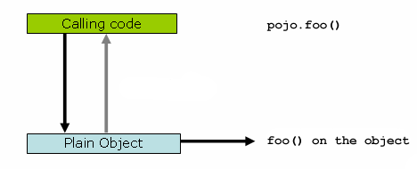
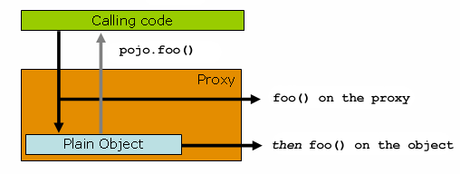

## AOP

面向切面编程(AOP)通过提供另一种考虑程序结构的方法来补充面向对象编程(OOP)。OOP中模块性的关键单元是类，而AOP中模块性的单元是切面。切面支持跨多个类型和对象的关注点的模块化(例如事务管理)。(在AOP文献中，这样的关注点通常被称为“横切”关注点。)

Spring的一个关键组件是AOP框架。虽然Spring IoC容器不依赖AOP(这意味着如果您不想使用AOP，就不需要使用AOP)，但是AOP补充了Spring IoC，提供了一个非常有用的中间件解决方案。

1. AOP概念

    核心AOP概念和术语

    * Aspect: 跨多个类的关注点的模块化。事务管理是企业Java应用程序中横切关注点的一个很好的例子。在Spring AOP中，切面是通过使用正则类(基于模式的方法)或使用@Aspect注释的正则类(@AspectJ样式)来实现的。

    * Join point: 程序执行过程中的一个点，如方法的执行或异常的处理。在Spring AOP中，连接点总是表示方法执行。

    * Advice: 切面在特定连接点上采取的操作。不同类型的建议包括“around”、“before”及“after”建议。(稍后将讨论通知类型。)许多AOP框架(包括Spring)将通知建模为拦截器，并围绕连接点维护一系列拦截器。

    * Pointcut: 匹配连接点的谓词。通知与切入点表达式相关联，并在切入点匹配的任何连接点上运行(例如，执行具有特定名称的方法)。**连接点与切入点表达式匹配的概念是AOP的核心**，Spring默认使用AspectJ切入点表达式语言。

    * Introduction: 代表类型声明其他方法或字段。Spring AOP允许您向任何被建议的对象引入新的接口(以及相应的实现)。例如，可以使用介绍使bean实现IsModified接口，以简化缓存。(在AspectJ社区中，介绍称为类型间声明。)

    * Target object: 被一个或多个切面建议的对象。也称为“被通知对象”。由于Spring AOP是通过使用运行时代理实现的，所以这个对象总是一个**代理对象**。

    * AOP proxy: AOP框架创建的一个对象，用于实现切面契约(建议方法执行等等)。在Spring框架中，**AOP代理是JDK动态代理或CGLIB代理**。

    * Weaving: 将切面与其他应用程序类型或对象链接，以创建建议的对象。这可以在编译时(例如，使用AspectJ编译器)、加载时或运行时完成。与其他纯Java AOP框架一样，Spring AOP在运行时执行编织。

    Spring AOP包含以下类型的advice

    * Before advice: 在连接点之前运行但不能阻止执行流继续到连接点的通知(除非抛出异常)。

    * After returning advice: 建议在连接点正常完成后运行(例如，如果方法返回时没有抛出异常)。

    * After throwing advice: 如果方法通过抛出异常退出，则要执行的通知。

    * After (finally) advice: 执行通知，无论连接点以何种方式退出(正常或异常返回)。

    * Around advice: **围绕连接点(如方法调用)的通知。这是最有力的建议**。Around通知可以在方法调用前后执行自定义行为。它还负责选择是继续到连接点，还是通过返回它自己的返回值或抛出异常来简化建议的方法执行。

2. Spring AOP的功能和目标

    Spring AOP是用纯Java实现的。不需要特殊的编译过程。Spring AOP不需要控制类加载器层次结构，因此适合在servlet容器或应用程序服务器中使用。
    
    Spring AOP目前只支持方法执行连接点(建议在Spring bean上执行方法)。没有实现字段拦截，但是可以在不破坏核心Spring AOP api的情况下添加对字段拦截的支持。如果需要建议字段访问和更新连接点，请考虑AspectJ之类的语言。
    
    Spring AOP的AOP方法与大多数其他AOP框架不同。其目的不是提供最完整的AOP实现(尽管Spring AOP非常有能力)。相反，其目标是提供AOP实现和Spring IoC之间的紧密集成，以帮助解决企业应用程序中的常见问题。

3. AOP代理

    Spring AOP默认为AOP代理使用标准JDK动态代理。这允许代理任何接口(或一组接口)。

    Spring AOP还可以使用CGLIB代理。这对于代理类而不是接口是必要的。默认情况下，如果业务对象没有实现接口，则使用CGLIB。由于编程到接口而不是类是一种很好的实践，业务类通常实现一个或多个业务接口。

    JDK动态代理是代理模式的一种实现方式，其只能代理接口。

    1. 使用步骤
        1. 新建一个接口
        2. 为接口创建一个实现类
        3. 创建代理类实现java.lang.reflect.InvocationHandler接口
        4. 测试

    2. Demo代码

        新建接口

        ```java
        public interface Subject {

            void doSomething();
        }
        ```

        接口实现类

        ```java
        public class RealSubject implements Subject {
            @Override
            public void doSomething() {
                System.out.println("RealSubject do something");
            }
        }
        ```

        动态代理类

        ```java
        public class JDKDynamicProxy implements InvocationHandler {

            private Object target;

            public JDKDynamicProxy(Object target) {
                this.target = target;
            }

            /**
            * 获取被代理接口实例对象
            * @param <T>
            * @return
            */
            public <T> T getProxy() {
                return (T) Proxy.newProxyInstance(target.getClass().getClassLoader(), target.getClass().getInterfaces(), this);
            }

            @Override
            public Object invoke(Object proxy, Method method, Object[] args) throws Throwable {
                System.out.println("Do something before");
                Object result = method.invoke(target, args);
                System.out.println("Do something after");
                return result;
            }
        }
        ```

        测试类

        ```java
        public class Client {
            public static void main(String[] args) {
                // jdk动态代理测试
                Subject subject = new JDKDynamicProxy(new RealSubject()).getProxy();
                subject.doSomething();
            }
        }
        ```

        测试结果

        ```
        Do something before
        RealSubject do something
        Do something after
        ```

4. @AspectJ support

    @AspectJ指的是将切面声明为使用注解注释的常规Java类的样式。

    @AspectJ样式是AspectJ项目作为AspectJ 5发行版的一部分引入的。

    Spring使用AspectJ提供的用于切入点解析和匹配的库解释与AspectJ 5相同的注释。但是AOP运行时仍然是纯Spring AOP，并且不依赖于AspectJ编译器或编织器。

    1. 开启@AspectJ支持

        要在Spring配置中使用@AspectJ切面，您需要启用Spring支持来基于@AspectJ切面配置Spring AOP，以及基于这些切面是否建议自动代理bean。
        
        通过自动代理，我们的意思是，如果Spring确定一个bean被一个或多个切面通知，它将自动为该bean生成一个代理来拦截方法调用，并确保根据需要执行通知。

        可以通过XML或java风格的配置启用@AspectJ支持。在这两种情况下，还需要确保AspectJ的aspectjweaver.jar库位于应用程序的类路径上(版本1.8或更高)。这个库可以在AspectJ发行版的lib目录中使用，也可以从Maven中央存储库中使用。

        ```java
        @Configuration
        @EnableAspectJAutoProxy
        public class AppConfig {

        }
        ```

        或者xml方式

        ```xml
        <aop:aspectj-autoproxy/>
        ```

    2. 声明一个Aspect(切面)

        启用@AspectJ支持后，在应用程序上下文中使用@AspectJ切面(具有@Aspect注释)类定义的任何bean都会被Spring自动检测到，并用于配置Spring AOP。接下来的两个例子展示了一个不太有用的切面所需要的最小定义。

        ```xml
        <bean id="myAspect" class="org.xyz.NotVeryUsefulAspect">
            <!-- configure properties of the aspect here -->
        </bean>
        ```

        ```java
        package org.xyz;
        import org.aspectj.lang.annotation.Aspect;

        @Aspect
        public class NotVeryUsefulAspect {

        }
        ```

    3. 声明一个PointCut(切入点)

        切入点确定感兴趣的连接点，从而使我们能够控制何时执行通知。
        
        Spring AOP只支持Spring bean的方法执行连接点，所以您可以将切入点看作是匹配Spring bean上方法的执行。
        
        切入点声明由两部分组成:

        * 一个签名包含名称和任何参数，在AOP的@AspectJ注释风格中，切入点签名由一个正则方法定义提供
        * 一个切入点表达式，该表达式确定我们对哪个方法执行感兴趣。，切入点表达式由@Pointcut注释表示(作为切入点签名的方法必须有一个void返回类型)。

        ```java
        @Pointcut("execution(* transfer(..))")// the pointcut expression
        private void anyOldTransfer() {}// the pointcut signature
        ```

        1. 支持切入点指示器

            Spring AOP支持在切入点表达式中使用的以下AspectJ切入点设计器(PCD)

            * execution: 用于**匹配方法**执行的连接点。这是使用Spring AOP时要使用的主要切入点设计器。

            * within: 用于**匹配指定类型**内的方法执行。

            * this: 用于**匹配当前AOP代理对象类型的执行方法**；注意是AOP代理对象的类型匹配，这样就可能包括引入接口也类型匹配

            * target: 用于**匹配当前目标对象类型的执行方法**；注意是目标对象的类型匹配，这样就不包括引入接口也类型匹配

            * args: 用于**匹配当前执行的方法传入的参数为指定类型**的执行方法。

            * @target: 用于匹配当前目标对象类型的执行方法，其中目标对象持有指定的注解

            * @args: 用于匹配当前执行的方法传入的参数持有指定注解的执行

            * @within: 用于匹配所以持有指定注解类型内的方法

            * @annotation: 用于匹配当前执行方法持有指定注解的方法

            * bean：Spring AOP扩展的，AspectJ没有对应指示符，用于匹配特定名称的Bean对象的执行方法；

            * reference pointcut：表示引用其他命名切入点，只有@ApectJ风格支持，Schema风格不支持。

        2. 结合切入点表达式

            可以使用&&、||和!组合切入点表达式。您还可以通过名称引用切入点表达式。下面的例子展示了三个切入点表达式

            ```java
            @Pointcut("execution(public * *(..))")
            private void anyPublicOperation() {} 

            @Pointcut("within(com.xyz.someapp.trading..*)")
            private void inTrading() {} 

            @Pointcut("anyPublicOperation() && inTrading()")
            private void tradingOperation() {} 
            ```

            上面三个切入表达式解释如下：
            
            1. 如果方法执行连接点表示任何公共方法的执行，则anyPublicOperation匹配。
            2. 如果方法执行在trading模块中，则inTrading匹配。
            3. 如果方法执行表示trading模块中的任何公共方法，则tradingOperation匹配。

        3. 共享公共切入点定义

            在处理企业应用程序时，开发人员通常希望从几个切面引用应用程序的模块和特定的操作集。我们建议定义一个“系统体系结构”切面，它捕获用于此目的的公共切入点表达式。这样一个切面通常类似于下面的例子:

            ```java
            package com.xyz.someapp;

            import org.aspectj.lang.annotation.Aspect;
            import org.aspectj.lang.annotation.Pointcut;

            @Aspect
            public class SystemArchitecture {

                /**
                * A join point is in the web layer if the method is defined
                * in a type in the com.xyz.someapp.web package or any sub-package
                * under that.
                */
                @Pointcut("within(com.xyz.someapp.web..*)")
                public void inWebLayer() {}

                /**
                * A join point is in the service layer if the method is defined
                * in a type in the com.xyz.someapp.service package or any sub-package
                * under that.
                */
                @Pointcut("within(com.xyz.someapp.service..*)")
                public void inServiceLayer() {}

                /**
                * A join point is in the data access layer if the method is defined
                * in a type in the com.xyz.someapp.dao package or any sub-package
                * under that.
                */
                @Pointcut("within(com.xyz.someapp.dao..*)")
                public void inDataAccessLayer() {}

                /**
                * A business service is the execution of any method defined on a service
                * interface. This definition assumes that interfaces are placed in the
                * "service" package, and that implementation types are in sub-packages.
                *
                * If you group service interfaces by functional area (for example,
                * in packages com.xyz.someapp.abc.service and com.xyz.someapp.def.service) then
                * the pointcut expression "execution(* com.xyz.someapp..service.*.*(..))"
                * could be used instead.
                *
                * Alternatively, you can write the expression using the 'bean'
                * PCD, like so "bean(*Service)". (This assumes that you have
                * named your Spring service beans in a consistent fashion.)
                */
                @Pointcut("execution(* com.xyz.someapp..service.*.*(..))")
                public void businessService() {}

                /**
                * A data access operation is the execution of any method defined on a
                * dao interface. This definition assumes that interfaces are placed in the
                * "dao" package, and that implementation types are in sub-packages.
                */
                @Pointcut("execution(* com.xyz.someapp.dao.*.*(..))")
                public void dataAccessOperation() {}

            }
            ```

            您可以在任何需要切入点表达式的地方引用在这样一个切面中定义的切入点。例如，要使服务层具有事务性，可以编写以下代码:

            ```xml
            <aop:config>
                <aop:advisor
                    pointcut="com.xyz.someapp.SystemArchitecture.businessService()"
                    advice-ref="tx-advice"/>
            </aop:config>

            <tx:advice id="tx-advice">
                <tx:attributes>
                    <tx:method name="*" propagation="REQUIRED"/>
                </tx:attributes>
            </tx:advice>
            ```

        4. 例子

            Spring AOP用户可能最经常使用执行切入点指示器。执行表达式的格式如下:

            ```
            execution(modifiers-pattern? ret-type-pattern declaring-type-pattern?name-pattern(param-pattern)
            throws-pattern?)
            ```

            一些常用表达式的整理

            表达式|解释
            --|--
            execution(public * *(..))|任何公共方法
            execution(* set*(..))|任何以set开头的方法
            execution(* com.xyz.service.AccountService.*(..))|AccountService接口定义的任何方法
            execution(* com.xyz.service.*.*(..))|service包下的任何方法
            execution(* com.xyz.service..*.*(..))|service包及子包的任何方法
            within(com.xyz.service.*)|service包中的任何连接点(仅在Spring AOP中执行方法)
            within(com.xyz.service..*)|service包及子包中的任何连接点(仅在Spring AOP中执行方法)
            this(com.xyz.service.AccountService)|代理实现AccountService接口的任何连接点(仅在Spring AOP中执行方法)
            target(com.xyz.service.AccountService)|目标对象实现AccountService接口的任何连接点(仅在Spring AOP中执行方法)
            args(java.io.Serializable)|任何连接点(只在Spring AOP中执行方法)，它只接受一个参数，并且在运行时传递的参数是可序列化的
            @target(org.springframework.transaction.annotation.Transactional)|目标对象具有@Transactional注释的任何连接点(仅在Spring AOP中执行方法)
            @within(org.springframework.transaction.annotation.Transactional)|目标对象的声明类型具有@Transactional注释的任何连接点(仅在Spring AOP中执行方法)
            @annotation(org.springframework.transaction.annotation.Transactional)|任何连接点(只在Spring AOP中执行方法)，其中执行方法具有@Transactional注释
            @args(com.xyz.security.Classified)|任何接受单个参数的连接点(仅在Spring AOP中执行方法)，其中传递的参数的运行时类型有@classification注释
            bean(tradeService)|在名为tradeService的Spring bean上的任何连接点(仅在Spring AOP中执行方法)
            bean(\*Service)|在名称匹配通配符表达式*Service的Spring bean上的任何连接点(仅在Spring AOP中执行方法)

        5. 编写好的切入点

            AspectJ只能处理它被告知的内容。为了获得最佳匹配性能，您应该考虑他们试图实现什么，并在定义中尽可能缩小匹配的搜索空间。现有的设计器自然可以分为三组:kinded、scoping和context:
            
            * Kinded设计器选择特定类型的连接点:执行、获取、设置、调用和处理程序。
            * scoping设计器选择一组感兴趣的连接点(可能有很多种):内部和内部代码
            * context指示符根据上下文匹配(可选绑定):this、target和@annotation

    4. 声明Advice(通知)

        通知与切入点表达式相关联，并在切入点匹配的方法执行之前、之后或前后运行。切入点表达式可以是对指定切入点的简单引用，也可以是在适当位置声明的切入点表达式。

        * Before Advice

            ```java
            import org.aspectj.lang.annotation.Aspect;
            import org.aspectj.lang.annotation.Before;

            @Aspect
            public class BeforeExample {

                @Before("com.xyz.myapp.SystemArchitecture.dataAccessOperation()")
                public void doAccessCheck() {
                    // ...
                }

            }
            ```

            如果我们使用一个就地切入点表达式，我们可以将前面的例子重写为下面的例子:

            ```java
            import org.aspectj.lang.annotation.Aspect;
            import org.aspectj.lang.annotation.Before;

            @Aspect
            public class BeforeExample {

                @Before("execution(* com.xyz.myapp.dao.*.*(..))")
                public void doAccessCheck() {
                    // ...
                }

            }
            ``` 

        * After Returning Advice

            返回后，当匹配的方法执行正常返回时，将运行通知。

            ```java
            import org.aspectj.lang.annotation.Aspect;
            import org.aspectj.lang.annotation.AfterReturning;

            @Aspect
            public class AfterReturningExample {

                @AfterReturning("com.xyz.myapp.SystemArchitecture.dataAccessOperation()")
                public void doAccessCheck() {
                    // ...
                }

            }
            ```

            有时候，您需要在advice主体中访问返回的实际值。您可以使用@ afterreturn的形式绑定返回值来获得访问权限

            ```java
            import org.aspectj.lang.annotation.Aspect;
            import org.aspectj.lang.annotation.AfterReturning;

            @Aspect
            public class AfterReturningExample {

                @AfterReturning(
                    pointcut="com.xyz.myapp.SystemArchitecture.dataAccessOperation()",
                    returning="retVal")
                public void doAccessCheck(Object retVal) {
                    // ...
                }

            }
            ```

        * After Throwing Advice

            抛出通知后，当匹配的方法执行通过抛出异常退出时运行。

            ```java
            import org.aspectj.lang.annotation.Aspect;
            import org.aspectj.lang.annotation.AfterThrowing;

            @Aspect
            public class AfterThrowingExample {

                @AfterThrowing("com.xyz.myapp.SystemArchitecture.dataAccessOperation()")
                public void doRecoveryActions() {
                    // ...
                }

            }
            ```

            通常，您希望仅在抛出给定类型的异常时才运行通知，并且常常需要在通知主体中访问抛出的异常。您可以使用throw属性来限制匹配(如果需要的话—否则使用Throwable作为异常类型)，并将抛出的异常绑定到advice参数。

            ```java
            import org.aspectj.lang.annotation.Aspect;
            import org.aspectj.lang.annotation.AfterThrowing;

            @Aspect
            public class AfterThrowingExample {

                @AfterThrowing(
                    pointcut="com.xyz.myapp.SystemArchitecture.dataAccessOperation()",
                    throwing="ex")
                public void doRecoveryActions(DataAccessException ex) {
                    // ...
                }

            }
            ```

        * After (Finally) Advice

            当匹配的方法执行退出时，运行After (finally)通知。它是通过使用@After注释声明的。事后通知必须准备好处理正常和异常返回条件。它通常用于释放资源和类似的目的。

            ```java
            import org.aspectj.lang.annotation.Aspect;
            import org.aspectj.lang.annotation.After;

            @Aspect
            public class AfterFinallyExample {

                @After("com.xyz.myapp.SystemArchitecture.dataAccessOperation()")
                public void doReleaseLock() {
                    // ...
                }

            }
            ```

        * Around Advice

            最后一种建议是围绕建议。Around通知“绕过”匹配方法的执行。它有机会在方法执行之前和之后执行工作，并确定何时、如何执行，甚至是否真正执行方法。如果您需要以线程安全的方式(例如，启动和停止计时器)共享方法执行前后的状态，通常会使用Around建议。

            ```java
            import org.aspectj.lang.annotation.Aspect;
            import org.aspectj.lang.annotation.Around;
            import org.aspectj.lang.ProceedingJoinPoint;

            @Aspect
            public class AroundExample {

                @Around("com.xyz.myapp.SystemArchitecture.businessService()")
                public Object doBasicProfiling(ProceedingJoinPoint pjp) throws Throwable {
                    // start stopwatch
                    Object retVal = pjp.proceed();
                    // stop stopwatch
                    return retVal;
                }

            }
            ```
        
        * Advice Parameters

            Spring提供了全类型的通知，这意味着您可以在通知签名中声明所需的参数(正如我们前面看到的用于返回和抛出示例的参数)，而不是一直使用Object[]数组。

            * 访问当前连接点

                任何advice方法都可以将org.aspectj.lang.JoinPoint类型的参数声明为它的第一个参数。JoinPoint接口提供了许多有用的方法:

                * getArgs():返回方法参数。
                * getThis():返回代理对象。
                * getTarget():返回目标对象。
                * getSignature():返回被建议的方法的描述。
                * toString():打印建议的方法的有用描述。

            * 将参数传递给通知

                我们已经看到了如何绑定返回值或异常值(在返回和抛出建议之后使用)。要使参数值对通知主体可用，可以使用args的绑定形式。如果在args表达式中使用参数名代替类型名，则在调用通知时将传递相应参数的值作为参数值。

                ```java
                @Before("com.xyz.myapp.SystemArchitecture.dataAccessOperation() && args(account,..)")
                public void validateAccount(Account account) {
                    // ...
                }
                ```

            * 通知参数和泛型

                ```java
                public interface Sample<T> {
                    void sampleGenericMethod(T param);
                    void sampleGenericCollectionMethod(Collection<T> param);
                }
                ```

                您可以通过将advice参数键入要拦截方法的参数类型，将方法类型的拦截限制为某些参数类型

                ```java
                @Before("execution(* ..Sample+.sampleGenericMethod(*)) && args(param)")
                public void beforeSampleMethod(MyType param) {
                    // Advice implementation
                }
                ```

            * 确定参数的名字

                如果用户显式指定了参数名，则使用指定的参数名。通知和切入点注释都有一个可选的argNames属性，您可以使用该属性指定带注释的方法的参数名。这些参数名在运行时可用。

                ```java
                @Before(value="com.xyz.lib.Pointcuts.anyPublicMethod() && target(bean) && @annotation(auditable)",argNames="bean,auditable")
                public void audit(Object bean, Auditable auditable) {
                    AuditCode code = auditable.value();
                    // ... use code and bean
                }
                ```

        * Advice Ordering

            当多个通知都想在同一个连接点上运行时会发生什么?Spring AOP遵循与AspectJ相同的优先规则来确定通知执行的顺序。
            优先级最高的通知将首先“on The way in”运行(因此，给定两个before通知，优先级最高的通知将首先运行)。
            从连接点“退出”时，优先级最高的通知将最后运行(因此，给定两个after通知，优先级最高的通知将运行在第二位)。

    5. 介绍

        引入(AspectJ中称为类型间声明)使切面能够声明被通知对象实现给定接口，并代表这些对象提供该接口的实现。

        您可以使用@DeclareParents注释进行介绍。此注释用于声明匹配类型具有新的父类(因此名称)。例如，给定一个名为UsageTracked的接口和一个名为DefaultUsageTracked接口的实现，下面的切面声明所有服务接口的实实者也实现了UsageTracked接口(例如通过JMX公开统计数据):

        ```java
        @Aspect
        public class UsageTracking {

            @DeclareParents(value="com.xzy.myapp.service.*+", defaultImpl=DefaultUsageTracked.class)
            public static UsageTracked mixin;

            @Before("com.xyz.myapp.SystemArchitecture.businessService() && this(usageTracked)")
            public void recordUsage(UsageTracked usageTracked) {
                usageTracked.incrementUseCount();
            }

        }
        ```

        要实现的接口由带注释字段的类型决定。@DeclareParents注释的value属性是一个AspectJ类型模式。任何匹配类型的bean都实现UsageTracked接口。注意，在前面示例的before建议中，服务bean可以直接用作UsageTracked接口的实现。如果以编程方式访问bean，您将编写以下代码:

        ```java
        UsageTracked usageTracked = (UsageTracked) context.getBean("myService");
        ```

    6. 实例化模型切面

        默认情况下，应用程序上下文中每个切面都有一个实例。AspectJ将其称为单例实例化模型。可以定义具有交替生命周期的切面。Spring支持AspectJ的perthis和pertarget实例化模型(目前不支持percflow、percflowbelow和pertypewithin)。
        
        您可以通过在@Aspect注释中指定perthis子句来声明perthis切面。考虑下面的例子:

        ```java
        @Aspect("perthis(com.xyz.myapp.SystemArchitecture.businessService())")
        public class MyAspect {

            private int someState;

            @Before(com.xyz.myapp.SystemArchitecture.businessService())
            public void recordServiceUsage() {
                // ...
            }

        }
        ```

        在前面的示例中，“perthis”子句的作用是为每个执行业务服务的惟一服务对象创建一个切面实例(每个惟一对象在切入点表达式匹配的连接点上绑定到“this”)。aspect实例是第一次在服务对象上调用方法时创建的。当服务对象超出范围时，切面将超出范围。在切面实例创建之前，它内的任何通知都不会执行。一旦切面实例创建好，在其中声明的通知就会在匹配的连接点上执行，但是只有当服务对象是与这个切面相关联的对象时才会执行。有关per子句的更多信息，请参阅AspectJ编程指南。

    7. AOP例子

        现在您已经了解了所有组成部分的工作原理，我们可以将它们放在一起来做一些有用的事情。

        由于并发性问题(例如死锁失败者)，业务服务的执行有时会失败。如果操作被重试，它很可能在下一次尝试中成功。对于适合在这种情况下重试的业务服务(不需要返回用户以解决冲突的幂等操作)，我们希望透明地重试操作，以避免客户端看到一个悲观的lockingfailureexception异常。这是一个明显跨越服务层中的多个服务的需求，因此非常适合通过切面实现。

        因为我们想重试操作，所以我们需要使用around通知，以便我们可以多次调用proceed。下面的清单显示了基本的切面实现:

        ```java
        @Aspect
        public class ConcurrentOperationExecutor implements Ordered {

            private static final int DEFAULT_MAX_RETRIES = 2;

            private int maxRetries = DEFAULT_MAX_RETRIES;
            private int order = 1;

            public void setMaxRetries(int maxRetries) {
                this.maxRetries = maxRetries;
            }

            public int getOrder() {
                return this.order;
            }

            public void setOrder(int order) {
                this.order = order;
            }

            @Around("com.xyz.myapp.SystemArchitecture.businessService()")
            public Object doConcurrentOperation(ProceedingJoinPoint pjp) throws Throwable {
                int numAttempts = 0;
                PessimisticLockingFailureException lockFailureException;
                do {
                    numAttempts++;
                    try {
                        return pjp.proceed();
                    }
                    catch(PessimisticLockingFailureException ex) {
                        lockFailureException = ex;
                    }
                } while(numAttempts <= this.maxRetries);
                throw lockFailureException;
            }

        }
        ```

        请注意，切面实现了有序接口，因此我们可以将切面的优先级设置得高于事务通知(每次重试时，我们都希望有一个新的事务)。maxretry和order属性都是由Spring配置的。主要操作发生在围绕通知的doConcurrentOperation中。*注意，目前，我们将重试逻辑应用于每个businessService()。我们试着继续，如果我们失败了并抛出一个悲观的lockingfailureexception，我们会再试一次，除非我们已经用尽了所有的重试尝试。*

        对应的配置如下:

        ```xml
        <aop:aspectj-autoproxy/>

        <bean id="concurrentOperationExecutor" class="com.xyz.myapp.service.impl.ConcurrentOperationExecutor">
            <property name="maxRetries" value="3"/>
            <property name="order" value="100"/>
        </bean>
        ```

5. 基于Schema的AOP支持

    如果您喜欢基于xml的格式，Spring还提供了使用新的aop名称空间标记定义切面的支持。支持与使用@AspectJ样式时完全相同的切入点表达式和通知类型。

    1. 声明一个Aspect(切面)

        当您使用模式支持时，切面是定义为Spring应用程序上下文中bean的常规Java对象。状态和行为在对象的字段和方法中捕获，切入点和建议信息在XML中捕获。

        您可以使用\<aop:aspect>元素声明一个切面，并使用ref属性引用支持bean，如下面的示例所示:

        ```xml
        <aop:config>
            <aop:aspect id="myAspect" ref="aBean">
                ...
            </aop:aspect>
        </aop:config>

        <bean id="aBean" class="...">
            ...
        </bean>
        ```

    2. 声明一个PointCut(切入点)

        您可以在\<aop:config>元素中声明一个命名的切入点，让切入点定义在多个切面和建议者之间共享。
        
        表示服务层中任何业务服务执行的切入点可以定义为:

        ```xml
        <aop:config>

            <aop:pointcut id="businessService"
                expression="execution(* com.xyz.myapp.service.*.*(..))"/>

        </aop:config>
        ```

    3. 声明Advice(通知)
    
        基于模式的AOP支持使用与@AspectJ样式相同的五种通知，而且它们具有完全相同的语义。

        * Before Advice

            在匹配的方法执行之前运行通知。通过<aop:aspect>中的<aop:before>声明，如下面的例子所示:

            ```xml
            <aop:aspect id="beforeExample" ref="aBean">

                <aop:before
                    pointcut-ref="dataAccessOperation"
                    method="doAccessCheck"/>

                ...

            </aop:aspect>
            ```

        * After Returning Advice

            返回通知后，当匹配的方法执行正常完成时运行。通过<aop:aspect>中的<aop:after-returning>声明，如下面的例子所示:

            ```xml
            <aop:aspect id="afterReturningExample" ref="aBean">

                <aop:after-returning
                    pointcut-ref="dataAccessOperation"
                    method="doAccessCheck"/>

                ...

            </aop:aspect>
            ```

        * After Throwing Advice

            抛出通知后，当匹配的方法通过抛出异常退出执行时执行。通过<aop:aspect>中的<aop:after-throwing>声明，如下面的例子所示:

            ```xml
            <aop:aspect id="afterThrowingExample" ref="aBean">

                <aop:after-throwing
                    pointcut-ref="dataAccessOperation"
                    method="doRecoveryActions"/>

                ...

            </aop:aspect>
            ```

        * After (Finally) Advice

            无论匹配的方法执行如何退出，都会运行After (finally)通知。

            ```xml
            <aop:aspect id="afterFinallyExample" ref="aBean">

                <aop:after
                    pointcut-ref="dataAccessOperation"
                    method="doReleaseLock"/>

                ...

            </aop:aspect>
            ```

        * Around Advice

            最后一种建议是围绕建议。Around通知“围绕”匹配的方法执行。它有机会在方法执行之前和之后执行工作，并确定何时、如何执行，甚至是否真正执行方法。

            ```xml
            <aop:aspect id="aroundExample" ref="aBean">

                <aop:around
                    pointcut-ref="businessService"
                    method="doBasicProfiling"/>

                ...

            </aop:aspect>
            ```

    4. 介绍

        引入(AspectJ中称为类型间声明)使切面能够声明被通知对象实现给定接口，并代表这些对象提供该接口的实现。

        您可以使用@DeclareParents注释进行介绍。此注释用于声明匹配类型具有新的父类(因此名称)。例如，给定一个名为UsageTracked的接口和一个名为DefaultUsageTracked接口的实现，下面的切面声明所有服务接口的实实者也实现了UsageTracked接口(例如通过JMX公开统计数据):

        ```xml
        <aop:aspect id="usageTrackerAspect" ref="usageTracking">

            <aop:declare-parents
                types-matching="com.xzy.myapp.service.*+"
                implement-interface="com.xyz.myapp.service.tracking.UsageTracked"
                default-impl="com.xyz.myapp.service.tracking.DefaultUsageTracked"/>

            <aop:before
                pointcut="com.xyz.myapp.SystemArchitecture.businessService()
                    and this(usageTracked)"
                    method="recordUsage"/>

        </aop:aspect>
        ```

    5. 实例化模型切面

        对于模式定义的切面，惟一受支持的实例化模型是单例模型。在将来的版本中可能会支持其他实例化模型。

    6. Advisors

        “Advisors”的概念来自于Spring中定义的AOP支持，在AspectJ中没有直接的对等项。advisor就像一个包含一条建议的小型自包含切面。通知本身由bean表示，并且必须在Spring中实现通知类型中描述的通知接口之一。Advisors可以利用AspectJ切入点表达式。

        Spring通过\<aop:advisor>元素支持advisor概念。您最常看到它与事务通知一起使用，而事务通知在Spring中也有自己的名称空间支持。下面的例子显示了一个advisor工具:

        ```xml
        <aop:config>

            <aop:pointcut id="businessService"
                expression="execution(* com.xyz.myapp.service.*.*(..))"/>

            <aop:advisor
                pointcut-ref="businessService"
                advice-ref="tx-advice"/>

        </aop:config>

        <tx:advice id="tx-advice">
            <tx:attributes>
                <tx:method name="*" propagation="REQUIRED"/>
            </tx:attributes>
        </tx:advice>
        ```

        除了前面示例中使用的pointcut-ref属性外，还可以使用切入点属性内联定义切入点表达式。
        若要定义advisor的优先级以便通知可以参与排序，请使用order属性定义advisor的有序值。

    7. AOP Schema样例

        本节展示了用模式支持重写AOP示例中的并发锁定失败重试示例时的样子。

        由于并发性问题(例如死锁失败者)，业务服务的执行有时会失败。如果操作被重试，它很可能在下一次尝试中成功。对于适合在这种情况下重试的业务服务(不需要返回用户以解决冲突的幂等操作)，我们希望透明地重试操作，以避免客户端看到一个悲观的lockingfailureexception异常。这是一个明显跨越服务层中的多个服务的需求，因此非常适合通过切面实现。

        因为我们想重试操作，所以我们需要使用around通知，以便我们可以多次调用proceed。下面的清单显示了基本切面实现(这是一个使用模式支持的常规Java类):

        ```java
        public class ConcurrentOperationExecutor implements Ordered {

            private static final int DEFAULT_MAX_RETRIES = 2;

            private int maxRetries = DEFAULT_MAX_RETRIES;
            private int order = 1;

            public void setMaxRetries(int maxRetries) {
                this.maxRetries = maxRetries;
            }

            public int getOrder() {
                return this.order;
            }

            public void setOrder(int order) {
                this.order = order;
            }

            public Object doConcurrentOperation(ProceedingJoinPoint pjp) throws Throwable {
                int numAttempts = 0;
                PessimisticLockingFailureException lockFailureException;
                do {
                    numAttempts++;
                    try {
                        return pjp.proceed();
                    }
                    catch(PessimisticLockingFailureException ex) {
                        lockFailureException = ex;
                    }
                } while(numAttempts <= this.maxRetries);
                throw lockFailureException;
            }

        }
        ```

        对应xml配置

        ```xml
        <aop:config>

            <aop:aspect id="concurrentOperationRetry" ref="concurrentOperationExecutor">

                <aop:pointcut id="idempotentOperation"
                    expression="execution(* com.xyz.myapp.service.*.*(..))"/>

                <aop:around
                    pointcut-ref="idempotentOperation"
                    method="doConcurrentOperation"/>

            </aop:aspect>

        </aop:config>

        <bean id="concurrentOperationExecutor"
            class="com.xyz.myapp.service.impl.ConcurrentOperationExecutor">
                <property name="maxRetries" value="3"/>
                <property name="order" value="100"/>
        </bean>
        ```


6. 选择要使用哪种AOP声明样式

    一旦确定了切面是实现给定需求的最佳方法，那么如何决定是使用Spring AOP还是AspectJ，是使用切面语言(代码)样式、@AspectJ注释样式还是Spring XML样式呢?这些决策受到许多因素的影响，包括应用程序需求、开发工具和团队对AOP的熟悉程度。

    1. Spring AOP还是Full AspectJ?

        使用最简单的方法。Spring AOP比使用完整的AspectJ更简单，因为不需要在开发和构建过程中引入AspectJ编译器/编织器。

        * 如果您只需要建议在Spring bean上执行操作，那么Spring AOP是正确的选择。
        * 如果需要通知Spring容器不管理的对象(通常是域对象)，则需要使用AspectJ。
        * 如果希望建议连接点而不是简单的方法执行(例如，字段get或set连接点等等)，还需要使用AspectJ。

    2. 对于Spring AOP用@AspectJ还是的XML?

        如果您选择使用Spring AOP，您可以选择@AspectJ或XML样式。有各种各样的权衡需要考虑。

        现有Spring用户可能最熟悉XML样式，它由真正的pojo支持。当使用AOP作为配置企业服务的工具时，XML可能是一个很好的选择(一个好的测试是，您是否将切入点表达式视为您可能希望独立更改的配置的一部分)。
        
        * 使用XML样式优点

            1. 从配置中可以更清楚地看出系统中存在哪些切面。

        * 使用XML样式缺点

            1. 它没有将它所处理的需求的实现完全封装在一个地方。DRY原则认为，系统中的任何知识都应该有一个单一的、明确的、权威的表示。当使用XML样式时，关于如何实现需求的知识会在支持bean类的声明和配置文件中的XML之间进行分割。

            2. 与@AspectJ样式相比，XML样式在它能表达的内容上稍微有些限制:只支持“单例”切面实例化模型，并且不可能组合XML中声明的命名切入点。

7. 混合Aspect类型

    通过使用自动代理支持、模式定义的\<aop:aspect>切面、\<aop:advisor>声明的Advisor、甚至在相同配置中使用其他样式的代理和拦截器，完全可以混合使用@AspectJ样式切面。所有这些都是通过使用相同的底层支持机制实现的，并且可以毫无困难地共存。

8. 代理机制

    Spring AOP使用JDK动态代理或CGLIB为给定的目标对象创建代理。JDK动态代理构建在JDK中，而CGLIB是一个公共的开源类定义库(重新打包到spring-core中)。

    * 如果要代理的目标对象实现至少一个接口，则使用JDK动态代理。目标类型实现的所有接口都是代理的。如果目标对象没有实现任何接口，则创建一个CGLIB代理。

    * 如果您想强制使用CGLIB代理(例如，代理为目标对象定义的每个方法，而不仅仅是那些由其接口实现的方法)，您可以这样做。不过，你应该考虑以下问题:

        * 对于CGLIB，final方法不能被建议使用，因为在运行时生成的子类的方法不能被重写。
        * 从Spring 4.0开始，代理对象的构造函数不再被调用两次，因为CGLIB代理实例是通过Objenesis创建的。只有当JVM不允许构造函数绕过时，您才可能看到来自Spring AOP支持的双重调用和相应的调试日志条目。

    为了强制使用CGLIB代理，将\<aop:config>元素的proxy-target-class属性的值设置为true，如下所示:

        ```xml
        <aop:config proxy-target-class="true">
            <!-- other beans defined here... -->
        </aop:config>
        ```

    1. 理解AOP代理

        Spring AOP是基于代理的。在编写自己的切面或使用Spring框架提供的任何基于Spring aop的切面之前，掌握最后一条语句的语义是非常重要的。

        首先考虑这样一种场景:您有一个普通的、未代理的、没有任何特殊之处的、直接的对象引用，如下面的代码片段所示:

        ```java
        public class SimplePojo implements Pojo {

            public void foo() {
                // this next method invocation is a direct call on the 'this' reference
                this.bar();
            }

            public void bar() {
                // some logic...
            }
        }
        ```

        如果在对象引用上调用方法，则直接在该对象引用上调用方法，如下图和清单所示:

        

        当客户机代码的引用是代理时，情况会发生轻微的变化。考虑下面的图表和代码片段:

        

        ```java
        public class Main {

            public static void main(String[] args) {
                ProxyFactory factory = new ProxyFactory(new SimplePojo());
                factory.addInterface(Pojo.class);
                factory.addAdvice(new RetryAdvice());

                Pojo pojo = (Pojo) factory.getProxy();
                // this is a method call on the proxy!
                pojo.foo();
            }
        }
        ```
        
9. @AspectJ代理的编程创建

10. 在Spring应用程序中使用AspectJ

    1. Spring中使用AspectJ来依赖注入域对象

    2. AspectJ的其他Spring切面

    3. 使用Spring IoC配置AspectJ切面

    4. 在Spring框架中使用AspectJ进行加载时编织

11. 更多资料

参考：https://docs.spring.io/spring/docs/5.1.6.RELEASE/spring-framework-reference/core.html#aop
http://www.cnblogs.com/zuidongfeng/p/8735241.html
https://blog.csdn.net/qq_23167527/article/details/78623639