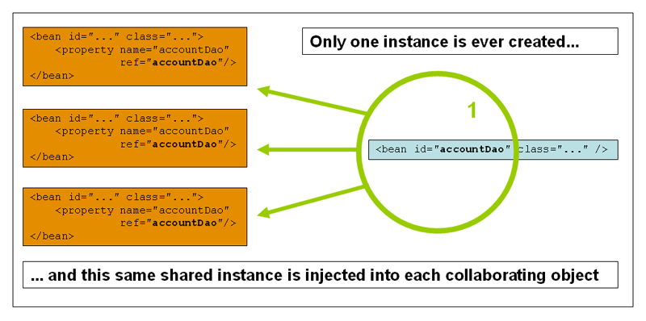
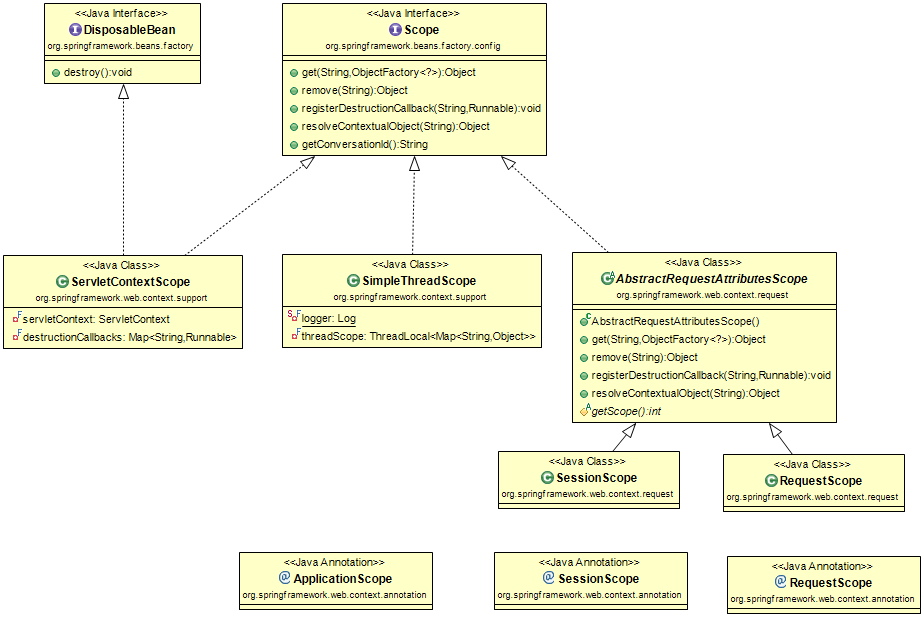

## Ioc容器

1. Spring Ioc容器和Bean介绍

    IoC也称为依赖注入(dependency injection, DI)。对象仅通过构造函数参数、工厂方法的参数或对象实例构造或从工厂方法返回后在该对象实例上设置的属性来定义它们的依赖关系(即与它们一起工作的其他对象)。
    
    容器在创建bean时注入这些依赖项。这个过程本质上与bean本身相反(因此称为控制反转)，bean本身通过直接构造类或一种机制(如服务定位器模式)来控制依赖项的实例化或位置。

    org.springframework.beans和org.springframework.context包是Spring框架Ioc容器的基础。

    在Spring中，构成应用程序主干并由Spring IoC容器管理的对象称为bean。bean是由Spring IoC容器实例化、组装和管理的对象。

2. 容器概述

    org.springframework.context.ApplicationContext接口表示Spring IoC容器，负责实例化、配置和组装bean。

    Srping提供了几种ApplicationContext的实现，在独立应用程序中，通常创建ClassPathXmlApplicationContext或FileSystemXmlApplicationContext的实例。

    在大多数应用程序场景中，不需要显式用户代码来实例化Spring IoC容器的一个或多个实例。

    下图显示了Spring如何工作的高级视图。

    

    1. 配置元数据

        配置元数据通常以简单直观的XML格式提供，本章的大部分内容都使用这种格式来传达Spring IoC容器的关键概念和特性。

        基于xml的配置元数据的基本结构:

        ```xml
        <?xml version="1.0" encoding="UTF-8"?>
        <beans xmlns="http://www.springframework.org/schema/beans"
            xmlns:xsi="http://www.w3.org/2001/XMLSchema-instance"
            xsi:schemaLocation="http://www.springframework.org/schema/beans
                https://www.springframework.org/schema/beans/spring-beans.xsd">

            <bean id="..." class="...">   
                <!-- collaborators and configuration for this bean go here -->
            </bean>

        </beans>
        ```

        1. id属性是标识单个bean定义的字符串。
        2. class属性定义bean的类型并使用完全限定的类名。

    2. 初始化容器

        提供给ApplicationContext容器的本地路径是资源字符串，允许容器从各种外部资源(如本地文件系统、Java类路径等)加载配置元数据。

        ```java
        ApplicationContext context = new ClassPathXmlApplicationContext("services.xml", "daos.xml");
        ```

        service.xml

        ```xml
        <?xml version="1.0" encoding="UTF-8"?>
        <beans xmlns="http://www.springframework.org/schema/beans"
            xmlns:xsi="http://www.w3.org/2001/XMLSchema-instance"
            xsi:schemaLocation="http://www.springframework.org/schema/beans
                https://www.springframework.org/schema/beans/spring-beans.xsd">

            <!-- services -->

            <bean id="petStore" class="org.springframework.samples.jpetstore.services.PetStoreServiceImpl">
                <property name="accountDao" ref="accountDao"/>
                <property name="itemDao" ref="itemDao"/>
                <!-- additional collaborators and configuration for this bean go here -->
            </bean>

            <!-- more bean definitions for services go here -->

        </beans>
        ```

        daos.xml

        ```xml
        <?xml version="1.0" encoding="UTF-8"?>
        <beans xmlns="http://www.springframework.org/schema/beans"
            xmlns:xsi="http://www.w3.org/2001/XMLSchema-instance"
            xsi:schemaLocation="http://www.springframework.org/schema/beans
                https://www.springframework.org/schema/beans/spring-beans.xsd">

            <bean id="accountDao"
                class="org.springframework.samples.jpetstore.dao.jpa.JpaAccountDao">
                <!-- additional collaborators and configuration for this bean go here -->
            </bean>

            <bean id="itemDao" class="org.springframework.samples.jpetstore.dao.jpa.JpaItemDao">
                <!-- additional collaborators and configuration for this bean go here -->
            </bean>

            <!-- more bean definitions for data access objects go here -->

        </beans>
        ```

        service.xml中PetStoreServiceImpl定义的两个属性accountDao，itemDao分别ref了daos.xml中的两个bean(id=accountDao和id=itemDao)，id和ref元素之间的这种链接表示协作对象之间的依赖关系。

        *组合基于xml的配置元数据*

        在一个xml中使用一个或多个\<import/>标签来引入其他的配置文件，其Resource属性指向配置文件路径

        ```xml
        <beans>
            <import resource="services.xml"/>
            <import resource="resources/messageSource.xml"/>
            <import resource="/resources/themeSource.xml"/>

            <bean id="bean1" class="..."/>
            <bean id="bean2" class="..."/>
        </beans>
        ```

    3. 使用容器

        ApplicationContext容器初始化后，可以通过getBean获取bean类，ApplicationContext有好几个getBean的方法，以T getBean(String name, Class<T> requiredType)为例

        ```java
        // create and configure beans
        ApplicationContext context = new ClassPathXmlApplicationContext("services.xml", "daos.xml");

        // retrieve configured instance
        PetStoreService service = context.getBean("petStore", PetStoreService.class);

        // use configured instance
        List<String> userList = service.getUsernameList();
        ```

3. Bean概述

    Spring IoC容器管理着一个或多个bean，在容器内部，这些bean定义被表示为BeanDefinition对象，其中包含(其他信息)以下元数据:

    属性|详情参考
    --|--
    Class|bean初始化
    Name|bean命名
    Scope|bean范围
    Constructor arguments|依赖注入
    Properties|依赖注入
    Autowiring mode|自动装配的合作者
    Lazy initialization mode|懒加载bean
    Initialization method|初始化回调
    Destruction method|销毁回调

    1. bean初始化

        1. 调用其构造函数直接创建bean

            ```xml
            <bean id="exampleBean" class="examples.ExampleBean"/>
            ```

        2. 通过静态工厂方法调用来创建bean

            ```xml
            <bean id="clientService" class="examples.ClientService" factory-method="createInstance"/>
            ```

            ```java
            public class ClientService {
                private static ClientService clientService = new ClientService();
                private ClientService() {}

                public static ClientService createInstance() {
                    return clientService;
                }
            }
            ```

        3. 使用实例工厂方法实例化

            ```xml
            <!-- the factory bean, which contains a method called createInstance() -->
            <bean id="serviceLocator" class="examples.DefaultServiceLocator">
                <!-- inject any dependencies required by this locator bean -->
            </bean>

            <!-- the bean to be created via the factory bean -->
            <bean id="clientService"
                factory-bean="serviceLocator"
                factory-method="createClientServiceInstance"/>
            ```

            ```java
            public class DefaultServiceLocator {

                private static ClientService clientService = new ClientServiceImpl();

                public ClientService createClientServiceInstance() {
                    return clientService;
                }
            }
            ```
    
    2. bean命名

        bean可以有一个或多个别名。

        1. 多个别名之间可以用逗号(,)，分号(;)，空格( ) 

            ```xml
            <bean name="alias1 alias2;alias3,alias4" id="hello1" class="x.y.Example">
            ```

        2. 用alias标签

            ```xml
            <bean name="exmaple" id="hello1" class="x.y.Example">
            <alias name="exmaple" alias="alias1"/>
            <alias name="exmaple" alias="alias1"/>
            ```


4. 依赖

    1. 依赖注入
        
        1. 基于构造器的依赖注入

            1. 使用<constructor-arg/\>标签

                ```java
                package x.y;

                public class ThingOne {

                    public ThingOne(ThingTwo thingTwo, ThingThree thingThree) {
                        // ...
                    }
                }
                ```

                ```xml
                <beans>
                    <bean id="beanOne" class="x.y.ThingOne">
                        <constructor-arg ref="beanTwo"/>
                        <constructor-arg ref="beanThree"/>
                    </bean>

                    <bean id="beanTwo" class="x.y.ThingTwo"/>

                    <bean id="beanThree" class="x.y.ThingThree"/>
                </beans>
                ```

            2. 构造函数参数类型匹配或构造函数参数索引

                ```java
                package examples;

                public class ExampleBean {

                    // Number of years to calculate the Ultimate Answer
                    private int years;

                    // The Answer to Life, the Universe, and Everything
                    private String ultimateAnswer;

                    public ExampleBean(int years, String ultimateAnswer) {
                        this.years = years;
                        this.ultimateAnswer = ultimateAnswer;
                    }
                }
                ```

                ```xml
                <bean id="exampleBean" class="examples.ExampleBean">
                    <constructor-arg type="int" value="7500000"/>
                    <constructor-arg type="java.lang.String" value="42"/>
                </bean>
                ```

                ```xml
                <bean id="exampleBean" class="examples.ExampleBean">
                    <constructor-arg index="0" value="7500000"/>
                    <constructor-arg index="1" value="42"/>
                </bean>
                ```

        2. Setter方式依赖注入

            ```java
            public class ExampleBean {

                private AnotherBean beanOne;

                private YetAnotherBean beanTwo;

                private int i;

                public void setBeanOne(AnotherBean beanOne) {
                    this.beanOne = beanOne;
                }

                public void setBeanTwo(YetAnotherBean beanTwo) {
                    this.beanTwo = beanTwo;
                }

                public void setIntegerProperty(int i) {
                    this.i = i;
                }
            }
            ```

            ```xml
            <bean id="exampleBean" class="examples.ExampleBean">
                <!-- constructor injection using the nested ref element -->
                <constructor-arg>
                    <ref bean="anotherExampleBean"/>
                </constructor-arg>

                <!-- constructor injection using the neater ref attribute -->
                <constructor-arg ref="yetAnotherBean"/>

                <constructor-arg type="int" value="1"/>
            </bean>

            <bean id="anotherExampleBean" class="examples.AnotherBean"/>
            <bean id="yetAnotherBean" class="examples.YetAnotherBean"/>
            ```


    2. 依赖及配置细节

        1. 直接值(原语、字符串等)

            ```xml
            <bean id="myDataSource" class="org.apache.commons.dbcp.BasicDataSource" destroy-method="close">
                <!-- results in a setDriverClassName(String) call -->
                <property name="driverClassName" value="com.mysql.jdbc.Driver"/>
                <property name="url" value="jdbc:mysql://localhost:3306/mydb"/>
                <property name="username" value="root"/>
                <property name="password" value="masterkaoli"/>
            </bean>
            ```

        2. 对其他bean的引用(协作者)

            ```xml
            <!-- in the parent context -->
            <bean id="accountService" class="com.something.SimpleAccountService">
                <!-- insert dependencies as required as here -->
            </bean>
            ```

            ```xml
            <!-- in the child (descendant) context -->
            <bean id="accountService" <!-- bean name is the same as the parent bean -->
                class="org.springframework.aop.framework.ProxyFactoryBean">
                <property name="target">
                    <ref parent="accountService"/> <!-- notice how we refer to the parent bean -->
                </property>
                <!-- insert other configuration and dependencies as required here -->
            </bean>
            ```

        3. 集合

            <list/\>、<set/\>、<map/\>和<props/\>元素分别设置Java集合类型列表、set、map和属性的属性和参数。

            ```xml
            <bean id="moreComplexObject" class="example.ComplexObject">
                <!-- results in a setAdminEmails(java.util.Properties) call -->
                <property name="adminEmails">
                    <props>
                        <prop key="administrator">administrator@example.org</prop>
                        <prop key="support">support@example.org</prop>
                        <prop key="development">development@example.org</prop>
                    </props>
                </property>
                <!-- results in a setSomeList(java.util.List) call -->
                <property name="someList">
                    <list>
                        <value>a list element followed by a reference</value>
                        <ref bean="myDataSource" />
                    </list>
                </property>
                <!-- results in a setSomeMap(java.util.Map) call -->
                <property name="someMap">
                    <map>
                        <entry key="an entry" value="just some string"/>
                        <entry key ="a ref" value-ref="myDataSource"/>
                    </map>
                </property>
                <!-- results in a setSomeSet(java.util.Set) call -->
                <property name="someSet">
                    <set>
                        <value>just some string</value>
                        <ref bean="myDataSource" />
                    </set>
                </property>
            </bean>
            ```

        4. Null和空串

            ```xml
            <bean class="ExampleBean">
                <property name="email" value=""/>
            </bean>

            <bean class="ExampleBeanTwo">
                <property name="email">
                    <null/>
                </property>
            </bean>
            ```

        5. 使用p-namespace的XML快捷方式

            p-namespace允许使用bean元素的属性(而不是嵌套的<property/>元素)来描述协作bean的属性值，或者两者都使用。

            ```xml
            <beans xmlns="http://www.springframework.org/schema/beans"
                xmlns:xsi="http://www.w3.org/2001/XMLSchema-instance"
                xmlns:p="http://www.springframework.org/schema/p"
                xsi:schemaLocation="http://www.springframework.org/schema/beans
                    https://www.springframework.org/schema/beans/spring-beans.xsd">

                <bean name="classic" class="com.example.ExampleBean">
                    <property name="email" value="someone@somewhere.com"/>
                </bean>

                <bean name="p-namespace" class="com.example.ExampleBean"
                    p:email="someone@somewhere.com"/>
            </beans>
            ```

        6. 使用c-namespace的XML快捷方式

            与带有p-namespace的XML快捷方式类似，Spring 3.1中引入的c-namespace允许配置构造函数参数的内联属性，而不是嵌套的构造函数-arg元素。

            ```xml
            <beans xmlns="http://www.springframework.org/schema/beans"
                xmlns:xsi="http://www.w3.org/2001/XMLSchema-instance"
                xmlns:c="http://www.springframework.org/schema/c"
                xsi:schemaLocation="http://www.springframework.org/schema/beans
                    https://www.springframework.org/schema/beans/spring-beans.xsd">

                <bean id="beanTwo" class="x.y.ThingTwo"/>
                <bean id="beanThree" class="x.y.ThingThree"/>

                <!-- traditional declaration with optional argument names -->
                <bean id="beanOne" class="x.y.ThingOne">
                    <constructor-arg name="thingTwo" ref="beanTwo"/>
                    <constructor-arg name="thingThree" ref="beanThree"/>
                    <constructor-arg name="email" value="something@somewhere.com"/>
                </bean>

                <!-- c-namespace declaration with argument names -->
                <bean id="beanOne" class="x.y.ThingOne" c:thingTwo-ref="beanTwo"
                    c:thingThree-ref="beanThree" c:email="something@somewhere.com"/>

            </beans>
            ```
    
    3. depends-on

        有时候bean之间的依赖关系不是那么直接。例如，需要触发类中的静态初始化器，例如数据库驱动程序注册。依赖项属性可以显式强制在使用此元素的bean初始化之前初始化一个或多个bean。

        ```xml
        <bean id="beanOne" class="ExampleBean" depends-on="manager,accountDao">
            <property name="manager" ref="manager" />
        </bean>

        <bean id="manager" class="ManagerBean" />
        <bean id="accountDao" class="x.y.jdbc.JdbcAccountDao" />
        ```

    4. 懒加载

        可以通过将bean定义标记为延迟初始化来防止单例bean的预实例化。延迟初始化的bean告诉IoC容器在第一次请求时创建bean实例，而不是在启动时。

        ```xml
        <bean id="lazy" class="com.something.ExpensiveToCreateBean" lazy-init="true"/>
        <bean name="not.lazy" class="com.something.AnotherBean"/>
        ```

        也可以在容器级别设置懒加载

        ```xml
        <beans default-lazy-init="true">
            <!-- no beans will be pre-instantiated... -->
        </beans>
        ```

    5. 自动装配的合作者

        Spring容器可以自动连接协作bean之间的关系。通过检查ApplicationContext的内容，您可以让Spring为您的bean自动解析协作者(其他bean)。自动装配具有以下优点:

        1. 自动装配可以显著减少指定属性或构造函数参数的需要。

        2. 自动装配可以随着对象的发展更新配置。

        自动装配模式

        装配模式|解释
        --|--
        no|(默认)没有自动装配。Bean引用必须由ref元素定义。
        byName|通过属性名自动装配，Spring寻找与需要自动装配的具有相同名称的bean。
        byType|如果容器中只有一个属性类型则允许自动装配，否则抛出异常
        constructor|类似于byType，但适用于构造函数参数。如果容器中没有构造函数参数类型的bean，则会引发致命错误。

    6. 方法注入

        当bean的生命周期不同时，我们可能需要用到方法注入

        1. Lookup方法注入

            ```java
            package fiona.apple;

            // no more Spring imports!

            public abstract class CommandManager {

                public Object process(Object commandState) {
                    // grab a new instance of the appropriate Command interface
                    Command command = createCommand();
                    // set the state on the (hopefully brand new) Command instance
                    command.setState(commandState);
                    return command.execute();
                }

                // okay... but where is the implementation of this method?
                protected abstract Command createCommand();
            }
            ```

            ```xml
            <!-- a stateful bean deployed as a prototype (non-singleton) -->
            <bean id="myCommand" class="fiona.apple.AsyncCommand" scope="prototype">
                <!-- inject dependencies here as required -->
            </bean>

            <!-- commandProcessor uses statefulCommandHelper -->
            <bean id="commandManager" class="fiona.apple.CommandManager">
                <lookup-method name="createCommand" bean="myCommand"/>
            </bean>
            ```

        2. 任意的方法替换

            ```java
            public class MyValueCalculator {

                public String computeValue(String input) {
                    // some real code...
                }

                // some other methods...
            }
            ```

            实现接口org.springframework.beans.factory.support.MethodReplacer

            ```java
            /**
            * meant to be used to override the existing computeValue(String)
            * implementation in MyValueCalculator
            */
            public class ReplacementComputeValue implements MethodReplacer {

                public Object reimplement(Object o, Method m, Object[] args) throws Throwable {
                    // get the input value, work with it, and return a computed result
                    String input = (String) args[0];
                    ...
                    return ...;
                }
            }
            ```

            ```xml
            <bean id="myValueCalculator" class="x.y.z.MyValueCalculator">
                <!-- arbitrary method replacement -->
                <replaced-method name="computeValue" replacer="replacementComputeValue">
                    <arg-type>String</arg-type>
                </replaced-method>
            </bean>

            <bean id="replacementComputeValue" class="a.b.c.ReplacementComputeValue"/>
            ```
        
5. Bean作用范围

    Scope可以控制由特定bean定义创建的对象的范围。这种方法功能强大且灵活，因为您可以选择通过配置创建的对象的范围，而不必在Java类级别上考虑对象的范围。可以将bean定义为部署在多个范围中的一个。
    
    Spring框架支持六个作用域，其中四个只有在使用web感知的应用程序上下文时才可用。您还可以创建自定义范围。

    作用范围|描述
    --|--
    singleton|(默认值)为每个Spring IoC容器将单个bean定义范围限定为单个对象实例。
    prototype|将单个bean定义的范围限定为任意数量的对象实例。
    request|将单个bean定义的范围限定为单个HTTP请求的生命周期，只在web感知应用中有效
    session|将单个bean定义的范围限定为HTTP会话的生命周期，只在web感知应用中有效
    application|将单个bean定义的范围限定为ServletContext的生命周期，只在web感知应用中有效
    websocket|将单个bean定义的范围限定为WebSocket的生命，只在web感知应用中有效

    1. singleton作用范围

        Spring IoC容器只创建一次这个bean实例，并存储在此类单例bean的缓存中，对于该命名bean的所有后续请求和引用都返回缓存的对象。

        

    2. prototype

        每一次请求时都会创建新的bean。通常，您应该为所有有状态bean使用原型范围，为无状态bean使用单例范围。

        

        (数据访问对象(DAO)通常不配置为原型，因为典型的DAO不包含任何会话状态。)
    
    3. 具有原型bean属性的单例bean

        把原型bean注入到单例bean时，一个新的原型bean被实例化，然后依赖注入到单例bean中。

    4. Request, Session, Application和WebSocket

        在web感知应用中，request, session, application和websocket才有效。

        * Web配置初始化

            为了在request, session, application和websocket级别(web范围bean)上支持bean的作用域，在定义bean之前需要进行一些较小的初始配置。

            * 如果使用springMVC，DispatcherServlet在web启动时会初始化
            * 使用Servlet 2.5容器，可以注册org.springframework.web.context.request.RequestContextListener

                ```xml
                <web-app>
                    ...
                    <listener>
                        <listener-class>
                            org.springframework.web.context.request.RequestContextListener
                        </listener-class>
                    </listener>
                    ...
                </web-app>
                ```

            * 或者，如果侦听器设置有问题，可以考虑使用Spring的RequestContextFilter

                ```xml
                <web-app>
                    ...
                    <filter>
                        <filter-name>requestContextFilter</filter-name>
                        <filter-class>org.springframework.web.filter.RequestContextFilter</filter-class>
                    </filter>
                    <filter-mapping>
                        <filter-name>requestContextFilter</filter-name>
                        <url-pattern>/*</url-pattern>
                    </filter-mapping>
                    ...
                </web-app>
                ```

            DispatcherServlet、RequestContextListener和RequestContextFilter都做完全相同的事情，即将HTTP请求对象绑定到服务该请求的线程。这使得请求和会话范围的bean在调用链的更下方可用。

        * Request

            考虑如下的bean定义：
            
            ```xml
            <bean id="loginAction" class="com.foo.LoginAction" scope="request"/>
            ```

            对于每个http请求，Spring容器会创建一个 LoginAction bean 的新实例。也就是说，loginAction bean 的作用域限于 HTTP 请求范围。 你可以在请求内随意修改这个bean实例的状态，因为其他 loginAction bean实例看不到这些变化，bean实例是与特定的请求相关的。 当请求处理完毕，对应的bean实例也就销毁（被回收）了。

        * Session

            考虑如下的bean定义:

            ```xml
            <bean id="userPreferences" class="com.foo.UserPreferences" scope="session"/>
            ```

            在每个HTTP Session的生命周期内，Spring容器会根据id为 userPreferences 的bean定义创建一个UserPreferences bean 的新实例。 也就是说，userPreferences bean 的作用域限于 HTTP Session范围。

        * Application

            考虑如下的bean定义:

            ```xml
            <bean id="appPreferences" class="com.something.AppPreferences" scope="application"/>
            ```

            Spring容器通过为整个web应用程序使用一次AppPreferences bean定义来创建AppPreferences bean的新实例。也就是说，appPreferences bean的作用域在ServletContext级别，并存储为一个常规的ServletContext属性。类似于单例，对于单个ServletContext是单独的，但对于ApplicationContext则不是。


        
    5. 自定义范围

        

        除了使用spring内置的scope，我们也可以自定义scope。要集成自定义scope，需要实现接口org.springframework.beans.factory.config.Scope，这个接口共有五个个方法

        方法|说明
        --|--
        Object get(String name, ObjectFactory<?> objectFactory)|从基础范围返回给定名称的对象
        Object remove(String name)|从基础范围移除给定名称的对象
        void registerDestructionCallback(String name, Runnable callback)|注册一个回调方法，当给定名称的对象被销毁时可以执行该方法
        Object resolveContextualObject(String key)|解析给定键的上下文对象
        String getConversationId()|返回当前基础范围的对话ID(如果有的话)。
        
6. 自定义Bean的性质

    Spring框架提供了许多接口，您可以使用它们定制bean的性质。将从以下三点讨论下

    * 生命周期回调
    * ApplicationContextAware和BeanNameAware
    * 其他Aware接口

    1. 生命周期回调

        要与容器对bean生命周期的管理进行交互，可以实现Spring的两个接口InitializingBean和DisposableBean，容器调用前者的afterPropertiesSet()方法及后者的destroy()方法。

        * 初始化回调

            InitializingBean接口只有一个方法
            
            ```java
            void afterPropertiesSet() throws Exception;
            ```

            不建议使用InitializingBean接口，因为它不必要地将代码耦合到Spring。经常会使用init-method属性来声明一个bean的初始化方法。

            ```xml
            <bean id="exampleInitBean" class="examples.ExampleBean" init-method="init"/>
            ```

            ```java
            public class ExampleBean {

                public void init() {
                    // do some initialization work
                }
            }
            ```

        * 销毁回调

            DisposableBean接口只有一个方法
            
            ```java
            void destroy() throws Exception;
            ```

            不建议使用DisposableBean接口，因为它不必要地将代码耦合到Spring。经常会使用destroy-method属性来声明一个bean的销毁方法。

            ```xml
            <bean id="exampleInitBean" class="examples.ExampleBean" destroy-method="cleanup"/>
            ```

            ```java
            public class ExampleBean {

                public void cleanup() {
                    // do some destruction work (like releasing pooled connections)
                }
            }
            ```

        * 默认的初始化和销毁回调

            每次都要在<bean/\>显式声明init-method和destroy-method比较麻烦，因此可以在<beans/\>标签上统一设置默认初始化方法init，因此每个bean只要实现了init，在初始化时就都可以被调用。

            ```xml
            <beans default-init-method="init">

                <bean id="blogService" class="com.something.DefaultBlogService">
                    <property name="blogDao" ref="blogDao" />
                </bean>

            </beans>
            ```

            ```java
            public class DefaultBlogService implements BlogService {

                private BlogDao blogDao;

                public void setBlogDao(BlogDao blogDao) {
                    this.blogDao = blogDao;
                }

                // this is (unsurprisingly) the initialization callback method
                public void init() {
                    if (this.blogDao == null) {
                        throw new IllegalStateException("The [blogDao] property must be set.");
                    }
                }
            }
            ```

        * 启动和关闭回调

            LifeCycle接口为任何有自己生命周期需求的对象定义了基本的方法(例如启动和停止一些后台进程)

            ```java
            public interface Lifecycle {

                void start();

                void stop();

                boolean isRunning();
            }
            ```

            任何实现了Lifecycle接口的对象，然后，当ApplicationContext本身接收启动和停止信号(例如，对于运行时的停止/重启场景)时，它将这些调用级联到该上下文中定义的所有生命周期实现。它通过委托给LifecycleProcessor来实现这一点

            ```java
            public interface LifecycleProcessor extends Lifecycle {

                void onRefresh();

                void onClose();
            }
            ```

        * 在非web应用程序中优雅地关闭Spring IoC容器

            ```java
            import org.springframework.context.ConfigurableApplicationContext;
            import org.springframework.context.support.ClassPathXmlApplicationContext;

            public final class Boot {

                public static void main(final String[] args) throws Exception {
                    ConfigurableApplicationContext ctx = new ClassPathXmlApplicationContext("beans.xml");

                    // add a shutdown hook for the above context...
                    ctx.registerShutdownHook();

                    // app runs here...

                    // main method exits, hook is called prior to the app shutting down...
                }
            }
            ```

    2. ApplicationContextAware和BeanNameAware

        当ApplicationContext创建实现org.springframework.context的对象实例时，实例提供了对该ApplicationContext的引用。

        ```java
        public interface ApplicationContextAware {

            void setApplicationContext(ApplicationContext applicationContext) throws BeansException;
        }
        ```

        一种用途是通过编程检索其他bean。有时这种能力是有用的。但是，一般来说，您应该避免使用它，因为它将代码耦合到Spring中，并且不遵循控制反转样式(将协作者作为属性提供给bean)。ApplicationContext的其他方法提供对文件资源的访问、发布应用程序事件和访问MessageSource。

        当应用程序上下文创建一个实现org.springframework.beans.factory.BeanNameAware接口的类时，提供了对其关联对象定义中定义名称的引用。

        ```java
        public interface BeanNameAware {

            void setBeanName(String name) throws BeansException;
        }
        ```

        回调函数在填充普通bean属性之后调用，但在初始化回调(如InitializingBean、afterPropertiesSet或自定义init-method)之前调用。

    3. 其他Aware接口

        除了applicationcontext ware和BeanNameAware(前面讨论过)之外，Spring还提供了广泛的可感知回调接口，让bean向容器表明它们需要某种基础设施依赖关系。通常，名称表示依赖项类型。

        名字|注入依赖
        --|--
        ApplicationContextAware|声明ApplicationContext
        ApplicationEventPublisherAware|封装的ApplicationContext的事件发布程序
        BeanClassLoaderAware|用于加载bean类的类加载器
        BeanFactoryAware|声明BeanFactory
        BeanNameAware|声明bean的名称
        BootstrapContextAware|资源适配器引导容器运行的上下文。通常只在支持jca的ApplicationContext实例中可用。	
        LoadTimeWeaverAware|定义了用于在加载时处理类定义的weaver。	
        MessageSourceAware|已配置的消息解析策略(支持参数化和国际化)。
        NotificationPublisherAware|Spring JMX通知发布程序。	
        ResourceLoaderAware|配置的加载程序，用于低层访问资源。
        ServletConfigAware|当前servlet配置容器运行。仅在可感知web的Spring应用程序上下文中有效。
        ServletContextAware|容器运行在当前ServletContext中。仅在可感知web的Spring应用程序上下文中有效。

        **再次注意，使用这些接口将代码绑定到Spring API，并且不遵循控制反转样式。因此，我们建议将它们用于需要对容器进行编程访问的基础设施bean。**

7. Bean定义继承

    子bean定义从父定义继承配置数据。子定义可以根据需要覆盖一些值或添加其他值。使用父bean和子bean定义可以节省大量输入。*实际上，这是模板的一种形式。*

    ```xml
    <bean id="inheritedTestBean" abstract="true"
        class="org.springframework.beans.TestBean">
        <property name="name" value="parent"/>
        <property name="age" value="1"/>
    </bean>

    <bean id="inheritsWithDifferentClass"
            class="org.springframework.beans.DerivedTestBean"
            parent="inheritedTestBean" init-method="initialize">  
        <property name="name" value="override"/>
        <!-- the age property value of 1 will be inherited from parent -->
    </bean>
    ```

8. 容器扩展点

    1. 通过使用BeanPostProcessor定制bean

        BeanPostProcessor接口定义了回调方法，您可以实现这些方法来提供您自己的(或覆盖容器的默认)实例化逻辑、依赖项解析逻辑等等。如果希望在Spring容器实例化、配置和初始化bean之后实现一些定制逻辑，可以插入一个或多个定制BeanPostProcessor实现。

        ```java
        package scripting;

        import org.springframework.beans.factory.config.BeanPostProcessor;

        public class InstantiationTracingBeanPostProcessor implements BeanPostProcessor {

            // simply return the instantiated bean as-is
            public Object postProcessBeforeInitialization(Object bean, String beanName) {
                return bean; // we could potentially return any object reference here...
            }

            public Object postProcessAfterInitialization(Object bean, String beanName) {
                System.out.println("Bean '" + beanName + "' created : " + bean.toString());
                return bean;
            }
        }
        ```

        ```xml
        <?xml version="1.0" encoding="UTF-8"?>
        <beans xmlns="http://www.springframework.org/schema/beans"
            xmlns:xsi="http://www.w3.org/2001/XMLSchema-instance"
            xmlns:lang="http://www.springframework.org/schema/lang"
            xsi:schemaLocation="http://www.springframework.org/schema/beans
                https://www.springframework.org/schema/beans/spring-beans.xsd
                http://www.springframework.org/schema/lang
                https://www.springframework.org/schema/lang/spring-lang.xsd">

            <lang:groovy id="messenger"
                    script-source="classpath:org/springframework/scripting/groovy/Messenger.groovy">
                <lang:property name="message" value="Fiona Apple Is Just So Dreamy."/>
            </lang:groovy>

            <!--
            when the above bean (messenger) is instantiated, this custom
            BeanPostProcessor implementation will output the fact to the system console
            -->
            <bean class="scripting.InstantiationTracingBeanPostProcessor"/>

        </beans>
        ```

        ```java
        import org.springframework.context.ApplicationContext;
        import org.springframework.context.support.ClassPathXmlApplicationContext;
        import org.springframework.scripting.Messenger;

        public final class Boot {

            public static void main(final String[] args) throws Exception {
                ApplicationContext ctx = new ClassPathXmlApplicationContext("scripting/beans.xml");
                Messenger messenger = (Messenger) ctx.getBean("messenger");
                System.out.println(messenger);
            }

        }
        ```

        执行输出结果

        ```
        Bean 'messenger' created : org.springframework.scripting.groovy.GroovyMessenger@272961
        org.springframework.scripting.groovy.GroovyMessenger@272961
        ```

    2. 使用BeanFactoryPostProcessor自定义配置元数据

        BeanFactoryPostProcessor这个接口的语义类似于BeanPostProcessor的语义，但有一个主要区别:BeanFactoryPostProcessor操作bean配置元数据。也就是说，Spring IoC容器允许BeanFactoryPostProcessor读取配置元数据，并可能在容器实例化除BeanFactoryPostProcessor实例之外的任何bean之前更改它。

        * PropertyPlaceholderConfigurer配置方式

            ```xml
            <bean class="org.springframework.beans.factory.config.PropertyPlaceholderConfigurer">
                <property name="locations" value="classpath:com/something/jdbc.properties"/>
            </bean>

            <bean id="dataSource" destroy-method="close"
                    class="org.apache.commons.dbcp.BasicDataSource">
                <property name="driverClassName" value="${jdbc.driverClassName}"/>
                <property name="url" value="${jdbc.url}"/>
                <property name="username" value="${jdbc.username}"/>
                <property name="password" value="${jdbc.password}"/>
            </bean>
            ```

            jdbc.properties

            ```
            jdbc.driverClassName=org.hsqldb.jdbcDriver
            jdbc.url=jdbc:hsqldb:hsql://production:9002
            jdbc.username=sa
            jdbc.password=root
            ```

9. 基于注解的容器配置

    XML设置的另一种替代方法是基于注释的配置，它依赖于字节码元数据来连接组件，而不是角括号声明。开发人员不使用XML描述bean连接，而是通过使用相关类、方法或字段声明上的注释将配置移动到组件类本身。

    与往常一样，您可以将它们注册为单独的bean定义，但是也可以通过在基于xml的Spring配置中包含以下标记来隐式注册它们(请注意上下文名称空间的包含)。

    ```xml
    <?xml version="1.0" encoding="UTF-8"?>
    <beans xmlns="http://www.springframework.org/schema/beans"
        xmlns:xsi="http://www.w3.org/2001/XMLSchema-instance"
        xmlns:context="http://www.springframework.org/schema/context"
        xsi:schemaLocation="http://www.springframework.org/schema/beans
            https://www.springframework.org/schema/beans/spring-beans.xsd
            http://www.springframework.org/schema/context
            https://www.springframework.org/schema/context/spring-context.xsd">

        <context:annotation-config/>

    </beans>
    ```

    1. @Required

        @Required注释应用于bean属性setter方法。

        ```java
        public class SimpleMovieLister {

            private MovieFinder movieFinder;
            private int type;

            @Required
            public void setMovieFinder(MovieFinder movieFinder) {
                this.movieFinder = movieFinder;
            }

            public void setMovieFinder(int type) {
                this.type = type;
            }
        }
        ```

        在上面的例子中，movieFinder属性添加了@Required注解，而type没有。这往往是因为开发中我们更关心movieFinder必须要设置。如果bean定义如下

        ```xml
        <beans xmlns="http://www.springframework.org/schema/beans"
            xmlns:xsi="http://www.w3.org/2001/XMLSchema-instance"
            xmlns:context="http://www.springframework.org/schema/context"
            xsi:schemaLocation="http://www.springframework.org/schema/beans
            http://www.springframework.org/schema/beans/spring-beans-2.5.xsd
            http://www.springframework.org/schema/context
            http://www.springframework.org/schema/context/spring-context-2.5.xsd">

            <context:annotation-config />

            <bean id="simpleMovieLister" class="x.y.SimpleMovieLister">
                <property name="type" value="1" />
            </bean>        
        </beans>
        ```

        因为movieFinder的属性未设置，运行它，会抛出异常：org.springframework.beans.factory.BeanInitializationException

        **从Spring Framework 5.1开始，@Required注释就被正式弃用，而倾向于为所需的设置使用构造函数注入(或InitializingBean.afterPropertiesSet()和bean属性设置器方法的自定义实现)。**

    2. @Autowired

        @Autowired可以修饰方法，构造器，属性。@Autowired基本上是关于类型驱动的注入，带有可选的语义限定符。

        * 构造器方法

            ```java
            public class MovieRecommender {

                private final CustomerPreferenceDao customerPreferenceDao;

                @Autowired
                public MovieRecommender(CustomerPreferenceDao customerPreferenceDao) {
                    this.customerPreferenceDao = customerPreferenceDao;
                }

                // ...
            }
            ```

        * 任何方法和多个参数

            ```java
            public class MovieRecommender {

                private MovieCatalog movieCatalog;

                private CustomerPreferenceDao customerPreferenceDao;

                @Autowired
                public void prepare(MovieCatalog movieCatalog,
                        CustomerPreferenceDao customerPreferenceDao) {
                    this.movieCatalog = movieCatalog;
                    this.customerPreferenceDao = customerPreferenceDao;
                }

            }
            ```

            还可以是Set，Collection，Map等。

            ```java
            public class MovieRecommender {

                private Set<MovieCatalog> movieCatalogs;

                @Autowired
                public void setMovieCatalogs(Set<MovieCatalog> movieCatalogs) {
                    this.movieCatalogs = movieCatalogs;
                }

                // ...
            }
            ```

        * 属性

            ```java
            public class MovieRecommender {
                @Autowired
                private MovieCatalog movieCatalog;
            }
            ```

        如果没有一个候选的bean可用，则自动装配会失败，但可以设置为非必需。

        ```java
        public class SimpleMovieLister {

            private MovieFinder movieFinder;

            @Autowired(required = false)
            public void setMovieFinder(MovieFinder movieFinder) {
                this.movieFinder = movieFinder;
            }

            // ...
        }
        ```

        另外两种非必填设置

        1. Java 8的java.util.Optional

            ```java
            public class SimpleMovieLister {

                @Autowired
                public void setMovieFinder(Optional<MovieFinder> movieFinder) {
                    ...
                }
            }
            ```

        2. @Nullable

            ```java
            public class SimpleMovieLister {

                @Autowired
                public void setMovieFinder(@Nullable MovieFinder movieFinder) {
                    ...
                }
            }
            ```


    3. @Primary

        当出现多个候选bean时，可通过@Primary来设置其中一个作为首选。

        ```java
        @Configuration
        public class MovieConfiguration {

            @Bean
            @Primary
            public MovieCatalog firstMovieCatalog() { ... }

            @Bean
            public MovieCatalog secondMovieCatalog() { ... }

            // ...
        }
        ```

        ```java
        public class MovieRecommender {

            @Autowired
            private MovieCatalog movieCatalog; //firstMovieCatalog会被注入

            // ...
        }
        ```

    4. @Qualifier

        当出现多个候选bean时，为了更灵活的选择bean，可以使用@Qualifier(限定符)。

        ```java
        public class MovieRecommender {

            @Autowired
            @Qualifier("main")
            private SimpleMovieCatalog mainMovieCatalog;

            @Autowired
            @Qualifier("action")
            private SimpleMovieCatalog actionMovieCatalog;
        }
        ```

        ```xml
        <?xml version="1.0" encoding="UTF-8"?>
        <beans xmlns="http://www.springframework.org/schema/beans"
            xmlns:xsi="http://www.w3.org/2001/XMLSchema-instance"
            xmlns:context="http://www.springframework.org/schema/context"
            xsi:schemaLocation="http://www.springframework.org/schema/beans
                https://www.springframework.org/schema/beans/spring-beans.xsd
                http://www.springframework.org/schema/context
                https://www.springframework.org/schema/context/spring-context.xsd">

            <context:annotation-config/>

            <bean class="example.SimpleMovieCatalog">
                <qualifier value="main"/>
            </bean>

            <bean class="example.SimpleMovieCatalog">
                <qualifier value="action"/>
            </bean>

            <bean id="movieRecommender" class="example.MovieRecommender"/>

        </beans>
        ```

        xml中定义了两个SimpleMovieCatalog，但它们拥有不同的qualifier值，因此在java中会根据对应的值进行装配对应的bean。

        另外上面用id作区分也可以。

        ```xml
        <?xml version="1.0" encoding="UTF-8"?>
        <beans xmlns="http://www.springframework.org/schema/beans"
            xmlns:xsi="http://www.w3.org/2001/XMLSchema-instance"
            xmlns:context="http://www.springframework.org/schema/context"
            xsi:schemaLocation="http://www.springframework.org/schema/beans
                https://www.springframework.org/schema/beans/spring-beans.xsd
                http://www.springframework.org/schema/context
                https://www.springframework.org/schema/context/spring-context.xsd">

            <context:annotation-config/>

            <bean class="example.SimpleMovieCatalog" id="main">
            </bean>

            <bean class="example.SimpleMovieCatalog" id="action">
            </bean>

            <bean id="movieRecommender" class="example.MovieRecommender"/>

        </beans>
        ```


    5. 使用泛型作为自动装配限定符

        ```java
        @Configuration
        public class MyConfiguration {

            @Bean
            public StringStore stringStore() {
                return new StringStore();
            }

            @Bean
            public IntegerStore integerStore() {
                return new IntegerStore();
            }
        }
        ```


        ```java
        @Autowired
        private Store<String> s1; // <String> qualifier, 注入stringStore bean

        @Autowired
        private Store<Integer> s2; // <Integer> qualifier, 注入integerStore bean
        ```

    6. 使用CustomAutowireConfigurer

        CustomAutowireConfigurer是一个BeanFactoryPostProcessor，它允许您注册自己的自定义限定符注释类型，即使它们没有使用Spring的@Qualifier注释进行注释。


        ```xml
        <bean id="customAutowireConfigurer"
            class="org.springframework.beans.factory.annotation.CustomAutowireConfigurer">
            <property name="customQualifierTypes">
                <set>
                    <value>example.CustomQualifier</value>
                </set>
            </property>
        </bean>
        ```

    7. @Resource

        @Resource接受name属性。默认情况下，Spring将该值解释为要注入的bean名称。换句话说，它遵循名称语义

        ```java
        public class SimpleMovieLister {

            private MovieFinder movieFinder;

            @Resource(name="myMovieFinder") 
            public void setMovieFinder(MovieFinder movieFinder) {
                this.movieFinder = movieFinder;
            }
        }
        ```

        如果没有显式指定名称，则默认名称派生自字段名称或setter方法。

    8. @PostConstruct和@PreDestroy

        在下面的例子中，缓存在初始化时被预填充，在销毁时被清除。

        ```java
        public class CachingMovieLister {

            @PostConstruct
            public void populateMovieCache() {
                // populates the movie cache upon initialization...
            }

            @PreDestroy
            public void clearMovieCache() {
                // clears the movie cache upon destruction...
            }
        }
        ```

10. ClassPath扫描和管理组件
11. 使用JSR330标准注解
12. 基于Java的容器配置
13. 环境抽象
14. 注册一个LoadTimeWeaver
15. ApplicationContext附加功能
16. BeanFactory

原文：https://docs.spring.io/spring/docs/5.1.6.RELEASE/spring-framework-reference/core.html#spring-core