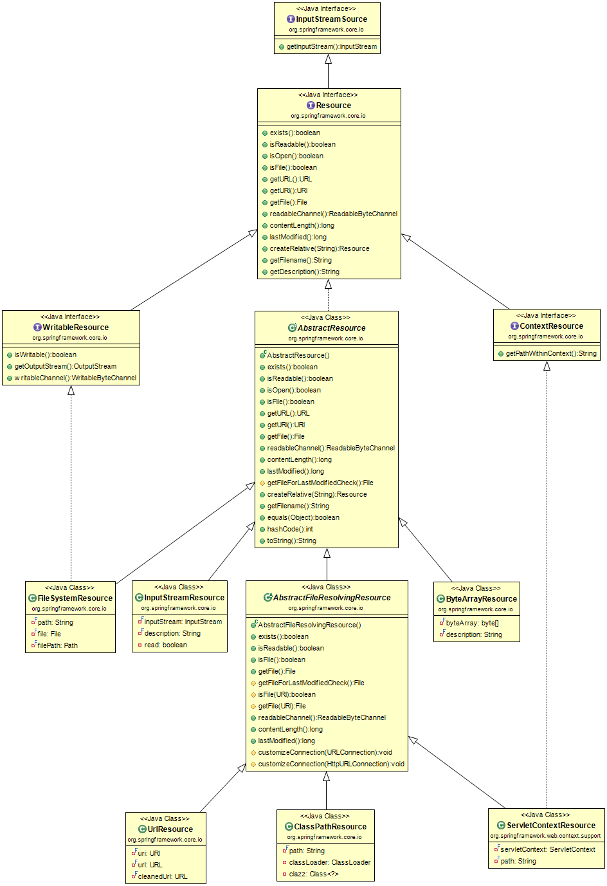

## Resource

本文将介绍Spring如何处理资源，以及如何在Spring中使用资源。它包括下列主题:
* 介绍
* Resource接口
* 内置的资源实现
* ResourceLoader
* ResourceLoaderAware接口
* 资源依赖关系
* 应用程序上下文和资源路径

1. 介绍

    不幸的是，Java的标准Java .net.URL类和用于各种URL前缀的标准处理程序对于所有对底层资源的访问都不够充分。

2. Resource接口

    Spring的Resource接口是一个更强大的接口，用于抽象对底层资源的访问。

    ```java
    public interface Resource extends InputStreamSource {

        boolean exists();

        boolean isOpen();

        URL getURL() throws IOException;

        File getFile() throws IOException;

        Resource createRelative(String relativePath) throws IOException;

        String getFilename();

        String getDescription();

    }
    ```

    如上所见，Resource接口扩展了InputStreamSource接口

    ```java
    public interface InputStreamSource {

        InputStream getInputStream() throws IOException;

    }
    ```

    Resource比较重要的方法及说明

    方法|说明
    --|--
    getInputStream()|定位并打开资源，返回一个InputStream以便从资源中读取。
    boolean exists()|返回一个布尔值，指示该资源是否以物理形式实际存在。
    boolean isOpen()|返回一个布尔值，指示此资源是否表示具有打开流的句柄。
    String getDescription()|返回此资源的描述，用于处理该资源时的错误输出。这通常是完全限定的文件名或资源的实际URL。


3. 内置的Resource实现

    Spring包含了以下Resource实现

    * UrlResource
    * ClassPathResource
    * ServletContextResource
    * FileSystemResource
    * InputStreamResource
    * ByteArrayResource

    

    1. UrlResource

        url定位器的资源实现。UrlResource封装了java.net.URL，可用于访问通常可通过URL访问的任何对象，比如文件、HTTP目标、FTP目标和其他对象。所有URL都有一个标准化的字符串表示，因此可以使用适当的标准化前缀来表示不同URL类型的URL。这包括

        * 文件:用于访问文件系统路径
        * http:用于通过http协议访问资源
        * ftp:用于通过ftp访问资源，以及其他。

    2. ClassPathResource

        该类表示应该从类路径获得的资源。它使用线程上下文类加载器、给定的类加载器或给定的类来加载资源。

    3. ServletContextResource

        这是ServletContext资源的资源实现，用于解释相关web应用程序根目录中的相对路径。

        它始终支持流访问和URL访问，但允许java.io。只有在扩展了web应用程序存档并且资源实际位于文件系统上时，才可以访问文件。

    4. FileSystemResource

        这是java.io的资源实现。文件和java.nio.file。路径处理。它支持将解析作为文件和URL。

    5. InputStreamResource

        InputStream资源是给定InputStream的资源实现。只有在没有特定的资源实现可用时才应该使用它。特别是，尽可能选择ByteArrayResource或任何基于文件的资源实现。

    6. ByteArrayResource

        这是给定字节数组的资源实现。它为给定的字节数组创建ByteArrayInputStream。

        它对于从任何给定的字节数组加载内容都很有用，而不需要使用一次性的InputStreamResource。

4. ResourceLoader

    ResourceLoader接口是由能够返回(即加载)资源实例的对象实现的。

    ```java
    public interface ResourceLoader {

        Resource getResource(String location);

    }
    ```

    所有应用上下文都实现了ResourceLoader接口，因此所有应用上下文都能获取Resource实例。

    ```java
    Resource template = ctx.getResource("some/resource/path/myTemplate.txt");
    ```

    不同上下文获取的Resource实例不一样。
    * 如果ctx是ClassPathXmlApplicationContext，则上面代码返回ClassPathResource。
    * 如果ctx是FileSystemXmlApplicationContext，则上面代码返回FileSystemResource。
    * 如果ctx是WebApplicationContext，则上面代码返回ServletContextResource。

    也可以通过资源前缀，不管ctx是哪种上下文，强制返回需要的Resource实例。

    前缀|例子|说明
    --|--|--
    classpath:|classpath:com/myapp/config.xml|从类路径加载
    file:|file:///data/config.xml|从文件系统中作为URL加载。
    http:|https://myserver/logo.png|作为URL加载。
    (none)|/data/config.xml|取决于底层的ApplicationContext。

5. ResourceLoaderAware接口

    ResourceLoaderAware接口是一个特殊的回调接口，它标识希望使用ResourceLoader引用提供的组件

    ```java
    public interface ResourceLoaderAware {

        void setResourceLoader(ResourceLoader resourceLoader);
    }
    ```

    当类实现ResourceLoaderAware并部署到应用程序上下文中(作为spring管理的bean)时，应用程序上下文中将该类识别为ResourceLoaderAware。然后，应用程序上下文调用setResourceLoader(ResourceLoader)，并将自己作为参数提供(请记住，Spring中的所有应用程序上下文都实现了ResourceLoader接口)。
    

6. 资源依赖关系

    如果bean本身要通过某种动态过程来确定和提供资源路径，那么使用ResourceLoader接口来加载资源可能是有意义的。例如，考虑加载某种类型的模板，其中需要的特定资源取决于用户的角色。

    然后注入这些属性非常简单，因为所有应用程序上下文都注册并使用一个特殊的JavaBeans PropertyEditor，它可以将字符串路径转换为资源对象。因此，如果myBean具有Resource类型的模板属性，则可以为该资源配置一个简单的字符串。

    ```xml
    <bean id="myBean" class="...">
        <property name="template" value="some/resource/path/myTemplate.txt"/>
    </bean>
    ```

    如果需要强制使用特定的资源类型，可以使用前缀。下面两个例子展示了如何强制ClassPathResource和UrlResource(后者用于访问文件系统文件)

    ```xml
    <property name="template" value="classpath:some/resource/path/myTemplate.txt">
    ```

    ```xml
    <property name="template" value="file:///some/resource/path/myTemplate.txt"/>
    ```

7. 应用程序上下文和资源路径

    本节介绍如何使用资源创建应用程序上下文，包括使用XML的快捷方式、如何使用通配符和其他细节。

    1. 构造应用上下文

        应用程序上下文构造函数(针对特定的应用程序上下文类型)通常将字符串或字符串数组作为资源的位置路径

        比如加载ClassPath的配置文件

        ```java
        ApplicationContext ctx = new ClassPathXmlApplicationContext("conf/appContext.xml");
        ```

        或者加载文件系统的配置文件

        ```java
        ApplicationContext ctx = new FileSystemXmlApplicationContext("classpath:conf/appContext.xml");
        ```

        如果是这样的层级结构

        ```
        com/
            foo/
                services.xml
                daos.xml
                MessengerService.class
        ```

        可以这样加载

        ```java
        ApplicationContext ctx = new ClassPathXmlApplicationContext(new String[] {"services.xml", "daos.xml"}, MessengerService.class);
        ```

    2. 应用程序上下文构造函数资源路径中的通配符

        应用程序上下文构造函数值中的资源路径可以是简单的路径(如前面所示)，每个路径都有到目标资源的一对一映射，或者可以包含特殊的“classpath*:”前缀或内部ant样式的正则表达式(通过使用Spring的PathMatcher实用程序进行匹配)。后者都是有效的通配符。

        **注意，这种通配符特定于在应用程序上下文构造函数中使用资源路径(或者直接使用PathMatcher实用程序类层次结构时)，并在构造时解析。它与资源类型本身无关。您不能使用classpath*:前缀来构造实际的资源，因为资源每次只指向一个资源。**

        Ant风格模式

        ```
        /WEB-INF/*-context.xml
        com/mycompany/**/applicationContext.xml
        file:C:/some/path/*-context.xml
        classpath:com/mycompany/**/applicationContext.xml
        ```
    
    3. FileSystemResource警告

        FileSystemResource没有附加到FileSystemApplicationContext(也就是说，当FileSystemApplicationContext不是实际的ResourceLoader时)的文件系统资源按照您的期望处理绝对路径和相对路径。
        
        相对路径相对于当前工作目录，而绝对路径相对于文件系统的根。下面两者等价

        ```java
        ApplicationContext ctx = new FileSystemXmlApplicationContext("conf/context.xml");
        ```

        ```java
        ApplicationContext ctx = new FileSystemXmlApplicationContext("/conf/context.xml");
        ```

        在实践中，如果需要真正的绝对文件系统路径，应该避免将绝对路径与FileSystemResource或FileSystemXmlApplicationContext一起使用，并使用file: URL前缀强制使用UrlResource。

        ```java
        // actual context type doesn't matter, the Resource will always be UrlResource
        ctx.getResource("file:///some/resource/path/myTemplate.txt");
        ```

        ```java
        // force this FileSystemXmlApplicationContext to load its definition via a UrlResource
        ApplicationContext ctx = new FileSystemXmlApplicationContext("file:///conf/context.xml");
        ```

参考：https://docs.spring.io/spring/docs/5.1.6.RELEASE/spring-framework-reference/core.html#resources

