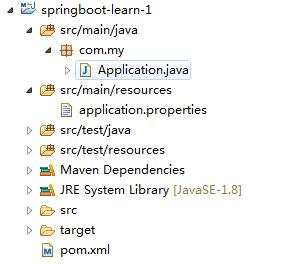

## 一、 SpringBoot概述

    springboot是什么？
    springboot不是对spring的增强，而是一个快速使用spring进行开发的框架。

    其产生的背景是因为随着动态语言(Scala，Groovy)的流行，Java语言开发显得尤其笨重，繁琐的配置，低下的开发效率，复杂的部署流程以及第三方技术集成难度大。

    在这种情况下springboot产生了，他使用的是(习惯优于配置)(项目中存在大量的配置，此外还内置一些习惯性配置，大大减少我们的工作量。使用springboot可以很容易创建一个独立运行(运行jar，内嵌servlet容器)、准生产级的基于spring框架的项目，使用springboot我们可以不用甚至只需要很少的spring配置。

## 二、 springboot核心功能

1. 独立运行的spring项目

    springboot可以以jar包形式直接运行，如 java -jar xxx.jar  优点是：节省服务器资源

2. 内嵌servlet容器

    springboot可以选择内嵌Tomcat，Jetty，这样我们无须以war包形式部署项目。

3. 提供starter简化Maven配置

    例如引入spring-boot-starter-web时会自动引入

4. 自动配置spring

    springboot会根据在类路径中的jar包，类，为jar包里的类自动配置Bean，这样会极大减少我们要使用的配置。当然springboot只考虑了大部分开发场景，并不是所有的场景，如果在实际的开发中我们需要

    自动配置Bean，而springboot不能满足，则可以自定义自动配置。

5. 准生产的应用监控

    springboot提供基于http，ssh，telnet对运行时的项目进行监控

6. 无代码生成和xml配置

    springboot大量使用spring4.x提供的注解新特性来实现无代码生成和xml配置。spring4.x提倡使用Java配置和注解配置组合，而springboot不需要任何xml配置即可实现spring的所有配置。

    综上我们可以得出：

    springboot让开发变得简单，让部署变得简单，让监控变得简单，让配置变得更简单。

    优点：
    * 快速构建项目
    * 对主流框架无缝集成
    * 项目可以独立运行，无需依赖外部servlet容器
    * 提供运行时的应用监控
    * 极大提高了开发，部署效率
    * 与Docker容器等集成方便

## 三、快速构建一个springboot项目

    构建一个支持web模块的springboot项目需要以下几个步骤：

    1. pom.xml引入springboot的依赖支持
    2. 一个程序入口类
    3. 一个项目配置文件（默认设置不用写也可以）


1. 先贴一下项目目录 
    
    

    * src/main/java 下的程序启动入口：Application 
    * src/main/resources下的配置文件：application.properties

    新建一个maven项目：

    在pom.xml中引入springboot的依赖

    ```xml
    <dependencies>
        <dependency>
            <groupId>org.springframework.boot</groupId>
            <artifactId>spring-boot-starter</artifactId>
        </dependency>
            <dependency>
            <groupId>org.springframework.boot</groupId>
            <artifactId>spring-boot-starter-web</artifactId>
        </dependency>
    </dependencies>
    ```

    ```
    - spring-boot-starter 模板：核心模块，包括自动配置支持、日志和YAML
    - spring-boot-starter-web 模块：web模块
    ```

2. 新建一个项目启动类：Application

    ```java
    @SpringBootApplication
    public class Application {

        public static void main(String[] args) {
            SpringApplication.run(Application.class, args);
        }

    }
    ```

    * @SpringBootApplication 程序启动的注解
    * @SpringBootApplication = @Configuration + @EnableAutoConfiguration + @ComponentScan
    * @Configuration的注解类标识这个类可以使用Spring IoC容器作为bean定义的来源， @Bean注解告诉Spring，一个带有@Bean的注解方法将返回一个对象，该对象应该被注册为在Spring应用程序上下文中的bean。
    * @EnableAutoConfiguration：能够自动配置spring的上下文，试图猜测和配置你想要的bean类，通常会自动根据你的类路径和你的bean定义自动配置。
    * @ComponentScan：会自动扫描指定包下的全部标有@Component的类，并注册成bean，当然包括@Component下的子注解@Service,@Repository,@Controller。

    ```
    到这里，一个简单的springboot就建成了
    运行程序入口类：Application，查看控制台，发现以下输出
    Tomcat started on port(s): 8080 (http)，就说tomcat已经成功启动，默认端口是8080
    ```

3. 在/resources下，新建application.properties

    server.port=9001 //修改启动端口为90011

4. 如果配置了application.properties，则走配置项，否则走自动的默认配置，就像默认的启动端口

    重新启动项目，访问http://localhost:9001/

    显示的是springboot默认的错误页面，为甚是错误页那？ 

    产生错误的原因是Not Found，404，就是没找到首页

5. 接下来模拟一个http请求

    * 新建包：/com.my.controller
    * 在其下新建类：LoginController
    ```java
    @RestController
    public class LoginController {

        @GetMapping("/sayHello")
        public String login(){

            return "hello xiaonuo";
        }
    }
    ```

    @RestController注解 等价于 @Controller+@ResponseBody 将返回值已json形式返回

    重启一下项目再次访问：http://localhost:9001/sayHello 
    可以看到页面输出了hello xiaonuo

    到这一个简单直观的springboot项目就完事儿了，并且通过一个sayHello模拟了一个http请求

参考：

https://www.cnblogs.com/gyjx2016/p/7478674.html

https://blog.csdn.net/qq_35783095/article/details/79161200