## SpringCloud-Eureka

微服务架构中最核心的部分是服务治理，服务治理最基础的组件是注册中心。随着微服务架构的发展，出现了很多微服务架构的解决方案，其中包括我们熟知的Dubbo和Spring Cloud。

关于注册中心的解决方案，dubbo支持了Zookeeper、Redis、Multicast和Simple，官方推荐Zookeeper。Spring Cloud支持了Zookeeper、Consul和Eureka，官方推荐Eureka。

两者之所以推荐不同的实现方式，原因在于组件的特点以及适用场景不同。简单来说：

ZK的设计原则是CP，即强一致性和分区容错性。他保证数据的强一致性，但舍弃了可用性，**如果出现网络问题可能会影响ZK的选举，导致ZK注册中心的不可用。**

Eureka的设计原则是AP，即可用性和分区容错性。他保证了注册中心的可用性，但舍弃了数据一致性，**各节点上的数据有可能是不一致的（会最终一致）。**

Eureka采用纯Java实现，除实现了注册中心基本的服务注册和发现之外，极大的满足注册中心的可用性，即使只有一台服务可用，也可以保证注册中心的可用性。

本文将聚焦到Eureka的内部实现原理，先从微服务架构的部署图介绍Eureka的总体架构，然后剖析服务信息的存储结构，最后探究跟服务生命周期相关的服务注册机制、服务续约机制、服务注销机制、服务剔除机制、服务获取机制、和服务同步机制。

1. Eureka总体架构

    下面是Eureka注册中心部署在多个机房的架构图，这正是他高可用性的优势（Zookeeper千万别这么部署）。

    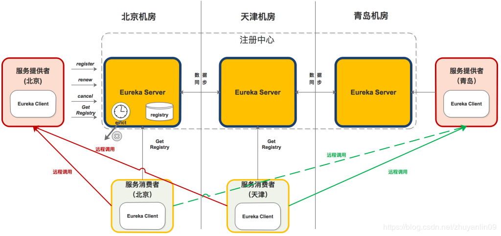

    1. 从组件功能看：

        * 黄色注册中心集群，分别部署在北京、天津、青岛机房；

        * 红色服务提供者，分别部署北京和青岛机房；

        * 淡绿色服务消费者，分别部署在北京和天津机房；

    2. 从机房分布看：

        * 北京机房部署了注册中心、服务提供者和服务消费者；

        * 天津机房部署了注册中心和服务消费者；

        * 青岛机房部署了注册中心和服务提供者；

2. 组件调用关系

    1. 服务提供者

        1. 启动后，向注册中心发起register请求，注册服务

        2. 在运行过程中，定时向注册中心发送renew心跳，证明“我还活着”。

        3. 停止服务提供者，向注册中心发起cancel请求，清空当前服务注册信息。

    2. 服务消费者

        1. 启动后，从注册中心拉取服务注册信息

        2. 在运行过程中，定时更新服务注册信息。

        3. 服务消费者发起远程调用：

            1. 服务消费者（北京）会从服务注册信息中选择同机房的服务提供者（北京），发起远程调用。只有同机房的服务提供者挂了才会选择其他机房的服务提供者（青岛）。

            2. 服务消费者（天津）因为同机房内没有服务提供者，则会按负载均衡算法选择北京或青岛的服务提供者，发起远程调用。

    3. 注册中心

        1. 启动后，从其他节点拉取服务注册信息。

        2. 运行过程中，定时运行evict任务，剔除没有按时renew的服务（包括非正常停止和网络故障的服务）。

        3. 运行过程中，接收到的register、renew、cancel请求，都会同步至其他注册中心节点。

        本文将详细说明上图中的registry、register、renew、cancel、getRegistry、evict的内部机制。

3. 数据存储结构

    既然是服务注册中心，必然要存储服务的信息，我们知道ZK是将服务信息保存在树形节点上。而下面是Eureka的数据存储结构：

    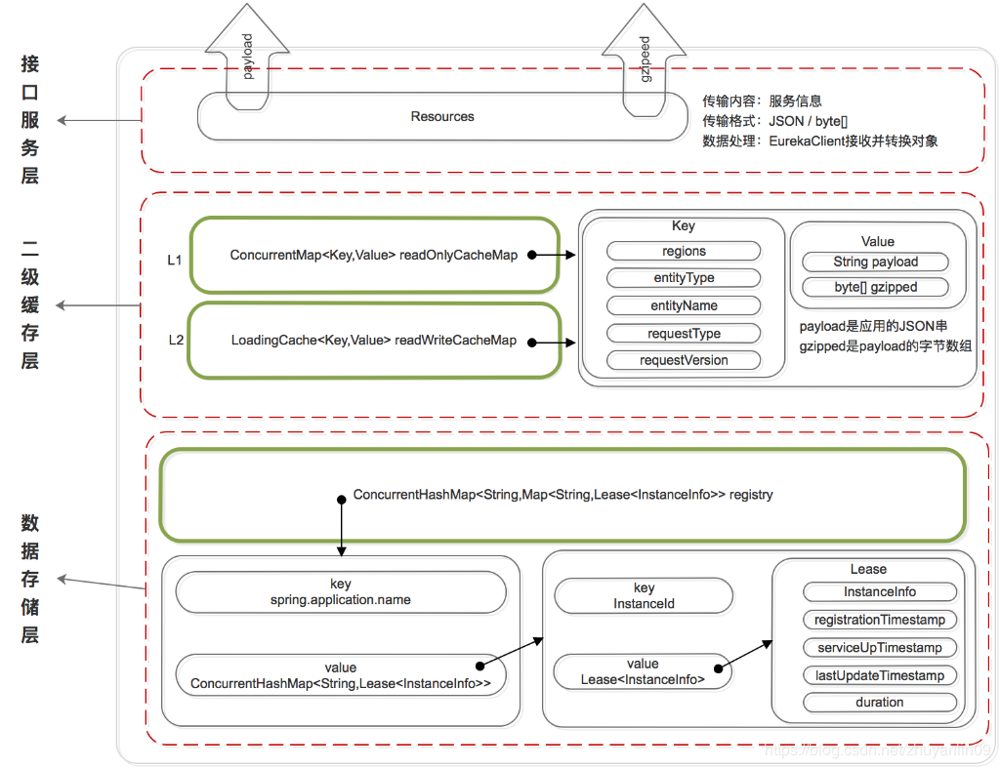

    Eureka的数据存储分了两层：数据存储层和缓存层。Eureka Client在拉取服务信息时，先从缓存层获取（相当于Redis），如果获取不到，先把数据存储层的数据加载到缓存中（相当于Mysql），再从缓存中获取。值得注意的是，数据存储层的数据结构是服务信息，而缓存中保存的是经过处理加工过的、可以直接传输到Eureka Client的数据结构。

    > Eureka这样的数据结构设计是把内部的数据存储结构与对外的数据结构隔离开了，就像是我们平时在进行接口设计一样，对外输出的数据结构和数据库中的数据结构往往都是不一样的。

    1. 数据存储层

        这里为什么说是存储层而不是持久层？因为rigistry本质上是一个双层的ConcurrentHashMap，存储在内存中的。

        第一层的key是spring.application.name，value是第二层ConcurrentHashMap；

        第二层ConcurrentHashMap的key是服务的InstanceId，value是Lease对象；

        Lease对象包含了服务详情和服务治理相关的属性。

    2. 二级缓存层

        Eureka实现了二级缓存来保存即将要对外传输的服务信息，数据结构完全相同。

        * 一级缓存：ConcurrentHashMap<Key,Value> readOnlyCacheMap，本质上是HashMap，无过期时间，保存服务信息的对外输出数据结构。

        * 二级缓存：Loading<Key,Value> readWriteCacheMap，本质上是guava的缓存，包含失效机制，保存服务信息的对外输出数据结构。

        既然是缓存，那必然要有更新机制，来保证数据的一致性。下面是缓存的更新机制：

        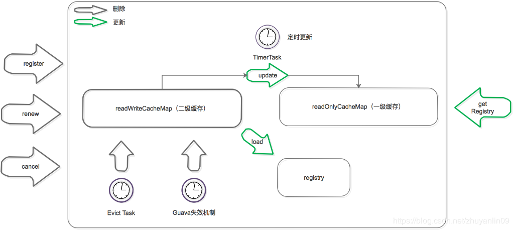

        更新机制包含删除和加载两个部分，上图黑色箭头表示删除缓存的动作，绿色表示加载或触发加载的动作。

        * **删除二级缓存：**

            1. Eureka Client发送register、renew和cancel请求并更新registry注册表之后，删除二级缓存；

            2. Eureka Server自身的Evict Task剔除服务后，删除二级缓存；

            3. 二级缓存本身设置了guava的失效机制，隔一段时间后自己自动失效；

        * **加载二级缓存：**

            1. Eureka Client发送getRegistry请求后，如果二级缓存中没有，就触发guava的load，即从registry中获取原始服务信息后进行处理加工，再加载到二级缓存中。

            2. Eureka Server更新一级缓存的时候，如果二级缓存没有数据，也会触发guava的load。

        * **更新一级缓存：**

            1. Eureka Server内置了一个TimerTask，定时将二级缓存中的数据同步到一级缓存（这个动作包括了删除和加载）。

            关于缓存的实现参考ResponseCacheImpl

4. 服务相关机制

    1. 服务注册机制(register)

        服务提供者、服务消费者、以及服务注册中心自己，启动后都会向注册中心注册服务（如果配置了注册）。下图是介绍如何完成服务注册的：

        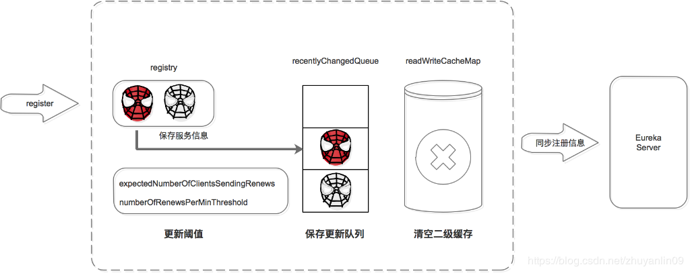

        注册中心服务接收到register请求后：

        1. 保存服务信息，将服务信息保存到registry中；

        2. 更新队列，将此事件添加到更新队列中，供Eureka Client增量同步服务信息使用。

        3. 清空二级缓存，即readWriteCacheMap，用于保证数据的一致性。

        4. 更新阈值，供剔除服务使用。

        5. 同步服务信息，将此事件同步至其他的Eureka Server节点。

    2. 服务续约机制(renew)
        
        服务注册后，要定时（默认30S，可自己配置）向注册中心发送续约请求，告诉注册中心“我还活着”。

        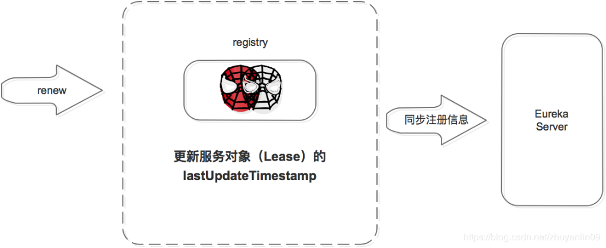

        注册中心收到续约请求后：

        1. 更新服务对象的最近续约时间，即Lease对象的lastUpdateTimestamp;

        2. 同步服务信息，将此事件同步至其他的Eureka Server节点。

        剔除服务之前会先判断服务是否已经过期，判断服务是否过期的条件之一是续约时间和当前时间的差值是不是大于阈值。

    3. 服务注销机制(cancel)

        服务正常停止之前会向注册中心发送注销请求，告诉注册中心“我要下线了”。

        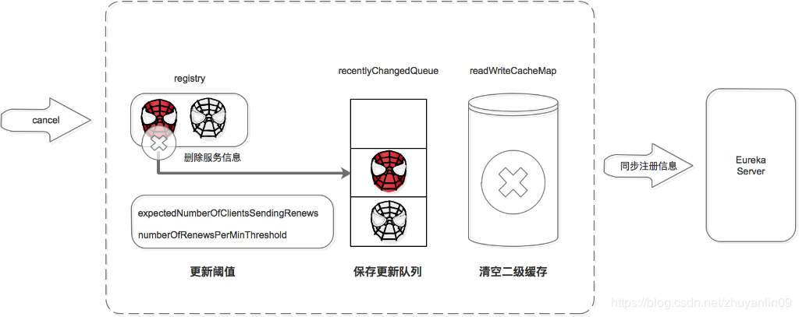

        注册中心服务接收到cancel请求后：

        1. 删除服务信息，将服务信息从registry中删除；

        2. 更新队列，将此事件添加到更新队列中，供Eureka Client增量同步服务信息使用。

        3. 清空二级缓存，即readWriteCacheMap，用于保证数据的一致性。

        4. 更新阈值，供剔除服务使用。

        5. 同步服务信息，将此事件同步至其他的Eureka Server节点。

        服务正常停止才会发送Cancel，如果是非正常停止，则不会发送，此服务由Eureka Server主动剔除。

    4. 服务剔除机制(evict)

        Eureka Server提供了服务剔除的机制，用于剔除没有正常下线的服务。

        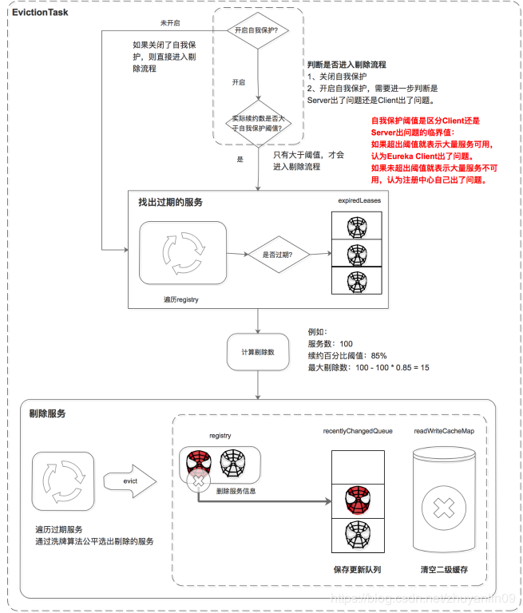

        服务的剔除包括三个步骤，首先判断是否满足服务剔除的条件，然后找出过期的服务，最后执行剔除。

        1. 判断是否满足服务剔除的条件

            有两种情况可以满足服务剔除的条件：

            1. 关闭了自我保护

            2. 如果开启了自我保护，需要进一步判断是Eureka Server出了问题，还是Eureka Client出了问题，如果是Eureka Client出了问题则进行剔除。

            这里比较核心的条件是自我保护机制，Eureka自我保护机制是为了防止误杀服务而提供的一个机制。Eureka的自我保护机制“谦虚”的认为如果大量服务都续约失败，则认为是自己出问题了（如自己断网了），也就不剔除了；反之，则是Eureka Client的问题，需要进行剔除。**而自我保护阈值是区分Eureka Client还是Eureka Server出问题的临界值：如果超出阈值就表示大量服务可用，少量服务不可用，则判定是Eureka Client出了问题。如果未超出阈值就表示大量服务不可用，则判定是Eureka Server出了问题。**

            条件1中如果关闭了自我保护，则通通认为是Eureka Client的问题，把没按时续约的服务都剔除掉（这里有剔除的最大值限制）。

            这里比较难理解的是阈值的计算：

            * 自我保护阈值 = 服务总数 * 每分钟续约数 * 自我保护阈值因子。

            * 每分钟续约数 =（60S/客户端续约间隔）

            最后自我保护阈值的计算公式为：

            * 自我保护阈值 = 服务总数 * （60S/客户端续约间隔） * 自我保护阈值因子。

            **举例**：如果有100个服务，续约间隔是30S，自我保护阈值0.85。

            自我保护阈值=100 * 60 / 30 * 0.85 = 170。

            * 如果上一分钟的续约数=180>170，则说明大量服务可用，是服务问题，进入剔除流程；

            * 如果上一分钟的续约数=150<170，则说明大量服务不可用，是注册中心自己的问题，进入自我保护模式，不进入剔除流程。

        2. 找出过期的服务

            遍历所有的服务，判断上次续约时间距离当前时间大于阈值就标记为过期。并将这些过期的服务保存到集合中。

        3. 剔除服务

            在剔除服务之前先计算剔除的数量，然后遍历过期服务，通过洗牌算法确保每次都公平的选择出要剔除的任务，最后进行剔除。

            执行剔除服务后：

            1. 删除服务信息，从registry中删除服务。

            2. 更新队列，将当前剔除事件保存到更新队列中。

            3. 清空二级缓存，保证数据的一致性。

            > 实现过程参考AbstractInstanceRegistry.evict()方法。

    5. 服务获取机制

        Eureka Client获取服务有两种方式，全量同步和增量同步。获取流程是根据Eureka Server的多层数据结构进行的：

        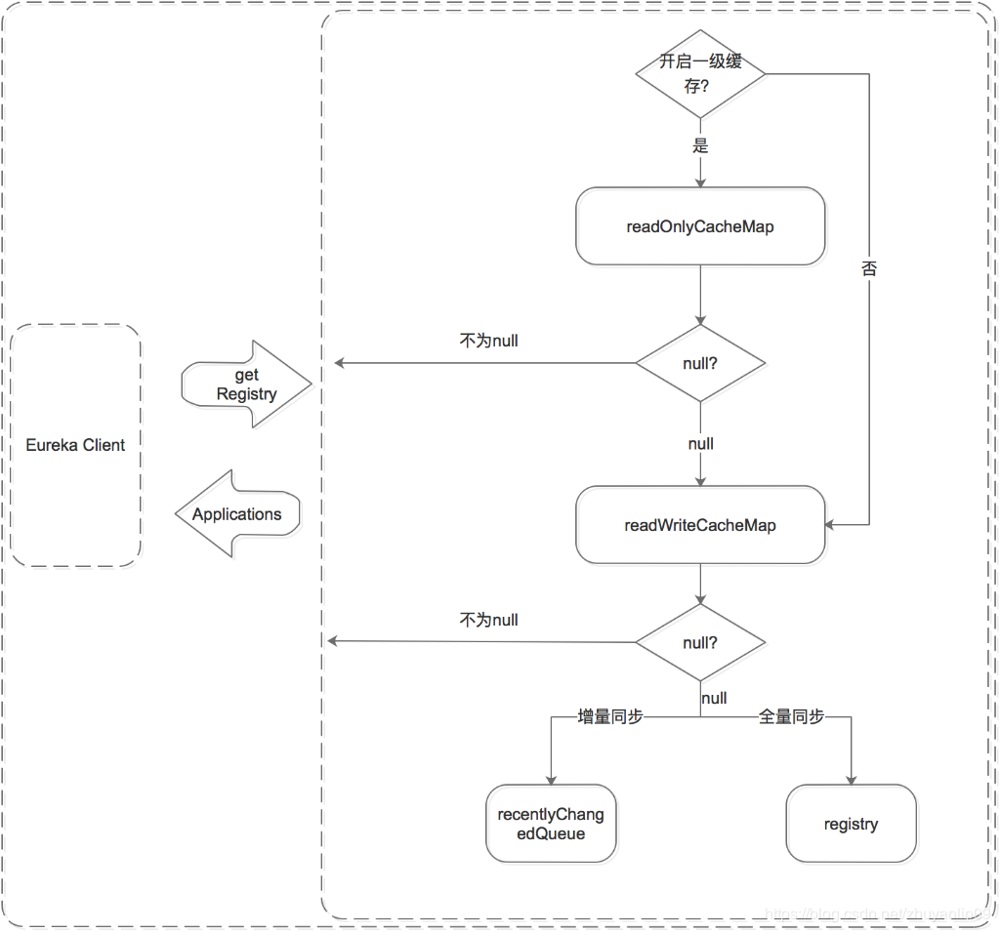

        无论是全量同步还是增量同步，都是先从缓存中获取，如果缓存中没有，则先加载到缓存中，再从缓存中获取。（registry只保存数据结构，缓存中保存ready的服务信息。）

        1. 先从一级缓存中获取

            1. 先判断是否开启了一级缓存

            2. 如果开启了则从一级缓存中获取，如果存在则返回，如果没有，则从二级缓存中获取

            3. 如果未开启，则跳过一级缓存，从二级缓存中获取

        2. 再从二级缓存中获取

            1. 如果二级缓存中存在，则直接返回；

            2. 如果二级缓存中不存在，则先将数据加载到二级缓存中，再从二级缓存中获取。
            
        注意：加载时需要判断是增量同步还是全量同步，**增量同步从recentlyChangedQueue中load，全量同步从registry中load**。

    6. 服务同步机制

        服务同步机制是用来同步Eureka Server节点之间服务信息的。它包括Eureka Server启动时的同步和运行过程中的同步。

        1. 启动时同步

            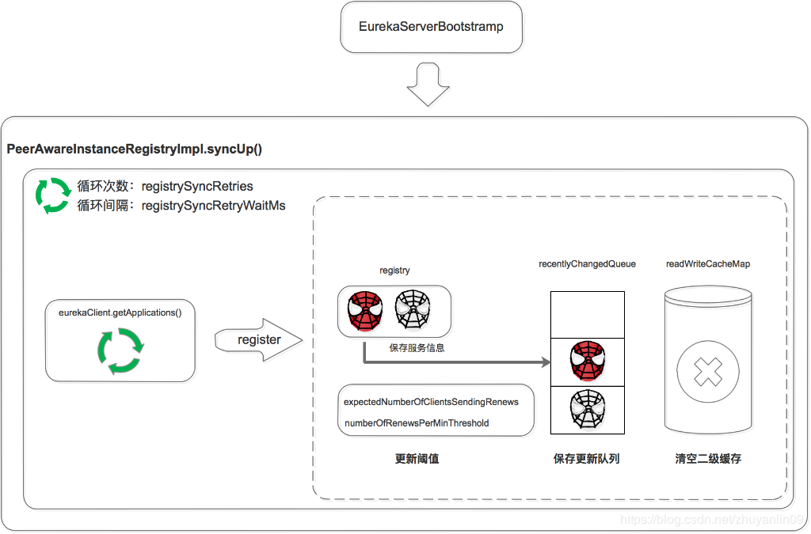

            Eureka Server启动后，遍历eurekaClient.getApplications获取服务信息，并将服务信息注册到自己的registry中。

            注意这里是两层循环，第一层循环是为了保证已经拉取到服务信息，第二层循环是遍历拉取到的服务信息。

        2. 运行过程中同步

            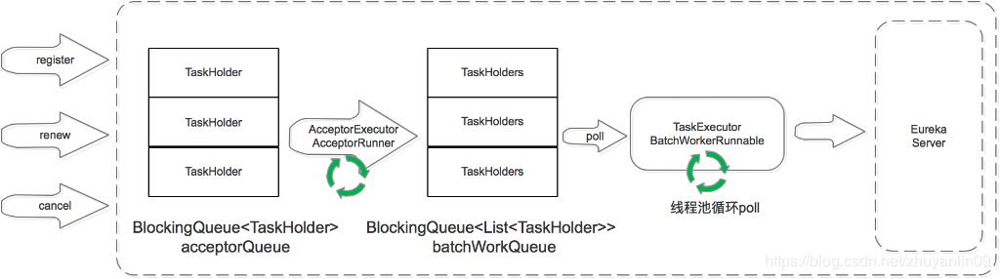

            当Eureka Server节点有register、renew、cancel请求进来时，会将这个请求封装成TaskHolder放到acceptorQueue队列中，然后经过一系列的处理，放到batchWorkQueue中。

            TaskExecutor.BatchWorkerRunnable是个线程池，不断的从batchWorkQueue队列中poll出TaskHolder，然后向其他Eureka Server节点发送同步请求。

        这里省略了两个部分：

        一个是在acceptorQueue向batchWorkQueue转化时，省略了中间的processingOrder和pendingTasks过程。

        另一个是当同步失败时，会将失败的TaskHolder保存到reprocessQueue中，重试处理。

### 写在最后

对微服务解决方案Dubbo和Spring Cloud的对比非常多，这里对注册中心做个简单对比。

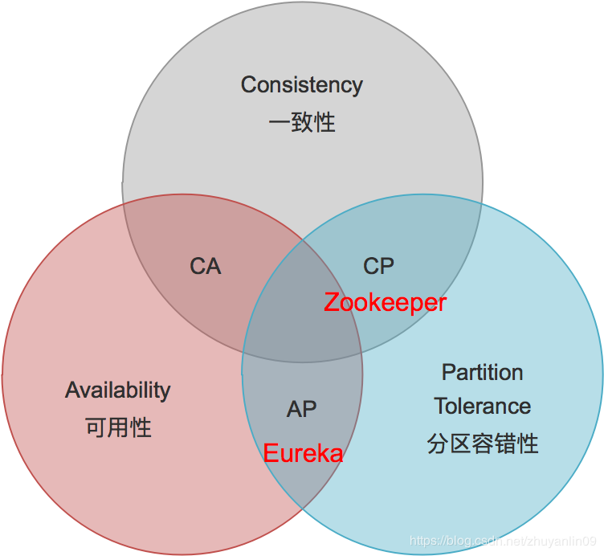

对比|Zookeeper|Eureka
--|--|--
设计原则|CP|AP
优点|数据强一致|服务高可用
缺点|网络分区会影响Leader选举，超过阈值后集群不可用|服务节点间的数据可能不一致；Client-Server间的数据可能不一致；
适用场景|单机房集群，对数据一致性要求较高|云机房集群，跨越多机房部署；对注册中心服务可用性要求较高

原文：https://blog.csdn.net/zhuyanlin09/article/details/89598245