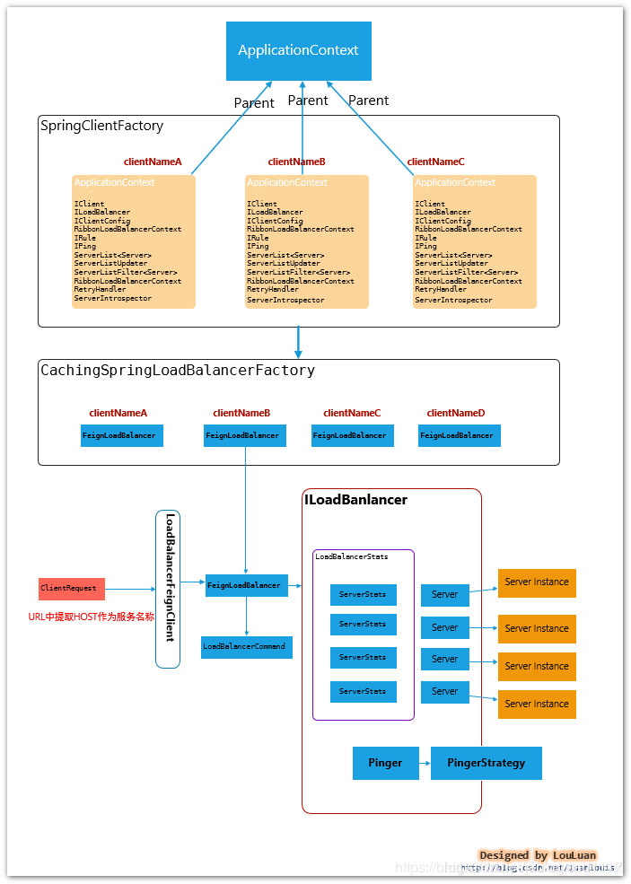
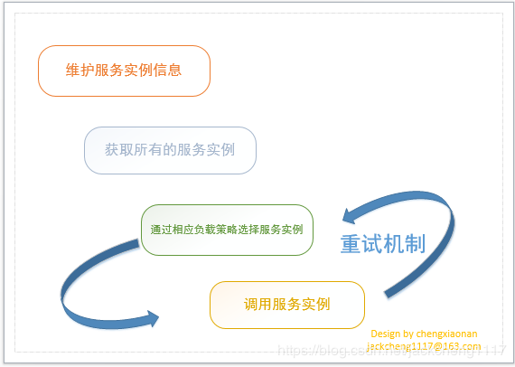
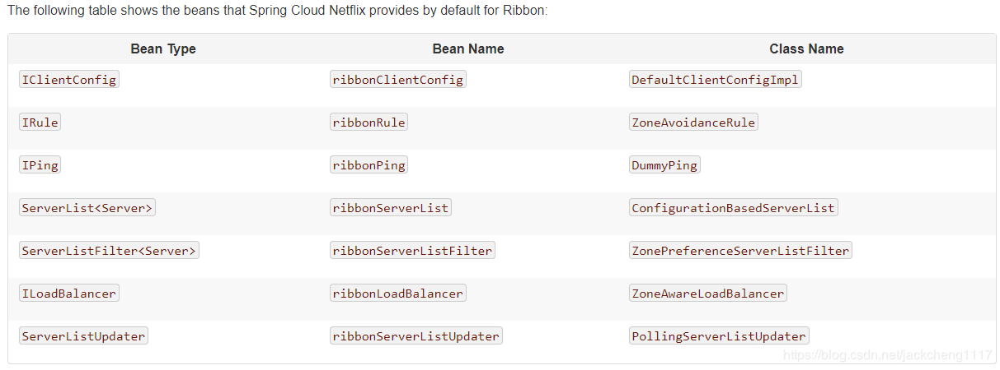
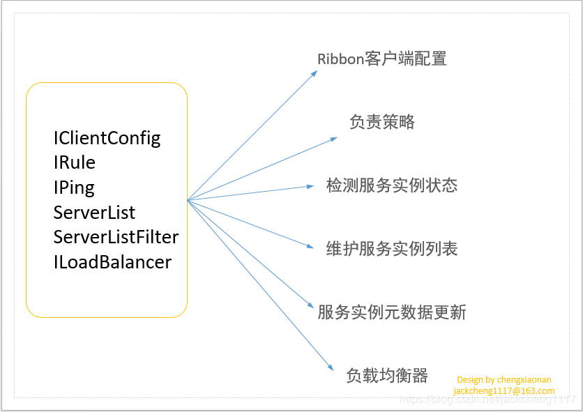
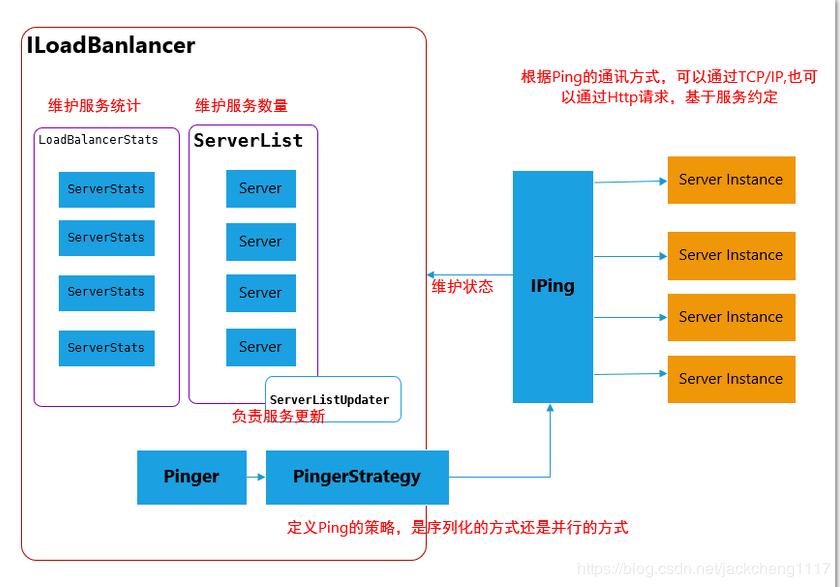
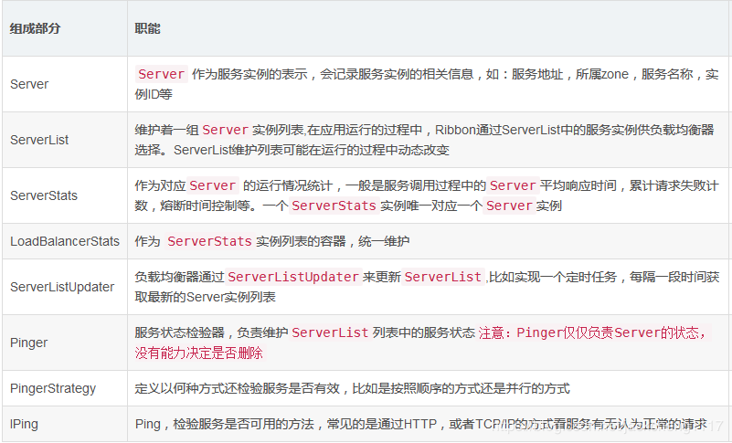
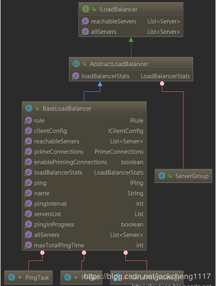
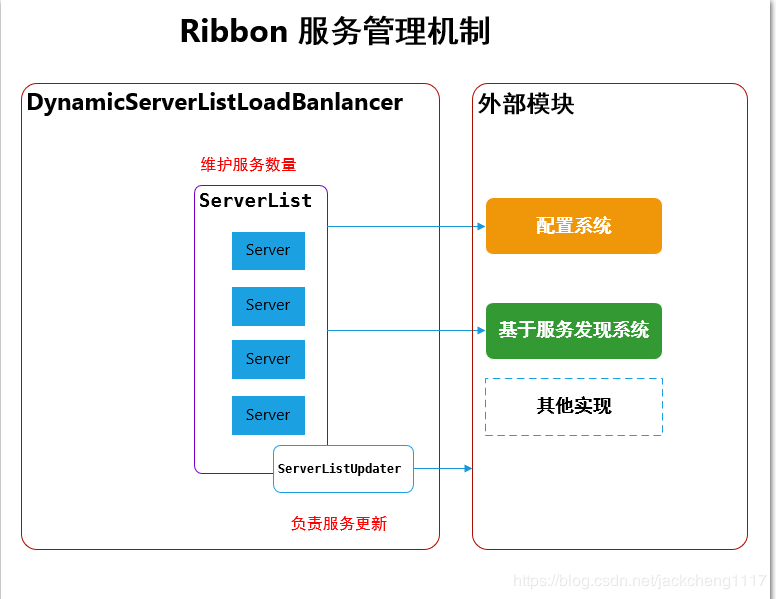
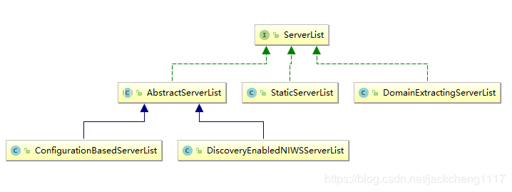
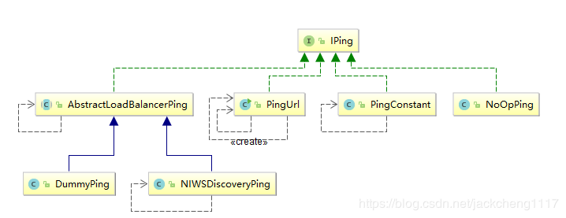

## SpringCloudRibbon设计原理

### 一.Spring集成下的Ribbon工作结构

SpringCloud集成模式下的Ribbon有以下几个特征：

1. Ribbon服务配置方式

    每一个服务配置都有一个SpringApplicationContext上下文，用于加载各自服务的实例。
    比如，当前SpringCloud系统内，有如下几个服务：

    服务名称|角色|依赖服务
    --|--|--
    APP|APP服务|Order、User
    Order|订单服务|User
    User|用户服务|无

    App服务在实际使用中会用到order和user模块。那么在App服务的Spring上下文中，会为Order和user分别创建一个子ApplicationContext，用于加载各自服务模块的配置，也就说客户端的配置相互独立互不影响。

2. Feign下集成模式

    在使用Feign作为客户端时，最终请求会转发成http://<服务名称>/<relative-path-to-service>的格式，通过LoadBalancerFeignClient，提取出服务标识<服务名称>，然后根据服务名称在上下文中查找对应服务的负载均衡器FeignLoadBalancer，负载均衡器负责根据既有的服务实例的统计信息，挑选出最合适的服务实例

### 二.Ribbon设计原理

使用过SpringCloud都应该知道Ribbon组件在服务调用中起到了负载的作用。那么一个完整的负载过程有哪些步骤呢？

那么Ribbon也不例外，如图所示是Ribbon官方提供的Ribbon组件核心接口：

其中Ribbon最最核心的是ILoadBalance接口，因为该接口在其他接口的基础上最终完成了负载，那么本节将以ILoadBalance接口为入口讲解Ribbon设计原理。

1. ILoadBalancer-负载均衡器核心设计

    LoadBalancer的职能主要有三个：

    * 维护Sever列表的数量(新增、更新、删除等)
    * 维护Server列表的状态(状态更新)
    * 当请求Server实例时，能否返回最合适的Server实例

    本节将围绕这三个职能讲解负载均衡器

    先熟悉一下ILoadBalancer实现原理图：

    

    

    

    1. 维护Sever列表的数量(新增、更新、删除等)

        单从服务列表维护的角度上，Ribbon结构如下：

        

        Server列表维护从实现上分为两类：

        1. 基于配置的服务列表(ConfigurationBasedServerList)

            这种方式一般是通过配置文件，静态地配置服务器列表，这种方式相对而言比较简单，但并不是意味着在机器运行的时候就一直不变。netflix在做Springcloud套件时，使用了分布式配置框架netflixarchaius，archaius框架有一个特点是会动态的监控配置文件的变化，将变化刷新到各个应用上。也就是说，当我们在不关闭服务的情况下，如果修改了基于配置的服务列表时,服务列表可以直接刷新

        2. 结合服务发现组件（如Eureka）的服务注册信息动态维护服务列表(DiscoveryEnabledNIWSServerList)

            基于SpringCloud框架下，服务注册和发现是一个分布式服务集群必不可少的一个组件，它负责维护不同的服务实例（注册、续约、取消注册），本文将介绍和Eureka集成模式下，如何借助Eureka的服务注册信息动态刷新ribbon的服务列表一般使用SpringCloudNetflix套件都会使用到Ribbon组件，所以将基于第二种方式讲解Server列表维护：即借助Eureka服务中心动态维护Ribbon服务列表。

            如上图所示，Ribbon是通过ServerList来维护Server列表的，即对应官方文档中说明的ServerList接口。

            

    2. 维护Server列表的状态(状态更新)

        Server列表的维护是通过IPing、Pinger、IPingStrategy一起来维护的：

        

        1. Iping接口

            主要用于判断服务实例是否是存活的

            

            接口实现|描述
            --|--
            PingUrl|该实现是通过ping服务的指定url方式发送http请求判断服务是否存活
            PingConstant|提供true/false参数指定返回服务是否存活
            NoOpPing|没有执行任何逻辑，直接返回true,即服务是存活的
            DummyPing|Ribbon默认实现 直接返回true,即服务是存活的
            NIWDiscoveryPing|SpringCloud继承下默认实现通过eurekaClient获取服务状态进而判断服务是否存活

        2. Pinger接口

            主要通过Timer开启PingTask定时任务去调用Pinger去获取服务状态，进而进行后续状态改变通知

        3. IPingStrategy接口

            SerialPingStrategy是IpingStrategy默认实现类：通过遍历服务列表一个一个ping服务获取服务状态

    3. 如何从服务列表中挑选一个合适的服务

        从上面的阐述中已经知道Ribbon是通过ServerList维护Server列表的。但是Ribbon还提供了另外一个接口ServerListFilter。该接口主要是对ServerList中的服务列表进行再过滤，返回满足过滤器条件的服务实例列表。

        ServerListFilter核心实现：ZoneAffinityServerListFilter

        Ribbon默认采取了区域优先的过滤策略，即当Server列表中，过滤出和当前实例所在的区域（zone）一致的server列表
        与此相关联的，Ribbon有两个相关得配置参数：

        控制参数|说明|默认值
        --|--|--
        \<service-name>.ribbon.EnableZoneAffinity|是否开启区域优先|false
        \<service-name>.ribbon.EnableZoneExclusivity|是否采取区域排他性，即只返回和当前Zone一致的服务实例|false
        \<service-name>.ribbon.zoneAffinity.maxLoadPerServer|每个Server上的最大活跃请求负载数阈值|0.6
        \<service-name>.ribbon.zoneAffinity.maxBlackOutServesrPercentage|最大断路过滤的百分比|0.8
        \<service-name>.ribbon.zoneAffinity.minAvailableServers|最少可用的服务实例阈值|2

原文：https://blog.csdn.net/luanlouis/article/details/83060310