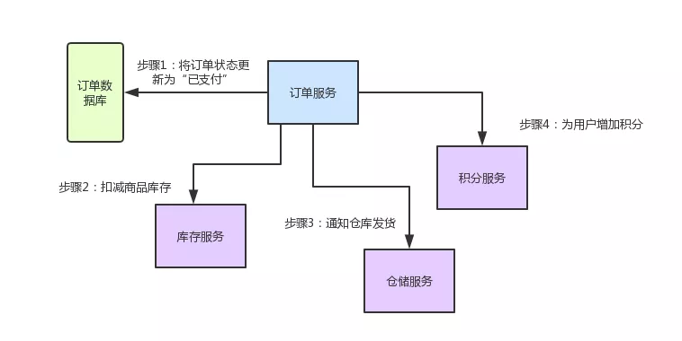
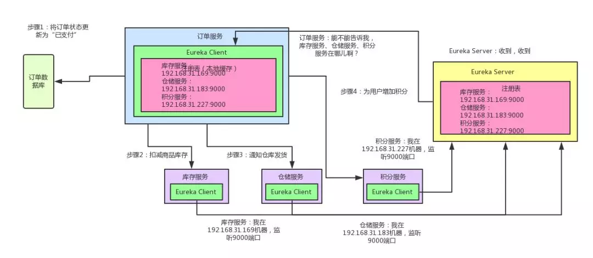
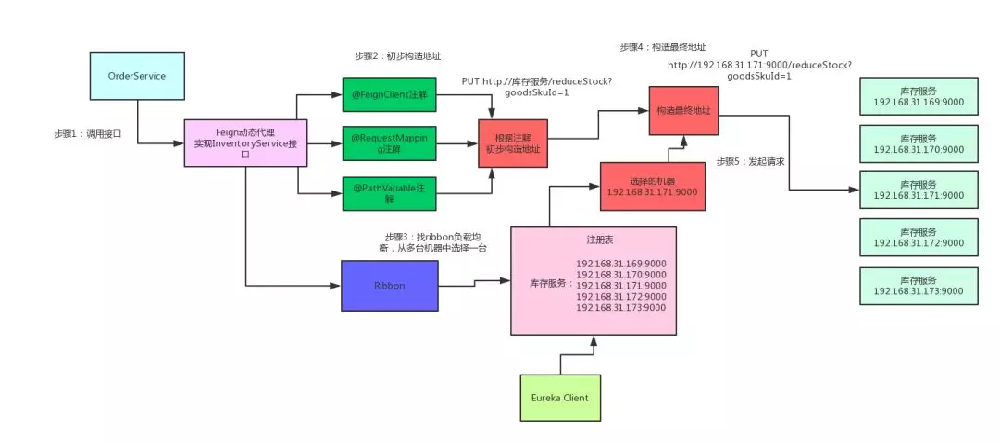
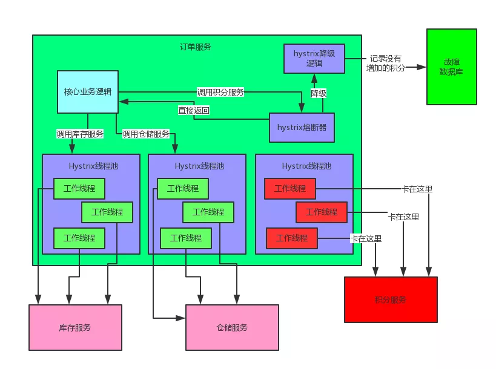
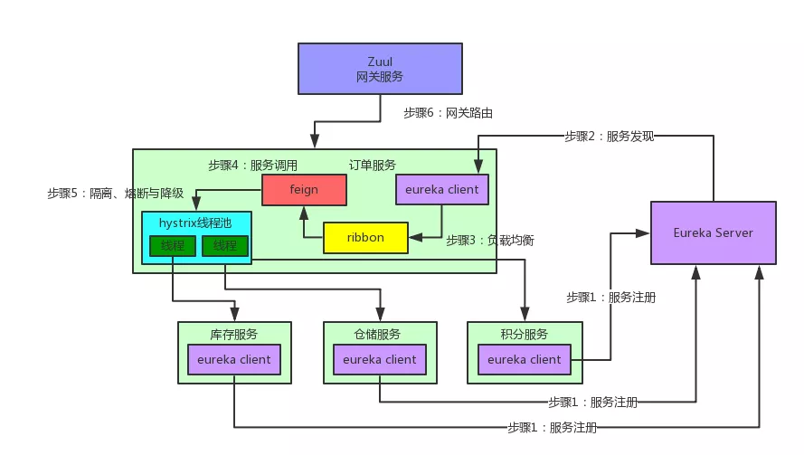

## springcloud 案例说明

毫无疑问，Spring Cloud 是目前微服务架构领域的翘楚，无数的书籍博客都在讲解这个技术。


不过大多数讲解还停留在对 Spring Cloud 功能使用的层面，其底层的很多原理，很多人可能并不知晓。

因此本文将通过大量的手绘图，给大家谈谈 Spring Cloud 微服务架构的底层原理。

实际上，Spring Cloud 是一个全家桶式的技术栈，它包含了很多组件。本文先从最核心的几个组件，也就是 Eureka、Ribbon、Feign、Hystrix、Zuul 入手，来剖析其底层的工作原理。

1. 业务场景介绍

    先来给大家说一个业务场景，假设咱们现在开发一个电商网站，要实现支付订单的功能。

    **流程如下：**

    * 创建一个订单后，如果用户立刻支付了这个订单，我们需要将订单状态更新为“已支付”。
    * 扣减相应的商品库存。
    * 通知仓储中心，进行发货。
    * 给用户的这次购物增加相应的积分。

    针对上述流程，我们需要有订单服务、库存服务、仓储服务、积分服务。

    **整个流程的大体思路如下：**

    用户针对一个订单完成支付之后，就会去找订单服务，更新订单状态。

    * 订单服务调用库存服务，完成相应功能。
    * 订单服务调用仓储服务，完成相应功能。
    * 订单服务调用积分服务，完成相应功能。

    至此，整个支付订单的业务流程结束。下面这张图，清晰表明了各服务间的调用过程：

    

    好！有了业务场景之后，咱们就一起来看看 Spring Cloud 微服务架构中，这几个组件如何相互协作，各自发挥的作用以及其背后的原理。

2. Spring Cloud 核心组件：Eureka(注册服务)

    **咱们来考虑第一个问题**：订单服务想要调用库存服务、仓储服务，或者积分服务，怎么调用？

    订单服务压根儿就不知道人家库存服务在哪台机器上啊！它就算想要发起一个请求，都不知道发送给谁，有心无力！

    这时候，就轮到 Spring Cloud Eureka 出场了。Eureka 是微服务架构中的注册中心，专门负责服务的注册与发现。

    咱们来看看下面的这张图，结合图来仔细剖析一下整个流程：

    

    如上图所示，库存服务、仓储服务、积分服务中都有一个 Eureka Client 组件，这个组件专门负责将这个服务的信息注册到 Eureka Server 中。

    说白了，就是告诉 Eureka Server，自己在哪台机器上，监听着哪个端口。

    而 Eureka Server 是一个注册中心，里面有一个注册表，保存了各服务所在的机器和端口号。

    订单服务里也有一个 Eureka Client 组件，这个 Eureka Client 组件会找 Eureka Server 问一下：库存服务在哪台机器啊？监听着哪个端口啊？仓储服务呢？积分服务呢？

    然后就可以把这些相关信息从 Eureka Server 的注册表中拉取到自己的本地缓存中来。

    这时如果订单服务想要调用库存服务，不就可以找自己本地的 Eureka Client 问一下库存服务在哪台机器？监听哪个端口吗？

    收到响应后，紧接着就可以发送一个请求过去，调用库存服务扣减库存的那个接口！同理，如果订单服务要调用仓储服务、积分服务，也是如法炮制。

    总结一下：

    **Eureka Client**：负责将这个服务的信息注册到 Eureka Server 中。

    **Eureka Server**：注册中心，里面有一个注册表，保存了各个服务所在的机器和端口号。

3. Spring Cloud 核心组件：Feign(简化请求)

    现在订单服务确实知道库存服务、积分服务、仓库服务在哪里了，同时也监听着哪些端口号了。

    但是新问题又来了：难道订单服务要自己写一大堆代码，跟其他服务建立网络连接，然后构造一个复杂的请求，接着发送请求过去，最后对返回的响应结果再写一大堆代码来处理吗？

    这是上述流程翻译的代码片段，咱们一起来看看，体会一下这种绝望而无助的感受！！！

    友情提示，前方高能：

    ```java
    closeableHttpcClient httpclient = HttpClients.createDefault();
    HttpPost httpPost = new HttpPost( "http://192.168.31.169:9000/");

    List<NamevaluePair> parameters = new ArrayL ist<NameValuePair>();
    parameters.add(new BasicNameValuePair("scope", "project" ));
    parameters.add(new BasicNameValuePair("q", "java"));

    UrlEncodedFormEntity formEntity = new UrlEncodedFormEntity(parameters);
    httpPost.setEntity(formEntity);
    httppost.setHeader(
        "user- Agent" ,
        "Mozilla/5.0 (Windows NT 6.3; win64; X64)"
    );

    closeableHttpResponse response = null;
    response = httpclient.execute(httpPost);
    if (response.getStatusLine().getStatusCode() == 200) {
        String content = Ent ityUtils. tostring(response. getEntity(), "UTF-8");
        System.out.println(content);
    }
    if (response != null) {
        response.close();
        httpclient.close();
    }
    ```

    看完上面那一大段代码，有没有感到后背发凉、一身冷汗？实际上你进行服务间调用时，如果每次都手写代码，代码量比上面那段要多至少几倍，所以这个事压根儿就不是地球人能干的。

    既然如此，那怎么办呢？别急，Feign 早已为我们提供好了优雅的解决方案。来看看如果用 Feign 的话，你的订单服务调用库存服务的代码会变成啥样？

    ```java
    @Feignclient(" inventory-service" )
    public class InventoryService {
        @RequestMapping(value="/reducestock/ {goodsskuId}", method = HttpMethod.PUT)
        @ResponseBody
        public ResultCode reduceS tock (@Pathvariable("goodsskuId") Long goodsskuId);
    }

    @Service
    public class OrderService {
        @Autowired
        private InventoryService inventoryService;

        public ResultCode payOrder() {
            //步骤1:更新本地数据库订单状态为“已支付”
            orderDAO.updatestatus(id, OrderStatus.PAYED);
            //步骤2:调用库存服务，扣减商品库存
            inventoryService.reducestock(goodsskuId);
        }
    }
    ```

    看完上面的代码什么感觉？是不是感觉整个世界都干净了，又找到了活下去的勇气！

    没有底层的建立连接、构造请求、解析响应的代码，直接就是用注解定义一个 Feign Client 接口，然后调用那个接口就可以了。

    人家 Feign Client 会在底层根据你的注解，跟你指定的服务建立连接、构造请求、发起请求、获取响应、解析响应，等等。这一系列脏活累活，人家 Feign 全给你干了。

    那么问题来了，Feign 是如何做到这么神奇的呢？很简单，Feign 的一个关键机制就是使用了动态代理。

    咱们一起来看看上面的图，结合图来分析：

    

    首先，如果你对某个接口定义了 @FeignClient 注解，Feign 就会针对这个接口创建一个动态代理。

    接着你要是调用那个接口，本质就是会调用 Feign 创建的动态代理，这是核心中的核心。

    Feign的动态代理会根据你在接口上的 @RequestMapping 等注解，来动态构造出你要请求的服务的地址。

    最后针对这个地址，发起请求、解析响应。

4. Spring Cloud 核心组件：Ribbon(简化寻址)

    说完了 Feign，还没完。现在新的问题又来了，如果人家库存服务部署在了 5 台机器上。

    **如下所示：**

    * 192.168.169:9000
    * 192.168.170:9000
    * 192.168.171:9000
    * 192.168.172:9000
    * 192.168.173:9000

    这下麻烦了！人家 Feign 怎么知道该请求哪台机器呢？这时 Spring Cloud Ribbon 就派上用场了。

    Ribbon 就是专门解决这个问题的。它的作用是负载均衡，会帮你在每次请求时选择一台机器，均匀的把请求分发到各个机器上。

    Ribbon 的负载均衡默认使用的最经典的 Round Robin 轮询算法。这是啥？

    简单来说，就是如果订单服务对库存服务发起 10 次请求，那就先让你请求第 1 台机器、然后是第 2 台机器、第 3 台机器、第 4 台机器、第 5 台机器，接着再来—个循环，第 1 台机器、第 2 台机器。。。以此类推。

    此外，Ribbon 是和 Feign 以及 Eureka 紧密协作，完成工作的，具体如下：

    * 首先 Ribbon 会从 Eureka Client 里获取到对应的服务注册表，也就知道了所有的服务都部署在了哪些机器上，在监听哪些端口号。
    * 然后 Ribbon 就可以使用默认的 Round Robin 算法，从中选择一台机器。
    * Feign 就会针对这台机器，构造并发起请求。

    对上述整个过程，再来一张图，帮助大家更深刻的理解：

    

5. Spring Cloud 核心组件：Hystrix(隔离、熔断和降级)

    在微服务架构里，一个系统会有很多的服务。以本文的业务场景为例：订单服务在一个业务流程里需要调用三个服务。

    现在假设订单服务自己最多只有 100 个线程可以处理请求，然后呢，积分服务不幸的挂了，每次订单服务调用积分服务的时候，都会卡住几秒钟，然后抛出—个超时异常。

    咱们一起来分析一下，这样会导致什么问题？如果系统处于高并发的场景下，大量请求涌过来的时候，订单服务的 100 个线程都会卡在请求积分服务这块，导致订单服务没有一个线程可以处理请求。

    然后就会导致别人请求订单服务的时候，发现订单服务也挂了，不响应任何请求了。

    上面这个，就是微服务架构中恐怖的服务**雪崩问题**，如下图所示：

    

    如上图，这么多服务互相调用，要是不做任何保护的话，某一个服务挂了，就会引起连锁反应，导致别的服务也挂。

    比如积分服务挂了，会导致订单服务的线程全部卡在请求积分服务这里，没有一个线程可以工作，瞬间导致订单服务也挂了，别人请求订单服务全部会卡住，无法响应。

    **但是我们思考一下，就算积分服务挂了，订单服务也可以不用挂啊！为什么？**

    我们结合业务来看：支付订单的时候，只要把库存扣减了，然后通知仓库发货就 OK 了。

    如果积分服务挂了，大不了等它恢复之后，慢慢人肉手工恢复数据！为啥一定要因为一个积分服务挂了，就直接导致订单服务也挂了呢？不可以接受！

    现在问题分析完了，如何解决？这时就轮到 Hystrix 闪亮登场了。Hystrix 是隔离、熔断以及降级的一个框架。啥意思呢？

    **说白了，Hystrix 会搞很多个小小的线程池**，比如订单服务请求库存服务是一个线程池，请求仓储服务是一个线程池，请求积分服务是一个线程池。每个线程池里的线程就仅仅用于请求那个服务。

    **打个比方**：现在很不幸，积分服务挂了，会咋样？当然会导致订单服务里那个用来调用积分服务的线程都卡死不能工作了啊！

    但由于订单服务调用库存服务、仓储服务的这两个线程池都是正常工作的，所以这两个服务不会受到任何影响。

    这个时候如果别人请求订单服务，订单服务还是可以正常调用库存服务扣减库存，调用仓储服务通知发货。

    只不过调用积分服务的时候，每次都会报错。但是如果积分服务都挂了，每次调用都要去卡住几秒钟干啥呢？有意义吗？当然没有！

    所以我们直接对积分服务熔断不就得了，比如在 5 分钟内请求积分服务直接就返回了，不要去走网络请求卡住几秒钟，这个过程，就是所谓的熔断！

    那人家又说，兄弟，积分服务挂了你就熔断，好歹你干点儿什么啊！别啥都不干就直接返回啊？

    没问题，咱们就来个降级：每次调用积分服务，你就在数据库里记录一条消息，说给某某用户增加了多少积分，因为积分服务挂了，导致没增加成功！

    这样等积分服务恢复了，你可以根据这些记录手工加一下积分。这个过程，就是所谓的降级。

    为帮助大家更直观的理解，接下来用一张图，梳理一下 Hystrix 隔离、熔断和降级的全流程：

    

6. Spring Cloud 核心组件：Zuul(降级、限流、认证授权、安全)

    说完了 Hystrix，接着给大家说说最后一个组件：Zuul，也就是微服务网关。这个组件是负责网络路由的。

    不懂网络路由？行，那我给你说说，如果没有 Zuul 的日常工作会怎样？

    假设你后台部署了几百个服务，现在有个前端兄弟，人家请求是直接从浏览器那儿发过来的。

    **打个比方**：人家要请求一下库存服务，你难道还让人家记着这服务的名字叫做 inventory-service？部署在 5 台机器上？

    就算人家肯记住这一个，你后台可有几百个服务的名称和地址呢？难不成人家请求一个，就得记住一个？你要这样玩儿，那真是友谊的小船，说翻就翻！

    上面这种情况，压根儿是不现实的。所以一般微服务架构中都必然会设计一个网关在里面。

    像 Android、iOS、PC 前端、微信小程序、H5 等等，不用去关心后端有几百个服务，就知道有一个网关，所有请求都往网关走，网关会根据请求中的一些特征，将请求转发给后端的各个服务。

    而且有一个网关之后，还有很多好处，比如可以做统一的降级、限流、认证授权、安全，等等。

7. 总结

    最后再来总结一下，上述几个 Spring Cloud 核心组件，在微服务架构中，分别扮演的角色：

    * **Eureka**：各个服务启动时，Eureka Client 都会将服务注册到 Eureka Server，并且 Eureka Client 还可以反过来从 Eureka Server 拉取注册表，从而知道其他服务在哪里。

    * **Ribbon**：服务间发起请求的时候，基于 Ribbon 做负载均衡，从一个服务的多台机器中选择一台。

    * **Feign**：基于 Feign 的动态代理机制，根据注解和选择的机器，拼接请求 URL 地址，发起请求。

    * **Hystrix**：发起请求是通过 Hystrix 的线程池来走的，不同的服务走不同的线程池，实现了不同服务调用的隔离，避免了服务雪崩的问题。

    * **Zuul**：如果前端、移动端要调用后端系统，统一从 Zuul 网关进入，由 Zuul 网关转发请求给对应的服务。

    以上就是我们通过一个电商业务场景，阐述了 Spring Cloud 微服务架构几个核心组件的底层原理。

    文字总结还不够直观？没问题！我们将 Spring Cloud 的 5 个核心组件通过一张图串联起来，再来直观的感受一下其底层的架构原理：

    

原文：https://mp.weixin.qq.com/s?__biz=MjM5ODI5Njc2MA==&mid=2655820426&idx=1&sn=2777d89aa7597c2149ee3151d4bdd334&chksm=bd74d75d8a035e4b23edfa7f973f0723d496a051c31a8577ebbd8705a3b622e982ff8714923d&scene=21#wechat_redirect