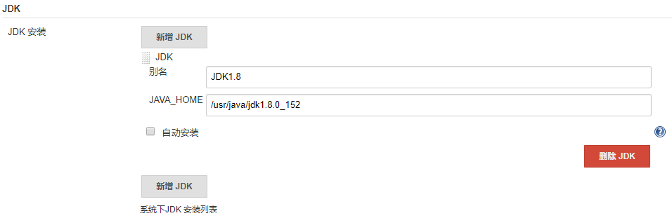
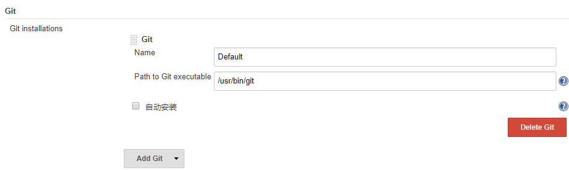
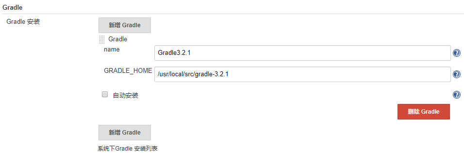
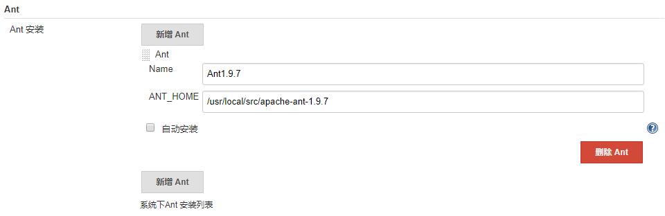
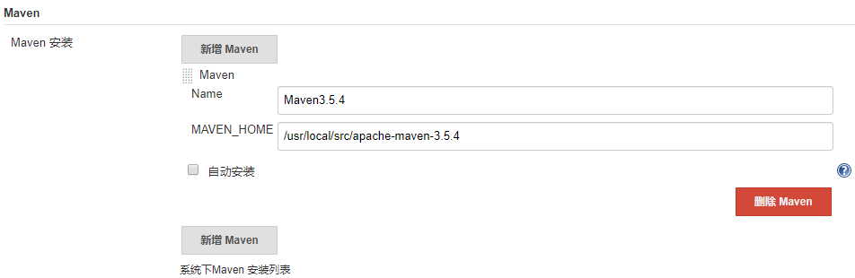
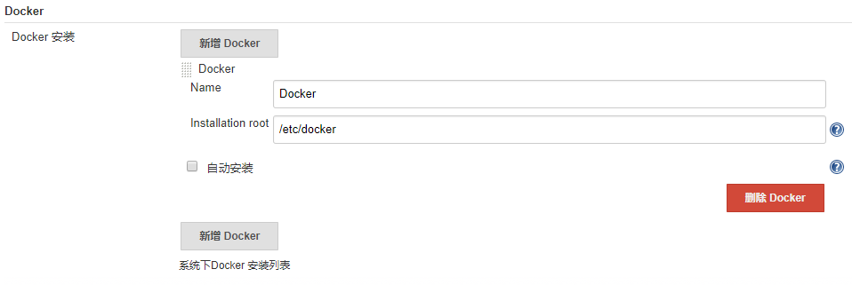

## 全局工具配置

jenkins在自动部署时，依赖很多工具，以下是全局工具配置中常用的工具

配置项|服务器安装路径
--|--
JDK|/usr/java/jdk1.8.0_152
Git|/usr/bin/git
Gradle|/usr/local/src/gradle-3.2.1
Ant|/usr/local/src/apache-ant-1.9.7
Maven|/usr/local/src/apache-maven-3.5.4
Docker|/etc/docker

1. JDK
   

2. Git
   

3. Gradle
   

4. Ant
   

5. Maven
   

6. Docker（可能不对）
   